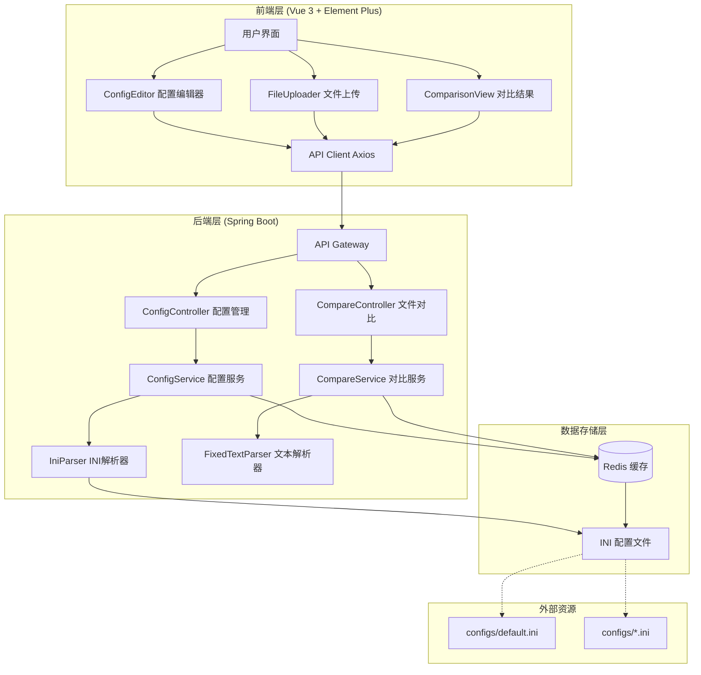
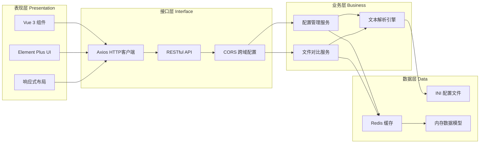
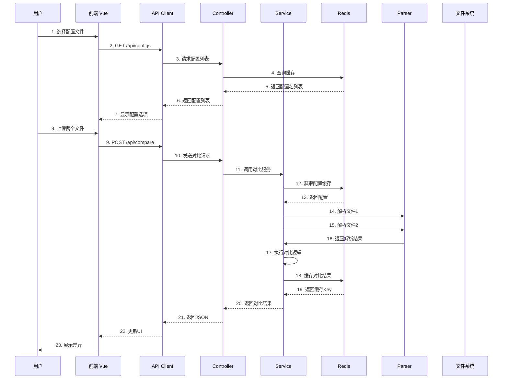
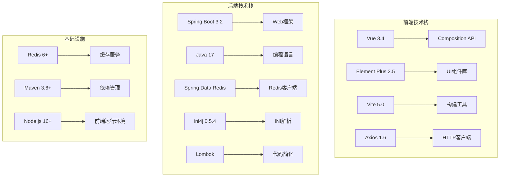
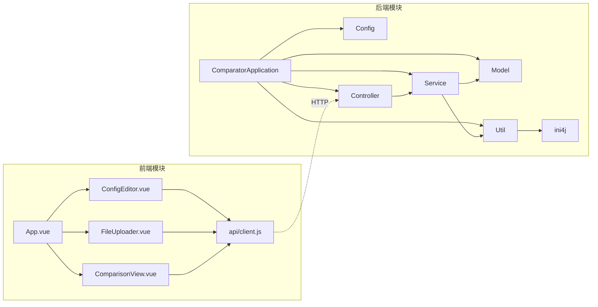
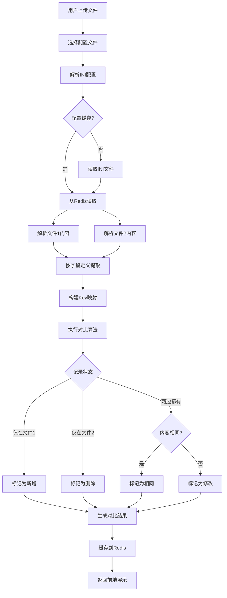
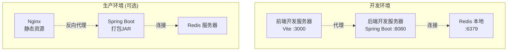
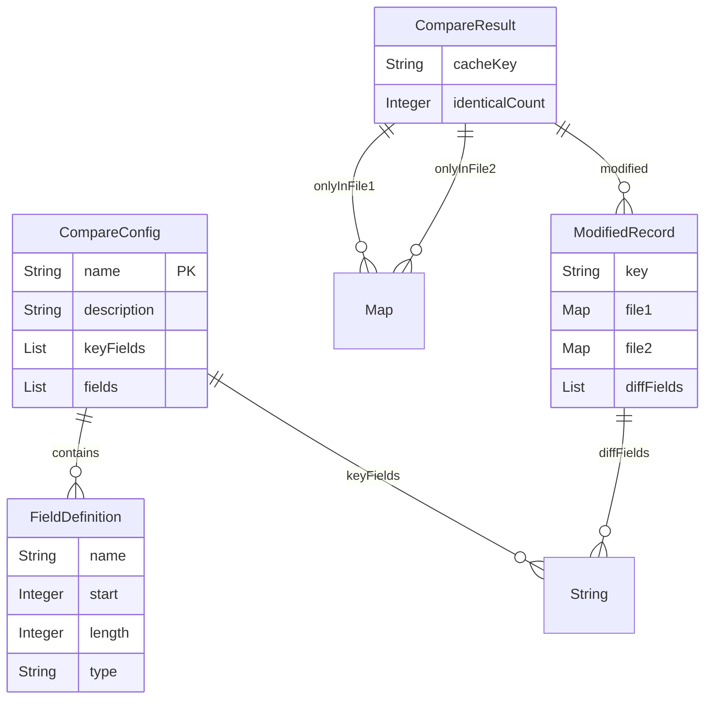
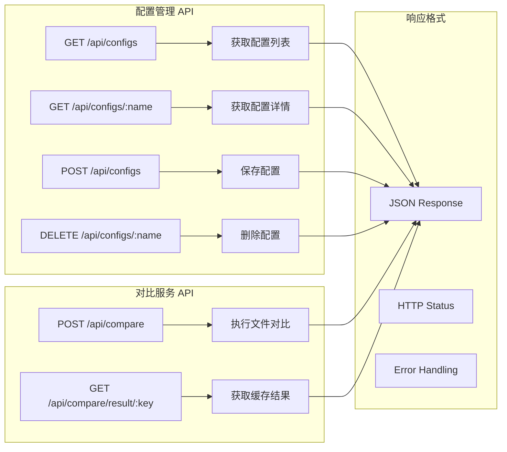

# 定长文本文件对比工具 - 系统架构图

## 系统架构总览



## 详细架构分层



## 数据流架构



## 技术栈架构



## 模块依赖关系



## 缓存策略架构

```mermaid
graph TB
    subgraph "缓存层"
        A[Redis Cache]
        A --> B[config:names<br/>配置列表 Set]
        A --> C[config:{name}<br/>配置详情 JSON<br/>TTL: 24h]
        A --> D[compare:{uuid}<br/>对比结果 JSON<br/>TTL: 30min]
    end
    
    subgraph "缓存策略"
        E[读取配置] --> F{缓存命中?}
        F -->|是| G[直接返回]
        F -->|否| H[从文件读取]
        H --> I[写入缓存]
        I --> G
        
        J[保存配置] --> K[更新文件]
        K --> L[更新缓存]
        L --> M[清除列表缓存]
    end
```

## 核心处理流程



## 部署架构



## 数据模型关系



## API 接口架构


