# 定长文本文件对比工具 - 完整架构图

## 📁 一、项目代码结构图

### 1.1 完整目录树状图

```mermaid
graph TB
    ROOT[05-fixed-text-comparator] --> BACKEND[backend/]
    ROOT --> FRONTEND[frontend/]
    ROOT --> TESTDATA[test-data/]
    ROOT --> DOCS[文档/]
    
    BACKEND --> B1[pom.xml]
    BACKEND --> B2[src/main/java/]
    BACKEND --> B3[src/main/resources/]
    
    B2 --> B2A[com/comparator/]
    B2A --> B2A1[ComparatorApplication.java]
    B2A --> B2A2[config/]
    B2A --> B2A3[controller/]
    B2A --> B2A4[service/]
    B2A --> B2A5[model/]
    B2A --> B2A6[util/]
    
    B2A2 --> B2A2A[RedisConfig.java]
    B2A2 --> B2A2B[CorsConfig.java]
    
    B2A3 --> B2A3A[ConfigController.java]
    B2A3 --> B2A3B[CompareController.java]
    
    B2A4 --> B2A4A[ConfigService.java]
    B2A4 --> B2A4B[CompareService.java]
    
    B2A5 --> B2A5A[FieldDefinition.java]
    B2A5 --> B2A5B[CompareConfig.java]
    B2A5 --> B2A5C[CompareResult.java]
    B2A5 --> B2A5D[CompareRequest.java]
    
    B2A6 --> B2A6A[IniParser.java]
    B2A6 --> B2A6B[FixedTextParser.java]
    
    B3 --> B3A[application.yml]
    B3 --> B3B[configs/default.ini]
    
    FRONTEND --> F1[package.json]
    FRONTEND --> F2[vite.config.js]
    FRONTEND --> F3[index.html]
    FRONTEND --> F4[src/]
    
    F4 --> F4A[main.js]
    F4 --> F4B[App.vue]
    F4 --> F4C[api/]
    F4 --> F4D[components/]
    
    F4C --> F4C1[client.js]
    
    F4D --> F4D1[ConfigEditor.vue]
    F4D --> F4D2[FileUploader.vue]
    F4D --> F4D3[ComparisonView.vue]
    
    TESTDATA --> T1[file1.txt]
    TESTDATA --> T2[file2.txt]
    TESTDATA --> T3[config.ini]
    
    DOCS --> D1[README.md]
    DOCS --> D2[QUICKSTART.md]
    DOCS --> D3[ARCHITECTURE.md]
    DOCS --> D4[.gitignore]
    
    style ROOT fill:#e1f5ff
    style BACKEND fill:#fff3e0
    style FRONTEND fill:#e8f5e9
    style TESTDATA fill:#fce4ec
    style DOCS fill:#f3e5f5
```

### 1.2 后端代码结构图

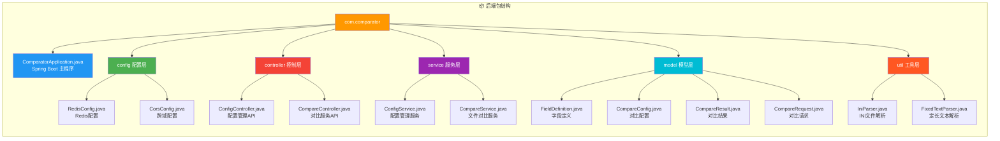

### 1.3 前端代码结构图

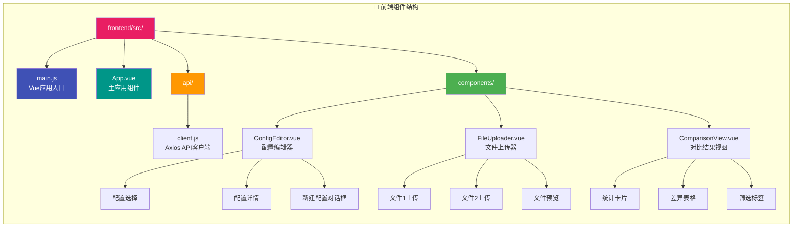

---

## 🏗️ 二、系统架构图

### 2.1 三层架构图

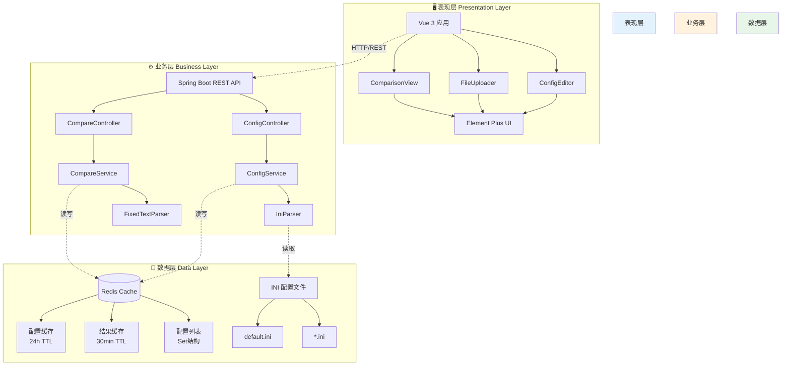

### 2.2 技术栈架构图

```mermaid
graph TB
    subgraph "🎨 前端技术栈 Frontend Stack"
        F1[Vue 3.4<br/>渐进式框架] --> F2[Composition API<br/>组合式API]
        F3[Element Plus 2.5<br/>UI组件库] --> F4[表格/表单/对话框]
        F5[Vite 5.0<br/>构建工具] --> F6[热更新/快速启动]
        F7[Axios 1.6<br/>HTTP客户端] --> F8[API请求封装]
    end
    
    subgraph "🔧 后端技术栈 Backend Stack"
        B1[Spring Boot 3.2<br/>应用框架] --> B2[自动配置/内嵌服务器]
        B3[Java 17<br/>编程语言] --> B4[记录类/密封类]
        B5[Spring Data Redis<br/>Redis集成] --> B6[RedisTemplate]
        B7[ini4j 0.5.4<br/>INI解析库] --> B8[配置文件读写]
        B9[Lombok<br/>代码简化] --> B10[@Data/@Slf4j]
    end
    
    subgraph "🗄️ 基础设施 Infrastructure"
        I1[Redis 6+<br/>缓存数据库] --> I2[高性能KV存储]
        I3[Maven 3.6+<br/>构建工具] --> I4[依赖管理/打包]
        I5[Node.js 16+<br/>运行环境] --> I6[npm包管理]
    end
    
    F7 -.HTTP.-> B1
    B5 -.TCP.-> I1
    F5 -.依赖.-> I5
    B1 -.依赖.-> I3
    
    style F1 fill:#42b883,color:#fff
    style B1 fill:#6db33f,color:#fff
    style I1 fill:#dc382d,color:#fff
```

### 2.3 部署架构图

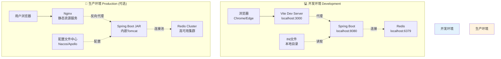

---

## 🔄 三、数据流图

### 3.1 完整业务流程图

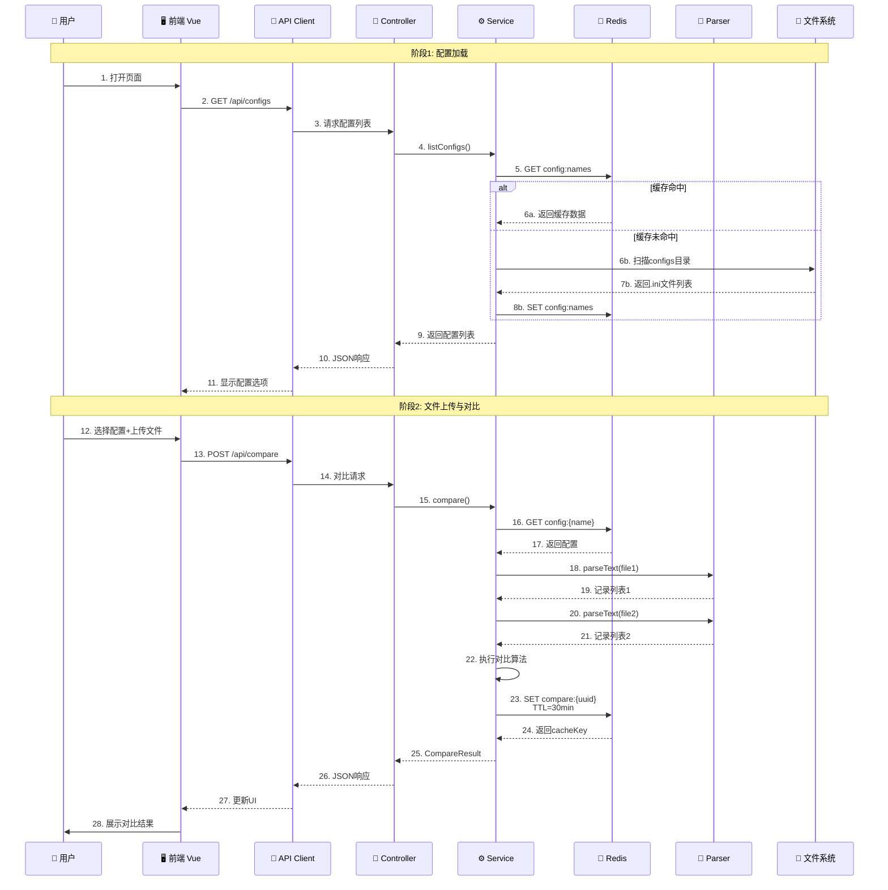

### 3.2 对比算法流程图

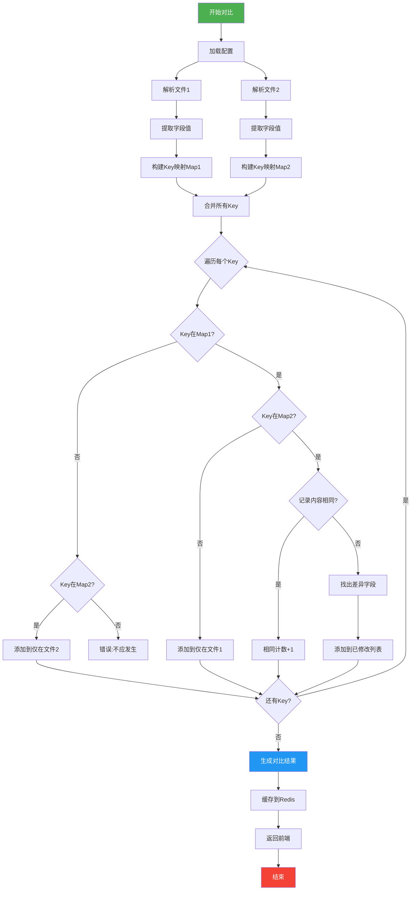

---

## 📊 四、组件交互图

### 4.1 前端组件交互图

```mermaid
graph TB
    subgraph "🎭 前端组件交互"
        APP[App.vue<br/>根组件]
        
        APP --> CE[ConfigEditor.vue<br/>配置编辑器]
        APP --> FU[FileUploader.vue<br/>文件上传器]
        APP --> CV[ComparisonView.vue<br/>对比结果]
        
        CE --> API[api/client.js<br/>API客户端]
        FU --> API
        CV -.读取.-> API
        
        CE -->|@config-selected| APP
        FU -->|@compare| APP
        APP -->|:config| FU
        APP -->|:result| CV
        APP -->|:config| CV
        
        API -.axios.-> BACKEND[后端API]
    end
    
    style APP fill:#e91e63,color:#fff
    style CE fill:#9c27b0,color:#fff
    style FU fill:#673ab7,color:#fff
    style CV fill:#3f51b5,color:#fff
    style API fill:#ff9800,color:#fff
```

### 4.2 后端类交互图

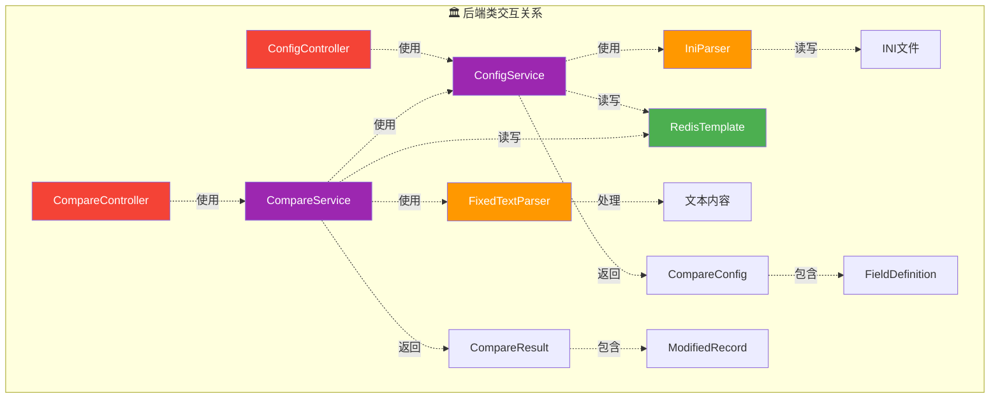

---

## 💾 五、数据模型图

### 5.1 实体关系图 (ER Diagram)

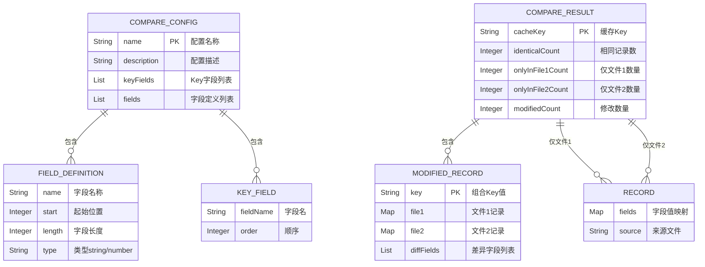

### 5.2 Redis 数据结构图

```mermaid
graph LR
    subgraph "🗄️ Redis 缓存结构"
        direction TB
        
        REDIS[(Redis Server)]
        
        REDIS --> SET1[config:names<br/>SET类型<br/>配置名称集合]
        REDIS --> HASH1[config:{name}<br/>JSON序列化<br/>TTL: 24小时]
        REDIS --> HASH2[compare:{uuid}<br/>JSON序列化<br/>TTL: 30分钟]
        
        SET1 --> S1[default]
        SET1 --> S2[测试配置]
        SET1 --> S3[...]
        
        HASH1 --> H1{name: "default"<br/>keyFields: [...]<br/>fields: [...]}
        
        HASH2 --> H2{cacheKey: "uuid"<br/>onlyInFile1: [...]<br/>onlyInFile2: [...]<br/>modified: [...]<br/>identicalCount: 0}
    end
    
    style REDIS fill:#dc382d,color:#fff
    style SET1 fill:#ff9800,color:#fff
    style HASH1 fill:#4caf50,color:#fff
    style HASH2 fill:#2196f3,color:#fff
```

---

## 🔌 六、API 接口图

### 6.1 RESTful API 架构图

```mermaid
graph TB
    subgraph "📡 API 接口层"
        CLIENT[客户端请求] --> ROUTE[路由分发]
        
        ROUTE --> CFG_API[配置管理 API]
        ROUTE --> CMP_API[对比服务 API]
        
        CFG_API --> CFG1[GET /api/configs<br/>获取配置列表]
        CFG_API --> CFG2[GET /api/configs/:name<br/>获取配置详情]
        CFG_API --> CFG3[POST /api/configs<br/>保存配置]
        CFG_API --> CFG4[DELETE /api/configs/:name<br/>删除配置]
        
        CMP_API --> CMP1[POST /api/compare<br/>执行文件对比]
        CMP_API --> CMP2[GET /api/compare/result/:key<br/>获取缓存结果]
    end
    
    subgraph "📦 响应格式"
        CFG1 --> RESP1[{name1, name2, ...}]
        CFG2 --> RESP2[{name, description,<br/>keyFields, fields}]
        CFG3 --> RESP3[{status, message}]
        CFG4 --> RESP4[{status, message}]
        CMP1 --> RESP5[{cacheKey, onlyInFile1,<br/>onlyInFile2, modified,<br/>identicalCount}]
        CMP2 --> RESP6[CompareResult对象]
    end
    
    style 响应格式 fill:#e8f5e9
    style API接口层 fill:#e3f2fd
```

### 6.2 API 调用时序图

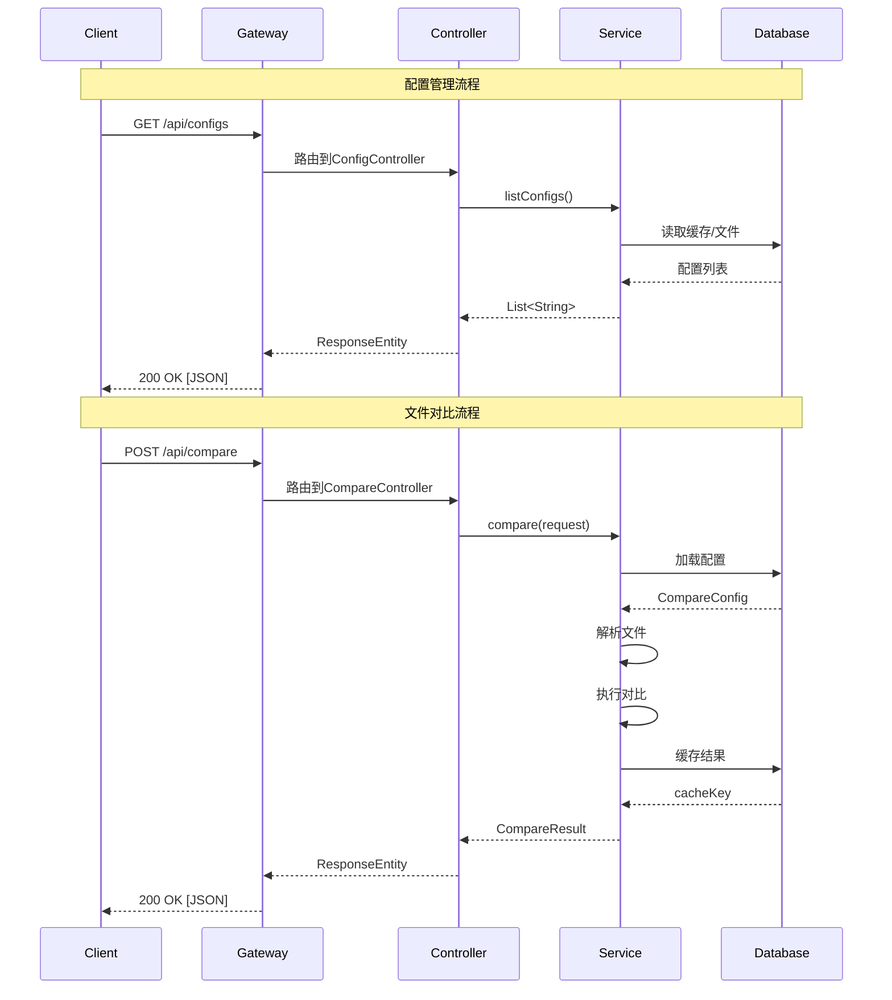

---

## 🎯 七、核心处理流程图

### 7.1 INI 配置文件解析流程

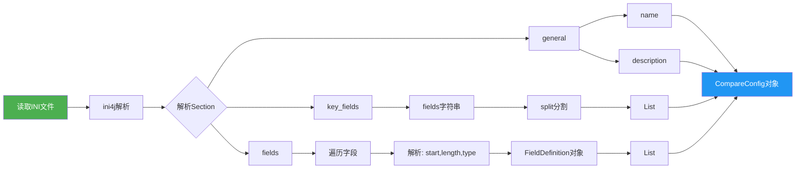

### 7.2 定长文本解析流程

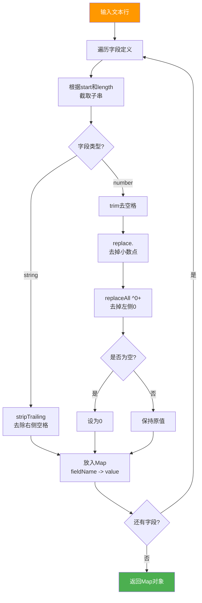

---

## 📈 八、性能优化架构图

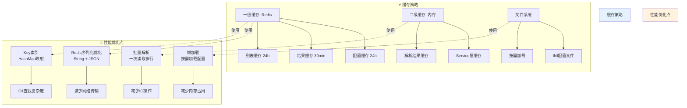

---

## 📝 九、总结

本文档提供了定长文本文件对比工具的完整架构视图，包括：

1. **代码结构图**：清晰展示前后端代码组织
2. **系统架构图**：三层架构和技术栈全景
3. **数据流图**：完整的业务流程和算法流程
4. **组件交互图**：前后端组件间的协作关系
5. **数据模型图**：实体关系和Redis缓存结构
6. **API接口图**：RESTful API设计和调用流程
7. **核心处理流程**：INI解析和文本解析详解
8. **性能优化架构**：多级缓存和优化策略

所有图表均使用 Mermaid 语法编写，可在支持 Mermaid 的 Markdown 编辑器中查看渲染效果。
