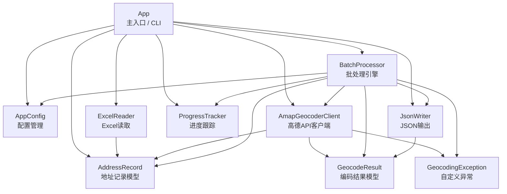
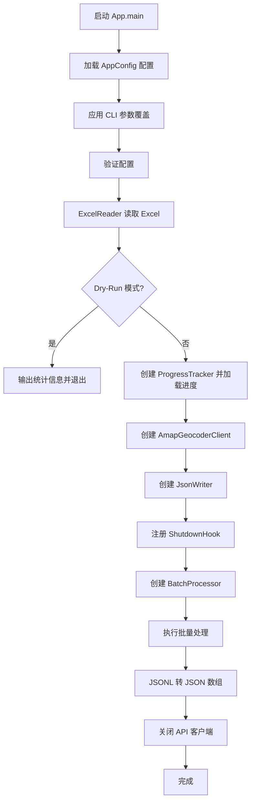
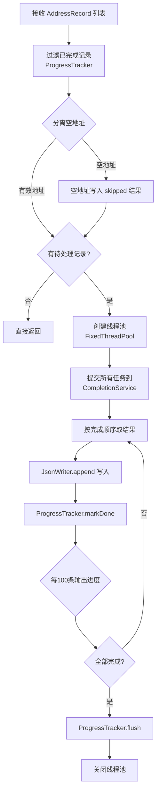
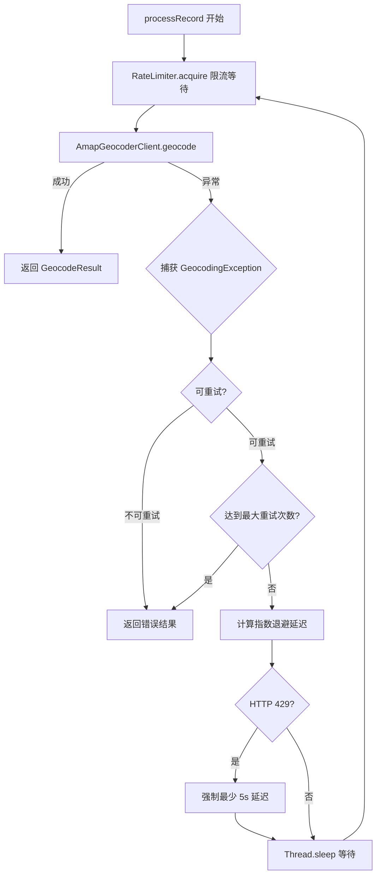
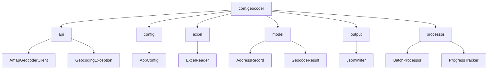

# Amap Geocoder 项目架构图

## 1. 类依赖关系图

```mermaid
graph TB
    App[App<br>主入口 / CLI]
    AppConfig[AppConfig<br>配置管理]
    ExcelReader[ExcelReader<br>Excel读取]
    AddressRecord[AddressRecord<br>地址记录模型]
    GeocodeResult[GeocodeResult<br>编码结果模型]
    AmapGeocoderClient[AmapGeocoderClient<br>高德API客户端]
    GeocodingException[GeocodingException<br>自定义异常]
    BatchProcessor[BatchProcessor<br>批处理引擎]
    ProgressTracker[ProgressTracker<br>进度跟踪]
    JsonWriter[JsonWriter<br>JSON输出]

    App --> AppConfig
    App --> ExcelReader
    App --> AmapGeocoderClient
    App --> BatchProcessor
    App --> ProgressTracker
    App --> JsonWriter
    App --> AddressRecord

    ExcelReader --> AddressRecord

    AmapGeocoderClient --> AddressRecord
    AmapGeocoderClient --> GeocodeResult
    AmapGeocoderClient --> GeocodingException

    BatchProcessor --> AppConfig
    BatchProcessor --> AmapGeocoderClient
    BatchProcessor --> ProgressTracker
    BatchProcessor --> JsonWriter
    BatchProcessor --> AddressRecord
    BatchProcessor --> GeocodeResult
    BatchProcessor --> GeocodingException

    JsonWriter --> GeocodeResult
```

## 2. 主执行流程图

```mermaid
graph TB
    Start[启动 App.main]
    LoadConfig[加载 AppConfig 配置]
    ApplyCLI[应用 CLI 参数覆盖]
    Validate[验证配置]
    ReadExcel[ExcelReader 读取 Excel]
    DryRunCheck{Dry-Run 模式?}
    PrintStats[输出统计信息并退出]
    InitTracker[创建 ProgressTracker 并加载进度]
    InitClient[创建 AmapGeocoderClient]
    InitWriter[创建 JsonWriter]
    RegisterHook[注册 ShutdownHook]
    CreateProcessor[创建 BatchProcessor]
    Process[执行批量处理]
    ConvertJSON[JSONL 转 JSON 数组]
    CloseClient[关闭 API 客户端]
    Done[完成]

    Start --> LoadConfig --> ApplyCLI --> Validate --> ReadExcel --> DryRunCheck
    DryRunCheck -- 是 --> PrintStats
    DryRunCheck -- 否 --> InitTracker --> InitClient --> InitWriter --> RegisterHook --> CreateProcessor --> Process --> ConvertJSON --> CloseClient --> Done
```

## 3. 批处理流程图

```mermaid
graph TB
    Input[接收 AddressRecord 列表]
    FilterDone[过滤已完成记录<br>ProgressTracker]
    SplitBlank{分离空地址}
    WriteSkipped[空地址写入 skipped 结果]
    CheckEmpty{有待处理记录?}
    Return[直接返回]
    CreatePool[创建线程池<br>FixedThreadPool]
    SubmitTasks[提交所有任务到<br>CompletionService]
    TakeResult[按完成顺序取结果]
    WriteResult[JsonWriter.append 写入]
    MarkDone[ProgressTracker.markDone]
    LogProgress{每100条输出进度}
    AllDone{全部完成?}
    Flush[ProgressTracker.flush]
    Shutdown[关闭线程池]

    Input --> FilterDone --> SplitBlank
    SplitBlank -- 空地址 --> WriteSkipped
    SplitBlank -- 有效地址 --> CheckEmpty
    WriteSkipped --> CheckEmpty
    CheckEmpty -- 否 --> Return
    CheckEmpty -- 是 --> CreatePool --> SubmitTasks --> TakeResult --> WriteResult --> MarkDone --> LogProgress --> AllDone
    AllDone -- 否 --> TakeResult
    AllDone -- 是 --> Flush --> Shutdown
```

## 4. 单条记录处理与重试流程

```mermaid
graph TB
    Start[processRecord 开始]
    RateLimit[RateLimiter.acquire 限流等待]
    CallAPI[AmapGeocoderClient.geocode]
    Success[返回 GeocodeResult]
    CatchEx{捕获 GeocodingException}
    Retryable{可重试?}
    MaxRetry{达到最大重试次数?}
    CalcDelay[计算指数退避延迟]
    Is429{HTTP 429?}
    MinDelay[强制最少 5s 延迟]
    Sleep[Thread.sleep 等待]
    ErrorResult[返回错误结果]

    Start --> RateLimit --> CallAPI
    CallAPI -- 成功 --> Success
    CallAPI -- 异常 --> CatchEx --> Retryable
    Retryable -- 不可重试 --> ErrorResult
    Retryable -- 可重试 --> MaxRetry
    MaxRetry -- 是 --> ErrorResult
    MaxRetry -- 否 --> CalcDelay --> Is429
    Is429 -- 是 --> MinDelay --> Sleep --> RateLimit
    Is429 -- 否 --> Sleep
```

## 5. 包结构总览

```mermaid
graph TB
    Root[com.geocoder]
    API[api]
    Config[config]
    Excel[excel]
    Model[model]
    Output[output]
    Processor[processor]

    Root --> API
    Root --> Config
    Root --> Excel
    Root --> Model
    Root --> Output
    Root --> Processor

    API --> AmapGeocoderClient
    API --> GeocodingException
    Config --> AppConfig
    Excel --> ExcelReader
    Model --> AddressRecord
    Model --> GeocodeResult
    Output --> JsonWriter
    Processor --> BatchProcessor
    Processor --> ProgressTracker
```
