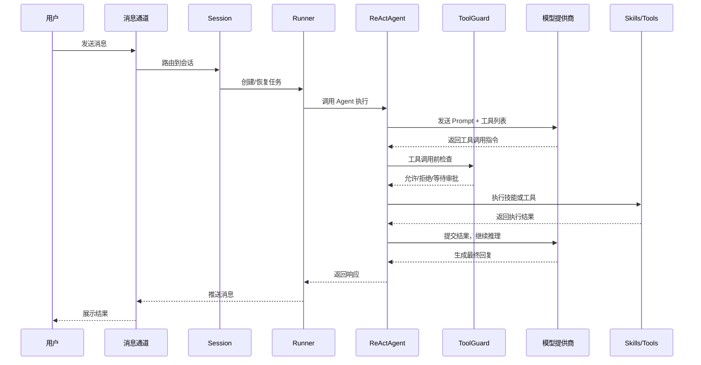
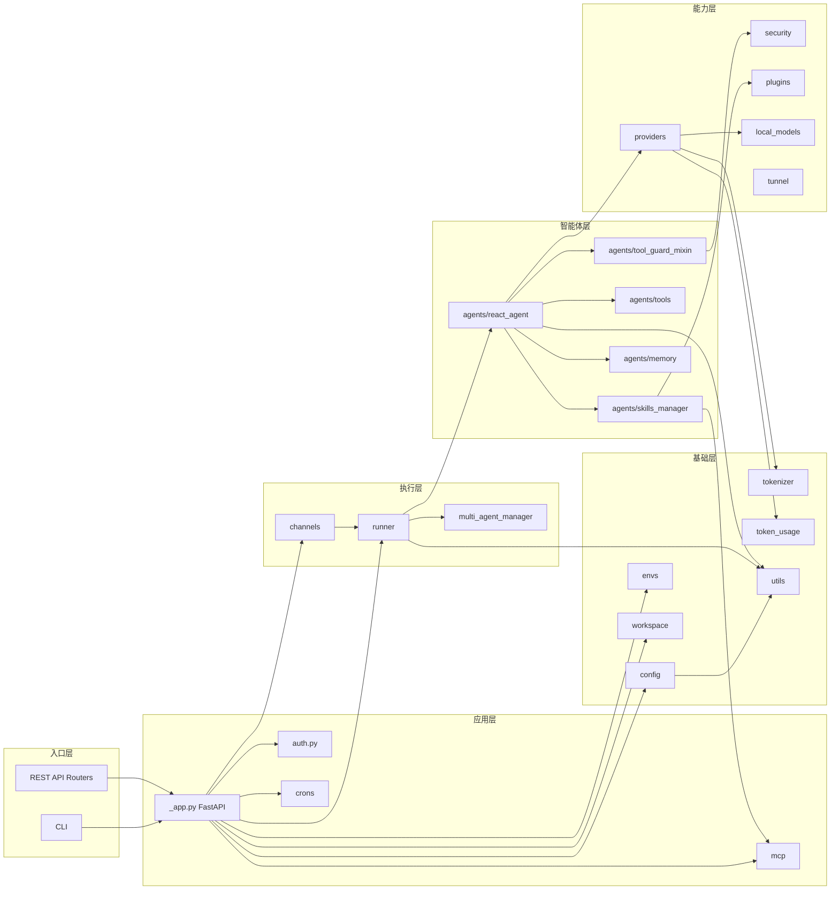

# QwenPaw 架构图

## 1. 整体系统架构图

```mermaid
graph TB
    subgraph 用户入口
        CLI[CLI 命令行]
        WEB[Console Web UI]
        IM[IM 消息平台]
    end

    subgraph 消息通道层 channels
        DT[钉钉 DingTalk]
        FS[飞书 Feishu]
        WX[微信 Weixin]
        WC[企业微信 WeCom]
        TG[Telegram]
        DS[Discord]
        QQ[QQ / OneBot]
        IM2[iMessage]
        MM[Matrix / Mattermost]
        VC[语音通道 Voice]
        CON[Console 通道]
    end

    subgraph 核心运行时 runner
        SESS[Session 会话管理]
        RUN[Runner 执行引擎]
        CMD[CommandDispatch 命令分发]
        TASK[TaskTracker 任务追踪]
    end

    subgraph 智能体层 agents
        REACT[ReActAgent 主智能体]
        MF[ModelFactory 模型工厂]
        PROMPT[Prompt 提示词管理]
        SM[SkillsManager 技能管理器]
        SH[SkillsHub 技能集线器]
        TG2[ToolGuardMixin 工具防护]
        MEM[Memory 记忆模块]
        CMD2[CommandHandler 命令处理]
        MULTI[MultiAgentManager 多智能体]
    end

    subgraph 技能插件 skills
        PDF[PDF 处理]
        DOCX[Word 文档]
        XLSX[Excel 表格]
        PPTX[PowerPoint]
        NEWS[新闻获取]
        FILE[文件读取]
        BROW[浏览器控制]
        CRON[定时任务]
        QA[QA 知识库]
        MAC[多智能体协作]
    end

    subgraph 内置工具 tools
        SHLL[Shell 执行]
        FIO[文件 IO]
        FSRCH[文件搜索]
        BCTL[浏览器控制]
        MED[媒体查看]
        TIME[获取时间]
        TOK[Token 统计]
    end

    subgraph 模型提供商 providers
        DASH[DashScope/Qwen]
        OAI[OpenAI 兼容]
        ANT[Anthropic Claude]
        GEM[Gemini]
        OLL[Ollama 本地]
        LMS[LM Studio]
        PM[ProviderManager]
        RL[RateLimiter]
        RC[RetryModel]
    end

    subgraph 安全防护 security
        TG3[ToolGuard 工具防护]
        SS[SkillScanner 技能扫描]
        APR[Approvals 人工审批]
        SEC[SecretStore 密钥存储]
    end

    subgraph 基础设施
        CFG[Config 配置]
        AUTH[Auth 认证]
        MCP[MCP 协议]
        PLUG[Plugin 插件系统]
        TUN[Tunnel 隧道]
        LMOD[LocalModels 本地模型]
        ENV[Envs 环境变量]
        WS[Workspace 工作区]
    end

    CLI --> CMD
    WEB --> SESS
    IM --> DT & FS & WX & WC & TG & DS & QQ & IM2 & MM & VC & CON
    DT & FS & WX & WC & TG & DS & QQ & IM2 & MM & VC & CON --> SESS
    SESS --> RUN
    RUN --> CMD
    CMD --> REACT
    REACT --> MF
    REACT --> SM
    REACT --> TG2
    REACT --> MULTI
    SM --> SH
    SH --> PDF & DOCX & XLSX & PPTX & NEWS & FILE & BROW & CRON & QA & MAC
    REACT --> SHLL & FIO & FSRCH & BCTL & MED & TIME & TOK
    MF --> PM
    PM --> DASH & OAI & ANT & GEM & OLL & LMS
    PM --> RL & RC
    TG2 --> TG3 & SS & APR
    REACT --> MEM
    AUTH --> SESS
    CFG --> REACT & PM
    MCP --> SM
    PLUG --> SM
```

---

## 2. 请求处理流程图

```mermaid
sequenceDiagram
    participant 用户
    participant Channel as 消息通道
    participant Session as Session
    participant Runner as Runner
    participant Agent as ReActAgent
    participant ToolGuard as ToolGuard
    participant LLM as 模型提供商
    participant Skill as Skills/Tools

    用户->>Channel: 发送消息
    Channel->>Session: 路由到会话
    Session->>Runner: 创建/恢复任务
    Runner->>Agent: 调用 Agent 执行
    Agent->>LLM: 发送 Prompt + 工具列表
    LLM-->>Agent: 返回工具调用指令
    Agent->>ToolGuard: 工具调用前检查
    ToolGuard-->>Agent: 允许/拒绝/等待审批
    Agent->>Skill: 执行技能或工具
    Skill-->>Agent: 返回执行结果
    Agent->>LLM: 提交结果，继续推理
    LLM-->>Agent: 生成最终回复
    Agent-->>Runner: 返回响应
    Runner-->>Channel: 推送消息
    Channel-->>用户: 展示结果
```

---

## 3. 模块依赖关系图

```mermaid
graph LR
    subgraph 入口层
        CLI
        API[REST API Routers]
    end

    subgraph 应用层
        APP[_app.py FastAPI]
        AUTH[auth.py]
        CRON[crons]
        MCP[mcp]
    end

    subgraph 执行层
        RUNNER[runner]
        CHANNEL[channels]
        MULTI[multi_agent_manager]
    end

    subgraph 智能体层
        AGENT[agents/react_agent]
        SKILLS[agents/skills_manager]
        TOOLS[agents/tools]
        GUARD[agents/tool_guard_mixin]
        MEMORY[agents/memory]
    end

    subgraph 能力层
        PROVIDERS[providers]
        SECURITY[security]
        PLUGINS[plugins]
        LOCAL[local_models]
        TUNNEL[tunnel]
    end

    subgraph 基础层
        CONFIG[config]
        ENVS[envs]
        WORKSPACE[workspace]
        TOKENIZER[tokenizer]
        TOKEN_USAGE[token_usage]
        UTILS[utils]
    end

    CLI --> APP
    API --> APP
    APP --> AUTH
    APP --> CHANNEL
    APP --> RUNNER
    APP --> CRON
    APP --> MCP
    RUNNER --> AGENT
    RUNNER --> MULTI
    CHANNEL --> RUNNER
    AGENT --> SKILLS
    AGENT --> TOOLS
    AGENT --> GUARD
    AGENT --> MEMORY
    AGENT --> PROVIDERS
    GUARD --> SECURITY
    SKILLS --> PLUGINS
    SKILLS --> MCP
    PROVIDERS --> LOCAL
    PROVIDERS --> TOKENIZER
    PROVIDERS --> TOKEN_USAGE
    APP --> CONFIG
    APP --> ENVS
    APP --> WORKSPACE
    CONFIG --> UTILS
    RUNNER --> UTILS
    AGENT --> UTILS
```
