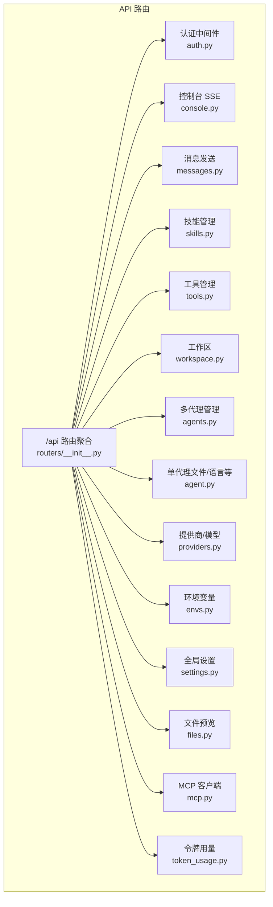
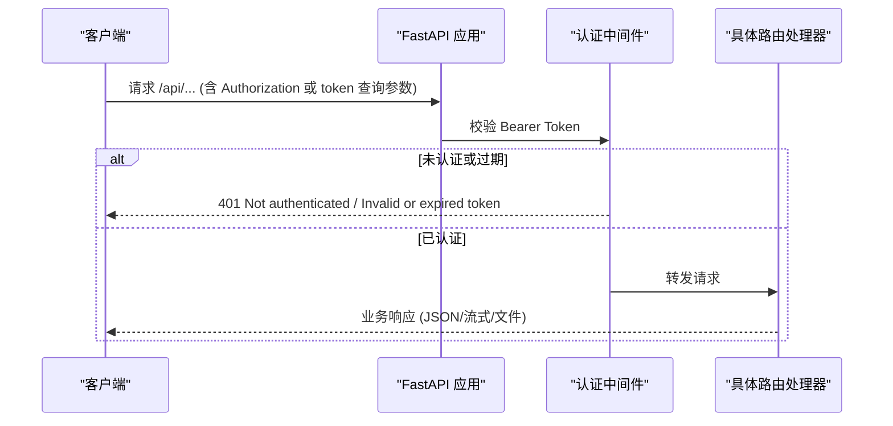
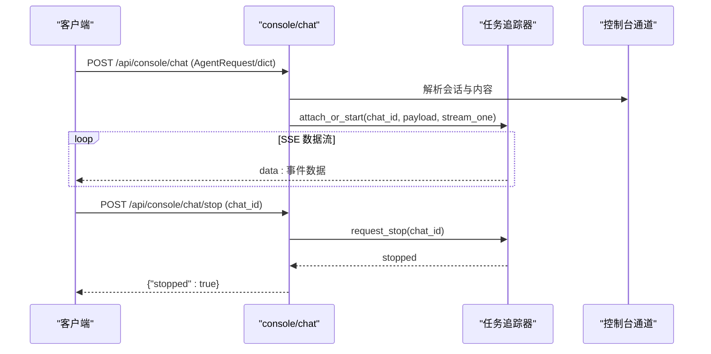
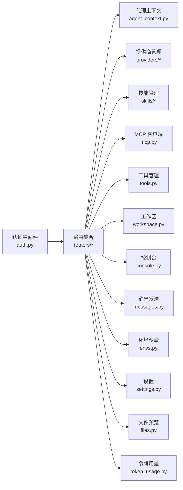

# API参考文档

<cite>
**本文档引用的文件**
- [copaw/src/copaw/app/routers/__init__.py](file://copaw/src/copaw/app/routers/__init__.py)
- [copaw/src/copaw/app/auth.py](file://copaw/src/copaw/app/auth.py)
- [copaw/src/copaw/app/routers/agent.py](file://copaw/src/copaw/app/routers/agent.py)
- [copaw/src/copaw/app/routers/agents.py](file://copaw/src/copaw/app/routers/agents.py)
- [copaw/src/copaw/app/routers/messages.py](file://copaw/src/copaw/app/routers/messages.py)
- [copaw/src/copaw/app/routers/files.py](file://copaw/src/copaw/app/routers/files.py)
- [copaw/src/copaw/app/routers/skills.py](file://copaw/src/copaw/app/routers/skills.py)
- [copaw/src/copaw/app/routers/console.py](file://copaw/src/copaw/app/routers/console.py)
- [copaw/src/copaw/app/routers/tools.py](file://copaw/src/copaw/app/routers/tools.py)
- [copaw/src/copaw/app/routers/workspace.py](file://copaw/src/copaw/app/routers/workspace.py)
- [copaw/src/copaw/app/routers/envs.py](file://copaw/src/copaw/app/routers/envs.py)
- [copaw/src/copaw/app/routers/settings.py](file://copaw/src/copaw/app/routers/settings.py)
- [copaw/src/copaw/app/routers/providers.py](file://copaw/src/copaw/app/routers/providers.py)
- [copaw/src/copaw/app/routers/mcp.py](file://copaw/src/copaw/app/routers/mcp.py)
- [copaw/src/copaw/app/routers/token_usage.py](file://copaw/src/copaw/app/routers/token_usage.py)
</cite>

## 目录
1. [简介](#简介)
2. [项目结构](#项目结构)
3. [核心组件](#核心组件)
4. [架构总览](#架构总览)
5. [详细组件分析](#详细组件分析)
6. [依赖分析](#依赖分析)
7. [性能考虑](#性能考虑)
8. [故障排查指南](#故障排查指南)
9. [结论](#结论)
10. [附录](#附录)

## 简介
本文件为 CoPaw 框架的完整 API 参考文档，覆盖主应用的 RESTful API 与控制台流式接口（SSE）。内容包括：
- HTTP 方法、URL 模式、请求/响应格式与认证方式
- 参数校验规则、错误码定义与响应示例
- 最佳实践与性能优化建议
- 版本控制与向后兼容策略
- 客户端实现指南与 SDK 使用要点
- 调试工具与常见问题排查

## 项目结构
CoPaw 的 API 路由通过统一入口挂载，核心路由组织如下：
- 统一路由器：将各子模块路由聚合到 /api 前缀下
- 认证中间件：对受保护路径进行 Bearer Token 校验
- 控制台路由：提供 SSE 流式对话、文件上传与推送消息查询
- 多代理管理：支持多智能体的创建、更新、删除与工作区文件读写
- 技能与工具：技能池与工作区技能管理、内置工具开关与异步执行配置
- 提供商与模型：LLM 提供商配置、模型发现与连接测试、活动模型设置
- 其他：环境变量、全局设置、文件预览、消息发送、工作区打包/解包、MCP 客户端管理、令牌用量统计

图表来源
- [copaw/src/copaw/app/routers/__init__.py:1-60](file://copaw/src/copaw/app/routers/__init__.py#L1-L60)
- [copaw/src/copaw/app/auth.py:340-410](file://copaw/src/copaw/app/auth.py#L340-L410)
- [copaw/src/copaw/app/routers/console.py:68-148](file://copaw/src/copaw/app/routers/console.py#L68-L148)
- [copaw/src/copaw/app/routers/messages.py:75-184](file://copaw/src/copaw/app/routers/messages.py#L75-L184)
- [copaw/src/copaw/app/routers/skills.py:521-800](file://copaw/src/copaw/app/routers/skills.py#L521-L800)
- [copaw/src/copaw/app/routers/tools.py:35-177](file://copaw/src/copaw/app/routers/tools.py#L35-L177)
- [copaw/src/copaw/app/routers/workspace.py:112-203](file://copaw/src/copaw/app/routers/workspace.py#L112-L203)
- [copaw/src/copaw/app/routers/agents.py:148-722](file://copaw/src/copaw/app/routers/agents.py#L148-L722)
- [copaw/src/copaw/app/routers/agent.py:38-505](file://copaw/src/copaw/app/routers/agent.py#L38-L505)
- [copaw/src/copaw/app/routers/providers.py:134-575](file://copaw/src/copaw/app/routers/providers.py#L134-L575)
- [copaw/src/copaw/app/routers/envs.py:32-81](file://copaw/src/copaw/app/routers/envs.py#L32-L81)
- [copaw/src/copaw/app/routers/settings.py:39-59](file://copaw/src/copaw/app/routers/settings.py#L39-L59)
- [copaw/src/copaw/app/routers/files.py:9-25](file://copaw/src/copaw/app/routers/files.py#L9-L25)
- [copaw/src/copaw/app/routers/mcp.py:206-409](file://copaw/src/copaw/app/routers/mcp.py#L206-L409)
- [copaw/src/copaw/app/routers/token_usage.py:23-62](file://copaw/src/copaw/app/routers/token_usage.py#L23-L62)

章节来源
- [copaw/src/copaw/app/routers/__init__.py:1-60](file://copaw/src/copaw/app/routers/__init__.py#L1-L60)

## 核心组件
- 统一路由器与挂载
  - 将 agents、agent、config、console、cron、local_models、mcp、messages、providers、runner、skills、skills_stream、tools、workspace、envs、token_usage、auth、files、settings 等路由挂载至 /api 前缀
- 认证与授权
  - 支持 Bearer Token；公开路径包括登录、状态、注册、版本、语言设置等
  - 对 /api 路由默认启用保护，允许本地回环地址免认证
- 控制台 SSE
  - 提供聊天流式输出、停止运行中的会话、上传媒体文件、拉取推送消息
- 多代理管理
  - 列表、创建、更新、删除、启用/禁用、文件读写、内存文件读写、系统提示词文件列表与更新
- 技能与工具
  - 技能池与工作区技能管理、批量导入、Hub 安装任务、内置工具开关与异步执行配置
- 提供商与模型
  - 列举/配置提供商、自定义提供商、模型发现与连接测试、活动模型设置（全局/代理）
- 其他
  - 环境变量批处理保存与删除、UI 语言设置、文件预览、消息发送、工作区打包/解包、MCP 客户端管理、令牌用量统计

章节来源
- [copaw/src/copaw/app/routers/__init__.py:25-60](file://copaw/src/copaw/app/routers/__init__.py#L25-L60)
- [copaw/src/copaw/app/auth.py:340-410](file://copaw/src/copaw/app/auth.py#L340-L410)

## 架构总览
CoPaw API 采用 FastAPI 构建，统一在 /api 下提供 REST 接口，并通过认证中间件保障安全访问。控制台通过 SSE 提供实时交互体验。

图表来源
- [copaw/src/copaw/app/auth.py:340-410](file://copaw/src/copaw/app/auth.py#L340-L410)

## 详细组件分析

### 认证与授权
- 认证方式
  - Bearer Token：请求头 Authorization: Bearer <token> 或查询参数 token
  - WebSocket：通过查询参数 token 进行鉴权
- 公开路径
  - /api/auth/login、/api/auth/status、/api/auth/register、/api/version、/api/settings/language
- 保护范围
  - 默认仅保护 /api 路由；本地回环地址（127.0.0.1、::1）可免认证
- 错误响应
  - 401：未认证或令牌无效/过期
  - 403：权限不足（当前实现以 401 统一）

章节来源
- [copaw/src/copaw/app/auth.py:340-410](file://copaw/src/copaw/app/auth.py#L340-L410)

### 控制台 SSE（流式对话）
- 路径与方法
  - POST /api/console/chat（SSE 流式响应）
  - POST /api/console/chat/stop（停止会话）
  - POST /api/console/upload（上传媒体文件）
  - GET /api/console/push-messages（拉取推送消息）
- 请求与响应
  - chat：请求体支持 AgentRequest 或字典；返回 text/event-stream，支持 reconnect=true 重连
  - chat/stop：传入 chat_id 停止指定会话
  - upload：multipart/form-data，限制最大 10MB，返回存储路径、原始文件名与大小
  - push-messages：可选 session_id，不传则返回最近消息
- 参数校验
  - 文件大小校验、安全文件名生成、会话解析与名称推断
- 错误码
  - 400：请求体格式错误、文件过大
  - 503：控制台通道不可用

图表来源
- [copaw/src/copaw/app/routers/console.py:68-164](file://copaw/src/copaw/app/routers/console.py#L68-L164)

章节来源
- [copaw/src/copaw/app/routers/console.py:68-216](file://copaw/src/copaw/app/routers/console.py#L68-L216)

### 多代理管理（Agents）
- 路径与方法
  - GET /api/agents：列出所有代理（按配置顺序）
  - PUT /api/agents/order：持久化代理顺序
  - GET /api/agents/{agentId}：获取代理详情
  - POST /api/agents：创建新代理（服务端生成 ID）
  - PUT /api/agents/{agentId}：更新代理配置并触发热重载
  - DELETE /api/agents/{agentId}：删除代理（禁止删除 default）
  - PATCH /api/agents/{agentId}/toggle：启用/禁用代理（禁止操作 default）
  - GET /api/agents/{agentId}/files：列出工作区 Markdown 文件
  - GET /api/agents/{agentId}/files/{filename}：读取工作区文件
  - PUT /api/agents/{agentId}/files/{filename}：写入工作区文件
  - GET /api/agents/{agentId}/memory：列出记忆文件
- 参数校验
  - 顺序列表必须包含每个已配置代理一次且仅一次
  - 删除 default 代理时返回 400
  - 启用代理失败时返回 500
- 错误码
  - 400：非法参数、default 代理被禁止操作
  - 404：代理不存在
  - 500：内部错误或启动失败

章节来源
- [copaw/src/copaw/app/routers/agents.py:148-722](file://copaw/src/copaw/app/routers/agents.py#L148-L722)

### 单代理文件与语言设置（Agent）
- 路径与方法
  - GET /api/agent/files：列出工作区 Markdown 文件
  - GET /api/agent/files/{md_name}：读取工作区文件
  - PUT /api/agent/files/{md_name}：写入工作区文件
  - GET /api/agent/memory：列出记忆文件
  - GET /api/agent/memory/{md_name}：读取记忆文件
  - PUT /api/agent/memory/{md_name}：写入记忆文件
  - GET /api/agent/language：获取代理语言
  - PUT /api/agent/language：更新代理语言（自动复制对应语言的 MD 文件）
  - GET /api/agent/audio-mode：获取音频模式
  - PUT /api/agent/audio-mode：更新音频模式（auto/native）
  - GET /api/agent/transcription-provider-type：获取转录提供商类型
  - PUT /api/agent/transcription-provider-type：设置转录提供商类型（disabled/whisper_api/local_whisper）
  - GET /api/agent/local-whisper-status：检查本地 Whisper 可用性
  - GET /api/agent/transcription-providers：列出可转录提供商与当前选择
  - PUT /api/agent/transcription-provider：设置转录提供商（空字符串表示取消）
  - GET /api/agent/running-config：获取运行配置
  - PUT /api/agent/running-config：更新运行配置并触发热重载
  - GET /api/agent/system-prompt-files：获取系统提示词文件列表
  - PUT /api/agent/system-prompt-files：更新系统提示词文件列表并触发热重载
- 参数校验
  - 语言必须为 zh/en/ru
  - 音频模式必须为 auto/native
  - 转录提供商类型必须为 disabled/whisper_api/local_whisper
- 错误码
  - 400：非法参数
  - 404：文件不存在
  - 500：内部错误

章节来源
- [copaw/src/copaw/app/routers/agent.py:38-505](file://copaw/src/copaw/app/routers/agent.py#L38-L505)

### 技能管理（Skills）
- 路径与方法
  - GET /api/skills：列出工作区技能
  - POST /api/skills/refresh：强制对齐并刷新技能清单
  - GET /api/skills/hub/search?q&limit：搜索技能 Hub
  - GET /api/skills/workspaces：列出各工作区技能概要
  - POST /api/skills/hub/install/start：开始从 Hub 安装技能（返回任务 ID）
  - GET /api/skills/hub/install/status/{task_id}：查询安装任务状态
  - POST /api/skills/hub/install/cancel/{task_id}：取消安装任务
  - GET /api/skills/pool：列出技能池技能
  - POST /api/skills/pool/refresh：刷新技能池
  - GET /api/skills/pool/builtin-sources：列出内置来源
  - POST /api/skills：创建工作区技能（含扫描与冲突处理）
  - POST /api/skills/upload：上传 ZIP 并导入（含重命名映射）
  - POST /api/skills/pool/create：创建技能池技能
  - PUT /api/skills/pool/save：保存/重命名技能池技能
  - POST /api/skills/pool/upload-zip：上传 ZIP 并导入到技能池
- 安全与扫描
  - 技能导入时进行安全扫描，失败返回 422，包含严重级别与发现项
- 错误码
  - 400：非法参数、文件类型不符、ZIP 不合法、重命名映射非 JSON 对象
  - 404：任务不存在、技能不存在
  - 409：冲突（建议的新名称）
  - 422：安全扫描失败
  - 500：内部错误

章节来源
- [copaw/src/copaw/app/routers/skills.py:521-800](file://copaw/src/copaw/app/routers/skills.py#L521-L800)

### 内置工具管理（Tools）
- 路径与方法
  - GET /api/tools：列出内置工具及其启用状态
  - PATCH /api/tools/{tool_name}/toggle：切换工具启用状态
  - PATCH /api/tools/{tool_name}/async-execution：更新工具异步执行配置
- 行为
  - 更新后触发代理热重载
- 错误码
  - 404：工具不存在

章节来源
- [copaw/src/copaw/app/routers/tools.py:35-177](file://copaw/src/copaw/app/routers/tools.py#L35-L177)

### 工作区管理（Workspace）
- 路径与方法
  - GET /api/workspace/download：下载工作区为 ZIP（流式响应）
  - POST /api/workspace/upload：上传 ZIP 并合并到工作区（覆盖/合并）
- 安全与校验
  - ZIP 校验与路径穿越防护
  - 仅允许 application/zip 类型
- 错误码
  - 400：非法 ZIP、路径不安全、文件过大
  - 500：合并失败

章节来源
- [copaw/src/copaw/app/routers/workspace.py:112-203](file://copaw/src/copaw/app/routers/workspace.py#L112-L203)

### 消息发送（Messages）
- 路径与方法
  - POST /api/messages/send：向指定通道发送文本消息
- 请求头
  - X-Agent-Id：代理 ID（默认 default）
- 行为
  - 通过代理的工作区与通道管理器发送消息
- 错误码
  - 404：代理不存在、通道不存在
  - 500：通道管理器未初始化或发送失败

章节来源
- [copaw/src/copaw/app/routers/messages.py:75-184](file://copaw/src/copaw/app/routers/messages.py#L75-L184)

### 提供商与模型（Providers & Models）
- 路径与方法
  - GET /api/models：列举所有提供商
  - PUT /api/models/{provider_id}/config：配置提供商（API Key、Base URL、Chat Model、生成参数）
  - POST /api/models/custom-providers：创建自定义提供商
  - POST /api/models/{provider_id}/test：测试提供商连接
  - POST /api/models/{provider_id}/discover：发现可用模型
  - POST /api/models/{provider_id}/models/test：测试特定模型
  - DELETE /api/models/custom-providers/{provider_id}：删除自定义提供商
  - POST /api/models/{provider_id}/models：添加模型到提供商
  - POST /api/models/{provider_id}/models/{model_id:path}/probe-multimodal：探测多模态能力
  - DELETE /api/models/{provider_id}/models/{model_id:path}：从提供商移除模型
  - GET /api/models/active?scope={effective|global|agent}&agent_id：获取有效活动模型
  - PUT /api/models/active：设置活动模型（支持全局或代理级）
- 参数校验
  - scope=agent 时必须提供 agent_id
  - 活动模型设置需验证提供商与模型存在
- 错误码
  - 400：参数非法、模型不存在、设置失败
  - 404：提供商不存在、模型不存在
  - 500：内部错误

章节来源
- [copaw/src/copaw/app/routers/providers.py:134-575](file://copaw/src/copaw/app/routers/providers.py#L134-L575)

### 环境变量管理（Envs）
- 路径与方法
  - GET /api/envs：列出所有环境变量
  - PUT /api/envs：批处理保存（全量替换）
  - DELETE /api/envs/{key}：删除指定键
- 行为
  - 批处理保存会对键进行清洗（去空白）
- 错误码
  - 400：键为空
  - 404：键不存在

章节来源
- [copaw/src/copaw/app/routers/envs.py:32-81](file://copaw/src/copaw/app/routers/envs.py#L32-L81)

### 全局设置（Settings）
- 路径与方法
  - GET /api/settings/language：获取 UI 语言
  - PUT /api/settings/language：更新 UI 语言（支持 en/zh/ja/ru）
- 存储
  - settings.json（独立于代理配置）
- 错误码
  - 400：非法语言值

章节来源
- [copaw/src/copaw/app/routers/settings.py:39-59](file://copaw/src/copaw/app/routers/settings.py#L39-L59)

### 文件预览（Files）
- 路径与方法
  - GET /api/files/preview/{filepath}：预览文件（支持 HEAD）
- 安全
  - 绝对路径解析与文件存在性校验
- 错误码
  - 404：文件不存在

章节来源
- [copaw/src/copaw/app/routers/files.py:9-25](file://copaw/src/copaw/app/routers/files.py#L9-L25)

### MCP 客户端管理（MCP）
- 路径与方法
  - GET /api/mcp：列出 MCP 客户端（敏感值掩码显示）
  - GET /api/mcp/{client_key}：获取客户端详情（敏感值掩码显示）
  - POST /api/mcp：创建客户端（返回创建详情）
  - PUT /api/mcp/{client_key}：更新客户端（支持部分字段更新，保留原敏感值）
  - PATCH /api/mcp/{client_key}/toggle：切换启用状态
  - DELETE /api/mcp/{client_key}：删除客户端
- 安全
  - 环境变量与头部值掩码展示，避免泄露敏感信息
- 错误码
  - 400：客户端已存在、非法参数
  - 404：客户端不存在

章节来源
- [copaw/src/copaw/app/routers/mcp.py:206-409](file://copaw/src/copaw/app/routers/mcp.py#L206-L409)

### 令牌用量统计（Token Usage）
- 路径与方法
  - GET /api/token-usage：按日期/模型/提供商聚合统计
- 查询参数
  - start_date、end_date（YYYY-MM-DD，默认近 30 天）、model、provider
- 行为
  - 自动交换起止日期，保证 start ≤ end
- 错误码
  - 400：日期格式非法

章节来源
- [copaw/src/copaw/app/routers/token_usage.py:23-62](file://copaw/src/copaw/app/routers/token_usage.py#L23-L62)

## 依赖分析
- 路由聚合
  - /api 路由统一挂载各子模块，便于集中管理与扩展
- 认证耦合
  - 认证中间件与路由层解耦，通过请求对象注入用户信息
- 代理上下文
  - 多数路由通过代理上下文获取当前工作区，确保操作作用域正确
- 安全扫描
  - 技能导入链路贯穿扫描与异常转换，保持对外一致的错误形态

图表来源
- [copaw/src/copaw/app/routers/__init__.py:25-60](file://copaw/src/copaw/app/routers/__init__.py#L25-L60)
- [copaw/src/copaw/app/auth.py:340-410](file://copaw/src/copaw/app/auth.py#L340-L410)

## 性能考虑
- SSE 流式输出
  - 使用异步迭代器与队列，支持断线重连与后台继续运行
- 异步任务
  - Hub 安装任务、技能导入、工作区打包/解包均使用异步线程池，避免阻塞主线程
- 热重载
  - 更新配置后异步调度代理重载，提升用户体验
- 文件操作
  - ZIP 校验与路径穿越检查，避免高风险操作
- 缓存与幂等
  - 对重复请求进行幂等处理，减少不必要的计算

## 故障排查指南
- 认证相关
  - 401：确认 Authorization 头或查询参数 token 是否正确；检查令牌是否过期
  - 403：当前实现以 401 统一，若出现权限问题请检查公开路径与本地回环豁免
- 控制台 SSE
  - 503：控制台通道未初始化，检查代理工作区与通道配置
  - 400：请求体格式错误或文件过大，检查输入结构与大小限制
- 技能管理
  - 422：安全扫描失败，查看返回的严重级别与发现项，修复后重试
  - 409：技能冲突，根据建议的新名称重试
- 提供商与模型
  - 404：提供商或模型不存在，先执行发现或检查配置
  - 400：参数非法或设置失败，核对 scope 与 agent_id
- 工作区
  - 400：ZIP 不合法或包含不安全路径，检查压缩包结构
- 消息发送
  - 404：代理或通道不存在，确认代理 ID 与通道名称

章节来源
- [copaw/src/copaw/app/routers/console.py:112-164](file://copaw/src/copaw/app/routers/console.py#L112-L164)
- [copaw/src/copaw/app/routers/skills.py:62-103](file://copaw/src/copaw/app/routers/skills.py#L62-L103)
- [copaw/src/copaw/app/routers/providers.py:520-575](file://copaw/src/copaw/app/routers/providers.py#L520-L575)
- [copaw/src/copaw/app/routers/workspace.py:101-203](file://copaw/src/copaw/app/routers/workspace.py#L101-L203)
- [copaw/src/copaw/app/routers/messages.py:110-184](file://copaw/src/copaw/app/routers/messages.py#L110-L184)

## 结论
本参考文档系统性梳理了 CoPaw 主应用的 RESTful API 与控制台 SSE 接口，明确了认证方式、参数校验、错误码与响应示例，并提供了性能优化与故障排查建议。建议在生产环境中：
- 使用 Bearer Token 进行鉴权，严格管理密钥与令牌有效期
- 对大文件与长耗时操作采用异步任务与进度查询
- 在技能导入与模型配置环节充分进行安全扫描与连接测试
- 合理使用热重载与 SSE 重连机制，提升用户体验

## 附录

### API 规范汇总（按模块）
- 认证与设置
  - 认证：Bearer Token（Authorization 头或查询参数）
  - 公开路径：/api/auth/login、/api/auth/status、/api/auth/register、/api/version、/api/settings/language
- 控制台 SSE
  - POST /api/console/chat：SSE 流式响应，支持 reconnect
  - POST /api/console/chat/stop：停止会话
  - POST /api/console/upload：上传媒体文件（≤10MB）
  - GET /api/console/push-messages：拉取推送消息
- 多代理管理
  - GET /api/agents、PUT /api/agents/order、GET /api/agents/{agentId}、POST /api/agents、PUT /api/agents/{agentId}、DELETE /api/agents/{agentId}、PATCH /api/agents/{agentId}/toggle
  - GET/PUT /api/agents/{agentId}/files、GET/PUT /api/agents/{agentId}/memory
- 单代理文件与语言
  - GET/PUT /api/agent/files、GET/PUT /api/agent/memory、GET/PUT /api/agent/language、GET/PUT /api/agent/audio-mode、GET/PUT /api/agent/transcription-provider-type、GET /api/agent/local-whisper-status、GET /api/agent/transcription-providers、PUT /api/agent/transcription-provider、GET/PUT /api/agent/running-config、GET/PUT /api/agent/system-prompt-files
- 技能管理
  - GET /api/skills、POST /api/skills/refresh、GET /api/skills/hub/search、GET /api/skills/workspaces、POST /api/skills/hub/install/start、GET /api/skills/hub/install/status/{task_id}、POST /api/skills/hub/install/cancel/{task_id}、GET /api/skills/pool、POST /api/skills/pool/refresh、GET /api/skills/pool/builtin-sources、POST /api/skills、POST /api/skills/upload、POST /api/skills/pool/create、PUT /api/skills/pool/save、POST /api/skills/pool/upload-zip
- 内置工具
  - GET /api/tools、PATCH /api/tools/{tool_name}/toggle、PATCH /api/tools/{tool_name}/async-execution
- 工作区
  - GET /api/workspace/download、POST /api/workspace/upload
- 消息发送
  - POST /api/messages/send（X-Agent-Id 头）
- 提供商与模型
  - GET /api/models、PUT /api/models/{provider_id}/config、POST /api/models/custom-providers、POST /api/models/{provider_id}/test、POST /api/models/{provider_id}/discover、POST /api/models/{provider_id}/models/test、DELETE /api/models/custom-providers/{provider_id}、POST /api/models/{provider_id}/models、POST /api/models/{provider_id}/models/{model_id:path}/probe-multimodal、DELETE /api/models/{provider_id}/models/{model_id:path}、GET /api/models/active、PUT /api/models/active
- 环境变量与设置
  - GET /api/envs、PUT /api/envs、DELETE /api/envs/{key}、GET /api/settings/language、PUT /api/settings/language
- 文件预览
  - GET /api/files/preview/{filepath}
- MCP 客户端
  - GET /api/mcp、GET /api/mcp/{client_key}、POST /api/mcp、PUT /api/mcp/{client_key}、PATCH /api/mcp/{client_key}/toggle、DELETE /api/mcp/{client_key}
- 令牌用量
  - GET /api/token-usage

### 错误码定义
- 400：参数非法、文件过大、ZIP 不合法、日期格式错误、键为空
- 401：未认证、令牌无效或过期
- 403：权限不足（当前实现以 401 统一）
- 404：资源不存在（代理、通道、客户端、任务、技能等）
- 409：冲突（技能重名等）
- 422：安全扫描失败（技能导入）
- 500：内部错误（配置保存、通道初始化、发送失败、合并失败等）
- 503：服务不可用（通道未找到）

### 客户端实现指南
- 认证
  - 通过 /api/auth/login 获取令牌，后续请求在 Authorization 头中携带 Bearer Token
  - 对于 WebSocket 场景，使用查询参数 token
- SSE
  - 使用浏览器 EventSource 或第三方库订阅 /api/console/chat，支持 reconnect=true 实现断线重连
- 技能导入
  - 使用 /api/skills/hub/install/start 发起任务，轮询 /api/skills/hub/install/status/{task_id} 获取状态，必要时调用取消接口
- 工作区操作
  - 使用 /api/workspace/download 与 /api/workspace/upload 实现备份与恢复
- 模型与提供商
  - 先调用 /api/models/custom-providers 创建自定义提供商，再通过 /api/models/{provider_id}/discover 发现模型，最后设置活动模型

### 版本控制与向后兼容
- 当前 API 未显式声明版本号，建议客户端在升级时：
  - 优先使用 GET /api/version 获取服务端版本信息
  - 对新增字段采用可选处理，避免破坏旧版客户端
  - 对变更字段（如新增枚举值）进行兼容判断与降级处理