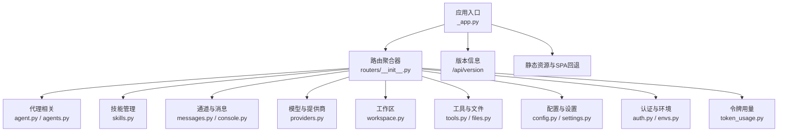
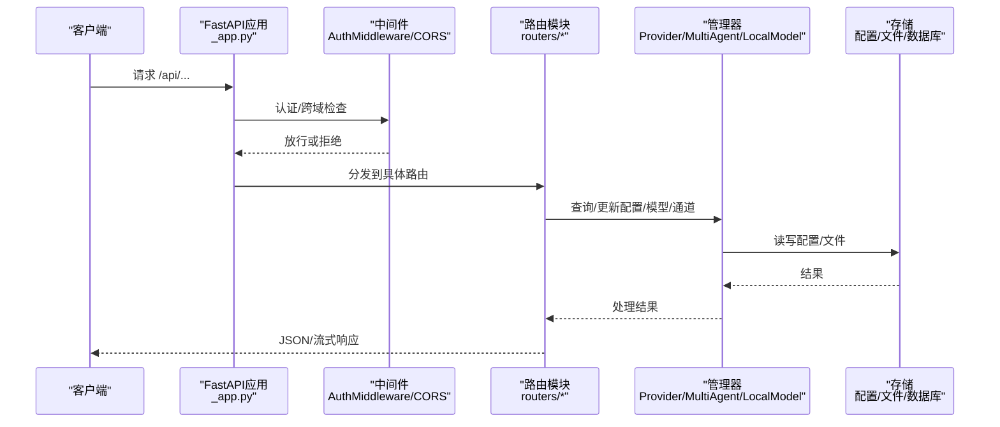

# CoPaw框架API

<cite>
**本文档引用的文件**
- [_app.py](file://copaw/src/copaw/app/_app.py)
- [routers/__init__.py](file://copaw/src/copaw/app/routers/__init__.py)
- [routers/agent.py](file://copaw/src/copaw/app/routers/agent.py)
- [routers/agents.py](file://copaw/src/copaw/app/routers/agents.py)
- [routers/skills.py](file://copaw/src/copaw/app/routers/skills.py)
- [routers/messages.py](file://copaw/src/copaw/app/routers/messages.py)
- [routers/auth.py](file://copaw/src/copaw/app/routers/auth.py)
- [routers/providers.py](file://copaw/src/copaw/app/routers/providers.py)
- [routers/workspace.py](file://copaw/src/copaw/app/routers/workspace.py)
- [routers/tools.py](file://copaw/src/copaw/app/routers/tools.py)
- [routers/files.py](file://copaw/src/copaw/app/routers/files.py)
- [routers/config.py](file://copaw/src/copaw/app/routers/config.py)
- [routers/settings.py](file://copaw/src/copaw/app/routers/settings.py)
- [routers/envs.py](file://copaw/src/copaw/app/routers/envs.py)
- [routers/token_usage.py](file://copaw/src/copaw/app/routers/token_usage.py)
- [routers/console.py](file://copaw/src/copaw/app/routers/console.py)
- [__version__.py](file://copaw/src/copaw/__version__.py)
</cite>

## 目录
1. [简介](#简介)
2. [项目结构](#项目结构)
3. [核心组件](#核心组件)
4. [架构总览](#架构总览)
5. [详细组件分析](#详细组件分析)
6. [依赖关系分析](#依赖关系分析)
7. [性能考量](#性能考量)
8. [故障排查指南](#故障排查指南)
9. [结论](#结论)
10. [附录](#附录)

## 简介
本文件为 CoPaw 框架的完整 API 接口规范文档，覆盖代理管理、技能管理、通道管理、模型管理、消息发送、配置与设置、环境变量、工作区打包上传、工具管理、文件预览、令牌用量统计以及控制台聊天等全部公共 API。文档详细说明每个端点的 HTTP 方法、URL 模式、请求参数、响应格式、错误处理，并补充认证机制、权限控制、安全考虑、版本控制策略与向后兼容性说明，以及集成与最佳实践建议。

## 项目结构
CoPaw 后端基于 FastAPI 构建，采用按功能模块划分的路由组织方式，主应用在启动时注册各功能子路由，并通过中间件实现认证与跨域支持。API 基础路径为 /api，另有部分通道专用路由位于根路径（如语音通道）。

图表来源
- [_app.py:356-375](file://copaw/src/copaw/app/_app.py#L356-L375)
- [routers/__init__.py:25-45](file://copaw/src/copaw/app/routers/__init__.py#L25-L45)

章节来源
- [_app.py:270-292](file://copaw/src/copaw/app/_app.py#L270-L292)
- [routers/__init__.py:1-60](file://copaw/src/copaw/app/routers/__init__.py#L1-L60)

## 核心组件
- 应用与中间件：注册 CORS、认证中间件；动态多代理运行器；版本查询端点。
- 路由聚合：统一挂载各功能模块路由，支持代理作用域路由。
- 全局管理器：提供者管理器、本地模型管理器、多代理管理器等。

章节来源
- [_app.py:1-275](file://copaw/src/copaw/app/_app.py#L1-L275)
- [_app.py:356-375](file://copaw/src/copaw/app/_app.py#L356-L375)

## 架构总览
CoPaw API 采用分层设计：路由层负责协议与参数校验，服务层调用配置与运行时组件，存储层持久化配置与状态。认证中间件对受保护端点进行鉴权，代理上下文中间件为代理作用域路由提供 agent_id 解析。

图表来源
- [_app.py:270-292](file://copaw/src/copaw/app/_app.py#L270-L292)
- [routers/agent.py:1-50](file://copaw/src/copaw/app/routers/agent.py#L1-L50)
- [routers/providers.py:46-56](file://copaw/src/copaw/app/routers/providers.py#L46-L56)

## 详细组件分析

### 版本与基础信息
- GET /api/version
  - 功能：返回当前 CoPaw 版本号。
  - 认证：无需。
  - 响应：{"version": "x.y.z"}
  - 错误：无。

章节来源
- [_app.py:350-354](file://copaw/src/copaw/app/_app.py#L350-L354)
- [__version__.py:1-3](file://copaw/src/copaw/__version__.py#L1-L3)

### 认证与用户管理
- POST /api/auth/login
  - 功能：用户名密码登录，返回 JWT。
  - 请求体：{"username": "...", "password": "..."}
  - 响应：{"token": "...", "username": "..."}
  - 错误：401 无效凭证；403 当未启用认证时。
- POST /api/auth/register
  - 功能：首次注册单用户账号。
  - 请求体：{"username": "...", "password": "..."}
  - 响应：{"token": "...", "username": "..."}
  - 错误：403 未启用认证/已存在用户/参数非法；409 注册失败。
- GET /api/auth/status
  - 功能：查询认证状态与是否存在用户。
  - 响应：{"enabled": true/false, "has_users": true/false}
- GET /api/auth/verify
  - 功能：验证 Bearer Token。
  - 请求头：Authorization: Bearer ...
  - 响应：{"valid": true, "username": "..."}
  - 错误：401 缺少/无效/过期。
- POST /api/auth/update-profile
  - 功能：更新用户名或密码。
  - 请求头：Authorization: Bearer ...
  - 请求体：{"current_password": "...", "new_username": "...", "new_password": "..."}
  - 响应：{"token": "...", "username": "..."}
  - 错误：403 未启用/无用户；401 当前密码不正确；400 参数非法。

章节来源
- [routers/auth.py:42-175](file://copaw/src/copaw/app/routers/auth.py#L42-L175)

### 代理管理（全局与作用域）
- GET /api/agent/files
  - 功能：列出工作目录下的 Markdown 文件。
  - 响应：文件元数据数组。
  - 错误：500 内部错误。
- GET /api/agent/files/{md_name}
  - 功能：读取工作目录文件内容。
  - 响应：{"content": "..."}
  - 错误：404 未找到；500 内部错误。
- PUT /api/agent/files/{md_name}
  - 功能：写入/更新工作目录文件。
  - 请求体：{"content": "..."}
  - 响应：{"written": true}
  - 错误：500 内部错误。
- GET /api/agent/memory
  - 功能：列出记忆目录文件。
  - 响应：文件元数据数组。
- GET /api/agent/memory/{md_name}
  - 功能：读取记忆目录文件。
  - 响应：{"content": "..."}
- PUT /api/agent/memory/{md_name}
  - 功能：写入/更新记忆目录文件。
  - 响应：{"written": true}
- GET /api/agent/language
  - 功能：获取代理语言设置。
  - 响应：{"language": "zh/en/ru", "agent_id": "..."}
- PUT /api/agent/language
  - 功能：更新代理语言并可选复制对应语言的 MD 文件。
  - 请求体：{"language": "zh/en/ru"}
  - 响应：{"language": "...", "copied_files": [...], "agent_id": "..."}
  - 错误：400 语言值非法。
- GET /api/agent/audio-mode
  - 功能：获取音频处理模式。
  - 响应：{"audio_mode": "auto/native"}
- PUT /api/agent/audio-mode
  - 功能：设置音频处理模式。
  - 请求体：{"audio_mode": "auto/native"}
  - 响应：{"audio_mode": "..."}
  - 错误：400 非法值。
- GET /api/agent/transcription-provider-type
  - 功能：获取转录提供商类型。
  - 响应：{"transcription_provider_type": "disabled/whisper_api/local_whisper"}
- PUT /api/agent/transcription-provider-type
  - 功能：设置转录提供商类型。
  - 请求体：{"transcription_provider_type": "..."}
  - 响应：{"transcription_provider_type": "..."}
  - 错误：400 非法值。
- GET /api/agent/local-whisper-status
  - 功能：检查本地 Whisper 可用性（ffmpeg/openai-whisper）。
  - 响应：可用性检测结果。
- GET /api/agent/transcription-providers
  - 功能：列出具备转录能力的提供商及当前配置。
  - 响应：{"providers": [...], "configured_provider_id": "..."}
- PUT /api/agent/transcription-provider
  - 功能：设置转录提供商（空字符串表示取消）。
  - 请求体：{"provider_id": "..."}
  - 响应：{"provider_id": "..."}
- GET /api/agent/running-config
  - 功能：获取活动代理运行配置。
  - 响应：AgentsRunningConfig
- PUT /api/agent/running-config
  - 功能：更新运行配置并触发热重载。
  - 请求体：AgentsRunningConfig
  - 响应：AgentsRunningConfig
- GET /api/agent/system-prompt-files
  - 功能：获取系统提示文件列表。
  - 响应：["file1.md", "file2.md", ...]
- PUT /api/agent/system-prompt-files
  - 功能：更新系统提示文件列表并触发热重载。
  - 请求体：["file1.md", ...]
  - 响应：["file1.md", ...]

章节来源
- [routers/agent.py:38-505](file://copaw/src/copaw/app/routers/agent.py#L38-L505)

### 多代理管理
- GET /api/agents
  - 功能：列出所有已配置代理（含描述与工作区目录）。
  - 响应：{"agents": [...]}
- PUT /api/agents/order
  - 功能：保存代理顺序（全量替换）。
  - 请求体：{"agent_ids": ["id1","id2",...]}
  - 响应：{"success": true, "agent_ids": [...]}
  - 错误：400 重复或缺失代理ID。
- GET /api/agents/{agentId}
  - 功能：获取指定代理的完整配置。
  - 响应：AgentProfileConfig
  - 错误：404 未找到。
- POST /api/agents
  - 功能：创建新代理（服务端生成短ID），初始化工作区与内置技能。
  - 请求体：CreateAgentRequest
  - 响应：AgentProfileRef
  - 错误：500 生成ID失败。
- PUT /api/agents/{agentId}
  - 功能：更新代理配置并触发热重载。
  - 请求体：AgentProfileConfig
  - 响应：AgentProfileConfig
- DELETE /api/agents/{agentId}
  - 功能：删除代理（不可删除默认代理）。
  - 响应：{"success": true, "agent_id": "..."}
  - 错误：400 不可删除默认代理；404 未找到。
- PATCH /api/agents/{agentId}/toggle
  - 功能：启用/禁用代理（不可禁用默认代理）。
  - 请求体：{"enabled": true/false}
  - 响应：{"success": true, "agent_id": "...", "enabled": true/false}
- GET /api/agents/{agentId}/files
  - 功能：列出代理工作区 Markdown 文件。
  - 响应：文件元数据数组。
- GET /api/agents/{agentId}/files/{filename}
  - 功能：读取代理工作区文件。
  - 响应：{"content": "..."}
  - 错误：404 未找到。
- PUT /api/agents/{agentId}/files/{filename}
  - 功能：写入/更新代理工作区文件。
  - 请求体：{"content": "..."}
  - 响应：{"written": true, "filename": "..."}
- GET /api/agents/{agentId}/memory
  - 功能：列出代理记忆目录文件。
  - 响应：文件元数据数组。

章节来源
- [routers/agents.py:148-722](file://copaw/src/copaw/app/routers/agents.py#L148-L722)

### 技能管理
- GET /api/skills
  - 功能：列出当前工作区技能清单。
  - 响应：SkillSpec 数组。
- POST /api/skills/refresh
  - 功能：强制对齐并刷新技能清单。
  - 响应：SkillSpec 数组。
- GET /api/skills/hub/search?q=&limit=
  - 功能：搜索技能库。
  - 响应：HubSkillSpec 数组。
- GET /api/skills/workspaces
  - 功能：列出各工作区的技能概要。
  - 响应：WorkspaceSkillSummary 数组。
- POST /api/skills/hub/install/start
  - 功能：从技能库开始安装任务（异步），返回任务ID。
  - 请求体：HubInstallRequest
  - 响应：HubInstallTask
- GET /api/skills/hub/install/status/{task_id}
  - 功能：查询安装任务状态。
  - 响应：HubInstallTask
- POST /api/skills/hub/install/cancel/{task_id}
  - 功能：取消安装任务。
  - 响应：{"task_id": "...", "status": "cancelled"}
- GET /api/skills/pool
  - 功能：列出技能池技能。
  - 响应：PoolSkillSpec 数组。
- POST /api/skills/pool/refresh
  - 功能：刷新技能池清单。
  - 响应：PoolSkillSpec 数组。
- GET /api/skills/pool/builtin-sources
  - 功能：列出内置技能源。
  - 响应：BuiltinImportSpec 数组。
- POST /api/skills
  - 功能：在工作区创建技能（带安全扫描）。
  - 请求体：CreateSkillRequest
  - 响应：{"created": true, "name": "..."}
  - 错误：409 冲突（建议重命名）；422 安全扫描失败（历史422响应结构）。
- POST /api/skills/upload
  - 功能：上传ZIP批量导入技能（带安全扫描与冲突检测）。
  - 请求体：multipart/form-data（file、enable、overwrite、target_name、rename_map）
  - 响应：导入结果
  - 错误：400 参数非法；409 冲突详情；422 安全扫描失败。
- POST /api/skills/pool/create
  - 功能：在技能池创建技能。
  - 响应：{"created": true, "name": "..."}
- PUT /api/skills/pool/save
  - 功能：编辑或另存为技能池技能。
  - 响应：保存结果
- POST /api/skills/pool/upload-zip
  - 功能：上传ZIP至技能池。
  - 响应：导入结果

章节来源
- [routers/skills.py:521-800](file://copaw/src/copaw/app/routers/skills.py#L521-L800)

### 通道与消息发送
- POST /api/messages/send
  - 功能：代理主动向指定通道发送文本消息。
  - 请求头：X-Agent-Id: 可选，默认"default"
  - 请求体：SendMessageRequest
  - 响应：SendMessageResponse
  - 错误：404 代理不存在；500 通道管理器未初始化/发送失败；404 通道未找到。

章节来源
- [routers/messages.py:75-184](file://copaw/src/copaw/app/routers/messages.py#L75-L184)

### 模型与提供商
- GET /api/models
  - 功能：列出所有提供商。
  - 响应：ProviderInfo 数组。
- PUT /api/models/{provider_id}/config
  - 功能：配置提供商（API Key/Base URL/Chat模型/生成参数）。
  - 请求体：ProviderConfigRequest
  - 响应：ProviderInfo
- POST /api/models/custom-providers
  - 功能：创建自定义提供商。
  - 请求体：CreateCustomProviderRequest
  - 响应：ProviderInfo
- POST /api/models/{provider_id}/test
  - 功能：测试提供商连接。
  - 请求体：TestProviderRequest
  - 响应：TestConnectionResponse
- POST /api/models/{provider_id}/discover
  - 功能：发现提供商可用模型。
  - 请求体：DiscoverModelsRequest
  - 响应：DiscoverModelsResponse
- POST /api/models/{provider_id}/models/test
  - 功能：测试特定模型连通性。
  - 请求体：TestModelRequest
  - 响应：TestConnectionResponse
- DELETE /api/models/custom-providers/{provider_id}
  - 功能：删除自定义提供商。
  - 响应：ProviderInfo 数组
- POST /api/models/{provider_id}/models
  - 功能：为提供商添加模型。
  - 请求体：AddModelRequest
  - 响应：ProviderInfo
- POST /api/models/{provider_id}/models/{model_id:path}/probe-multimodal
  - 功能：探测模型多模态能力（图像/视频）。
  - 响应：ProbeMultimodalResponse
- DELETE /api/models/{provider_id}/models/{model_id:path}
  - 功能：从提供商移除模型。
  - 响应：ProviderInfo
- GET /api/models/active?scope=effective&agent_id=
  - 功能：获取生效的活跃大模型（支持作用域：effective/global/agent）。
  - 响应：ActiveModelsInfo
- PUT /api/models/active
  - 功能：设置活跃大模型（支持全局或指定代理）。
  - 请求体：ModelSlotRequest
  - 响应：ActiveModelsInfo
  - 错误：400/404 参数或资源不存在；500 保存配置失败。

章节来源
- [routers/providers.py:134-575](file://copaw/src/copaw/app/routers/providers.py#L134-L575)

### 工作区打包与上传
- GET /api/workspace/download
  - 功能：将代理工作区打包为 ZIP 并流式下载。
  - 响应：application/zip（Content-Disposition）
  - 错误：404 工作区不存在。
- POST /api/workspace/upload
  - 功能：上传 ZIP 并合并到工作区（覆盖/合并非清空）。
  - 请求体：multipart/form-data（file: zip）
  - 响应：{"success": true}
  - 错误：400 非法ZIP/路径穿越；500 合并失败。

章节来源
- [routers/workspace.py:112-203](file://copaw/src/copaw/app/routers/workspace.py#L112-L203)

### 工具管理
- GET /api/tools
  - 功能：列出内置工具及其启用状态（针对活动代理）。
  - 响应：ToolInfo 数组。
- PATCH /api/tools/{tool_name}/toggle
  - 功能：切换工具启用状态并触发热重载。
  - 响应：ToolInfo
  - 错误：404 工具不存在。
- PATCH /api/tools/{tool_name}/async-execution
  - 功能：更新工具异步执行设置并触发热重载。
  - 请求体：{"async_execution": true/false}
  - 响应：ToolInfo
  - 错误：404 工具不存在。

章节来源
- [routers/tools.py:35-177](file://copaw/src/copaw/app/routers/tools.py#L35-L177)

### 文件预览
- GET/HEAD /api/files/preview/{filepath:path}
  - 功能：预览文件（支持 HEAD）。
  - 响应：FileResponse（按实际文件名）
  - 错误：404 未找到。

章节来源
- [routers/files.py:9-25](file://copaw/src/copaw/app/routers/files.py#L9-L25)

### 配置与设置
- GET /api/config/channels
  - 功能：列出所有可用通道的配置（含是否内置）。
  - 响应：{"channel_name": {...}}
- GET /api/config/channels/types
  - 功能：返回可用通道类型标识列表。
  - 响应：["telegram","dingtalk",...]
- PUT /api/config/channels
  - 功能：一次性更新所有通道配置。
  - 请求体：ChannelConfig
  - 响应：ChannelConfig
- GET /api/config/channels/{channel_name}
  - 功能：获取指定通道配置。
  - 响应：ChannelConfigUnion
- PUT /api/config/channels/{channel_name}
  - 功能：更新指定通道配置。
  - 请求体：单通道配置字典
  - 响应：ChannelConfigUnion
- GET /api/config/channels/weixin/qrcode
  - 功能：获取微信 iLink 登录二维码（base64 PNG）。
  - 响应：{"qrcode_img": "...", "qrcode": "..."}
- GET /api/config/channels/weixin/qrcode/status?qrcode=
  - 功能：轮询二维码扫描状态。
  - 响应：{"status": "...", "bot_token": "...", "base_url": "..."}
- GET /api/config/heartbeat
  - 功能：获取心跳配置。
  - 响应：心跳配置对象
- PUT /api/config/heartbeat
  - 功能：更新心跳配置并异步重调度。
  - 请求体：HeartbeatBody
  - 响应：心跳配置对象
- GET /api/config/agents/llm-routing
  - 功能：获取代理 LLM 路由设置。
  - 响应：AgentsLLMRoutingConfig
- PUT /api/config/agents/llm-routing
  - 功能：更新代理 LLM 路由设置。
  - 请求体：AgentsLLMRoutingConfig
  - 响应：AgentsLLMRoutingConfig
- GET /api/config/user-timezone
  - 功能：获取用户 IANA 时区。
  - 响应：{"timezone": "..."}
- PUT /api/config/user-timezone
  - 功能：设置用户 IANA 时区。
  - 请求体：{"timezone": "..."}
  - 错误：400 缺少时区。
- GET /api/config/security/tool-guard
  - 功能：获取工具守卫设置。
  - 响应：ToolGuardConfig
- PUT /api/config/security/tool-guard
  - 功能：更新工具守卫设置并重载规则。
  - 请求体：ToolGuardConfig
  - 响应：ToolGuardConfig
- GET /api/config/security/tool-guard/builtin-rules
  - 功能：列出内置守卫规则。
  - 响应：ToolGuardRuleConfig 数组
- GET /api/config/security/file-guard
  - 功能：获取文件守卫设置（默认敏感路径）。
  - 响应：{"enabled": true, "paths": [...]}
- PUT /api/config/security/file-guard
  - 功能：更新文件守卫设置并重载规则。
  - 请求体：{"enabled": true/false, "paths": [...]}
  - 响应：{"enabled": true/false, "paths": [...]}
- GET /api/config/security/skill-scanner
  - 功能：获取技能扫描器设置。
  - 响应：SkillScannerConfig
- PUT /api/config/security/skill-scanner
  - 功能：更新技能扫描器设置。
  - 请求体：SkillScannerConfig
  - 响应：SkillScannerConfig
- GET /api/config/security/skill-scanner/blocked-history
  - 功能：获取被阻技能历史。
  - 响应：历史记录数组
- DELETE /api/config/security/skill-scanner/blocked-history
  - 功能：清空被阻技能历史。
  - 响应：{"cleared": true}
- DELETE /api/config/security/skill-scanner/blocked-history/{index}
  - 功能：删除单条被阻技能历史。
  - 响应：{"removed": true}
- POST /api/config/security/skill-scanner/whitelist
  - 功能：添加技能到白名单。
  - 请求体：{"skill_name": "...", "content_hash": "..."}
  - 响应：{"whitelisted": true, "skill_name": "..."}
- DELETE /api/config/security/skill-scanner/whitelist/{skill_name}
  - 功能：从白名单移除技能。
  - 响应：{"removed": true, "skill_name": "..."}

章节来源
- [routers/config.py:62-701](file://copaw/src/copaw/app/routers/config.py#L62-L701)

### 全局设置（UI语言等）
- GET /api/settings/language
  - 功能：获取 UI 语言。
  - 响应：{"language": "en/zh/ja/ru"}
- PUT /api/settings/language
  - 功能：更新 UI 语言。
  - 请求体：{"language": "en/zh/ja/ru"}
  - 响应：{"language": "..."}
  - 错误：400 语言非法。

章节来源
- [routers/settings.py:39-59](file://copaw/src/copaw/app/routers/settings.py#L39-L59)

### 环境变量管理
- GET /api/envs
  - 功能：列出所有环境变量。
  - 响应：[{"key": "...", "value": "..."}]
- PUT /api/envs
  - 功能：批量保存（全量替换）。
  - 请求体：{"KEY": "VALUE", ...}
  - 响应：[{"key": "...", "value": "..."}]
  - 错误：400 键为空。
- DELETE /api/envs/{key}
  - 功能：删除单个环境变量。
  - 响应：[{"key": "...", "value": "..."}]
  - 错误：404 未找到。

章节来源
- [routers/envs.py:32-81](file://copaw/src/copaw/app/routers/envs.py#L32-L81)

### 令牌用量统计
- GET /api/token-usage?start_date=&end_date=&model=&provider=
  - 功能：按日期、模型、提供商聚合统计令牌用量。
  - 响应：TokenUsageSummary
  - 错误：400 日期格式错误（当传入非法日期时自动修正范围）

章节来源
- [routers/token_usage.py:23-62](file://copaw/src/copaw/app/routers/token_usage.py#L23-L62)

### 控制台聊天与推送
- POST /api/console/chat
  - 功能：与控制台聊天（SSE 流式响应）。支持 reconnect=true 重连。
  - 请求体：AgentRequest 或等价字典
  - 响应：text/event-stream
  - 错误：400 参数非法；503 控制台通道未找到。
- POST /api/console/chat/stop
  - 功能：停止指定 chat_id 的运行。
  - 请求体：query 参数 chat_id
  - 响应：{"stopped": true/false}
- POST /api/console/upload
  - 功能：上传文件用于聊天（限制大小）。
  - 请求体：multipart/form-data（file）
  - 响应：{"url": "...", "file_name": "...", "size": ...}
  - 错误：400 文件过大；503 控制台通道未找到。
- GET /api/console/push-messages?session_id=
  - 功能：获取待推送消息（可按会话过滤）。
  - 响应：{"messages": [...]}

章节来源
- [routers/console.py:68-216](file://copaw/src/copaw/app/routers/console.py#L68-L216)

## 依赖关系分析
- 中间件依赖：认证中间件、CORS 中间件、代理上下文中间件。
- 管理器依赖：ProviderManager、MultiAgentManager、LocalModelManager。
- 存储依赖：配置文件、工作区文件、令牌用量统计、设置文件。

图表来源
- [_app.py:270-292](file://copaw/src/copaw/app/_app.py#L270-L292)
- [routers/__init__.py:25-45](file://copaw/src/copaw/app/routers/__init__.py#L25-L45)

章节来源
- [_app.py:193-225](file://copaw/src/copaw/app/_app.py#L193-L225)

## 性能考量
- 流式响应：控制台聊天使用 SSE，避免长连接阻塞；工作区下载使用内存 ZIP 流式输出。
- 异步任务：技能安装、心跳重调度、令牌用量统计等均在后台任务中执行，避免阻塞主线程。
- 热重载：配置更新后通过调度器异步触发，保证接口快速返回。
- 上传限制：文件上传大小限制，防止内存溢出与拒绝服务。

## 故障排查指南
- 认证相关
  - 401 未提供 Token 或 Token 无效/过期：检查 Authorization 头与服务端密钥配置。
  - 403 注册/更新被拒绝：确认认证开关与是否已存在用户。
- 代理与工作区
  - 404 代理不存在：确认 X-Agent-Id 或代理ID正确。
  - 500 工作区/通道未初始化：检查代理启动状态与通道管理器。
- 技能管理
  - 422 安全扫描失败：查看扫描器返回的严重级别与发现项；必要时加入白名单。
  - 409 冲突：根据建议重命名或覆盖策略处理。
- 模型与提供商
  - 404 提供商/模型不存在：确认提供商ID与模型ID正确。
  - 连接测试失败：核对 API Key、Base URL、网络可达性。
- 文件与上传
  - 400 非法ZIP/路径穿越：确保上传ZIP合法且无危险路径。
  - 500 合并失败：检查磁盘空间与权限。

章节来源
- [routers/auth.py:42-175](file://copaw/src/copaw/app/routers/auth.py#L42-L175)
- [routers/skills.py:62-103](file://copaw/src/copaw/app/routers/skills.py#L62-L103)
- [routers/providers.py:102-122](file://copaw/src/copaw/app/routers/providers.py#L102-L122)
- [routers/workspace.py:56-105](file://copaw/src/copaw/app/routers/workspace.py#L56-L105)
- [routers/console.py:82-148](file://copaw/src/copaw/app/routers/console.py#L82-L148)

## 结论
CoPaw 框架 API 设计遵循 REST 风格，覆盖代理、技能、通道、模型、配置、工具、文件、令牌用量等核心领域。通过中间件实现认证与跨域，通过管理器解耦业务逻辑与存储，通过流式与异步机制提升性能与用户体验。建议在生产环境中启用认证、严格控制文件上传与技能导入、合理配置模型与通道参数，并定期审查安全策略与令牌用量。

## 附录

### 认证与权限控制
- 认证方式：Bearer Token（JWT）。
- 权限控制：受保护端点需有效 Token；部分端点仅在启用认证时可用。
- 安全建议：最小权限原则、定期轮换密钥、限制 Token 有效期。

章节来源
- [routers/auth.py:42-175](file://copaw/src/copaw/app/routers/auth.py#L42-L175)

### API 版本控制与向后兼容
- 版本来源：应用内嵌版本号，通过 /api/version 获取。
- 兼容性策略：当前版本为 1.x，遵循语义化版本；新增字段以可选形式提供，避免破坏既有客户端行为。
- 建议：客户端在解析响应时忽略未知字段，避免因新增字段导致解析失败。

章节来源
- [_app.py:350-354](file://copaw/src/copaw/app/_app.py#L350-L354)
- [__version__.py:1-3](file://copaw/src/copaw/__version__.py#L1-L3)

### 请求与响应示例（路径指引）
- 登录示例：[POST /api/auth/login:42-53](file://copaw/src/copaw/app/routers/auth.py#L42-L53)
- 创建代理示例：[POST /api/agents:243-314](file://copaw/src/copaw/app/routers/agents.py#L243-L314)
- 技能上传示例：[POST /api/skills/upload:686-731](file://copaw/src/copaw/app/routers/skills.py#L686-L731)
- 控制台聊天示例：[POST /api/console/chat:75-148](file://copaw/src/copaw/app/routers/console.py#L75-L148)

### 最佳实践
- 使用 X-Agent-Id 头指定代理上下文，避免跨代理误操作。
- 对外部输入（上传ZIP、配置JSON）进行严格校验与白名单控制。
- 在高并发场景下，优先使用流式响应与异步任务，减少阻塞。
- 定期备份工作区与配置，配合 /api/workspace/download 与 /api/workspace/upload 使用。