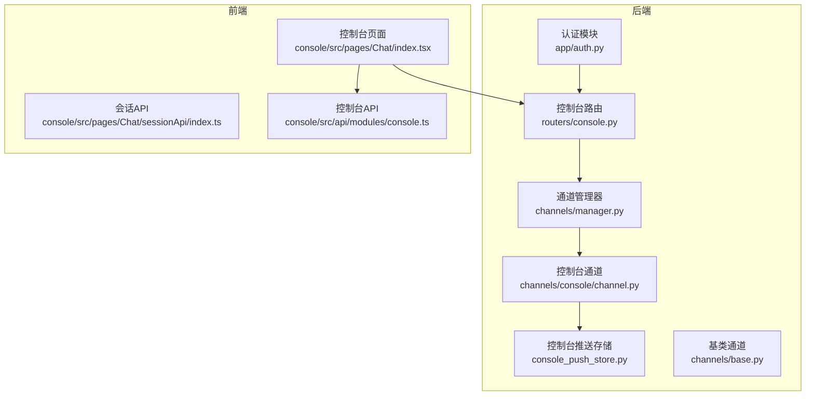
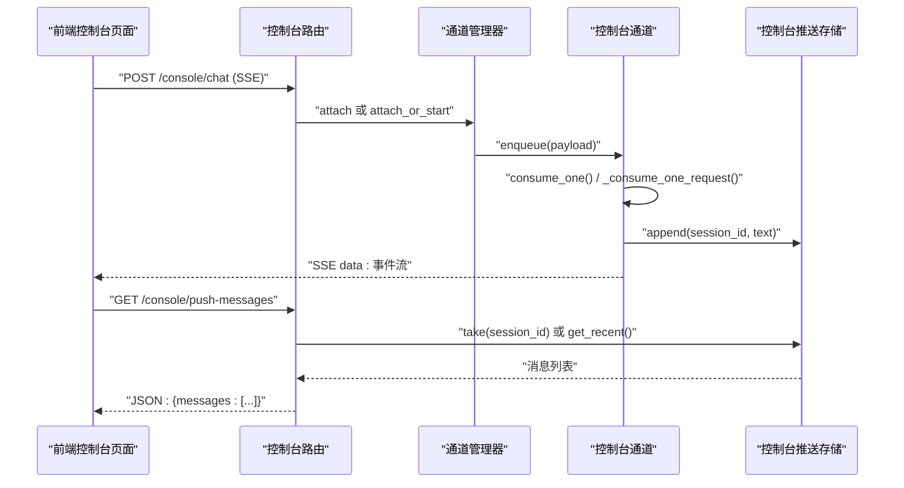
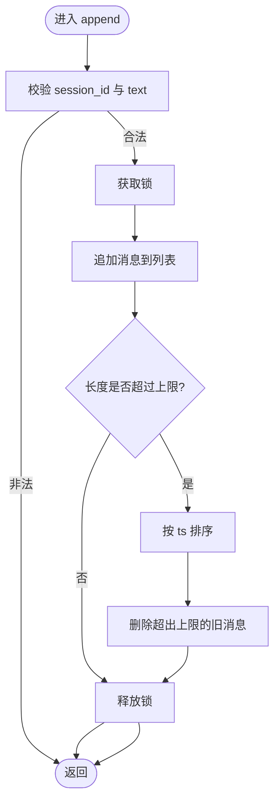
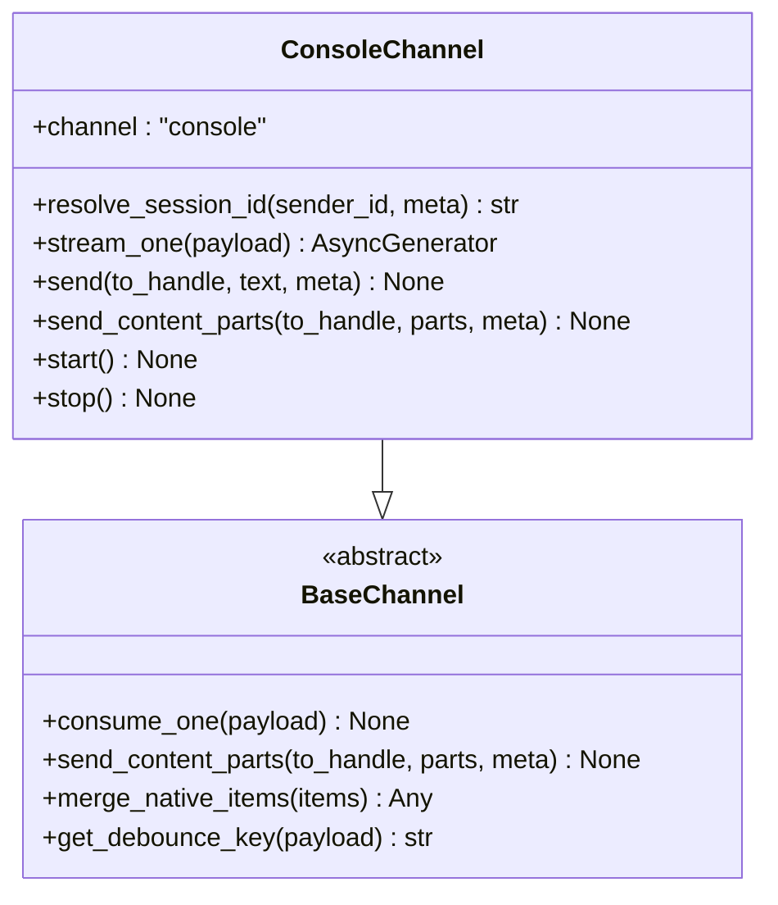
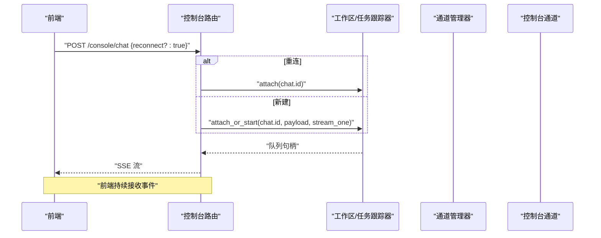
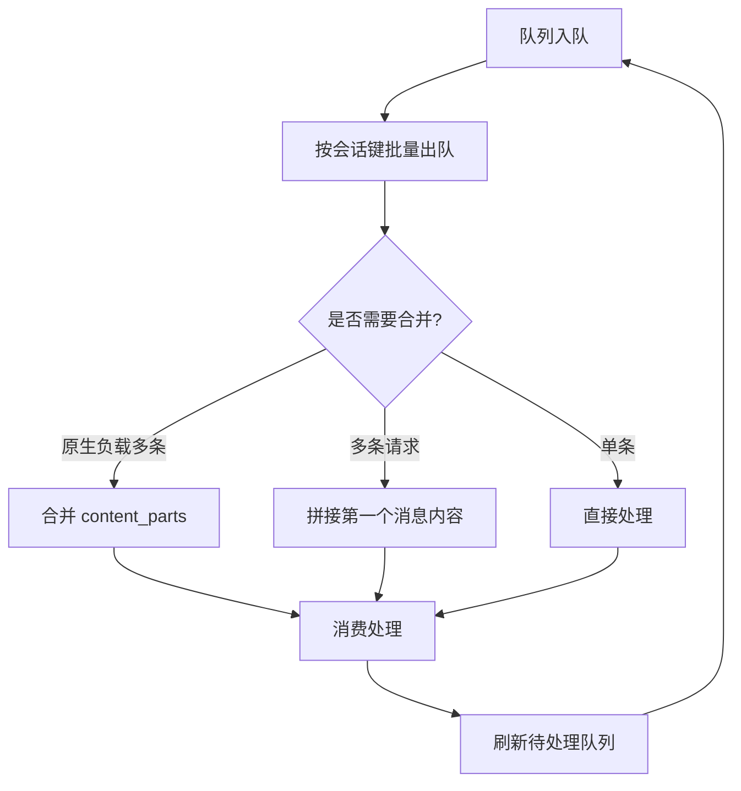
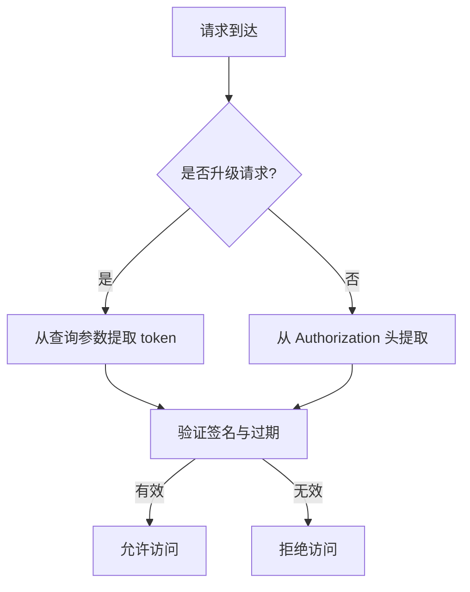
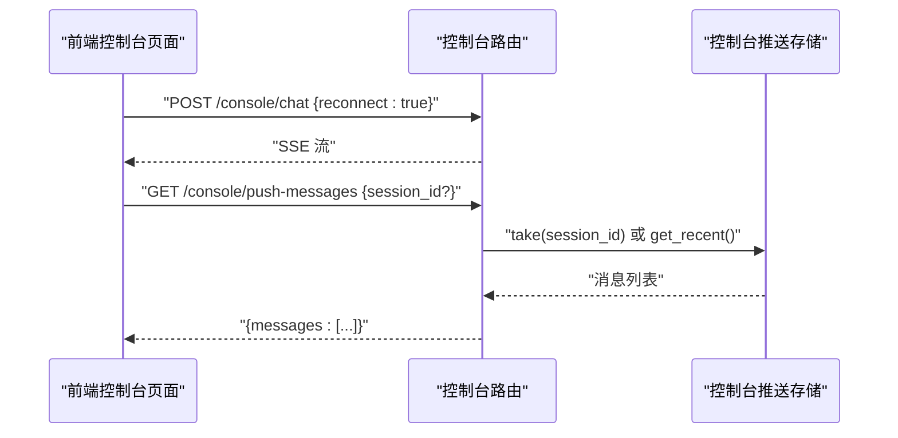
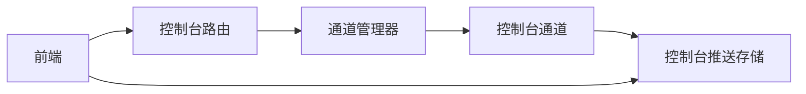

# WebSocket实时通信API

<cite>
**本文档引用的文件**
- [console_push_store.py](file://src/copaw/app/console_push_store.py)
- [channel.py](file://src/copaw/app/channels/console/channel.py)
- [console.py](file://src/copaw/app/routers/console.py)
- [manager.py](file://src/copaw/app/channels/manager.py)
- [base.py](file://src/copaw/app/channels/base.py)
- [auth.py](file://src/copaw/app/auth.py)
- [index.ts](file://console/src/pages/Chat/index.tsx)
- [sessionApi/index.ts](file://console/src/pages/Chat/sessionApi/index.ts)
- [console.ts](file://console/src/api/modules/console.ts)
- [test_qq_channel.py](file://tests/unit/channels/test_qq_channel.py)
</cite>

## 目录
1. [简介](#简介)
2. [项目结构](#项目结构)
3. [核心组件](#核心组件)
4. [架构总览](#架构总览)
5. [详细组件分析](#详细组件分析)
6. [依赖分析](#依赖分析)
7. [性能考虑](#性能考虑)
8. [故障排查指南](#故障排查指南)
9. [结论](#结论)
10. [附录](#附录)

## 简介

本文件面向 CoPaw 控制台的实时消息推送与会话管理能力，聚焦于控制台推送存储、会话管理以及与前端的交互模式。文档从系统架构、组件职责、数据流与处理逻辑入手，给出连接与消息格式规范、事件类型定义、实时交互模式、错误处理与重连策略，并提供连接示例、消息格式示例与事件处理示例，帮助开发者快速理解并集成。

CoPaw 的实时交互采用"后端 SSE + 前端事件监听"的模式。后端通过 FastAPI 路由将 Agent 的事件流以 Server-Sent Events 推送给前端；同时，后端在控制台通道输出文本时，将消息写入控制台推送存储，前端通过轮询或 SSE 获取推送消息，实现系统通知与状态更新的实时展示。

## 项目结构

围绕 WebSocket 与实时推送的关键模块如下：

- **后端**
  - 控制台推送存储：内存队列，按会话保留最近消息，支持拉取与清空
  - 控制台通道：负责将消息打印到终端并推送到前端推送存储
  - 控制台路由：提供 SSE 推送接口与聊天接口
  - 通道管理器：统一调度各通道的消息队列与消费流程
  - 基类通道：统一事件模型、内容合并、去抖与发送流程
  - 认证模块：提取并校验 Bearer 令牌，支持 WebSocket 查询参数传参

- **前端**
  - 控制台页面：发起聊天请求、接收 SSE、处理重连
  - 会话 API：维护会话列表、解析本地临时会话 ID
  - 控制台 API：获取推送消息

**图表来源**
- [console_push_store.py:1-83](file://src/copaw/app/console_push_store.py#L1-L83)
- [channel.py:1-471](file://src/copaw/app/channels/console/channel.py#L1-L471)
- [console.py:1-241](file://src/copaw/app/routers/console.py#L1-L241)
- [manager.py:1-565](file://src/copaw/app/channels/manager.py#L1-L565)
- [base.py:1-800](file://src/copaw/app/channels/base.py#L1-L800)
- [auth.py:356-367](file://src/copaw/app/auth.py#L356-L367)
- [index.ts:603-640](file://console/src/pages/Chat/index.tsx#L603-L640)
- [sessionApi/index.ts:432-474](file://console/src/pages/Chat/sessionApi/index.ts#L432-L474)
- [console.ts:1-11](file://console/src/api/modules/console.ts#L1-L11)

**章节来源**
- [console_push_store.py:1-83](file://src/copaw/app/console_push_store.py#L1-L83)
- [channel.py:1-471](file://src/copaw/app/channels/console/channel.py#L1-L471)
- [console.py:1-241](file://src/copaw/app/routers/console.py#L1-L241)
- [manager.py:1-565](file://src/copaw/app/channels/manager.py#L1-L565)
- [base.py:1-800](file://src/copaw/app/channels/base.py#L1-L800)
- [auth.py:356-367](file://src/copaw/app/auth.py#L356-L367)
- [index.ts:603-640](file://console/src/pages/Chat/index.tsx#L603-L640)
- [sessionApi/index.ts:432-474](file://console/src/pages/Chat/sessionApi/index.ts#L432-L474)
- [console.ts:1-11](file://console/src/api/modules/console.ts#L1-L11)

## 核心组件

- **控制台推送存储**
  - 功能：在内存中维护一个有界队列，按会话 ID 过滤消息；支持追加、按会话取出、全局取出与按时间窗口过滤
  - 关键点：线程安全锁、最大条数与最大年龄限制、剥离时间戳字段

- **控制台通道**
  - 功能：将消息打印到终端，并将文本内容推送到前端推送存储；支持内容部件（文本/图片/视频/音频/文件/拒绝）的合并与发送
  - 关键点：会话 ID 解析、媒体目录解析、SSE 事件流输出

- **控制台路由**
  - 功能：提供聊天接口（SSE）、停止聊天、上传文件、下载文件、获取推送消息
  - 关键点：SSE 响应头、重连支持、任务跟踪器挂接

- **通道管理器**
  - 功能：为每个通道创建队列与消费者工作协程，按会话键合并消息、去抖、并发处理
  - 关键点：队列大小、工作协程数量、去抖策略、合并策略

- **基类通道**
  - 功能：统一事件模型、内容部件转换、错误处理回调、消息完成后的发送钩子
  - 关键点：内容合并、去抖缓冲、渲染样式、发送媒体附件

- **认证模块**
  - 功能：从请求头或 WebSocket 查询参数提取 Bearer 令牌，支持本地回环免认证
  - 关键点：令牌格式与签名验证、查询参数 token 提取

**章节来源**
- [console_push_store.py:22-83](file://src/copaw/app/console_push_store.py#L22-L83)
- [channel.py:424-458](file://src/copaw/app/channels/console/channel.py#L424-L458)
- [console.py:68-145](file://src/copaw/app/routers/console.py#L68-L145)
- [manager.py:307-378](file://src/copaw/app/channels/manager.py#L307-L378)
- [base.py:443-583](file://src/copaw/app/channels/base.py#L443-L583)
- [auth.py:135-158](file://src/copaw/app/auth.py#L135-L158)

## 架构总览

CoPaw 的实时交互采用"后端 SSE + 前端事件监听"的模式。后端通过 FastAPI 路由将 Agent 的事件流以 Server-Sent Events 推送给前端；同时，后端在控制台通道输出文本时，将消息写入控制台推送存储，前端通过轮询或 SSE 获取推送消息，实现系统通知与状态更新的实时展示。

**图表来源**
- [console.py:68-145](file://src/copaw/app/routers/console.py#L68-L145)
- [manager.py:289-306](file://src/copaw/app/channels/manager.py#L289-L306)
- [channel.py:424-458](file://src/copaw/app/channels/console/channel.py#L424-L458)
- [console_push_store.py:41-83](file://src/copaw/app/console_push_store.py#L41-L83)

## 详细组件分析

### 组件一：控制台推送存储

**数据结构**
- 内存列表：元素包含 id、text、sticky、ts、session_id 与可选元数据
- 锁：保证并发安全
- 限制：最多保留 N 条消息，超过则按时间排序删除旧消息；默认最大年龄 60 秒

**关键方法**
- 追加：append(session_id, text, sticky=False)
- 按会话取出：take(session_id)
- 全量取出：take_all()
- 最近消息：get_recent(max_age_seconds=60)

**复杂度**
- 追加：O(1)，必要时 O(N log N) 排序删除
- 取出：O(N)
- 最近消息：O(N)

**图表来源**
- [console_push_store.py:22-39](file://src/copaw/app/console_push_store.py#L22-L39)

**章节来源**
- [console_push_store.py:1-83](file://src/copaw/app/console_push_store.py#L1-L83)

### 组件二：控制台通道

**会话 ID 解析**
- 若 meta 中提供 session_id，则使用；否则使用 console:<sender_id>

**文本与内容部件发送**
- send：打印到终端并调用推送存储 append
- send_content_parts：打印并合并文本后调用推送存储 append

**SSE 输出**
- stream_one：将事件序列化为 data 行，供前端 SSE 接收

**媒体目录解析**
- 支持根据工作区或显式配置解析媒体目录，用于本地文件引用

**图表来源**
- [channel.py:56-471](file://src/copaw/app/channels/console/channel.py#L56-L471)
- [base.py:69-125](file://src/copaw/app/channels/base.py#L69-L125)

**章节来源**
- [channel.py:174-458](file://src/copaw/app/channels/console/channel.py#L174-L458)
- [base.py:126-207](file://src/copaw/app/channels/base.py#L126-L207)

### 组件三：控制台路由与会话管理

**聊天接口（SSE）**
- POST /console/chat：启动或附加到运行中的任务，返回事件流
- 支持 reconnect 参数进行重连

**停止聊天**
- POST /console/chat/stop：请求停止指定聊天

**文件上传与下载**
- POST /console/upload：保存到媒体目录
- GET /console/files/{agent_id}/{filename}：提供文件服务

**推送消息**
- GET /console/push-messages：按会话或全局返回未消费消息

**图表来源**
- [console.py:68-145](file://src/copaw/app/routers/console.py#L68-L145)
- [manager.py:114-134](file://src/copaw/app/channels/manager.py#L114-L134)

**章节来源**
- [console.py:68-241](file://src/copaw/app/routers/console.py#L68-L241)
- [manager.py:307-378](file://src/copaw/app/channels/manager.py#L307-L378)

### 组件四：通道管理器与消息合并

**队列与消费者**
- 为每个启用通道创建队列与固定数量的消费者协程
- 按会话键去抖：同一会话的消息在处理期间被暂存并合并

**合并策略**
- 原生负载（含 content_parts）：合并 content_parts 并保留部分元信息
- AgentRequest：拼接第一个消息的内容

**并发与一致性**
- 使用键级锁确保同一会话的处理串行化，避免乱序与重复

**图表来源**
- [manager.py:42-112](file://src/copaw/app/channels/manager.py#L42-L112)
- [base.py:145-207](file://src/copaw/app/channels/base.py#L145-L207)

**章节来源**
- [manager.py:289-378](file://src/copaw/app/channels/manager.py#L289-L378)
- [base.py:443-583](file://src/copaw/app/channels/base.py#L443-L583)

### 组件五：认证与 WebSocket 令牌传递

**令牌提取**
- 优先从 Authorization 头 Bearer 提取
- WebSocket 场景下从查询参数 token 提取

**令牌验证**
- HMAC-SHA256 签名与过期时间检查

**本地回环免认证**
- 来自 127.0.0.1/::1 的请求跳过认证

**图表来源**
- [auth.py:356-367](file://src/copaw/app/auth.py#L356-L367)
- [auth.py:135-158](file://src/copaw/app/auth.py#L135-L158)

**章节来源**
- [auth.py:135-158](file://src/copaw/app/auth.py#L135-L158)
- [auth.py:356-367](file://src/copaw/app/auth.py#L356-L367)

### 组件六：前端交互与会话管理

**聊天重连**
- 前端检测 reconnect 标志，向 /console/chat 发起重连请求
- 使用 ReadableStream 将 SSE 流转换为可读流

**会话解析**
- 本地临时会话 ID 与真实会话 ID 的映射与异步解析

**推送消息**
- 通过 /console/push-messages 获取未消费消息，去重与上限控制由前端负责

**图表来源**
- [index.ts:603-640](file://console/src/pages/Chat/index.tsx#L603-L640)
- [console.py:226-241](file://src/copaw/app/routers/console.py#L226-L241)
- [console_push_store.py:41-83](file://src/copaw/app/console_push_store.py#L41-L83)

**章节来源**
- [index.ts:603-640](file://console/src/pages/Chat/index.tsx#L603-L640)
- [sessionApi/index.ts:432-474](file://console/src/pages/Chat/sessionApi/index.ts#L432-L474)
- [console.ts:1-11](file://console/src/api/modules/console.ts#L1-L11)

## 依赖分析

**后端模块耦合**
- 控制台通道依赖通道管理器提供的队列与去抖机制
- 控制台路由依赖工作区与任务跟踪器，负责会话生命周期管理
- 控制台推送存储被多个后端路径共享（控制台通道、定时任务等）

**前后端交互**
- 前端通过 SSE 接收事件流，通过 REST API 拉取推送消息
- 会话 ID 在后端与前端之间保持一致，支持重连与恢复

**图表来源**
- [console.py:68-145](file://src/copaw/app/routers/console.py#L68-L145)
- [manager.py:307-378](file://src/copaw/app/channels/manager.py#L307-L378)
- [channel.py:424-458](file://src/copaw/app/channels/console/channel.py#L424-L458)
- [console_push_store.py:1-83](file://src/copaw/app/console_push_store.py#L1-L83)
- [index.ts:603-640](file://console/src/pages/Chat/index.tsx#L603-L640)

**章节来源**
- [console.py:68-145](file://src/copaw/app/routers/console.py#L68-L145)
- [manager.py:307-378](file://src/copaw/app/channels/manager.py#L307-L378)
- [channel.py:424-458](file://src/copaw/app/channels/console/channel.py#L424-L458)
- [console_push_store.py:1-83](file://src/copaw/app/console_push_store.py#L1-L83)
- [index.ts:603-640](file://console/src/pages/Chat/index.tsx#L603-L640)

## 性能考虑

- **队列与去抖**
  - 通道管理器为每个通道设置固定队列上限与消费者数量，避免内存膨胀
  - 去抖策略减少同会话内短间隔消息的处理次数

- **推送存储**
  - 有界队列与时间窗口清理降低内存占用

- **SSE 流**
  - 事件流以 data 行传输，前端按行解析，适合长连接场景

- **并发模型**
  - 基于 asyncio 的队列与任务，适合高并发低延迟的事件分发

[本节为通用性能讨论，不直接分析具体文件]

## 故障排查指南

**SSE 连接失败**
- 检查 /console/chat 是否返回 200 且响应头包含正确的 SSE 设置
- 确认后端日志中无异常

**无法获取推送消息**
- 确认 session_id 是否正确传入 /console/push-messages
- 检查控制台推送存储是否已 append 成功

**重连问题**
- 前端需携带 reconnect=true 与正确的 session_id
- 后端需确认任务跟踪器存在对应会话的任务

**WebSocket 认证失败**
- 确认 Authorization 头或查询参数 token 正确
- 检查令牌签名与过期时间

**章节来源**
- [console.py:112-128](file://src/copaw/app/routers/console.py#L112-L128)
- [index.ts:611-631](file://console/src/pages/Chat/index.tsx#L611-L631)
- [auth.py:356-367](file://src/copaw/app/auth.py#L356-L367)

## 结论

CoPaw 的控制台实时推送与会话管理通过"SSE 事件流 + 控制台推送存储"的组合实现，既满足了聊天消息的实时展示，也支持系统通知与状态更新的即时呈现。通道管理器与基类通道提供了统一的去抖、合并与发送机制，前端通过重连与会话解析实现了稳定的用户体验。整体设计在可扩展性与易用性之间取得平衡，适合在多通道场景下复用。

[本节为总结性内容，不直接分析具体文件]

## 附录

### WebSocket 连接建立过程

**升级请求**
- 前端发起 HTTP 升级请求，携带 token 查询参数
- 后端认证模块从查询参数提取并验证令牌

**会话恢复**
- 前端在断线后携带 reconnect=true 与 session_id 重连
- 后端任务跟踪器挂接到现有任务，继续推送事件流

**章节来源**
- [auth.py:356-367](file://src/copaw/app/auth.py#L356-L367)
- [console.py:112-128](file://src/copaw/app/routers/console.py#L112-L128)
- [index.ts:611-631](file://console/src/pages/Chat/index.tsx#L611-L631)

### 消息格式规范

**SSE 事件格式**
- 每条事件以 data: 开头，后跟 JSON 字符串
- 事件类型由后端事件对象与状态决定

**推送消息格式**
- id：唯一标识
- text：推送文本
- sticky：是否置顶显示（存储层存在该字段，前端可据此处理）

**章节来源**
- [channel.py:317-323](file://src/copaw/app/channels/console/channel.py#L317-L323)
- [console_push_store.py:22-35](file://src/copaw/app/console_push_store.py#L22-L35)

### 事件类型定义与实时交互模式

**事件类型**
- message：消息事件，Completed 时触发发送
- response：响应事件，用于承载最终响应

**实时交互**
- 前端持续监听 SSE，后端在事件产生时立即推送
- 控制台通道在消息完成后将文本内容写入推送存储，前端可同步获取

**章节来源**
- [base.py:551-565](file://src/copaw/app/channels/base.py#L551-L565)
- [channel.py:325-336](file://src/copaw/app/channels/console/channel.py#L325-L336)

### 控制台推送存储与会话管理

**存储行为**
- append：按会话保留，超限与超时自动清理
- take/take_all：按会话或全局取出并清空
- get_recent：按时间窗口过滤

**会话管理**
- 会话 ID 解析规则：优先 meta.session_id，否则 console:<sender_id>
- 前端对本地临时 ID 与真实 ID 的映射与解析

**章节来源**
- [console_push_store.py:41-83](file://src/copaw/app/console_push_store.py#L41-L83)
- [channel.py:174-185](file://src/copaw/app/channels/console/channel.py#L174-L185)
- [sessionApi/index.ts:432-474](file://console/src/pages/Chat/sessionApi/index.ts#L432-L474)

### 实时消息传递机制

**事件流**
- 后端通过事件生成器将 Agent 事件序列化为 SSE
- 前端通过 ReadableStream 读取并解析

**推送消息**
- 控制台通道在消息完成后将文本写入推送存储
- 前端轮询 /console/push-messages 获取最新消息

**章节来源**
- [console.py:130-145](file://src/copaw/app/routers/console.py#L130-L145)
- [channel.py:440-457](file://src/copaw/app/channels/console/channel.py#L440-L457)
- [console_push_store.py:41-83](file://src/copaw/app/console_push_store.py#L41-L83)

### 错误处理机制与重连策略

**错误处理**
- 后端捕获异常并向 SSE 推送错误事件
- 控制台通道在消费失败时发送错误文本

**重连策略**
- 前端检测 reconnect 标志并发起重连
- 后端任务跟踪器挂接现有任务，避免中断

**通道侧重连（参考测试）**
- 快速断线计数与速率限制延迟、会话不可恢复时清理状态并刷新令牌

**章节来源**
- [console.py:134-136](file://src/copaw/app/routers/console.py#L134-L136)
- [channel.py:350-354](file://src/copaw/app/channels/console/channel.py#L350-L354)
- [test_qq_channel.py:290-307](file://tests/unit/channels/test_qq_channel.py#L290-L307)
- [test_qq_channel.py:338-354](file://tests/unit/channels/test_qq_channel.py#L338-L354)
- [test_qq_channel.py:397-417](file://tests/unit/channels/test_qq_channel.py#L397-L417)

### 连接示例、消息格式示例与事件处理示例

**连接示例**
- 升级请求携带 token 查询参数
- 重连请求携带 reconnect=true 与 session_id

**消息格式示例**
- SSE data 行：包含事件 JSON
- 推送消息：包含 id、text、sticky

**事件处理示例**
- 前端监听 SSE 并在流结束时重置状态
- 后端在消息完成时触发发送钩子

**章节来源**
- [auth.py:356-367](file://src/copaw/app/auth.py#L356-L367)
- [index.ts:611-640](file://console/src/pages/Chat/index.tsx#L611-L640)
- [channel.py:317-323](file://src/copaw/app/channels/console/channel.py#L317-L323)
- [console_push_store.py:22-35](file://src/copaw/app/console_push_store.py#L22-L35)