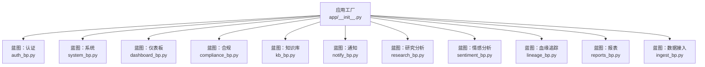
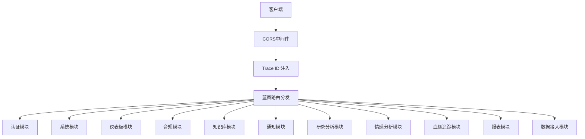
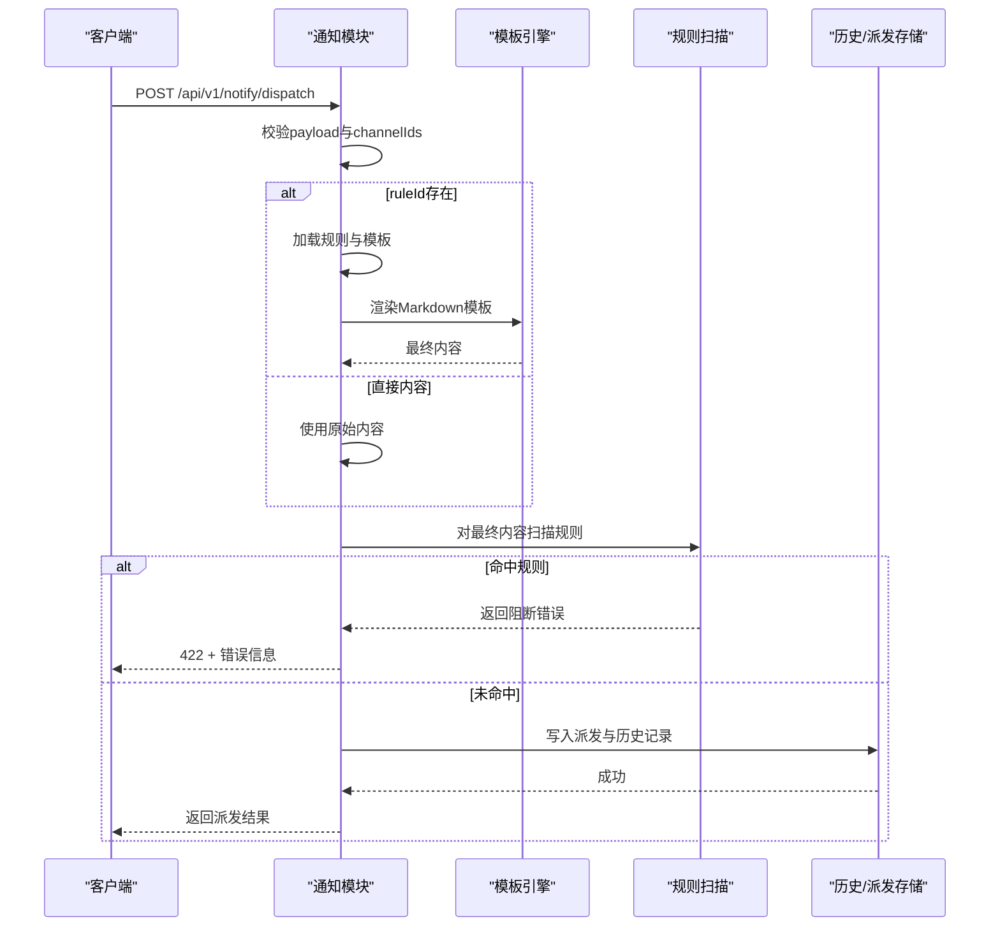
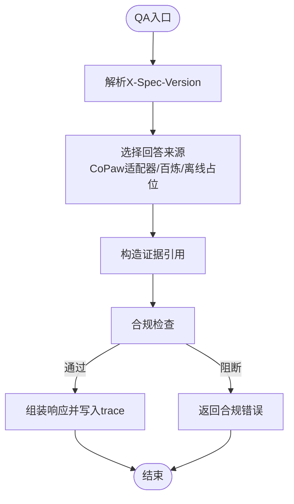
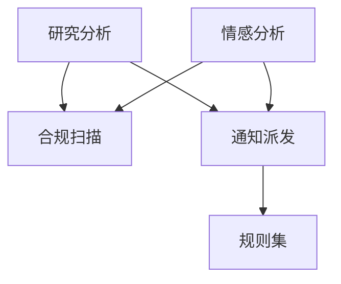

# 主应用API

<cite>
**本文档引用的文件**
- [main-project/backend/app/__init__.py](file://main-project/backend/app/__init__.py)
- [main-project/backend/app/blueprints/auth_bp.py](file://main-project/backend/app/blueprints/auth_bp.py)
- [main-project/backend/app/blueprints/compliance_bp.py](file://main-project/backend/app/blueprints/compliance_bp.py)
- [main-project/backend/app/blueprints/dashboard_bp.py](file://main-project/backend/app/blueprints/dashboard_bp.py)
- [main-project/backend/app/blueprints/kb_bp.py](file://main-project/backend/app/blueprints/kb_bp.py)
- [main-project/backend/app/blueprints/notify_bp.py](file://main-project/backend/app/blueprints/notify_bp.py)
- [main-project/backend/app/blueprints/research_bp.py](file://main-project/backend/app/blueprints/research_bp.py)
- [main-project/backend/app/blueprints/system_bp.py](file://main-project/backend/app/blueprints/system_bp.py)
- [main-project/backend/app/blueprints/sentiment_bp.py](file://main-project/backend/app/blueprints/sentiment_bp.py)
- [main-project/backend/app/blueprints/lineage_bp.py](file://main-project/backend/app/blueprints/lineage_bp.py)
- [main-project/backend/app/blueprints/reports_bp.py](file://main-project/backend/app/blueprints/reports_bp.py)
- [main-project/backend/app/blueprints/ingest_bp.py](file://main-project/backend/app/blueprints/ingest_bp.py)
</cite>

## 目录
1. [简介](#简介)
2. [项目结构](#项目结构)
3. [核心组件](#核心组件)
4. [架构总览](#架构总览)
5. [详细组件分析](#详细组件分析)
6. [依赖分析](#依赖分析)
7. [性能考虑](#性能考虑)
8. [故障排查指南](#故障排查指南)
9. [结论](#结论)
10. [附录](#附录)

## 简介
本文件为“主应用API”的权威接口规范文档，面向系统集成商与开发者，系统性梳理主应用后端的RESTful API，覆盖用户认证、合规管理、仪表板、知识库、通知、研究分析、情感分析、血缘追踪、报表、数据接入等模块。文档逐项说明端点的用途、HTTP方法、URL路径、请求参数、响应格式与状态码，并补充认证授权机制、数据验证规则、错误处理策略、业务逻辑与数据流、性能优化建议与最佳实践，以及SDK使用指引。

## 项目结构
后端采用Flask蓝图组织各模块API，统一通过应用工厂注册路由，支持CORS跨域与全局Trace ID注入，便于可观测与审计。

图表来源
- [main-project/backend/app/__init__.py:51-79](file://main-project/backend/app/__init__.py#L51-L79)

章节来源
- [main-project/backend/app/__init__.py:21-79](file://main-project/backend/app/__init__.py#L21-L79)

## 核心组件
- 应用工厂与CORS
  - 工厂函数负责加载环境变量、初始化CORS（允许跨域）、注入Trace ID头、注册各蓝图。
  - CORS允许的方法与头部包含Authorization与X-Trace-Id，生产环境建议限制origins。
- 认证中间件与蓝图
  - 认证蓝图提供公开配置查询与登录接口；登录成功返回用户名，失败返回标准化错误。
- 数据存储
  - 各蓝图通过JSON文件作为轻量持久化存储，路径位于DATA_DIR下，便于快速迭代与演示。
- Trace与可观测
  - 请求进入时生成trace_id，响应头透传；部分端点将trace_id写入运行记录，便于溯源。

章节来源
- [main-project/backend/app/__init__.py:21-49](file://main-project/backend/app/__init__.py#L21-L49)
- [main-project/backend/app/blueprints/auth_bp.py:27-42](file://main-project/backend/app/blueprints/auth_bp.py#L27-L42)

## 架构总览
主应用API采用分层设计：应用工厂负责装配，蓝图按领域拆分，服务层由各模块内联或外部服务适配器实现，数据层为本地JSON文件。请求从客户端到API，经CORS与Trace处理，到达对应蓝图路由，执行业务逻辑并返回JSON响应。

图表来源
- [main-project/backend/app/__init__.py:26-49](file://main-project/backend/app/__init__.py#L26-L49)
- [main-project/backend/app/__init__.py:65-79](file://main-project/backend/app/__init__.py#L65-L79)

## 详细组件分析

### 用户认证API
- 端点概览
  - GET /api/v1/auth/public-config：返回公开的默认用户名与密码（用于演示与对照配置）。
  - POST /api/v1/auth/login：校验用户名与密码，成功返回用户名，失败返回标准化错误。
- 请求参数
  - POST /api/v1/auth/login：JSON体包含username与password。
- 响应格式
  - 成功：{"ok": true, "username": "..."}
  - 失败：{"ok": false, "error": {"code": "...", "message": "..."}}
- 状态码
  - 200：登录失败（错误信息在error字段）
  - 401：未授权
- 认证授权机制
  - 本版本为演示用途，采用静态配置与内存态校验；生产环境建议引入JWT或会话机制。
- 错误处理
  - 使用统一错误响应格式，包含code与message。
- 性能与安全
  - 建议增加速率限制、防暴力破解与HTTPS强制；生产环境避免明文密码。

章节来源
- [main-project/backend/app/blueprints/auth_bp.py:27-42](file://main-project/backend/app/blueprints/auth_bp.py#L27-L42)

### 合规管理API
- 端点概览
  - GET /api/v1/compliance/rules：读取规则集元数据。
  - POST /api/v1/compliance/scan：对文本进行合规扫描，返回命中规则与阻断标记。
  - GET /api/v1/compliance/blocks/recent：读取最近阻断记录。
- 请求参数
  - POST /api/v1/compliance/scan：JSON体包含text与context_trace_id。
- 响应格式
  - scan：{"trace_id": "...", "blocked": true/false, "hits": [...], "ruleset_version": "..."}
  - blocks/recent：{"items": [...]}
- 状态码
  - 200：成功
- 业务逻辑
  - 规则来自本地JSON；扫描命中后写入阻断历史。
- 性能与最佳实践
  - 规则集与扫描结果建议缓存；对长文本分片处理。

章节来源
- [main-project/backend/app/blueprints/compliance_bp.py:16-53](file://main-project/backend/app/blueprints/compliance_bp.py#L16-L53)

### 仪表板API
- 端点概览
  - GET /api/v1/dashboard/todos：获取待办事项。
  - GET /api/v1/dashboard/kpi：获取当日KPI指标。
  - GET /api/v1/sessions/recent：获取最近会话。
- 响应格式
  - todos：{"items": [...]}
  - kpi：{"sessions_today": number, "pending_review": number}
  - recent：{"items": [...]}

章节来源
- [main-project/backend/app/blueprints/dashboard_bp.py:13-28](file://main-project/backend/app/blueprints/dashboard_bp.py#L13-L28)

### 知识库API
- 端点概览
  - GET /api/v1/kb/index/status：获取索引版本与更新时间。
  - GET /api/v1/kb/documents：获取文档清单。
- 响应格式
  - index/status：{"index_ver": "...", "updated_at": "..."}
  - documents：{"items": [...]}

章节来源
- [main-project/backend/app/blueprints/kb_bp.py:13-21](file://main-project/backend/app/blueprints/kb_bp.py#L13-L21)

### 通知API
- 端点概览
  - GET /api/v1/notify/channels：获取通道列表。
  - PUT /api/v1/notify/channels：更新通道列表。
  - POST /api/v1/notify/channels/{type}/test：测试通道（当前为mock）。
  - GET /api/v1/notify/templates：获取模板列表。
  - POST /api/v1/notify/templates：创建模板。
  - GET /api/v1/notify/templates/{template_id}：获取模板详情。
  - PATCH /api/v1/notify/templates/{template_id}：更新模板。
  - DELETE /api/v1/notify/templates/{template_id}：删除模板（若被规则引用则拒绝）。
  - GET /api/v1/notify/rules：获取规则列表（可筛选enabledOnly）。
  - POST /api/v1/notify/rules：创建规则。
  - GET /api/v1/notify/rules/{rule_id}：获取规则详情。
  - PATCH /api/v1/notify/rules/{rule_id}：更新规则。
  - DELETE /api/v1/notify/rules/{rule_id}：删除规则。
  - POST /api/v1/notify/dispatch：派发通知（支持dryRun与合规扫描）。
  - GET /api/v1/notify/deliveries：查询派发记录（支持ruleId/status/channelId过滤）。
  - GET /api/v1/notify/history：获取历史记录。
  - POST /api/v1/notify/push：兼容旧接口推送（合规扫描并落库）。
- 请求参数与验证
  - 模板：name/bodyMarkdown/channelType必填，channelType限定为dingtalk/feishu/email。
  - 规则：name必填，channelIds必须存在且有效。
  - 派发：payload必填；dryRun为布尔；可指定ruleId或channelIds；若ruleId禁用或引用模板，将进行渲染与变量合并。
- 响应格式
  - 模板：创建返回{"template": {...}}；更新返回最新版本对象。
  - 规则：创建返回{"rule": {...}}；更新返回最新版本对象。
  - 派发：返回{"delivery": {...}, "deliveries": [...], "dryRun": boolean}。
  - 通道测试：返回{"ok": true, "latencyMs": number, "mode": "mock"}。
- 状态码
  - 200：成功
  - 201：创建成功
  - 400：参数校验失败（M4_VALIDATION_ERROR）
  - 404：资源不存在（M4_CHANNEL_NOT_FOUND/M4_RULE_NOT_FOUND）
  - 409：冲突（M4_RULE_DISABLED/M4_REVIEW_REQUIRED/M4_COMPLIANCE_BLOCK）
  - 422：数据不可用（M4_VALIDATION_ERROR）
- 业务逻辑与数据流
  - 模板渲染：将变量合并到Markdown模板，缺失变量时报错。
  - 合规扫描：对最终内容进行规则扫描，命中则阻断。
  - 多代理评审：根据sourceRef判断是否需要评审通过后方可发送。
- 错误处理
  - 统一错误响应，包含code与message；通道测试当前为mock模式。
- 性能与最佳实践
  - 模板与规则缓存；批量派发时合并相同通道；dryRun优先于真实发送。

图表来源
- [main-project/backend/app/blueprints/notify_bp.py:309-395](file://main-project/backend/app/blueprints/notify_bp.py#L309-L395)

章节来源
- [main-project/backend/app/blueprints/notify_bp.py:112-464](file://main-project/backend/app/blueprints/notify_bp.py#L112-L464)

### 研究分析API
- 端点概览
  - POST /api/v1/research/qa/ask：问答请求，支持X-Spec-Version（ira-1.0.0/ira-1.1.0）。
  - POST /api/v1/research/qa/upload：上传文件并登记到知识库。
  - POST /api/v1/research/stock/analysis：生成个股分析草稿（可mock）。
  - GET /api/v1/research/stock/quote：获取行情快照（可mock）。
  - POST /api/v1/research/stock/multi-agent/run：触发多智能体运行。
  - GET /api/v1/research/stock/multi-agent/runs：查询多智能体运行记录。
  - PATCH /api/v1/research/stock/multi-agent/runs/{trace_id}/review：评审多智能体运行。
- 请求参数与验证
  - QA：session_id/query/require_risk（1.1.0中require_risk默认启用）。
  - 上传：multipart/form-data，文件必填；支持session_id表单参数。
  - 行情：symbol；mock=true/false。
  - 多智能体：symbol/market_snapshot_id/mock。
  - 评审：review_status必须为approved/rejected/pending。
- 响应格式
  - QA：{"trace_id": "...", "answer": "...", "evidence_refs": [...], "model": {...}, "compliance": {...}, "spec_version": "...", ...}
  - 上传：{"doc_id": "...", "filename": "...", "stored_path": "...", "trace_id": "..."}
  - 分析草稿：{"trace_id": "...", "artifact_type": "...", "content_format": "...", "content": "...", ...}
  - 运行记录：{"items": [{"trace_id": "...", ...}]}
  - 评审：{"trace_id": "...", "review_status": "...", "review_comment": "...", "reviewer": "...", "updated_at": "..."}
- 状态码
  - 200：成功
  - 400：版本不支持或参数无效
  - 404：运行记录不存在
  - 422：文件上传缺失
- 业务逻辑与数据流
  - QA优先走CoPaw适配器，否则回退至百炼或离线占位；证据引用来自知识库元数据。
  - 多智能体运行记录写入本地JSON，支持评审状态变更。
  - 行情快照可mock或实时拉取。
- 性能与最佳实践
  - 对大模型调用增加超时与重试；缓存常用知识库元数据；批量上传时并发控制。

图表来源
- [main-project/backend/app/blueprints/research_bp.py:73-172](file://main-project/backend/app/blueprints/research_bp.py#L73-L172)

章节来源
- [main-project/backend/app/blueprints/research_bp.py:73-402](file://main-project/backend/app/blueprints/research_bp.py#L73-L402)

### 情感分析API
- 端点概览
  - GET /api/v1/sentiment/watchlist：获取监控词列表。
  - POST /api/v1/sentiment/watchlist：新增监控词。
  - DELETE /api/v1/sentiment/watchlist：删除监控词。
  - GET /api/v1/sentiment/alerts：获取告警列表。
  - POST /api/v1/sentiment/ingest：批量导入告警。
  - POST /api/v1/sentiment/analysis/run：运行情感分析（规则聚类或LLM聚类）。
  - GET /api/v1/sentiment/pipeline/runs：获取流水线运行记录。
  - GET /api/v1/sentiment/events：获取事件列表（可限数量）。
  - POST /api/v1/sentiment/report/generate：生成舆情报告草稿。
  - POST /api/v1/sentiment/push/run：推送报告摘要（合规扫描）。
  - GET /api/v1/cron/jobs：获取定时任务状态。
  - POST /api/v1/cron/jobs/run-once：触发一次性任务。
  - GET /api/v1/sentiment/copaw/agents：获取CoPaw情感分析Agent配置。
  - POST /api/v1/sentiment/copaw/agent/run：调用CoPaw Agent执行动作（analyze_overview/explain_alert/suggest_actions/generate_brief）。
  - GET /api/v1/sentiment/mock/*：Mock数据接口（KPI、热点、股票情绪等）。
- 请求参数与验证
  - 分析run：time_window、use_llm、keywords（数组）。
  - 报告推送：report_id、channels（数组）、subject、require_compliance_scan。
  - Agent run：agent_id、action、time_window、keywords；action必须合法。
- 响应格式
  - ingests：{"ingested": number, "trace_ids": [...]}
  - 分析run：{"run_id": "...", "status": "...", "trace_id": "...", "llm_used": boolean, "llm_model": "..."}
  - 事件列表：{"items": [...]}
  - 报告生成：{"report_id": "...", "report_title": "...", "status": "...", "trace_id": "...", "link": "..."}
  - 推送：{"push_batch_id": "...", "status": "...", "trace_id": "...", "results": [...]}
  - 一次性任务：{"run_id": "...", "status": "...", "trace_id": "..."}
- 状态码
  - 200：成功
  - 400：参数无效（如action非法）
  - 404：资源不存在
- 业务逻辑与数据流
  - 分析优先尝试LLM聚类，失败回退规则聚类；事件写入本地JSON并记录流水线运行。
  - 报告推送前进行合规扫描，命中则返回blocked。
  - Mock接口用于前端演示与联调。
- 性能与最佳实践
  - 控制分析输入规模；对LLM调用增加超时与降级；批量导入时分批处理。

章节来源
- [main-project/backend/app/blueprints/sentiment_bp.py:24-800](file://main-project/backend/app/blueprints/sentiment_bp.py#L24-L800)

### 血缘追踪API
- 端点概览
  - GET /api/v1/lineage/traces/{trace_id}：按trace_id查询轨迹。
  - GET /api/v1/lineage/search：按关键字搜索轨迹（支持limit）。
- 响应格式
  - 查询：命中返回轨迹对象，未命中返回错误。
  - 搜索：返回匹配的轨迹列表（trace_id、summary、artifact_type、market_snapshot_id、created_at）。
- 状态码
  - 200：成功
  - 404：未找到

章节来源
- [main-project/backend/app/blueprints/lineage_bp.py:21-52](file://main-project/backend/app/blueprints/lineage_bp.py#L21-L52)

### 报表API
- 端点概览
  - GET /api/v1/reports/drafts：获取报告草稿列表。
  - GET/PATCH /api/v1/reports/drafts/{draft_id}：获取或更新草稿（workflow_stage/compliance_status/owner/reviewer/title）。
- 响应格式
  - 列表：{"items": [...]}
  - 更新：返回更新后的草稿对象。
- 状态码
  - 200：成功
  - 404：草稿不存在

章节来源
- [main-project/backend/app/blueprints/reports_bp.py:14-45](file://main-project/backend/app/blueprints/reports_bp.py#L14-L45)

### 数据接入API
- 端点概览
  - GET /api/v1/ingest/health：健康检查。
  - GET /api/v1/ingest/sources：获取数据源列表（可筛选enabledOnly）。
  - GET /api/v1/ingest/sources/{source_id}：获取数据源详情。
  - POST /api/v1/ingest/jobs：创建采集作业（支持幂等键）。
  - GET /api/v1/ingest/jobs：列出作业（支持limit）。
  - POST /api/v1/ingest/sources/{source_id}/sync：同步作业。
  - GET /api/v1/ingest/jobs/{job_id}：查询作业状态。
- 请求参数与验证
  - 创建作业：sourceId必填；symbol可选；mode可选；idempotencyKey可选。
  - 同步作业：source_id必填；symbol可选；mode可选。
- 响应格式
  - 作业：包含作业ID、状态、参数等。
- 状态码
  - 200：成功
  - 201：创建成功
  - 400/404：资源不存在
  - 409：状态冲突（如作业已在运行、源禁用、幂等重放）
  - 422：参数校验失败
- 业务逻辑与数据流
  - 幂等键用于避免重复创建；异常按错误码映射返回。
- 性能与最佳实践
  - 批量创建时设置合理的幂等键；对高频作业增加节流。

章节来源
- [main-project/backend/app/blueprints/ingest_bp.py:18-94](file://main-project/backend/app/blueprints/ingest_bp.py#L18-L94)

### 系统API
- 端点概览
  - GET /api/v1/system/health：系统健康状态（含百炼开关、桥接状态、多智能体配置等）。
  - GET /api/v1/system/ops/summary：运营汇总（多智能体运行与通知派发统计）。
  - GET /api/v1/system/settings：系统设置（API基础路径、偏好等）。
  - PUT /api/v1/system/preferences：更新工作区偏好。
- 响应格式
  - health：包含规则集版本、索引版本、行情mock、桥接与多智能体状态、LLM配置等。
  - ops/summary：{"multi_agent": {...}, "notify": {...}}
  - settings：{"api_base": "...", "mock_quote": boolean, ...}
  - preferences：返回更新后的偏好对象。
- 状态码
  - 200：成功

章节来源
- [main-project/backend/app/blueprints/system_bp.py:21-93](file://main-project/backend/app/blueprints/system_bp.py#L21-L93)

## 依赖分析
- 组件耦合
  - 蓝图间低耦合，通过JSON文件共享数据；研究分析与情感分析模块依赖合规扫描服务。
- 外部依赖
  - 百炼（DashScope）：在研究分析与情感分析中作为可选LLM来源。
  - 本地JSON存储：作为轻量持久化，便于演示与快速迭代。
- 潜在循环依赖
  - 未发现蓝图间的循环导入；研究分析模块在特定分支调用情感分析服务，但为单向调用。

图表来源
- [main-project/backend/app/blueprints/research_bp.py:10-15](file://main-project/backend/app/blueprints/research_bp.py#L10-L15)
- [main-project/backend/app/blueprints/sentiment_bp.py:8-11](file://main-project/backend/app/blueprints/sentiment_bp.py#L8-L11)
- [main-project/backend/app/blueprints/notify_bp.py:353-356](file://main-project/backend/app/blueprints/notify_bp.py#L353-L356)

## 性能考虑
- 缓存策略
  - 规则集与模板：在进程内缓存，减少磁盘IO。
  - 知识库元数据：对常用查询结果缓存。
- 异步与批处理
  - 通知派发与情感分析：对批量操作分批处理，避免阻塞主线程。
- 超时与重试
  - 对外部LLM调用设置合理超时与指数退避重试。
- 存储优化
  - JSON文件写入采用原子替换或追加写入，避免频繁随机写。
- CORS与Trace
  - 生产环境限制CORS origins与headers，减少预检开销；Trace ID仅在必要时生成。

## 故障排查指南
- 常见错误与定位
  - M4_VALIDATION_ERROR：参数校验失败，检查必填字段与枚举值。
  - M4_CHANNEL_NOT_FOUND/M4_RULE_NOT_FOUND：引用资源不存在，检查ID有效性。
  - M4_RULE_DISABLED：规则被禁用，检查启用状态。
  - M4_REVIEW_REQUIRED：多智能体运行需要评审，检查review_status。
  - M4_COMPLIANCE_BLOCK：合规扫描命中，检查规则与内容。
  - NOT_FOUND：资源不存在，检查ID或路径。
  - INVALID_STATE/JOB_ALREADY_RUNNING：状态冲突，检查作业状态与幂等键。
- 日志与追踪
  - 检查响应头中的X-Trace-Id，结合后端日志定位问题。
  - 使用血缘追踪接口按trace_id检索相关记录。
- 诊断步骤
  - 先用GET /api/v1/system/health确认系统状态。
  - 使用GET /api/v1/notify/channels/test验证通道连通性（mock）。
  - 对通知派发使用dryRun模式验证模板与合规扫描。

章节来源
- [main-project/backend/app/blueprints/notify_bp.py:125-144](file://main-project/backend/app/blueprints/notify_bp.py#L125-L144)
- [main-project/backend/app/blueprints/system_bp.py:21-39](file://main-project/backend/app/blueprints/system_bp.py#L21-L39)

## 结论
本API文档系统化梳理了主应用后端的RESTful接口，覆盖认证、合规、仪表板、知识库、通知、研究分析、情感分析、血缘追踪、报表与数据接入等模块。通过明确的端点定义、参数约束、响应格式与错误处理策略，为系统集成商提供了清晰的对接指南。建议在生产环境中增强认证与鉴权、完善限流与熔断、优化存储与缓存，并持续完善可观测与告警体系。

## 附录
- SDK使用说明（建议）
  - 基础配置：设置Base URL为/api/v1，携带Authorization与X-Trace-Id。
  - 认证：调用登录接口获取令牌（演示版为静态配置，生产建议JWT）。
  - 通知：先创建模板与通道，再通过规则或直接派发；使用dryRun验证。
  - 研究分析：根据spec版本选择功能；注意证据引用与合规检查。
  - 情感分析：先导入告警，再运行分析；关注LLM使用情况与回退策略。
  - 血缘追踪：通过trace_id检索与搜索接口定位问题。
  - 报表：生成草稿后更新状态与审批人；推送前进行合规扫描。
  - 数据接入：使用幂等键避免重复创建作业；监控作业状态。
- 版本与兼容
  - X-Spec-Version：研究分析QA支持ira-1.0.0与ira-1.1.0，不同版本行为略有差异。
- 最佳实践
  - 前后端分离：统一错误码与响应结构，便于前端统一处理。
  - 文档驱动：OpenAPI可由蓝图自动生成，便于集成Swagger UI。
  - 安全加固：生产环境启用HTTPS、限制CORS、增加速率限制与WAF。