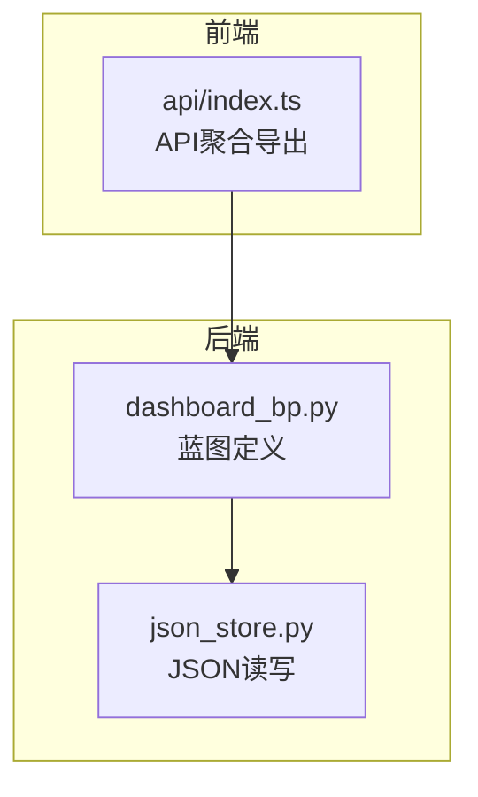
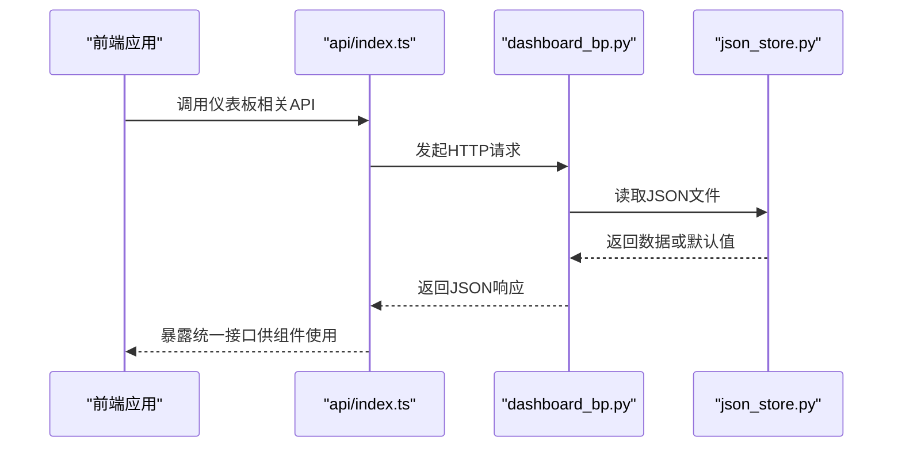
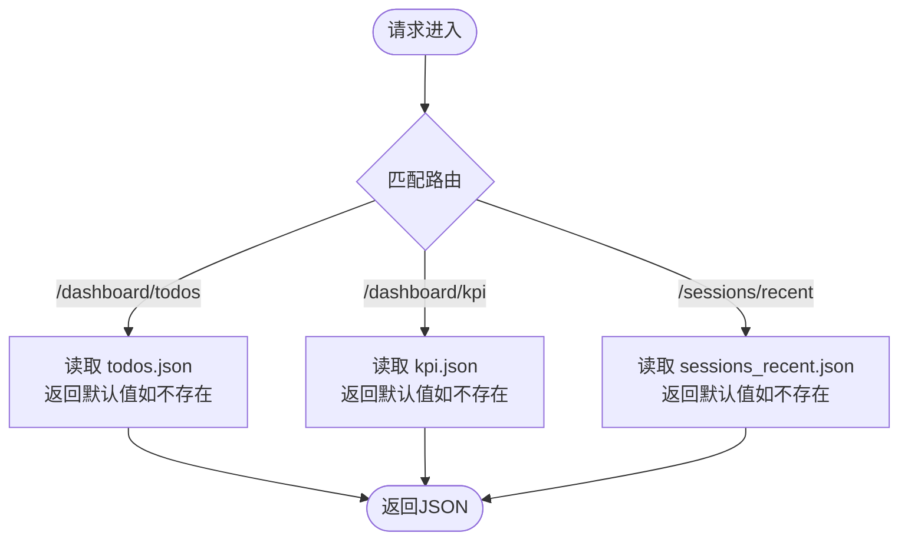
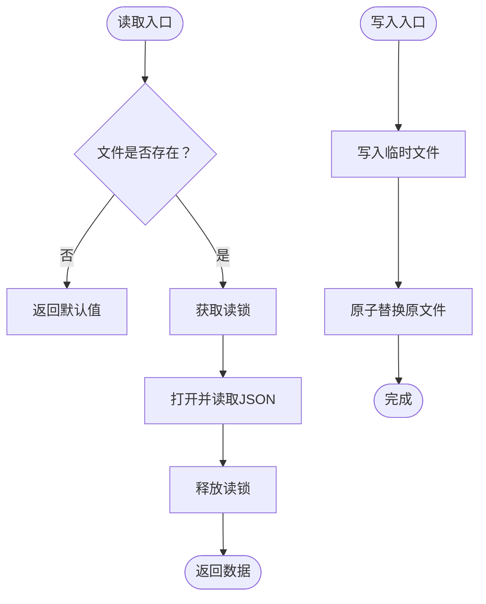
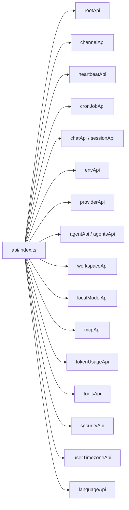
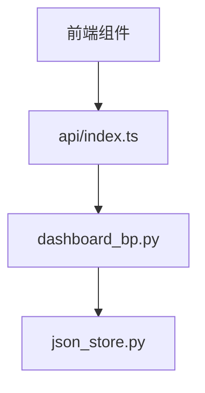

# 仪表板API

<cite>
**本文档引用的文件**
- [dashboard_bp.py](file://main-project/backend/app/blueprints/dashboard_bp.py)
- [json_store.py](file://main-project/backend/app/json_store.py)
- [index.ts](file://copaw/console/src/api/index.ts)
</cite>

## 目录
1. [简介](#简介)
2. [项目结构](#项目结构)
3. [核心组件](#核心组件)
4. [架构总览](#架构总览)
5. [详细组件分析](#详细组件分析)
6. [依赖分析](#依赖分析)
7. [性能考虑](#性能考虑)
8. [故障排查指南](#故障排查指南)
9. [结论](#结论)
10. [附录](#附录)

## 简介
本文件为仪表板API的详细接口规范文档，覆盖数据统计、图表展示、指标查询等端点。文档基于现有后端蓝图与前端API聚合导出，明确HTTP方法、URL路径、请求参数与响应格式，并提供数据展示组件的集成示例与性能优化建议，解释数据缓存策略与实时数据处理机制。

## 项目结构
- 后端仪表板蓝图位于 main-project/backend/app/blueprints/dashboard_bp.py，提供三个端点：待办列表、KPI指标、最近会话。
- JSON数据通过 app/json_store.py 提供读写能力，默认使用线程锁保证原型阶段的并发安全。
- 前端 copaw/console/src/api/index.ts 聚合导出所有API模块，便于在控制台中统一调用。

**图示来源**
- [dashboard_bp.py:1-29](file://main-project/backend/app/blueprints/dashboard_bp.py#L1-L29)
- [json_store.py:1-29](file://main-project/backend/app/json_store.py#L1-L29)
- [index.ts:1-85](file://copaw/console/src/api/index.ts#L1-L85)

**章节来源**
- [dashboard_bp.py:1-29](file://main-project/backend/app/blueprints/dashboard_bp.py#L1-L29)
- [json_store.py:1-29](file://main-project/backend/app/json_store.py#L1-L29)
- [index.ts:1-85](file://copaw/console/src/api/index.ts#L1-L85)

## 核心组件
- 仪表板蓝图：定义仪表板相关路由，返回静态JSON数据。
- JSON存储：提供线程安全的JSON文件读写，支持默认值回退。
- 前端API聚合：将各模块API统一导出，便于集中使用。

**章节来源**
- [dashboard_bp.py:1-29](file://main-project/backend/app/blueprints/dashboard_bp.py#L1-L29)
- [json_store.py:13-29](file://main-project/backend/app/json_store.py#L13-L29)
- [index.ts:26-85](file://copaw/console/src/api/index.ts#L26-L85)

## 架构总览
仪表板API采用“蓝图+JSON存储”的轻量架构：前端通过统一API入口发起HTTP请求，后端蓝图根据路由返回对应JSON数据；数据持久化由JSON文件与线程锁保障。

**图示来源**
- [dashboard_bp.py:13-28](file://main-project/backend/app/blueprints/dashboard_bp.py#L13-L28)
- [json_store.py:13-19](file://main-project/backend/app/json_store.py#L13-L19)
- [index.ts:26-85](file://copaw/console/src/api/index.ts#L26-L85)

## 详细组件分析

### 仪表板蓝图（dashboard_bp.py）
- 路由设计
  - GET /dashboard/todos：返回待办事项列表
  - GET /dashboard/kpi：返回关键指标（如会话数、待审核数）
  - GET /sessions/recent：返回最近会话列表
- 数据来源
  - 通过 JSON 存储读取本地数据文件，若文件不存在则返回默认值。
- 错误处理
  - 文件缺失时返回默认结构，避免服务异常。

**图示来源**
- [dashboard_bp.py:13-28](file://main-project/backend/app/blueprints/dashboard_bp.py#L13-L28)

**章节来源**
- [dashboard_bp.py:9-28](file://main-project/backend/app/blueprints/dashboard_bp.py#L9-L28)

### JSON存储（json_store.py）
- 读取流程
  - 若目标目录不存在则自动创建
  - 文件不存在时返回传入默认值
  - 使用线程锁保护读取过程
- 写入流程
  - 先写入临时文件，再原子替换原文件，避免部分写入
  - 使用线程锁保护写入过程

**图示来源**
- [json_store.py:13-29](file://main-project/backend/app/json_store.py#L13-L29)

**章节来源**
- [json_store.py:13-29](file://main-project/backend/app/json_store.py#L13-L29)

### 前端API聚合（api/index.ts）
- 统一导出
  - 将各模块API（如聊天、代理、工作区等）合并到一个对象中，便于全局使用
- 集成方式
  - 控制台组件可直接从该聚合对象中按需导入所需API

**图示来源**
- [index.ts:7-25](file://copaw/console/src/api/index.ts#L7-L25)
- [index.ts:26-85](file://copaw/console/src/api/index.ts#L26-L85)

**章节来源**
- [index.ts:1-85](file://copaw/console/src/api/index.ts#L1-L85)

## 依赖分析
- 后端依赖关系
  - dashboard_bp.py 依赖 json_store.py 的读取能力
- 前后端交互
  - 前端通过 api/index.ts 聚合导出的API访问后端蓝图提供的端点

**图示来源**
- [dashboard_bp.py:3-4](file://main-project/backend/app/blueprints/dashboard_bp.py#L3-L4)
- [index.ts:26-85](file://copaw/console/src/api/index.ts#L26-L85)

**章节来源**
- [dashboard_bp.py:3-4](file://main-project/backend/app/blueprints/dashboard_bp.py#L3-L4)
- [index.ts:26-85](file://copaw/console/src/api/index.ts#L26-L85)

## 性能考虑
- 并发与锁
  - JSON读写使用线程锁，适合原型阶段；生产环境建议引入更高效的并发控制或数据库替代
- 缓存策略
  - 可在前端对常用仪表板数据进行内存缓存，设置TTL与失效策略
  - 对于高频查询的KPI与最近会话，可在网关层增加短期缓存
- I/O优化
  - 将多个小文件合并为大文件或采用二进制序列化以减少磁盘I/O
- 实时性
  - 当前实现为静态JSON读取；如需实时更新，建议引入WebSocket或Server-Sent Events推送机制

## 故障排查指南
- 端点返回空数组或默认值
  - 检查对应JSON文件是否存在且可读
  - 确认 DATA_DIR 配置正确
- 读写异常
  - 检查线程锁是否被长时间占用
  - 确认文件权限与磁盘空间
- 前端无法调用API
  - 确认 api/index.ts 已正确导出目标模块
  - 检查网络连通性与跨域配置

**章节来源**
- [dashboard_bp.py:13-28](file://main-project/backend/app/blueprints/dashboard_bp.py#L13-L28)
- [json_store.py:13-29](file://main-project/backend/app/json_store.py#L13-L29)
- [index.ts:26-85](file://copaw/console/src/api/index.ts#L26-L85)

## 结论
当前仪表板API以蓝图+JSON存储为核心，提供简洁稳定的待办、KPI与最近会话数据接口。建议在生产环境中引入数据库、缓存与实时推送机制，以提升性能与用户体验。

## 附录

### 接口规范总览
- GET /dashboard/todos
  - 请求参数：无
  - 响应格式：包含待办项列表的对象
  - 默认行为：当数据文件不存在时返回默认结构
- GET /dashboard/kpi
  - 请求参数：无
  - 响应格式：包含关键指标的对象（如会话数、待审核数）
  - 默认行为：当数据文件不存在时返回默认结构
- GET /sessions/recent
  - 请求参数：无
  - 响应格式：包含最近会话列表的对象
  - 默认行为：当数据文件不存在时返回默认结构

**章节来源**
- [dashboard_bp.py:13-28](file://main-project/backend/app/blueprints/dashboard_bp.py#L13-L28)

### 集成示例（前端）
- 在控制台组件中，通过统一API对象调用仪表板相关接口
- 示例路径参考：[api/index.ts:26-85](file://copaw/console/src/api/index.ts#L26-L85)

**章节来源**
- [index.ts:26-85](file://copaw/console/src/api/index.ts#L26-L85)