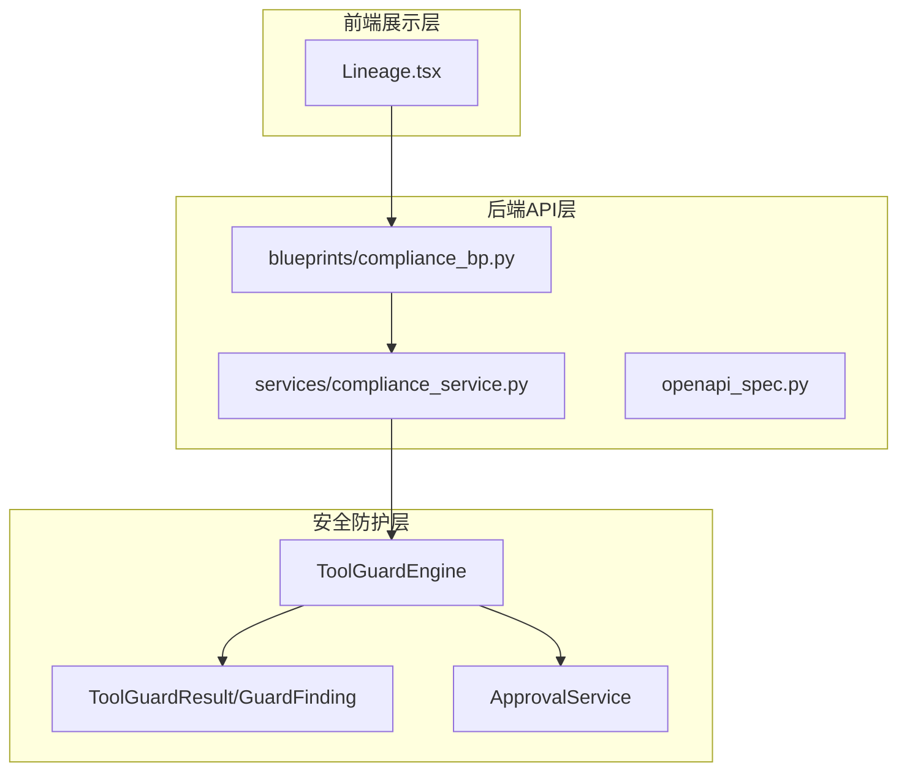
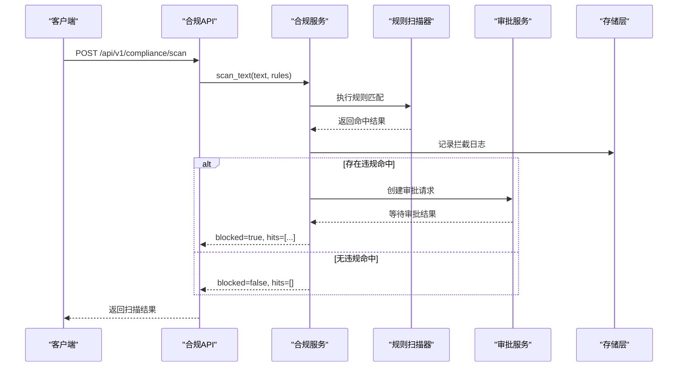
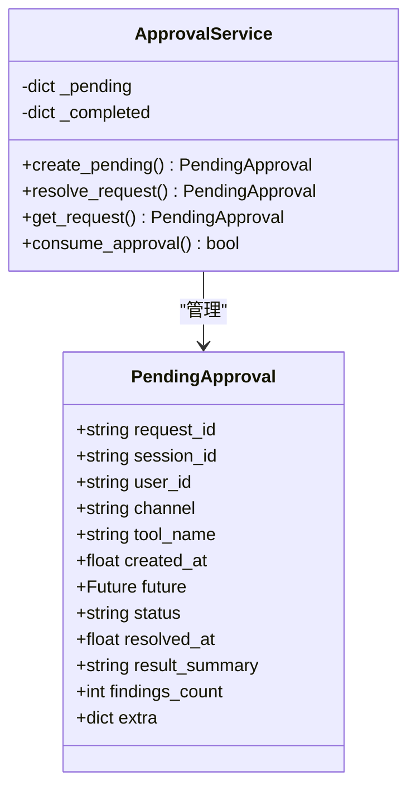
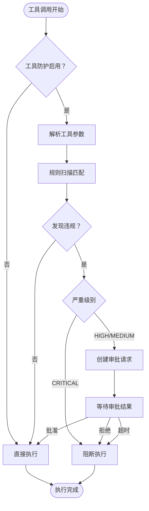
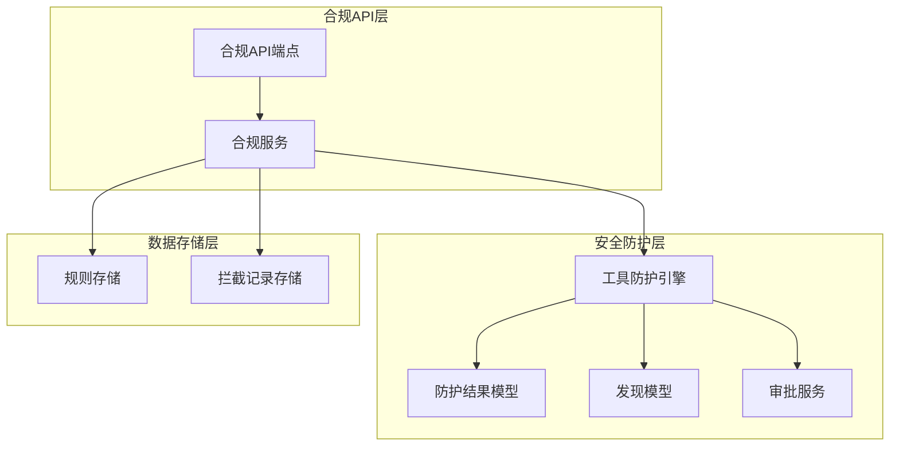
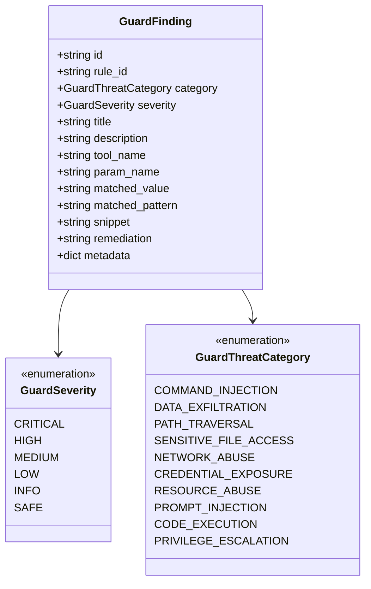

# 合规管理API

<cite>
**本文引用的文件**
- [openapi_spec.py](file://main-project/backend/app/openapi_spec.py)
- [compliance_bp.py](file://main-project/backend/app/blueprints/compliance_bp.py)
- [compliance_service.py](file://main-project/backend/app/services/compliance_service.py)
- [test_compliance.py](file://main-project/backend/tests/test_compliance.py)
- [engine.py](file://copaw/src/copaw/security/tool_guard/engine.py)
- [models.py](file://copaw/src/copaw/security/tool_guard/models.py)
- [service.py](file://copaw/src/copaw/app/approvals/service.py)
- [models.py（技能扫描）](file://copaw/src/copaw/security/skill_scanner/models.py)
- [工具防护系统.md](file://specs/copaw-repowiki/content/安全系统/工具防护系统.md)
- [安全系统.md](file://specs/copaw-repowiki/content/安全系统/安全系统.md)
- [Lineage.tsx](file://main-project/frontend/src/pages/Lineage.tsx)
- [multi_agent_service.py](file://main-project/backend/app/services/multi_agent_service.py)
</cite>

## 目录
1. [简介](#简介)
2. [项目结构](#项目结构)
3. [核心组件](#核心组件)
4. [架构总览](#架构总览)
5. [详细组件分析](#详细组件分析)
6. [依赖关系分析](#依赖关系分析)
7. [性能考虑](#性能考虑)
8. [故障排查指南](#故障排查指南)
9. [结论](#结论)
10. [附录：配置与集成指南](#附录配置与集成指南)

## 简介
本文件为合规管理API的完整接口规范文档，涵盖合规检查、风险评估、审计日志等核心功能。文档详细说明了合规规则配置、违规检测、审批流程等API接口，包括HTTP方法、URL路径、请求参数、响应格式和状态码。同时提供合规策略配置示例和集成指南，解释合规数据模型和业务逻辑。

## 项目结构
合规管理API主要分布在以下模块中：



**图表来源**
- [compliance_bp.py:1-53](file://main-project/backend/app/blueprints/compliance_bp.py#L1-L53)
- [engine.py:52-218](file://copaw/src/copaw/security/tool_guard/engine.py#L52-L218)
- [models.py:60-185](file://copaw/src/copaw/security/tool_guard/models.py#L60-L185)
- [service.py:86-281](file://copaw/src/copaw/app/approvals/service.py#L86-L281)

**章节来源**
- [compliance_bp.py:1-53](file://main-project/backend/app/blueprints/compliance_bp.py#L1-L53)
- [openapi_spec.py:329-376](file://main-project/backend/app/openapi_spec.py#L329-L376)

## 核心组件
合规管理API包含以下核心组件：

### 1. 合规规则管理
- **规则查询接口**：获取当前生效的合规规则集
- **规则数据结构**：包含规则版本号和规则列表
- **规则版本控制**：支持规则集版本管理

### 2. 文本合规扫描
- **扫描接口**：对输入文本进行合规性检查
- **命中检测**：基于正则表达式的违规内容识别
- **扫描结果**：返回命中规则、违规类型和详细信息

### 3. 审批流程集成
- **审批服务**：处理高风险合规违规的审批请求
- **阻断机制**：对严重违规直接阻断执行
- **超时处理**：自动超时拒绝未处理的审批请求

### 4. 审计日志管理
- **拦截记录**：记录所有合规拦截事件
- **最近拦截**：提供拦截历史查询接口
- **审计追踪**：完整的合规执行轨迹

**章节来源**
- [compliance_bp.py:16-53](file://main-project/backend/app/blueprints/compliance_bp.py#L16-L53)
- [compliance_service.py:9-19](file://main-project/backend/app/services/compliance_service.py#L9-L19)
- [engine.py:169-226](file://copaw/src/copaw/security/tool_guard/engine.py#L169-L226)

## 架构总览



**图表来源**
- [compliance_bp.py:22-47](file://main-project/backend/app/blueprints/compliance_bp.py#L22-L47)
- [compliance_service.py:9-19](file://main-project/backend/app/services/compliance_service.py#L9-L19)
- [service.py:80-136](file://copaw/src/copaw/app/approvals/service.py#L80-L136)

## 详细组件分析

### 合规规则管理API

#### GET /api/v1/compliance/rules
**功能**：获取当前生效的合规规则集

**请求参数**：无

**响应数据**：
```json
{
  "ruleset_version": "string",
  "rules": [
    {
      "id": "string",
      "pattern": "string",
      "category": "string",
      "severity": "string",
      "message": "string"
    }
  ]
}
```

**状态码**：
- 200 OK：成功获取规则集
- 500 Internal Server Error：服务器内部错误

**章节来源**
- [compliance_bp.py:16-19](file://main-project/backend/app/blueprints/compliance_bp.py#L16-L19)
- [openapi_spec.py:329-331](file://main-project/backend/app/openapi_spec.py#L329-L331)

### 文本合规扫描API

#### POST /api/v1/compliance/scan
**功能**：对输入文本进行合规性检查

**请求体参数**：
```json
{
  "text": "string",
  "context_trace_id": "string|null"
}
```

**响应数据**：
```json
{
  "trace_id": "string",
  "blocked": "boolean",
  "hits": [
    {
      "rule_id": "string",
      "span": "string",
      "message": "string"
    }
  ],
  "ruleset_version": "string"
}
```

**状态码**：
- 200 OK：扫描完成
- 400 Bad Request：请求参数无效
- 500 Internal Server Error：扫描过程出错

**章节来源**
- [compliance_bp.py:22-47](file://main-project/backend/app/blueprints/compliance_bp.py#L22-L47)
- [openapi_spec.py:332-366](file://main-project/backend/app/openapi_spec.py#L332-L366)

### 最近拦截记录API

#### GET /api/v1/compliance/blocks/recent
**功能**：获取最近的合规拦截记录

**请求参数**：无

**响应数据**：
```json
{
  "items": [
    {
      "trace_id": "string",
      "rule_id": "string|null",
      "summary": "string"
    }
  ]
}
```

**状态码**：
- 200 OK：成功获取拦截记录
- 500 Internal Server Error：服务器内部错误

**章节来源**
- [compliance_bp.py:50-53](file://main-project/backend/app/blueprints/compliance_bp.py#L50-L53)
- [openapi_spec.py:367-369](file://main-project/backend/app/openapi_spec.py#L367-L369)

### 审批流程API

#### 审批服务数据模型


**图表来源**
- [service.py:35-136](file://copaw/src/copaw/app/approvals/service.py#L35-L136)

**章节来源**
- [service.py:58-341](file://copaw/src/copaw/app/approvals/service.py#L58-L341)

### 工具防护系统API

#### 工具调用防护


**图表来源**
- [engine.py:169-226](file://copaw/src/copaw/security/tool_guard/engine.py#L169-L226)
- [service.py:116-157](file://copaw/src/copaw/app/approvals/service.py#L116-L157)

**章节来源**
- [engine.py:155-226](file://copaw/src/copaw/security/tool_guard/engine.py#L155-L226)

## 依赖关系分析



**图表来源**
- [compliance_bp.py:1-7](file://main-project/backend/app/blueprints/compliance_bp.py#L1-L7)
- [engine.py:53-102](file://copaw/src/copaw/security/tool_guard/engine.py#L53-L102)
- [models.py:60-185](file://copaw/src/copaw/security/tool_guard/models.py#L60-L185)

**章节来源**
- [compliance_bp.py:1-8](file://main-project/backend/app/blueprints/compliance_bp.py#L1-L8)
- [engine.py:1-31](file://copaw/src/copaw/security/tool_guard/engine.py#L1-L31)

## 性能考虑
- **规则扫描优化**：使用预编译正则表达式，避免重复编译开销
- **内存管理**：审批记录采用LRU淘汰策略，限制内存占用
- **异步处理**：审批流程使用异步队列，提高并发处理能力
- **缓存策略**：规则集支持热重载，减少重启开销

## 故障排查指南

### 常见问题及解决方案

#### 1. 合规扫描无响应
**可能原因**：
- 规则文件损坏或格式错误
- 正则表达式匹配性能问题
- 存储服务不可用

**解决步骤**：
1. 检查规则文件格式和语法
2. 优化复杂正则表达式
3. 验证存储服务连接状态

#### 2. 审批请求超时
**可能原因**：
- 审批服务配置不当
- 用户长时间未响应
- 系统负载过高

**解决步骤**：
1. 检查审批超时配置
2. 监控系统资源使用情况
3. 优化审批流程响应时间

#### 3. 拦截记录丢失
**可能原因**：
- 存储空间不足
- 文件权限问题
- 程序异常退出

**解决步骤**：
1. 检查磁盘空间和权限
2. 验证文件写入权限
3. 查看系统日志异常

**章节来源**
- [service.py:268-326](file://copaw/src/copaw/app/approvals/service.py#L268-L326)
- [test_compliance.py:1-27](file://main-project/backend/tests/test_compliance.py#L1-L27)

## 结论
合规管理API提供了完整的合规检查、风险评估和审计日志功能。通过规则驱动的扫描机制、智能的审批流程和完善的审计追踪，确保系统在满足合规要求的同时保持良好的用户体验。系统设计具有良好的扩展性和可维护性，能够适应不断变化的合规需求。

## 附录：配置与集成指南

### 合规规则配置示例

#### 基础规则配置
```json
{
  "ruleset_version": "rules-v1.0.0",
  "rules": [
    {
      "id": "R-G01",
      "pattern": "(全仓|清仓|买入|卖出|加仓|减仓|调仓)",
      "category": "investment_ops",
      "severity": "HIGH",
      "message": "疑似个性化投资操作表述"
    },
    {
      "id": "R-G02", 
      "pattern": "(保证收益|稳赚|无风险|保本)",
      "category": "return_promise",
      "severity": "CRITICAL",
      "message": "疑似收益承诺"
    }
  ]
}
```

#### 集成步骤
1. **规则部署**：将规则文件部署到DATA_DIR目录
2. **API调用**：通过合规API进行文本扫描
3. **审批处理**：对高风险违规触发审批流程
4. **审计追踪**：记录所有合规相关操作

### 前端集成示例

#### 合规闸门展示
```typescript
// Lineage.tsx中的合规闸门组件
<section className="ira-card ira-lineage-card">
  <h2 className="ira-lineage-card__h2">合规闸门</h2>
  <p className="ira-lineage-card__gate">{scenario.complianceGate}</p>
</section>
```

**章节来源**
- [Lineage.tsx:224-228](file://main-project/frontend/src/pages/Lineage.tsx#L224-L228)
- [multi_agent_service.py:148](file://main-project/backend/app/services/multi_agent_service.py#L148)

### 安全最佳实践

#### 数据模型设计


**图表来源**
- [models.py:25-53](file://copaw/src/copaw/security/tool_guard/models.py#L25-L53)
- [models.py:60-96](file://copaw/src/copaw/security/tool_guard/models.py#L60-L96)

**章节来源**
- [models.py:19-53](file://copaw/src/copaw/security/tool_guard/models.py#L19-L53)
- [models.py（技能扫描）:19-54](file://copaw/src/copaw/security/skill_scanner/models.py#L19-L54)

### 监控与日志

#### 审计日志配置
- **日志级别**：高危发现使用警告级别，低危使用信息级别
- **日志格式**：结构化JSON格式，包含规则ID、匹配值、严重级别等关键信息
- **日志保留**：定期清理过期日志，遵守数据最小化原则

#### 性能监控指标
- **扫描性能**：规则匹配耗时、扫描吞吐量
- **审批性能**：审批响应时间、超时率
- **系统健康**：内存使用、CPU负载、存储空间

**章节来源**
- [安全系统.md:366-369](file://specs/copaw-repowiki/content/安全系统/安全系统.md#L366-L369)
- [工具防护系统.md:467-477](file://specs/copaw-repowiki/content/安全系统/工具防护系统.md#L467-L477)