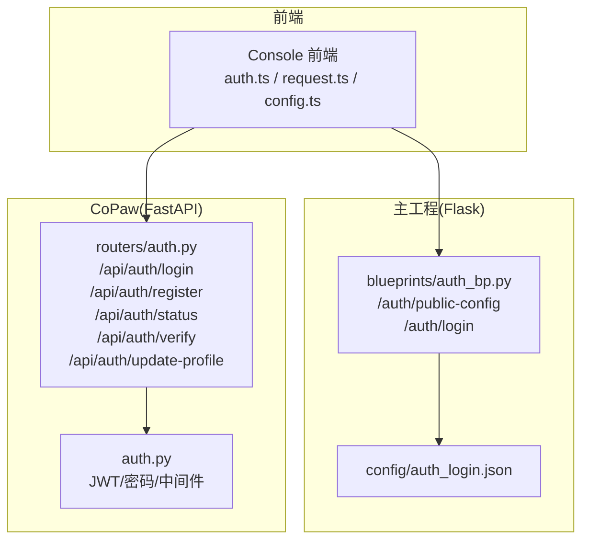
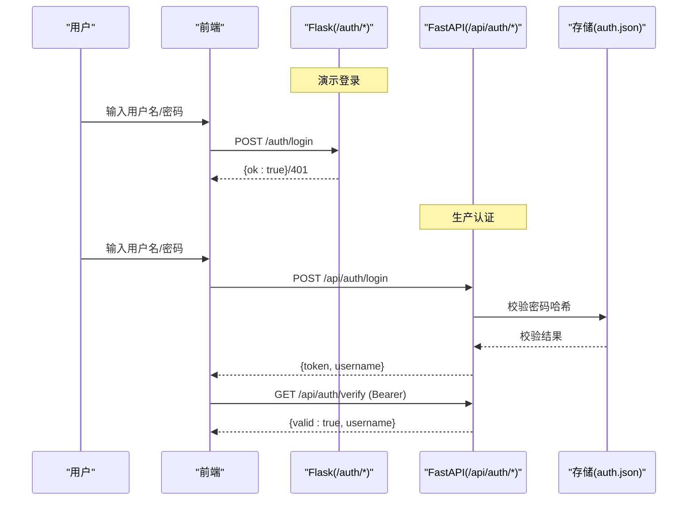
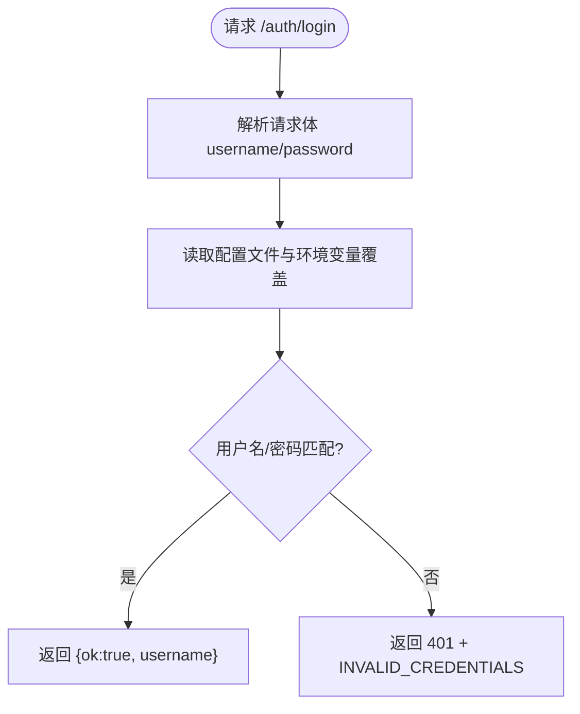
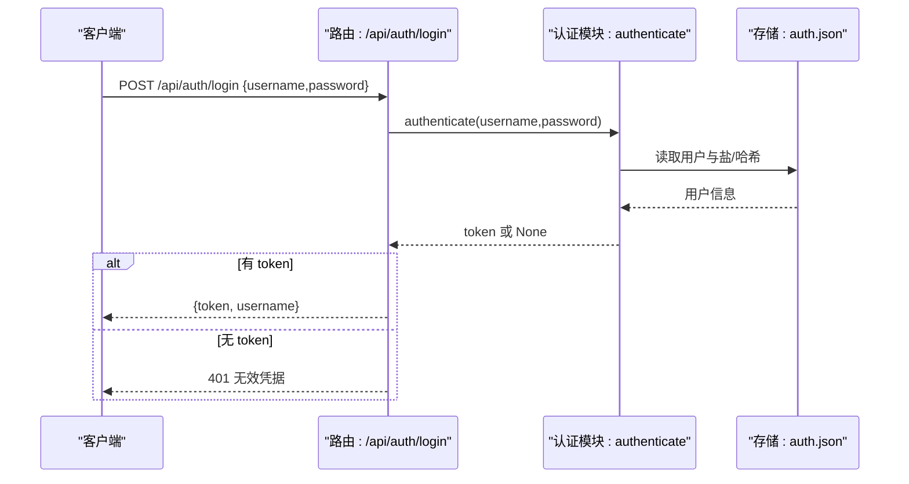
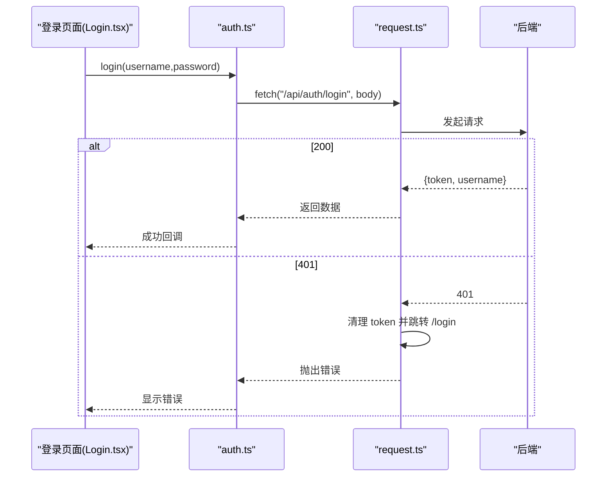
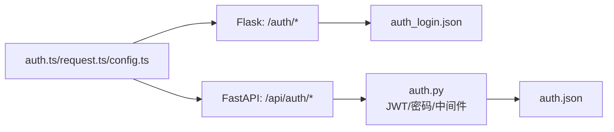
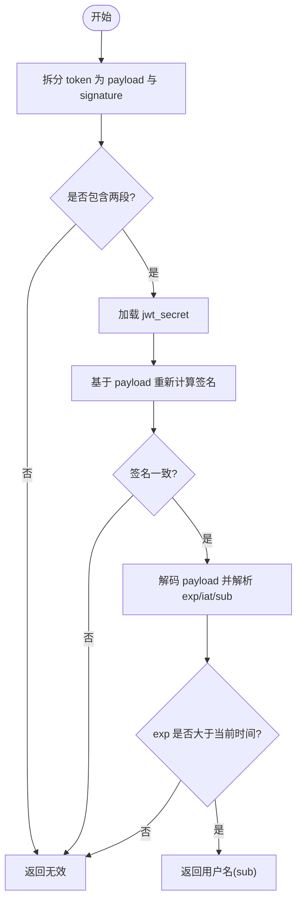

# 用户认证API

<cite>
**本文引用的文件**
- [main-project/backend/app/blueprints/auth_bp.py](file://main-project/backend/app/blueprints/auth_bp.py)
- [main-project/config/auth_login.json](file://main-project/config/auth_login.json)
- [main-project/backend/tests/test_auth_login.py](file://main-project/backend/tests/test_auth_login.py)
- [main-project/frontend/src/pages/Login.tsx](file://main-project/frontend/src/pages/Login.tsx)
- [specs/workshop/deploy-templates-ecs/env/ENVIRONMENT_VARIABLES.md](file://specs/workshop/deploy-templates-ecs/env/ENVIRONMENT_VARIABLES.md)
- [copaw/src/copaw/app/routers/auth.py](file://copaw/src/copaw/app/routers/auth.py)
- [copaw/src/copaw/app/auth.py](file://copaw/src/copaw/app/auth.py)
- [copaw/console/src/api/modules/auth.ts](file://copaw/console/src/api/modules/auth.ts)
- [copaw/console/src/api/config.ts](file://copaw/console/src/api/config.ts)
- [copaw/console/src/api/request.ts](file://copaw/console/src/api/request.ts)
- [specs/copaw-repowiki/content/API参考/REST API/REST API.md](file://specs/copaw-repowiki/content/API参考/REST API/REST API.md)
- [specs/copaw-repowiki/content/API参考/API参考.md](file://specs/copaw-repowiki/content/API参考/API参考.md)
- [specs/copaw-repowiki/content/API参考/REST API/认证API.md](file://specs/copaw-repowiki/content/API参考/REST API/认证API.md)
</cite>

## 目录
1. [简介](#简介)
2. [项目结构](#项目结构)
3. [核心组件](#核心组件)
4. [架构概览](#架构概览)
5. [详细组件分析](#详细组件分析)
6. [依赖关系分析](#依赖关系分析)
7. [性能考量](#性能考量)
8. [故障排查指南](#故障排查指南)
9. [结论](#结论)
10. [附录](#附录)

## 简介
本文件为用户认证API的权威接口规范，覆盖两类场景：
- 主工程（Flask）的演示登录与公开配置接口，便于 Workshop 演示与本地调试；
- CoPaw（FastAPI）的完整认证体系，包括登录、注册、状态查询、令牌验证与个人资料更新。

本文档明确各端点的HTTP方法、URL路径、请求参数、响应格式、状态码与错误处理策略，并解释认证流程、安全机制与配置管理，提供环境变量配置与默认凭据设置说明，以及安全最佳实践与使用示例。

## 项目结构
围绕认证API的关键文件分布如下：
- Flask演示层：/auth/public-config 与 /auth/login
- FastAPI认证层：/api/auth/*（登录、注册、状态、验证、更新资料）
- 前端调用：console/src/api/modules/auth.ts 与通用请求封装
- 配置与默认凭据：config/auth_login.json、环境变量覆盖
- 测试与文档：tests/test_auth_login.py、API参考文档

**图表来源**
- [main-project/backend/app/blueprints/auth_bp.py:27-42](file://main-project/backend/app/blueprints/auth_bp.py#L27-L42)
- [main-project/config/auth_login.json:1-5](file://main-project/config/auth_login.json#L1-L5)
- [copaw/src/copaw/app/routers/auth.py:19-175](file://copaw/src/copaw/app/routers/auth.py#L19-L175)
- [copaw/src/copaw/app/auth.py:340-410](file://copaw/src/copaw/app/auth.py#L340-L410)

**章节来源**
- [main-project/backend/app/blueprints/auth_bp.py:1-43](file://main-project/backend/app/blueprints/auth_bp.py#L1-L43)
- [copaw/src/copaw/app/routers/auth.py:1-175](file://copaw/src/copaw/app/routers/auth.py#L1-L175)

## 核心组件
- Flask演示登录与公开配置
  - GET /auth/public-config：返回公开的默认用户名与密码（可被环境变量覆盖）
  - POST /auth/login：校验用户名/密码，成功返回 {ok: true, username}，失败返回 401
- FastAPI认证体系
  - POST /api/auth/login：用户名/密码认证，返回 token 与 username；未启用认证时返回空 token
  - POST /api/auth/register：首次注册单用户，需 COPAW_AUTH_ENABLED=true 且无用户
  - GET /api/auth/status：返回 enabled、has_users
  - GET /api/auth/verify：校验 Bearer token，返回 valid、username
  - POST /api/auth/update-profile：更新用户名/密码，需提供当前密码与有效 token

**章节来源**
- [main-project/backend/app/blueprints/auth_bp.py:27-42](file://main-project/backend/app/blueprints/auth_bp.py#L27-L42)
- [copaw/src/copaw/app/routers/auth.py:42-175](file://copaw/src/copaw/app/routers/auth.py#L42-L175)

## 架构概览
认证API分为两层：
- 演示层（Flask）：面向 Workshop 与本地演示，默认凭据来自配置文件，支持通过环境变量覆盖密码。
- 生产层（FastAPI）：面向真实用户，采用 JWT 令牌与强密码哈希，支持注册、令牌验证与资料更新，可按环境变量启用/禁用。

**图表来源**
- [main-project/backend/app/blueprints/auth_bp.py:34-42](file://main-project/backend/app/blueprints/auth_bp.py#L34-L42)
- [copaw/src/copaw/app/routers/auth.py:42-114](file://copaw/src/copaw/app/routers/auth.py#L42-L114)
- [copaw/src/copaw/app/auth.py:316-332](file://copaw/src/copaw/app/auth.py#L316-L332)

## 详细组件分析

### Flask 演示认证（/auth/*）
- /auth/public-config
  - 方法：GET
  - 路径：/auth/public-config
  - 响应：{"username": "...", "password": "..."}
  - 行为：从配置文件读取默认凭据，可被环境变量覆盖（仅运行时生效）
- /auth/login
  - 方法：POST
  - 路径：/auth/login
  - 请求体：{"username": "...", "password": "..."}
  - 成功：{"ok": true, "username": "..."}
  - 失败：401，{"ok": false, "error": {"code": "INVALID_CREDENTIALS", "message": "..."}}

**图表来源**
- [main-project/backend/app/blueprints/auth_bp.py:34-42](file://main-project/backend/app/blueprints/auth_bp.py#L34-L42)

**章节来源**
- [main-project/backend/app/blueprints/auth_bp.py:27-42](file://main-project/backend/app/blueprints/auth_bp.py#L27-L42)
- [main-project/config/auth_login.json:1-5](file://main-project/config/auth_login.json#L1-L5)
- [main-project/backend/tests/test_auth_login.py:1-17](file://main-project/backend/tests/test_auth_login.py#L1-L17)

### FastAPI 生产认证（/api/auth/*）
- POST /api/auth/login
  - 请求体：{"username": "...", "password": "..."}
  - 成功：{"token": "...", "username": "..."}
  - 未启用认证：返回空 token
  - 失败：401（无效凭据）
- POST /api/auth/register
  - 请求体：{"username": "...", "password": "..."}
  - 条件：COPAW_AUTH_ENABLED=true 且尚未有用户
  - 成功：{"token": "...", "username": "..."}
  - 失败：403（未启用/已有用户）、400（用户名/密码为空）、409（注册失败）
- GET /api/auth/status
  - 响应：{"enabled": true/false, "has_users": true/false}
- GET /api/auth/verify
  - 请求头：Authorization: Bearer <token>
  - 成功：{"valid": true, "username": "..."}
  - 失败：401（未启用/无 token/无效或过期）
- POST /api/auth/update-profile
  - 请求头：Authorization: Bearer <token>
  - 请求体：{"current_password": "...", "new_username": "...", "new_password": "..."}
  - 成功：返回新的 token 与更新后的用户名
  - 失败：401（未认证/当前密码错误）、403（未启用/无用户）、400（参数非法）

**图表来源**
- [copaw/src/copaw/app/routers/auth.py:42-52](file://copaw/src/copaw/app/routers/auth.py#L42-L52)
- [copaw/src/copaw/app/auth.py:316-332](file://copaw/src/copaw/app/auth.py#L316-L332)

**章节来源**
- [copaw/src/copaw/app/routers/auth.py:42-175](file://copaw/src/copaw/app/routers/auth.py#L42-L175)
- [copaw/src/copaw/app/auth.py:192-201](file://copaw/src/copaw/app/auth.py#L192-L201)

### 前端调用与错误处理
- 前端通过 auth.ts 统一封装 /auth/* 与 /api/auth/* 的调用
- request.ts 在 401 时清理本地 token 并跳转至登录页
- token 存储与获取：localStorage 与构建时常量 TOKEN

**图表来源**
- [copaw/console/src/api/modules/auth.ts:14-26](file://copaw/console/src/api/modules/auth.ts#L14-L26)
- [copaw/console/src/api/request.ts:60-95](file://copaw/console/src/api/request.ts#L60-L95)

**章节来源**
- [copaw/console/src/api/modules/auth.ts:14-75](file://copaw/console/src/api/modules/auth.ts#L14-L75)
- [copaw/console/src/api/request.ts:60-95](file://copaw/console/src/api/request.ts#L60-L95)

## 依赖关系分析
- Flask层依赖配置文件与环境变量覆盖逻辑
- FastAPI层依赖认证模块（密码哈希、JWT、中间件）与存储（auth.json）
- 前端依赖通用请求封装与 token 管理

**图表来源**
- [main-project/backend/app/blueprints/auth_bp.py:15-24](file://main-project/backend/app/blueprints/auth_bp.py#L15-L24)
- [copaw/src/copaw/app/routers/auth.py:10-17](file://copaw/src/copaw/app/routers/auth.py#L10-L17)
- [copaw/src/copaw/app/auth.py:36-36](file://copaw/src/copaw/app/auth.py#L36-L36)

**章节来源**
- [main-project/backend/app/blueprints/auth_bp.py:15-24](file://main-project/backend/app/blueprints/auth_bp.py#L15-L24)
- [copaw/src/copaw/app/auth.py:167-189](file://copaw/src/copaw/app/auth.py#L167-L189)

## 性能考量
- FastAPI令牌验证与密码哈希均为内存计算，开销极低
- 注册与更新凭据会写入 auth.json 并可能旋转 JWT 秘钥，涉及磁盘写入与权限设置
- 建议：
  - 生产环境启用认证与 HTTPS
  - 定期轮换密钥（更新密码会触发）
  - 控制注册次数（单用户限制）

[本节为通用指导，无需引用具体文件]

## 故障排查指南
- /auth/login 返回 401
  - 检查用户名/密码是否与 /auth/public-config 返回一致
  - 若使用环境变量覆盖密码，确认运行时生效
- /api/auth/login 返回 401
  - 确认 COPAW_AUTH_ENABLED 已启用
  - 确认已先执行 /api/auth/register（单用户首次注册）
- /api/auth/verify 返回 401
  - 确认 Authorization: Bearer <token> 是否正确传递
  - 检查 token 是否过期（默认7天）
- 前端 401 自动跳转
  - request.ts 在 401 时会清除 token 并跳转至 /login

**章节来源**
- [main-project/backend/tests/test_auth_login.py:1-17](file://main-project/backend/tests/test_auth_login.py#L1-L17)
- [copaw/console/src/api/request.ts:74-83](file://copaw/console/src/api/request.ts#L74-L83)

## 结论
- 演示层（Flask）适合 Workshop 与本地调试，默认凭据来自配置文件，支持环境变量覆盖
- 生产层（FastAPI）提供完整的认证生命周期：注册、登录、令牌验证、资料更新
- 建议在生产环境启用认证、HTTPS、定期轮换密钥，并通过环境变量管理敏感配置

[本节为总结性内容，无需引用具体文件]

## 附录

### API 端点一览与规范
- Flask
  - GET /auth/public-config
    - 响应：{"username": "...", "password": "..."}
  - POST /auth/login
    - 请求体：{"username": "...", "password": "..."}
    - 成功：{"ok": true, "username": "..."}
    - 失败：401 + {"ok": false, "error": {...}}
- FastAPI
  - POST /api/auth/login
    - 请求体：{"username": "...", "password": "..."}
    - 成功：{"token": "...", "username": "..."}
    - 未启用：{"token": "", "username": ""}
    - 失败：401
  - POST /api/auth/register
    - 请求体：{"username": "...", "password": "..."}
    - 成功：{"token": "...", "username": "..."}
    - 失败：403/400/409
  - GET /api/auth/status
    - 响应：{"enabled": true/false, "has_users": true/false}
  - GET /api/auth/verify
    - 请求头：Authorization: Bearer <token>
    - 成功：{"valid": true, "username": "..."}
    - 失败：401
  - POST /api/auth/update-profile
    - 请求头：Authorization: Bearer <token>
    - 请求体：{"current_password": "...", "new_username": "...", "new_password": "..."}
    - 成功：返回新的 token 与用户名
    - 失败：401/403/400

**章节来源**
- [main-project/backend/app/blueprints/auth_bp.py:27-42](file://main-project/backend/app/blueprints/auth_bp.py#L27-L42)
- [copaw/src/copaw/app/routers/auth.py:42-175](file://copaw/src/copaw/app/routers/auth.py#L42-L175)

### 认证流程与安全机制
- 令牌生成与校验
  - JWT 结构：base64url(payload).signature
  - 载荷字段：sub（用户名）、exp（过期时间）、iat（签发时间）
  - 签名算法：HMAC-SHA256，密钥来自 auth.json 中的 jwt_secret
  - 过期策略：默认7天
- 密码存储与注册
  - auth.json 中保存 username、password_hash、password_salt、jwt_secret
  - 文件权限：0o600（仅所有者可读写）
  - 注册流程：仅允许一次注册，自动生成 jwt_secret，成功后返回 token
- 中间件与公共路径
  - 未启用认证或无用户时，跳过鉴权
  - 公共路径与静态资源前缀免鉴权
  - 仅对 /api/ 路由进行保护

**图表来源**
- [specs/copaw-repowiki/content/API参考/REST API/认证API.md:203-216](file://specs/copaw-repowiki/content/API参考/REST API/认证API.md#L203-L216)
- [copaw/src/copaw/app/auth.py:114-158](file://copaw/src/copaw/app/auth.py#L114-L158)

**章节来源**
- [specs/copaw-repowiki/content/API参考/REST API/认证API.md:190-235](file://specs/copaw-repowiki/content/API参考/REST API/认证API.md#L190-L235)
- [copaw/src/copaw/app/auth.py:104-158](file://copaw/src/copaw/app/auth.py#L104-L158)

### 环境变量与默认凭据
- Flask（演示）
  - 默认凭据：来自 config/auth_login.json
  - 环境变量覆盖：IRA_LOGIN_PASSWORD（仅运行时生效，不修改配置文件）
- FastAPI（生产）
  - 启用开关：COPAW_AUTH_ENABLED（true/1/yes）
  - 自动注册：COPAW_AUTH_USERNAME、COPAW_AUTH_PASSWORD（仅在未注册时生效）
  - 安全目录：COPAW_SECRET_DIR（auth.json 存放于此，权限 0o600）

**章节来源**
- [main-project/config/auth_login.json:1-5](file://main-project/config/auth_login.json#L1-L5)
- [specs/workshop/deploy-templates-ecs/env/ENVIRONMENT_VARIABLES.md:10-102](file://specs/workshop/deploy-templates-ecs/env/ENVIRONMENT_VARIABLES.md#L10-L102)
- [copaw/src/copaw/app/auth.py:192-201](file://copaw/src/copaw/app/auth.py#L192-L201)
- [copaw/src/copaw/app/auth.py:242-272](file://copaw/src/copaw/app/auth.py#L242-L272)

### 使用示例
- 获取公开配置
  - curl -X GET http(s)://host/ira/api/v1/auth/public-config
  - 响应：{"username":"...","password":"..."}
- 演示登录
  - curl -X POST http(s)://host/ira/api/v1/auth/login -H "Content-Type: application/json" -d '{"username":"demo","password":"ira.vin"}'
  - 成功：{"ok":true,"username":"demo"}
  - 失败：401 + {"ok":false,"error":{"code":"INVALID_CREDENTIALS","message":"..."}}
- 生产登录（FastAPI）
  - curl -X POST http(s)://host/api/auth/login -H "Content-Type: application/json" -d '{"username":"admin","password":"your_password"}'
  - 成功：{"token":"...","username":"admin"}
  - 失败：401（无效凭据）
- 令牌验证
  - curl -X GET http(s)://host/api/auth/verify -H "Authorization: Bearer YOUR_TOKEN"
  - 成功：{"valid":true,"username":"..."}
  - 失败：401（未启用/无 token/无效或过期）
- 前端集成
  - 使用 auth.ts.login(username, password) 触发登录
  - request.ts 在 401 时自动清理 token 并跳转 /login

**章节来源**
- [main-project/backend/tests/test_auth_login.py:1-17](file://main-project/backend/tests/test_auth_login.py#L1-L17)
- [copaw/console/src/api/modules/auth.ts:14-26](file://copaw/console/src/api/modules/auth.ts#L14-L26)
- [copaw/console/src/api/request.ts:74-83](file://copaw/console/src/api/request.ts#L74-L83)