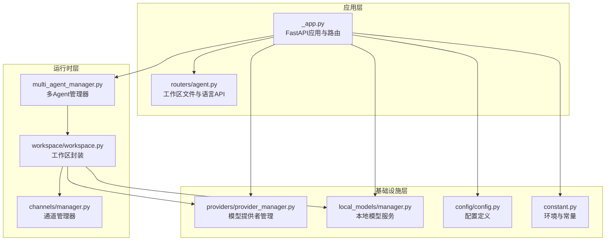
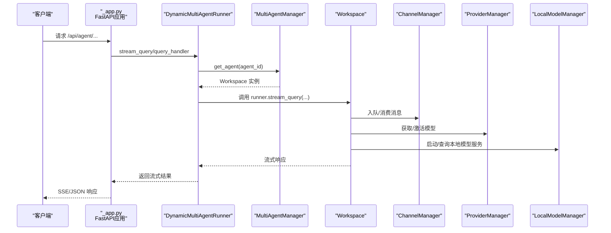
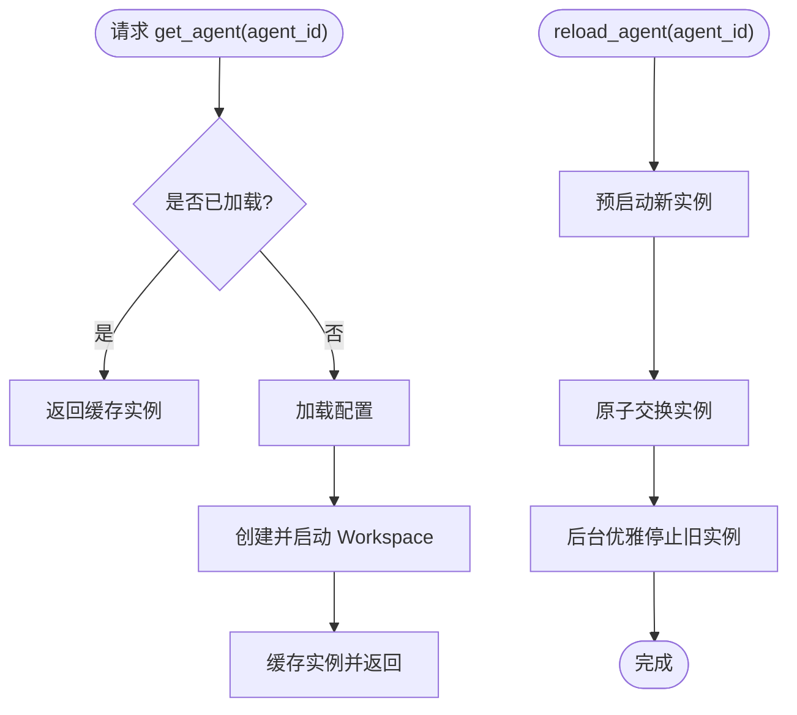
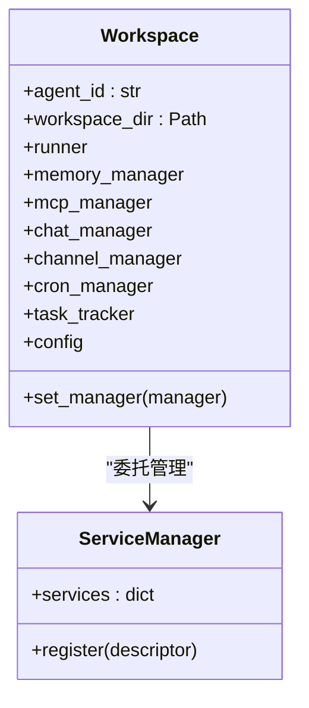
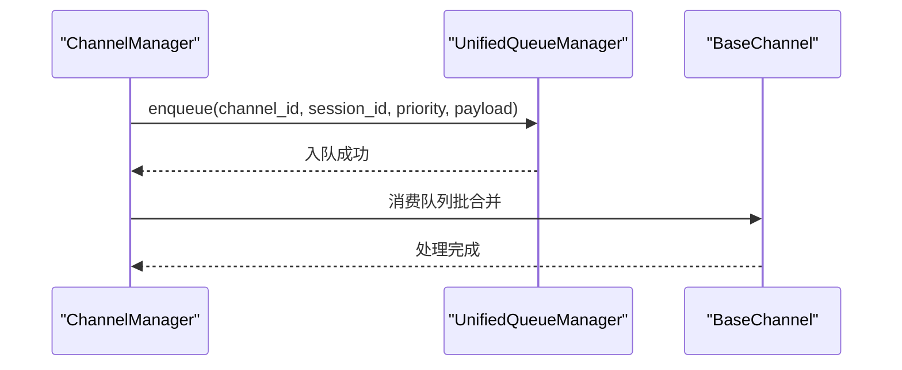
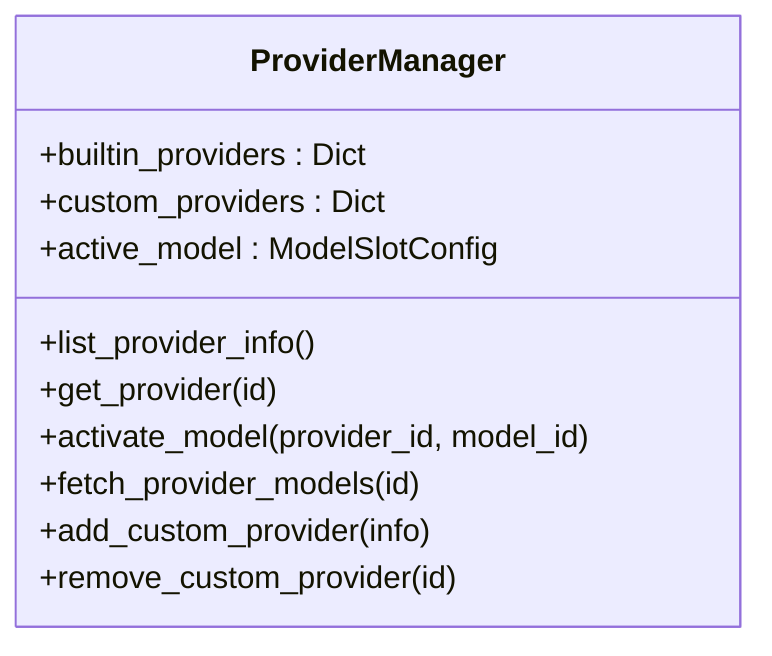
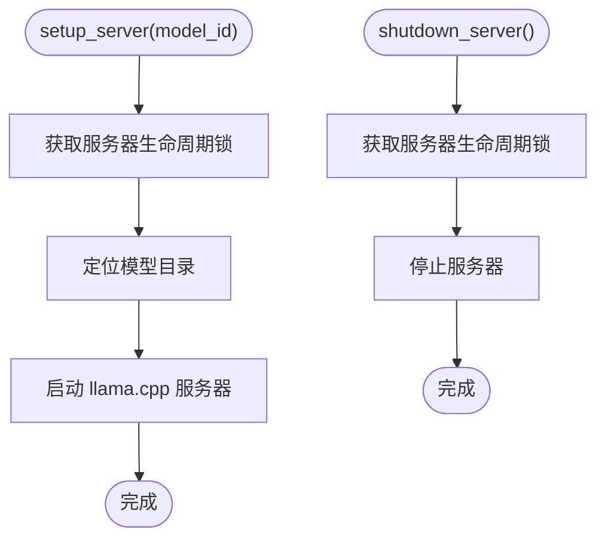
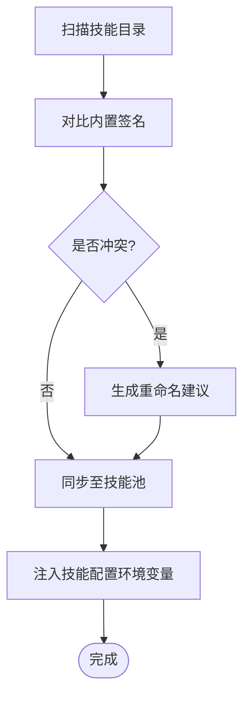
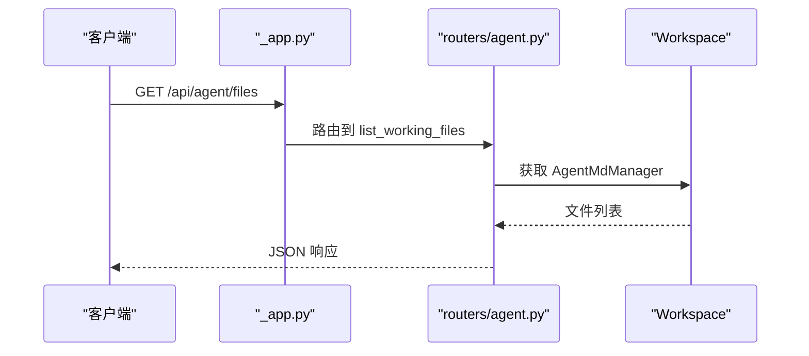
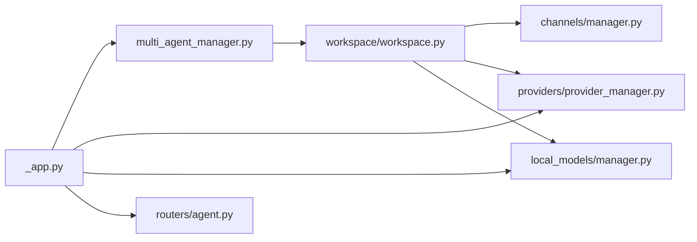

# CoPaw核心框架

<cite>
**本文档引用的文件**
- [_app.py](file://copaw/src/copaw/app/_app.py)
- [multi_agent_manager.py](file://copaw/src/copaw/app/multi_agent_manager.py)
- [workspace.py](file://copaw/src/copaw/app/workspace/workspace.py)
- [manager.py](file://copaw/src/copaw/app/channels/manager.py)
- [agent.py](file://copaw/src/copaw/app/routers/agent.py)
- [config.py](file://copaw/src/copaw/config/config.py)
- [constant.py](file://copaw/src/copaw/constant.py)
- [provider_manager.py](file://copaw/src/copaw/providers/provider_manager.py)
- [manager.py](file://copaw/src/copaw/local_models/manager.py)
- [react_agent.py](file://copaw/src/copaw/agents/react_agent.py)
- [skills_manager.py](file://copaw/src/copaw/agents/skills_manager.py)
- [__init__.py](file://copaw/src/copaw/__init__.py)
</cite>

## 目录
1. [简介](#简介)
2. [项目结构](#项目结构)
3. [核心组件](#核心组件)
4. [架构总览](#架构总览)
5. [详细组件分析](#详细组件分析)
6. [依赖分析](#依赖分析)
7. [性能考虑](#性能考虑)
8. [故障排查指南](#故障排查指南)
9. [结论](#结论)
10. [附录](#附录)

## 简介
CoPaw是一个面向多Agent协作与智能技能扩展的开源底座框架，提供统一的多渠道通信抽象、模型管理与本地推理能力、以及可插拔的技能系统。其核心目标是：
- 以多Agent管理器为中心，实现按需加载、零停机热重载与任务隔离
- 提供插件化的智能技能系统，支持工作区级技能池与安全扫描
- 抽象多渠道通信，统一消息路由与队列调度
- 管理模型提供者与本地模型服务，支持多提供商与本地推理
- 通过清晰的API与配置体系，便于主应用集成与二次开发

## 项目结构
CoPaw采用“应用层-运行时层-基础设施层”的分层组织：
- 应用层：FastAPI应用入口、路由与中间件、控制台静态资源
- 运行时层：多Agent管理器、工作区封装、通道管理器、定时任务管理器
- 基础设施层：模型提供者管理、本地模型服务、配置与常量、工具与技能

**图表来源**
- [_app.py:270-367](file://copaw/src/copaw/app/_app.py#L270-L367)
- [multi_agent_manager.py:17-82](file://copaw/src/copaw/app/multi_agent_manager.py#L17-L82)
- [workspace.py:47-120](file://copaw/src/copaw/app/workspace/workspace.py#L47-L120)
- [manager.py:68-110](file://copaw/src/copaw/app/channels/manager.py#L68-L110)
- [provider_manager.py:567-620](file://copaw/src/copaw/providers/provider_manager.py#L567-L620)
- [manager.py:14-37](file://copaw/src/copaw/local_models/manager.py#L14-L37)
- [config.py:36-200](file://copaw/src/copaw/config/config.py#L36-L200)
- [constant.py:72-183](file://copaw/src/copaw/constant.py#L72-L183)

**章节来源**
- [_app.py:270-367](file://copaw/src/copaw/app/_app.py#L270-L367)
- [multi_agent_manager.py:17-82](file://copaw/src/copaw/app/multi_agent_manager.py#L17-L82)
- [workspace.py:47-120](file://copaw/src/copaw/app/workspace/workspace.py#L47-L120)
- [manager.py:68-110](file://copaw/src/copaw/app/channels/manager.py#L68-L110)
- [provider_manager.py:567-620](file://copaw/src/copaw/providers/provider_manager.py#L567-L620)
- [manager.py:14-37](file://copaw/src/copaw/local_models/manager.py#L14-L37)
- [config.py:36-200](file://copaw/src/copaw/config/config.py#L36-L200)
- [constant.py:72-183](file://copaw/src/copaw/constant.py#L72-L183)

## 核心组件
- 多Agent管理器（MultiAgentManager）：集中管理多个工作区实例，支持懒加载、零停机热重载、并发启动与优雅停止
- 工作区（Workspace）：封装独立Agent运行时，包含Runner、ChannelManager、MemoryManager、MCPClientManager、CronManager等
- 通道管理器（ChannelManager）：统一接入多渠道（如钉钉、飞书、Telegram等），提供队列化处理与批量合并
- 模型提供者管理（ProviderManager）：内置多家提供商，支持自定义提供商、模型发现与激活
- 本地模型服务（LocalModelManager）：封装llama.cpp下载、服务器生命周期与模型下载进度
- 智能技能系统（SkillsManager）：工作区技能池同步、冲突检测、签名校验、安全扫描与环境注入
- 应用入口（_app.py）：FastAPI应用、中间件、路由注册、AgentApp集成与生命周期管理

**章节来源**
- [multi_agent_manager.py:17-82](file://copaw/src/copaw/app/multi_agent_manager.py#L17-L82)
- [workspace.py:47-120](file://copaw/src/copaw/app/workspace/workspace.py#L47-L120)
- [manager.py:68-110](file://copaw/src/copaw/app/channels/manager.py#L68-L110)
- [provider_manager.py:567-620](file://copaw/src/copaw/providers/provider_manager.py#L567-L620)
- [manager.py:14-37](file://copaw/src/copaw/local_models/manager.py#L14-L37)
- [skills_manager.py:1-120](file://copaw/src/copaw/agents/skills_manager.py#L1-L120)
- [_app.py:146-153](file://copaw/src/copaw/app/_app.py#L146-L153)

## 架构总览
CoPaw通过动态Runner将请求路由到对应Agent的工作区，工作区内部由ServiceManager统一装配组件。通道管理器负责消息入队与消费，模型提供者与本地模型服务为Agent提供推理能力。

**图表来源**
- [_app.py:54-130](file://copaw/src/copaw/app/_app.py#L54-L130)
- [multi_agent_manager.py:34-82](file://copaw/src/copaw/app/multi_agent_manager.py#L34-L82)
- [workspace.py:142-200](file://copaw/src/copaw/app/workspace/workspace.py#L142-L200)
- [manager.py:447-478](file://copaw/src/copaw/app/channels/manager.py#L447-L478)
- [provider_manager.py:753-771](file://copaw/src/copaw/providers/provider_manager.py#L753-L771)
- [manager.py:107-123](file://copaw/src/copaw/local_models/manager.py#L107-L123)

## 详细组件分析

### 多Agent管理器（MultiAgentManager）
- 功能要点
  - 懒加载：首次请求才创建并启动工作区
  - 零停机热重载：新实例预启动后原子替换旧实例，后台清理旧实例
  - 并发启动：按配置并发启动启用的Agent
  - 优雅停止：等待活跃任务完成后清理，支持取消后台清理任务
- 关键流程
  - get_agent：读取配置、创建并启动Workspace
  - reload_agent：预创建新实例、交换实例、后台清理旧实例
  - start_all_configured_agents：并发启动启用的Agent

**图表来源**
- [multi_agent_manager.py:34-82](file://copaw/src/copaw/app/multi_agent_manager.py#L34-L82)
- [multi_agent_manager.py:200-312](file://copaw/src/copaw/app/multi_agent_manager.py#L200-L312)

**章节来源**
- [multi_agent_manager.py:17-82](file://copaw/src/copaw/app/multi_agent_manager.py#L17-L82)
- [multi_agent_manager.py:200-312](file://copaw/src/copaw/app/multi_agent_manager.py#L200-L312)
- [multi_agent_manager.py:399-456](file://copaw/src/copaw/app/multi_agent_manager.py#L399-L456)

### 工作区（Workspace）
- 组件装配
  - Runner：请求处理
  - MemoryManager：对话记忆（可选后端）
  - MCPClientManager：MCP工具客户端
  - ChannelManager：多渠道通信
  - CronManager：定时任务
- 生命周期
  - 通过ServiceManager声明式注册服务，支持并发初始化与复用
  - 通过ServiceManager注入依赖，Runner可访问MemoryManager

**图表来源**
- [workspace.py:47-120](file://copaw/src/copaw/app/workspace/workspace.py#L47-L120)
- [workspace.py:142-200](file://copaw/src/copaw/app/workspace/workspace.py#L142-L200)

**章节来源**
- [workspace.py:47-120](file://copaw/src/copaw/app/workspace/workspace.py#L47-L120)
- [workspace.py:142-200](file://copaw/src/copaw/app/workspace/workspace.py#L142-L200)

### 通道管理器（ChannelManager）
- 统一队列与优先级
  - 使用UnifiedQueueManager对同会话、同优先级的消息进行批合并
  - 支持命令优先级注册与超时保护
- 生命周期
  - start_all：初始化队列管理器、启动各通道
  - stop_all：取消待处理入队任务、停止队列与通道
- 扩展性
  - 通过注册表从配置或环境创建通道实例
  - 支持替换单个通道（零停机）

**图表来源**
- [manager.py:255-301](file://copaw/src/copaw/app/channels/manager.py#L255-L301)
- [manager.py:362-446](file://copaw/src/copaw/app/channels/manager.py#L362-L446)

**章节来源**
- [manager.py:68-110](file://copaw/src/copaw/app/channels/manager.py#L68-L110)
- [manager.py:255-301](file://copaw/src/copaw/app/channels/manager.py#L255-L301)
- [manager.py:362-446](file://copaw/src/copaw/app/channels/manager.py#L362-L446)
- [manager.py:447-526](file://copaw/src/copaw/app/channels/manager.py#L447-L526)

### 模型提供者管理（ProviderManager）
- 内置提供者
  - OpenAI、Azure OpenAI、Anthropic、Gemini、Ollama、LM Studio等
- 功能
  - 列举提供者信息、更新配置、添加/删除自定义提供者
  - 激活当前模型槽位、自动探测多模态能力
  - 后台恢复本地模型服务
- 数据持久化
  - 提供者配置存储在工作目录下的专用目录中

**图表来源**
- [provider_manager.py:567-620](file://copaw/src/copaw/providers/provider_manager.py#L567-L620)
- [provider_manager.py:753-771](file://copaw/src/copaw/providers/provider_manager.py#L753-L771)

**章节来源**
- [provider_manager.py:567-620](file://copaw/src/copaw/providers/provider_manager.py#L567-L620)
- [provider_manager.py:753-771](file://copaw/src/copaw/providers/provider_manager.py#L753-L771)

### 本地模型服务（LocalModelManager）
- 能力
  - llama.cpp安装状态检查与下载
  - 本地模型下载与进度跟踪
  - 服务器生命周期控制（启动/关闭/强制关闭）
  - 推荐模型列表与可用性检测
- 单例模式
  - 通过类方法提供全局唯一实例

**图表来源**
- [manager.py:107-123](file://copaw/src/copaw/local_models/manager.py#L107-L123)
- [manager.py:115-123](file://copaw/src/copaw/local_models/manager.py#L115-L123)

**章节来源**
- [manager.py:14-37](file://copaw/src/copaw/local_models/manager.py#L14-L37)
- [manager.py:107-123](file://copaw/src/copaw/local_models/manager.py#L107-L123)

### 智能技能系统（SkillsManager）
- 技能池与工作区同步
  - 工作区技能目录与共享技能池（skill_pool）的同步策略
  - 冲突检测与重命名建议
- 安全与合规
  - 对技能目录进行扫描，确保安全性
- 环境注入
  - 将技能配置映射为环境变量，支持受控注入

**图表来源**
- [skills_manager.py:778-800](file://copaw/src/copaw/agents/skills_manager.py#L778-L800)
- [skills_manager.py:651-696](file://copaw/src/copaw/agents/skills_manager.py#L651-L696)

**章节来源**
- [skills_manager.py:1-120](file://copaw/src/copaw/agents/skills_manager.py#L1-L120)
- [skills_manager.py:778-800](file://copaw/src/copaw/agents/skills_manager.py#L778-L800)
- [skills_manager.py:651-696](file://copaw/src/copaw/agents/skills_manager.py#L651-L696)

### 应用入口与API（_app.py 与 routers/agent.py）
- 应用入口
  - FastAPI应用、中间件（认证、CORS）、静态资源与控制台SPA回退
  - 注册AgentApp路由、语音通道路由与自定义通道路由
  - 生命周期：启动迁移与初始化、启动多Agent管理器与模型服务、关闭时优雅停止
- Agent API
  - 工作区文件与内存文件的读写
  - Agent语言设置读取与更新

**图表来源**
- [_app.py:356-375](file://copaw/src/copaw/app/_app.py#L356-L375)
- [agent.py:38-84](file://copaw/src/copaw/app/routers/agent.py#L38-L84)

**章节来源**
- [_app.py:270-367](file://copaw/src/copaw/app/_app.py#L270-L367)
- [_app.py:156-268](file://copaw/src/copaw/app/_app.py#L156-L268)
- [agent.py:38-84](file://copaw/src/copaw/app/routers/agent.py#L38-L84)
- [agent.py:180-200](file://copaw/src/copaw/app/routers/agent.py#L180-L200)

## 依赖分析
- 组件耦合
  - _app.py 依赖 MultiAgentManager、ProviderManager、LocalModelManager
  - MultiAgentManager 依赖 Workspace
  - Workspace 通过 ServiceManager 依赖 Runner、ChannelManager、MemoryManager、MCPClientManager、CronManager
  - ChannelManager 依赖通道注册表与统一队列管理器
  - SkillsManager 依赖安全扫描与配置
- 外部依赖
  - FastAPI、Agentscope、Pydantic、frontmatter、asyncio、aiofiles等

**图表来源**
- [_app.py:25-35](file://copaw/src/copaw/app/_app.py#L25-L35)
- [multi_agent_manager.py:11-14](file://copaw/src/copaw/app/multi_agent_manager.py#L11-L14)
- [workspace.py:25-31](file://copaw/src/copaw/app/workspace/workspace.py#L25-L31)
- [manager.py:21-26](file://copaw/src/copaw/app/channels/manager.py#L21-L26)
- [provider_manager.py:14-21](file://copaw/src/copaw/providers/provider_manager.py#L14-L21)
- [manager.py:9-12](file://copaw/src/copaw/local_models/manager.py#L9-L12)
- [agent.py:4-18](file://copaw/src/copaw/app/routers/agent.py#L4-L18)

**章节来源**
- [_app.py:25-35](file://copaw/src/copaw/app/_app.py#L25-L35)
- [multi_agent_manager.py:11-14](file://copaw/src/copaw/app/multi_agent_manager.py#L11-L14)
- [workspace.py:25-31](file://copaw/src/copaw/app/workspace/workspace.py#L25-L31)
- [manager.py:21-26](file://copaw/src/copaw/app/channels/manager.py#L21-L26)
- [provider_manager.py:14-21](file://copaw/src/copaw/providers/provider_manager.py#L14-L21)
- [manager.py:9-12](file://copaw/src/copaw/local_models/manager.py#L9-L12)
- [agent.py:4-18](file://copaw/src/copaw/app/routers/agent.py#L4-L18)

## 性能考虑
- 并发与锁
  - MultiAgentManager使用异步锁保证线程安全，最小化锁持有时间
  - ChannelManager使用统一队列与批合并减少重复处理开销
- 零停机重载
  - 新实例预启动后原子替换，避免请求中断
- 资源回收
  - 生命周期结束时取消待处理入队任务，优雅停止通道与队列
- 模型服务
  - 本地模型服务加锁控制服务器生命周期，避免并发冲突

[本节为通用指导，不直接分析具体文件]

## 故障排查指南
- 日志与调试
  - 包初始化阶段设置日志级别；应用启动时记录关键耗时
  - 启动失败时尝试降级记录并继续运行
- 常见问题
  - Agent未找到：确认配置中存在该agent_id
  - 通道启动失败：检查通道配置与网络连通性
  - 模型服务不可用：检查本地模型下载与服务器状态
- 建议
  - 使用日志级别调整与telemetry收集辅助定位问题
  - 在生产环境禁用OpenAPI文档路由

**章节来源**
- [__init__.py:22-32](file://copaw/src/copaw/__init__.py#L22-L32)
- [_app.py:169-184](file://copaw/src/copaw/app/_app.py#L169-L184)
- [manager.py:477-478](file://copaw/src/copaw/app/channels/manager.py#L477-L478)
- [manager.py:115-123](file://copaw/src/copaw/local_models/manager.py#L115-L123)

## 结论
CoPaw通过模块化与可插拔的设计，提供了高可用、可扩展的多Agent运行时与智能技能平台。其以工作区为单位的独立运行时、以通道管理器为核心的多渠道抽象、以及以ProviderManager与LocalModelManager为核心的模型管理，共同构成了一个适合企业级部署与二次开发的底座框架。

[本节为总结性内容，不直接分析具体文件]

## 附录

### API接口与使用模式
- 多Agent管理
  - 获取Agent：根据agent_id获取工作区实例
  - 热重载：零停机替换Agent实例
  - 并发启动：按配置并发启动启用的Agent
- 工作区文件管理
  - 读取/写入工作区与内存目录中的Markdown文件
  - 设置Agent语言（支持复制内置MD文件）
- 通道管理
  - 统一入队与消费，支持批合并与优先级
  - 替换单个通道实现零停机升级
- 模型管理
  - 列举/更新提供者、激活模型槽位
  - 自动探测多模态能力与后台恢复本地模型

**章节来源**
- [multi_agent_manager.py:34-82](file://copaw/src/copaw/app/multi_agent_manager.py#L34-L82)
- [multi_agent_manager.py:200-312](file://copaw/src/copaw/app/multi_agent_manager.py#L200-L312)
- [agent.py:38-84](file://copaw/src/copaw/app/routers/agent.py#L38-L84)
- [agent.py:180-200](file://copaw/src/copaw/app/routers/agent.py#L180-L200)
- [manager.py:255-301](file://copaw/src/copaw/app/channels/manager.py#L255-L301)
- [provider_manager.py:620-708](file://copaw/src/copaw/providers/provider_manager.py#L620-L708)

### 配置选项与最佳实践
- 环境变量
  - 工作目录、密钥目录、媒体目录、心跳文件、OpenAPI文档开关、CORS来源、LLM重试与限流参数
- 最佳实践
  - 生产环境关闭OpenAPI文档路由
  - 合理设置LLM并发与QPM限制
  - 使用零停机热重载进行Agent配置变更
  - 通过技能池与内置签名管理技能版本与冲突

**章节来源**
- [constant.py:72-183](file://copaw/src/copaw/constant.py#L72-L183)
- [config.py:36-200](file://copaw/src/copaw/config/config.py#L36-L200)

### 与主应用的关系与集成方式
- 主应用可通过HTTP API与CoPaw交互，包括Agent文件管理、通道消息路由、模型提供者配置等
- 通过FastAPI路由与AgentApp集成，实现统一的请求处理与流式响应
- 控制台静态资源与SPA回退，便于前端集成与展示

**章节来源**
- [_app.py:356-441](file://copaw/src/copaw/app/_app.py#L356-L441)
- [_app.py:146-153](file://copaw/src/copaw/app/_app.py#L146-L153)