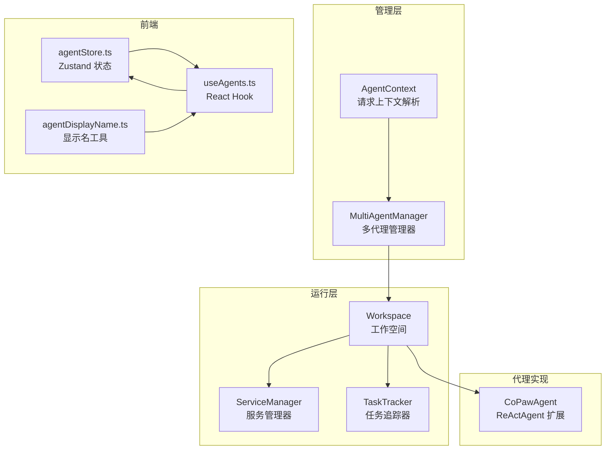
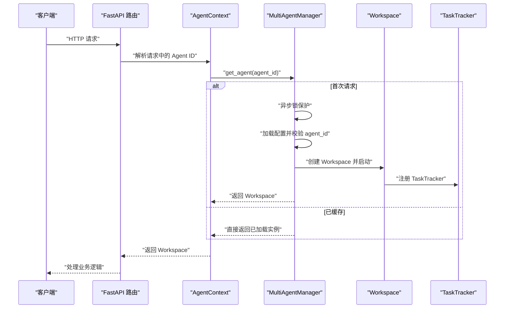
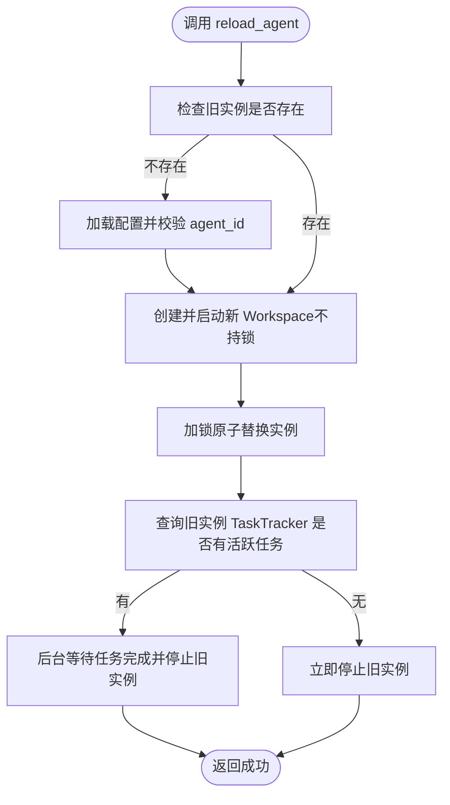
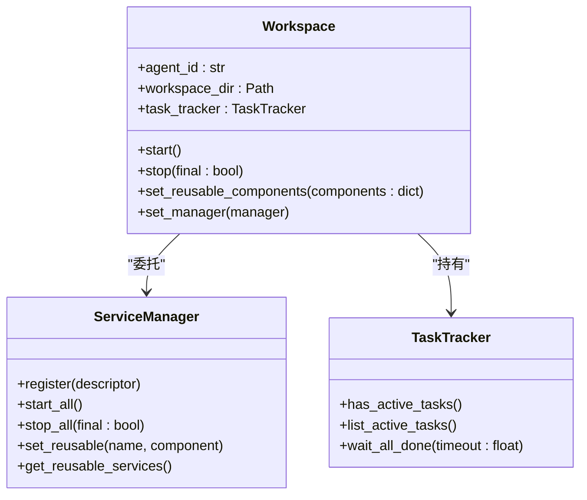
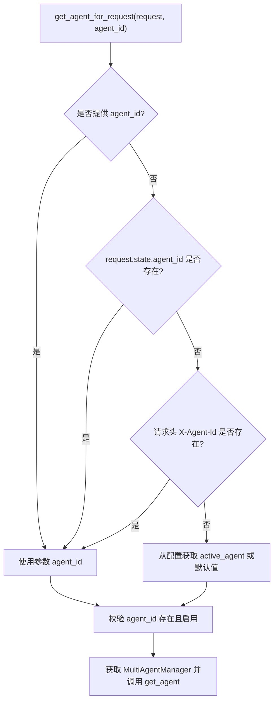
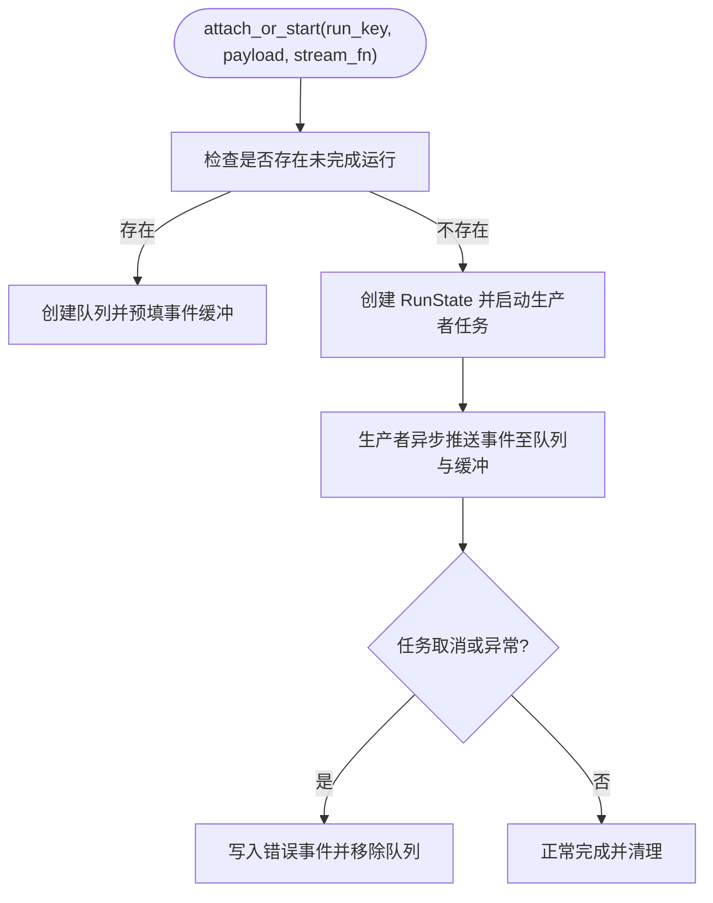
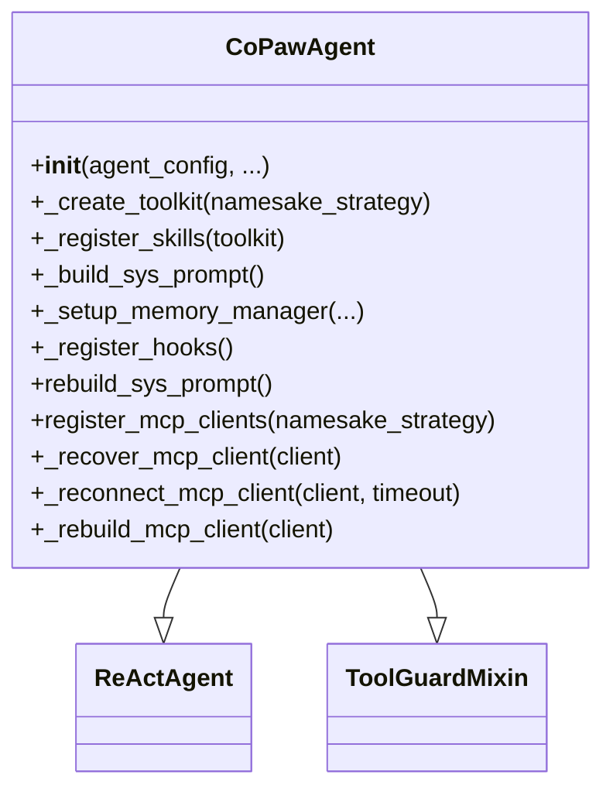
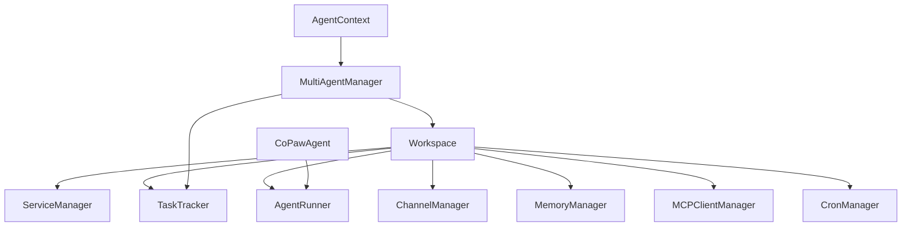
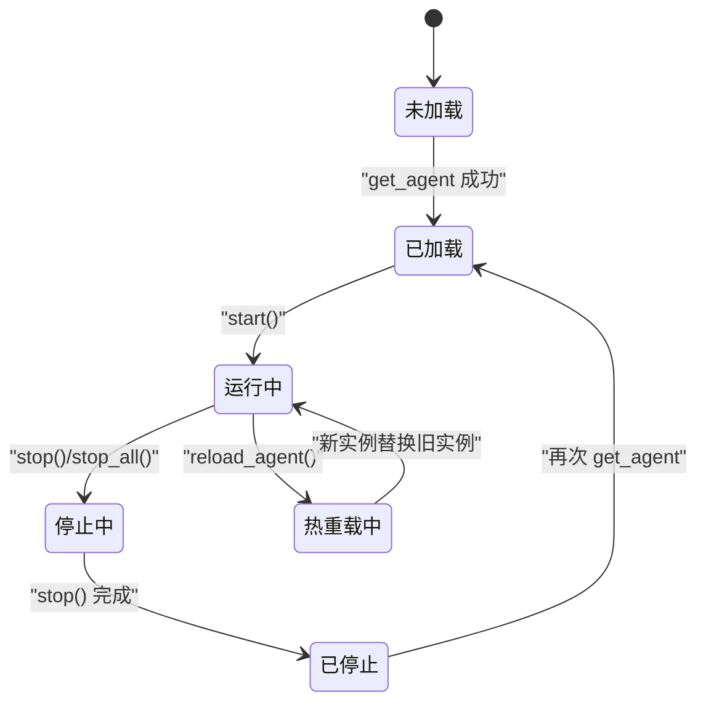

# Agent生命周期管理

<cite>
**本文引用的文件**
- [multi_agent_manager.py](file://copaw/src/copaw/app/multi_agent_manager.py)
- [workspace.py](file://copaw/src/copaw/app/workspace/workspace.py)
- [agent_context.py](file://copaw/src/copaw/app/agent_context.py)
- [task_tracker.py](file://copaw/src/copaw/app/runner/task_tracker.py)
- [react_agent.py](file://copaw/src/copaw/agents/react_agent.py)
- [schema.py](file://copaw/src/copaw/agents/schema.py)
- [agent_store.ts](file://copaw/console/src/stores/agentStore.ts)
- [useAgents.ts](file://copaw/console/src/pages/Settings/Agents/useAgents.ts)
- [agentDisplayName.ts](file://copaw/src/copaw/console/src/utils/agentDisplayName.ts)
</cite>

## 目录
1. [引言](#引言)
2. [项目结构](#项目结构)
3. [核心组件](#核心组件)
4. [架构总览](#架构总览)
5. [详细组件分析](#详细组件分析)
6. [依赖分析](#依赖分析)
7. [性能考量](#性能考量)
8. [故障排查指南](#故障排查指南)
9. [结论](#结论)
10. [附录](#附录)

## 引言
本文件系统性阐述 CoPaw 多智能体系统的生命周期管理机制，重点覆盖以下方面：
- MultiAgentManager 中 Agent 实例的懒加载、启动、停止与销毁流程
- get_agent 方法的异步锁保护与配置加载流程
- Agent 实例的内存管理策略（缓存机制与资源清理）
- 并发访问控制与线程安全机制（asyncio.Lock、TaskTracker）
- 零停机热重载的实现与后台清理任务
- Agent 状态转换图与最佳实践指南

## 项目结构
围绕 Agent 生命周期管理的关键模块分布于应用运行层与工作空间层：
- 运行层：Workspace、AgentRunner、TaskTracker、ServiceManager
- 管理层：MultiAgentManager、AgentContext（请求路由）、AgentStore（前端状态）
- 代理实现：CoPawAgent（ReActAgent 扩展）

图表来源
- [multi_agent_manager.py:17-462](file://copaw/src/copaw/app/multi_agent_manager.py#L17-L462)
- [workspace.py:47-389](file://copaw/src/copaw/app/workspace/workspace.py#L47-L389)
- [agent_context.py:22-141](file://copaw/src/copaw/app/agent_context.py#L22-L141)
- [task_tracker.py:30-231](file://copaw/src/copaw/app/runner/task_tracker.py#L30-L231)
- [react_agent.py:69-100](file://copaw/src/copaw/agents/react_agent.py#L69-L100)
- [agent_store.ts:15-72](file://copaw/console/src/stores/agentStore.ts#L15-L72)
- [useAgents.ts:18-29](file://copaw/console/src/pages/Settings/Agents/useAgents.ts#L18-L29)
- [agentDisplayName.ts:7-15](file://copaw/src/copaw/console/src/utils/agentDisplayName.ts#L7-L15)

章节来源
- [multi_agent_manager.py:17-462](file://copaw/src/copaw/app/multi_agent_manager.py#L17-L462)
- [workspace.py:47-389](file://copaw/src/copaw/app/workspace/workspace.py#L47-L389)
- [agent_context.py:22-141](file://copaw/src/copaw/app/agent_context.py#L22-L141)
- [task_tracker.py:30-231](file://copaw/src/copaw/app/runner/task_tracker.py#L30-L231)
- [react_agent.py:69-100](file://copaw/src/copaw/agents/react_agent.py#L69-L100)
- [agent_store.ts:15-72](file://copaw/console/src/stores/agentStore.ts#L15-L72)
- [useAgents.ts:18-29](file://copaw/console/src/pages/Settings/Agents/useAgents.ts#L18-L29)
- [agentDisplayName.ts:7-15](file://copaw/src/copaw/console/src/utils/agentDisplayName.ts#L7-L15)

## 核心组件
- MultiAgentManager：集中管理多个 Workspace，提供懒加载、生命周期管理、零停机热重载与并发安全
- Workspace：单个 Agent 的独立运行时环境，封装 Runner、ChannelManager、MemoryManager、MCPClientManager、CronManager 等
- TaskTracker：按 run_key 维护任务、订阅队列与事件缓冲，支持活跃任务查询与超时等待
- AgentContext：根据请求确定目标 Agent ID，委派 MultiAgentManager 获取对应 Workspace
- CoPawAgent：基于 ReActAgent 的扩展，集成工具、技能与内存管理

章节来源
- [multi_agent_manager.py:17-462](file://copaw/src/copaw/app/multi_agent_manager.py#L17-L462)
- [workspace.py:47-389](file://copaw/src/copaw/app/workspace/workspace.py#L47-L389)
- [task_tracker.py:30-231](file://copaw/src/copaw/app/runner/task_tracker.py#L30-L231)
- [agent_context.py:22-141](file://copaw/src/copaw/app/agent_context.py#L22-L141)
- [react_agent.py:69-100](file://copaw/src/copaw/agents/react_agent.py#L69-L100)

## 架构总览
下图展示了从请求到 Agent 实例获取与生命周期管理的整体流程。

图表来源
- [agent_context.py:22-106](file://copaw/src/copaw/app/agent_context.py#L22-L106)
- [multi_agent_manager.py:34-82](file://copaw/src/copaw/app/multi_agent_manager.py#L34-L82)
- [workspace.py:322-359](file://copaw/src/copaw/app/workspace/workspace.py#L322-L359)
- [task_tracker.py:30-78](file://copaw/src/copaw/app/runner/task_tracker.py#L30-L78)

## 详细组件分析

### MultiAgentManager：多代理管理器
- 懒加载：首次请求时才创建并启动 Workspace，使用异步锁保护共享状态
- 生命周期管理：支持 stop_agent、stop_all、preload_agent、start_all_configured_agents
- 零停机热重载：reload_agent 通过“先创建新实例、再原子替换、最后优雅停止旧实例”的策略实现无缝切换
- 并发安全：仅在实例替换与清理任务集合时持锁，其余时间完全并发

图表来源
- [multi_agent_manager.py:200-311](file://copaw/src/copaw/app/multi_agent_manager.py#L200-L311)
- [multi_agent_manager.py:83-178](file://copaw/src/copaw/app/multi_agent_manager.py#L83-L178)

章节来源
- [multi_agent_manager.py:17-462](file://copaw/src/copaw/app/multi_agent_manager.py#L17-L462)

### Workspace：工作空间
- 组件封装：Runner、ChannelManager、MemoryManager、MCPClientManager、CronManager
- 启动流程：加载配置、通过 ServiceManager 并发启动各服务
- 停止流程：根据 final 参数决定是否停止可复用组件，自动清理内部状态
- 可复用组件：set_reusable_components 支持在热重载前注入可复用的服务实例

图表来源
- [workspace.py:47-389](file://copaw/src/copaw/app/workspace/workspace.py#L47-L389)
- [task_tracker.py:30-231](file://copaw/src/copaw/app/runner/task_tracker.py#L30-L231)

章节来源
- [workspace.py:47-389](file://copaw/src/copaw/app/workspace/workspace.py#L47-L389)

### AgentContext：请求上下文解析
- 解析优先级：参数覆盖 > 请求状态 > 请求头 > 配置默认
- 校验与容错：检查 agent_id 存在性与启用状态，异常时返回 HTTP 错误
- 协作：从请求应用状态获取 MultiAgentManager，调用 get_agent 获取 Workspace

图表来源
- [agent_context.py:22-106](file://copaw/src/copaw/app/agent_context.py#L22-L106)

章节来源
- [agent_context.py:22-141](file://copaw/src/copaw/app/agent_context.py#L22-L141)

### TaskTracker：任务追踪器
- 角色与职责：以 run_key 为键，维护每个运行实例的 Future 任务、订阅队列列表与事件缓冲
- 关键方法：has_active_tasks、list_active_tasks、wait_all_done、attach_or_start、stream_from_queue
- 并发与隔离：所有对内部状态的修改与广播在锁内进行；生产者在锁外生成事件，减少阻塞
- 死锁预防：锁范围最小化；使用哨兵值优雅结束消费者；错误时统一写入错误事件并继续广播

图表来源
- [task_tracker.py:142-208](file://copaw/src/copaw/app/runner/task_tracker.py#L142-L208)
- [task_tracker.py:30-78](file://copaw/src/copaw/app/runner/task_tracker.py#L30-L78)

章节来源
- [task_tracker.py:30-231](file://copaw/src/copaw/app/runner/task_tracker.py#L30-L231)

### CoPawAgent：代理实现
- 构造流程：创建工具包、注册技能、构建系统提示、初始化模型与格式化器、设置内存管理与命令处理器、注册钩子
- 工具与技能：内置工具（文件、浏览器、终端等），动态从工作目录加载技能
- 安全与健壮性：继承 ToolGuardMixin，拦截与防护；媒体块过滤与回退策略；MCP 客户端恢复与重建

图表来源
- [react_agent.py:69-100](file://copaw/src/copaw/agents/react_agent.py#L69-L100)
- [react_agent.py:183-304](file://copaw/src/copaw/agents/react_agent.py#L183-L304)
- [react_agent.py:306-444](file://copaw/src/copaw/agents/react_agent.py#L306-L444)
- [react_agent.py:468-648](file://copaw/src/copaw/agents/react_agent.py#L468-L648)

章节来源
- [react_agent.py:69-100](file://copaw/src/copaw/agents/react_agent.py#L69-L100)
- [react_agent.py:183-304](file://copaw/src/copaw/agents/react_agent.py#L183-L304)
- [react_agent.py:306-444](file://copaw/src/copaw/agents/react_agent.py#L306-L444)
- [react_agent.py:468-648](file://copaw/src/copaw/agents/react_agent.py#L468-L648)

### 前端状态与显示
- agentStore.ts：使用 Zustand + persist 管理代理选择与列表，持久化到 sessionStorage
- useAgents.ts：封装加载、删除、切换代理等交互逻辑
- agentDisplayName.ts：根据 id 与国际化返回显示名称

章节来源
- [agent_store.ts:15-72](file://copaw/console/src/stores/agentStore.ts#L15-L72)
- [useAgents.ts:18-29](file://copaw/console/src/pages/Settings/Agents/useAgents.ts#L18-L29)
- [agentDisplayName.ts:7-15](file://copaw/src/copaw/console/src/utils/agentDisplayName.ts#L7-L15)

## 依赖分析
- MultiAgentManager 依赖 Workspace、TaskTracker、配置加载工具
- Workspace 依赖 ServiceManager、TaskTracker、AgentRunner、各管理器与 Watcher
- AgentContext 依赖 MultiAgentManager 与配置加载工具
- TaskTracker 作为共享组件被多个 Workspace 使用
- CoPawAgent 依赖工具、技能、内存管理与模型工厂

图表来源
- [multi_agent_manager.py:17-462](file://copaw/src/copaw/app/multi_agent_manager.py#L17-L462)
- [workspace.py:47-389](file://copaw/src/copaw/app/workspace/workspace.py#L47-L389)
- [agent_context.py:22-106](file://copaw/src/copaw/app/agent_context.py#L22-L106)
- [task_tracker.py:30-231](file://copaw/src/copaw/app/runner/task_tracker.py#L30-L231)
- [react_agent.py:69-100](file://copaw/src/copaw/agents/react_agent.py#L69-L100)

章节来源
- [multi_agent_manager.py:17-462](file://copaw/src/copaw/app/multi_agent_manager.py#L17-L462)
- [workspace.py:47-389](file://copaw/src/copaw/app/workspace/workspace.py#L47-L389)
- [agent_context.py:22-141](file://copaw/src/copaw/app/agent_context.py#L22-L141)
- [task_tracker.py:30-231](file://copaw/src/copaw/app/runner/task_tracker.py#L30-L231)
- [react_agent.py:69-100](file://copaw/src/copaw/agents/react_agent.py#L69-L100)

## 性能考量
- 锁粒度与范围：TaskTracker、ChatManager、MultiAgentManager 在状态变更与广播期间持有锁，其余时间释放，降低阻塞
- 并发启动：MultiAgentManager 使用 asyncio.gather 并发启动所有配置代理，缩短冷启动时间
- 异步 I/O：SafeJSONSession 使用 aiofiles 异步读写，避免阻塞事件循环
- 队列与缓冲：事件缓冲与队列大小限制有助于控制内存占用；满队列时修剪“死亡队列”避免资源泄漏
- 超时与取消：TaskTracker.wait_all_done 支持超时，request_stop 提供显式取消能力
- 零停机热重载：通过后台延迟清理任务避免阻塞主流程，最大化服务可用性

章节来源
- [multi_agent_manager.py:399-456](file://copaw/src/copaw/app/multi_agent_manager.py#L399-L456)
- [task_tracker.py:79-97](file://copaw/src/copaw/app/runner/task_tracker.py#L79-L97)
- [specs/系统架构/多代理系统架构/代理并发控制机制.md:334-385](file://specs/copaw-repowiki/content/系统架构/多代理系统架构/代理并发控制机制.md#L334-L385)

## 故障排查指南
- get_agent 抛出 ValueError：agent_id 未在配置中找到或未启用
- reload_agent 返回 False：配置中找不到 agent_id 或新实例启动失败
- stop_agent 返回 False：目标 agent 未运行
- 热重载后仍有旧实例残留：检查 TaskTracker.has_active_tasks 与后台清理任务状态
- 前端代理状态不同步：确认 agentStore.ts 的持久化与 useAgents.ts 的状态更新逻辑

章节来源
- [multi_agent_manager.py:34-82](file://copaw/src/copaw/app/multi_agent_manager.py#L34-L82)
- [multi_agent_manager.py:200-311](file://copaw/src/copaw/app/multi_agent_manager.py#L200-L311)
- [multi_agent_manager.py:180-198](file://copaw/src/copaw/app/multi_agent_manager.py#L180-L198)
- [task_tracker.py:54-77](file://copaw/src/copaw/app/runner/task_tracker.py#L54-L77)
- [agent_store.ts:15-72](file://copaw/console/src/stores/agentStore.ts#L15-L72)
- [useAgents.ts:18-29](file://copaw/console/src/pages/Settings/Agents/useAgents.ts#L18-L29)

## 结论
CoPaw 的多智能体生命周期管理以 MultiAgentManager 为核心，结合 Workspace 的组件化封装与 TaskTracker 的事件广播，实现了：
- 懒加载与缓存：首次请求创建、后续复用，显著降低启动成本
- 并发安全：通过 asyncio.Lock 与最小化锁持有时间，保障高并发下的稳定性
- 零停机热重载：无缝切换新旧实例，配合后台清理任务确保资源回收
- 资源管理：可复用组件与可选 final 停止策略，兼顾性能与一致性

## 附录

### Agent 状态转换图

图表来源
- [multi_agent_manager.py:34-82](file://copaw/src/copaw/app/multi_agent_manager.py#L34-L82)
- [workspace.py:322-380](file://copaw/src/copaw/app/workspace/workspace.py#L322-L380)
- [task_tracker.py:54-77](file://copaw/src/copaw/app/runner/task_tracker.py#L54-L77)

### 最佳实践指南
- 将锁范围最小化：仅在必要时持有；在锁外进行耗时操作
- 使用队列与缓冲控制内存占用，及时修剪“死亡队列”
- 对后台任务采用超时与取消机制，避免无限等待
- 利用异步 I/O 替代同步阻塞操作，保持事件循环的响应性
- 在热重载前后对比活跃任务数量，确保无缝切换
- 前端状态持久化与状态同步：使用 agentStore.ts 与 useAgents.ts 统一管理

章节来源
- [specs/系统架构/多代理系统架构/代理并发控制机制.md:369-385](file://specs/copaw-repowiki/content/系统架构/多代理系统架构/代理并发控制机制.md#L369-L385)
- [agent_store.ts:15-72](file://copaw/console/src/stores/agentStore.ts#L15-L72)
- [useAgents.ts:18-29](file://copaw/console/src/pages/Settings/Agents/useAgents.ts#L18-L29)