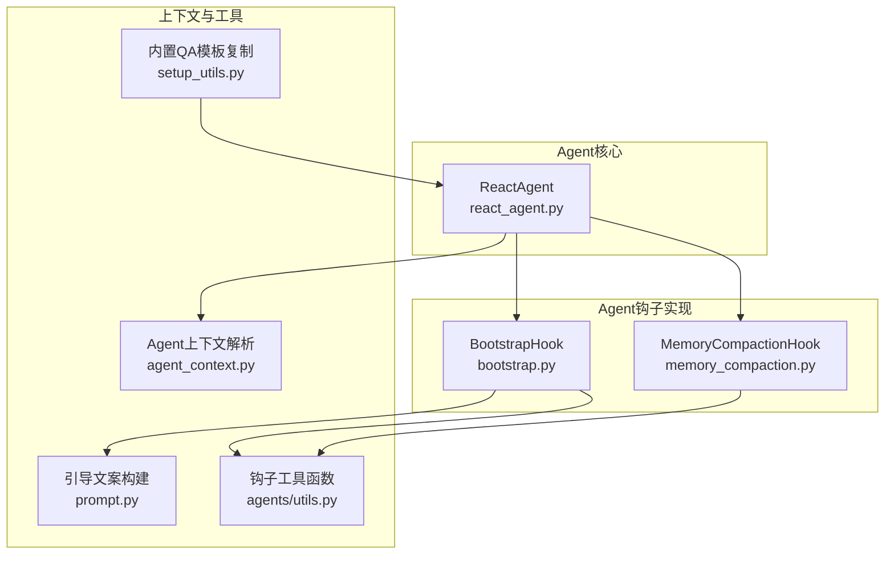
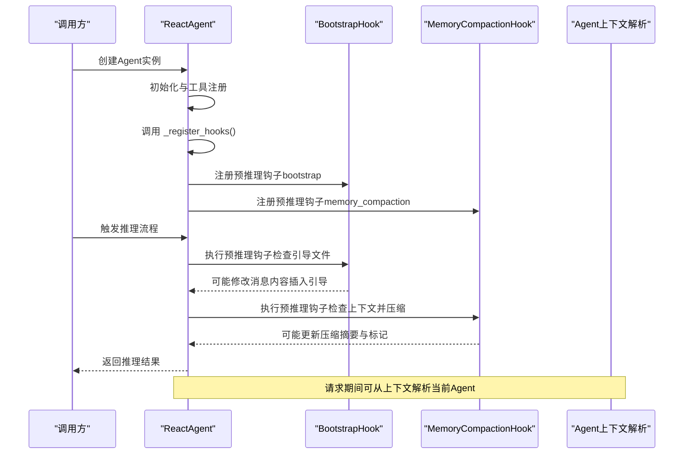
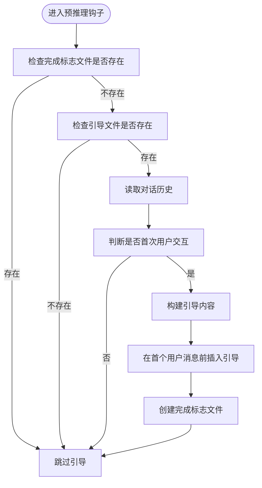
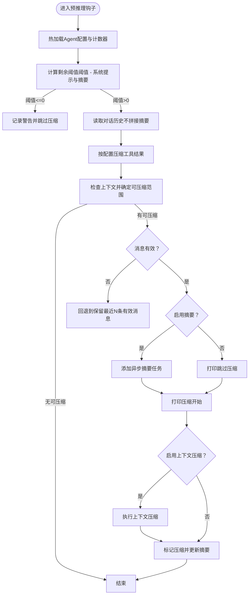
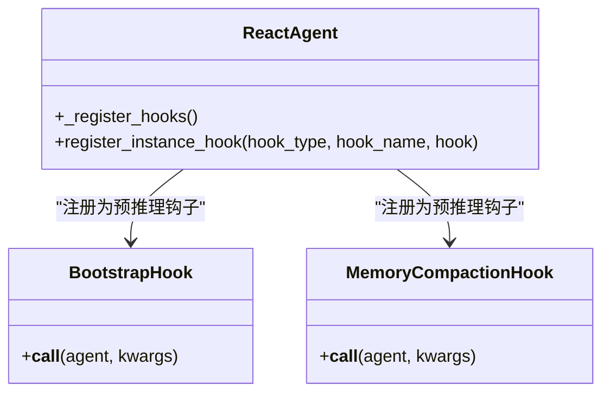
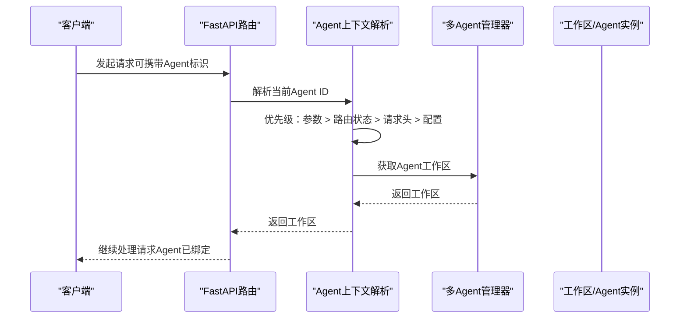
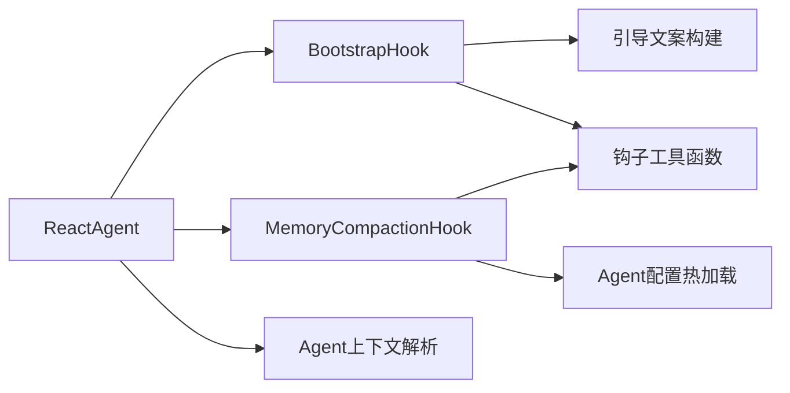

# Agent钩子系统

<cite>
**本文引用的文件**
- [bootstrap.py](file://copaw/src/copaw/agents/hooks/bootstrap.py)
- [memory_compaction.py](file://copaw/src/copaw/agents/hooks/memory_compaction.py)
- [__init__.py（hooks包）](file://copaw/src/copaw/agents/hooks/__init__.py)
- [react_agent.py](file://copaw/src/copaw/agents/react_agent.py)
- [agent_context.py](file://copaw/src/copaw/app/agent_context.py)
- [setup_utils.py](file://copaw/src/copaw/agents/utils/setup_utils.py)
- [prompt.py](file://copaw/src/copaw/agents/prompt.py)
- [utils.py（钩子工具）](file://copaw/src/copaw/agents/utils.py)
</cite>

## 目录
1. [引言](#引言)
2. [项目结构](#项目结构)
3. [核心组件](#核心组件)
4. [架构总览](#架构总览)
5. [详细组件分析](#详细组件分析)
6. [依赖分析](#依赖分析)
7. [性能考量](#性能考量)
8. [故障排查指南](#故障排查指南)
9. [结论](#结论)
10. [附录：自定义钩子开发指南](#附录自定义钩子开发指南)

## 引言
本技术文档围绕Agent钩子系统展开，重点解释以下内容：
- Bootstrap钩子机制的实现原理与Agent启动时的初始化流程、内存管理策略
- 钩子系统的注册机制与执行顺序
- MemoryCompaction钩子在上下文窗口满载时的自动压缩策略与优化路径
- 如何开发与使用自定义钩子
- 钩子与Agent上下文的交互机制
- 最佳实践与常见陷阱

## 项目结构
本仓库中与Agent钩子系统直接相关的核心位置如下：
- 钩子实现：copaw/src/copaw/agents/hooks
- ReactAgent初始化与钩子注册：copaw/src/copaw/agents/react_agent.py
- Agent上下文解析：copaw/src/copaw/app/agent_context.py
- 钩子辅助工具与引导文案：copaw/src/copaw/agents/utils、copaw/src/copaw/agents/prompt.py
- 内置QA模板复制与引导文件处理：copaw/src/copaw/agents/utils/setup_utils.py

图表来源
- [bootstrap.py:1-104](file://copaw/src/copaw/agents/hooks/bootstrap.py#L1-L104)
- [memory_compaction.py:1-214](file://copaw/src/copaw/agents/hooks/memory_compaction.py#L1-L214)
- [react_agent.py:415-443](file://copaw/src/copaw/agents/react_agent.py#L415-L443)
- [agent_context.py:22-106](file://copaw/src/copaw/app/agent_context.py#L22-L106)
- [setup_utils.py:14-77](file://copaw/src/copaw/agents/utils/setup_utils.py#L14-L77)
- [prompt.py](file://copaw/src/copaw/agents/prompt.py)
- [utils.py（钩子工具）](file://copaw/src/copaw/agents/utils.py)

章节来源
- [react_agent.py:170-181](file://copaw/src/copaw/agents/react_agent.py#L170-L181)
- [react_agent.py:415-443](file://copaw/src/copaw/agents/react_agent.py#L415-L443)

## 核心组件
- BootstrapHook：在首次用户交互时检查工作目录中的引导文件，向系统提示后的首个用户消息前插入引导内容，并通过标记文件避免重复触发。
- MemoryCompactionHook：在推理前检查上下文窗口的token占用，当接近阈值时对历史消息进行压缩或摘要化，保留系统提示与近期消息，同时支持工具结果的按规则压缩与清理。

章节来源
- [bootstrap.py:20-104](file://copaw/src/copaw/agents/hooks/bootstrap.py#L20-L104)
- [memory_compaction.py:27-214](file://copaw/src/copaw/agents/hooks/memory_compaction.py#L27-L214)

## 架构总览
下图展示了Agent启动时的钩子注册与执行链路，以及与上下文解析的关系：

图表来源
- [react_agent.py:170-181](file://copaw/src/copaw/agents/react_agent.py#L170-L181)
- [react_agent.py:415-443](file://copaw/src/copaw/agents/react_agent.py#L415-L443)
- [bootstrap.py:42-104](file://copaw/src/copaw/agents/hooks/bootstrap.py#L42-L104)
- [memory_compaction.py:62-214](file://copaw/src/copaw/agents/hooks/memory_compaction.py#L62-L214)
- [agent_context.py:22-106](file://copaw/src/copaw/app/agent_context.py#L22-L106)

## 详细组件分析

### Bootstrap钩子：首次交互引导
- 目标与行为
  - 在首次用户交互时检测工作目录是否存在引导文件，若存在则向系统提示之后的第一个用户消息前插入引导内容，并写入完成标志以避免重复触发。
- 关键点
  - 使用Agent的工作目录作为根路径，结合语言参数构建引导内容。
  - 通过内存管理器读取对话历史，定位首个用户消息并前置引导内容。
  - 使用标记文件确保仅触发一次。
- 错误处理
  - 捕获异常并记录错误日志，不影响后续流程。

图表来源
- [bootstrap.py:42-104](file://copaw/src/copaw/agents/hooks/bootstrap.py#L42-L104)
- [prompt.py](file://copaw/src/copaw/agents/prompt.py)
- [utils.py（钩子工具）](file://copaw/src/copaw/agents/utils.py)

章节来源
- [bootstrap.py:20-104](file://copaw/src/copaw/agents/hooks/bootstrap.py#L20-L104)

### MemoryCompaction钩子：上下文压缩与优化
- 目标与行为
  - 在推理前评估上下文窗口剩余容量，当接近阈值时对可压缩的历史消息进行压缩或摘要化，保留系统提示与近期消息；同时支持工具结果的按规则压缩与清理。
- 关键点
  - 从配置热加载运行时参数，计算系统提示与压缩摘要的token占用，得到可用剩余阈值。
  - 通过内存管理器检查上下文，确定需要压缩的消息范围，并在必要时回退到保留最近若干条有效消息。
  - 支持异步摘要任务与上下文压缩开关，压缩完成后更新压缩摘要与标记。
- 性能与可靠性
  - 提供状态消息输出，便于用户感知压缩过程。
  - 对无效消息进行告警与安全回退，避免破坏对话连贯性。

图表来源
- [memory_compaction.py:62-214](file://copaw/src/copaw/agents/hooks/memory_compaction.py#L62-L214)

章节来源
- [memory_compaction.py:27-214](file://copaw/src/copaw/agents/hooks/memory_compaction.py#L27-L214)

### 钩子注册机制与执行顺序
- 注册位置
  - 在Agent构造阶段调用内部注册方法，分别注册BootstrapHook与MemoryCompactionHook为“预推理”钩子。
- 执行顺序
  - 两个钩子均注册为“预推理”类型，因此在推理流程开始前依次执行。
  - BootstrapHook负责首次交互引导，MemoryCompactionHook负责上下文容量检查与压缩。
- 条件注册
  - MemoryCompactionHook仅在启用内存管理器且存在内存管理器实例时注册。

图表来源
- [react_agent.py:415-443](file://copaw/src/copaw/agents/react_agent.py#L415-L443)
- [bootstrap.py:42-104](file://copaw/src/copaw/agents/hooks/bootstrap.py#L42-L104)
- [memory_compaction.py:62-214](file://copaw/src/copaw/agents/hooks/memory_compaction.py#L62-L214)

章节来源
- [react_agent.py:170-181](file://copaw/src/copaw/agents/react_agent.py#L170-L181)
- [react_agent.py:415-443](file://copaw/src/copaw/agents/react_agent.py#L415-L443)

### 钩子与Agent上下文的交互机制
- 上下文解析
  - 通过请求对象解析当前Agent ID，支持显式覆盖、路由状态、请求头与配置回退。
- 与钩子的关系
  - 钩子在执行时可访问Agent实例及其内存管理器，从而读取/写入对话历史、系统提示与压缩摘要。
  - 上下文解析主要用于请求路由与Agent选择，而非钩子逻辑本身。

图表来源
- [agent_context.py:22-106](file://copaw/src/copaw/app/agent_context.py#L22-L106)

章节来源
- [agent_context.py:22-106](file://copaw/src/copaw/app/agent_context.py#L22-L106)

### 引导文件与工作区初始化
- 内置QA模板复制
  - 将多语言的Markdown模板复制到工作区，支持仅在缺失时复制或语言切换时覆盖。
  - 自动移除内置QA工作区中的引导文件，避免与用户自定义引导冲突。
- 与BootstrapHook的配合
  - 引导文件的存在与否直接影响BootstrapHook的行为；模板复制后应确保工作区干净，避免意外触发。

章节来源
- [setup_utils.py:14-77](file://copaw/src/copaw/agents/utils/setup_utils.py#L14-L77)
- [setup_utils.py:172-217](file://copaw/src/copaw/agents/utils/setup_utils.py#L172-L217)

## 依赖分析
- 组件耦合
  - BootstrapHook依赖钩子工具函数与引导文案构建，间接依赖Agent内存管理器与消息结构。
  - MemoryCompactionHook依赖配置加载、Token计数器、内存管理器的上下文检查与压缩能力。
- 外部集成点
  - 与AgentScope的钩子接口保持一致，遵循“可调用对象”的约定。
  - 与FastAPI上下文解析配合，用于请求期Agent选择。

图表来源
- [react_agent.py:415-443](file://copaw/src/copaw/agents/react_agent.py#L415-L443)
- [bootstrap.py:12-15](file://copaw/src/copaw/agents/hooks/bootstrap.py#L12-L15)
- [memory_compaction.py:15-19](file://copaw/src/copaw/agents/hooks/memory_compaction.py#L15-L19)
- [agent_context.py:22-106](file://copaw/src/copaw/app/agent_context.py#L22-L106)

章节来源
- [react_agent.py:415-443](file://copaw/src/copaw/agents/react_agent.py#L415-L443)
- [bootstrap.py:12-15](file://copaw/src/copaw/agents/hooks/bootstrap.py#L12-L15)
- [memory_compaction.py:15-19](file://copaw/src/copaw/agents/hooks/memory_compaction.py#L15-L19)

## 性能考量
- Token计数与阈值控制
  - 通过配置热加载与计数器估算上下文占用，避免频繁触发压缩。
- 压缩策略
  - 优先保留系统提示与近期消息，减少对对话连贯性的破坏。
  - 工具结果的按规则压缩与清理，降低冗余信息对上下文的影响。
- 异步摘要
  - 启用异步摘要任务可在后台生成摘要，减少推理前阻塞。

## 故障排查指南
- 引导未生效
  - 检查工作区是否存在引导文件与完成标志文件，确认首次交互判断逻辑。
  - 确认钩子已注册且为“预推理”类型。
- 压缩未触发或失败
  - 检查上下文阈值设置与系统提示/摘要的token占用是否超过阈值。
  - 查看无效消息告警与最近保留条数回退逻辑。
  - 确认内存管理器实例与配置正确加载。
- 上下文解析异常
  - 检查请求头、路由状态与配置中的Agent标识是否正确。
  - 确保多Agent管理器已初始化。

章节来源
- [bootstrap.py:56-104](file://copaw/src/copaw/agents/hooks/bootstrap.py#L56-L104)
- [memory_compaction.py:104-150](file://copaw/src/copaw/agents/hooks/memory_compaction.py#L104-L150)
- [agent_context.py:64-106](file://copaw/src/copaw/app/agent_context.py#L64-L106)

## 结论
Agent钩子系统通过BootstrapHook与MemoryCompactionHook实现了“首次交互引导”和“上下文容量管理”的两大关键能力。其注册机制简单明确，执行顺序可控，且与Agent上下文解析紧密协作。在实际使用中，建议合理配置上下文阈值与压缩策略，并关注引导文件与工作区初始化的配合，以获得最佳的用户体验与稳定性。

## 附录：自定义钩子开发指南
- 设计原则
  - 遵循可调用对象接口，接收agent与kwargs，返回None或修改后的kwargs。
  - 仅在必要时修改输入，避免破坏Agent内部状态。
  - 明确钩子类型（如“预推理”），确保执行时机符合预期。
- 开发步骤
  - 定义类并实现__call__方法，读取Agent上下文与内存管理器。
  - 在钩子内进行轻量计算与I/O，避免阻塞推理主流程。
  - 记录必要的日志，便于排障。
- 注册方式
  - 在Agent构造阶段调用注册方法，将钩子注册为指定类型的实例钩子。
- 最佳实践
  - 将外部依赖（如配置、计数器）在钩子初始化时注入，避免在__call__中重复加载。
  - 对可能失败的操作进行异常捕获与降级处理。
  - 通过状态消息或日志向用户反馈关键操作结果。
- 常见陷阱
  - 过度修改消息内容导致对话语义失真。
  - 未考虑并发与异步场景，造成竞态或阻塞。
  - 忽视上下文解析与Agent选择，导致钩子作用于错误的Agent实例。

章节来源
- [react_agent.py:415-443](file://copaw/src/copaw/agents/react_agent.py#L415-L443)
- [__init__.py（hooks包）:12-18](file://copaw/src/copaw/agents/hooks/__init__.py#L12-L18)