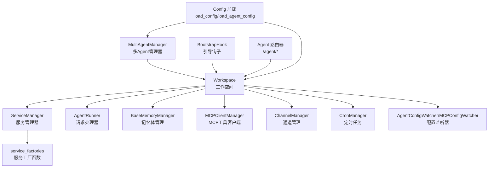
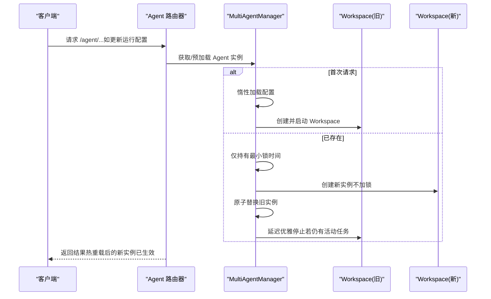
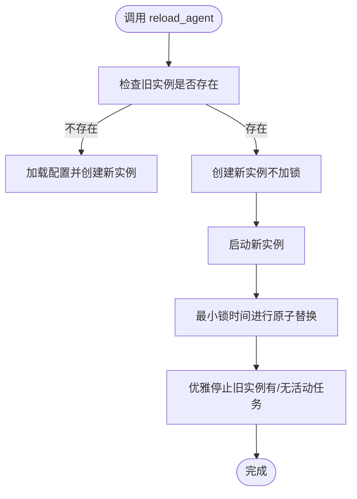
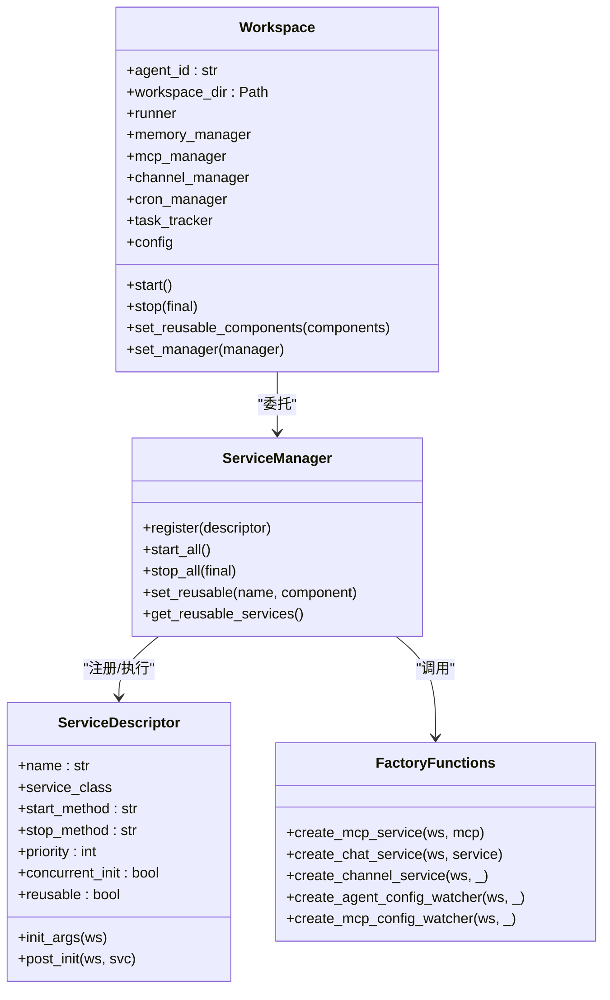
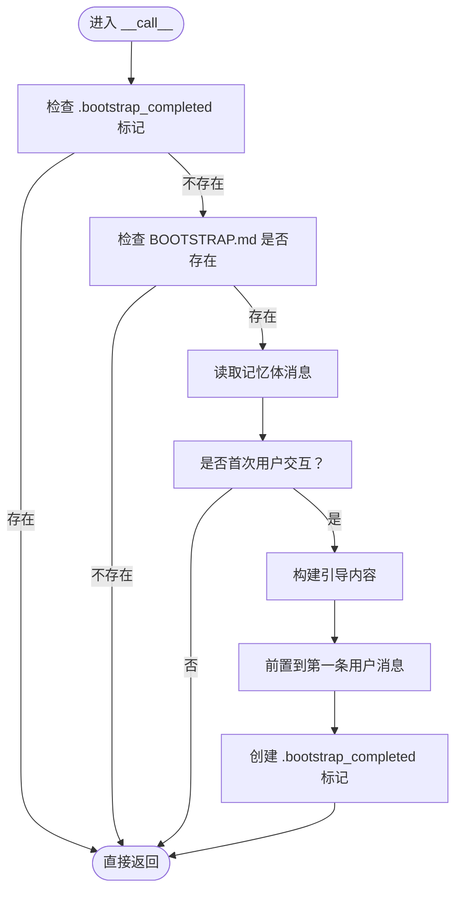
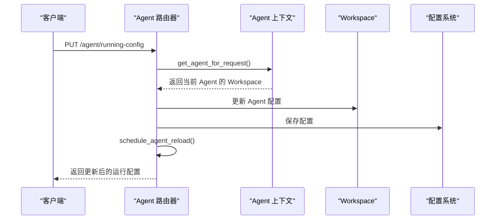
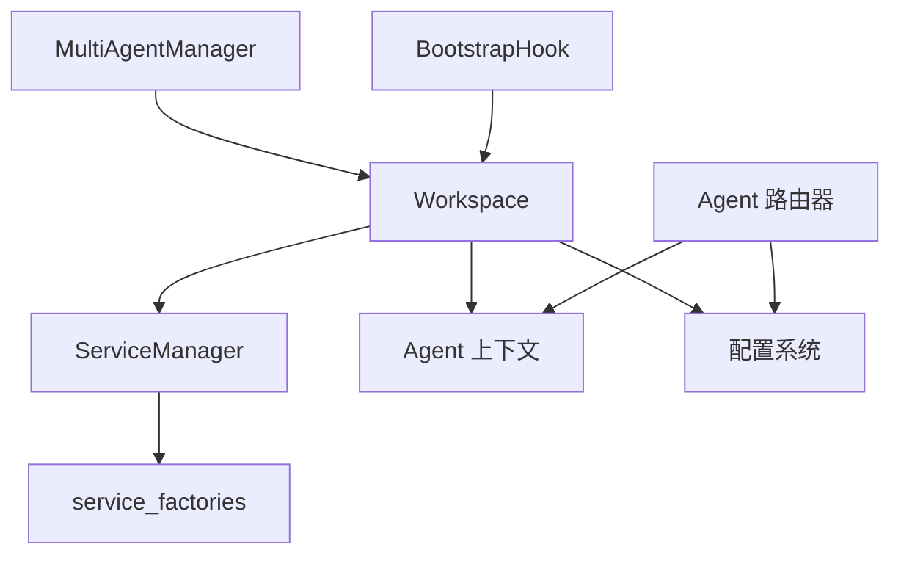

# 多Agent管理系统

<cite>
**本文引用的文件**
- [multi_agent_manager.py](file://copaw/src/copaw/app/multi_agent_manager.py)
- [workspace.py](file://copaw/src/copaw/app/workspace/workspace.py)
- [service_factories.py](file://copaw/src/copaw/app/workspace/service_factories.py)
- [bootstrap.py](file://copaw/src/copaw/agents/hooks/bootstrap.py)
- [agent.py](file://copaw/src/copaw/app/routers/agent.py)
- [config.py](file://copaw/src/copaw/config/config.py)
- [react_agent.py](file://copaw/src/copaw/agents/react_agent.py)
</cite>

## 目录
1. [引言](#引言)
2. [项目结构](#项目结构)
3. [核心组件](#核心组件)
4. [架构总览](#架构总览)
5. [详细组件分析](#详细组件分析)
6. [依赖分析](#依赖分析)
7. [性能考虑](#性能考虑)
8. [故障排查指南](#故障排查指南)
9. [结论](#结论)
10. [附录：API接口规范与最佳实践](#附录api接口规范与最佳实践)

## 引言
本技术文档围绕多Agent管理系统展开，重点阐释以下主题：
- MultiAgentManager 的架构设计与实现原理：包括 Agent 实例的动态创建、生命周期管理与零停机热重载机制；
- Workspace 工作空间管理器的设计模式：服务工厂模式的应用与工作空间初始化流程；
- Agent 钩子系统的 Bootstrap 机制：Agent 启动时的初始化流程与内存管理；
- 如何创建、配置与管理多个 Agent 实例；
- Agent 状态管理、并发控制与资源清理的最佳实践；
- 与主应用的集成方式与 API 接口规范。

## 项目结构
多Agent系统由“管理器 + 工作空间 + 服务工厂 + 钩子 + 路由器 + 配置”等模块协同组成。下图展示了关键模块之间的关系与职责划分。

图表来源
- [multi_agent_manager.py:17-462](file://copaw/src/copaw/app/multi_agent_manager.py#L17-L462)
- [workspace.py:47-389](file://copaw/src/copaw/app/workspace/workspace.py#L47-L389)
- [service_factories.py:18-171](file://copaw/src/copaw/app/workspace/service_factories.py#L18-L171)
- [bootstrap.py:20-104](file://copaw/src/copaw/agents/hooks/bootstrap.py#L20-L104)
- [agent.py:19-505](file://copaw/src/copaw/app/routers/agent.py#L19-L505)
- [config.py](file://copaw/src/copaw/config/config.py)

章节来源
- [multi_agent_manager.py:17-462](file://copaw/src/copaw/app/multi_agent_manager.py#L17-L462)
- [workspace.py:47-389](file://copaw/src/copaw/app/workspace/workspace.py#L47-L389)
- [service_factories.py:18-171](file://copaw/src/copaw/app/workspace/service_factories.py#L18-L171)
- [bootstrap.py:20-104](file://copaw/src/copaw/agents/hooks/bootstrap.py#L20-L104)
- [agent.py:19-505](file://copaw/src/copaw/app/routers/agent.py#L19-L505)
- [config.py](file://copaw/src/copaw/config/config.py)

## 核心组件
本节聚焦于多Agent系统的关键构件及其职责：
- MultiAgentManager：集中式管理多个 Workspace，支持惰性加载、生命周期管理与零停机热重载；
- Workspace：单个 Agent 的完整运行时环境，封装 Runner、ChannelManager、MemoryManager、MCPClientManager、CronManager 等；
- ServiceManager/ServiceDescriptor：声明式注册与并发初始化服务，支持可复用组件与延迟清理；
- ServiceFactories：服务工厂函数，负责从配置创建并注入各服务；
- BootstrapHook：首次用户交互引导钩子，自动注入系统提示；
- Agent 路由器：提供与 Agent 工作空间相关的文件、语言、运行配置等管理接口；
- 配置系统：全局配置与 Agent 级配置加载与保存。

章节来源
- [multi_agent_manager.py:17-462](file://copaw/src/copaw/app/multi_agent_manager.py#L17-L462)
- [workspace.py:47-389](file://copaw/src/copaw/app/workspace/workspace.py#L47-L389)
- [service_factories.py:18-171](file://copaw/src/copaw/app/workspace/service_factories.py#L18-L171)
- [bootstrap.py:20-104](file://copaw/src/copaw/agents/hooks/bootstrap.py#L20-L104)
- [agent.py:19-505](file://copaw/src/copaw/app/routers/agent.py#L19-L505)
- [config.py](file://copaw/src/copaw/config/config.py)

## 架构总览
下图展示了多Agent管理器与工作空间之间的交互关系，以及零停机热重载的时序。

图表来源
- [multi_agent_manager.py:200-311](file://copaw/src/copaw/app/multi_agent_manager.py#L200-L311)
- [workspace.py:322-380](file://copaw/src/copaw/app/workspace/workspace.py#L322-L380)
- [agent.py:448-464](file://copaw/src/copaw/app/routers/agent.py#L448-L464)

章节来源
- [multi_agent_manager.py:200-311](file://copaw/src/copaw/app/multi_agent_manager.py#L200-L311)
- [workspace.py:322-380](file://copaw/src/copaw/app/workspace/workspace.py#L322-L380)
- [agent.py:448-464](file://copaw/src/copaw/app/routers/agent.py#L448-L464)

## 详细组件分析

### MultiAgentManager：多Agent管理器
MultiAgentManager 提供了对多个 Agent 工作空间的集中管理，具备如下特性：
- 惰性加载：按需创建并启动 Workspace；
- 生命周期管理：支持停止、重启、批量启动；
- 并发安全：使用异步锁保护共享状态；
- 零停机热重载：在不影响其他 Agent 的前提下无缝替换实例，并优雅处理旧实例的后台清理。

关键方法与行为：
- get_agent(agent_id)：惰性加载并返回 Workspace；若未找到则抛出异常；
- reload_agent(agent_id)：零停机热重载，最小化锁占用时间，原子替换实例；
- _graceful_stop_old_instance(old_instance, agent_id)：根据是否存在活动任务决定立即停止或延时清理；
- stop_agent(agent_id)/stop_all()：停止指定或全部 Agent；
- start_all_configured_agents()：并发启动所有启用的 Agent；
- preload_agent(agent_id)：启动阶段预加载指定 Agent。

图表来源
- [multi_agent_manager.py:200-311](file://copaw/src/copaw/app/multi_agent_manager.py#L200-L311)
- [multi_agent_manager.py:83-179](file://copaw/src/copaw/app/multi_agent_manager.py#L83-L179)

章节来源
- [multi_agent_manager.py:17-462](file://copaw/src/copaw/app/multi_agent_manager.py#L17-L462)

### Workspace：工作空间与服务工厂模式
Workspace 是单个 Agent 的独立运行时环境，内部通过 ServiceManager 统一管理各类服务。其初始化流程采用“服务描述符 + 工厂函数”的声明式模式，具备以下特点：
- 服务注册：通过 ServiceDescriptor 描述每个服务的类、初始化参数、启动/停止方法、优先级与并发策略；
- 工厂函数：service_factories 中的 create_* 函数负责从配置创建并注入服务，提升可测试性与可维护性；
- 可复用组件：set_reusable_components 支持在热重载时保留可复用组件（如 MemoryManager、ChatManager），减少重建成本；
- 启动/停止：start() 并发初始化高优先级服务，stop(final) 控制是否清理可复用组件。

图表来源
- [workspace.py:47-389](file://copaw/src/copaw/app/workspace/workspace.py#L47-L389)
- [service_factories.py:18-171](file://copaw/src/copaw/app/workspace/service_factories.py#L18-L171)

章节来源
- [workspace.py:47-389](file://copaw/src/copaw/app/workspace/workspace.py#L47-L389)
- [service_factories.py:18-171](file://copaw/src/copaw/app/workspace/service_factories.py#L18-L171)

### Agent 钩子系统：Bootstrap 机制
BootstrapHook 在首次用户交互时检查工作目录中的引导文件，向第一条用户消息前插入系统提示，帮助建立 Agent 的身份与偏好。其核心流程如下：
- 检查引导完成标记文件是否存在；
- 若存在则跳过；否则检查引导文件是否存在；
- 从记忆体中获取消息列表，判断是否为首次用户交互；
- 构建引导内容并前置到第一条用户消息；
- 写入引导完成标记文件，避免重复触发。

图表来源
- [bootstrap.py:42-104](file://copaw/src/copaw/agents/hooks/bootstrap.py#L42-L104)

章节来源
- [bootstrap.py:20-104](file://copaw/src/copaw/agents/hooks/bootstrap.py#L20-L104)

### 与主应用的集成与API接口规范
Agent 路由器提供与 Agent 工作空间相关的管理接口，典型场景包括：
- 文件管理：列出/读取/写入工作目录与记忆目录下的 Markdown 文件；
- 语言设置：获取/更新 Agent 的语言配置，并在必要时复制对应语言的模板文件；
- 运行配置：获取/更新 Agent 的运行配置，并触发热重载；
- 音频模式与转录提供商：查询与设置音频处理模式及转录提供商。

图表来源
- [agent.py:448-464](file://copaw/src/copaw/app/routers/agent.py#L448-L464)

章节来源
- [agent.py:19-505](file://copaw/src/copaw/app/routers/agent.py#L19-L505)

## 依赖分析
- MultiAgentManager 依赖 Workspace 与配置加载工具，用于惰性加载与热重载；
- Workspace 依赖 ServiceManager 与 service_factories，以声明式方式注册与初始化服务；
- BootstrapHook 依赖 Agent 记忆体与工具函数，用于首次交互引导；
- Agent 路由器依赖 Agent 上下文与配置系统，用于获取/更新 Agent 的工作空间与配置。

图表来源
- [multi_agent_manager.py:17-462](file://copaw/src/copaw/app/multi_agent_manager.py#L17-L462)
- [workspace.py:47-389](file://copaw/src/copaw/app/workspace/workspace.py#L47-L389)
- [service_factories.py:18-171](file://copaw/src/copaw/app/workspace/service_factories.py#L18-L171)
- [bootstrap.py:20-104](file://copaw/src/copaw/agents/hooks/bootstrap.py#L20-L104)
- [agent.py:19-505](file://copaw/src/copaw/app/routers/agent.py#L19-L505)
- [config.py](file://copaw/src/copaw/config/config.py)

章节来源
- [multi_agent_manager.py:17-462](file://copaw/src/copaw/app/multi_agent_manager.py#L17-L462)
- [workspace.py:47-389](file://copaw/src/copaw/app/workspace/workspace.py#L47-L389)
- [service_factories.py:18-171](file://copaw/src/copaw/app/workspace/service_factories.py#L18-L171)
- [bootstrap.py:20-104](file://copaw/src/copaw/agents/hooks/bootstrap.py#L20-L104)
- [agent.py:19-505](file://copaw/src/copaw/app/routers/agent.py#L19-L505)
- [config.py](file://copaw/src/copaw/config/config.py)

## 性能考虑
- 惰性加载与并发启动：MultiAgentManager 在启动阶段仅预加载必要 Agent，批量启动时并发执行以缩短冷启动时间；
- 最小锁时间：热重载过程中仅在原子替换阶段持有锁，其余步骤（创建新实例、优雅停止旧实例）在无锁状态下进行；
- 可复用组件：通过 set_reusable_components 避免重复初始化昂贵组件（如 MemoryManager、ChatManager），降低热重载开销；
- 任务追踪：Workspace 内部的 TaskTracker 用于检测活动任务，确保在热重载时不会中断正在进行的流式任务；
- 配置监听：AgentConfigWatcher/MCPConfigWatcher 在后台监听配置变更，避免阻塞主线程。

## 故障排查指南
- 热重载失败：检查新实例的 start() 是否抛出异常；确认旧实例的优雅停止逻辑是否被触发；
- 旧实例未清理：关注延迟清理任务的状态与异常日志，必要时调用 cancel_all_cleanup_tasks()；
- 配置未生效：确认 schedule_agent_reload() 是否被正确调用，以及 Workspace 的配置加载是否成功；
- 首次交互引导未触发：检查工作目录中 BOOTSTRAP.md 与 .bootstrap_completed 标记文件的存在状态；
- 路由器返回错误：核对 get_agent_for_request() 是否能正确解析当前请求对应的 Agent，以及权限与路径是否正确。

章节来源
- [multi_agent_manager.py:313-361](file://copaw/src/copaw/app/multi_agent_manager.py#L313-L361)
- [workspace.py:360-380](file://copaw/src/copaw/app/workspace/workspace.py#L360-L380)
- [bootstrap.py:56-104](file://copaw/src/copaw/agents/hooks/bootstrap.py#L56-L104)
- [agent.py:448-464](file://copaw/src/copaw/app/routers/agent.py#L448-L464)

## 结论
多Agent管理系统通过 MultiAgentManager 与 Workspace 的协作，实现了 Agent 实例的动态创建、生命周期管理与零停机热重载。服务工厂模式与声明式服务注册提升了系统的可扩展性与可维护性；Bootstrap 钩子为首次交互提供了良好的用户体验。配合路由器提供的统一 API，系统能够平滑地与主应用集成，并支持运行时配置的热更新与资源的高效管理。

## 附录：API接口规范与最佳实践

### API接口规范（节选）
- 获取/更新 Agent 运行配置
  - GET /agent/running-config
  - PUT /agent/running-config（触发热重载）
- 获取/更新系统提示文件列表
  - GET /agent/system-prompt-files
  - PUT /agent/system-prompt-files（触发热重载）
- 获取/更新语言设置
  - GET /agent/language
  - PUT /agent/language（必要时复制模板文件）
- 获取/更新音频模式与转录提供商
  - GET /agent/audio-mode
  - PUT /agent/audio-mode
  - GET /agent/transcription-provider-type
  - PUT /agent/transcription-provider-type
  - GET /agent/local-whisper-status
  - GET /agent/transcription-providers
  - PUT /agent/transcription-provider

章节来源
- [agent.py:428-505](file://copaw/src/copaw/app/routers/agent.py#L428-L505)

### 最佳实践
- 状态管理
  - 使用 Workspace 的 task_tracker 监控活动任务，确保热重载不中断流式会话；
  - 在 MultiAgentManager 中保持 agent_id 到 Workspace 的映射，避免并发访问冲突。
- 并发控制
  - 热重载时仅在原子替换阶段持有锁，其余步骤在无锁环境下执行；
  - 批量启动 Agent 时使用并发 gather，但注意异常处理与日志记录。
- 资源清理
  - stop(final=True) 清理所有组件，stop(final=False) 仅清理不可复用组件；
  - 对延迟清理任务进行跟踪与取消，确保关闭流程可控。
- 配置与钩子
  - 通过 AgentConfigWatcher/MCPConfigWatcher 实现配置变更的非阻塞监听；
  - 使用 BootstrapHook 自动注入引导内容，提升首次交互体验。