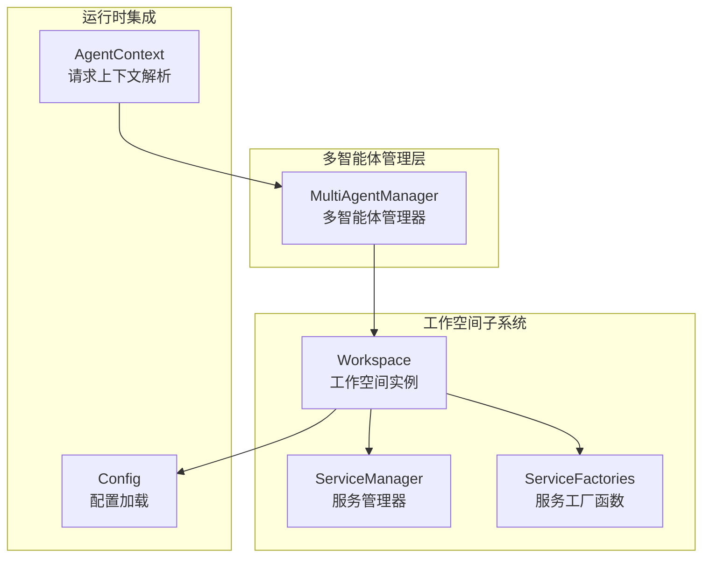
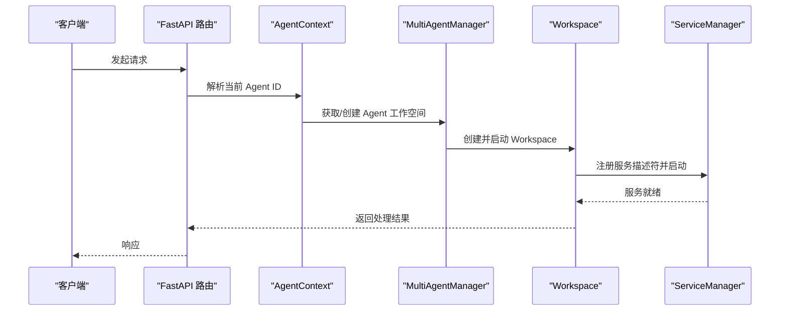
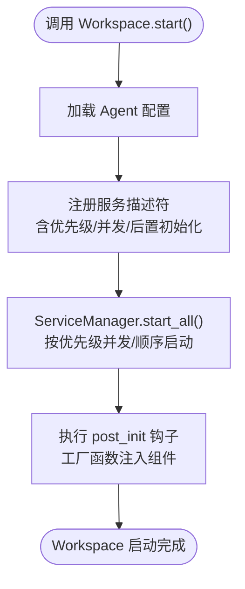
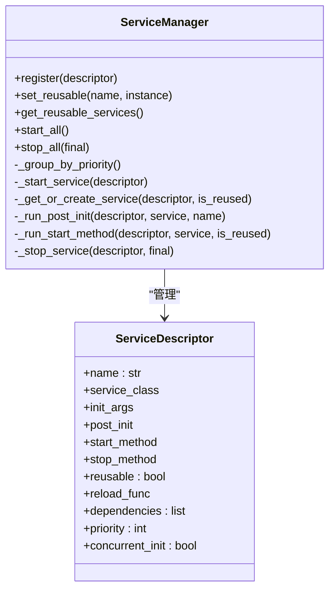
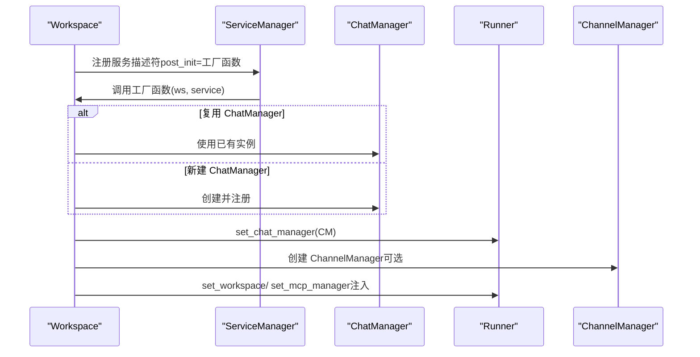
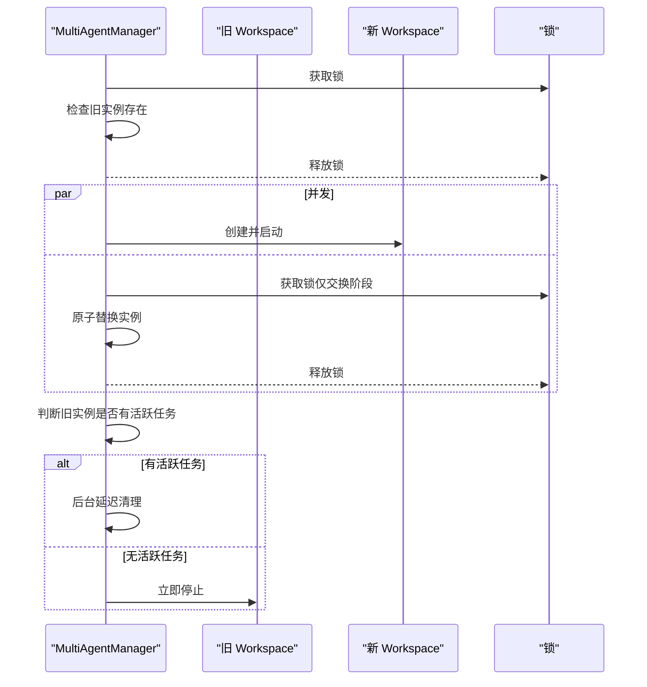
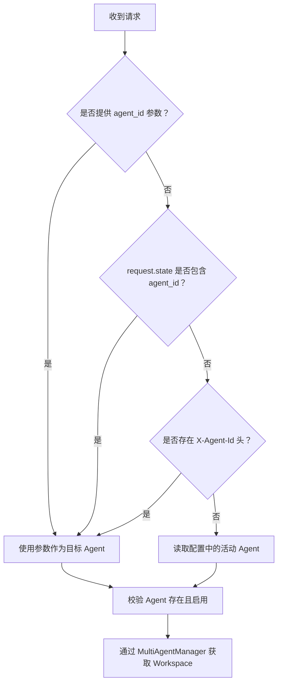
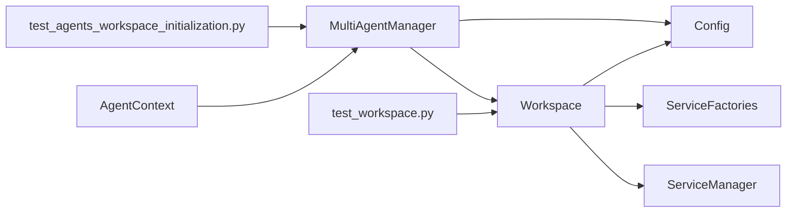

# 工作空间管理

<cite>
**本文引用的文件**
- [workspace.py](file://copaw/src/copaw/app/workspace/workspace.py)
- [service_manager.py](file://copaw/src/copaw/app/workspace/service_manager.py)
- [service_factories.py](file://copaw/src/copaw/app/workspace/service_factories.py)
- [multi_agent_manager.py](file://copaw/src/copaw/app/multi_agent_manager.py)
- [agent_context.py](file://copaw/src/copaw/app/agent_context.py)
- [config.py](file://copaw/src/copaw/config/config.py)
- [test_workspace.py](file://copaw/tests/unit/workspace/test_workspace.py)
- [test_agents_workspace_initialization.py](file://copaw/tests/unit/app/test_agents_workspace_initialization.py)
</cite>

## 目录
1. [简介](#简介)
2. [项目结构](#项目结构)
3. [核心组件](#核心组件)
4. [架构总览](#架构总览)
5. [详细组件分析](#详细组件分析)
6. [依赖分析](#依赖分析)
7. [性能考虑](#性能考虑)
8. [故障排查指南](#故障排查指南)
9. [结论](#结论)
10. [附录：最佳实践与示例](#附录最佳实践与示例)

## 简介
本技术文档围绕工作空间管理系统展开，重点阐释 Workspace 类的设计架构与实现原理，涵盖服务工厂模式的应用、工作空间初始化流程、ServiceManager 的服务注册与生命周期管理（含可复用组件传递与热重载）、ServiceFactories 的作用与工厂方法实现，并给出具体代码示例路径与最佳实践。同时解释工作空间与 Agent 实例的关系以及数据隔离机制。

## 项目结构
工作空间管理位于应用层的 workspace 子模块中，配合多智能体管理器 MultiAgentManager 提供懒加载、零停机热重载等能力；通过 AgentContext 在请求上下文中解析当前使用的 Agent；配置由 config 模块提供。

图表来源
- [workspace.py:47-389](file://copaw/src/copaw/app/workspace/workspace.py#L47-L389)
- [service_manager.py:74-421](file://copaw/src/copaw/app/workspace/service_manager.py#L74-L421)
- [service_factories.py:18-171](file://copaw/src/copaw/app/workspace/service_factories.py#L18-L171)
- [multi_agent_manager.py:17-462](file://copaw/src/copaw/app/multi_agent_manager.py#L17-L462)
- [agent_context.py:22-141](file://copaw/src/copaw/app/agent_context.py#L22-L141)
- [config.py:1-200](file://copaw/src/copaw/config/config.py#L1-L200)

章节来源
- [workspace.py:1-389](file://copaw/src/copaw/app/workspace/workspace.py#L1-L389)
- [service_manager.py:1-421](file://copaw/src/copaw/app/workspace/service_manager.py#L1-L421)
- [service_factories.py:1-171](file://copaw/src/copaw/app/workspace/service_factories.py#L1-L171)
- [multi_agent_manager.py:1-462](file://copaw/src/copaw/app/multi_agent_manager.py#L1-L462)
- [agent_context.py:1-141](file://copaw/src/copaw/app/agent_context.py#L1-L141)
- [config.py:1-200](file://copaw/src/copaw/config/config.py#L1-L200)

## 核心组件
- Workspace：封装独立的智能体运行时，包含 Runner、ChannelManager、MemoryManager、MCPClientManager、CronManager 等组件，统一通过 ServiceManager 注册与启动。
- ServiceManager：集中式服务注册、生命周期管理、并发/顺序初始化、依赖分组、可复用组件传递与热重载支持。
- ServiceFactories：工厂函数集合，负责在 Workspace._register_services 中按需创建或复用组件，并注入到 Runner/ChannelManager 等对象中。
- MultiAgentManager：多工作空间管理器，提供懒加载、零停机热重载、批量启动、清理任务管理等能力。
- AgentContext：请求级上下文解析当前 Agent，确保每个请求路由到正确的 Workspace。
- Config：提供配置加载与校验，驱动 Workspace 的初始化与组件装配。

章节来源
- [workspace.py:47-389](file://copaw/src/copaw/app/workspace/workspace.py#L47-L389)
- [service_manager.py:74-421](file://copaw/src/copaw/app/workspace/service_manager.py#L74-L421)
- [service_factories.py:18-171](file://copaw/src/copaw/app/workspace/service_factories.py#L18-L171)
- [multi_agent_manager.py:17-462](file://copaw/src/copaw/app/multi_agent_manager.py#L17-L462)
- [agent_context.py:22-141](file://copaw/src/copaw/app/agent_context.py#L22-L141)
- [config.py:1-200](file://copaw/src/copaw/config/config.py#L1-L200)

## 架构总览
下图展示了从请求到工作空间实例的端到端调用链，以及多智能体管理器在其中的角色。

图表来源
- [agent_context.py:22-107](file://copaw/src/copaw/app/agent_context.py#L22-L107)
- [multi_agent_manager.py:34-82](file://copaw/src/copaw/app/multi_agent_manager.py#L34-L82)
- [workspace.py:322-389](file://copaw/src/copaw/app/workspace/workspace.py#L322-L389)
- [service_manager.py:171-229](file://copaw/src/copaw/app/workspace/service_manager.py#L171-L229)

## 详细组件分析

### Workspace 设计与初始化流程
- 角色定位：Workspace 是单智能体的完整运行时容器，内部持有 ServiceManager，并通过属性代理访问各组件。
- 初始化步骤：
  1) 创建工作目录并确保存在。
  2) 构造 ServiceManager 并注册全部服务描述符（含优先级、并发策略、后置初始化钩子）。
  3) start() 时先加载配置，再委托 ServiceManager 并发/顺序启动所有服务。
  4) stop(final=...) 支持零停机热重载场景下的“跳过可复用组件”停止逻辑。
- 关键点：
  - 可复用组件：通过 set_reusable_components 在 start() 前设置，ServiceManager 在启动时识别 reused_services 并跳过实例化与启动。
  - 后置初始化：如 create_chat_service、create_channel_service 等工厂函数负责将新组件注入到 Runner 或 ChannelManager。
  - 依赖与顺序：通过优先级与并发标志控制启动顺序，确保 Runner 先于 Channel/Cron 等组件启动。

图表来源
- [workspace.py:322-359](file://copaw/src/copaw/app/workspace/workspace.py#L322-L359)
- [service_manager.py:171-229](file://copaw/src/copaw/app/workspace/service_manager.py#L171-L229)
- [service_factories.py:18-108](file://copaw/src/copaw/app/workspace/service_factories.py#L18-L108)

章节来源
- [workspace.py:60-130](file://copaw/src/copaw/app/workspace/workspace.py#L60-L130)
- [workspace.py:142-289](file://copaw/src/copaw/app/workspace/workspace.py#L142-L289)
- [workspace.py:322-389](file://copaw/src/copaw/app/workspace/workspace.py#L322-L389)

### ServiceManager：服务注册与生命周期管理
- 服务注册：ServiceDescriptor 描述服务名称、类/工厂、初始化参数、后置初始化、启动/停止方法、是否可复用、依赖、优先级、是否并发初始化等。
- 生命周期：
  - start_all：按优先级分组，同一优先级内并发启动可并发的服务，否则串行；对 reused 服务跳过实例化与启动。
  - stop_all：逆序优先级停止，final=False 时跳过可复用服务，避免影响新实例。
- 可复用组件：
  - set_reusable：标记某服务实例可复用，并在需要时调用 reload_func。
  - get_reusable_services：导出可复用服务集合，用于热重载时传递给新实例。

图表来源
- [service_manager.py:30-72](file://copaw/src/copaw/app/workspace/service_manager.py#L30-L72)
- [service_manager.py:74-421](file://copaw/src/copaw/app/workspace/service_manager.py#L74-L421)

章节来源
- [service_manager.py:92-157](file://copaw/src/copaw/app/workspace/service_manager.py#L92-L157)
- [service_manager.py:171-421](file://copaw/src/copaw/app/workspace/service_manager.py#L171-L421)

### ServiceFactories：工厂方法与组件注入
- create_mcp_service：从配置初始化 MCPClientManager，并将其注入到 Runner。
- create_chat_service：创建或复用 ChatManager，并注入到 Runner。
- create_channel_service：根据配置创建 ChannelManager，注入 Workspace 与 Runner。
- create_agent_config_watcher / create_mcp_config_watcher：条件性创建配置监听器，用于动态更新通道与定时任务。

图表来源
- [service_factories.py:18-108](file://copaw/src/copaw/app/workspace/service_factories.py#L18-L108)
- [workspace.py:154-289](file://copaw/src/copaw/app/workspace/workspace.py#L154-L289)

章节来源
- [service_factories.py:18-171](file://copaw/src/copaw/app/workspace/service_factories.py#L18-L171)

### MultiAgentManager：多工作空间管理与热重载
- 懒加载：首次请求时才创建并启动 Workspace。
- 零停机热重载：创建新实例并完全启动后，原子替换旧实例；若旧实例仍有活跃任务，则后台延迟清理。
- 批量启动：并发启动配置中启用的多个 Agent。
- 清理任务：跟踪并取消/等待后台延迟清理任务，保证优雅关停。

图表来源
- [multi_agent_manager.py:200-311](file://copaw/src/copaw/app/multi_agent_manager.py#L200-L311)
- [multi_agent_manager.py:83-179](file://copaw/src/copaw/app/multi_agent_manager.py#L83-L179)

章节来源
- [multi_agent_manager.py:34-82](file://copaw/src/copaw/app/multi_agent_manager.py#L34-L82)
- [multi_agent_manager.py:200-311](file://copaw/src/copaw/app/multi_agent_manager.py#L200-L311)
- [multi_agent_manager.py:338-362](file://copaw/src/copaw/app/multi_agent_manager.py#L338-L362)

### AgentContext：请求到 Agent 的映射
- 优先级解析：显式参数 > 请求状态变量 > 请求头 > 配置中的活动 Agent。
- 校验：确认 Agent 存在且启用，否则抛出 HTTP 异常。
- 获取：从 FastAPI 应用状态中取得 MultiAgentManager 并获取对应 Workspace。

图表来源
- [agent_context.py:22-107](file://copaw/src/copaw/app/agent_context.py#L22-L107)

章节来源
- [agent_context.py:22-141](file://copaw/src/copaw/app/agent_context.py#L22-L141)

## 依赖分析
- Workspace 依赖 ServiceManager 进行服务注册与生命周期管理；依赖 ServiceFactories 进行组件创建与注入；依赖配置加载与工具类。
- ServiceManager 依赖 ServiceDescriptor 数据结构与异步并发控制。
- MultiAgentManager 依赖 Workspace 与配置加载，协调懒加载与热重载。
- AgentContext 依赖 MultiAgentManager 与配置加载，提供请求级 Agent 解析。
- 测试覆盖：单元测试验证 Workspace 创建、组件在启动前为空、默认 Agent 行为、短 UUID Agent 行为；集成测试验证工作空间初始化生成的运行时文件契约。

图表来源
- [workspace.py:17-31](file://copaw/src/copaw/app/workspace/workspace.py#L17-L31)
- [service_manager.py:30-72](file://copaw/src/copaw/app/workspace/service_manager.py#L30-L72)
- [service_factories.py:18-171](file://copaw/src/copaw/app/workspace/service_factories.py#L18-L171)
- [multi_agent_manager.py:17-462](file://copaw/src/copaw/app/multi_agent_manager.py#L17-L462)
- [agent_context.py:22-107](file://copaw/src/copaw/app/agent_context.py#L22-L107)
- [test_workspace.py:8-97](file://copaw/tests/unit/workspace/test_workspace.py#L8-L97)
- [test_agents_workspace_initialization.py:35-109](file://copaw/tests/unit/app/test_agents_workspace_initialization.py#L35-L109)

章节来源
- [test_workspace.py:8-97](file://copaw/tests/unit/workspace/test_workspace.py#L8-L97)
- [test_agents_workspace_initialization.py:35-109](file://copaw/tests/unit/app/test_agents_workspace_initialization.py#L35-L109)

## 性能考虑
- 并发初始化：ServiceManager 对同一优先级内的服务采用并发启动（asyncio.gather），显著缩短启动时间。
- 顺序约束：通过优先级与并发标志控制启动顺序，避免资源竞争。
- 可复用组件：在热重载时复用内存与聊天仓库等昂贵资源，减少重启成本。
- 零停机热重载：新实例完全启动后再原子替换，最小化锁持有时间，提升吞吐。
- 批量启动：MultiAgentManager 并发启动启用的 Agent，降低冷启动开销。

## 故障排查指南
- 启动失败：Workspace.start() 捕获异常并回滚已启动组件，日志记录错误原因，便于定位。
- 组件未就绪：启动前各组件属性返回 None 属于预期行为，应在 start() 后再访问。
- 配置问题：Agent 不存在或禁用会触发 HTTP 异常；检查配置文件与 Agent 名称。
- 热重载异常：新实例启动失败会尝试清理；旧实例继续服务，关注延迟清理任务状态。

章节来源
- [workspace.py:352-359](file://copaw/src/copaw/app/workspace/workspace.py#L352-L359)
- [multi_agent_manager.py:274-289](file://copaw/src/copaw/app/multi_agent_manager.py#L274-L289)
- [agent_context.py:64-106](file://copaw/src/copaw/app/agent_context.py#L64-L106)

## 结论
该工作空间管理系统通过 Workspace + ServiceManager + ServiceFactories 的组合，实现了组件化的服务注册与生命周期管理；借助 MultiAgentManager 提供懒加载与零停机热重载能力；AgentContext 将请求映射到正确的工作空间，确保数据隔离与可扩展性。整体设计兼顾了可维护性、性能与可靠性。

## 附录：最佳实践与示例

### 最佳实践
- 明确优先级与并发：将强依赖组件置于较低优先级，允许同优先级并发启动。
- 合理标记可复用组件：对内存、聊天仓库等昂贵资源标注 reusable，并在热重载时传递。
- 使用工厂函数进行注入：将跨组件的依赖注入逻辑集中在工厂函数中，保持 Workspace 注册逻辑清晰。
- 配置驱动：通过配置文件控制通道、定时任务、MCP 等，避免硬编码。
- 监控与日志：利用启动/停止日志与异常回滚机制，快速定位问题。

### 示例：创建工作空间与配置
- 创建工作空间实例（示例路径）
  - [workspace.py:60-86](file://copaw/src/copaw/app/workspace/workspace.py#L60-L86)
- 注册服务与启动（示例路径）
  - [workspace.py:142-289](file://copaw/src/copaw/app/workspace/workspace.py#L142-L289)
  - [service_manager.py:171-229](file://copaw/src/copaw/app/workspace/service_manager.py#L171-L229)
- 设置可复用组件（示例路径）
  - [workspace.py:290-321](file://copaw/src/copaw/app/workspace/workspace.py#L290-L321)
  - [service_manager.py:106-145](file://copaw/src/copaw/app/workspace/service_manager.py#L106-L145)
- 零停机热重载（示例路径）
  - [multi_agent_manager.py:200-311](file://copaw/src/copaw/app/multi_agent_manager.py#L200-L311)
- 请求到 Agent 的解析（示例路径）
  - [agent_context.py:22-107](file://copaw/src/copaw/app/agent_context.py#L22-L107)

### 数据隔离机制
- 每个 Workspace 拥有独立的工作目录与组件实例，确保不同 Agent 的数据（如聊天记录、定时任务、内存管理器）相互隔离。
- ChannelManager 注入 Workspace 与 Runner，使通道层与工作空间绑定，避免跨实例共享状态。
- 配置监听器按需创建，仅在配置存在时启用，减少不必要的全局状态。

章节来源
- [workspace.py:67-130](file://copaw/src/copaw/app/workspace/workspace.py#L67-L130)
- [service_factories.py:64-108](file://copaw/src/copaw/app/workspace/service_factories.py#L64-L108)
- [multi_agent_manager.py:34-82](file://copaw/src/copaw/app/multi_agent_manager.py#L34-L82)