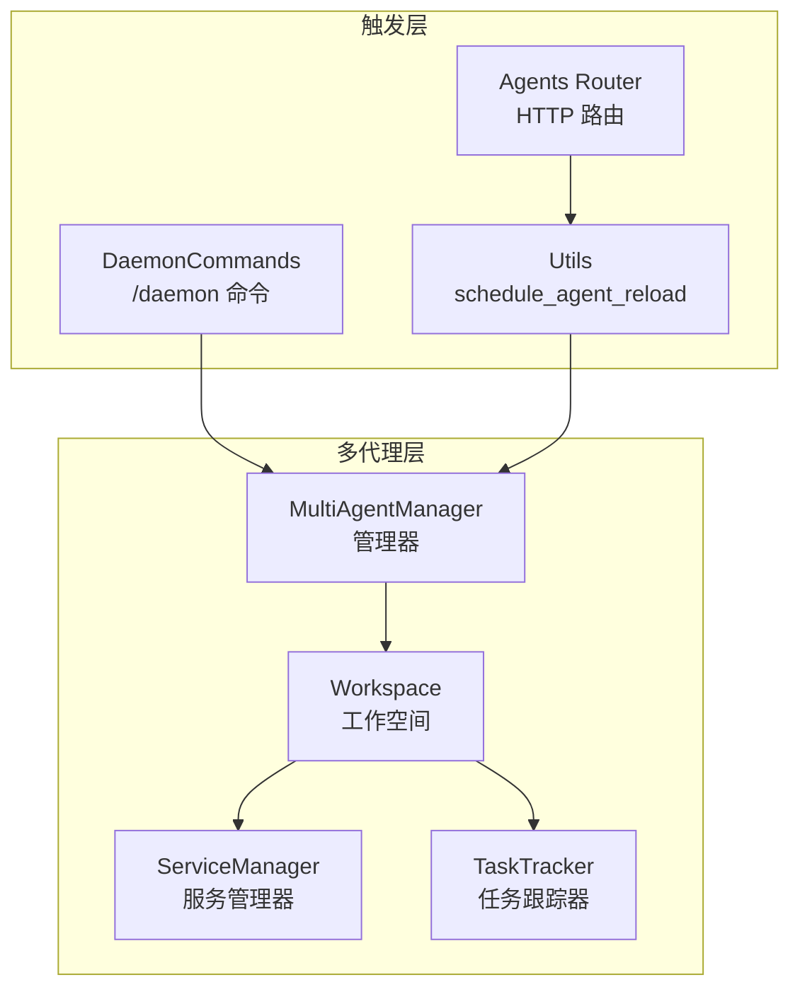
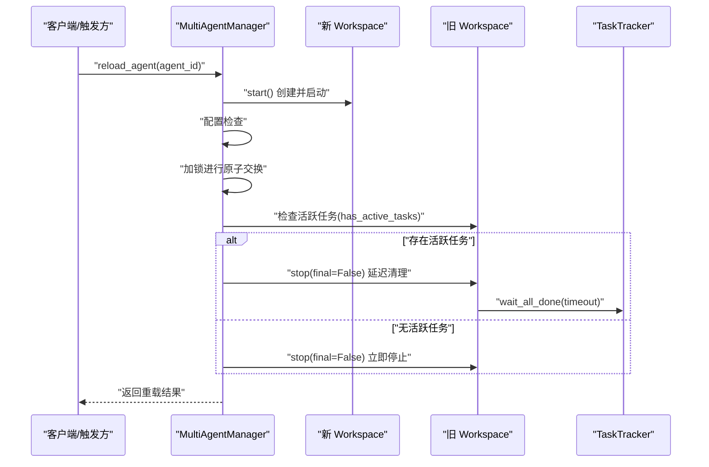
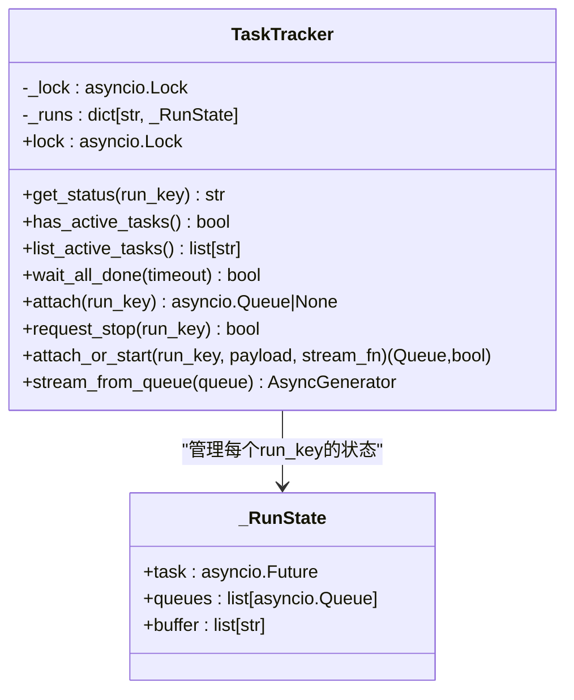
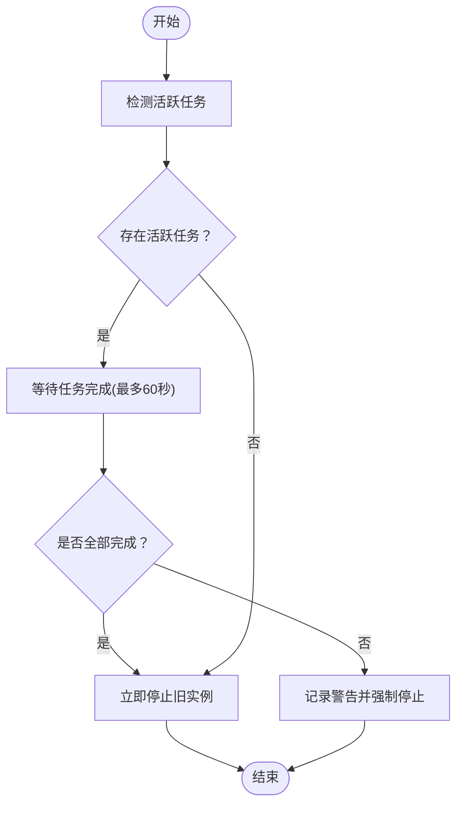
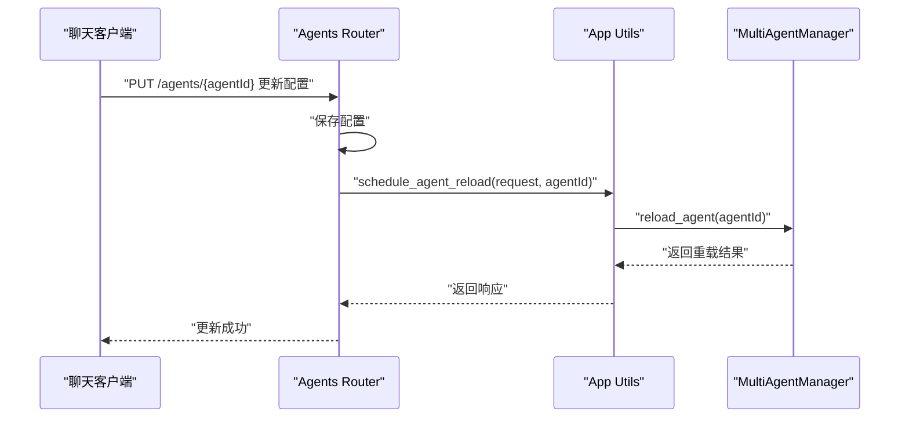
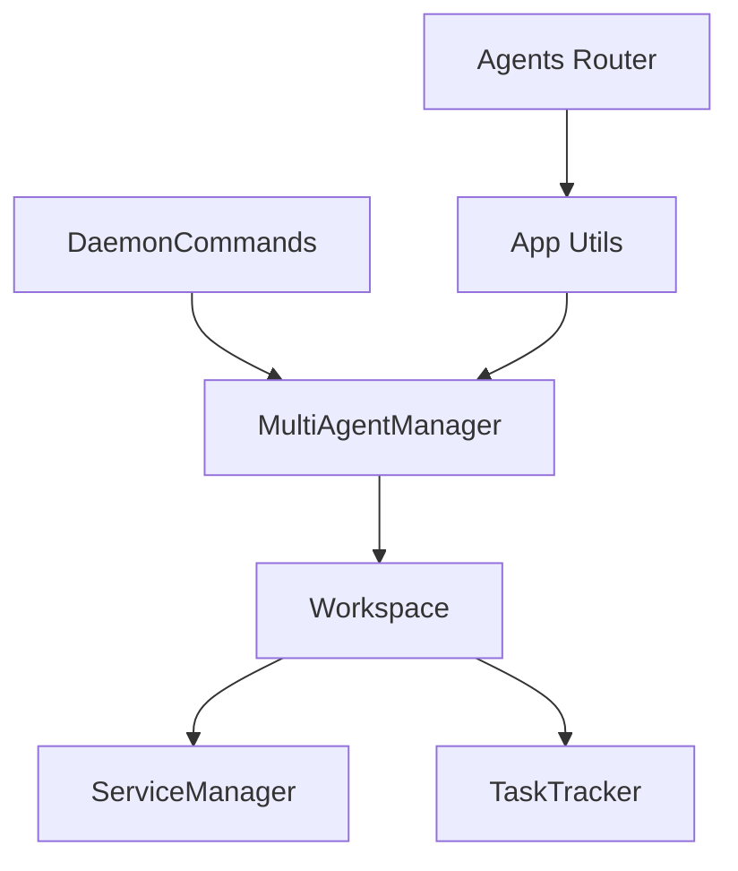

# 零停机热重载

<cite>
**本文引用的文件**
- [multi_agent_manager.py](file://src/copaw/app/multi_agent_manager.py)
- [workspace.py](file://src/copaw/app/workspace/workspace.py)
- [service_manager.py](file://src/copaw/app/workspace/service_manager.py)
- [task_tracker.py](file://src/copaw/app/runner/task_tracker.py)
- [daemon_commands.py](file://src/copaw/app/runner/daemon_commands.py)
- [agents.py](file://src/copaw/app/routers/agents.py)
- [utils.py](file://src/copaw/app/utils.py)
</cite>

## 目录
1. [简介](#简介)
2. [项目结构](#项目结构)
3. [核心组件](#核心组件)
4. [架构总览](#架构总览)
5. [详细组件分析](#详细组件分析)
6. [依赖分析](#依赖分析)
7. [性能考量](#性能考量)
8. [故障排除指南](#故障排除指南)
9. [结论](#结论)
10. [附录](#附录)

## 简介
本文件围绕 CoPaw 的零停机热重载机制展开，重点解释 reload_agent 方法的实现原理，涵盖以下关键点：
- 原子性交换：仅在极短时间持有锁，完成旧/新实例的替换
- 延迟清理：若存在活跃任务，后台等待完成后停止旧实例；否则立即停止
- 任务跟踪：通过 ActiveTaskTracker（TaskTracker）检测活跃任务并等待完成
- 新旧实例并行创建：实例创建与启动在无锁状态下进行，不影响其他代理
- 可复用组件：将旧实例中的可复用服务（如 MemoryManager、ChatManager）传递给新实例，避免重复初始化
- 触发入口：聊天指令 /daemon restart、CLI copaw daemon restart、HTTP 更新配置后自动触发

## 项目结构
与零停机热重载直接相关的代码主要分布在以下模块：
- 多代理管理器：负责实例的加载、替换、优雅停止与后台清理
- 工作空间：封装单个代理的完整运行时，包含服务注册、启动/停止与可复用组件传递
- 服务管理器：统一管理服务生命周期，支持可复用组件在重载时传递
- 任务跟踪器：跟踪活跃任务，提供“是否有活跃任务”“列出活跃任务”“等待全部完成”
- 命令与路由：提供 /daemon restart、HTTP 更新配置后的触发入口

**图表来源**
- [multi_agent_manager.py:17-462](file://src/copaw/app/multi_agent_manager.py#L17-L462)
- [workspace.py:47-389](file://src/copaw/app/workspace/workspace.py#L47-L389)
- [service_manager.py:74-421](file://src/copaw/app/workspace/service_manager.py#L74-L421)
- [task_tracker.py:30-231](file://src/copaw/app/runner/task_tracker.py#L30-L231)
- [daemon_commands.py:126-149](file://src/copaw/app/runner/daemon_commands.py#L126-L149)
- [agents.py:322-348](file://src/copaw/app/routers/agents.py#L322-L348)
- [utils.py:15-59](file://src/copaw/app/utils.py#L15-L59)

**章节来源**
- [multi_agent_manager.py:17-462](file://src/copaw/app/multi_agent_manager.py#L17-L462)
- [workspace.py:47-389](file://src/copaw/app/workspace/workspace.py#L47-L389)
- [service_manager.py:74-421](file://src/copaw/app/workspace/service_manager.py#L74-L421)
- [task_tracker.py:30-231](file://src/copaw/app/runner/task_tracker.py#L30-L231)
- [daemon_commands.py:126-149](file://src/copaw/app/runner/daemon_commands.py#L126-L149)
- [agents.py:322-348](file://src/copaw/app/routers/agents.py#L322-L348)
- [utils.py:15-59](file://src/copaw/app/utils.py#L15-L59)

## 核心组件
- MultiAgentManager.reload_agent：零停机重载的主入口，执行五步流程并协调后台清理
- Workspace：单个代理的独立运行时，包含服务注册、启动/停止与可复用组件传递
- ServiceManager：统一的服务生命周期管理，支持可复用组件在重载时传递
- TaskTracker：跟踪活跃任务，提供“是否有活跃任务”“列出活跃任务”“等待全部完成”的能力
- CLI 与 HTTP 路由：通过 /daemon restart 或 /agents/{agentId}/config 更新后触发重载

**章节来源**
- [multi_agent_manager.py:200-311](file://src/copaw/app/multi_agent_manager.py#L200-L311)
- [workspace.py:134-310](file://src/copaw/app/workspace/workspace.py#L134-L310)
- [service_manager.py:146-156](file://src/copaw/app/workspace/service_manager.py#L146-L156)
- [task_tracker.py:54-98](file://src/copaw/app/runner/task_tracker.py#L54-L98)
- [daemon_commands.py:126-149](file://src/copaw/app/runner/daemon_commands.py#L126-L149)
- [agents.py:247-258](file://src/copaw/app/routers/agents.py#L247-L258)

## 架构总览
零停机热重载的整体流程如下：
- 在无锁状态下创建并启动新 Workspace（耗时较长但不影响其他代理）
- 重新读取配置，确认目标代理存在
- 在短时加锁内完成旧/新实例替换，确保后续请求由新实例处理
- 优雅停止旧实例：若存在活跃任务，创建后台任务等待完成后停止；否则立即停止
- 后台清理：通过后台任务等待活跃任务完成，超时后强制停止，避免悬挂实例

**图表来源**
- [multi_agent_manager.py:200-311](file://src/copaw/app/multi_agent_manager.py#L200-L311)
- [multi_agent_manager.py:83-178](file://src/copaw/app/multi_agent_manager.py#L83-L178)
- [task_tracker.py:79-98](file://src/copaw/app/runner/task_tracker.py#L79-L98)

**章节来源**
- [multi_agent_manager.py:200-311](file://src/copaw/app/multi_agent_manager.py#L200-L311)
- [multi_agent_manager.py:83-178](file://src/copaw/app/multi_agent_manager.py#L83-L178)
- [task_tracker.py:54-98](file://src/copaw/app/runner/task_tracker.py#L54-L98)

## 详细组件分析

### reload_agent 方法设计与实现
设计理念
- 最小化阻塞：仅在“原子交换”阶段短暂持有锁，其余步骤均在无锁状态下进行
- 无缝切换：新实例启动成功后立即替换旧实例，新请求由新实例处理
- 可靠清理：若存在活跃任务，则后台等待完成后停止；否则立即停止
- 可复用组件：将旧实例中可复用的服务（如 MemoryManager、ChatManager）传递给新实例，避免重复初始化

五步流程详解
1) 实例创建：在无锁状态下创建并启动新 Workspace，耗时较长但不影响其他代理
2) 配置检查：重新读取配置，确认目标代理存在
3) 原子交换：在短时加锁内完成旧/新实例替换，确保后续请求由新实例处理
4) 优雅停止：根据活跃任务情况决定立即停止或后台延迟清理
5) 后台清理：通过后台任务等待活跃任务完成，超时后强制停止，避免悬挂实例

错误处理与回滚
- 新实例启动失败：记录异常并尝试停止新实例，保持旧实例继续服务
- 替换过程中实例被移除：停止新实例并返回失败
- 后台清理异常：记录警告，不影响新实例正常服务

**章节来源**
- [multi_agent_manager.py:200-311](file://src/copaw/app/multi_agent_manager.py#L200-L311)

### 任务跟踪器（TaskTracker）
关键方法
- has_active_tasks：遍历运行状态，判断是否存在未完成任务
- list_active_tasks：返回所有未完成任务的run_key列表
- wait_all_done：循环等待直至无活跃任务，支持超时
- attach/attach_or_start：为现有或新建run_key创建事件队列并回放缓冲
- request_stop：取消指定run_key对应的任务

实现要点
- 使用锁保护内部状态字典_runs
- 事件缓冲与多队列广播，满队列时自动清理死队列
- 异常时注入错误事件并关闭队列，最终清理运行项

**图表来源**
- [task_tracker.py:22-222](file://src/copaw/app/runner/task_tracker.py#L22-L222)

**章节来源**
- [task_tracker.py:54-123](file://src/copaw/app/runner/task_tracker.py#L54-L123)

### 活跃任务检测与延迟清理
活跃任务检测
- 通过 TaskTracker.has_active_tasks 判断是否存在未完成的任务
- 通过 TaskTracker.list_active_tasks 获取当前所有活跃任务键列表

延迟清理策略
- 若存在活跃任务：创建后台任务等待任务完成，最长等待约 1 分钟；若超时则记录警告并强制停止
- 若无活跃任务：立即停止旧实例

资源回收
- 旧实例停止时，非最终关闭（final=False）会跳过可复用组件的销毁，以便新实例复用
- 可复用组件由 ServiceManager 统一管理，确保在新旧实例间安全传递

**图表来源**
- [multi_agent_manager.py:83-178](file://src/copaw/app/multi_agent_manager.py#L83-L178)
- [task_tracker.py:79-98](file://src/copaw/app/runner/task_tracker.py#L79-L98)

**章节来源**
- [multi_agent_manager.py:83-178](file://src/copaw/app/multi_agent_manager.py#L83-L178)
- [task_tracker.py:54-98](file://src/copaw/app/runner/task_tracker.py#L54-L98)

### 可复用组件传递与新旧实例并行创建
可复用组件传递
- 在原子交换前，从旧实例的 ServiceManager 获取可复用组件（如 MemoryManager、ChatManager）
- 将这些组件设置到新实例中，避免重复初始化
- 新实例启动后，旧实例进入延迟清理或立即停止

新旧实例并行创建
- 实例创建与启动在无锁状态下进行，避免阻塞其他代理
- 通过并发启动多个代理，充分利用多核 CPU

**章节来源**
- [workspace.py:290-321](file://src/copaw/app/workspace/workspace.py#L290-L321)
- [service_manager.py:146-156](file://src/copaw/app/workspace/service_manager.py#L146-L156)
- [multi_agent_manager.py:257-273](file://src/copaw/app/multi_agent_manager.py#L257-L273)

### 触发入口与调用链
- 聊天中：/daemon restart
- 终端：copaw daemon restart
- HTTP：/agents/{agentId}/config 更新后自动触发

**图表来源**
- [agents.py:322-348](file://src/copaw/app/routers/agents.py#L322-L348)
- [utils.py:15-59](file://src/copaw/app/utils.py#L15-L59)
- [daemon_commands.py:126-149](file://src/copaw/app/runner/daemon_commands.py#L126-L149)

**章节来源**
- [agents.py:322-348](file://src/copaw/app/routers/agents.py#L322-L348)
- [utils.py:15-59](file://src/copaw/app/utils.py#L15-L59)
- [daemon_commands.py:126-149](file://src/copaw/app/runner/daemon_commands.py#L126-L149)

## 依赖分析
- MultiAgentManager 依赖 Workspace 以管理实例生命周期
- Workspace 通过 ServiceManager 统一管理服务的启动/停止与可复用组件传递
- Workspace 通过 TaskTracker 跟踪活跃任务，支撑零停机重载的延迟清理
- 触发入口（/daemon restart、HTTP 更新配置）通过 MultiAgentManager.reload_agent 执行重载

**图表来源**
- [multi_agent_manager.py:17-462](file://src/copaw/app/multi_agent_manager.py#L17-L462)
- [workspace.py:47-389](file://src/copaw/app/workspace/workspace.py#L47-L389)
- [service_manager.py:74-421](file://src/copaw/app/workspace/service_manager.py#L74-L421)
- [task_tracker.py:30-231](file://src/copaw/app/runner/task_tracker.py#L30-L231)
- [daemon_commands.py:126-149](file://src/copaw/app/runner/daemon_commands.py#L126-L149)
- [agents.py:322-348](file://src/copaw/app/routers/agents.py#L322-L348)
- [utils.py:15-59](file://src/copaw/app/utils.py#L15-L59)

**章节来源**
- [multi_agent_manager.py:17-462](file://src/copaw/app/multi_agent_manager.py#L17-L462)
- [workspace.py:47-389](file://src/copaw/app/workspace/workspace.py#L47-L389)
- [service_manager.py:74-421](file://src/copaw/app/workspace/service_manager.py#L74-L421)
- [task_tracker.py:30-231](file://src/copaw/app/runner/task_tracker.py#L30-L231)
- [daemon_commands.py:126-149](file://src/copaw/app/runner/daemon_commands.py#L126-L149)
- [agents.py:322-348](file://src/copaw/app/routers/agents.py#L322-L348)
- [utils.py:15-59](file://src/copaw/app/utils.py#L15-L59)

## 性能考量
- 并发与无锁操作：实例创建与启动在无锁状态下进行，避免阻塞其他代理
- 最小锁持有时间：原子交换仅在短时加锁内完成，降低竞争开销
- 可复用组件：减少重复初始化成本，提升重载速度
- 后台清理：避免主线程等待，提高响应性
- 超时控制：等待活跃任务完成最多约 1 分钟，超时后强制停止，防止长时间挂起

## 故障排除指南
- 新实例启动失败
  - 现象：日志记录启动异常，旧实例继续服务
  - 排查：检查配置文件、模型后端状态、磁盘空间与权限
  - 处理：修复问题后再次触发重载
- 原子交换失败
  - 现象：替换过程中实例被移除，新实例停止
  - 排查：确认代理 ID 正确且未被并发删除
  - 处理：重试重载或等待下一次请求触发加载
- 后台清理异常
  - 现象：延迟清理任务出现警告，不影响新实例
  - 排查：查看任务跟踪器状态与活跃任务列表
  - 处理：等待清理任务完成或强制取消并重启
- 超时未完成
  - 现象：等待活跃任务完成超时，记录警告并强制停止
  - 排查：检查长连接、SSE/流式任务是否正常结束
  - 处理：优化任务结束逻辑或调整超时策略

**章节来源**
- [multi_agent_manager.py:274-288](file://src/copaw/app/multi_agent_manager.py#L274-L288)
- [multi_agent_manager.py:111-135](file://src/copaw/app/multi_agent_manager.py#L111-L135)
- [task_tracker.py:79-98](file://src/copaw/app/runner/task_tracker.py#L79-L98)

## 结论
CoPaw 的零停机重载通过“无锁实例创建 + 最小锁原子交换 + 后台延迟清理”的组合，实现了高可用、低干扰的代理重载。配合可复用组件传递与完善的错误处理，能够在不中断用户会话与后台任务的前提下，平滑地应用配置更新、模型热替换与技能重载等运维需求。

## 附录
- 触发方式
  - 聊天中：/daemon restart
  - 终端：copaw daemon restart
  - HTTP：/agents/{agentId}/config 更新后自动触发
- 关键路径参考
  - [reload_agent 主流程:200-311](file://src/copaw/app/multi_agent_manager.py#L200-L311)
  - [后台清理与超时控制:83-178](file://src/copaw/app/multi_agent_manager.py#L83-L178)
  - [活跃任务检测:54-98](file://src/copaw/app/runner/task_tracker.py#L54-L98)
  - [可复用组件传递:279-310](file://src/copaw/app/workspace/workspace.py#L279-L310)
  - [CLI 触发入口:126-149](file://src/copaw/app/runner/daemon_commands.py#L126-L149)
  - [HTTP 触发入口:247-258](file://src/copaw/app/routers/agents.py#L247-L258)