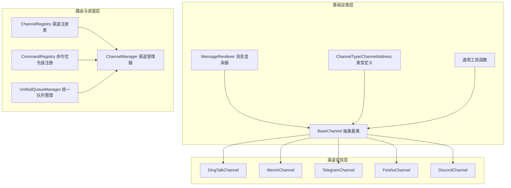
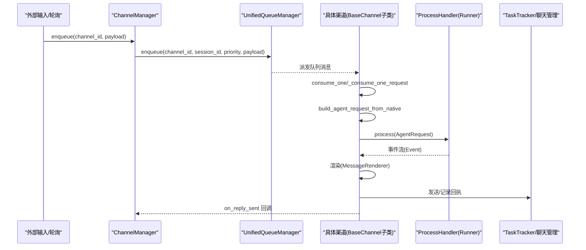
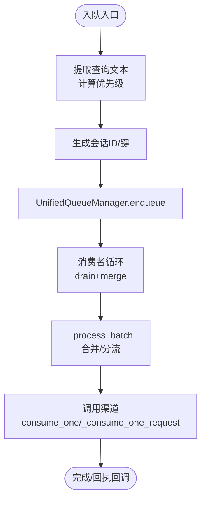
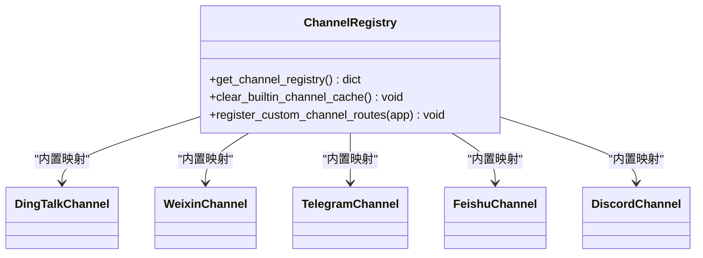
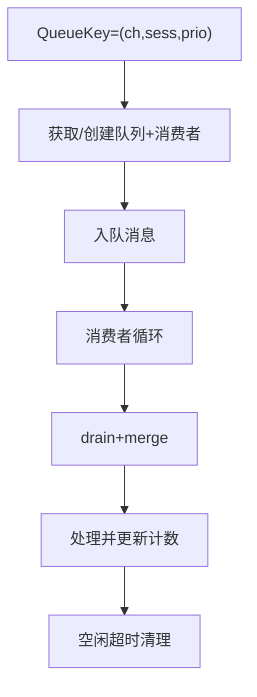
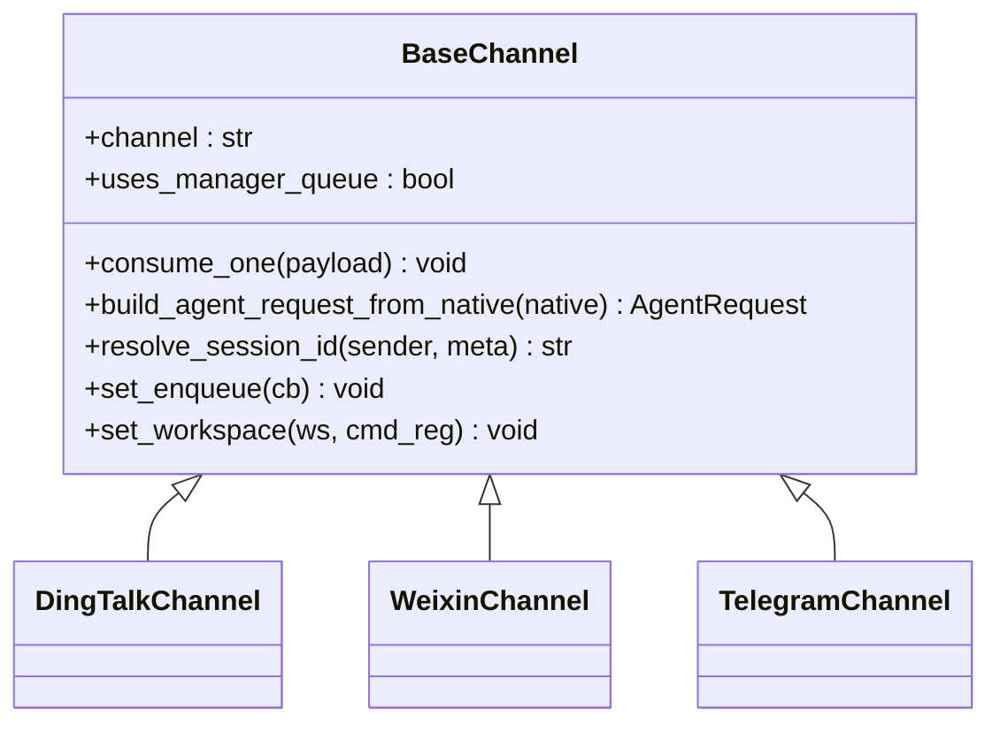
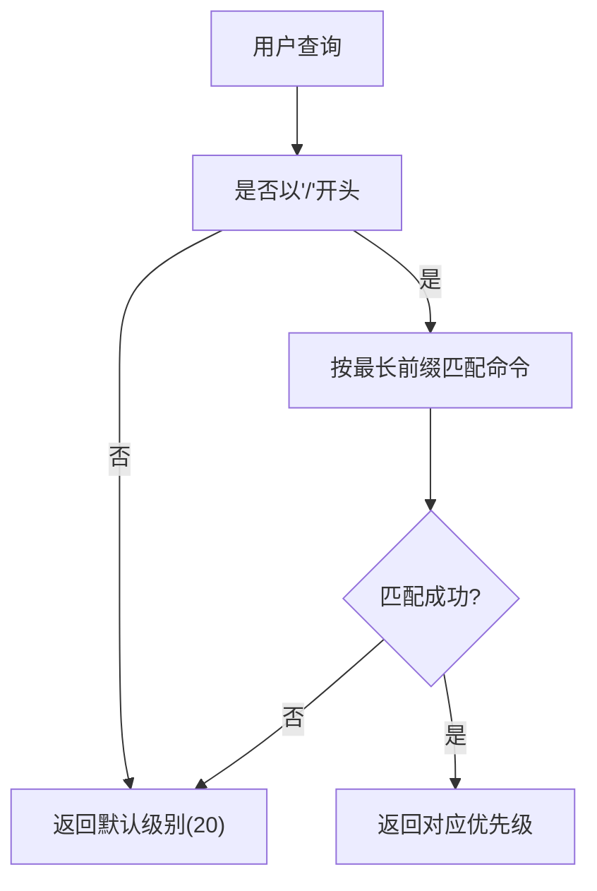
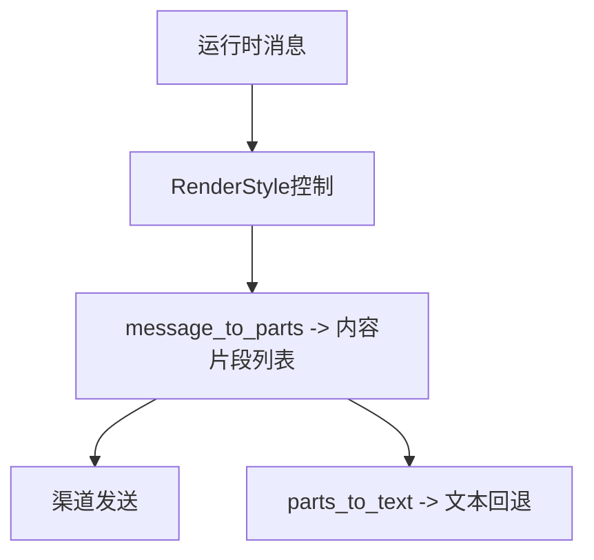
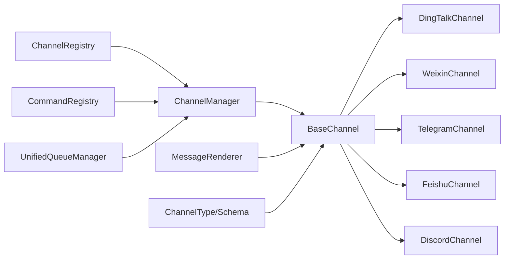

# 多渠道通信系统

<cite>
**本文引用的文件**
- [base.py](file://copaw/src/copaw/app/channels/base.py)
- [manager.py](file://copaw/src/copaw/app/channels/manager.py)
- [registry.py](file://copaw/src/copaw/app/channels/registry.py)
- [schema.py](file://copaw/src/copaw/app/channels/schema.py)
- [unified_queue_manager.py](file://copaw/src/copaw/app/channels/unified_queue_manager.py)
- [command_registry.py](file://copaw/src/copaw/app/channels/command_registry.py)
- [renderer.py](file://copaw/src/copaw/app/channels/renderer.py)
- [utils.py](file://copaw/src/copaw/app/channels/utils.py)
- [dingtalk/channel.py](file://copaw/src/copaw/app/channels/dingtalk/channel.py)
- [telegram/channel.py](file://copaw/src/copaw/app/channels/telegram/channel.py)
- [weixin/channel.py](file://copaw/src/copaw/app/channels/weixin/channel.py)
</cite>

## 目录
1. [简介](#简介)
2. [项目结构](#项目结构)
3. [核心组件](#核心组件)
4. [架构总览](#架构总览)
5. [详细组件分析](#详细组件分析)
6. [依赖分析](#依赖分析)
7. [性能考虑](#性能考虑)
8. [故障排查指南](#故障排查指南)
9. [结论](#结论)
10. [附录](#附录)

## 简介
本技术文档面向多渠道通信系统，聚焦于ChannelManager渠道管理器的架构设计与消息路由机制，深入解析ChannelRegistry渠道注册表的自定义渠道注册与管理流程，阐述BaseChannel抽象基类的设计模式及各具体渠道（如DingTalk、WeChat、Telegram、Discord等）的实现差异。文档还覆盖消息格式标准化、会话管理、异步消息处理、渠道开发指南（新增渠道的添加流程、消息格式规范与测试方法）、渠道配置与认证、以及错误处理最佳实践。

## 项目结构
多渠道通信系统位于 copaw/src/copaw/app/channels 目录下，采用“按功能域分层 + 渠道插件化”的组织方式：
- 基础设施层：抽象基类、统一队列管理、命令优先级注册、消息渲染器、通用工具
- 路由与调度层：ChannelManager、ChannelRegistry、CommandRegistry
- 渠道实现层：各平台渠道的具体实现（如钉钉、微信、电报、飞书等）

图表来源
- [registry.py:1-194](file://copaw/src/copaw/app/channels/registry.py#L1-L194)
- [manager.py:68-106](file://copaw/src/copaw/app/channels/manager.py#L68-L106)
- [unified_queue_manager.py:60-118](file://copaw/src/copaw/app/channels/unified_queue_manager.py#L60-L118)
- [base.py:70-127](file://copaw/src/copaw/app/channels/base.py#L70-L127)
- [renderer.py:78-86](file://copaw/src/copaw/app/channels/renderer.py#L78-L86)
- [schema.py:12-48](file://copaw/src/copaw/app/channels/schema.py#L12-L48)

章节来源
- [registry.py:1-194](file://copaw/src/copaw/app/channels/registry.py#L1-L194)
- [manager.py:68-106](file://copaw/src/copaw/app/channels/manager.py#L68-L106)
- [unified_queue_manager.py:60-118](file://copaw/src/copaw/app/channels/unified_queue_manager.py#L60-L118)
- [base.py:70-127](file://copaw/src/copaw/app/channels/base.py#L70-L127)
- [renderer.py:78-86](file://copaw/src/copaw/app/channels/renderer.py#L78-L86)
- [schema.py:12-48](file://copaw/src/copaw/app/channels/schema.py#L12-L48)

## 核心组件
- BaseChannel 抽象基类：定义渠道通用行为（消息构建、去抖合并、会话解析、事件流发送、工作区注入等），为所有具体渠道提供统一接口与默认实现。
- ChannelManager 渠道管理器：负责渠道实例化、统一入队与消费、任务跟踪、控制命令识别、发送文本/事件等。
- ChannelRegistry 渠道注册表：内置渠道映射与自定义渠道发现，支持从工作目录动态加载自定义渠道。
- UnifiedQueueManager 统一队列管理：基于三元键（渠道、会话、优先级）的动态队列与消费者模型，支持并发隔离与空闲清理。
- CommandRegistry 命令优先级注册：将控制命令映射到优先级级别，用于消息路由与批处理策略。
- MessageRenderer 消息渲染器：将运行时消息转换为可发送的内容片段，支持Markdown、代码块、表情等风格控制。
- 渠道实现：如钉钉、微信、电报等，各自实现native消息解析、AgentRequest构建、内容发送与回执回调。

章节来源
- [base.py:70-127](file://copaw/src/copaw/app/channels/base.py#L70-L127)
- [manager.py:68-106](file://copaw/src/copaw/app/channels/manager.py#L68-L106)
- [registry.py:189-194](file://copaw/src/copaw/app/channels/registry.py#L189-L194)
- [unified_queue_manager.py:60-118](file://copaw/src/copaw/app/channels/unified_queue_manager.py#L60-L118)
- [command_registry.py:23-62](file://copaw/src/copaw/app/channels/command_registry.py#L23-L62)
- [renderer.py:78-86](file://copaw/src/copaw/app/channels/renderer.py#L78-L86)

## 架构总览
系统采用“统一队列 + 动态消费者 + 控制命令优先级”的异步消息处理架构。ChannelManager通过ChannelRegistry加载可用渠道，并为每个渠道注入统一的ProcessHandler与回调；消息经由UnifiedQueueManager按（渠道、会话、优先级）进行隔离与批处理；BaseChannel在消费路径中负责将native消息转为AgentRequest，调用process生成事件流，再通过MessageRenderer渲染并发送。

图表来源
- [manager.py:350-361](file://copaw/src/copaw/app/channels/manager.py#L350-L361)
- [unified_queue_manager.py:119-164](file://copaw/src/copaw/app/channels/unified_queue_manager.py#L119-L164)
- [base.py:659-758](file://copaw/src/copaw/app/channels/base.py#L659-L758)
- [base.py:431-536](file://copaw/src/copaw/app/channels/base.py#L431-L536)

## 详细组件分析

### ChannelManager 渠道管理器
职责与特性：
- 从环境或配置创建渠道实例，注入统一的ProcessHandler与回调
- 提供统一入队接口，按查询内容提取优先级并路由至UnifiedQueueManager
- 支持工作区注入、替换单个渠道、发送文本/事件等
- 启动/停止所有渠道与队列管理器，保证优雅关闭

关键流程：
- 入队与路由：根据payload提取查询文本，计算优先级，结合渠道与会话ID入队
- 批量合并：同一队列内同键消息批量取出并合并（native或request）
- 消费与处理：调用具体渠道的consume_one/_consume_one_request，执行去抖、命令检测、任务跟踪与事件流发送

图表来源
- [manager.py:282-301](file://copaw/src/copaw/app/channels/manager.py#L282-L301)
- [manager.py:39-66](file://copaw/src/copaw/app/channels/manager.py#L39-L66)
- [manager.py:362-446](file://copaw/src/copaw/app/channels/manager.py#L362-L446)

章节来源
- [manager.py:68-106](file://copaw/src/copaw/app/channels/manager.py#L68-L106)
- [manager.py:215-301](file://copaw/src/copaw/app/channels/manager.py#L215-L301)
- [manager.py:362-446](file://copaw/src/copaw/app/channels/manager.py#L362-L446)
- [manager.py:447-526](file://copaw/src/copaw/app/channels/manager.py#L447-L526)

### ChannelRegistry 渠道注册表
职责与特性：
- 内置渠道映射（如钉钉、飞书、电报、微信、Discord等）
- 自定义渠道扫描：从工作目录动态导入，自动注册
- 缓存与线程安全：内置缓存避免重复加载
- 自定义路由钩子：允许自定义渠道挂载API路由（需以/api/前缀）

图表来源
- [registry.py:189-194](file://copaw/src/copaw/app/channels/registry.py#L189-L194)
- [registry.py:44-77](file://copaw/src/copaw/app/channels/registry.py#L44-L77)
- [registry.py:96-128](file://copaw/src/copaw/app/channels/registry.py#L96-L128)

章节来源
- [registry.py:189-194](file://copaw/src/copaw/app/channels/registry.py#L189-L194)
- [registry.py:44-77](file://copaw/src/copaw/app/channels/registry.py#L44-L77)
- [registry.py:96-128](file://copaw/src/copaw/app/channels/registry.py#L96-L128)

### UnifiedQueueManager 统一队列管理
职责与特性：
- 三元键隔离：(channel_id, session_id, priority_level)
- 动态消费者：首次入队时创建消费者任务，空闲超时自动清理
- 批量处理：同队列内消息drain后合并（native或request）
- 指标监控：提供队列数量、大小、处理计数等指标

图表来源
- [unified_queue_manager.py:119-164](file://copaw/src/copaw/app/channels/unified_queue_manager.py#L119-L164)
- [unified_queue_manager.py:165-213](file://copaw/src/copaw/app/channels/unified_queue_manager.py#L165-L213)
- [unified_queue_manager.py:274-428](file://copaw/src/copaw/app/channels/unified_queue_manager.py#L274-L428)

章节来源
- [unified_queue_manager.py:60-118](file://copaw/src/copaw/app/channels/unified_queue_manager.py#L60-L118)
- [unified_queue_manager.py:119-164](file://copaw/src/copaw/app/channels/unified_queue_manager.py#L119-L164)
- [unified_queue_manager.py:274-428](file://copaw/src/copaw/app/channels/unified_queue_manager.py#L274-L428)

### BaseChannel 抽象基类
职责与特性：
- 统一的消息构建：从native payload构建AgentRequest，支持内容类型（文本、图片、音频、视频、文件、拒绝）
- 会话管理：默认session_id为“渠道:用户ID”，可被子类重写
- 去抖与合并：对无文本内容进行缓冲合并，支持时间去抖（如钉钉）
- 事件流与回执：封装事件流发送、错误处理、on_reply_sent回调
- 工作区注入：注入TaskTracker与聊天管理器，支持取消与会话创建
- 渲染器：使用MessageRenderer将消息转换为可发送内容片段

图表来源
- [base.py:70-127](file://copaw/src/copaw/app/channels/base.py#L70-L127)
- [base.py:557-567](file://copaw/src/copaw/app/channels/base.py#L557-L567)
- [base.py:604-618](file://copaw/src/copaw/app/channels/base.py#L604-L618)
- [dingtalk/channel.py:89-200](file://copaw/src/copaw/app/channels/dingtalk/channel.py#L89-L200)
- [weixin/channel.py:59-200](file://copaw/src/copaw/app/channels/weixin/channel.py#L59-L200)
- [telegram/channel.py:1-200](file://copaw/src/copaw/app/channels/telegram/channel.py#L1-L200)

章节来源
- [base.py:70-127](file://copaw/src/copaw/app/channels/base.py#L70-L127)
- [base.py:557-567](file://copaw/src/copaw/app/channels/base.py#L557-L567)
- [base.py:604-618](file://copaw/src/copaw/app/channels/base.py#L604-L618)
- [base.py:659-758](file://copaw/src/copaw/app/channels/base.py#L659-L758)
- [base.py:431-536](file://copaw/src/copaw/app/channels/base.py#L431-L536)

### CommandRegistry 命令优先级注册
职责与特性：
- 将控制命令（如/stop、/status、/restart等）映射到优先级级别（0/10/20/30）
- 支持直接指定数字级别，便于扩展
- 查询匹配：按最长前缀匹配，区分空格/换行边界

图表来源
- [command_registry.py:136-174](file://copaw/src/copaw/app/channels/command_registry.py#L136-L174)
- [command_registry.py:175-218](file://copaw/src/copaw/app/channels/command_registry.py#L175-L218)

章节来源
- [command_registry.py:23-62](file://copaw/src/copaw/app/channels/command_registry.py#L23-L62)
- [command_registry.py:136-174](file://copaw/src/copaw/app/channels/command_registry.py#L136-L174)
- [command_registry.py:175-218](file://copaw/src/copaw/app/channels/command_registry.py#L175-L218)

### MessageRenderer 消息渲染器
职责与特性：
- 将运行时消息（含工具调用、输出、思维过程等）转换为可发送的内容片段（Text/Image/Video/Audio/File/Refusal）
- 支持过滤思维、工具细节显示、代码块与Markdown风格
- 提供parts到纯文本的回退拼接

图表来源
- [renderer.py:78-86](file://copaw/src/copaw/app/channels/renderer.py#L78-L86)
- [renderer.py:87-351](file://copaw/src/copaw/app/channels/renderer.py#L87-L351)
- [renderer.py:352-384](file://copaw/src/copaw/app/channels/renderer.py#L352-L384)

章节来源
- [renderer.py:78-86](file://copaw/src/copaw/app/channels/renderer.py#L78-L86)
- [renderer.py:87-351](file://copaw/src/copaw/app/channels/renderer.py#L87-L351)
- [renderer.py:352-384](file://copaw/src/copaw/app/channels/renderer.py#L352-L384)

### 支持的通信渠道类型与集成方式
- 钉钉（DingTalk）：基于钉钉Stream回调，支持AI卡片与会话Webhook；默认禁用时间去抖，合并由管理器完成；支持主动发送（sessionWebhook）
- 微信（WeChat iLink Bot）：HTTP长轮询接收，支持文本、图片、语音（ASR）、文件；带上下文令牌去重与打字指示
- 电报（Telegram）：Bot API轮询；支持媒体上传限制、文件下载与远程URL解析；HTML样式适配
- 飞书（Feishu）：作为内置渠道之一，遵循统一抽象与消息格式
- Discord：作为内置渠道之一，遵循统一抽象与消息格式

章节来源
- [dingtalk/channel.py:89-200](file://copaw/src/copaw/app/channels/dingtalk/channel.py#L89-L200)
- [weixin/channel.py:59-200](file://copaw/src/copaw/app/channels/weixin/channel.py#L59-L200)
- [telegram/channel.py:1-200](file://copaw/src/copaw/app/channels/telegram/channel.py#L1-L200)
- [registry.py:20-35](file://copaw/src/copaw/app/channels/registry.py#L20-L35)

## 依赖分析
- ChannelManager 依赖 ChannelRegistry（渠道发现）、CommandRegistry（优先级）、UnifiedQueueManager（队列与消费者）
- BaseChannel 依赖 MessageRenderer、ChannelType/Schema、ProcessHandler
- 各渠道实现继承 BaseChannel 并覆盖native解析与发送逻辑
- UnifiedQueueManager 仅依赖消费者函数签名与队列状态，解耦具体渠道

图表来源
- [manager.py:21-25](file://copaw/src/copaw/app/channels/manager.py#L21-L25)
- [registry.py:189-194](file://copaw/src/copaw/app/channels/registry.py#L189-L194)
- [unified_queue_manager.py:60-118](file://copaw/src/copaw/app/channels/unified_queue_manager.py#L60-L118)
- [base.py:36-38](file://copaw/src/copaw/app/channels/base.py#L36-L38)
- [schema.py:12-48](file://copaw/src/copaw/app/channels/schema.py#L12-L48)

章节来源
- [manager.py:21-25](file://copaw/src/copaw/app/channels/manager.py#L21-L25)
- [registry.py:189-194](file://copaw/src/copaw/app/channels/registry.py#L189-L194)
- [unified_queue_manager.py:60-118](file://copaw/src/copaw/app/channels/unified_queue_manager.py#L60-L118)
- [base.py:36-38](file://copaw/src/copaw/app/channels/base.py#L36-L38)
- [schema.py:12-48](file://copaw/src/copaw/app/channels/schema.py#L12-L48)

## 性能考虑
- 动态消费者与空闲清理：避免固定worker池带来的资源浪费，空闲队列自动清理降低内存占用
- 批量合并：同一会话与优先级内的消息drain后合并，减少渠道往返次数
- 时间去抖：对无文本内容进行缓冲合并，降低平台限流与重复渲染开销（部分渠道启用）
- 任务跟踪：通过TaskTracker与聊天管理器，支持取消与幂等处理
- 文本拆分：渲染器与工具函数支持大文本分片，避免平台长度限制

## 故障排查指南
常见问题与定位建议：
- 渠道未启动或不可用：检查ChannelRegistry内置映射与自定义渠道导入日志；确认环境变量或配置项
- 消息未入队/未消费：检查ChannelManager.enqueue调用与UnifiedQueueManager队列状态；查看清理日志
- 会话错乱或重复：核对resolve_session_id与去抖键生成；确保会话ID规范化
- 渲染异常或内容缺失：检查MessageRenderer的RenderStyle配置与内容类型映射
- 错误处理：BaseChannel在事件流中捕获异常并触发错误回调，同时记录详细日志

章节来源
- [registry.py:62-76](file://copaw/src/copaw/app/channels/registry.py#L62-L76)
- [manager.py:349-361](file://copaw/src/copaw/app/channels/manager.py#L349-L361)
- [unified_queue_manager.py:376-428](file://copaw/src/copaw/app/channels/unified_queue_manager.py#L376-L428)
- [base.py:431-536](file://copaw/src/copaw/app/channels/base.py#L431-L536)

## 结论
该多渠道通信系统通过统一的抽象基类、注册表、队列管理与命令优先级机制，实现了跨平台渠道的一致性接入与高并发处理。BaseChannel将各渠道的native消息标准化为运行时消息，配合MessageRenderer与统一的事件流发送，既保证了消息格式一致性，又保留了各渠道的差异化能力。通过动态队列与消费者模型，系统具备良好的扩展性与资源利用率。

## 附录

### 渠道开发指南（新增渠道）
- 步骤
  1) 在自定义渠道目录中创建模块，定义继承BaseChannel的类，实现以下方法：
     - from_env 或 from_config：从环境/配置构造渠道实例
     - build_agent_request_from_native：解析native payload为AgentRequest
     - 可选：consume_one/_consume_one_request（若需要自定义消费流程）
  2) 在渠道模块中导出类名，确保ChannelRegistry可发现
  3) 在配置中启用该渠道并填写必要参数
  4) 使用ChannelManager.from_config或from_env加载渠道
- 消息格式规范
  - 输入：native payload（字典或对象）包含sender_id、content_parts、meta等
  - 输出：AgentRequest（包含session_id、user_id、input、channel等）
  - 发送：使用MessageRenderer将消息转换为内容片段，再调用渠道发送接口
- 测试方法
  - 单元测试：模拟native payload，断言AgentRequest构建与发送流程
  - 集成测试：通过ChannelManager入队并观察队列与消费者行为
  - 场景测试：验证去抖、批处理、会话管理与错误回调

章节来源
- [registry.py:96-128](file://copaw/src/copaw/app/channels/registry.py#L96-L128)
- [base.py:604-618](file://copaw/src/copaw/app/channels/base.py#L604-L618)
- [manager.py:108-213](file://copaw/src/copaw/app/channels/manager.py#L108-L213)

### 渠道配置、认证与最佳实践
- 渠道配置
  - 内置渠道：通过配置对象中的渠道字段启用与参数设置
  - 自定义渠道：放置于工作目录，ChannelRegistry自动发现
- 认证与凭据
  - 钉钉：client_id/client_secret、机器人编码、卡片模板等
  - 电报：Bot Token、文件上传大小限制、远程URL解析
  - 微信：bot_token或QR登录持久化文件、上下文令牌
- 最佳实践
  - 明确会话ID规则，避免跨渠道冲突
  - 合理设置去抖与批处理策略，平衡实时性与平台限制
  - 使用RenderStyle控制工具细节与思维过滤，提升用户体验
  - 对媒体文件进行本地缓存与清理，避免重复下载
  - 为控制命令设置合理优先级，保障紧急指令的快速响应

章节来源
- [dingtalk/channel.py:113-200](file://copaw/src/copaw/app/channels/dingtalk/channel.py#L113-L200)
- [telegram/channel.py:140-200](file://copaw/src/copaw/app/channels/telegram/channel.py#L140-L200)
- [weixin/channel.py:69-200](file://copaw/src/copaw/app/channels/weixin/channel.py#L69-L200)
- [command_registry.py:23-62](file://copaw/src/copaw/app/channels/command_registry.py#L23-L62)
- [renderer.py:38-48](file://copaw/src/copaw/app/channels/renderer.py#L38-L48)