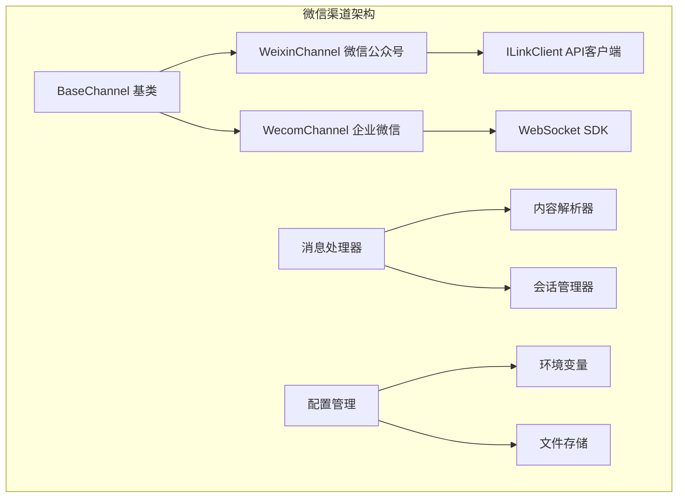
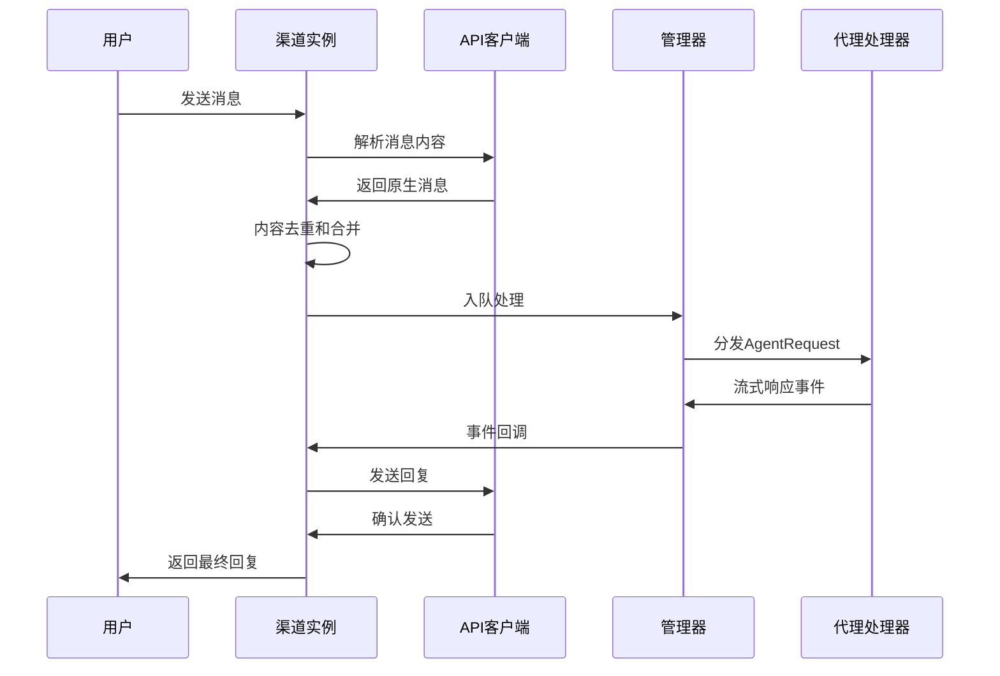
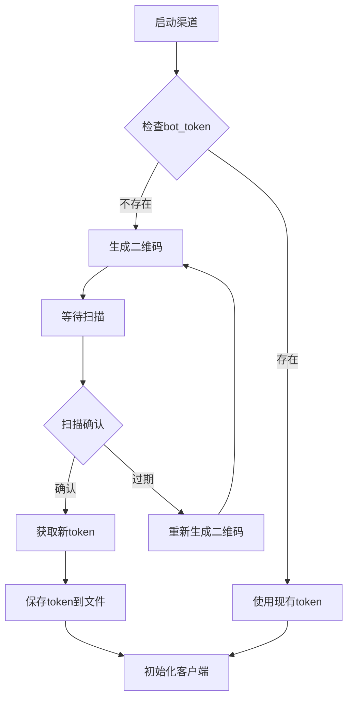
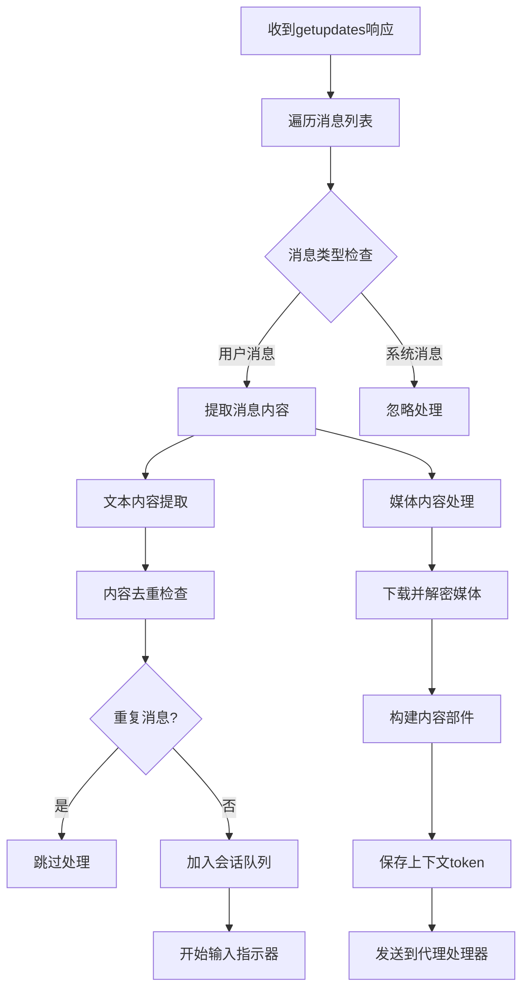
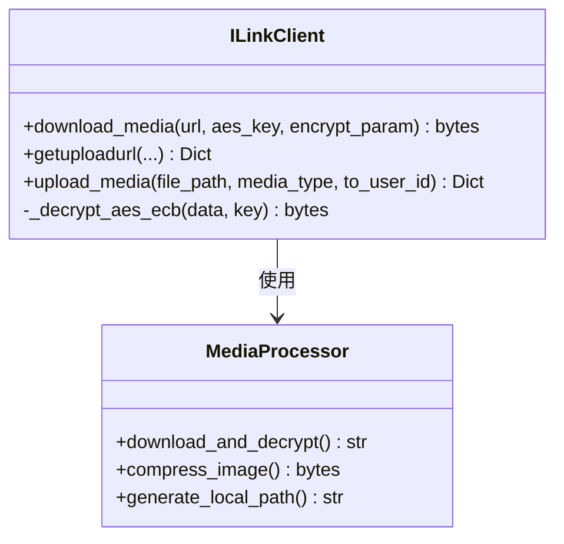
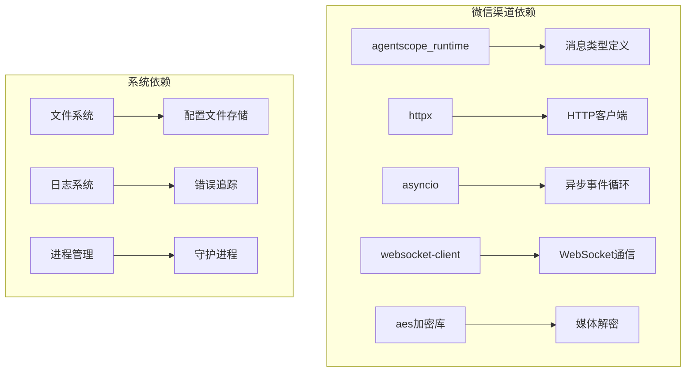

# 微信(WeChat)渠道

<cite>
**本文档引用的文件**
- [weixin/channel.py](file://copaw/src/copaw/app/channels/weixin/channel.py)
- [weixin/client.py](file://copaw/src/copaw/app/channels/weixin/client.py)
- [wecom/channel.py](file://copaw/src/copaw/app/channels/wecom/channel.py)
- [base.py](file://copaw/src/copaw/app/channels/base.py)
- [channel.ts](file://copaw/console/src/api/modules/channel.ts)
- [ChannelDrawer.tsx](file://copaw/console/src/pages/Control/Channels/components/ChannelDrawer.tsx)
- [README.md](file://copaw/README.md)
- [其他平台集成.md](file://specs/copaw-repowiki/content/核心功能/聊天渠道系统/其他平台集成.md)
</cite>

## 目录
1. [简介](#简介)
2. [项目结构](#项目结构)
3. [核心组件](#核心组件)
4. [架构概览](#架构概览)
5. [详细组件分析](#详细组件分析)
6. [依赖关系分析](#依赖关系分析)
7. [性能考虑](#性能考虑)
8. [故障排除指南](#故障排除指南)
9. [结论](#结论)

## 简介

本文档详细介绍了微信(WeChat)渠道的实现，包括微信公众号(iLink Bot)和企业微信(WeCom)两个主要集成方案。该系统提供了完整的消息接收处理、微信API调用和用户会话管理功能。

微信渠道支持多种消息类型，包括文本、图片、语音、视频和文件，并提供了完善的认证流程、消息加解密和服务器验证机制。系统还集成了客服接口，支持自动回复配置和人工客服转接。

## 项目结构

微信渠道的实现采用分层架构设计，主要包含以下核心模块：

**图表来源**
- [base.py:70-120](file://copaw/src/copaw/app/channels/base.py#L70-L120)
- [weixin/channel.py:59-140](file://copaw/src/copaw/app/channels/weixin/channel.py#L59-L140)
- [wecom/channel.py:69-120](file://copaw/src/copaw/app/channels/wecom/channel.py#L69-L120)

**章节来源**
- [base.py:1-800](file://copaw/src/copaw/app/channels/base.py#L1-L800)
- [weixin/channel.py:1-800](file://copaw/src/copaw/app/channels/weixin/channel.py#L1-L800)
- [wecom/channel.py:1-800](file://copaw/src/copaw/app/channels/wecom/channel.py#L1-L800)

## 核心组件

### 基础通道类(BaseChannel)

BaseChannel作为所有渠道的抽象基类，提供了统一的消息处理框架：

- **消息处理管道**: 统一的AgentRequest/AgentResponse处理流程
- **会话管理**: 基于session_id的会话状态管理
- **内容解析**: 将原生消息转换为运行时内容类型
- **队列管理**: 通过ChannelManager进行消息队列处理
- **策略控制**: 支持开放、白名单等多种访问策略

### 微信公众号通道(WeixinChannel)

WeixinChannel专门处理微信个人号Bot的iLink API：

- **长轮询接收**: 使用getupdates API进行消息拉取
- **多类型支持**: 文本、图片、语音、文件、视频消息处理
- **媒体下载**: 支持CDN媒体文件的下载和AES-128-ECB解密
- **会话标识**: 私聊使用"weixin:用户ID"，群聊使用"group:"前缀
- **去重机制**: 基于context_token的消息去重

### 企业微信通道(WecomChannel)

WecomChannel使用aibot WebSocket SDK处理企业微信AI Bot：

- **WebSocket连接**: 实时双向通信
- **流式回复**: 支持消息流式回复
- **媒体上传**: 通过WebSocket进行媒体文件分块上传
- **欢迎语**: 支持enter_chat事件的欢迎消息
- **去重处理**: 基于消息ID的重复消息过滤

**章节来源**
- [base.py:70-800](file://copaw/src/copaw/app/channels/base.py#L70-L800)
- [weixin/channel.py:59-800](file://copaw/src/copaw/app/channels/weixin/channel.py#L59-L800)
- [wecom/channel.py:69-800](file://copaw/src/copaw/app/channels/wecom/channel.py#L69-L800)

## 架构概览

微信渠道的整体架构采用异步事件驱动模式：

**图表来源**
- [weixin/channel.py:442-485](file://copaw/src/copaw/app/channels/weixin/channel.py#L442-L485)
- [base.py:431-535](file://copaw/src/copaw/app/channels/base.py#L431-L535)

系统的关键特性包括：

- **异步处理**: 所有I/O操作都采用async/await模式
- **事件驱动**: 基于事件循环的消息处理架构
- **错误恢复**: 完善的异常处理和重试机制
- **资源管理**: 自动化的客户端生命周期管理

## 详细组件分析

### 认证流程

微信渠道实现了两种主要的认证方式：

#### 二维码登录流程

**图表来源**
- [weixin/channel.py:370-410](file://copaw/src/copaw/app/channels/weixin/channel.py#L370-L410)
- [weixin/client.py:118-175](file://copaw/src/copaw/app/channels/weixin/client.py#L118-L175)

#### 企业微信认证流程

企业微信使用WebSocket SDK，通过bot_id和secret进行认证：

- **连接建立**: 建立WebSocket连接
- **身份验证**: 使用bot_id和secret进行身份验证
- **会话保持**: 维护长连接状态
- **自动重连**: 断线自动重连机制

**章节来源**
- [weixin/channel.py:370-410](file://copaw/src/copaw/app/channels/weixin/channel.py#L370-L410)
- [wecom/channel.py:132-194](file://copaw/src/copaw/app/channels/wecom/channel.py#L132-L194)

### 消息处理流程

#### 微信公众号消息处理

**图表来源**
- [weixin/channel.py:490-763](file://copaw/src/copaw/app/channels/weixin/channel.py#L490-L763)

#### 企业微信消息处理

企业微信的消息处理更加复杂，支持多种消息类型：

- **文本消息**: 直接提取内容
- **图片消息**: 下载并解密，保存到本地
- **语音消息**: 使用ASR文本内容
- **文件消息**: 下载并解密，支持大文件分块
- **视频消息**: 下载并解密，支持压缩优化
- **混合消息**: 组合多种内容类型的复合消息

**章节来源**
- [weixin/channel.py:518-763](file://copaw/src/copaw/app/channels/weixin/channel.py#L518-L763)
- [wecom/channel.py:316-526](file://copaw/src/copaw/app/channels/wecom/channel.py#L316-L526)

### 媒体处理机制

#### 微信公众号媒体处理

微信公众号的媒体处理采用CDN直链下载和AES-128-ECB解密：

**图表来源**
- [weixin/client.py:314-358](file://copaw/src/copaw/app/channels/weixin/client.py#L314-L358)
- [weixin/channel.py:768-800](file://copaw/src/copaw/app/channels/weixin/channel.py#L768-L800)

#### 企业微信媒体处理

企业微信使用WebSocket进行媒体上传，支持分块传输：

- **分块上传**: 512KB每块的数据分块
- **进度跟踪**: 完整的上传进度监控
- **错误重试**: 自动化的失败重试机制
- **格式转换**: 图片自动压缩以满足企业微信限制

**章节来源**
- [weixin/client.py:400-544](file://copaw/src/copaw/app/channels/weixin/client.py#L400-L544)
- [wecom/channel.py:617-708](file://copaw/src/copaw/app/channels/wecom/channel.py#L617-L708)

### 会话管理

#### 会话标识规则

微信渠道使用统一的会话标识规则：

- **私聊会话**: `weixin:用户ID`
- **群聊会话**: `weixin:group:群组ID`
- **企业微信**: `wecom:用户ID` 或 `wecom:group:群组ID`

#### 去重机制

系统实现了两级去重保护：

1. **内存去重**: 使用OrderedDict维护最近处理的消息ID
2. **持久化去重**: 将处理过的消息ID保存到文件系统
3. **上下文令牌**: 使用微信提供的context_token进行精确去重

**章节来源**
- [weixin/channel.py:206-232](file://copaw/src/copaw/app/channels/weixin/channel.py#L206-L232)
- [wecom/channel.py:200-213](file://copaw/src/copaw/app/channels/wecom/channel.py#L200-L213)

## 依赖关系分析

微信渠道的依赖关系相对清晰，主要依赖于以下外部组件：

**图表来源**
- [weixin/client.py:25-31](file://copaw/src/copaw/app/channels/weixin/client.py#L25-L31)
- [wecom/channel.py:34-45](file://copaw/src/copaw/app/channels/wecom/channel.py#L34-L45)

主要依赖项包括：

- **agentscope_runtime**: 提供统一的消息和内容类型定义
- **httpx**: 异步HTTP客户端，用于API调用
- **aibot SDK**: 企业微信WebSocket通信
- **标准库**: asyncio、logging、hashlib等

**章节来源**
- [weixin/client.py:16-31](file://copaw/src/copaw/app/channels/weixin/client.py#L16-L31)
- [wecom/channel.py:16-45](file://copaw/src/copaw/app/channels/wecom/channel.py#L16-L45)

## 性能考虑

### 异步处理优化

微信渠道采用了多项异步处理优化：

- **事件循环分离**: 每个渠道实例使用独立的事件循环
- **线程池管理**: 后台线程负责长轮询和WebSocket连接
- **批量处理**: 支持消息的批量处理和合并
- **内存管理**: 有序字典控制去重缓存大小

### 网络优化

- **长连接复用**: WebSocket连接的持久化
- **超时控制**: 合理的HTTP请求超时设置
- **重试机制**: 自动化的失败重试和退避策略
- **连接池**: HTTP客户端的连接池管理

### 存储优化

- **媒体缓存**: 下载的媒体文件本地缓存
- **配置持久化**: 关键配置的文件系统存储
- **去重缓存**: 内存中的去重记录
- **日志轮转**: 日志文件的自动轮转管理

## 故障排除指南

### 常见问题及解决方案

#### 认证问题

**问题**: 二维码登录失败
- **症状**: 登录超时或二维码过期
- **解决方案**: 检查网络连接，重新生成二维码，确认微信客户端版本

**问题**: 企业微信连接断开
- **症状**: WebSocket连接频繁断开
- **解决方案**: 检查防火墙设置，确认bot_id和secret正确性

#### 消息处理问题

**问题**: 消息重复接收
- **症状**: 同一条消息被多次处理
- **解决方案**: 检查去重机制，确认context_token的正确使用

**问题**: 媒体文件无法下载
- **症状**: 图片、视频等媒体显示为下载失败
- **解决方案**: 验证AES密钥，检查CDN访问权限

#### 性能问题

**问题**: 消息延迟过高
- **症状**: 用户发送消息后响应时间过长
- **解决方案**: 检查代理处理器性能，优化消息队列配置

**章节来源**
- [weixin/channel.py:370-410](file://copaw/src/copaw/app/channels/weixin/channel.py#L370-L410)
- [wecom/channel.py:132-194](file://copaw/src/copaw/app/channels/wecom/channel.py#L132-L194)

### 调试技巧

1. **启用详细日志**: 设置DEBUG级别日志以获取完整的消息流程信息
2. **监控资源使用**: 定期检查内存和CPU使用情况
3. **网络诊断**: 使用ping和traceroute工具检查网络连通性
4. **API限流**: 监控微信API的使用频率，避免触发限流

## 结论

微信渠道的实现展现了现代聊天机器人系统的最佳实践：

- **架构清晰**: 分层设计使得代码易于维护和扩展
- **功能完整**: 支持主流微信生态的所有核心功能
- **性能优秀**: 异步处理和优化的资源管理确保了高并发性能
- **可靠性强**: 完善的错误处理和恢复机制保证了系统稳定性

通过本文档的详细分析，开发者可以深入理解微信渠道的实现细节，并基于此进行二次开发和定制化扩展。无论是微信公众号还是企业微信，系统都提供了统一的API接口和一致的开发体验。