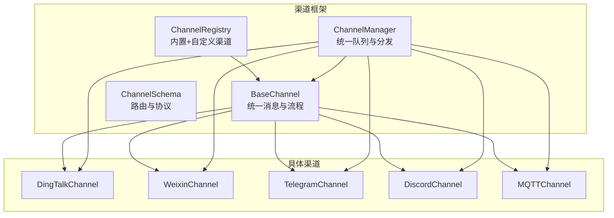
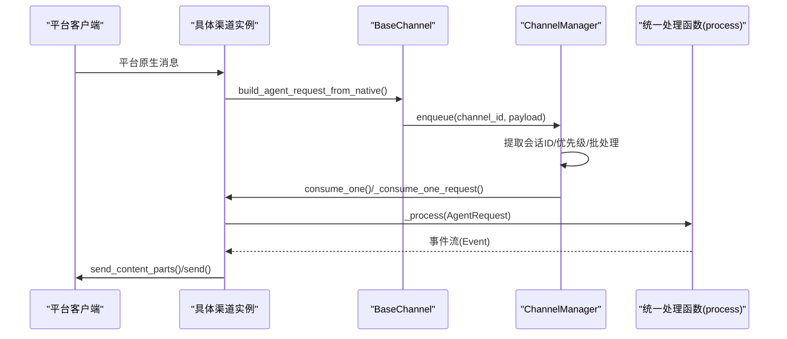
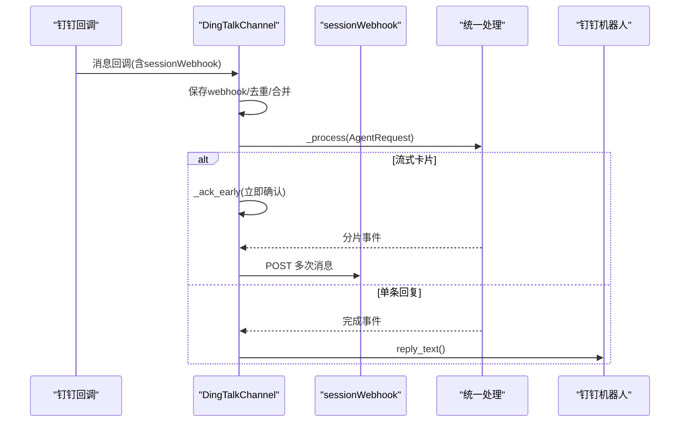
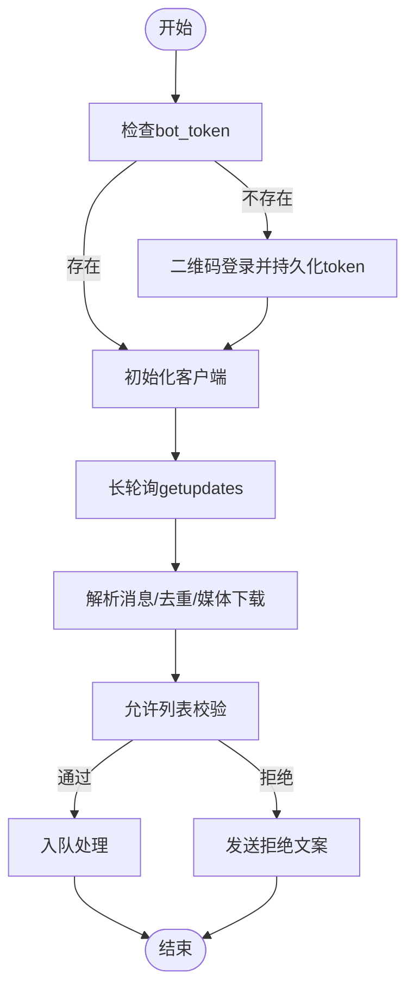
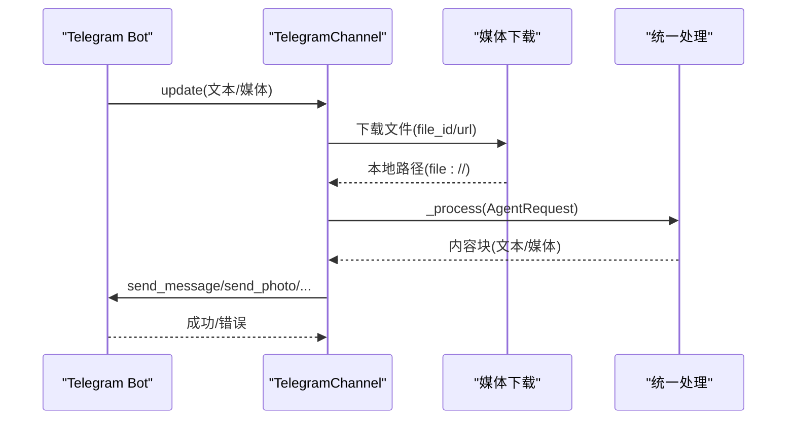
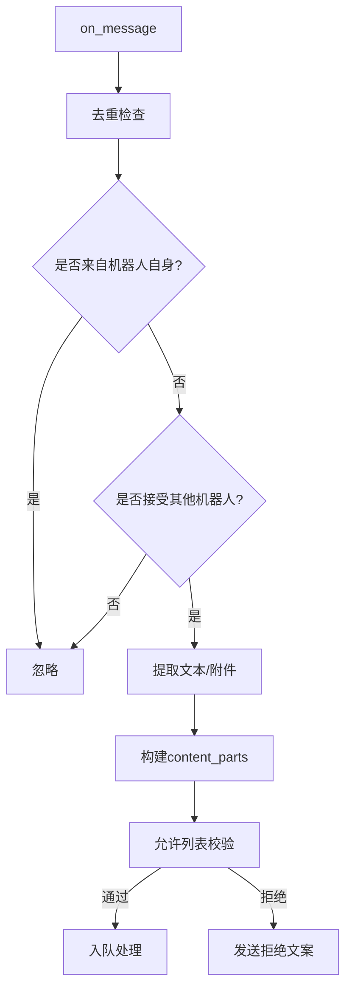
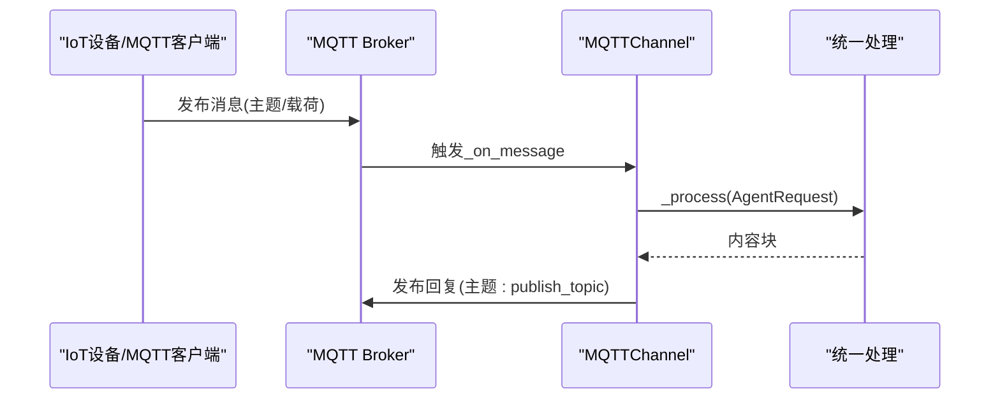
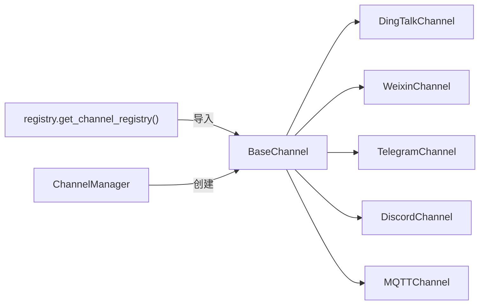

# 支持的渠道类型

<cite>
**本文引用的文件**
- [base.py](file://copaw/src/copaw/app/channels/base.py)
- [manager.py](file://copaw/src/copaw/app/channels/manager.py)
- [registry.py](file://copaw/src/copaw/app/channels/registry.py)
- [schema.py](file://copaw/src/copaw/app/channels/schema.py)
- [dingtalk/channel.py](file://copaw/src/copaw/app/channels/dingtalk/channel.py)
- [dingtalk/content_utils.py](file://copaw/src/copaw/app/channels/dingtalk/content_utils.py)
- [dingtalk/ai_card.py](file://copaw/src/copaw/app/channels/dingtalk/ai_card.py)
- [dingtalk/constants.py](file://copaw/src/copaw/app/channels/dingtalk/constants.py)
- [weixin/channel.py](file://copaw/src/copaw/app/channels/weixin/channel.py)
- [weixin/client.py](file://copaw/src/copaw/app/channels/weixin/client.py)
- [telegram/channel.py](file://copaw/src/copaw/app/channels/telegram/channel.py)
- [telegram/format_html.py](file://copaw/src/copaw/app/channels/telegram/format_html.py)
- [discord_/channel.py](file://copaw/src/copaw/app/channels/discord_/channel.py)
- [mqtt/channel.py](file://copaw/src/copaw/app/channels/mqtt/channel.py)
</cite>

## 目录
1. [简介](#简介)
2. [项目结构](#项目结构)
3. [核心组件](#核心组件)
4. [架构总览](#架构总览)
5. [详细组件分析](#详细组件分析)
6. [依赖分析](#依赖分析)
7. [性能考虑](#性能考虑)
8. [故障排除指南](#故障排除指南)
9. [结论](#结论)
10. [附录](#附录)

## 简介
本文件面向“已支持的渠道类型”，系统性梳理并深入解析以下平台的集成实现：钉钉（DingTalk）、微信（WeChat）、电报（Telegram）、Discord 服务器、MQTT 消息队列。内容覆盖消息格式、认证机制、API 调用方式、配置项、消息路由与会话管理、开发与运维最佳实践、限制与故障排除等。

## 项目结构
渠道体系由统一基类、通道注册表、通道管理器与各平台具体实现组成：
- 基类与通用能力：统一消息模型、渲染器、去抖与合并策略、任务跟踪与队列管理
- 注册表：内置与自定义渠道映射
- 管理器：统一入队、批处理、优先级与消费者循环
- 各渠道：按平台特性实现接收、发送、鉴权、媒体处理与会话路由

图示来源
- [base.py:70-127](file://copaw/src/copaw/app/channels/base.py#L70-L127)
- [registry.py:20-35](file://copaw/src/copaw/app/channels/registry.py#L20-L35)
- [manager.py:68-106](file://copaw/src/copaw/app/channels/manager.py#L68-L106)
- [schema.py:12-45](file://copaw/src/copaw/app/channels/schema.py#L12-L45)

章节来源
- [base.py:70-127](file://copaw/src/copaw/app/channels/base.py#L70-L127)
- [registry.py:20-35](file://copaw/src/copaw/app/channels/registry.py#L20-L35)
- [manager.py:68-106](file://copaw/src/copaw/app/channels/manager.py#L68-L106)
- [schema.py:12-45](file://copaw/src/copaw/app/channels/schema.py#L12-L45)

## 核心组件
- 统一消息模型与渲染
  - 使用运行时内容类型（文本、图片、视频、音频、文件、拒绝）构建消息体，支持工具输出过滤与思考内容过滤
  - 渲染样式可配置，支持隐藏内部工具详情、过滤思考内容
- 去抖与批量合并
  - 对无文本输入进行缓冲合并，避免空消息风暴；对同一会话的多个原生负载进行合并
- 任务跟踪与队列
  - 通过任务跟踪器挂载聊天与会话，支持取消与幂等处理
  - 统一队列管理器按（渠道、会话、优先级）路由，支持批处理与超时保护
- 允许列表与提及策略
  - 支持私聊/群组白名单策略、拒绝文案、@机器人或命令触发策略

章节来源
- [base.py:128-282](file://copaw/src/copaw/app/channels/base.py#L128-L282)
- [base.py:283-318](file://copaw/src/copaw/app/channels/base.py#L283-L318)
- [base.py:374-535](file://copaw/src/copaw/app/channels/base.py#L374-L535)
- [base.py:659-757](file://copaw/src/copaw/app/channels/base.py#L659-L757)
- [manager.py:39-65](file://copaw/src/copaw/app/channels/manager.py#L39-L65)
- [manager.py:215-347](file://copaw/src/copaw/app/channels/manager.py#L215-L347)

## 架构总览
统一入口通过注册表加载可用渠道，管理器为每个渠道创建队列与消费者循环，渠道负责将平台原生消息转换为统一请求并调用统一处理函数，再将响应内容回写到平台。

图示来源
- [manager.py:39-65](file://copaw/src/copaw/app/channels/manager.py#L39-L65)
- [manager.py:255-347](file://copaw/src/copaw/app/channels/manager.py#L255-L347)
- [base.py:620-630](file://copaw/src/copaw/app/channels/base.py#L620-L630)
- [base.py:759-800](file://copaw/src/copaw/app/channels/base.py#L759-L800)

章节来源
- [manager.py:447-526](file://copaw/src/copaw/app/channels/manager.py#L447-L526)
- [base.py:659-757](file://copaw/src/copaw/app/channels/base.py#L659-L757)

## 详细组件分析

### 钉钉（DingTalk）
- 认证与接入
  - 通过 Stream SDK 接收回调，支持机器人码与卡片模板参数
  - 支持主动发送：保存 sessionWebhook，基于会话过期时间安全边界进行清理
- 消息格式与媒体
  - 文本、Markdown、卡片（AI Card）混合；支持图片/视频/文件/音频链接
  - 语音消息作为独立输入直接处理
- 会话与路由
  - 会话ID采用对话ID短后缀，便于定时任务查找
  - 发送目标以“dingtalk:sw:<session_id>”或 webhook 直连
- 关键特性
  - 去抖与批合并关闭（由管理器合并），避免重复回复
  - AI Card 状态机与待处理卡片持久化
  - 多 Future 同步与早期确认（_ack_early）降低重试风暴
- 配置要点
  - 令牌与卡片模板、机器人码、媒体目录、提及策略、允许列表
- 限制与注意
  - sessionWebhook 有有效期，需在有效期内使用；过期后保留 conversation_id 用于 Open API 回退

图示来源
- [dingtalk/channel.py:113-200](file://copaw/src/copaw/app/channels/dingtalk/channel.py#L113-L200)
- [dingtalk/channel.py:320-370](file://copaw/src/copaw/app/channels/dingtalk/channel.py#L320-L370)
- [dingtalk/channel.py:558-678](file://copaw/src/copaw/app/channels/dingtalk/channel.py#L558-L678)
- [dingtalk/channel.py:733-800](file://copaw/src/copaw/app/channels/dingtalk/channel.py#L733-L800)

章节来源
- [dingtalk/channel.py:113-200](file://copaw/src/copaw/app/channels/dingtalk/channel.py#L113-L200)
- [dingtalk/channel.py:279-370](file://copaw/src/copaw/app/channels/dingtalk/channel.py#L279-L370)
- [dingtalk/channel.py:558-678](file://copaw/src/copaw/app/channels/dingtalk/channel.py#L558-L678)
- [dingtalk/channel.py:733-800](file://copaw/src/copaw/app/channels/dingtalk/channel.py#L733-L800)
- [dingtalk/content_utils.py](file://copaw/src/copaw/app/channels/dingtalk/content_utils.py)
- [dingtalk/ai_card.py](file://copaw/src/copaw/app/channels/dingtalk/ai_card.py)
- [dingtalk/constants.py](file://copaw/src/copaw/app/channels/dingtalk/constants.py)

### 微信（WeChat iLink Bot）
- 认证与接入
  - 支持 bot_token 直接配置；若缺失则触发二维码登录并持久化 token
- 消息格式与媒体
  - 文本、图片（CDN 加密下载）、语音（ASR 转文本）、文件（加密下载）
  - 媒体下载至本地目录，返回 file:// URI
- 会话与路由
  - 私聊：weixin:<from_user_id>；群聊：weixin:group:<group_id>
  - 支持上下文 token 缓存用于主动发送
- 关键特性
  - 长轮询拉取消息，去重集合上限控制内存占用
  - 可选打字指示，带过期时间
- 配置要点
  - 基础地址、token 文件、媒体目录、允许列表、策略

图示来源
- [weixin/channel.py:147-200](file://copaw/src/copaw/app/channels/weixin/channel.py#L147-L200)
- [weixin/channel.py:370-410](file://copaw/src/copaw/app/channels/weixin/channel.py#L370-L410)
- [weixin/channel.py:415-484](file://copaw/src/copaw/app/channels/weixin/channel.py#L415-L484)
- [weixin/channel.py:490-763](file://copaw/src/copaw/app/channels/weixin/channel.py#L490-L763)

章节来源
- [weixin/channel.py:59-142](file://copaw/src/copaw/app/channels/weixin/channel.py#L59-L142)
- [weixin/channel.py:206-238](file://copaw/src/copaw/app/channels/weixin/channel.py#L206-L238)
- [weixin/channel.py:370-410](file://copaw/src/copaw/app/channels/weixin/channel.py#L370-L410)
- [weixin/channel.py:415-763](file://copaw/src/copaw/app/channels/weixin/channel.py#L415-L763)
- [weixin/client.py](file://copaw/src/copaw/app/channels/weixin/client.py)

### 电报（Telegram）
- 认证与接入
  - Bot Token 配置；支持 HTTP 代理与代理鉴权
- 消息格式与媒体
  - 文本、图片、视频、音频、文件；自动拆分超过长度限制的内容
  - 支持 HTML 解析模式，必要时回退纯文本
- 会话与路由
  - 会话ID：telegram:{chat_id}
  - 支持主题线程（message_thread_id）
- 关键特性
  - 打字指示循环，超时自动停止
  - 错误分类处理：大小限制、权限不足、限流、网络错误等
- 配置要点
  - Token、代理、前缀、是否显示打字、允许列表、提及策略

图示来源
- [telegram/channel.py:140-237](file://copaw/src/copaw/app/channels/telegram/channel.py#L140-L237)
- [telegram/channel.py:599-652](file://copaw/src/copaw/app/channels/telegram/channel.py#L599-L652)
- [telegram/channel.py:654-770](file://copaw/src/copaw/app/channels/telegram/channel.py#L654-L770)

章节来源
- [telegram/channel.py:264-334](file://copaw/src/copaw/app/channels/telegram/channel.py#L264-L334)
- [telegram/channel.py:335-437](file://copaw/src/copaw/app/channels/telegram/channel.py#L335-L437)
- [telegram/channel.py:455-527](file://copaw/src/copaw/app/channels/telegram/channel.py#L455-L527)
- [telegram/channel.py:599-770](file://copaw/src/copaw/app/channels/telegram/channel.py#L599-L770)
- [telegram/format_html.py](file://copaw/src/copaw/app/channels/telegram/format_html.py)

### Discord 服务器
- 认证与接入
  - Bot Token 登录；启用消息内容意图；支持代理与代理鉴权
- 消息格式与媒体
  - 文本、图片、视频、音频、文件；自动拆分并保持代码块完整性
- 会话与路由
  - 私聊会话：discord:dm:{user_id}；频道会话：discord:ch:{channel_id}
  - 发送目标支持通过 meta 或 to_handle 解析
- 关键特性
  - 去重缓存（固定容量）；支持接受其他机器人消息（可选）
  - 自动检测 @提及与角色提及
- 配置要点
  - Token、代理、前缀、允许列表、提及策略、是否接受机器人消息

图示来源
- [discord_/channel.py:109-132](file://copaw/src/copaw/app/channels/discord_/channel.py#L109-L132)
- [discord_/channel.py:134-273](file://copaw/src/copaw/app/channels/discord_/channel.py#L134-L273)

章节来源
- [discord_/channel.py:41-88](file://copaw/src/copaw/app/channels/discord_/channel.py#L41-L88)
- [discord_/channel.py:274-336](file://copaw/src/copaw/app/channels/discord_/channel.py#L274-L336)
- [discord_/channel.py:357-420](file://copaw/src/copaw/app/channels/discord_/channel.py#L357-L420)
- [discord_/channel.py:421-552](file://copaw/src/copaw/app/channels/discord_/channel.py#L421-L552)
- [discord_/channel.py:558-574](file://copaw/src/copaw/app/channels/discord_/channel.py#L558-L574)

### MQTT 消息队列
- 认证与接入
  - 支持用户名/密码、TLS（CA/Cert/Key）、传输协议（TCP/WebSocket）
- 消息格式与路由
  - 默认文本消息；媒体以占位符形式发布
  - 订阅/发布主题支持格式化 client_id
- 会话与路由
  - 会话ID：mqtt:{client_id}
  - 发送目标即 client_id，支持 meta 覆盖
- 配置要点
  - 主机、端口、订阅/发布主题、QoS、TLS、清洁会话、传输方式

图示来源
- [mqtt/channel.py:235-285](file://copaw/src/copaw/app/channels/mqtt/channel.py#L235-L285)
- [mqtt/channel.py:286-344](file://copaw/src/copaw/app/channels/mqtt/channel.py#L286-L344)
- [mqtt/channel.py:354-378](file://copaw/src/copaw/app/channels/mqtt/channel.py#L354-L378)

章节来源
- [mqtt/channel.py:29-84](file://copaw/src/copaw/app/channels/mqtt/channel.py#L29-L84)
- [mqtt/channel.py:196-204](file://copaw/src/copaw/app/channels/mqtt/channel.py#L196-L204)
- [mqtt/channel.py:235-285](file://copaw/src/copaw/app/channels/mqtt/channel.py#L235-L285)
- [mqtt/channel.py:354-430](file://copaw/src/copaw/app/channels/mqtt/channel.py#L354-L430)

## 依赖分析
- 渠道注册与发现
  - 内置渠道映射（钉钉、微信、电报、Discord、MQTT 等）与自定义渠道扫描
- 渠道管理器
  - 统一队列、批处理、优先级、超时保护、任务跟踪
- 渠道间耦合
  - 低耦合：各渠道仅实现接收/发送与会话解析；统一通过 BaseChannel 与 ChannelManager 协作

图示来源
- [registry.py:190-194](file://copaw/src/copaw/app/channels/registry.py#L190-L194)
- [manager.py:68-106](file://copaw/src/copaw/app/channels/manager.py#L68-L106)
- [base.py:70-127](file://copaw/src/copaw/app/channels/base.py#L70-L127)

章节来源
- [registry.py:20-35](file://copaw/src/copaw/app/channels/registry.py#L20-L35)
- [manager.py:68-106](file://copaw/src/copaw/app/channels/manager.py#L68-L106)

## 性能考虑
- 去抖与合并
  - 钉钉关闭去抖，交由管理器批合并；微信/电报/Discord 通过批队列减少并发压力
- 任务跟踪与队列
  - 任务跟踪器避免重复执行；统一队列最大长度与超时保护，防止阻塞
- 媒体处理
  - 下载到本地再发送，避免大文件直传失败；电报/Discord 对超限进行明确提示
- 速率与限流
  - 电报/Discord 的错误分类处理帮助快速恢复；MQTT 的 QoS 与重连策略提升可靠性

## 故障排除指南
- 钉钉
  - sessionWebhook 过期：检查 expired_time 与安全边界；必要时回退 Open API
  - 重试风暴：利用 _ack_early 与 Future 列表同步
- 微信
  - 二维码登录失败：确认基础地址与网络；token 文件权限
  - 媒体下载失败：检查 CDN 加密参数与 AES Key
- 电报
  - HTML 解析失败：自动回退纯文本；文件过大：遵循 50MB 限制
  - 权限不足/限流：根据错误类型提示用户或降级
- Discord
  - 机器人自身消息：默认忽略；如需接受，开启 accept_bot_messages
  - 去重命中：检查消息 ID 缓存队列
- MQTT
  - 连接失败：核对主机、端口、认证与 TLS 参数
  - 未收到消息：确认订阅主题与 QoS 设置

章节来源
- [dingtalk/channel.py:519-527](file://copaw/src/copaw/app/channels/dingtalk/channel.py#L519-L527)
- [dingtalk/channel.py:643-678](file://copaw/src/copaw/app/channels/dingtalk/channel.py#L643-L678)
- [weixin/channel.py:370-410](file://copaw/src/copaw/app/channels/weixin/channel.py#L370-L410)
- [weixin/channel.py:768-800](file://copaw/src/copaw/app/channels/weixin/channel.py#L768-L800)
- [telegram/channel.py:631-652](file://copaw/src/copaw/app/channels/telegram/channel.py#L631-L652)
- [telegram/channel.py:718-770](file://copaw/src/copaw/app/channels/telegram/channel.py#L718-L770)
- [discord_/channel.py:109-132](file://copaw/src/copaw/app/channels/discord_/channel.py#L109-L132)
- [discord_/channel.py:421-453](file://copaw/src/copaw/app/channels/discord_/channel.py#L421-L453)
- [mqtt/channel.py:320-344](file://copaw/src/copaw/app/channels/mqtt/channel.py#L320-L344)

## 结论
该渠道体系通过统一基类与管理器，实现了跨平台的一致性与可扩展性。各平台在认证、消息格式、媒体处理与会话路由上各有特色，但均遵循统一的请求/响应与队列处理流程。建议在生产中结合平台限制与错误分类策略，完善监控与告警，确保稳定性与用户体验。

## 附录
- 配置项概览（按渠道）
  - 钉钉：client_id、client_secret、message_type、card_template_*、robot_code、media_dir、allow_from、dm_policy、group_policy、require_mention、card_auto_layout
  - 微信：bot_token、bot_token_file、base_url、media_dir、allow_from、dm_policy、group_policy
  - 电报：bot_token、http_proxy、http_proxy_auth、bot_prefix、show_typing、allow_from、dm_policy、group_policy、require_mention
  - Discord：bot_token、http_proxy、http_proxy_auth、bot_prefix、allow_from、dm_policy、group_policy、require_mention、accept_bot_messages
  - MQTT：host、port、transport、username、password、subscribe_topic、publish_topic、bot_prefix、clean_session、qos、tls_*、allow_from
- 最佳实践
  - 合理设置允许列表与提及策略，降低无关消息干扰
  - 对媒体类消息进行本地缓存与尺寸校验
  - 在高并发场景下启用批处理与队列超时保护
  - 针对平台限流与错误进行分类处理与用户提示