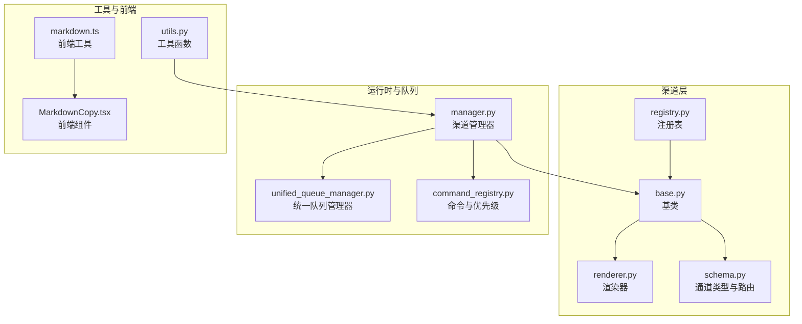
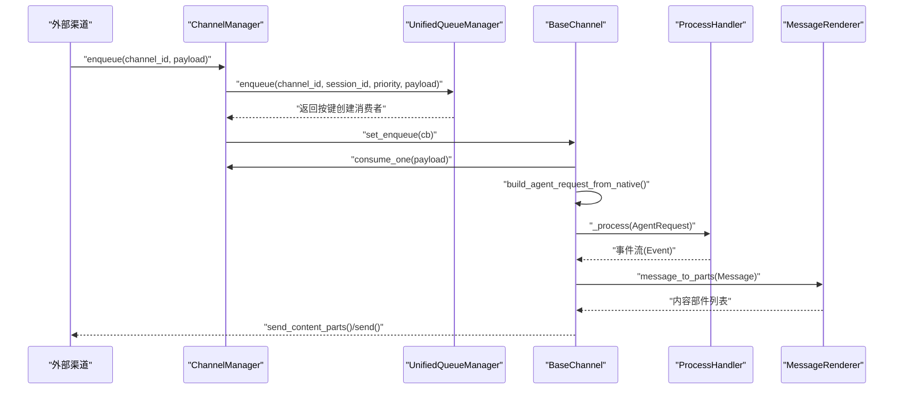
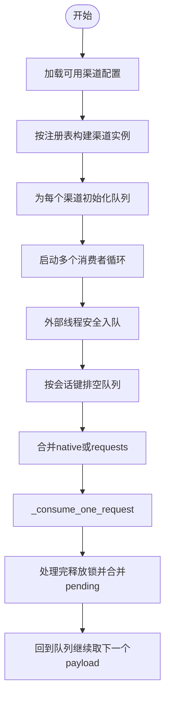
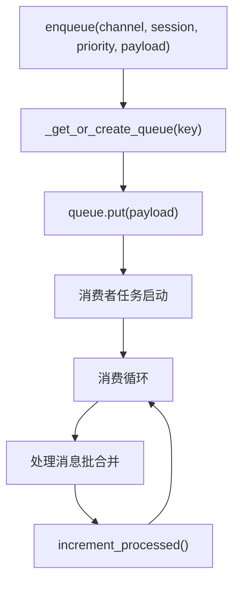
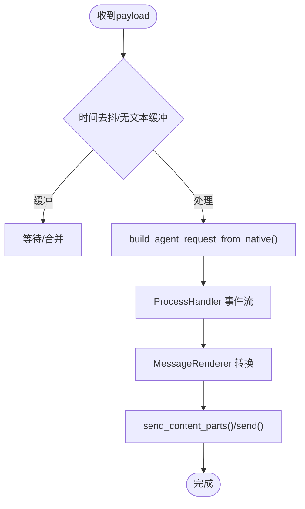
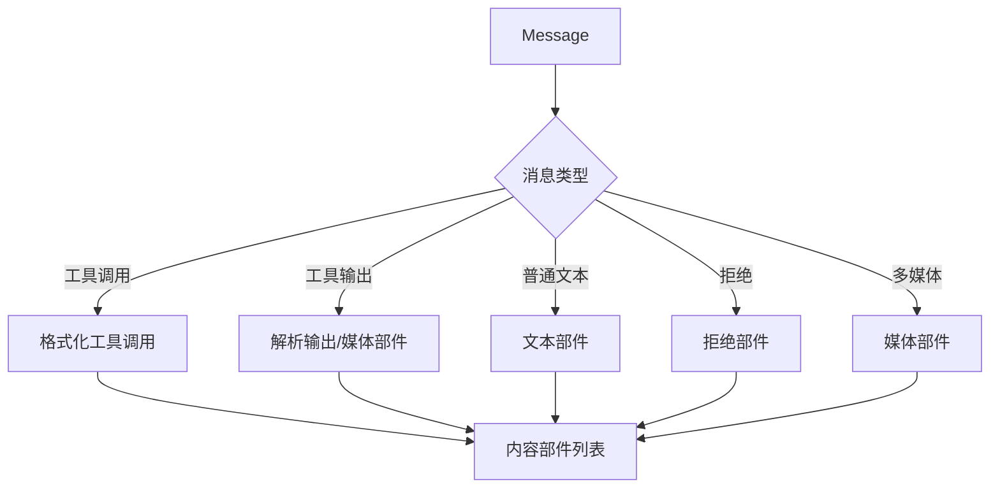
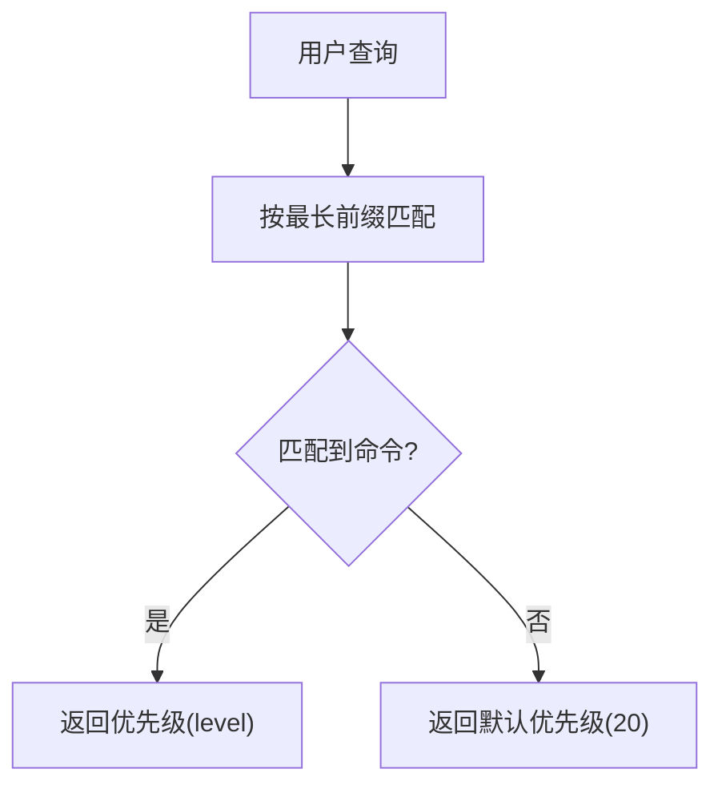
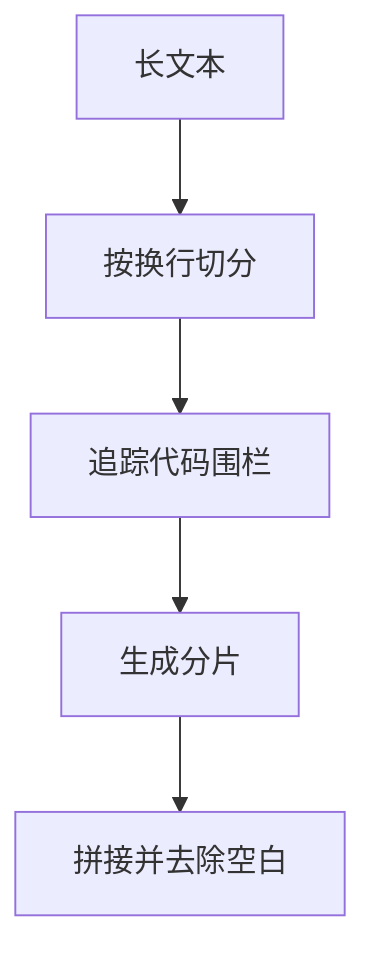
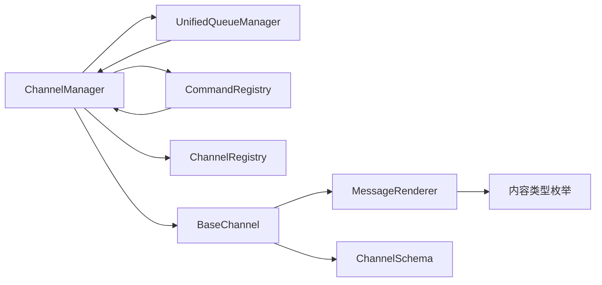

# 消息处理机制

<cite>
**本文引用的文件**
- [manager.py](file://copaw/src/copaw/app/channels/manager.py)
- [base.py](file://copaw/src/copaw/app/channels/base.py)
- [renderer.py](file://copaw/src/copaw/app/channels/renderer.py)
- [unified_queue_manager.py](file://copaw/src/copaw/app/channels/unified_queue_manager.py)
- [command_registry.py](file://copaw/src/copaw/app/channels/command_registry.py)
- [utils.py](file://copaw/src/copaw/app/channels/utils.py)
- [schema.py](file://copaw/src/copaw/app/channels/schema.py)
- [registry.py](file://copaw/src/copaw/app/channels/registry.py)
- [markdown.ts](file://copaw/console/src/utils/markdown.ts)
- [MarkdownCopy.tsx](file://copaw/console/src/components/MarkdownCopy/MarkdownCopy.tsx)
</cite>

## 目录
1. [简介](#简介)
2. [项目结构](#项目结构)
3. [核心组件](#核心组件)
4. [架构总览](#架构总览)
5. [详细组件分析](#详细组件分析)
6. [依赖关系分析](#依赖关系分析)
7. [性能考虑](#性能考虑)
8. [故障排查指南](#故障排查指南)
9. [结论](#结论)
10. [附录](#附录)

## 简介
本文件系统化梳理消息处理机制，覆盖消息格式标准化、渲染系统、路由与分发、异步处理与批处理、以及扩展与性能优化。重点基于渠道插件化框架，统一 AgentRequest 与内容部件（Content Parts），并通过统一队列管理器实现按会话与优先级的并发隔离与有序处理。

## 项目结构
消息处理相关代码主要集中在 channels 子系统：
- 渠道管理与队列：ChannelManager、UnifiedQueueManager
- 渠道抽象与适配：BaseChannel、ChannelRegistry、ChannelSchema
- 消息渲染：MessageRenderer、RenderStyle
- 优先级与命令路由：CommandRegistry
- 工具函数：消息切分、本地文件 URL 解析等
- 控制台前端 Markdown 辅助：stripFrontmatter、MarkdownCopy 组件

**图表来源**
- [registry.py:190-194](file://copaw/src/copaw/app/channels/registry.py#L190-L194)
- [base.py:70-118](file://copaw/src/copaw/app/channels/base.py#L70-L118)
- [renderer.py:78-86](file://copaw/src/copaw/app/channels/renderer.py#L78-L86)
- [schema.py:12-48](file://copaw/src/copaw/app/channels/schema.py#L12-L48)
- [manager.py:68-106](file://copaw/src/copaw/app/channels/manager.py#L68-L106)
- [unified_queue_manager.py:60-78](file://copaw/src/copaw/app/channels/unified_queue_manager.py#L60-L78)
- [command_registry.py:23-42](file://copaw/src/copaw/app/channels/command_registry.py#L23-L42)
- [utils.py:18-76](file://copaw/src/copaw/app/channels/utils.py#L18-L76)
- [markdown.ts:1-9](file://copaw/console/src/utils/markdown.ts#L1-L9)
- [MarkdownCopy.tsx:44-85](file://copaw/console/src/components/MarkdownCopy/MarkdownCopy.tsx#L44-L85)

**章节来源**
- [registry.py:190-194](file://copaw/src/copaw/app/channels/registry.py#L190-L194)
- [manager.py:68-106](file://copaw/src/copaw/app/channels/manager.py#L68-L106)
- [unified_queue_manager.py:60-78](file://copaw/src/copaw/app/channels/unified_queue_manager.py#L60-L78)
- [base.py:70-118](file://copaw/src/copaw/app/channels/base.py#L70-L118)
- [renderer.py:78-86](file://copaw/src/copaw/app/channels/renderer.py#L78-L86)
- [schema.py:12-48](file://copaw/src/copaw/app/channels/schema.py#L12-L48)
- [command_registry.py:23-42](file://copaw/src/copaw/app/channels/command_registry.py#L23-L42)
- [utils.py:18-76](file://copaw/src/copaw/app/channels/utils.py#L18-L76)
- [markdown.ts:1-9](file://copaw/console/src/utils/markdown.ts#L1-L9)
- [MarkdownCopy.tsx:44-85](file://copaw/console/src/components/MarkdownCopy/MarkdownCopy.tsx#L44-L85)

## 核心组件
- 渠道管理器 ChannelManager：负责从配置/环境创建渠道实例、注入统一处理管线、线程安全入队、按会话与优先级路由到统一队列管理器、消费者循环与批处理合并。
- 统一队列管理器 UnifiedQueueManager：以三元组键 (channel_id, session_id, priority_level) 维度实现严格序列化、并发隔离、按需消费者创建与空闲回收。
- 渠道抽象 BaseChannel：统一消息模型（AgentRequest）、去抖与批处理、渲染与发送、权限与提及策略、工作区集成与任务跟踪。
- 消息渲染 MessageRenderer：将 Message 的内容部件转换为可发送的内容部件（文本、图片、音频、视频、文件、拒绝），支持样式控制与工具链过滤。
- 命令与优先级 CommandRegistry：命令前缀匹配与优先级映射，支持紧急控制命令直达处理。
- 工具函数 utils：文本切分（保留代码块完整性）、本地文件 URL 解析、进程桥接工厂。
- 渠道注册表 registry：内置渠道映射与自定义渠道动态发现。
- 渠道模式 schema：统一 ChannelType、ChannelAddress、转换协议。

**章节来源**
- [manager.py:68-106](file://copaw/src/copaw/app/channels/manager.py#L68-L106)
- [unified_queue_manager.py:60-78](file://copaw/src/copaw/app/channels/unified_queue_manager.py#L60-L78)
- [base.py:70-118](file://copaw/src/copaw/app/channels/base.py#L70-L118)
- [renderer.py:78-86](file://copaw/src/copaw/app/channels/renderer.py#L78-L86)
- [command_registry.py:23-42](file://copaw/src/copaw/app/channels/command_registry.py#L23-L42)
- [utils.py:18-76](file://copaw/src/copaw/app/channels/utils.py#L18-L76)
- [registry.py:190-194](file://copaw/src/copaw/app/channels/registry.py#L190-L194)
- [schema.py:12-48](file://copaw/src/copaw/app/channels/schema.py#L12-L48)

## 架构总览
消息从外部渠道负载进入，经 ChannelManager 的统一入队与路由，按会话与优先级进入队列；消费者循环按批合并后调用 BaseChannel 的处理流水线，最终由 MessageRenderer 将消息转换为可发送的内容部件并发送。

**图表来源**
- [manager.py:350-377](file://copaw/src/copaw/app/channels/manager.py#L350-L377)
- [manager.py:307-348](file://copaw/src/copaw/app/channels/manager.py#L307-L348)
- [base.py:443-479](file://copaw/src/copaw/app/channels/base.py#L443-L479)
- [unified_queue_manager.py:119-164](file://copaw/src/copaw/app/channels/unified_queue_manager.py#L119-L164)
- [renderer.py:87-102](file://copaw/src/copaw/app/channels/renderer.py#L87-L102)

## 详细组件分析

### 渠道管理器 ChannelManager
- 动态注册与初始化：从配置/环境读取可用渠道，过滤禁用项，按注册表构造实例。
- 线程安全入队：通过事件循环回调切换线程，保证队列入队安全。
- 优先级与会话路由：提取查询文本进行命令检测，计算优先级；同时提取标准化会话 ID，路由到统一队列管理器。
- 批处理与合并：按原生负载与请求负载分别合并，调用渠道消费接口。
- 生命周期管理：start_all 并发启动渠道与消费者；stop_all 优雅关停并清理。

**图表来源**
- [manager.py:135-411](file://copaw/src/copaw/app/channels/manager.py#L135-L411)

**章节来源**
- [manager.py:68-106](file://copaw/src/copaw/app/channels/manager.py#L68-L106)
- [manager.py:215-301](file://copaw/src/copaw/app/channels/manager.py#L215-L301)
- [manager.py:350-377](file://copaw/src/copaw/app/channels/manager.py#L350-L377)
- [manager.py:307-348](file://copaw/src/copaw/app/channels/manager.py#L307-L348)

### 统一队列管理器 UnifiedQueueManager
- 键隔离：QueueKey=(channel_id, session_id, priority_level)，严格序列化相同键的消息。
- 按需消费者：首次入队时创建队列与消费者任务，空闲超时自动清理。
- 并发策略：不同会话与不同优先级可并发处理，同键串行。
- 指标与监控：提供队列统计与处理计数，便于运维观察。

**图表来源**
- [unified_queue_manager.py:119-164](file://copaw/src/copaw/app/channels/unified_queue_manager.py#L119-L164)
- [unified_queue_manager.py:165-213](file://copaw/src/copaw/app/channels/unified_queue_manager.py#L165-L213)
- [unified_queue_manager.py:214-273](file://copaw/src/copaw/app/channels/unified_queue_manager.py#L214-L273)
- [unified_queue_manager.py:430-472](file://copaw/src/copaw/app/channels/unified_queue_manager.py#L430-L472)

**章节来源**
- [unified_queue_manager.py:60-78](file://copaw/src/copaw/app/channels/unified_queue_manager.py#L60-L78)
- [unified_queue_manager.py:119-164](file://copaw/src/copaw/app/channels/unified_queue_manager.py#L119-L164)
- [unified_queue_manager.py:274-290](file://copaw/src/copaw/app/channels/unified_queue_manager.py#L274-L290)
- [unified_queue_manager.py:329-375](file://copaw/src/copaw/app/channels/unified_queue_manager.py#L329-L375)
- [unified_queue_manager.py:376-428](file://copaw/src/copaw/app/channels/unified_queue_manager.py#L376-L428)
- [unified_queue_manager.py:430-472](file://copaw/src/copaw/app/channels/unified_queue_manager.py#L430-L472)

### 渠道抽象 BaseChannel
- 统一模型：build_agent_request_from_native 将原生负载解析为 AgentRequest；get_to_handle_from_request 映射发送目标。
- 去抖与批处理：merge_native_items、merge_requests；时间去抖与“无文本缓冲”策略。
- 渲染与发送：_message_to_content_parts + send_content_parts；错误处理与回调。
- 权限与策略：允许白名单、群聊提及要求、拒绝文案。
- 工作区集成：TaskTracker 与聊天管理器协作，支持任务取消与去重。

**图表来源**
- [base.py:659-696](file://copaw/src/copaw/app/channels/base.py#L659-L696)
- [base.py:759-800](file://copaw/src/copaw/app/channels/base.py#L759-L800)
- [base.py:147-209](file://copaw/src/copaw/app/channels/base.py#L147-L209)
- [base.py:249-282](file://copaw/src/copaw/app/channels/base.py#L249-L282)

**章节来源**
- [base.py:70-118](file://copaw/src/copaw/app/channels/base.py#L70-L118)
- [base.py:557-568](file://copaw/src/copaw/app/channels/base.py#L557-L568)
- [base.py:659-696](file://copaw/src/copaw/app/channels/base.py#L659-L696)
- [base.py:759-800](file://copaw/src/copaw/app/channels/base.py#L759-L800)
- [base.py:147-209](file://copaw/src/copaw/app/channels/base.py#L147-L209)
- [base.py:249-282](file://copaw/src/copaw/app/channels/base.py#L249-L282)

### 消息渲染 MessageRenderer
- 输入：Message（含类型与内容部件）。
- 输出：内容部件列表（文本、图片、音频、视频、文件、拒绝）。
- 样式控制：RenderStyle 支持 Markdown、代码围栏、Emoji、工具链过滤与思考内容过滤。
- 工具链处理：将工具调用与输出转换为用户可读文本或媒体部件（内部工具可跳过用户可见媒体）。

**图表来源**
- [renderer.py:87-102](file://copaw/src/copaw/app/channels/renderer.py#L87-L102)
- [renderer.py:246-296](file://copaw/src/copaw/app/channels/renderer.py#L246-L296)
- [renderer.py:298-350](file://copaw/src/copaw/app/channels/renderer.py#L298-L350)

**章节来源**
- [renderer.py:78-86](file://copaw/src/copaw/app/channels/renderer.py#L78-L86)
- [renderer.py:87-102](file://copaw/src/copaw/app/channels/renderer.py#L87-L102)
- [renderer.py:246-296](file://copaw/src/copaw/app/channels/renderer.py#L246-L296)
- [renderer.py:298-350](file://copaw/src/copaw/app/channels/renderer.py#L298-L350)

### 命令与优先级 CommandRegistry
- 命令前缀匹配：支持完整命令与短别名，按最长前缀匹配。
- 优先级映射：critical/high/normal/low（0/10/20/30），支持自定义级别插入。
- 快速查找：O(1) 查找，便于 ChannelManager 在入队时快速分类。

**图表来源**
- [command_registry.py:136-174](file://copaw/src/copaw/app/channels/command_registry.py#L136-L174)
- [command_registry.py:175-218](file://copaw/src/copaw/app/channels/command_registry.py#L175-L218)

**章节来源**
- [command_registry.py:23-42](file://copaw/src/copaw/app/channels/command_registry.py#L23-L42)
- [command_registry.py:136-174](file://copaw/src/copaw/app/channels/command_registry.py#L136-L174)
- [command_registry.py:175-218](file://copaw/src/copaw/app/channels/command_registry.py#L175-L218)

### 工具函数与前端辅助
- 文本切分：split_text 保持代码围栏完整性，按换行切分，避免截断代码块。
- 文件 URL 解析：file_url_to_local_path 支持 file:// 与本地路径，便于渠道侧读取本地资源。
- 前端 Markdown：stripFrontmatter 去除 YAML 头部，MarkdownCopy 提供复制与视图切换。

**图表来源**
- [utils.py:18-76](file://copaw/src/copaw/app/channels/utils.py#L18-L76)

**章节来源**
- [utils.py:18-76](file://copaw/src/copaw/app/channels/utils.py#L18-L76)
- [utils.py:78-119](file://copaw/src/copaw/app/channels/utils.py#L78-L119)
- [markdown.ts:1-9](file://copaw/console/src/utils/markdown.ts#L1-L9)
- [MarkdownCopy.tsx:44-85](file://copaw/console/src/components/MarkdownCopy/MarkdownCopy.tsx#L44-L85)

## 依赖关系分析
- ChannelManager 依赖 UnifiedQueueManager、CommandRegistry、ChannelRegistry 与 BaseChannel 抽象。
- BaseChannel 依赖 MessageRenderer、ChannelSchema、工具函数与工作区。
- MessageRenderer 依赖内容类型枚举与 RenderStyle。
- CommandRegistry 为 ChannelManager 提供优先级决策。
- Registry 为 ChannelManager 提供渠道类映射与自定义渠道发现。

**图表来源**
- [manager.py:21-26](file://copaw/src/copaw/app/channels/manager.py#L21-L26)
- [base.py:36-37](file://copaw/src/copaw/app/channels/base.py#L36-L37)
- [renderer.py:14-22](file://copaw/src/copaw/app/channels/renderer.py#L14-L22)
- [schema.py:12-48](file://copaw/src/copaw/app/channels/schema.py#L12-L48)
- [registry.py:190-194](file://copaw/src/copaw/app/channels/registry.py#L190-L194)

**章节来源**
- [manager.py:21-26](file://copaw/src/copaw/app/channels/manager.py#L21-L26)
- [base.py:36-37](file://copaw/src/copaw/app/channels/base.py#L36-L37)
- [renderer.py:14-22](file://copaw/src/copaw/app/channels/renderer.py#L14-L22)
- [schema.py:12-48](file://copaw/src/copaw/app/channels/schema.py#L12-L48)
- [registry.py:190-194](file://copaw/src/copaw/app/channels/registry.py#L190-L194)

## 性能考虑
- 队列与消费者：统一队列管理器按需创建消费者，避免固定池资源浪费；空闲队列自动清理降低内存占用。
- 并发隔离：按会话与优先级隔离，避免高优先级阻塞低优先级；批处理减少重复处理与网络往返。
- 去抖与缓冲：时间去抖与“无文本缓冲”减少无效请求与重复渲染。
- 文本切分：split_text 保持代码块完整性，避免渲染错误与重复发送。
- 渲染策略：通过 RenderStyle 控制 Markdown/Emoji/代码围栏，减少前端渲染负担。
- 线程安全：事件循环回调确保入队线程切换安全，避免锁竞争。

[本节为通用指导，无需特定文件来源]

## 故障排查指南
- 入队失败或超时：检查 UnifiedQueueManager 的队列容量与清理间隔，确认入队回调已正确注入。
- 会话乱序或重复：确认 BaseChannel 的去抖键与会话键生成逻辑一致，避免跨消费者拆分。
- 渲染异常：检查 MessageRenderer 的样式配置与内容部件类型，确保工具链输出被正确过滤。
- 优先级不生效：核对 CommandRegistry 的命令前缀与优先级映射，确认 ChannelManager 的查询提取逻辑。
- 渠道替换失败：检查 ChannelManager 的替换流程，确保新渠道在锁外启动、锁内交换与旧渠道停止。
- 前端 Markdown 异常：确认 stripFrontmatter 已移除 YAML 头部，MarkdownCopy 的显示/编辑模式切换逻辑。

**章节来源**
- [unified_queue_manager.py:145-157](file://copaw/src/copaw/app/channels/unified_queue_manager.py#L145-L157)
- [manager.py:215-301](file://copaw/src/copaw/app/channels/manager.py#L215-L301)
- [base.py:132-146](file://copaw/src/copaw/app/channels/base.py#L132-L146)
- [renderer.py:87-102](file://copaw/src/copaw/app/channels/renderer.py#L87-L102)
- [command_registry.py:175-218](file://copaw/src/copaw/app/channels/command_registry.py#L175-L218)
- [manager.py:571-630](file://copaw/src/copaw/app/channels/manager.py#L571-L630)
- [markdown.ts:1-9](file://copaw/console/src/utils/markdown.ts#L1-L9)
- [MarkdownCopy.tsx:44-85](file://copaw/console/src/components/MarkdownCopy/MarkdownCopy.tsx#L44-L85)

## 结论
该消息处理机制通过统一的渠道抽象、优先级路由与统一队列管理，实现了多平台渠道的一致性与可扩展性。渲染系统支持富文本与多媒体内容，结合去抖与批处理策略，在保证顺序与完整性的前提下提升吞吐与稳定性。扩展方面，可通过自定义渠道类、命令优先级与渲染样式实现灵活定制。

[本节为总结性内容，无需特定文件来源]

## 附录
- 渠道类型与路由：ChannelType 为字符串以支持插件渠道；ChannelAddress 提供统一路由结构。
- 自定义渠道：通过 CUSTOM_CHANNELS_DIR 动态发现并注册，支持额外 HTTP 路由挂载。
- 前端 Markdown：stripFrontmatter 与 MarkdownCopy 组件提升前端渲染体验。

**章节来源**
- [schema.py:12-48](file://copaw/src/copaw/app/channels/schema.py#L12-L48)
- [registry.py:96-129](file://copaw/src/copaw/app/channels/registry.py#L96-L129)
- [registry.py:134-187](file://copaw/src/copaw/app/channels/registry.py#L134-L187)
- [markdown.ts:1-9](file://copaw/console/src/utils/markdown.ts#L1-L9)
- [MarkdownCopy.tsx:44-85](file://copaw/console/src/components/MarkdownCopy/MarkdownCopy.tsx#L44-L85)