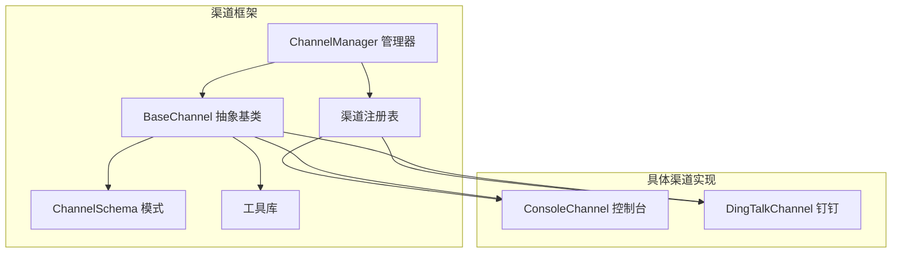
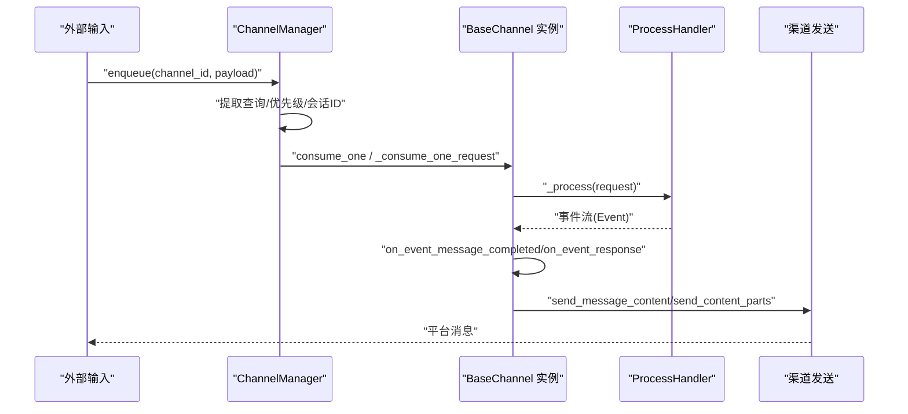
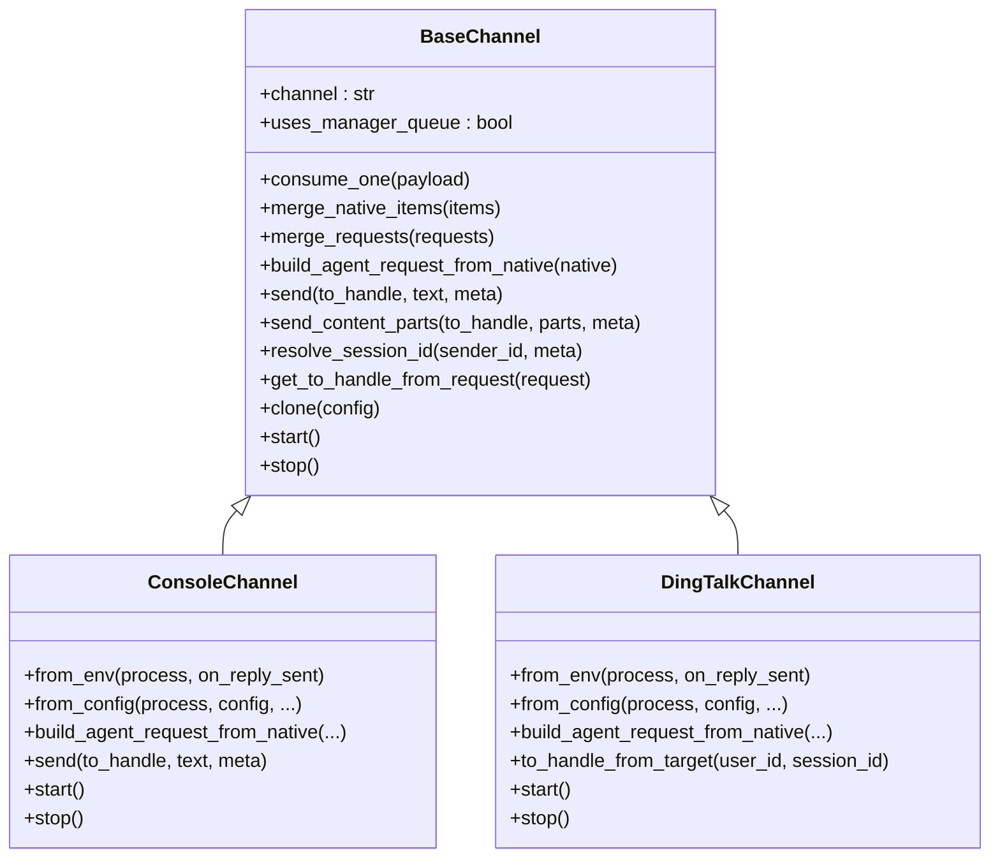
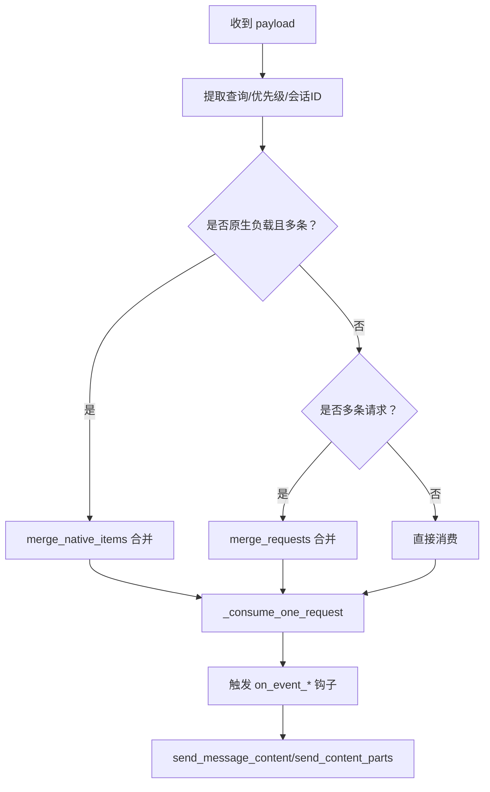
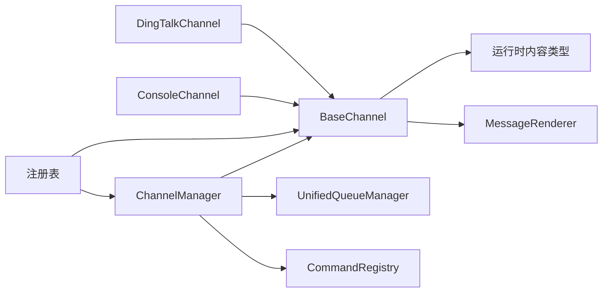

# 渠道抽象基类

<cite>
**本文档引用的文件**
- [base.py](file://copaw/src/copaw/app/channels/base.py)
- [schema.py](file://copaw/src/copaw/app/channels/schema.py)
- [manager.py](file://copaw/src/copaw/app/channels/manager.py)
- [registry.py](file://copaw/src/copaw/app/channels/registry.py)
- [utils.py](file://copaw/src/copaw/app/channels/utils.py)
- [channel.py（控制台）](file://copaw/src/copaw/app/channels/console/channel.py)
- [channel.py（钉钉）](file://copaw/src/copaw/app/channels/dingtalk/channel.py)
</cite>

## 目录
1. [简介](#简介)
2. [项目结构](#项目结构)
3. [核心组件](#核心组件)
4. [架构总览](#架构总览)
5. [详细组件分析](#详细组件分析)
6. [依赖分析](#依赖分析)
7. [性能考量](#性能考量)
8. [故障排查指南](#故障排查指南)
9. [结论](#结论)
10. [附录：开发指南与最佳实践](#附录开发指南与最佳实践)

## 简介
本文件围绕 BaseChannel 抽象基类展开，系统化阐述渠道抽象设计模式、统一接口与扩展点、消息处理核心流程（consume_one、merge_native_items、merge_requests）、内容类型系统（ContentType 枚举与 TextContent 等）、渠道特定能力（会话管理、用户标识、目标处理）、以及面向实现者的开发指南与最佳实践。文档同时给出关键流程的可视化图示，帮助读者快速把握从“输入到输出”的完整链路。

## 项目结构
渠道相关代码主要位于 copaw 应用层 channels 子包中，采用“抽象基类 + 具体渠道实现 + 管理器 + 注册表 + 工具”的分层组织方式：
- 抽象基类：定义统一的消息处理契约、内容类型转换、渲染与发送逻辑
- 具体渠道：如 ConsoleChannel、DingTalkChannel 等，实现平台特有行为
- 管理器：ChannelManager 负责队列、批合并、任务跟踪与生命周期管理
- 注册表：注册内置与自定义渠道，支持动态发现与替换
- 工具：通用文本切分、文件 URL 解析、进程工厂等

图表来源
- [base.py](file://copaw/src/copaw/app/channels/base.py)
- [manager.py](file://copaw/src/copaw/app/channels/manager.py)
- [registry.py](file://copaw/src/copaw/app/channels/registry.py)
- [schema.py](file://copaw/src/copaw/app/channels/schema.py)
- [utils.py](file://copaw/src/copaw/app/channels/utils.py)

章节来源
- [base.py](file://copaw/src/copaw/app/channels/base.py)
- [manager.py](file://copaw/src/copaw/app/channels/manager.py)
- [registry.py](file://copaw/src/copaw/app/channels/registry.py)
- [schema.py](file://copaw/src/copaw/app/channels/schema.py)
- [utils.py](file://copaw/src/copaw/app/channels/utils.py)

## 核心组件
- BaseChannel 抽象基类：定义统一的消息处理契约、内容类型转换、渲染与发送逻辑；提供时间去抖动、无文本缓冲、权限策略、提及策略等通用能力
- ChannelManager 管理器：负责渠道实例化、队列与批合并、任务跟踪、生命周期管理
- 渠道注册表：内置渠道映射与自定义渠道发现，支持按需加载
- ChannelSchema：渠道类型标识、路由地址模型、转换协议
- 工具库：文本切分、文件 URL 解析、进程工厂

章节来源
- [base.py](file://copaw/src/copaw/app/channels/base.py)
- [manager.py](file://copaw/src/copaw/app/channels/manager.py)
- [registry.py](file://copaw/src/copaw/app/channels/registry.py)
- [schema.py](file://copaw/src/copaw/app/channels/schema.py)
- [utils.py](file://copaw/src/copaw/app/channels/utils.py)

## 架构总览
下图展示从“外部输入”到“渠道输出”的端到端流程，强调 BaseChannel 的统一处理路径与 ChannelManager 的批合并与队列调度。

图表来源
- [manager.py](file://copaw/src/copaw/app/channels/manager.py)
- [base.py](file://copaw/src/copaw/app/channels/base.py)

## 详细组件分析

### BaseChannel 抽象基类
BaseChannel 是所有渠道的抽象基类，提供统一的消息处理契约与扩展点，核心要点如下：

- 统一接口与扩展点
  - 构造函数接收 process 处理器、回调、渲染样式与安全策略参数
  - 提供 from_env/from_config 类方法用于不同来源初始化
  - 提供 start/stop/send 等抽象方法，子类必须实现
  - 提供 get_to_handle_from_request/get_on_reply_sent_args 等扩展点，便于子类定制目标与回调参数

- 消息处理核心方法
  - consume_one：入口方法，支持时间去抖动与无文本缓冲；若启用去抖动则延迟合并后调用 _consume_one_request
  - merge_native_items：合并多个原生负载（默认拼接 content_parts 并合并 meta 字段）
  - merge_requests：合并同一会话的多个 AgentRequest（拼接 input[0].content）

- 内容类型系统
  - 基于 ContentType 枚举与 TextContent/ImageContent/VideoContent/AudioContent/FileContent/RefusalContent 等运行时内容类型
  - _message_to_content_parts 将 Message 转换为可发送的内容片段，send_content_parts 默认将文本与拒绝内容合并为纯文本，媒体以占位符形式附加

- 渠道特定功能
  - 会话管理：resolve_session_id 默认以 channel:sender_id 形式生成；子类可覆盖以适配平台会话键（如钉钉短会话ID）
  - 用户标识与目标处理：get_to_handle_from_request 默认返回 user_id；to_handle_from_target 支持从目标（用户ID+会话ID）映射到渠道特定 to_handle
  - 权限与提及策略：dm_policy/group_policy/allow_from/deny_message/require_mention 控制访问与群聊提及要求
  - 任务跟踪与取消：_consume_with_tracker/_stream_with_tracker 结合 TaskTracker 实现任务跟踪与取消

- 错误处理与回调
  - _on_consume_error 默认通过 send_content_parts 发送错误文本
  - _on_process_completed/_before_consume_process 等钩子供子类扩展

图表来源
- [base.py](file://copaw/src/copaw/app/channels/base.py)
- [channel.py（控制台）](file://copaw/src/copaw/app/channels/console/channel.py)
- [channel.py（钉钉）](file://copaw/src/copaw/app/channels/dingtalk/channel.py)

章节来源
- [base.py](file://copaw/src/copaw/app/channels/base.py)

### ChannelManager 管理器
ChannelManager 负责：
- 从环境或配置创建渠道实例并注入统一的 ProcessHandler
- 使用 UnifiedQueueManager 对同一会话消息进行批合并与去重
- 通过 set_workspace 注入工作区与命令注册表，支持任务跟踪与聊天管理
- 提供 enqueue/send_text/send_event 等统一入口

图表来源
- [manager.py](file://copaw/src/copaw/app/channels/manager.py)
- [base.py](file://copaw/src/copaw/app/channels/base.py)

章节来源
- [manager.py](file://copaw/src/copaw/app/channels/manager.py)

### 渠道注册表与模式
- 注册表：内置渠道映射（如 imessage/discord/dingtalk 等）与自定义渠道发现，支持缓存与热插拔
- 模式：ChannelType 为字符串类型，支持内置集合与插件自定义；ChannelAddress 统一路由模型，替代分散的 meta 键

章节来源
- [registry.py](file://copaw/src/copaw/app/channels/registry.py)
- [schema.py](file://copaw/src/copaw/app/channels/schema.py)

### 工具库
- 文本切分：split_text 支持代码块 fence 保持与换行边界切分
- 文件 URL 解析：file_url_to_local_path 支持 file:// 与本地路径解析
- 进程工厂：make_process_from_runner 将 runner.stream_query 包装为 ProcessHandler

章节来源
- [utils.py](file://copaw/src/copaw/app/channels/utils.py)

## 依赖分析
- BaseChannel 依赖运行时内容类型（ContentType/TextContent 等）与渲染器 MessageRenderer
- ChannelManager 依赖 BaseChannel、CommandRegistry、UnifiedQueueManager，并通过注册表获取渠道类
- 具体渠道（Console/DingTalk）继承 BaseChannel，覆盖构建请求、发送与会话键解析等

图表来源
- [base.py](file://copaw/src/copaw/app/channels/base.py)
- [manager.py](file://copaw/src/copaw/app/channels/manager.py)
- [registry.py](file://copaw/src/copaw/app/channels/registry.py)

章节来源
- [base.py](file://copaw/src/copaw/app/channels/base.py)
- [manager.py](file://copaw/src/copaw/app/channels/manager.py)
- [registry.py](file://copaw/src/copaw/app/channels/registry.py)

## 性能考量
- 时间去抖动：对原生负载启用去抖动（如 0.3 秒），合并同一会话的多次输入，减少重复渲染与网络请求
- 批合并：在 ChannelManager 层对同一会话队列进行批合并，降低处理开销
- 任务跟踪：结合 TaskTracker 与队列系统，避免重复任务与资源浪费
- 文本切分：split_text 在长文本场景下按换行与 fence 切分，提升前端渲染与传输效率
- 媒体处理：send_content_parts 默认将媒体作为占位符附加，避免大体积附件阻塞主消息通道

## 故障排查指南
- 常见问题
  - 无文本消息被缓冲：检查 _apply_no_text_debounce 逻辑与 session_id 是否正确
  - 权限拒绝：核对 dm_policy/group_policy/allow_from/require_mention 配置
  - 会话键不一致：确认 resolve_session_id 与 to_handle_from_target 的实现一致性
  - 去抖动未生效：确认子类是否设置 _debounce_seconds 或覆盖 get_debounce_key
- 日志定位
  - BaseChannel 中大量 DEBUG/INFO/ERROR 日志，关注“debounce”“session_id”“consume_one”“error”
  - ChannelManager 关注“enqueue/processed/batch”等日志
- 回退策略
  - 若子类需要绕过去抖动或批合并，可在子类中覆盖对应方法或禁用去抖动

章节来源
- [base.py](file://copaw/src/copaw/app/channels/base.py)
- [manager.py](file://copaw/src/copaw/app/channels/manager.py)

## 结论
BaseChannel 通过统一抽象与扩展点，实现了跨平台渠道的一致性接入；配合 ChannelManager 的批合并与任务跟踪，确保了高吞吐与低冗余。借助内容类型系统与渲染器，渠道能够灵活地将运行时消息转换为平台可识别的多模态内容。对于实现者而言，遵循“最小实现 + 可选扩展”的原则，即可快速完成新渠道接入。

## 附录：开发指南与最佳实践

### 必须实现的方法
- from_env/from_config：从环境或配置创建实例
- build_agent_request_from_native：将平台原生负载解析为 AgentRequest
- start/stop：渠道生命周期管理
- send/send_content_parts/send_message_content：发送消息（可按需覆盖）

章节来源
- [base.py](file://copaw/src/copaw/app/channels/base.py)

### 可选扩展功能
- resolve_session_id：自定义会话键生成策略
- get_to_handle_from_request/to_handle_from_target：自定义目标映射
- on_event_message_completed/on_event_response/_on_process_completed/_before_consume_process：事件与后处理钩子
- _on_consume_error：自定义错误回退发送策略
- _run_process_loop：自定义事件循环（如钉钉的 Webhook 流水线）

章节来源
- [base.py](file://copaw/src/copaw/app/channels/base.py)
- [channel.py（钉钉）](file://copaw/src/copaw/app/channels/dingtalk/channel.py)

### 内容类型系统与使用场景
- ContentType 枚举与 TextContent/RefusalContent：文本与拒绝内容
- ImageContent/VideoContent/AudioContent/FileContent：多模态媒体
- 使用建议
  - 优先使用运行时内容类型，避免中间包裹
  - send_content_parts 默认将媒体作为占位符附加，子类可覆盖 send_media 实现真实附件发送
  - 通过 MessageRenderer 控制渲染风格（过滤工具消息、思维过程等）

章节来源
- [base.py](file://copaw/src/copaw/app/channels/base.py)

### 渠道特定机制
- 会话管理
  - 默认 session_id = channel:sender_id；子类可基于平台会话ID生成短键
  - 钉钉示例：resolve_session_id 返回 conversation_id 的短后缀，便于定时任务查找
- 用户标识与目标处理
  - get_to_handle_from_request 默认 user_id；to_handle_from_target 支持从 user_id+session_id 映射到平台 to_handle
  - 钉钉示例：to_handle_from_target 返回 "dingtalk:sw:{session_id}"，支持存储 sessionWebhook 以便主动发送
- 权限与提及策略
  - dm_policy/group_policy/allow_from/deny_message 控制访问范围
  - require_mention 控制群聊是否必须 @ 机器人

章节来源
- [base.py](file://copaw/src/copaw/app/channels/base.py)
- [channel.py（钉钉）](file://copaw/src/copaw/app/channels/dingtalk/channel.py)

### 开发流程与测试策略
- 开发流程
  - 继承 BaseChannel，至少实现上述“必须实现的方法”
  - 在 from_config 中读取配置项，必要时调用 super().__init__ 注入渲染样式与安全策略
  - 在 build_agent_request_from_native 中解析原生负载，调用 self.build_agent_request_from_user_content 组装请求
  - 实现 send/send_content_parts，必要时覆盖 send_media
- 测试策略
  - 单元测试：Mock ProcessHandler，验证 consume_one/merge_native_items/merge_requests 行为
  - 集成测试：ChannelManager 批合并与队列调度，结合 TaskTracker 验证任务跟踪
  - 场景测试：无文本缓冲、权限策略、提及策略、会话键解析等边界条件

章节来源
- [base.py](file://copaw/src/copaw/app/channels/base.py)
- [manager.py](file://copaw/src/copaw/app/channels/manager.py)

### 最佳实践
- 错误处理
  - 统一在 _on_consume_error 中回退发送错误文本，必要时覆盖为平台 API 错误上报
- 性能优化
  - 合理设置 _debounce_seconds，避免频繁渲染；对媒体采用占位符策略
  - 使用批合并与任务跟踪，避免重复任务
- 兼容性
  - 保持 resolve_session_id 与 to_handle_from_target 的一致性，避免跨渠道行为差异
  - 对平台特性（如钉钉 Webhook、会话过期）提供持久化与降级方案