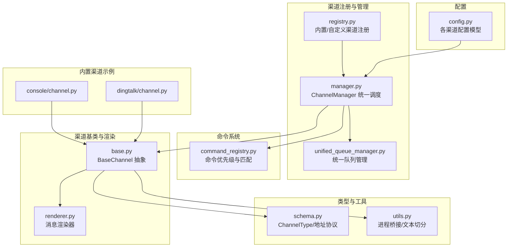
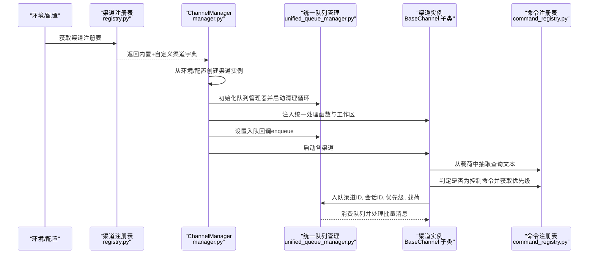
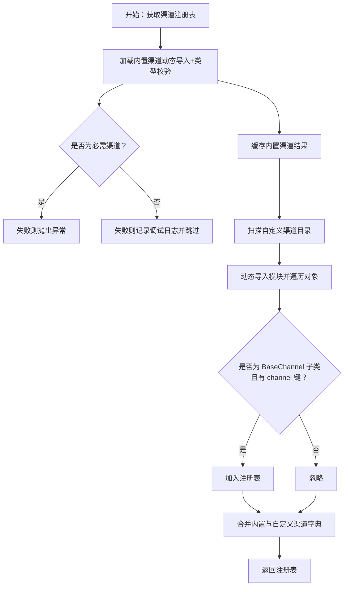
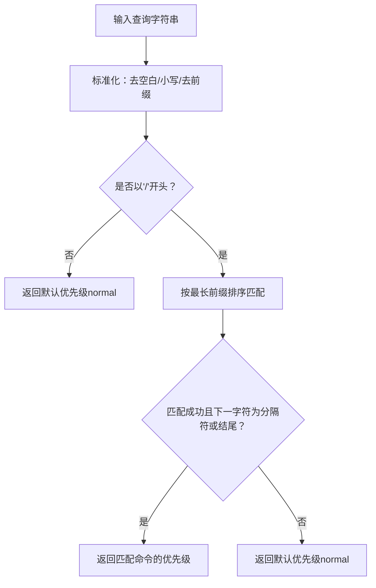
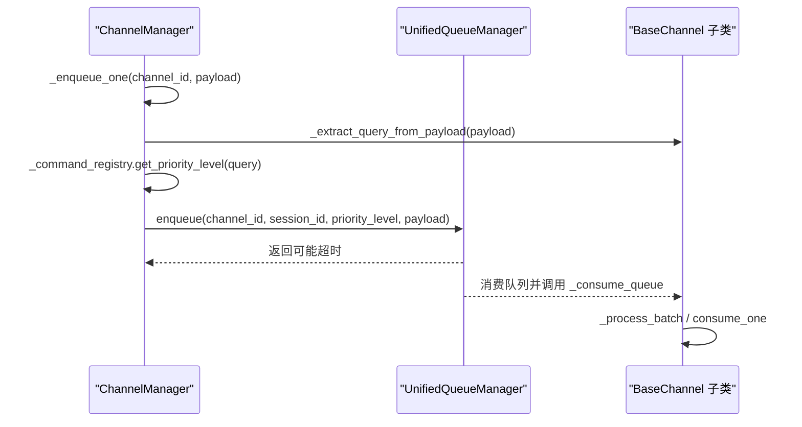
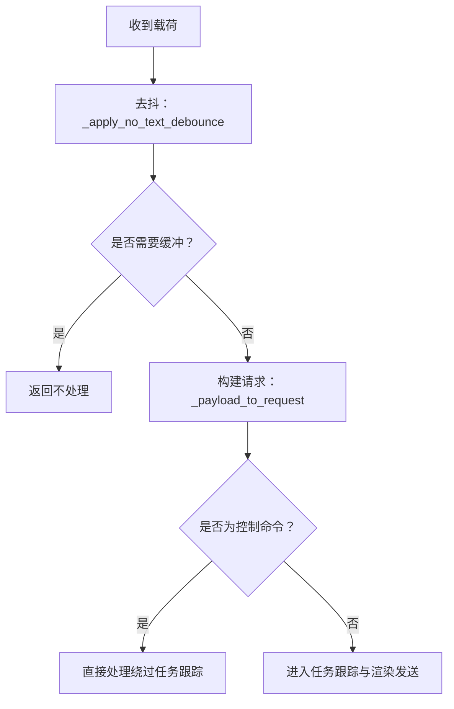
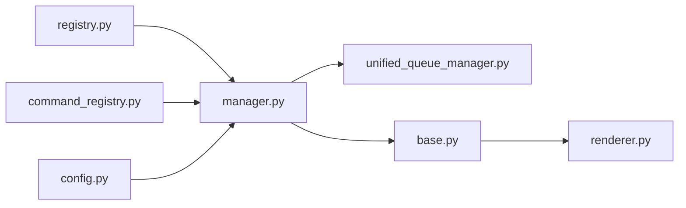

# 渠道注册表

<cite>
**本文引用的文件**
- [registry.py](file://copaw/src/copaw/app/channels/registry.py)
- [command_registry.py](file://copaw/src/copaw/app/channels/command_registry.py)
- [manager.py](file://copaw/src/copaw/app/channels/manager.py)
- [base.py](file://copaw/src/copaw/app/channels/base.py)
- [schema.py](file://copaw/src/copaw/app/channels/schema.py)
- [unified_queue_manager.py](file://copaw/src/copaw/app/channels/unified_queue_manager.py)
- [utils.py](file://copaw/src/copaw/app/channels/utils.py)
- [channel.py（控制台）](file://copaw/src/copaw/app/channels/console/channel.py)
- [channel.py（钉钉）](file://copaw/src/copaw/app/channels/dingtalk/channel.py)
- [config.py](file://copaw/src/copaw/config/config.py)
- [renderer.py](file://copaw/src/copaw/app/channels/renderer.py)
</cite>

## 目录
1. [简介](#简介)
2. [项目结构](#项目结构)
3. [核心组件](#核心组件)
4. [架构总览](#架构总览)
5. [详细组件分析](#详细组件分析)
6. [依赖分析](#依赖分析)
7. [性能考量](#性能考量)
8. [故障排查指南](#故障排查指南)
9. [结论](#结论)
10. [附录：自定义渠道开发指南](#附录自定义渠道开发指南)

## 简介
本文件围绕“渠道注册表”与“命令注册表”的设计与实现进行系统化技术文档整理，重点覆盖：
- 渠道注册表的设计模式与注册机制（内置渠道与自定义渠道）
- 命令注册表的功能（命令优先级分类与查询文本分析）
- 渠道发现与加载的自动化流程（配置文件解析与动态导入）
- 自定义渠道开发指南（接口规范、配置参数、测试方法）
- 注册与运行期最佳实践（错误处理、兼容性检查、性能监控）

## 项目结构
围绕渠道体系的关键目录与文件如下：
- 渠道注册与管理：registry.py、manager.py、unified_queue_manager.py
- 命令路由与优先级：command_registry.py
- 渠道基类与渲染器：base.py、renderer.py
- 渠道类型与地址：schema.py
- 渠道工具与进程桥接：utils.py
- 内置渠道示例：console、dingtalk 等
- 配置模型：config.py

图表来源
- [registry.py:1-194](file://copaw/src/copaw/app/channels/registry.py#L1-L194)
- [manager.py:1-711](file://copaw/src/copaw/app/channels/manager.py#L1-L711)
- [unified_queue_manager.py:1-498](file://copaw/src/copaw/app/channels/unified_queue_manager.py#L1-L498)
- [command_registry.py:1-267](file://copaw/src/copaw/app/channels/command_registry.py#L1-L267)
- [base.py:1-800](file://copaw/src/copaw/app/channels/base.py#L1-L800)
- [renderer.py:1-384](file://copaw/src/copaw/app/channels/renderer.py#L1-L384)
- [schema.py:1-71](file://copaw/src/copaw/app/channels/schema.py#L1-L71)
- [utils.py:1-134](file://copaw/src/copaw/app/channels/utils.py#L1-L134)
- [channel.py（控制台）:1-572](file://copaw/src/copaw/app/channels/console/channel.py#L1-L572)
- [channel.py（钉钉）:1-800](file://copaw/src/copaw/app/channels/dingtalk/channel.py#L1-L800)
- [config.py:1-200](file://copaw/src/copaw/config/config.py#L1-L200)

章节来源
- [registry.py:1-194](file://copaw/src/copaw/app/channels/registry.py#L1-L194)
- [manager.py:1-711](file://copaw/src/copaw/app/channels/manager.py#L1-L711)
- [unified_queue_manager.py:1-498](file://copaw/src/copaw/app/channels/unified_queue_manager.py#L1-L498)
- [command_registry.py:1-267](file://copaw/src/copaw/app/channels/command_registry.py#L1-L267)
- [base.py:1-800](file://copaw/src/copaw/app/channels/base.py#L1-L800)
- [renderer.py:1-384](file://copaw/src/copaw/app/channels/renderer.py#L1-L384)
- [schema.py:1-71](file://copaw/src/copaw/app/channels/schema.py#L1-L71)
- [utils.py:1-134](file://copaw/src/copaw/app/channels/utils.py#L1-L134)
- [channel.py（控制台）:1-572](file://copaw/src/copaw/app/channels/console/channel.py#L1-L572)
- [channel.py（钉钉）:1-800](file://copaw/src/copaw/app/channels/dingtalk/channel.py#L1-L800)
- [config.py:1-200](file://copaw/src/copaw/config/config.py#L1-L200)

## 核心组件
- 渠道注册表（ChannelRegistry）
  - 负责内置渠道与自定义渠道的发现、加载与合并，提供统一的渠道字典供上层使用。
  - 支持缓存内置渠道以避免重复导入，支持在运行时清理缓存用于测试。
- 命令注册表（CommandRegistry）
  - 提供命令前缀到优先级级别的映射，支持默认控制命令注册与扩展注册。
  - 提供查询文本的控制命令判定与优先级提取能力。
- 渠道管理器（ChannelManager）
  - 负责从环境或配置创建渠道实例，注入统一的处理函数与工作区。
  - 将入站消息按会话与优先级路由至统一队列，并通过消费者循环处理。
- 统一队列管理（UnifiedQueueManager）
  - 以三元键（渠道ID、会话ID、优先级）构建队列，支持动态创建与空闲回收。
  - 提供消费回调、指标采集与停止流程。
- 渠道基类（BaseChannel）
  - 规范渠道的生命周期、消息解析、内容合并、去抖动、发送与事件处理。
  - 提供查询文本抽取与控制命令检测，接入任务跟踪与错误处理。
- 消息渲染器（MessageRenderer）
  - 将运行时消息转换为可发送的内容部件，支持过滤与样式控制。

章节来源
- [registry.py:189-194](file://copaw/src/copaw/app/channels/registry.py#L189-L194)
- [command_registry.py:23-267](file://copaw/src/copaw/app/channels/command_registry.py#L23-L267)
- [manager.py:68-213](file://copaw/src/copaw/app/channels/manager.py#L68-L213)
- [unified_queue_manager.py:60-117](file://copaw/src/copaw/app/channels/unified_queue_manager.py#L60-L117)
- [base.py:70-127](file://copaw/src/copaw/app/channels/base.py#L70-L127)
- [renderer.py:78-86](file://copaw/src/copaw/app/channels/renderer.py#L78-L86)

## 架构总览
下图展示从“渠道注册表”到“统一队列管理”的端到端调用链路，以及命令优先级在消息进入队列前的参与路径。

图表来源
- [registry.py:189-194](file://copaw/src/copaw/app/channels/registry.py#L189-L194)
- [manager.py:447-525](file://copaw/src/copaw/app/channels/manager.py#L447-L525)
- [unified_queue_manager.py:119-273](file://copaw/src/copaw/app/channels/unified_queue_manager.py#L119-L273)
- [base.py:697-724](file://copaw/src/copaw/app/channels/base.py#L697-L724)
- [command_registry.py:175-218](file://copaw/src/copaw/app/channels/command_registry.py#L175-L218)

## 详细组件分析

### 渠道注册表（内置与自定义）
- 内置渠道
  - 通过常量表映射渠道键到模块名与类名，使用动态导入加载。
  - 对每个类进行类型校验，确保继承自 BaseChannel 且非抽象类。
  - 对必需渠道（如 console）失败时抛出异常；可选渠道失败仅记录日志并跳过。
  - 使用进程内缓存避免重复导入，提供清理缓存接口用于测试。
- 自定义渠道
  - 在自定义目录扫描 Python 文件与包，动态导入模块。
  - 遍历模块对象，筛选继承自 BaseChannel 的类并读取其 channel 字段作为键。
  - 允许模块级定义“注册应用路由”的钩子，向 FastAPI 应用挂载额外 API。
- 路由挂载规则
  - 自定义渠道可定义模块级函数以注册路由，必须位于 /api 前缀下，否则会被前端捕获器吞掉。
  - 若检测到非 /api 前缀路由，启动时发出警告。

图表来源
- [registry.py:44-77](file://copaw/src/copaw/app/channels/registry.py#L44-L77)
- [registry.py:96-128](file://copaw/src/copaw/app/channels/registry.py#L96-L128)
- [registry.py:134-187](file://copaw/src/copaw/app/channels/registry.py#L134-L187)

章节来源
- [registry.py:20-38](file://copaw/src/copaw/app/channels/registry.py#L20-L38)
- [registry.py:44-77](file://copaw/src/copaw/app/channels/registry.py#L44-L77)
- [registry.py:96-128](file://copaw/src/copaw/app/channels/registry.py#L96-L128)
- [registry.py:134-187](file://copaw/src/copaw/app/channels/registry.py#L134-L187)

### 命令注册表（优先级与查询分析）
- 优先级级别
  - 预定义名称与数值映射：critical(0)、high(10)、normal(20)、low(30)。
  - 支持直接指定数值以插入中间层级（例如 5、15）。
- 默认控制命令
  - 注册常见控制命令（如 /stop）、守护进程命令及其短别名。
- 查询分析
  - is_control_command：对输入字符串进行大小写与空白处理，按最长前缀匹配，要求前缀后为分隔符或结尾。
  - get_priority_level：同上匹配逻辑，返回对应优先级；未命中返回默认值（normal）。
- 名称与查询
  - get_priority_name：将数值映射回预定义名称或生成自定义标记。
  - get_registered_commands：导出全部已注册命令与其优先级。
  - is_registered：判断命令是否已注册。

图表来源
- [command_registry.py:136-173](file://copaw/src/copaw/app/channels/command_registry.py#L136-L173)
- [command_registry.py:175-218](file://copaw/src/copaw/app/channels/command_registry.py#L175-L218)

章节来源
- [command_registry.py:23-62](file://copaw/src/copaw/app/channels/command_registry.py#L23-L62)
- [command_registry.py:64-89](file://copaw/src/copaw/app/channels/command_registry.py#L64-L89)
- [command_registry.py:90-135](file://copaw/src/copaw/app/channels/command_registry.py#L90-L135)
- [command_registry.py:136-173](file://copaw/src/copaw/app/channels/command_registry.py#L136-L173)
- [command_registry.py:175-218](file://copaw/src/copaw/app/channels/command_registry.py#L175-L218)
- [command_registry.py:220-236](file://copaw/src/copaw/app/channels/command_registry.py#L220-L236)
- [command_registry.py:238-256](file://copaw/src/copaw/app/channels/command_registry.py#L238-L256)

### 渠道管理器与统一队列
- 实例化与注入
  - from_env/from_config：根据可用渠道列表与配置创建渠道实例，注入统一处理函数与工作区。
  - set_workspace：向所有渠道注入工作区与命令注册表，以便控制命令检测。
- 入队与路由
  - _enqueue_one：从载荷中抽取查询文本，计算优先级，提取会话ID，异步入队。
  - _enqueue_with_timeout：带超时保护，避免阻塞。
- 消费与批处理
  - _consume_queue：同一队列内的消息按批次合并（Drain + Merge），再调用通道处理逻辑。
  - _process_batch：针对原生载荷与请求载荷分别进行合并与处理。
- 生命周期
  - start_all：初始化队列管理器、启动清理循环、设置入队回调并启动各渠道。
  - stop_all：取消待处理入队任务、停止队列管理器、停止各渠道。

图表来源
- [manager.py:255-301](file://copaw/src/copaw/app/channels/manager.py#L255-L301)
- [manager.py:302-348](file://copaw/src/copaw/app/channels/manager.py#L302-L348)
- [manager.py:362-446](file://copaw/src/copaw/app/channels/manager.py#L362-L446)
- [unified_queue_manager.py:119-163](file://copaw/src/copaw/app/channels/unified_queue_manager.py#L119-L163)
- [base.py:39-66](file://copaw/src/copaw/app/channels/base.py#L39-L66)

章节来源
- [manager.py:68-213](file://copaw/src/copaw/app/channels/manager.py#L68-L213)
- [manager.py:255-348](file://copaw/src/copaw/app/channels/manager.py#L255-L348)
- [manager.py:362-446](file://copaw/src/copaw/app/channels/manager.py#L362-L446)
- [unified_queue_manager.py:60-117](file://copaw/src/copaw/app/channels/unified_queue_manager.py#L60-L117)
- [unified_queue_manager.py:119-273](file://copaw/src/copaw/app/channels/unified_queue_manager.py#L119-L273)

### 渠道基类与消息处理
- 会话与去抖动
  - get_debounce_key：基于会话ID或通道解析逻辑生成去抖键。
  - _debounce_seconds 控制时间去抖；_apply_no_text_debounce：对无文本内容进行缓冲合并。
- 请求构建与发送
  - build_agent_request_from_user_content：将内容部件组装为 AgentRequest。
  - _payload_to_request：将队列载荷转换为请求对象。
  - _consume_one_request：先做去抖与控制命令判定，再交由任务跟踪或直接处理。
- 控制命令检测
  - _extract_query_from_payload：从载荷中抽取文本查询。
  - 与命令注册表协作，非控制命令才进入任务跟踪与并发控制。

图表来源
- [base.py:697-724](file://copaw/src/copaw/app/channels/base.py#L697-L724)
- [base.py:759-800](file://copaw/src/copaw/app/channels/base.py#L759-L800)
- [base.py:210-281](file://copaw/src/copaw/app/channels/base.py#L210-L281)

章节来源
- [base.py:128-146](file://copaw/src/copaw/app/channels/base.py#L128-L146)
- [base.py:210-281](file://copaw/src/copaw/app/channels/base.py#L210-L281)
- [base.py:697-757](file://copaw/src/copaw/app/channels/base.py#L697-L757)
- [base.py:759-800](file://copaw/src/copaw/app/channels/base.py#L759-L800)

### 渲染器与内容部件
- 渲染风格
  - RenderStyle 控制是否显示工具详情、是否支持 Markdown/代码围栏、是否过滤思考块等。
- 内容部件
  - 将消息内容转换为文本、图片、音频、视频、文件、拒绝等部件，便于各渠道发送。
- 过滤策略
  - 可按内部工具集合过滤媒体输出，避免向用户暴露内部工具产生的媒体。

章节来源
- [renderer.py:37-48](file://copaw/src/copaw/app/channels/renderer.py#L37-L48)
- [renderer.py:87-350](file://copaw/src/copaw/app/channels/renderer.py#L87-L350)
- [renderer.py:352-384](file://copaw/src/copaw/app/channels/renderer.py#L352-L384)

### 渠道类型与地址协议
- ChannelType：字符串类型，允许插件自定义键。
- ChannelAddress：统一路由标识，包含 kind/id/extra，并提供 to_handle 转换。
- 内置渠道类型集合：用于区分内置与插件渠道。

章节来源
- [schema.py:12-28](file://copaw/src/copaw/app/channels/schema.py#L12-L28)
- [schema.py:30-48](file://copaw/src/copaw/app/channels/schema.py#L30-L48)

### 工具与进程桥接
- 文本切分：split_text 支持代码围栏边界与换行保留。
- 文件 URL 解析：file_url_to_local_path 支持 file:// 与本地路径。
- 进程桥接：make_process_from_runner 将 runner.stream_query 作为渠道处理函数。

章节来源
- [utils.py:18-75](file://copaw/src/copaw/app/channels/utils.py#L18-L75)
- [utils.py:78-118](file://copaw/src/copaw/app/channels/utils.py#L78-L118)
- [utils.py:121-134](file://copaw/src/copaw/app/channels/utils.py#L121-L134)

### 内置渠道示例
- 控制台渠道（ConsoleChannel）
  - 从环境变量或配置创建，支持工具细节与思考过滤。
  - 将 AgentResponse 渲染为终端可读输出，支持媒体文件解析与推送。
- 钉钉渠道（DingTalkChannel）
  - 支持会话 Webhook 推送、AI卡片流式布局、去重与令牌刷新。
  - 通过会话ID短后缀进行定时任务路由，持久化存储 Webhook 映射。

章节来源
- [channel.py（控制台）:63-190](file://copaw/src/copaw/app/channels/console/channel.py#L63-L190)
- [channel.py（钉钉）:89-273](file://copaw/src/copaw/app/channels/dingtalk/channel.py#L89-L273)

## 依赖分析
- 渠道注册表依赖
  - 常量：内置渠道映射与必需渠道集合。
  - 动态导入：按模块名导入类并校验类型。
  - 自定义目录扫描：sys.path 插入与模块导入。
- 命令注册表依赖
  - 字典映射：命令前缀到优先级。
  - 查询匹配：按最长前缀排序匹配。
- 渠道管理器依赖
  - 注册表：获取渠道类。
  - 配置：读取可用渠道与各渠道配置。
  - 统一队列管理：按（渠道ID, 会话ID, 优先级）入队与消费。
- 渠道基类依赖
  - 渲染器：将消息转为内容部件。
  - 消息类型：使用运行时消息与内容类型。
- 统一队列管理依赖
  - 数据类：QueueKey 三元组。
  - 异步队列与任务：动态创建消费者任务与空闲回收。

图表来源
- [registry.py:189-194](file://copaw/src/copaw/app/channels/registry.py#L189-L194)
- [manager.py:79-81](file://copaw/src/copaw/app/channels/manager.py#L79-L81)
- [unified_queue_manager.py:30-38](file://copaw/src/copaw/app/channels/unified_queue_manager.py#L30-L38)
- [base.py:36-37](file://copaw/src/copaw/app/channels/base.py#L36-L37)
- [renderer.py:14-22](file://copaw/src/copaw/app/channels/renderer.py#L14-L22)
- [config.py:36-48](file://copaw/src/copaw/config/config.py#L36-L48)

章节来源
- [registry.py:1-194](file://copaw/src/copaw/app/channels/registry.py#L1-L194)
- [command_registry.py:1-267](file://copaw/src/copaw/app/channels/command_registry.py#L1-L267)
- [manager.py:1-711](file://copaw/src/copaw/app/channels/manager.py#L1-L711)
- [unified_queue_manager.py:1-498](file://copaw/src/copaw/app/channels/unified_queue_manager.py#L1-L498)
- [base.py:1-800](file://copaw/src/copaw/app/channels/base.py#L1-L800)
- [renderer.py:1-384](file://copaw/src/copaw/app/channels/renderer.py#L1-L384)
- [config.py:1-200](file://copaw/src/copaw/config/config.py#L1-L200)

## 性能考量
- 队列与批处理
  - 统一队列按（渠道ID, 会话ID, 优先级）隔离，支持同键严格序列化与不同键并发处理。
  - 消费者循环在入队后立即拉取一批消息进行合并，减少通道处理开销。
- 去抖与缓冲
  - 时间去抖与“无文本缓冲”策略降低无效渲染与网络调用。
- 超时与清理
  - 入队与消费均设置超时，空闲队列定期回收，避免资源泄漏。
- 日志与可观测性
  - 关键路径记录调试/信息/警告日志，便于定位性能瓶颈与异常。

章节来源
- [unified_queue_manager.py:119-163](file://copaw/src/copaw/app/channels/unified_queue_manager.py#L119-L163)
- [unified_queue_manager.py:376-427](file://copaw/src/copaw/app/channels/unified_queue_manager.py#L376-L427)
- [base.py:669-695](file://copaw/src/copaw/app/channels/base.py#L669-L695)
- [base.py:250-281](file://copaw/src/copaw/app/channels/base.py#L250-L281)

## 故障排查指南
- 渠道加载失败
  - 内置渠道：必需渠道失败会抛出异常；可选渠道失败记录调试日志并跳过。
  - 自定义渠道：模块导入异常会记录异常并跳过该模块。
- 路由挂载问题
  - 自定义渠道若注册非 /api 前缀路由，启动时会发出警告，需调整为 /api 前缀。
- 控制命令误判
  - 查询文本需以“/”开头且后跟分隔符或结尾，否则不会被识别为控制命令。
- 队列积压与超时
  - 入队/消费超时会记录警告，检查下游处理耗时与队列容量。
- 会话与去抖异常
  - 无文本消息会缓冲，若长时间无后续文本，需确认上游是否正确触发合并。

章节来源
- [registry.py:62-76](file://copaw/src/copaw/app/channels/registry.py#L62-L76)
- [registry.py:176-186](file://copaw/src/copaw/app/channels/registry.py#L176-L186)
- [command_registry.py:151-173](file://copaw/src/copaw/app/channels/command_registry.py#L151-L173)
- [unified_queue_manager.py:146-156](file://copaw/src/copaw/app/channels/unified_queue_manager.py#L146-L156)
- [base.py:250-281](file://copaw/src/copaw/app/channels/base.py#L250-L281)

## 结论
- 渠道注册表通过“内置清单 + 动态导入 + 类型校验 + 缓存”实现了稳定可靠的渠道发现与加载。
- 命令注册表以“前缀最长匹配 + 优先级映射”提供了灵活的控制命令路由。
- ChannelManager 与 UnifiedQueueManager 协作，实现了“按会话与优先级隔离”的高并发处理。
- BaseChannel 与 Renderer 统一了消息解析与发送流程，保证跨渠道一致性。
- 建议在生产环境中启用必要的日志级别、监控队列指标，并对自定义渠道的路由前缀进行强制校验。

## 附录：自定义渠道开发指南
- 接口规范
  - 继承 BaseChannel，至少实现以下类方法：from_env、from_config。
  - 若需要统一队列管理，保持 uses_manager_queue 为 True（默认）。
  - 实现 build_agent_request_from_native，将原生载荷解析为运行时消息。
  - 可选：重写 resolve_session_id、merge_native_items、merge_requests 等以适配渠道特性。
- 配置参数
  - 使用 BaseChannelConfig 或派生配置类，定义 enabled、bot_prefix、过滤选项等。
  - 通过 from_config 注入配置，支持 dict 与 Pydantic 对象两种形式。
- 路由挂载
  - 在自定义渠道模块中定义 register_app_routes(app)，挂载 /api 前缀路由。
  - 避免注册非 /api 前缀路由，否则会被前端捕获器吞掉。
- 测试方法
  - 使用 clear_builtin_channel_cache 清理内置渠道缓存，确保测试隔离。
  - 通过 ChannelManager.from_config 创建渠道实例，注入测试用的处理函数与工作区。
  - 使用 UnifiedQueueManager 的 get_metrics 与 clear_queue 辅助验证队列行为。
- 最佳实践
  - 错误处理：在渠道生命周期与消息处理中捕获异常并记录日志，避免中断队列。
  - 兼容性检查：在 from_config 中对缺失字段进行默认值处理，避免运行时崩溃。
  - 性能监控：关注队列长度、处理耗时与空闲回收频率，必要时调整队列容量与超时阈值。

章节来源
- [base.py:538-555](file://copaw/src/copaw/app/channels/base.py#L538-L555)
- [base.py:604-630](file://copaw/src/copaw/app/channels/base.py#L604-L630)
- [config.py:36-48](file://copaw/src/copaw/config/config.py#L36-L48)
- [registry.py:134-187](file://copaw/src/copaw/app/channels/registry.py#L134-L187)
- [manager.py:108-213](file://copaw/src/copaw/app/channels/manager.py#L108-L213)
- [unified_queue_manager.py:430-471](file://copaw/src/copaw/app/channels/unified_queue_manager.py#L430-L471)