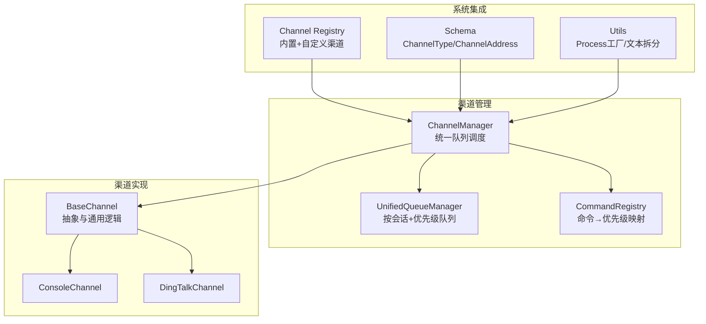
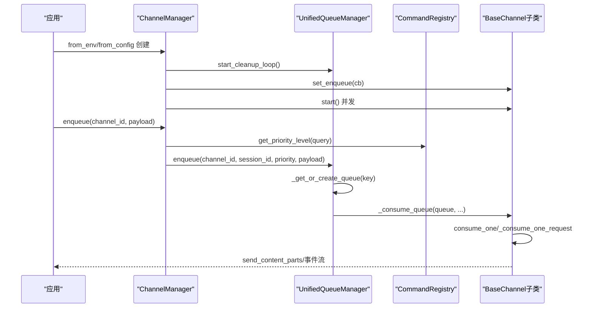
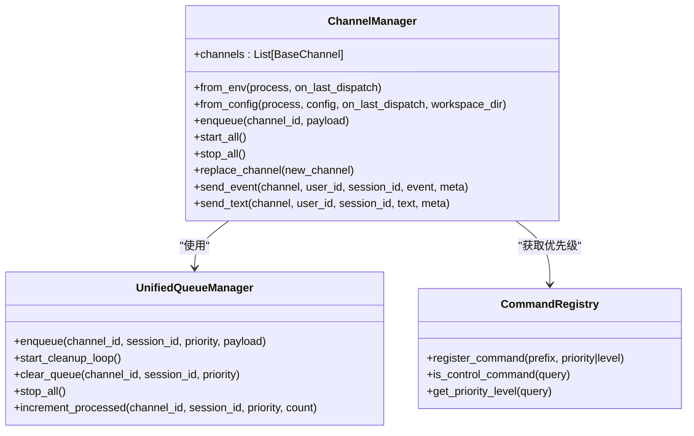
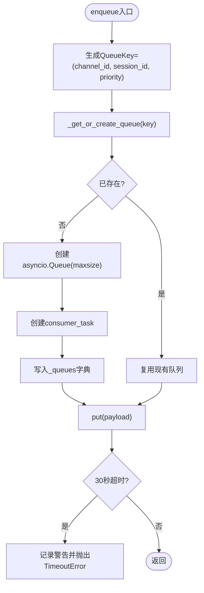
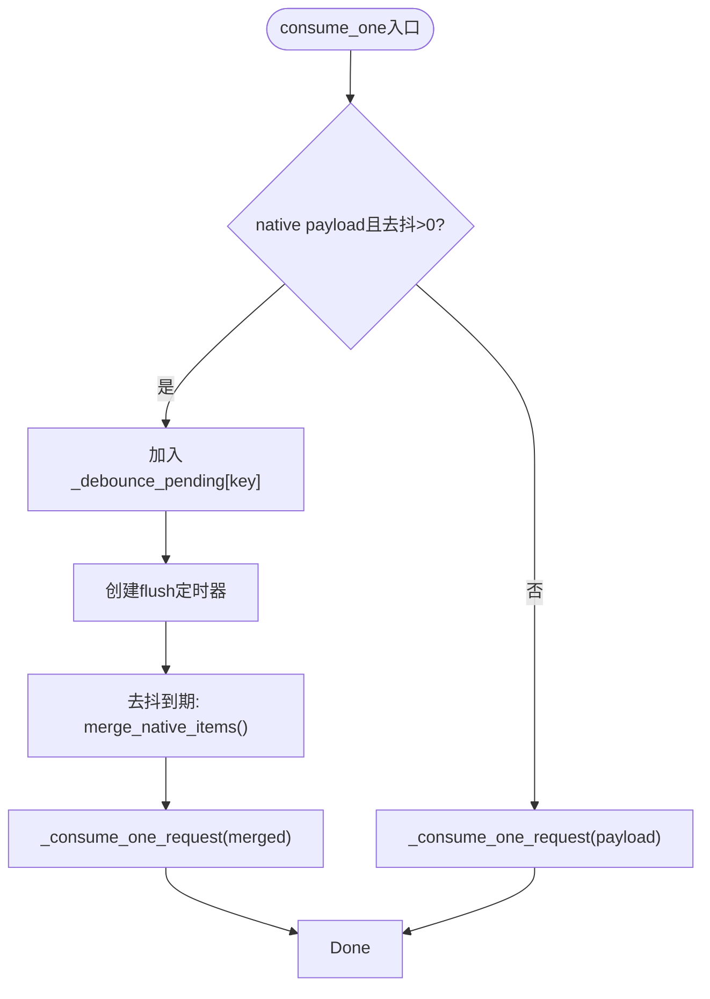
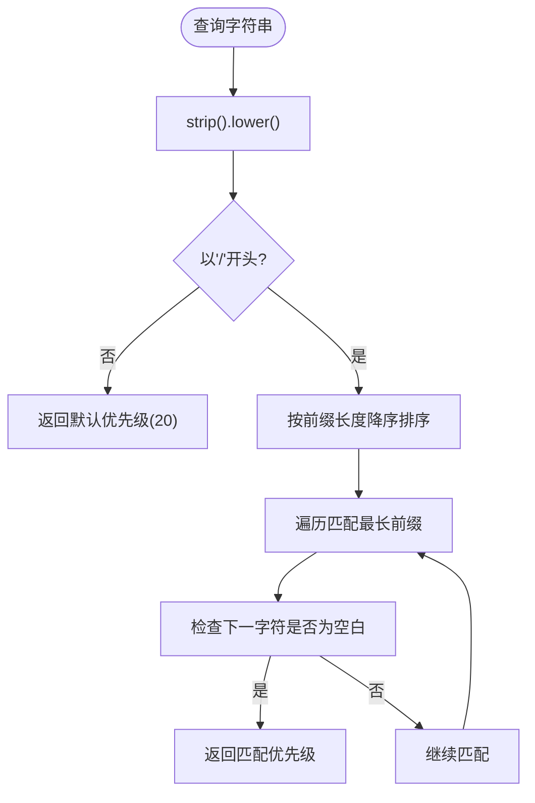
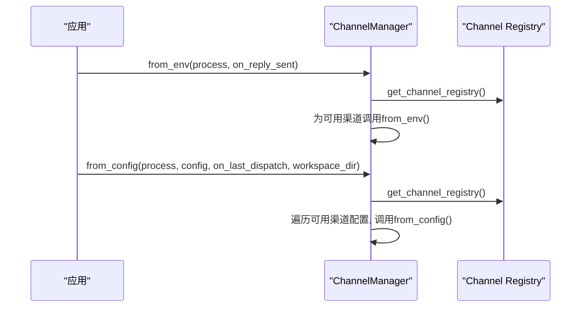
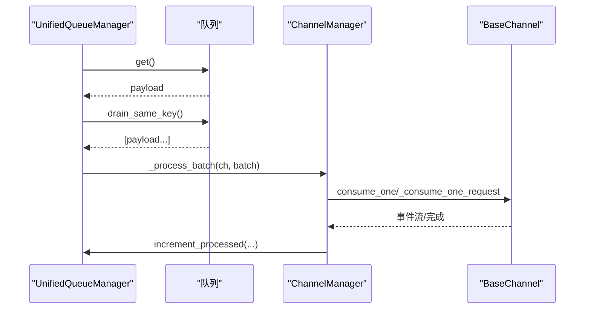
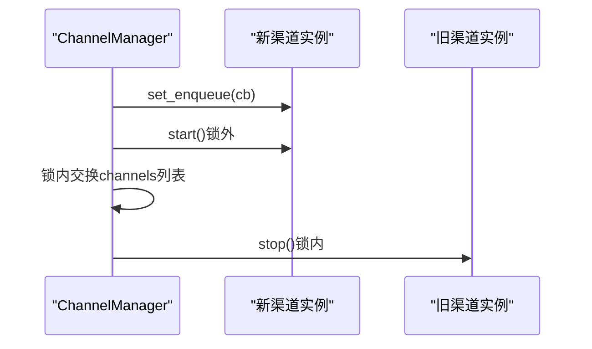
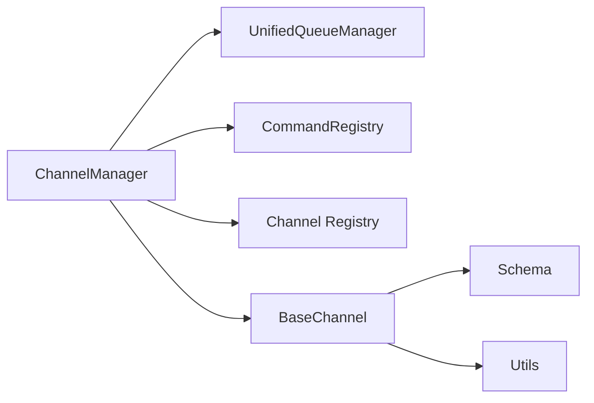

# 渠道管理器

<cite>
**本文引用的文件**
- [manager.py](file://copaw/src/copaw/app/channels/manager.py)
- [unified_queue_manager.py](file://copaw/src/copaw/app/channels/unified_queue_manager.py)
- [base.py](file://copaw/src/copaw/app/channels/base.py)
- [command_registry.py](file://copaw/src/copaw/app/channels/command_registry.py)
- [registry.py](file://copaw/src/copaw/app/channels/registry.py)
- [schema.py](file://copaw/src/copaw/app/channels/schema.py)
- [utils.py](file://copaw/src/copaw/app/channels/utils.py)
- [__init__.py](file://copaw/src/copaw/app/channels/__init__.py)
- [console/channel.py](file://copaw/src/copaw/app/channels/console/channel.py)
- [dingtalk/channel.py](file://copaw/src/copaw/app/channels/dingtalk/channel.py)
</cite>

## 目录
1. [简介](#简介)
2. [项目结构](#项目结构)
3. [核心组件](#核心组件)
4. [架构总览](#架构总览)
5. [详细组件分析](#详细组件分析)
6. [依赖分析](#依赖分析)
7. [性能考虑](#性能考虑)
8. [故障排查指南](#故障排查指南)
9. [结论](#结论)
10. [附录](#附录)

## 简介
本文件面向ChannelManager渠道管理器，系统性阐述其统一队列管理系统的设计与实现，覆盖渠道初始化（from_env与from_config）、消息路由（优先级分类、会话ID提取、批处理）、异步消费循环（队列管理、批处理合并、错误处理）、渠道替换与动态管理（零停机热重载）以及性能优化与最佳实践。文档同时提供可视化图示与分层讲解，帮助读者快速掌握ChannelManager的内部机制与使用方法。

## 项目结构
ChannelManager位于copaw应用的channels子系统中，围绕BaseChannel抽象与统一队列管理器实现多渠道接入与并发控制。关键文件与职责如下：
- manager.py：ChannelManager主体，负责渠道生命周期、统一队列调度、优先级路由与动态替换。
- unified_queue_manager.py：统一队列管理器，基于三元键（渠道ID、会话ID、优先级）实现按会话与优先级隔离的队列与消费者。
- base.py：渠道基类，定义consume_one、_consume_one_request、去抖与批处理等通用逻辑。
- command_registry.py：命令注册表，将用户查询映射到优先级级别，驱动统一队列的优先级路由。
- registry.py：渠道注册表，聚合内置与自定义渠道类，支持延迟加载与缓存。
- schema.py：渠道类型与地址模型，统一发送路由标识。
- utils.py：通道与Runner桥接工具，提供文本拆分、本地文件URL解析等辅助。
- console/channel.py：控制台渠道示例，展示如何实现渠道的from_env/from_config与消息发送。
- dingtalk/channel.py：钉钉渠道示例，展示复杂渠道的会话Webhook存储与回复机制。

**图表来源**
- [manager.py:68-110](file://copaw/src/copaw/app/channels/manager.py#L68-L110)
- [unified_queue_manager.py:60-118](file://copaw/src/copaw/app/channels/unified_queue_manager.py#L60-L118)
- [base.py:70-120](file://copaw/src/copaw/app/channels/base.py#L70-L120)
- [command_registry.py:23-62](file://copaw/src/copaw/app/channels/command_registry.py#L23-L62)
- [registry.py:189-194](file://copaw/src/copaw/app/channels/registry.py#L189-L194)
- [schema.py:12-48](file://copaw/src/copaw/app/channels/schema.py#L12-L48)
- [utils.py:121-134](file://copaw/src/copaw/app/channels/utils.py#L121-L134)

**章节来源**
- [manager.py:68-110](file://copaw/src/copaw/app/channels/manager.py#L68-L110)
- [unified_queue_manager.py:60-118](file://copaw/src/copaw/app/channels/unified_queue_manager.py#L60-L118)
- [base.py:70-120](file://copaw/src/copaw/app/channels/base.py#L70-L120)
- [command_registry.py:23-62](file://copaw/src/copaw/app/channels/command_registry.py#L23-L62)
- [registry.py:189-194](file://copaw/src/copaw/app/channels/registry.py#L189-L194)
- [schema.py:12-48](file://copaw/src/copaw/app/channels/schema.py#L12-L48)
- [utils.py:121-134](file://copaw/src/copaw/app/channels/utils.py#L121-L134)

## 核心组件
- ChannelManager：持有渠道列表与统一队列管理器，提供start_all/stop_all/replace_channel/enqueue/send_event/send_text等能力。
- UnifiedQueueManager：按QueueKey=(channel_id, session_id, priority_level)创建队列与消费者任务，支持自动清理空闲队列与增量计数。
- BaseChannel：定义consume_one/_consume_one_request、去抖与批处理、会话ID解析、消息渲染与发送等通用流程。
- CommandRegistry：命令前缀→优先级映射，支持“critical/high/normal/low”等预设优先级与灵活扩展。
- Channel Registry：内置渠道与自定义渠道的动态发现与缓存，支持失败不中断与必要渠道强制加载。
- Schema：ChannelType与ChannelAddress，统一发送路由标识。
- Utils：make_process_from_runner桥接Runner与Channel，split_text文本拆分，file_url解析。

**章节来源**
- [manager.py:68-110](file://copaw/src/copaw/app/channels/manager.py#L68-L110)
- [unified_queue_manager.py:60-118](file://copaw/src/copaw/app/channels/unified_queue_manager.py#L60-L118)
- [base.py:70-120](file://copaw/src/copaw/app/channels/base.py#L70-L120)
- [command_registry.py:23-62](file://copaw/src/copaw/app/channels/command_registry.py#L23-L62)
- [registry.py:189-194](file://copaw/src/copaw/app/channels/registry.py#L189-L194)
- [schema.py:12-48](file://copaw/src/copaw/app/channels/schema.py#L12-L48)
- [utils.py:121-134](file://copaw/src/copaw/app/channels/utils.py#L121-L134)

## 架构总览
ChannelManager通过统一队列系统实现“按会话+按优先级”的并发隔离与严格串行化，结合CommandRegistry的命令优先级映射，确保控制命令与常规消息的差异化处理。渠道实例由Channel Registry动态发现，支持from_env与from_config两种初始化路径，最终由ChannelManager统一编排。

**图表来源**
- [manager.py:86-110](file://copaw/src/copaw/app/channels/manager.py#L86-L110)
- [manager.py:215-301](file://copaw/src/copaw/app/channels/manager.py#L215-L301)
- [unified_queue_manager.py:119-164](file://copaw/src/copaw/app/channels/unified_queue_manager.py#L119-L164)
- [unified_queue_manager.py:165-213](file://copaw/src/copaw/app/channels/unified_queue_manager.py#L165-L213)
- [base.py:659-758](file://copaw/src/copaw/app/channels/base.py#L659-L758)

## 详细组件分析

### ChannelManager：统一队列与动态管理
- 初始化与创建
  - from_env：从环境变量与可用渠道注册表创建渠道实例，注入统一process与on_reply_sent回调。
  - from_config：从配置对象读取各渠道配置，过滤禁用渠道，按渠道签名动态构造实例。
- 队列与路由
  - enqueue：线程安全入队，提取查询文本→优先级→会话ID→调用UnifiedQueueManager.enqueue。
  - _enqueue_with_timeout：带超时保护，避免阻塞。
  - _consume_queue：统一消费者循环，按队列 drained后批处理，调用_process_batch合并请求。
- 生命周期与动态替换
  - start_all：初始化UQM、启动清理循环、为渠道设置入队回调并并发启动。
  - stop_all：取消enqueue任务、停止UQM、清空回调并逆序停止渠道。
  - replace_channel：预创建队列与消费者、锁外启动新渠道、锁内交换并停止旧渠道，实现零停机热重载。

**图表来源**
- [manager.py:68-110](file://copaw/src/copaw/app/channels/manager.py#L68-L110)
- [unified_queue_manager.py:60-118](file://copaw/src/copaw/app/channels/unified_queue_manager.py#L60-L118)
- [command_registry.py:23-62](file://copaw/src/copaw/app/channels/command_registry.py#L23-L62)

**章节来源**
- [manager.py:86-110](file://copaw/src/copaw/app/channels/manager.py#L86-L110)
- [manager.py:108-213](file://copaw/src/copaw/app/channels/manager.py#L108-L213)
- [manager.py:215-301](file://copaw/src/copaw/app/channels/manager.py#L215-L301)
- [manager.py:362-446](file://copaw/src/copaw/app/channels/manager.py#L362-L446)
- [manager.py:447-525](file://copaw/src/copaw/app/channels/manager.py#L447-L525)
- [manager.py:571-630](file://copaw/src/copaw/app/channels/manager.py#L571-L630)

### UnifiedQueueManager：按会话+优先级的队列系统
- QueueKey设计：(channel_id, session_id, priority_level)，确保同一会话与优先级内的严格串行化。
- 动态消费者：首次入队时创建队列与消费者任务，按需增长，避免固定worker池。
- 自动清理：后台任务定期扫描空闲队列，超过idle_timeout则取消消费者并移除。
- 计数与监控：提供processed_count与增量计数接口，便于观测处理进度。

**图表来源**
- [unified_queue_manager.py:119-164](file://copaw/src/copaw/app/channels/unified_queue_manager.py#L119-L164)
- [unified_queue_manager.py:165-213](file://copaw/src/copaw/app/channels/unified_queue_manager.py#L165-L213)
- [unified_queue_manager.py:274-290](file://copaw/src/copaw/app/channels/unified_queue_manager.py#L274-L290)
- [unified_queue_manager.py:376-428](file://copaw/src/copaw/app/channels/unified_queue_manager.py#L376-L428)

**章节来源**
- [unified_queue_manager.py:60-118](file://copaw/src/copaw/app/channels/unified_queue_manager.py#L60-L118)
- [unified_queue_manager.py:119-164](file://copaw/src/copaw/app/channels/unified_queue_manager.py#L119-L164)
- [unified_queue_manager.py:165-213](file://copaw/src/copaw/app/channels/unified_queue_manager.py#L165-L213)
- [unified_queue_manager.py:274-290](file://copaw/src/copaw/app/channels/unified_queue_manager.py#L274-L290)
- [unified_queue_manager.py:376-428](file://copaw/src/copaw/app/channels/unified_queue_manager.py#L376-L428)
- [unified_queue_manager.py:430-471](file://copaw/src/copaw/app/channels/unified_queue_manager.py#L430-L471)

### BaseChannel：消息处理与去抖/批处理
- consume_one：支持时间去抖（native payload）与内容去抖（无文本缓冲），随后调用_consume_one_request。
- _consume_one_request：将payload转为AgentRequest，经workspace/task_tracker跟踪，流式产出事件，完成后触发_on_reply_sent。
- merge_native_items/merge_requests：对native与AgentRequest进行合并，支持meta键保留与内容拼接。
- resolve_session_id/get_debounce_key：统一会话键生成，确保同一会话严格串行化。

**图表来源**
- [base.py:659-758](file://copaw/src/copaw/app/channels/base.py#L659-L758)
- [base.py:128-146](file://copaw/src/copaw/app/channels/base.py#L128-L146)
- [base.py:147-177](file://copaw/src/copaw/app/channels/base.py#L147-L177)
- [base.py:178-209](file://copaw/src/copaw/app/channels/base.py#L178-L209)

**章节来源**
- [base.py:659-758](file://copaw/src/copaw/app/channels/base.py#L659-L758)
- [base.py:128-146](file://copaw/src/copaw/app/channels/base.py#L128-L146)
- [base.py:147-177](file://copaw/src/copaw/app/channels/base.py#L147-L177)
- [base.py:178-209](file://copaw/src/copaw/app/channels/base.py#L178-L209)

### CommandRegistry：命令优先级路由
- 默认控制命令：/stop、/daemon系列短命令等，映射到“critical”或“high”优先级。
- 查询匹配：按最长前缀匹配，支持空格/制表符终止，未命中则返回默认“normal”。

**图表来源**
- [command_registry.py:175-218](file://copaw/src/copaw/app/channels/command_registry.py#L175-L218)

**章节来源**
- [command_registry.py:23-62](file://copaw/src/copaw/app/channels/command_registry.py#L23-L62)
- [command_registry.py:175-218](file://copaw/src/copaw/app/channels/command_registry.py#L175-L218)

### 渠道初始化：from_env 与 from_config
- from_env：读取可用渠道列表与注册表，逐个调用渠道类的from_env，注入统一process与on_reply_sent回调。
- from_config：读取配置对象的channels字段，支持Pydantic对象与自定义字典，按enabled过滤，动态构造渠道实例，捕获初始化异常并跳过。

**图表来源**
- [manager.py:86-106](file://copaw/src/copaw/app/channels/manager.py#L86-L106)
- [manager.py:108-213](file://copaw/src/copaw/app/channels/manager.py#L108-L213)
- [registry.py:189-194](file://copaw/src/copaw/app/channels/registry.py#L189-L194)

**章节来源**
- [manager.py:86-106](file://copaw/src/copaw/app/channels/manager.py#L86-L106)
- [manager.py:108-213](file://copaw/src/copaw/app/channels/manager.py#L108-L213)
- [registry.py:189-194](file://copaw/src/copaw/app/channels/registry.py#L189-L194)

### 异步消费循环：批处理与错误处理
- _consume_queue：从队列取出payload，drain同键队列形成batch，调用_process_batch进行合并与处理，更新processed_count。
- _process_batch：针对钉钉等渠道的native合并逻辑，以及普通AgentRequest的合并逻辑，最后调用consume_one或_consume_one_request。
- 错误处理：消费者循环捕获异常并记录日志，支持CancelledError优雅退出。

**图表来源**
- [manager.py:362-446](file://copaw/src/copaw/app/channels/manager.py#L362-L446)
- [manager.py:39-66](file://copaw/src/copaw/app/channels/manager.py#L39-L66)

**章节来源**
- [manager.py:362-446](file://copaw/src/copaw/app/channels/manager.py#L362-L446)
- [manager.py:39-66](file://copaw/src/copaw/app/channels/manager.py#L39-L66)

### 渠道替换与动态管理：零停机热重载
- replace_channel：预创建队列与消费者任务、在锁外启动新渠道、在锁内交换并停止旧渠道，确保其他渠道不受影响。
- 适用场景：配置变更、密钥轮换、渠道升级等需要不停服的场景。

**图表来源**
- [manager.py:571-630](file://copaw/src/copaw/app/channels/manager.py#L571-L630)

**章节来源**
- [manager.py:571-630](file://copaw/src/copaw/app/channels/manager.py#L571-L630)

### 示例渠道：ConsoleChannel 与 DingTalkChannel
- ConsoleChannel：从env/config读取配置，解析上传媒体引用，将消息内容打印到终端并推送前端。
- DingTalkChannel：支持会话Webhook存储与恢复、消息去重、AI卡片与Markdown卡片发送、Open API回退等复杂逻辑。

**章节来源**
- [console/channel.py:141-190](file://copaw/src/copaw/app/channels/console/channel.py#L141-L190)
- [dingtalk/channel.py:201-273](file://copaw/src/copaw/app/channels/dingtalk/channel.py#L201-L273)

## 依赖分析
- ChannelManager依赖：
  - UnifiedQueueManager：队列与消费者管理。
  - CommandRegistry：命令优先级映射。
  - Channel Registry：渠道类发现与缓存。
  - BaseChannel：渠道抽象与通用逻辑。
- BaseChannel依赖：
  - MessageRenderer/RenderStyle：消息渲染与过滤策略。
  - Runner ProcessHandler：统一Agent请求处理。
- Schema与Utils：
  - ChannelType/ChannelAddress：统一路由标识。
  - make_process_from_runner：Runner桥接。

**图表来源**
- [manager.py:21-28](file://copaw/src/copaw/app/channels/manager.py#L21-L28)
- [base.py:36-46](file://copaw/src/copaw/app/channels/base.py#L36-L46)
- [schema.py:12-48](file://copaw/src/copaw/app/channels/schema.py#L12-L48)
- [utils.py:121-134](file://copaw/src/copaw/app/channels/utils.py#L121-L134)

**章节来源**
- [manager.py:21-28](file://copaw/src/copaw/app/channels/manager.py#L21-L28)
- [base.py:36-46](file://copaw/src/copaw/app/channels/base.py#L36-L46)
- [schema.py:12-48](file://copaw/src/copaw/app/channels/schema.py#L12-L48)
- [utils.py:121-134](file://copaw/src/copaw/app/channels/utils.py#L121-L134)

## 性能考虑
- 队列大小与超时
  - UnifiedQueueManager默认maxsize=1000，enqueue带30秒超时，防止阻塞；可根据业务峰值调整。
  - ChannelManager默认_channel_queue_maxsize=1000，避免单渠道堆积。
- 并发与隔离
  - 按QueueKey隔离，同一会话+优先级严格串行，不同会话与优先级并发执行，最大化吞吐。
- 批处理与去抖
  - 消费者drain同键队列形成batch，减少渠道侧调用次数；native payload时间去抖降低抖动风暴。
- 清理与资源
  - 后台清理空闲队列，idle_timeout默认600秒，cleanup_interval默认60秒；stop_all取消消费者并清空状态，避免资源泄漏。
- 最佳实践
  - 控制命令使用“critical”优先级，确保及时响应。
  - 大文本消息使用split_text拆分，避免平台限制。
  - 钉钉等渠道注意会话Webhook有效期与回退策略。

[本节为一般性指导，无需列出章节来源]

## 故障排查指南
- 启动失败
  - 检查Channel Registry是否成功加载内置渠道；自定义渠道导入异常会被记录并跳过。
  - from_config中初始化异常被捕获并记录，确认配置字段与渠道签名一致。
- 消费异常
  - 消费者循环捕获异常并记录日志；检查渠道的consume_one实现与外部API调用。
- 去抖与乱序
  - 确认get_debounce_key返回稳定会话键；检查去抖缓冲与定时器释放。
- 线程安全问题
  - 确保通过ChannelManager.enqueue进行入队；避免在非事件循环线程直接访问队列。
- 资源泄漏
  - 停止时确认消费者任务被取消且等待完成；渠道stop应释放HTTP客户端、定时器与存储。
- 动态替换
  - replace_channel在锁外启动新渠道，锁内交换并停止旧渠道；如新渠道启动失败，会回滚并记录异常。

**章节来源**
- [registry.py:42-87](file://copaw/src/copaw/app/channels/registry.py#L42-L87)
- [manager.py:108-213](file://copaw/src/copaw/app/channels/manager.py#L108-L213)
- [manager.py:362-446](file://copaw/src/copaw/app/channels/manager.py#L362-L446)
- [base.py:659-758](file://copaw/src/copaw/app/channels/base.py#L659-L758)

## 结论
ChannelManager通过统一队列管理、命令优先级路由与动态渠道替换，为多渠道接入提供了高并发、强隔离与可扩展的基础设施。结合BaseChannel的通用逻辑与Channel Registry的动态发现，系统在保证稳定性的同时，具备良好的可维护性与演进空间。遵循本文的初始化、生命周期管理与性能优化建议，可显著提升系统的可靠性与可运维性。

[本节为总结性内容，无需列出章节来源]

## 附录
- 初始化与生命周期
  - from_env：从环境变量与可用渠道注册表创建渠道实例，注入统一process与回调。
  - from_config：从配置对象读取渠道配置，按enabled过滤并动态构造实例。
  - start_all：创建队列、注册回调、启动消费者任务并逐个启动渠道。
  - stop_all：取消消费者任务、清空状态并停止各渠道。
- 扩展新渠道
  - 继承BaseChannel，实现from_env/from_config与build_agent_request_from_native。
  - 如需时间去抖或会话去重，设置_debounce_seconds与get_debounce_key。
  - 实现send_content_parts或更细粒度的send_*方法；如需媒体附件，实现send_media。
  - 将新渠道类放入自定义渠道目录，确保类名与channel属性正确，通过注册表自动发现。

**章节来源**
- [manager.py:86-110](file://copaw/src/copaw/app/channels/manager.py#L86-L110)
- [manager.py:108-213](file://copaw/src/copaw/app/channels/manager.py#L108-L213)
- [manager.py:362-446](file://copaw/src/copaw/app/channels/manager.py#L362-L446)
- [base.py:659-758](file://copaw/src/copaw/app/channels/base.py#L659-L758)
- [registry.py:94-137](file://copaw/src/copaw/app/channels/registry.py#L94-L137)