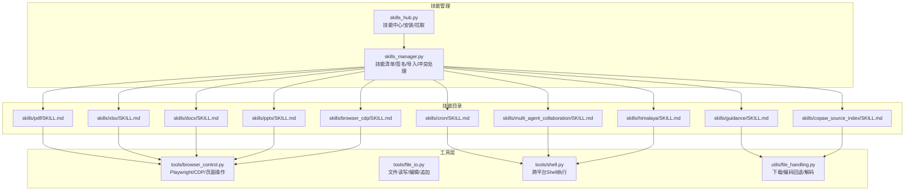
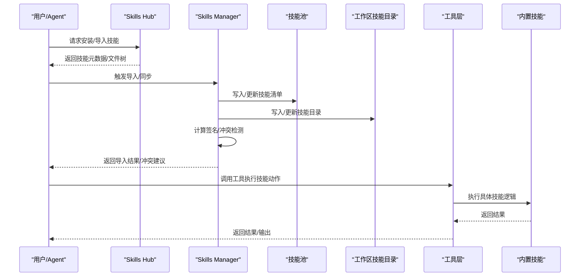
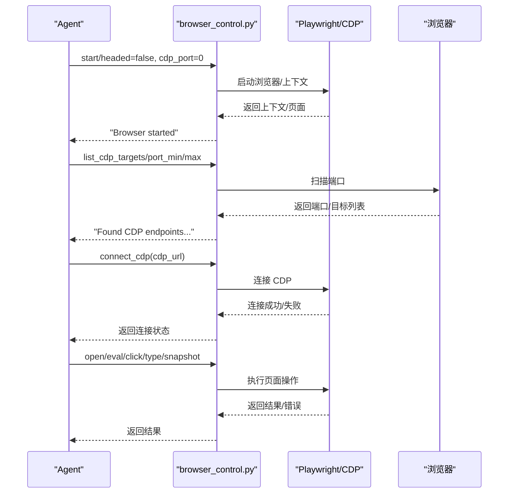
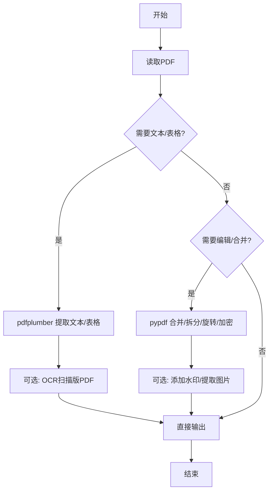
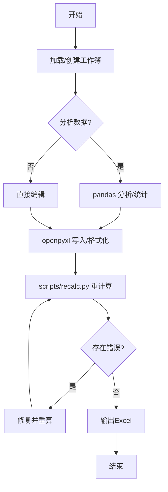
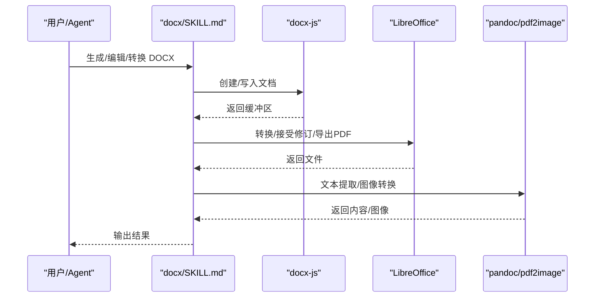
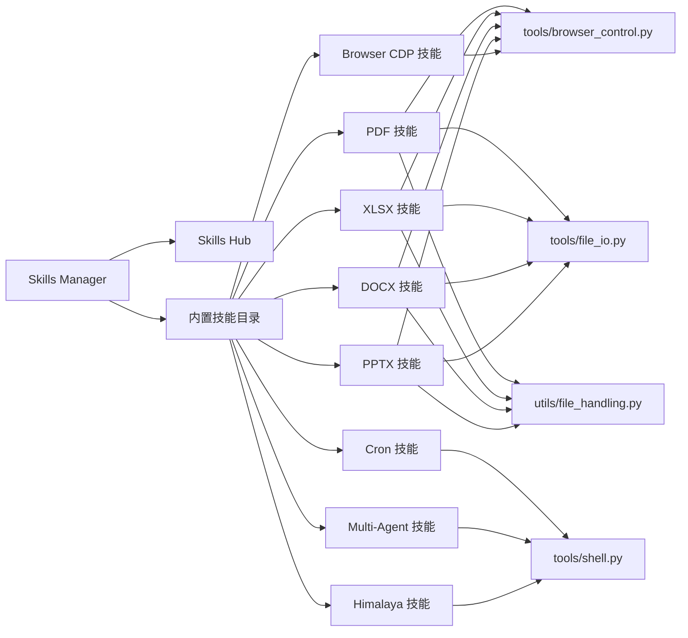

# 内置技能

<cite>
**本文引用的文件**
- [skills_hub.py](file://copaw/src/copaw/agents/skills_hub.py)
- [skills_manager.py](file://copaw/src/copaw/agents/skills_manager.py)
- [browser_control.py](file://copaw/src/copaw/agents/tools/browser_control.py)
- [file_io.py](file://copaw/src/copaw/agents/tools/file_io.py)
- [shell.py](file://copaw/src/copaw/agents/tools/shell.py)
- [file_handling.py](file://copaw/src/copaw/agents/utils/file_handling.py)
- [pdf/SKILL.md](file://copaw/src/copaw/agents/skills/pdf/SKILL.md)
- [xlsx/SKILL.md](file://copaw/src/copaw/agents/skills/xlsx/SKILL.md)
- [docx/SKILL.md](file://copaw/src/copaw/agents/skills/docx/SKILL.md)
- [browser_cdp/SKILL.md](file://copaw/src/copaw/agents/skills/browser_cdp/SKILL.md)
- [pptx/SKILL.md](file://copaw/src/copaw/agents/skills/pptx/SKILL.md)
- [cron/SKILL.md](file://copaw/src/copaw/agents/skills/cron/SKILL.md)
- [multi_agent_collaboration/SKILL.md](file://copaw/src/copaw/agents/skills/multi_agent_collaboration/SKILL.md)
- [guidance/SKILL.md](file://copaw/src/copaw/agents/skills/guidance/SKILL.md)
- [copaw_source_index/SKILL.md](file://copaw/src/copaw/agents/skills/copaw_source_index/SKILL.md)
- [himalaya/SKILL.md](file://copaw/src/copaw/agents/skills/himalaya/SKILL.md)
</cite>

## 目录
1. [简介](#简介)
2. [项目结构](#项目结构)
3. [核心组件](#核心组件)
4. [架构总览](#架构总览)
5. [详细组件分析](#详细组件分析)
6. [依赖分析](#依赖分析)
7. [性能考虑](#性能考虑)
8. [故障排除指南](#故障排除指南)
9. [结论](#结论)
10. [附录](#附录)

## 简介
本文件系统性梳理 Copaw 内置技能体系，覆盖技能发现、导入、安装、运行与扩展机制。重点介绍浏览器控制（CDP）、PDF 处理、Excel/XLSX、Word DOCX、PowerPoint PPTX、定时任务（Cron）、多智能体协作、邮件 CLI（Himalaya）、以及知识检索与索引等内置技能。文档提供各技能的功能特性、前置条件、依赖要求、调用方式、安全限制、最佳实践与调试方法，帮助开发者与使用者高效、安全地使用与扩展内置技能。

## 项目结构
内置技能以“技能包”形式组织，每个技能包包含：
- SKILL.md：技能描述、前置条件、使用指南与示例
- scripts/：可选的脚本与工具（如 PDF/PPTX/XLSX 的验证、转换、公式重计算等）
- references/：可选的参考文档（如邮箱配置）

技能管理与分发由技能中心（Skills Hub）与技能管理器（Skills Manager）协同完成，工具层提供通用能力（文件 IO、Shell、浏览器控制等）支撑技能执行。

图示来源
- [skills_hub.py:1-200](file://copaw/src/copaw/agents/skills_hub.py#L1-L200)
- [skills_manager.py:1-200](file://copaw/src/copaw/agents/skills_manager.py#L1-L200)
- [browser_control.py:1-120](file://copaw/src/copaw/agents/tools/browser_control.py#L1-L120)
- [file_io.py:1-120](file://copaw/src/copaw/agents/tools/file_io.py#L1-L120)
- [shell.py:1-120](file://copaw/src/copaw/agents/tools/shell.py#L1-L120)
- [file_handling.py:1-120](file://copaw/src/copaw/agents/utils/file_handling.py#L1-L120)

章节来源
- [skills_hub.py:1-200](file://copaw/src/copaw/agents/skills_hub.py#L1-L200)
- [skills_manager.py:1-200](file://copaw/src/copaw/agents/skills_manager.py#L1-L200)

## 核心组件
- 技能中心（Skills Hub）
  - 支持从远端 Hub 拉取技能包，解析元数据与文件树，注入到本地技能池
  - 提供重试、超时、速率限制与取消检查机制
- 技能管理器（Skills Manager）
  - 管理技能清单、签名、导入/导出、冲突检测与重命名建议
  - 提供内置技能目录、工作区技能目录、技能池目录的统一管理
  - 支持按渠道路由、按工作区生效的技能配置注入
- 工具层
  - 浏览器控制：Playwright/CDP/页面操作、截图、快照、表单填充、网络监听、对话框处理
  - 文件 IO：读取/写入/编辑/追加，编码兼容与截断提示
  - Shell：跨平台命令执行、超时、进程树清理、环境变量注入
  - 文件处理：下载（URL/base64）、编码回退、魔数识别、扩展名修复

章节来源
- [skills_hub.py:1-200](file://copaw/src/copaw/agents/skills_hub.py#L1-L200)
- [skills_manager.py:1-200](file://copaw/src/copaw/agents/skills_manager.py#L1-L200)
- [browser_control.py:1-120](file://copaw/src/copaw/agents/tools/browser_control.py#L1-L120)
- [file_io.py:1-120](file://copaw/src/copaw/agents/tools/file_io.py#L1-L120)
- [shell.py:1-120](file://copaw/src/copaw/agents/tools/shell.py#L1-L120)
- [file_handling.py:1-120](file://copaw/src/copaw/agents/utils/file_handling.py#L1-L120)

## 架构总览
内置技能的生命周期：发现/导入 → 签名校验 → 冲突处理 → 注册/启用 → 运行期按渠道生效 → 配置注入（环境变量）→ 执行与输出。

图示来源
- [skills_hub.py:200-400](file://copaw/src/copaw/agents/skills_hub.py#L200-L400)
- [skills_manager.py:200-500](file://copaw/src/copaw/agents/skills_manager.py#L200-L500)

## 详细组件分析

### 浏览器控制（CDP）技能
- 功能特性
  - 扫描本地 CDP 端口、连接已有 Chrome、启动暴露 CDP 端口的浏览器
  - 支持快照、点击、输入、表单填充、截图、PDF 导出、网络请求监控、控制台日志收集
  - 支持持久化用户数据目录（Cookies/Storage 复用）
- 前置条件与依赖
  - Playwright（异步/同步双模式），可选系统默认浏览器（Chrome/Safari/WebKit）
  - 可选 Chromium 可执行路径（容器/非容器差异化处理）
- 安全限制
  - CDP 模式会暴露浏览器历史、Cookies、页面内容等敏感信息，需用户知情同意
  - 同一工作区同时只能运行/连接一个浏览器实例
- 调用方式
  - start/connect_cdp/list_cdp_targets/clear_browser_cache 等动作
  - 通过工具层 browser_use 调用 Playwright/CDP
- 最佳实践
  - 默认 headless 后台运行；仅在需要可视化时设置 headed
  - 使用持久化用户数据目录复用登录态
  - CDP 端口冲突时先 stop 再启动
- 示例与参考
  - [browser_cdp/SKILL.md:1-186](file://copaw/src/copaw/agents/skills/browser_cdp/SKILL.md#L1-L186)
  - [browser_control.py:600-800](file://copaw/src/copaw/agents/tools/browser_control.py#L600-L800)

图示来源
- [browser_cdp/SKILL.md:50-125](file://copaw/src/copaw/agents/skills/browser_cdp/SKILL.md#L50-L125)
- [browser_control.py:620-800](file://copaw/src/copaw/agents/tools/browser_control.py#L620-L800)

章节来源
- [browser_cdp/SKILL.md:1-186](file://copaw/src/copaw/agents/skills/browser_cdp/SKILL.md#L1-L186)
- [browser_control.py:1-200](file://copaw/src/copaw/agents/tools/browser_control.py#L1-L200)

### PDF 处理技能
- 功能特性
  - 文本/表格提取（pdfplumber）、合并/拆分/旋转（pypdf）、创建 PDF（reportlab）
  - 命令行工具：pdftotext、qpdf、pdftk、pdfimages、OCR（pytesseract/pdf2image）
  - 表单填写、加密/解密、水印叠加、扫描版 PDF OCR
- 前置条件与依赖
  - Python 库：pypdf、pdfplumber、reportlab、pytesseract、pdf2image
  - 命令行工具：pdftotext、qpdf、pdftk、pdfimages（poppler-utils）
- 调用方式
  - 通过 Python 脚本或命令行工具执行
  - 可结合浏览器截图/PDF 导出进行内容抽取
- 最佳实践
  - 扫描版 PDF 先转图像再 OCR
  - 合并/拆分使用命令行工具提升性能
  - 表单填写遵循表单结构与字段类型
- 示例与参考
  - [pdf/SKILL.md:1-329](file://copaw/src/copaw/agents/skills/pdf/SKILL.md#L1-L329)

图示来源
- [pdf/SKILL.md:245-329](file://copaw/src/copaw/agents/skills/pdf/SKILL.md#L245-L329)

章节来源
- [pdf/SKILL.md:1-329](file://copaw/src/copaw/agents/skills/pdf/SKILL.md#L1-L329)

### Excel/XLSX 技能
- 功能特性
  - 读取/分析（pandas）、创建/编辑（openpyxl）、公式重计算（LibreOffice）
  - 严格的质量控制：零公式错误、颜色与格式规范、注释与来源标注
- 前置条件与依赖
  - openpyxl、pandas、LibreOffice（soffice）、recalc 脚本
- 调用方式
  - 优先使用 pandas 进行数据分析；使用 openpyxl 进行复杂格式与公式
  - 使用 scripts/recalc.py 进行公式重计算与错误扫描
- 最佳实践
  - 全部使用 Excel 公式而非硬编码值
  - 严格遵守颜色与数字格式规范
  - 先分析再修改，最后重算并验证
- 示例与参考
  - [xlsx/SKILL.md:1-305](file://copaw/src/copaw/agents/skills/xlsx/SKILL.md#L1-L305)

图示来源
- [xlsx/SKILL.md:145-276](file://copaw/src/copaw/agents/skills/xlsx/SKILL.md#L145-L276)

章节来源
- [xlsx/SKILL.md:1-305](file://copaw/src/copaw/agents/skills/xlsx/SKILL.md#L1-L305)

### Word DOCX 技能
- 功能特性
  - 新建文档（docx-js）、编辑现有文档（解包/修改/打包）、转换（LibreOffice/Pandoc）、接受修订、导出 PDF
- 前置条件与依赖
  - docx（npm）、LibreOffice、pandoc、pdftoppm/pdf2image
- 调用方式
  - 使用 docx-js 生成新文档；使用 office/unpack/validate/pack 流程编辑现有文档
- 最佳实践
  - 设置页面尺寸与方向；避免 Unicode 符号；正确使用编号与表格宽度
  - 使用 validate.py 修复 XML 错误
- 示例与参考
  - [docx/SKILL.md:1-487](file://copaw/src/copaw/agents/skills/docx/SKILL.md#L1-L487)

图示来源
- [docx/SKILL.md:35-90](file://copaw/src/copaw/agents/skills/docx/SKILL.md#L35-L90)

章节来源
- [docx/SKILL.md:1-487](file://copaw/src/copaw/agents/skills/docx/SKILL.md#L1-L487)

### PowerPoint PPTX 技能
- 功能特性
  - 内容提取（markitdown）、模板分析（缩略图）、从头创建（pptxgenjs）、设计与排版建议
- 前置条件与依赖
  - markitdown[pptx]、Pillow、pptxgenjs、LibreOffice、pdftoppm/pdf2image
- 调用方式
  - 使用 markitdown 提取文本；使用 scripts/thumbnail.py 生成缩略图；使用 pptxgenjs 生成演示文稿
- 最佳实践
  - 使用配色与字体建议；避免纯文本幻灯片；进行视觉 QA
- 示例与参考
  - [pptx/SKILL.md:1-239](file://copaw/src/copaw/agents/skills/pptx/SKILL.md#L1-L239)

章节来源
- [pptx/SKILL.md:1-239](file://copaw/src/copaw/agents/skills/pptx/SKILL.md#L1-L239)

### 定时任务（Cron）技能
- 功能特性
  - 列表/创建/获取/状态/暂停/恢复/删除/立即执行
  - 强制要求显式传入 --agent-id，避免任务落入默认工作区
- 调用方式
  - copaw cron <list/get/state/pause/resume/delete/run/create>
- 最佳实践
  - 创建前确认执行时间/周期、目标 channel、target-user、target-session
  - 使用最小工作流：确认→创建→管理
- 示例与参考
  - [cron/SKILL.md:1-202](file://copaw/src/copaw/agents/skills/cron/SKILL.md#L1-L202)

章节来源
- [cron/SKILL.md:1-202](file://copaw/src/copaw/agents/skills/cron/SKILL.md#L1-L202)

### 多智能体协作技能
- 功能特性
  - 列出可用 Agent、实时/后台模式聊天、任务状态查询、会话复用
- 调用方式
  - copaw agents list/chat [--background] [--task-id] [--session-id]
- 最佳实践
  - 需要其他 Agent 专长或上下文时使用；首次调用记录 SESSION；续聊必须传 session-id
- 示例与参考
  - [multi_agent_collaboration/SKILL.md:1-474](file://copaw/src/copaw/agents/skills/multi_agent_collaboration/SKILL.md#L1-L474)

章节来源
- [multi_agent_collaboration/SKILL.md:1-474](file://copaw/src/copaw/agents/skills/multi_agent_collaboration/SKILL.md#L1-L474)

### 邮件 CLI（Himalaya）技能
- 功能特性
  - 列出文件夹/邮件、搜索、读取、发送/模板发送、移动/复制/删除、附件下载、多账户管理
- 前置条件与依赖
  - himalaya 二进制、配置文件 ~/.config/himalaya/config.toml、IMAP/SMTP 凭据
- 调用方式
  - himalaya envelope/list、message/read/send、attachment/download 等
- 最佳实践
  - 使用模板管道发送；避免在自动化中使用交互式 message write；设置 message.send.save-to-folder
- 示例与参考
  - [himalaya/SKILL.md:1-301](file://copaw/src/copaw/agents/skills/himalaya/SKILL.md#L1-L301)

章节来源
- [himalaya/SKILL.md:1-301](file://copaw/src/copaw/agents/skills/himalaya/SKILL.md#L1-L301)

### 指南与索引技能
- Guidance 技能
  - 优先读取本地文档，再兜底官网；提供文档定位、检索与提取流程
- 源码索引技能
  - 将用户问题映射到官方文档与源码入口，减少盲目搜索
- 示例与参考
  - [guidance/SKILL.md:1-142](file://copaw/src/copaw/agents/skills/guidance/SKILL.md#L1-L142)
  - [copaw_source_index/SKILL.md:1-55](file://copaw/src/copaw/agents/skills/copaw_source_index/SKILL.md#L1-L55)

章节来源
- [guidance/SKILL.md:1-142](file://copaw/src/copaw/agents/skills/guidance/SKILL.md#L1-L142)
- [copaw_source_index/SKILL.md:1-55](file://copaw/src/copaw/agents/skills/copaw_source_index/SKILL.md#L1-L55)

## 依赖分析
- 技能与工具层耦合
  - PDF/XLSX/DOCX/PPTX 技能通过工具层执行底层操作（Playwright/CDP、文件 IO、Shell）
  - 技能中心与管理器负责技能生命周期与清单一致性
- 外部依赖
  - 浏览器：Playwright、系统默认浏览器（Chrome/Safari/WebKit）
  - 文档处理：LibreOffice、pandoc、poppler-utils、docx-js
  - 数据处理：pandas、openpyxl、reportlab、pdfplumber、pypdf
  - 邮件：himalaya、IMAP/SMTP
- 安全与隔离
  - 工作区隔离：每个工作区独立 user_data_dir 与浏览器上下文
  - CDP 模式需用户授权，防止敏感信息泄露

图示来源
- [skills_manager.py:116-166](file://copaw/src/copaw/agents/skills_manager.py#L116-L166)
- [skills_hub.py:188-222](file://copaw/src/copaw/agents/skills_hub.py#L188-L222)
- [browser_control.py:1-120](file://copaw/src/copaw/agents/tools/browser_control.py#L1-L120)
- [file_io.py:1-120](file://copaw/src/copaw/agents/tools/file_io.py#L1-L120)
- [shell.py:1-120](file://copaw/src/copaw/agents/tools/shell.py#L1-L120)
- [file_handling.py:1-120](file://copaw/src/copaw/agents/utils/file_handling.py#L1-L120)

章节来源
- [skills_manager.py:116-166](file://copaw/src/copaw/agents/skills_manager.py#L116-L166)
- [skills_hub.py:188-222](file://copaw/src/copaw/agents/skills_hub.py#L188-L222)

## 性能考虑
- 浏览器与页面操作
  - 使用持久化上下文复用 Cookie/Storage，减少重复登录成本
  - 后台 headless 运行，避免渲染开销；仅在需要可视化时开启 headed
  - 空闲自动回收：超过阈值未活动自动停止浏览器进程
- 文件与数据处理
  - 大文件读取采用截断与增量读取策略，避免内存峰值
  - Excel 公式重计算使用脚本统一入口，避免重复计算
- 网络与命令执行
  - Shell 执行设置超时与进程组清理，防止僵尸进程
  - 下载优先使用 wget/curl，失败回退 urllib 并进行魔数识别修正扩展名

## 故障排除指南
- 浏览器/CDP
  - 端口占用：选择其他端口或先 stop 再启动
  - CDP 连接中断：按提示重新 connect_cdp
  - 无法扫描端口：确认 Chrome 以 --remote-debugging-port 启动
- PDF
  - 扫描版 PDF OCR：先 pdfimages/pdf2image 转图像，再 pytesseract 提取
  - 合并/拆分：优先使用 qpdf 命令行工具
- Excel
  - 公式错误：使用 scripts/recalc.py 扫描并修复
  - 颜色/格式：严格遵循颜色与数字格式规范
- DOCX
  - XML 修复：使用 validate.py 自动修复；必要时手动编辑
  - 图像/编号：确保类型参数与编号配置正确
- PPTX
  - 视觉 QA：使用 scripts/thumbnail.py 生成缩略图进行检查
- Shell
  - 超时：适当增大 timeout；检查命令是否产生后台进程
  - 权限：确保 PATH 包含 venv 的 Python 可执行路径
- 下载
  - .file 扩展名：通过 HEAD 或魔数识别修正真实扩展名

章节来源
- [browser_cdp/SKILL.md:165-186](file://copaw/src/copaw/agents/skills/browser_cdp/SKILL.md#L165-L186)
- [pdf/SKILL.md:245-329](file://copaw/src/copaw/agents/skills/pdf/SKILL.md#L245-L329)
- [xlsx/SKILL.md:220-276](file://copaw/src/copaw/agents/skills/xlsx/SKILL.md#L220-L276)
- [docx/SKILL.md:300-487](file://copaw/src/copaw/agents/skills/docx/SKILL.md#L300-L487)
- [pptx/SKILL.md:178-239](file://copaw/src/copaw/agents/skills/pptx/SKILL.md#L178-L239)
- [shell.py:213-383](file://copaw/src/copaw/agents/tools/shell.py#L213-L383)
- [file_handling.py:271-338](file://copaw/src/copaw/agents/utils/file_handling.py#L271-L338)

## 结论
Copaw 内置技能体系以“技能包 + 工具层 + 管理器”的架构实现高内聚、低耦合的能力组合。通过 Skills Hub 与 Skills Manager 的协同，技能具备完善的导入、签名、冲突处理与按渠道生效机制；工具层提供跨平台、可扩展的执行能力。各技能围绕文档处理、浏览器控制、定时任务、多智能体协作与邮件 CLI 等场景，形成完整的生产力工具链。建议在生产环境中遵循安全与性能最佳实践，配合调试与故障排除流程，持续优化技能使用体验。

## 附录
- 扩展机制与自定义开发
  - 新增技能：在 skills/ 下创建新目录，编写 SKILL.md 与必要的 scripts/references
  - 导入与安装：通过 Skills Hub 拉取或本地导入，由 Skills Manager 管理清单与签名
  - 配置注入：通过 metadata.requires.env 声明所需环境变量，运行期注入为环境变量
  - 安全扫描：技能导入前进行安全扫描，避免恶意代码进入工作区
- 调试与诊断
  - 浏览器：启用 console_logs/network_requests 监听；CDP 断连时重新连接
  - Shell：查看 stderr 输出与超时信息；必要时增加超时或拆分子任务
  - 文件：使用 read_file_safe 与编码回退；关注截断提示与增量读取

章节来源
- [skills_hub.py:1-200](file://copaw/src/copaw/agents/skills_hub.py#L1-L200)
- [skills_manager.py:500-800](file://copaw/src/copaw/agents/skills_manager.py#L500-L800)
- [file_io.py:66-206](file://copaw/src/copaw/agents/tools/file_io.py#L66-L206)
- [shell.py:213-383](file://copaw/src/copaw/agents/tools/shell.py#L213-L383)
- [file_handling.py:27-99](file://copaw/src/copaw/agents/utils/file_handling.py#L27-L99)