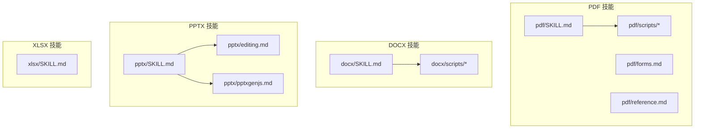
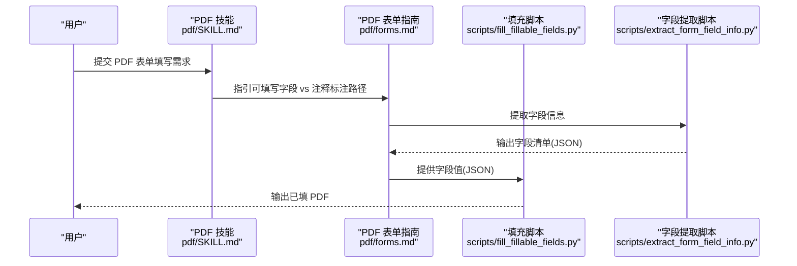
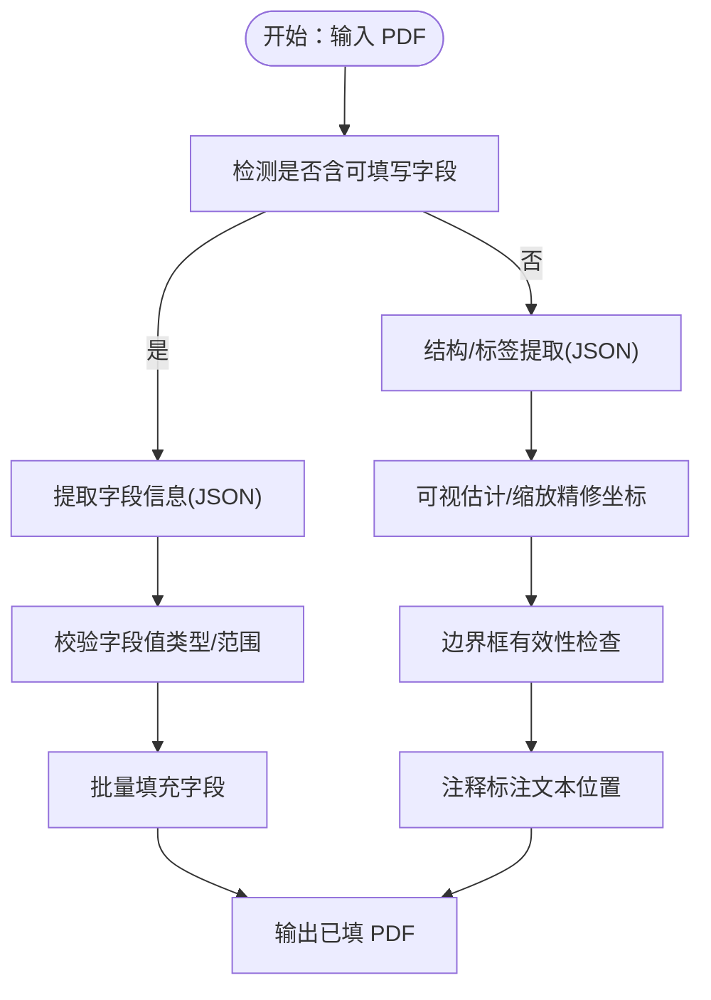
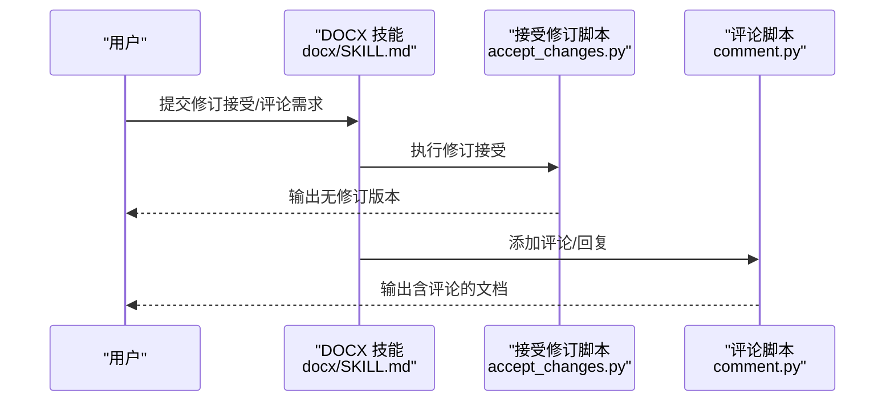
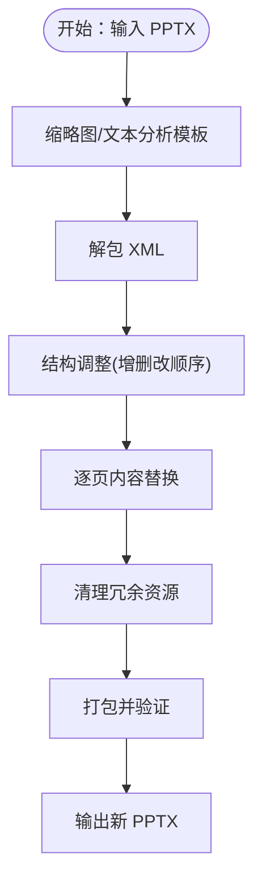
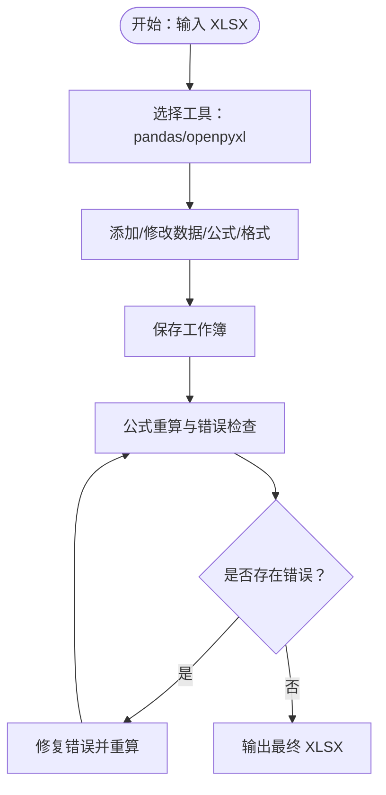
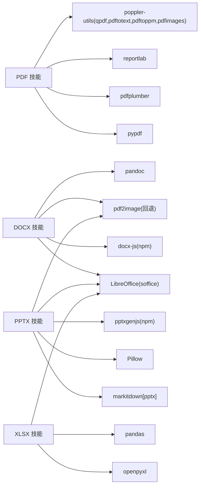

# 文档处理技能

<cite>
**本文引用的文件**
- [pdf/SKILL.md](file://copaw/src/copaw/agents/skills/pdf/SKILL.md)
- [pdf/forms.md](file://copaw/src/copaw/agents/skills/pdf/forms.md)
- [pdf/reference.md](file://copaw/src/copaw/agents/skills/pdf/reference.md)
- [pdf/scripts/fill_fillable_fields.py](file://copaw/src/copaw/agents/skills/pdf/scripts/fill_fillable_fields.py)
- [pdf/scripts/extract_form_field_info.py](file://copaw/src/copaw/agents/skills/pdf/scripts/extract_form_field_info.py)
- [pdf/scripts/convert_pdf_to_images.py](file://copaw/src/copaw/agents/skills/pdf/scripts/convert_pdf_to_images.py)
- [docx/SKILL.md](file://copaw/src/copaw/agents/skills/docx/SKILL.md)
- [docx/scripts/accept_changes.py](file://copaw/src/copaw/agents/skills/docx/scripts/accept_changes.py)
- [docx/scripts/comment.py](file://copaw/src/copaw/agents/skills/docx/scripts/comment.py)
- [pptx/SKILL.md](file://copaw/src/copaw/agents/skills/pptx/SKILL.md)
- [pptx/editing.md](file://copaw/src/copaw/agents/skills/pptx/editing.md)
- [pptx/pptxgenjs.md](file://copaw/src/copaw/agents/skills/pptx/pptxgenjs.md)
- [xlsx/SKILL.md](file://copaw/src/copaw/agents/skills/xlsx/SKILL.md)
</cite>

## 目录
1. [简介](#简介)
2. [项目结构](#项目结构)
3. [核心组件](#核心组件)
4. [架构总览](#架构总览)
5. [详细组件分析](#详细组件分析)
6. [依赖关系分析](#依赖关系分析)
7. [性能考量](#性能考量)
8. [故障排查指南](#故障排查指南)
9. [结论](#结论)
10. [附录](#附录)

## 简介
本技术文档面向“文档处理技能”，系统化梳理并解释以下能力：
- PDF 处理：文本与表格提取、表单填写（可填写字段与注释标注）、注释与批注、页面旋转/合并/拆分、水印、加密/解密、OCR 可搜索化、图像提取等。
- DOCX 文档：样式保持与覆盖、图片插入、表格操作、修订跟踪（审阅）与评论、从头创建与现有文档编辑、XML 层级修改与验证。
- PPTX 演示文稿：幻灯片创建（从零到一）、内容编辑（基于模板）、主题与布局应用、颜色与字体设计建议、图表与形状绘制、缩略图与可视化校验。
- XLSX 电子表格：数据读取与分析、公式计算与错误检查、图表与数据透视相关能力、格式与颜色规范、跨工作表引用与动态更新。

文档还提供各技能的参数配置、使用示例路径、最佳实践以及格式转换与兼容性处理机制说明。

## 项目结构
该仓库中，文档处理技能以“技能包（skill）”形式组织在 agents/skills 下，每个技能包含：
- 技能说明文档（SKILL.md）
- 使用指南或参考文档（如 forms.md、editing.md、pptxgenjs.md、reference.md）
- 脚本工具（scripts/），用于具体任务自动化（如表单字段提取、填充、图片转换、修订接受、评论添加等）

**图表来源**
- [pdf/SKILL.md](file://copaw/src/copaw/agents/skills/pdf/SKILL.md)
- [docx/SKILL.md](file://copaw/src/copaw/agents/skills/docx/SKILL.md)
- [pptx/SKILL.md](file://copaw/src/copaw/agents/skills/pptx/SKILL.md)
- [pptx/editing.md](file://copaw/src/copaw/agents/skills/pptx/editing.md)
- [pptx/pptxgenjs.md](file://copaw/src/copaw/agents/skills/pptx/pptxgenjs.md)
- [xlsx/SKILL.md](file://copaw/src/copaw/agents/skills/xlsx/SKILL.md)

**章节来源**
- [pdf/SKILL.md](file://copaw/src/copaw/agents/skills/pdf/SKILL.md)
- [docx/SKILL.md](file://copaw/src/copaw/agents/skills/docx/SKILL.md)
- [pptx/SKILL.md](file://copaw/src/copaw/agents/skills/pptx/SKILL.md)
- [xlsx/SKILL.md](file://copaw/src/copaw/agents/skills/xlsx/SKILL.md)

## 核心组件
- PDF 技能：提供文本/表格提取、表单填写（可填写字段与注释两种路径）、注释/批注、页面操作（旋转/合并/拆分）、水印、加密/解密、OCR、图像提取等。
- DOCX 技能：支持从头创建（docx-js）与现有文档编辑（XML 解包/打包），强调样式覆盖、列表/表格/图片/页码/目录等元素的正确实现方式；提供修订接受与评论脚本。
- PPTX 技能：涵盖从零创建（pptxgenjs）与模板编辑（基于 XML 的解包/清理/打包），提供设计建议、颜色与字体搭配、图表与形状绘制、缩略图与视觉校验流程。
- XLSX 技能：强调使用公式而非硬编码值、严格的格式与颜色规范、公式错误检查与修复、跨工作表引用与动态更新。

**章节来源**
- [pdf/SKILL.md](file://copaw/src/copaw/agents/skills/pdf/SKILL.md)
- [docx/SKILL.md](file://copaw/src/copaw/agents/skills/docx/SKILL.md)
- [pptx/SKILL.md](file://copaw/src/copaw/agents/skills/pptx/SKILL.md)
- [xlsx/SKILL.md](file://copaw/src/copaw/agents/skills/xlsx/SKILL.md)

## 架构总览
下图展示 PDF 表单填写与 DOCX 修订接受的关键流程，体现“脚本驱动 + 工具链”的处理模式：

**图表来源**
- [pdf/SKILL.md](file://copaw/src/copaw/agents/skills/pdf/SKILL.md)
- [pdf/forms.md](file://copaw/src/copaw/agents/skills/pdf/forms.md)
- [pdf/scripts/fill_fillable_fields.py](file://copaw/src/copaw/agents/skills/pdf/scripts/fill_fillable_fields.py)
- [pdf/scripts/extract_form_field_info.py](file://copaw/src/copaw/agents/skills/pdf/scripts/extract_form_field_info.py)

## 详细组件分析

### PDF 技能
- 功能特性
  - 文本与表格提取：pdfplumber、pypdf、命令行工具 pdftotext、qpdf。
  - 表单填写：可填写字段直接赋值；非可填写字段通过注释标注坐标后填充。
  - 注释与批注：提取注释、标注文本位置、生成带注释的 PDF。
  - 页面操作：旋转、合并、拆分、裁剪、水印叠加。
  - 加密/解密与安全：密码保护、权限控制、修复损坏结构。
  - 图像提取与 OCR：pdfimages 提取嵌入图像；扫描版 PDF 先转图像再 OCR。
- 参数与使用示例
  - 字段提取与验证：见 [extract_form_field_info.py](file://copaw/src/copaw/agents/skills/pdf/scripts/extract_form_field_info.py)
  - 填充可填写字段：见 [fill_fillable_fields.py](file://copaw/src/copaw/agents/skills/pdf/scripts/fill_fillable_fields.py)
  - PDF 转图片（预览/校验）：见 [convert_pdf_to_images.py](file://copaw/src/copaw/agents/skills/pdf/scripts/convert_pdf_to_images.py)
  - 技能总体说明与快速参考：见 [pdf/SKILL.md](file://copaw/src/copaw/agents/skills/pdf/SKILL.md)
  - 表单填写完整流程与坐标策略：见 [pdf/forms.md](file://copaw/src/copaw/agents/skills/pdf/forms.md)
  - 高级参考（pypdfium2、pdf-lib、pdf.js、命令行高级用法）：见 [pdf/reference.md](file://copaw/src/copaw/agents/skills/pdf/reference.md)

**图表来源**
- [pdf/forms.md](file://copaw/src/copaw/agents/skills/pdf/forms.md)
- [pdf/scripts/extract_form_field_info.py](file://copaw/src/copaw/agents/skills/pdf/scripts/extract_form_field_info.py)
- [pdf/scripts/fill_fillable_fields.py](file://copaw/src/copaw/agents/skills/pdf/scripts/fill_fillable_fields.py)
- [pdf/reference.md](file://copaw/src/copaw/agents/skills/pdf/reference.md)

**章节来源**
- [pdf/SKILL.md](file://copaw/src/copaw/agents/skills/pdf/SKILL.md)
- [pdf/forms.md](file://copaw/src/copaw/agents/skills/pdf/forms.md)
- [pdf/reference.md](file://copaw/src/copaw/agents/skills/pdf/reference.md)
- [pdf/scripts/extract_form_field_info.py](file://copaw/src/copaw/agents/skills/pdf/scripts/extract_form_field_info.py)
- [pdf/scripts/fill_fillable_fields.py](file://copaw/src/copaw/agents/skills/pdf/scripts/fill_fillable_fields.py)
- [pdf/scripts/convert_pdf_to_images.py](file://copaw/src/copaw/agents/skills/pdf/scripts/convert_pdf_to_images.py)

### DOCX 技能
- 功能特性
  - 新建文档：使用 docx-js 创建，注意页面尺寸、方向、字体、编号/列表、表格宽度与单元格宽度一致性、阴影与边框等。
  - 编辑现有文档：解包 XML、按规则修改、自动修复与压缩、重新打包。
  - 修订跟踪与评论：通过 LibreOffice 接受修订；使用脚本添加评论与回复，并在 document.xml 中放置标记。
- 参数与使用示例
  - 修订接受（LibreOffice）：见 [accept_changes.py](file://copaw/src/copaw/agents/skills/docx/scripts/accept_changes.py)
  - 添加评论（含回复）：见 [comment.py](file://copaw/src/copaw/agents/skills/docx/scripts/comment.py)
  - 技能总体说明与最佳实践：见 [docx/SKILL.md](file://copaw/src/copaw/agents/skills/docx/SKILL.md)

**图表来源**
- [docx/SKILL.md](file://copaw/src/copaw/agents/skills/docx/SKILL.md)
- [docx/scripts/accept_changes.py](file://copaw/src/copaw/agents/skills/docx/scripts/accept_changes.py)
- [docx/scripts/comment.py](file://copaw/src/copaw/agents/skills/docx/scripts/comment.py)

**章节来源**
- [docx/SKILL.md](file://copaw/src/copaw/agents/skills/docx/SKILL.md)
- [docx/scripts/accept_changes.py](file://copaw/src/copaw/agents/skills/docx/scripts/accept_changes.py)
- [docx/scripts/comment.py](file://copaw/src/copaw/agents/skills/docx/scripts/comment.py)

### PPTX 技能
- 功能特性
  - 内容读取：文本抽取、缩略图生成、原始 XML 访问。
  - 模板编辑：分析模板布局 → 解包 → 结构调整（增删改顺序）→ 内容替换 → 清理 → 打包。
  - 从零创建：使用 pptxgenjs，支持文本、列表、形状、图片、图标、背景、表格、图表、幻灯片母版等。
  - 设计建议：配色、字体、间距、避免常见错误、QA 流程（文本/视觉）。
- 参数与使用示例
  - 模板编辑流程与脚本：见 [pptx/editing.md](file://copaw/src/copaw/agents/skills/pptx/editing.md)
  - 从零创建与样式/图表/形状/图标：见 [pptx/pptxgenjs.md](file://copaw/src/copaw/agents/skills/pptx/pptxgenjs.md)
  - 技能总体说明与 QA 流程：见 [pptx/SKILL.md](file://copaw/src/copaw/agents/skills/pptx/SKILL.md)

**图表来源**
- [pptx/SKILL.md](file://copaw/src/copaw/agents/skills/pptx/SKILL.md)
- [pptx/editing.md](file://copaw/src/copaw/agents/skills/pptx/editing.md)

**章节来源**
- [pptx/SKILL.md](file://copaw/src/copaw/agents/skills/pptx/SKILL.md)
- [pptx/editing.md](file://copaw/src/copaw/agents/skills/pptx/editing.md)
- [pptx/pptxgenjs.md](file://copaw/src/copaw/agents/skills/pptx/pptxgenjs.md)

### XLSX 技能
- 功能特性
  - 数据读取与分析：pandas 读取 Excel，统计描述，多工作表加载。
  - 公式计算与错误检查：openpyxl 编写公式，使用脚本进行公式重算与错误定位。
  - 格式与颜色规范：财务模型颜色编码、数字格式、负数显示、百分比与倍数格式。
  - 跨工作表引用与动态更新：确保引用稳定、避免循环引用、测试边界情况。
- 参数与使用示例
  - 技能总体要求与最佳实践：见 [xlsx/SKILL.md](file://copaw/src/copaw/agents/skills/xlsx/SKILL.md)

**图表来源**
- [xlsx/SKILL.md](file://copaw/src/copaw/agents/skills/xlsx/SKILL.md)

**章节来源**
- [xlsx/SKILL.md](file://copaw/src/copaw/agents/skills/xlsx/SKILL.md)

## 依赖关系分析
- PDF 技能依赖 Python 库（pypdf、pdfplumber、reportlab、pypdfium2 等）与命令行工具（poppler-utils、qpdf、pdftotext、pdftoppm、pdfimages）。
- DOCX 技能依赖 docx-js（npm）、LibreOffice（soffice）、pandoc、pdf2image（回退）。
- PPTX 技能依赖 markitdown[pptx]、Pillow、pptxgenjs（npm）、LibreOffice、pdftoppm。
- XLSX 技能依赖 openpyxl、pandas、LibreOffice（公式重算）。

**图表来源**
- [pdf/SKILL.md](file://copaw/src/copaw/agents/skills/pdf/SKILL.md)
- [docx/SKILL.md](file://copaw/src/copaw/agents/skills/docx/SKILL.md)
- [pptx/SKILL.md](file://copaw/src/copaw/agents/skills/pptx/SKILL.md)
- [xlsx/SKILL.md](file://copaw/src/copaw/agents/skills/xlsx/SKILL.md)

**章节来源**
- [pdf/SKILL.md](file://copaw/src/copaw/agents/skills/pdf/SKILL.md)
- [docx/SKILL.md](file://copaw/src/copaw/agents/skills/docx/SKILL.md)
- [pptx/SKILL.md](file://copaw/src/copaw/agents/skills/pptx/SKILL.md)
- [xlsx/SKILL.md](file://copaw/src/copaw/agents/skills/xlsx/SKILL.md)

## 性能考量
- 大型 PDF：优先使用 qpdf 分割与流式处理；pypdfium2 适合渲染与提取；pdfplumber 适合结构化表格。
- DOCX/PPTX：解包/打包时启用自动修复与压缩；避免在 XML 中引入不必要复杂性。
- XLSX：尽量使用 openpyxl 的公式字符串而非硬编码数值，减少重算成本；对大文件使用只读/只写模式。

[本节为通用指导，无需特定文件引用]

## 故障排查指南
- PDF
  - 表单字段无效或值类型不符：检查字段类型与取值集合，参考字段提取与验证逻辑。
  - 坐标错误导致注释错位：使用边界框检查脚本与可视精修。
  - 加密/损坏 PDF：使用 qpdf 修复或移除密码。
- DOCX
  - 修订未接受：使用 LibreOffice 宏脚本接受所有修订。
  - 评论缺失：确认 comments.xml 关系与内容类型已正确生成与引用。
- PPTX
  - 模板布局不一致：使用缩略图对比，逐页核对占位符与内容。
  - 图片/图表错位：检查文本框内边距与对齐，避免低对比度。
- XLSX
  - 公式错误：使用公式重算脚本获取错误详情，修复后再次重算。

**章节来源**
- [pdf/scripts/fill_fillable_fields.py](file://copaw/src/copaw/agents/skills/pdf/scripts/fill_fillable_fields.py)
- [pdf/scripts/extract_form_field_info.py](file://copaw/src/copaw/agents/skills/pdf/scripts/extract_form_field_info.py)
- [docx/scripts/accept_changes.py](file://copaw/src/copaw/agents/skills/docx/scripts/accept_changes.py)
- [docx/scripts/comment.py](file://copaw/src/copaw/agents/skills/docx/scripts/comment.py)
- [xlsx/SKILL.md](file://copaw/src/copaw/agents/skills/xlsx/SKILL.md)

## 结论
上述技能以“文档格式 + 工具链 + 脚本”的组合实现端到端的文档处理能力。PDF 技能覆盖从提取到表单填写与注释标注的完整闭环；DOCX 技能强调样式与修订的严谨性；PPTX 技能兼顾设计与工程质量；XLSX 技能确保公式与格式的可维护性。遵循各技能的参数配置与最佳实践，可在不同平台与环境中稳定运行。

[本节为总结，无需特定文件引用]

## 附录
- 最佳实践清单
  - PDF：优先结构化提取；表单填写前先验证字段与值；注释坐标需经边界框检查与可视复核。
  - DOCX：明确覆盖内置样式；表格必须同时设置表宽与列宽；图片必须声明类型与可访问性属性。
  - PPTX：多样化布局；避免纯文本幻灯片；QA 至少一轮修复与复验。
  - XLSX：全部使用公式；严格颜色与格式规范；公式重算与错误检查不可省略。

[本节为通用指导，无需特定文件引用]