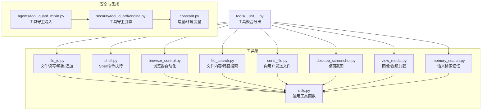
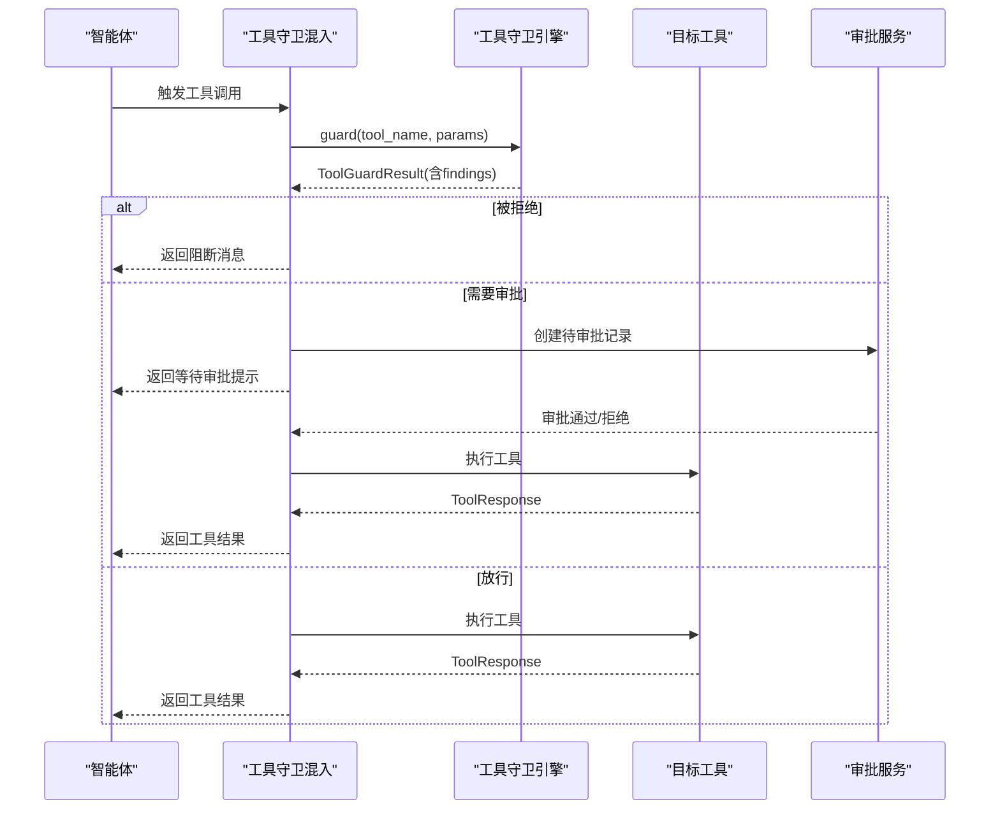
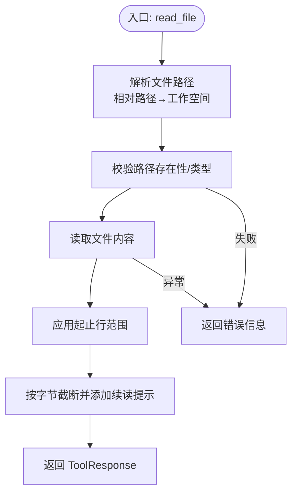
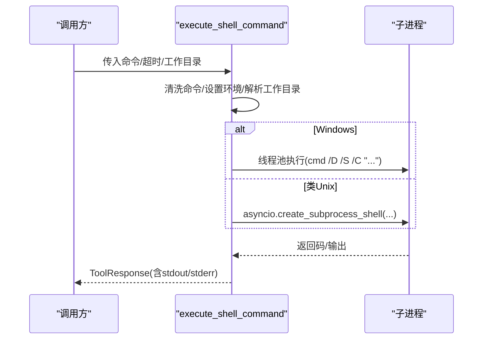
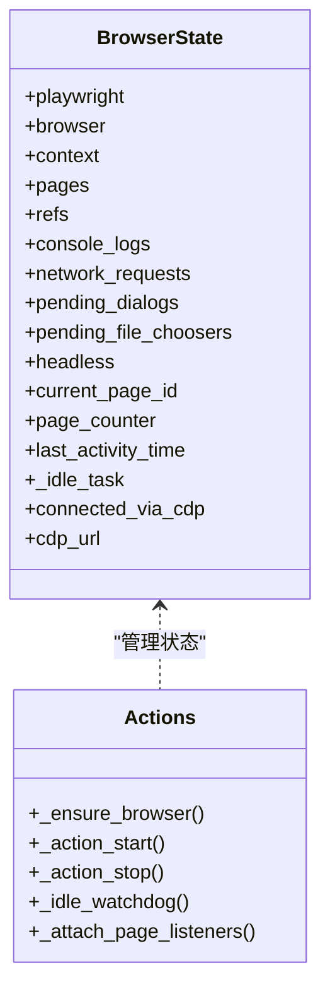
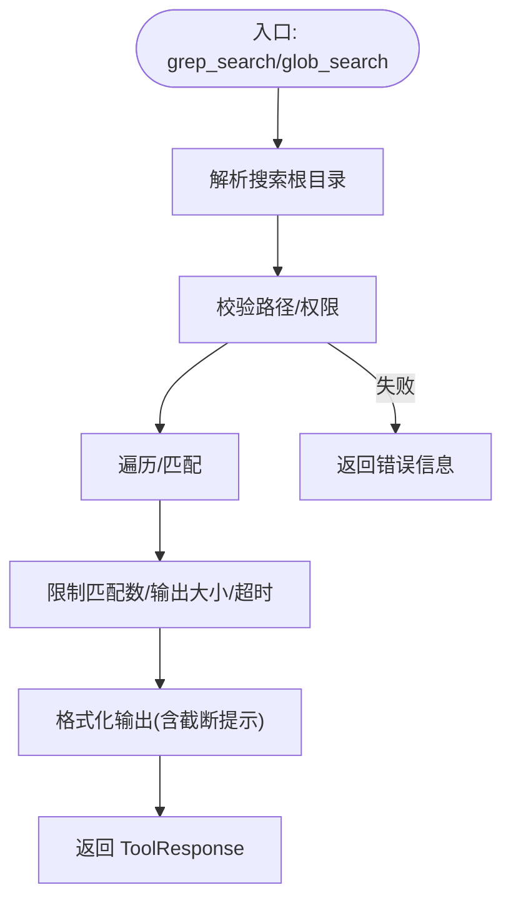
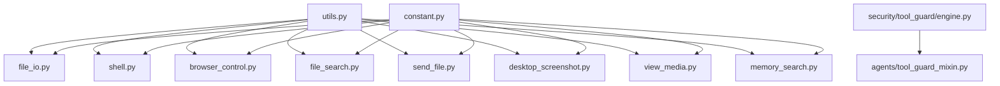

# 工具系统

<cite>
**本文引用的文件**
- [tools/__init__.py](file://copaw/src/copaw/agents/tools/__init__.py)
- [file_io.py](file://copaw/src/copaw/agents/tools/file_io.py)
- [shell.py](file://copaw/src/copaw/agents/tools/shell.py)
- [browser_control.py](file://copaw/src/copaw/agents/tools/browser_control.py)
- [utils.py](file://copaw/src/copaw/agents/tools/utils.py)
- [file_search.py](file://copaw/src/copaw/agents/tools/file_search.py)
- [send_file.py](file://copaw/src/copaw/agents/tools/send_file.py)
- [desktop_screenshot.py](file://copaw/src/copaw/agents/tools/desktop_screenshot.py)
- [view_media.py](file://copaw/src/copaw/agents/tools/view_media.py)
- [memory_search.py](file://copaw/src/copaw/agents/tools/memory_search.py)
- [engine.py](file://copaw/src/copaw/security/tool_guard/engine.py)
- [tool_guard_mixin.py](file://copaw/src/copaw/agents/tool_guard_mixin.py)
- [constant.py](file://copaw/src/copaw/constant.py)
</cite>

## 目录
1. [简介](#简介)
2. [项目结构](#项目结构)
3. [核心组件](#核心组件)
4. [架构总览](#架构总览)
5. [详细组件分析](#详细组件分析)
6. [依赖分析](#依赖分析)
7. [性能考虑](#性能考虑)
8. [故障排查指南](#故障排查指南)
9. [结论](#结论)
10. [附录](#附录)

## 简介
本文件面向工具系统的设计与实现，覆盖工具的注册、发现与调用机制；详解文件I/O、Shell命令、浏览器控制、截图与媒体查看、文件搜索、内存检索等工具的能力与边界；阐述安全验证与防护流程；说明参数校验、错误处理与结果返回格式；给出使用示例与最佳实践，并提供扩展开发与自定义工具的指引，以及性能优化与监控建议。

## 项目结构
工具系统位于 agents/tools 目录下，采用“按功能分模块”的组织方式，每个工具独立为一个模块，统一通过 tools/__init__.py 汇总导出，便于外部按名称发现与注册。安全防护由 security/tool_guard 提供，工具守卫引擎与审批流在 agents/tool_guard_mixin 中与智能体交互集成。

**图表来源**
- [tools/__init__.py:1-48](file://copaw/src/copaw/agents/tools/__init__.py#L1-L48)
- [file_io.py:1-396](file://copaw/src/copaw/agents/tools/file_io.py#L1-L396)
- [shell.py:1-383](file://copaw/src/copaw/agents/tools/shell.py#L1-L383)
- [browser_control.py:1-800](file://copaw/src/copaw/agents/tools/browser_control.py#L1-L800)
- [file_search.py:1-629](file://copaw/src/copaw/agents/tools/file_search.py#L1-L629)
- [send_file.py:1-123](file://copaw/src/copaw/agents/tools/send_file.py#L1-L123)
- [desktop_screenshot.py:1-144](file://copaw/src/copaw/agents/tools/desktop_screenshot.py#L1-L144)
- [view_media.py:1-149](file://copaw/src/copaw/agents/tools/view_media.py#L1-L149)
- [memory_search.py:1-70](file://copaw/src/copaw/agents/tools/memory_search.py#L1-L70)
- [utils.py:1-227](file://copaw/src/copaw/agents/tools/utils.py#L1-L227)
- [engine.py:1-238](file://copaw/src/copaw/security/tool_guard/engine.py#L1-L238)
- [tool_guard_mixin.py:1-821](file://copaw/src/copaw/agents/tool_guard_mixin.py#L1-L821)
- [constant.py:1-271](file://copaw/src/copaw/constant.py#L1-L271)

**章节来源**
- [tools/__init__.py:1-48](file://copaw/src/copaw/agents/tools/__init__.py#L1-L48)

## 核心组件
- 工具聚合导出：通过 tools/__init__.py 将所有工具函数集中导出，形成统一的工具清单，便于上层注册与调用。
- 工具实现：各工具模块封装具体能力，如文件读写、Shell执行、浏览器自动化、文件搜索、截图与媒体查看、内存检索等。
- 安全引擎：security/tool_guard/engine.py 提供工具调用前的参数检查与风险评估；agents/tool_guard_mixin.py 在智能体执行阶段拦截敏感工具调用，支持自动拒绝、预审批与人工审批。
- 常量与上下文：constant.py 提供工作目录、截断标记等全局常量；工具内部通过上下文获取当前工作空间，确保操作范围受控。

**章节来源**
- [tools/__init__.py:27-47](file://copaw/src/copaw/agents/tools/__init__.py#L27-L47)
- [engine.py:53-238](file://copaw/src/copaw/security/tool_guard/engine.py#L53-L238)
- [tool_guard_mixin.py:45-821](file://copaw/src/copaw/agents/tool_guard_mixin.py#L45-L821)
- [constant.py:72-271](file://copaw/src/copaw/constant.py#L72-L271)

## 架构总览
工具系统采用“工具模块 + 守卫引擎 + 智能体混入”的分层架构：
- 工具层：提供具体能力，遵循统一的 ToolResponse 返回格式。
- 守卫层：在工具调用前进行参数校验与风险评估，必要时进入审批流程。
- 集成层：智能体在执行阶段拦截工具调用，根据守卫结果决定放行、阻断或进入审批队列。

**图表来源**
- [tool_guard_mixin.py:260-310](file://copaw/src/copaw/agents/tool_guard_mixin.py#L260-L310)
- [engine.py:169-227](file://copaw/src/copaw/security/tool_guard/engine.py#L169-L227)

## 详细组件分析

### 文件I/O工具（file_io）
- 功能要点
  - 绝对/相对路径解析：相对路径基于当前工作空间或默认工作目录解析。
  - 编码策略：针对不同扩展名选择合适编码（如CSV/TSV/TXT使用带BOM的UTF-8以兼容Windows）。
  - 截断与续读：对大文件输出进行字节级截断，保留换行完整性，并提供“从某行继续读取”的提示。
  - 参数校验：对起止行号进行类型转换与范围校验；对空路径进行保护。
- 错误处理：文件不存在、非文件路径、读写异常均返回标准化的 ToolResponse。
- 结果格式：统一返回 ToolResponse，内容为文本块或多媒体块（用于后续展示）。

**图表来源**
- [file_io.py:66-206](file://copaw/src/copaw/agents/tools/file_io.py#L66-L206)
- [utils.py:151-205](file://copaw/src/copaw/agents/tools/utils.py#L151-L205)

**章节来源**
- [file_io.py:23-206](file://copaw/src/copaw/agents/tools/file_io.py#L23-L206)
- [utils.py:15-227](file://copaw/src/copaw/agents/tools/utils.py#L15-L227)

### Shell命令工具（shell）
- 功能要点
  - 平台差异：Windows使用线程池绕开异步子进程限制；类Unix系统直接使用 asyncio 子进程。
  - 命令清洗：处理JSON反序列化导致的换行符问题，避免Windows截断与Unix命令分割。
  - 超时与清理：统一超时处理，跨平台终止子进程树，清理临时输出文件。
  - 环境注入：确保子进程PATH包含当前Python可执行目录，保证脚本可调用同环境工具。
- 错误处理：异常捕获、超时错误、进程组信号清理、输出解码回退。
- 结果格式：返回包含标准输出/错误的标准文本响应。

**图表来源**
- [shell.py:213-373](file://copaw/src/copaw/agents/tools/shell.py#L213-L373)

**章节来源**
- [shell.py:23-383](file://copaw/src/copaw/agents/tools/shell.py#L23-L383)

### 浏览器控制工具（browser_control）
- 功能要点
  - 多模式运行：同步Playwright（Uvicorn热重载场景）与异步Playwright（常规场景）混合模式。
  - 会话状态：按工作空间维护浏览器状态（用户数据目录、标签页、网络请求、控制台日志、对话框等）。
  - 自动回收：空闲检测与定时关闭，释放Chrome渲染进程资源。
  - 参考系统：快照构建与ref定位，支持基于角色/名称的元素引用。
- 安全与容器：容器内自动启用沙箱参数；可配置使用系统默认浏览器或Playwright内置Chromium。
- 结果格式：统一返回ToolResponse，内容为JSON字符串或文本块。

**图表来源**
- [browser_control.py:83-173](file://copaw/src/copaw/agents/tools/browser_control.py#L83-L173)
- [browser_control.py:486-624](file://copaw/src/copaw/agents/tools/browser_control.py#L486-L624)

**章节来源**
- [browser_control.py:487-800](file://copaw/src/copaw/agents/tools/browser_control.py#L487-L800)

### 文件搜索工具（file_search）
- 内容搜索（grep）
  - 递归遍历：跳过常见二进制扩展与大型文件，支持超时与取消。
  - 上下文输出：命中前后若干行上下文，限制匹配数与输出字符数。
  - 超限处理：匹配数/输出大小/超时均触发截断提示。
- 路径搜索（glob）
  - 支持通配符与递归模式，限制匹配数量与扫描深度。
- 结果格式：统一返回ToolResponse，内容为文本块。

**图表来源**
- [file_search.py:478-577](file://copaw/src/copaw/agents/tools/file_search.py#L478-L577)
- [file_search.py:579-629](file://copaw/src/copaw/agents/tools/file_search.py#L579-L629)

**章节来源**
- [file_search.py:22-629](file://copaw/src/copaw/agents/tools/file_search.py#L22-L629)

### 发送文件工具（send_file）
- 功能要点
  - 路径规范化：处理波浪号展开与Unicode归一化，避免跨平台路径不一致。
  - 类型识别：基于MIME自动判断图像/音频/视频/普通文件，并生成对应的消息块。
  - 错误处理：文件不存在/非文件/读取异常均返回标准化错误。
- 结果格式：返回包含文件/媒体块与文本提示的ToolResponse。

**章节来源**
- [send_file.py:29-123](file://copaw/src/copaw/agents/tools/send_file.py#L29-L123)

### 桌面截图工具（desktop_screenshot）
- 功能要点
  - 平台适配：Windows/Linux/macOS均使用mss全屏截图；macOS可选窗口选择。
  - 输出路径：未指定时保存至工作空间目录，自动补全PNG后缀。
  - 错误处理：缺失依赖、子进程失败、超时等均返回JSON化的错误信息。
- 结果格式：返回包含成功/错误信息与文件路径的ToolResponse。

**章节来源**
- [desktop_screenshot.py:103-144](file://copaw/src/copaw/agents/tools/desktop_screenshot.py#L103-L144)

### 媒体查看工具（view_media）
- 功能要点
  - 图像/视频格式白名单校验，结合MIME类型二次确认。
  - 使用本地文件URL作为消息源，便于模型侧加载。
- 结果格式：返回包含ImageBlock/VideoBlock与文本提示的ToolResponse。

**章节来源**
- [view_media.py:79-149](file://copaw/src/copaw/agents/tools/view_media.py#L79-L149)

### 内存检索工具（memory_search）
- 功能要点
  - 通过工厂函数绑定内存管理器，提供语义检索能力。
  - 支持最大结果数与最小相似度阈值。
- 结果格式：委托内存管理器返回ToolResponse。

**章节来源**
- [memory_search.py:7-70](file://copaw/src/copaw/agents/tools/memory_search.py#L7-L70)

### 工具注册、发现与调用机制
- 注册与导出：tools/__init__.py 将所有工具函数汇总导出，形成统一工具清单。
- 调用流程：智能体在执行阶段拦截工具调用，先经工具守卫引擎评估，再决定放行或进入审批队列。
- 结果返回：所有工具统一返回 ToolResponse，便于上层消息系统处理。

**图表来源**
- [tools/__init__.py:27-47](file://copaw/src/copaw/agents/tools/__init__.py#L27-L47)
- [engine.py:169-227](file://copaw/src/copaw/security/tool_guard/engine.py#L169-L227)

**章节来源**
- [tools/__init__.py:27-47](file://copaw/src/copaw/agents/tools/__init__.py#L27-L47)
- [tool_guard_mixin.py:311-366](file://copaw/src/copaw/agents/tool_guard_mixin.py#L311-L366)

## 依赖分析
- 工具间耦合：各工具模块相对独立，仅在工具层共享 utils.py 的截断与读取辅助函数。
- 安全依赖：工具守卫引擎依赖规则守护与文件路径守护；智能体混入依赖审批服务。
- 环境与常量：工具普遍依赖工作空间上下文与常量（如截断标记），确保行为一致。

**图表来源**
- [utils.py:1-227](file://copaw/src/copaw/agents/tools/utils.py#L1-L227)
- [engine.py:25-28](file://copaw/src/copaw/security/tool_guard/engine.py#L25-L28)
- [tool_guard_mixin.py:57-70](file://copaw/src/copaw/agents/tool_guard_mixin.py#L57-L70)
- [constant.py:72-271](file://copaw/src/copaw/constant.py#L72-L271)

**章节来源**
- [utils.py:1-227](file://copaw/src/copaw/agents/tools/utils.py#L1-L227)
- [engine.py:1-238](file://copaw/src/copaw/security/tool_guard/engine.py#L1-L238)
- [tool_guard_mixin.py:1-821](file://copaw/src/copaw/agents/tool_guard_mixin.py#L1-L821)
- [constant.py:1-271](file://copaw/src/copaw/constant.py#L1-L271)

## 性能考虑
- I/O与内存
  - 文件读取：大文件采用字节级截断，避免一次性读入内存；通过“续读提示”引导分段读取。
  - Shell执行：Windows使用线程池规避异步子进程限制；类Unix使用进程组信号终止后台进程。
  - 浏览器：空闲回收与持久化上下文减少启动成本；容器内启用沙箱参数降低资源占用。
- 超时与并发
  - Shell与文件搜索均设置超时；浏览器提供空闲检测任务定期停止。
  - 工具守卫引擎记录耗时，便于定位慢守护器。
- 网络与缓存
  - 技能中心访问支持重试、指数退避与速率限制提示；GitHub令牌可提升配额。

**章节来源**
- [utils.py:15-227](file://copaw/src/copaw/agents/tools/utils.py#L15-L227)
- [shell.py:23-383](file://copaw/src/copaw/agents/tools/shell.py#L23-L383)
- [browser_control.py:175-227](file://copaw/src/copaw/agents/tools/browser_control.py#L175-L227)

## 故障排查指南
- 工具返回错误
  - 文件类：路径不存在、非文件、编码错误、权限不足等，均返回包含错误信息的ToolResponse。
  - Shell类：命令语法错误、超时、子进程异常、Windows换行问题等，返回包含stderr或超时提示。
  - 浏览器类：Playwright未安装、容器环境缺少依赖、端口占用、CDP连接丢失等，返回JSON化的错误信息。
- 安全拦截
  - 工具被阻断：查看守卫引擎的findings与严重级别；若需审批，检查审批队列状态。
  - 预审批：确认会话ID可用且审批服务正常；检查剩余队列与思考块是否正确传递。
- 日志与调试
  - 守卫引擎记录耗时与失败守护器；工具内部使用统一的错误包装与回退解码。

**章节来源**
- [file_io.py:114-206](file://copaw/src/copaw/agents/tools/file_io.py#L114-L206)
- [shell.py:296-373](file://copaw/src/copaw/agents/tools/shell.py#L296-L373)
- [browser_control.py:487-800](file://copaw/src/copaw/agents/tools/browser_control.py#L487-L800)
- [engine.py:194-227](file://copaw/src/copaw/security/tool_guard/engine.py#L194-L227)
- [tool_guard_mixin.py:442-610](file://copaw/src/copaw/agents/tool_guard_mixin.py#L442-L610)

## 结论
工具系统以模块化设计实现多样化能力，配合工具守卫引擎与审批流程，形成“可审计、可控制、可扩展”的工具生态。通过统一的返回格式与严格的参数校验、错误处理，系统在易用性与安全性之间取得平衡。建议在生产环境中开启工具守卫、合理设置超时与截断策略，并结合监控指标持续优化性能与稳定性。

## 附录

### 使用示例与最佳实践
- 文件读取
  - 使用相对路径时，确保工作空间正确；需要分段读取时，依据“续读提示”调整起始行。
- Shell命令
  - 避免在命令中使用原始换行符；必要时使用多条命令组合；为长任务设置合理超时。
- 浏览器控制
  - 首次启动可能较慢，建议复用上下文；容器部署时注意沙箱与依赖安装。
- 发送文件
  - 使用绝对路径或NFC归一化后的路径；对未知类型文件使用通用MIME类型。
- 截图与媒体
  - macOS窗口选择需用户交互；媒体加载优先使用本地URL以提升模型侧加载效率。
- 内存检索
  - 合理设置最大结果数与最小相似度，避免过多噪声。

### 扩展开发与自定义工具
- 新增工具步骤
  - 在 tools/ 下新增模块，实现异步函数并返回 ToolResponse。
  - 在 tools/__init__.py 中导入并加入导出列表。
  - 如涉及敏感参数，纳入工具守卫规则或在智能体混入中声明需要审批。
- 安全加固
  - 对路径参数进行严格校验与白名单过滤；对命令参数进行转义与长度限制。
  - 对输出进行截断与脱敏，避免泄露敏感信息。
- 监控与日志
  - 记录工具耗时、错误率与超时次数；对高风险工具增加告警阈值。