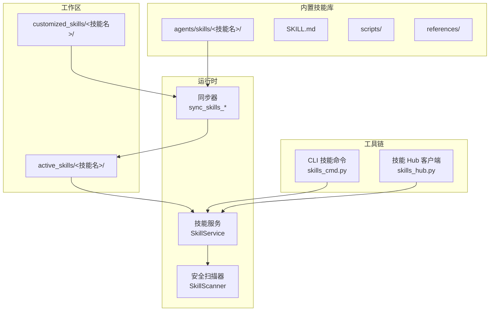
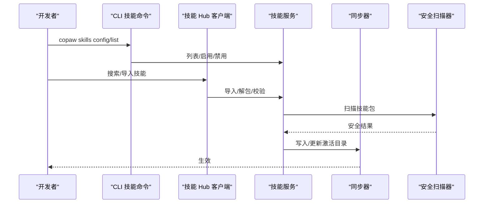
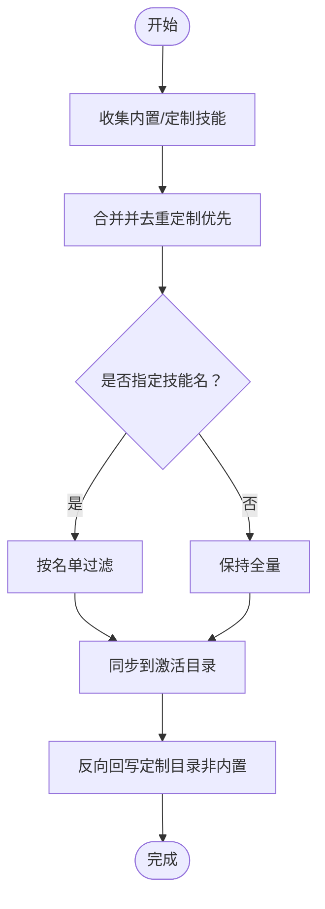
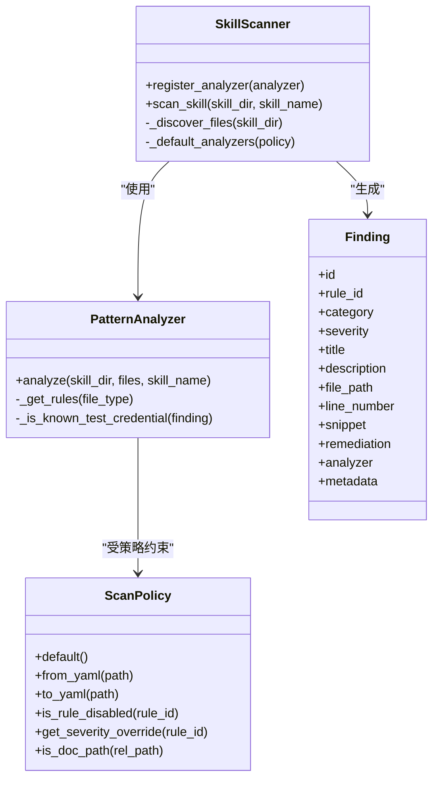
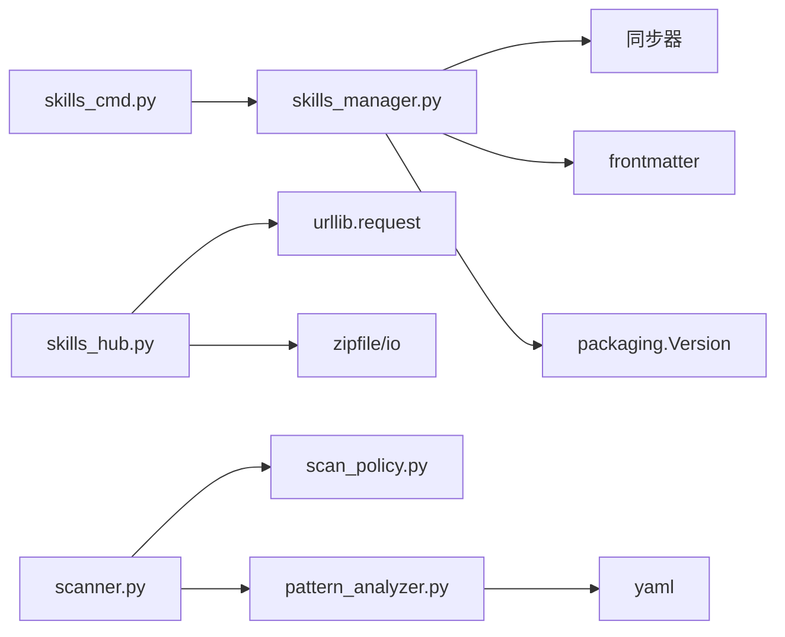

# 技能开发指南

<cite>
**本文引用的文件**
- [技能开发指南.md](file://specs/copaw-repowiki/content/系统架构/插件化架构/技能插件系统/技能开发指南.md)
- [skills_manager.py](file://src/copaw/agents/skills_manager.py)
- [skills_hub.py](file://src/copaw/agents/skills_hub.py)
- [skills_cmd.py](file://src/copaw/cli/skills_cmd.py)
- [constant.py](file://src/copaw/constant.py)
- [scanner.py](file://src/copaw/security/skill_scanner/scanner.py)
- [pattern_analyzer.py](file://src/copaw/security/skill_scanner/analyzers/pattern_analyzer.py)
- [models.py](file://src/copaw/security/skill_scanner/models.py)
- [scan_policy.py](file://src/copaw/security/skill_scanner/scan_policy.py)
- [cron/SKILL.md](file://src/copaw/agents/skills/cron/SKILL.md)
- [dingtalk_channel/SKILL.md](file://src/copaw/agents/skills/dingtalk_channel/SKILL.md)
- [docx/SKILL.md](file://src/copaw/agents/skills/docx/SKILL.md)
</cite>

## 目录
1. [引言](#引言)
2. [项目结构](#项目结构)
3. [核心组件](#核心组件)
4. [架构总览](#架构总览)
5. [详细组件分析](#详细组件分析)
6. [依赖分析](#依赖分析)
7. [性能考虑](#性能考虑)
8. [故障排查指南](#故障排查指南)
9. [结论](#结论)
10. [附录](#附录)

## 引言
本指南面向希望在 CoPaw 平台上开发、调试、测试、打包与分发“技能”的工程师与产品人员。文档覆盖技能开发标准流程、模板结构与 SKILL.md 编写规范、目录组织原则、工具链与调试方法、安全扫描与版本管理机制，并提供可复用的开发模式与最佳实践，帮助你高效构建高质量、可维护、可审计的技能模块。

## 项目结构
CoPaw 的技能体系由“内置技能库”“工作区定制技能库”“激活技能运行时”三部分构成，配合 CLI 与 Hub 的安装/启用流程，形成完整的技能生命周期管理。

图表来源
- [技能开发指南.md:36-64](file://specs/copaw-repowiki/content/系统架构/插件化架构/技能插件系统/技能开发指南.md#L36-L64)
- [skills_manager.py:627-800](file://src/copaw/agents/skills_manager.py#L627-L800)
- [skills_hub.py:573-634](file://src/copaw/agents/skills_hub.py#L573-L634)
- [skills_cmd.py:127-182](file://src/copaw/cli/skills_cmd.py#L127-L182)

章节来源
- [技能开发指南.md:34-68](file://specs/copaw-repowiki/content/系统架构/插件化架构/技能插件系统/技能开发指南.md#L34-L68)
- [skills_manager.py:627-800](file://src/copaw/agents/skills_manager.py#L627-L800)
- [skills_cmd.py:127-182](file://src/copaw/cli/skills_cmd.py#L127-L182)

## 核心组件
- 技能服务与同步器：负责从内置与定制目录收集、去重、同步至激活目录，并提供列表与校验能力。
- CLI 技能命令：提供技能列表、交互式启用/禁用、工作区解析等能力。
- 技能 Hub 客户端：支持从 Hub 搜索、拉取、导入技能包，含网络请求、重试、取消与安全限制。
- 安全扫描器：对技能包进行静态扫描，基于签名规则与策略过滤，输出统一结果模型。

章节来源
- [技能开发指南.md:75-86](file://specs/copaw-repowiki/content/系统架构/插件化架构/技能插件系统/技能开发指南.md#L75-L86)
- [skills_manager.py:627-800](file://src/copaw/agents/skills_manager.py#L627-L800)
- [skills_cmd.py:127-182](file://src/copaw/cli/skills_cmd.py#L127-L182)
- [skills_hub.py:573-634](file://src/copaw/agents/skills_hub.py#L573-L634)
- [scanner.py:76-242](file://src/copaw/security/skill_scanner/scanner.py#L76-L242)

## 架构总览
技能生命周期从“编写 SKILL.md 与脚本”开始，经“CLI 启用/Hub 导入”进入“激活目录”，随后被“技能服务”加载并参与运行；“安全扫描器”贯穿导入与更新阶段，确保合规。

图表来源
- [技能开发指南.md:90-106](file://specs/copaw-repowiki/content/系统架构/插件化架构/技能插件系统/技能开发指南.md#L90-L106)
- [skills_cmd.py:127-182](file://src/copaw/cli/skills_cmd.py#L127-L182)
- [skills_hub.py:573-634](file://src/copaw/agents/skills_hub.py#L573-L634)
- [scanner.py:148-242](file://src/copaw/security/skill_scanner/scanner.py#L148-L242)
- [skills_manager.py:183-260](file://src/copaw/agents/skills_manager.py#L183-L260)

## 详细组件分析

### 技能模板与目录组织
- 目录命名与结构
  - 每个技能以独立目录存在，根下必须包含 SKILL.md。
  - 可选子目录：
    - scripts/：运行时脚本树（扁平或嵌套均可）
    - references/：参考材料树（扁平或嵌套均可）
- 文件命名与内容
  - SKILL.md 必须包含 YAML Front Matter，至少包含 name 与 description 字段。
  - metadata 可包含 builtin_skill_version 等元数据。
- 名称与合法性
  - 目录名应仅包含字母、数字、下划线、连字符，避免斜杠等特殊字符。

章节来源
- [技能开发指南.md:116-127](file://specs/copaw-repowiki/content/系统架构/插件化架构/技能插件系统/技能开发指南.md#L116-L127)
- [skills_manager.py:699-751](file://src/copaw/agents/skills_manager.py#L699-L751)
- [skills_manager.py:569-577](file://src/copaw/agents/skills_manager.py#L569-L577)
- [skills_manager.py:552-567](file://src/copaw/agents/skills_manager.py#L552-L567)

### SKILL.md 编写规范
- 必备字段
  - name：技能名称（将作为目录名使用）
  - description：技能描述
  - metadata：可选，如 builtin_skill_version
- Front Matter
  - 使用 YAML 头部，确保解析正确
- 结构建议
  - 使用清晰标题层级与分节，便于阅读与检索
  - 示例与命令尽量可复制执行
  - 对于 Hub 导入的技能，保留 references/scripts 子树以便运行时使用

章节来源
- [技能开发指南.md:133-144](file://specs/copaw-repowiki/content/系统架构/插件化架构/技能插件系统/技能开发指南.md#L133-L144)
- [docx/SKILL.md:1-10](file://src/copaw/agents/skills/docx/SKILL.md#L1-L10)
- [cron/SKILL.md:1-10](file://src/copaw/agents/skills/cron/SKILL.md#L1-L10)
- [dingtalk_channel/SKILL.md:1-15](file://src/copaw/agents/skills/dingtalk_channel/SKILL.md#L1-L15)

### 技能服务与同步机制
- 目录职责
  - 内置技能：src/copaw/agents/skills/<技能名>/
  - 定制技能：工作区/customized_skills/<技能名>/
  - 激活技能：工作区/active_skills/<技能名>/
- 同步策略
  - 同步内置与定制技能到激活目录，定制覆盖内置同名技能
  - 支持按需同步与强制覆盖
  - 反向回写：将激活目录中的非内置技能回写到定制目录
- 版本与升级
  - 通过 SKILL.md metadata 中的 builtin_skill_version 判断内置版本，必要时提示升级

图表来源
- [技能开发指南.md:162-173](file://specs/copaw-repowiki/content/系统架构/插件化架构/技能插件系统/技能开发指南.md#L162-L173)
- [skills_manager.py:183-260](file://src/copaw/agents/skills_manager.py#L183-L260)
- [skills_manager.py:263-341](file://src/copaw/agents/skills_manager.py#L263-L341)

章节来源
- [技能开发指南.md:150-182](file://specs/copaw-repowiki/content/系统架构/插件化架构/技能插件系统/技能开发指南.md#L150-L182)
- [skills_manager.py:183-260](file://src/copaw/agents/skills_manager.py#L183-L260)
- [skills_manager.py:263-341](file://src/copaw/agents/skills_manager.py#L263-L341)

### CLI 技能管理
- 列表与交互式启用/禁用
  - 支持按 agent-id 解析工作区
  - 提供多选、预览变更、确认保存
- 输出与日志
  - 成功/失败状态可视化
  - 无技能时给出提示

章节来源
- [技能开发指南.md:183-194](file://specs/copaw-repowiki/content/系统架构/插件化架构/技能插件系统/技能开发指南.md#L183-L194)
- [skills_cmd.py:127-182](file://src/copaw/cli/skills_cmd.py#L127-L182)
- [skills_cmd.py:29-125](file://src/copaw/cli/skills_cmd.py#L29-L125)
- [constant.py:72-86](file://src/copaw/constant.py#L72-L86)

### 技能 Hub 导入与安全
- Hub 协议与环境变量
  - 支持自定义 Hub 基础地址、搜索/版本/文件接口路径
  - 支持 GITHUB_TOKEN 等凭据注入
- 导入流程
  - 解析 URL/Slug，拉取版本与文件清单
  - 下载文件并解包为 references/scripts/tree
  - 校验 SKILL.md 必备字段，写入定制目录
- 安全限制
  - 限制最大解压体积、禁止符号链接、路径越界检测
  - 支持取消检查与超时/重试/backoff

章节来源
- [技能开发指南.md:196-213](file://specs/copaw-repowiki/content/系统架构/插件化架构/技能插件系统/技能开发指南.md#L196-L213)
- [skills_hub.py:131-161](file://src/copaw/agents/skills_hub.py#L131-L161)
- [skills_hub.py:226-335](file://src/copaw/agents/skills_hub.py#L226-L335)
- [skills_hub.py:573-634](file://src/copaw/agents/skills_hub.py#L573-L634)
- [skills_manager.py:529-550](file://src/copaw/agents/skills_manager.py#L529-L550)

### 安全扫描器
- 扫描流程
  - 文件发现：遍历技能目录，排除符号链接、越界路径、过大文件
  - 规则匹配：基于 YAML 签名规则进行正则匹配，支持多行模式
  - 结果聚合：去重、严重性判定、时间统计
- 策略与规则
  - 支持按文件类型、文档路径、规则禁用、严重性覆盖
  - 内置默认策略，支持从 YAML 加载与导出

图表来源
- [技能开发指南.md:223-261](file://specs/copaw-repowiki/content/系统架构/插件化架构/技能插件系统/技能开发指南.md#L223-L261)
- [scanner.py:76-242](file://src/copaw/security/skill_scanner/scanner.py#L76-L242)
- [pattern_analyzer.py:236-347](file://src/copaw/security/skill_scanner/analyzers/pattern_analyzer.py#L236-L347)
- [scan_policy.py:156-177](file://src/copaw/security/skill_scanner/scan_policy.py#L156-L177)
- [models.py:129-161](file://src/copaw/security/skill_scanner/models.py#L129-L161)

章节来源
- [技能开发指南.md:214-274](file://specs/copaw-repowiki/content/系统架构/插件化架构/技能插件系统/技能开发指南.md#L214-L274)
- [scanner.py:148-242](file://src/copaw/security/skill_scanner/scanner.py#L148-L242)
- [pattern_analyzer.py:236-347](file://src/copaw/security/skill_scanner/analyzers/pattern_analyzer.py#L236-L347)
- [scan_policy.py:236-282](file://src/copaw/security/skill_scanner/scan_policy.py#L236-L282)
- [models.py:168-235](file://src/copaw/security/skill_scanner/models.py#L168-L235)

## 依赖分析
- 组件耦合
  - CLI 依赖技能服务与常量（工作区路径）
  - 技能服务依赖同步器与 frontmatter 解析
  - Hub 客户端依赖 HTTP 请求与 Zip 安全校验
  - 扫描器依赖策略与规则集
- 外部依赖
  - frontmatter：解析 SKILL.md YAML 头部
  - packaging.Version：内置技能版本比较
  - yaml：规则与策略加载
  - urllib/urllib.error：Hub 网络访问

图表来源
- [技能开发指南.md:287-299](file://specs/copaw-repowiki/content/系统架构/插件化架构/技能插件系统/技能开发指南.md#L287-L299)
- [skills_cmd.py:9-12](file://src/copaw/cli/skills_cmd.py#L9-L12)
- [skills_manager.py:13-14](file://src/copaw/agents/skills_manager.py#L13-L14)
- [skills_hub.py:17-19](file://src/copaw/agents/skills_hub.py#L17-L19)
- [scanner.py:24-27](file://src/copaw/security/skill_scanner/scanner.py#L24-L27)
- [pattern_analyzer.py:15-16](file://src/copaw/security/skill_scanner/analyzers/pattern_analyzer.py#L15-L16)

章节来源
- [技能开发指南.md:275-313](file://specs/copaw-repowiki/content/系统架构/插件化架构/技能插件系统/技能开发指南.md#L275-L313)
- [skills_cmd.py:9-12](file://src/copaw/cli/skills_cmd.py#L9-L12)
- [skills_manager.py:13-14](file://src/copaw/agents/skills_manager.py#L13-L14)
- [skills_hub.py:17-19](file://src/copaw/agents/skills_hub.py#L17-L19)
- [scanner.py:24-27](file://src/copaw/security/skill_scanner/scanner.py#L24-L27)
- [pattern_analyzer.py:15-16](file://src/copaw/security/skill_scanner/analyzers/pattern_analyzer.py#L15-L16)

## 性能考虑
- 扫描性能
  - 文件上限与单文件大小限制，避免内存与 I/O 压力
  - 正则规则长度与数量控制，减少误报与漏报
- 同步性能
  - 差量同步与定制覆盖策略，减少不必要的 IO
- Hub 导入
  - 限流与重试退避，避免网络抖动影响
  - 解压体积与路径校验，防止异常输入导致资源耗尽

## 故障排查指南
- CLI 启用/禁用失败
  - 检查工作区路径解析与权限
  - 查看输出中的“失败/成功”标记与提示
- Hub 导入异常
  - 检查网络与凭据（GITHUB_TOKEN）
  - 关注返回状态码与响应体大小限制
- 安全扫描告警
  - 使用策略文件调整严重性或禁用规则
  - 检查是否误报（如占位符/测试值）
- 版本与升级
  - 内置技能版本号缺失或格式不正确会导致无法升级
  - 反向回写仅针对非内置技能，避免覆盖内置版本

章节来源
- [技能开发指南.md:324-343](file://specs/copaw-repowiki/content/系统架构/插件化架构/技能插件系统/技能开发指南.md#L324-L343)
- [skills_cmd.py:105-124](file://src/copaw/cli/skills_cmd.py#L105-L124)
- [skills_hub.py:226-335](file://src/copaw/agents/skills_hub.py#L226-L335)
- [scanner.py:148-242](file://src/copaw/security/skill_scanner/scanner.py#L148-L242)
- [scan_policy.py:183-193](file://src/copaw/security/skill_scanner/scan_policy.py#L183-L193)

## 结论
通过标准化的 SKILL.md 模板、严格的目录组织、完善的 CLI/Hub 工具链与安全扫描策略，CoPaw 为技能开发提供了高可维护性与高安全性保障。遵循本文档的最佳实践，可显著提升开发效率与质量，降低集成风险。

## 附录

### 开发示例与模板
- 基础模板
  - 目录：技能根目录
  - 文件：SKILL.md（含 name/description）、可选 scripts/references
- 示例参考
  - 定时任务技能：包含命令示例与参数说明
  - 钉钉通道技能：包含自动化流程与稳定性策略
  - DOCX 技能：包含依赖、脚本与 XML 编辑参考

章节来源
- [技能开发指南.md:349-362](file://specs/copaw-repowiki/content/系统架构/插件化架构/技能插件系统/技能开发指南.md#L349-L362)
- [cron/SKILL.md:1-108](file://src/copaw/agents/skills/cron/SKILL.md#L1-L108)
- [dingtalk_channel/SKILL.md:1-197](file://src/copaw/agents/skills/dingtalk_channel/SKILL.md#L1-L197)
- [docx/SKILL.md:1-10](file://src/copaw/agents/skills/docx/SKILL.md#L1-L10)

### 常见开发模式
- 文档驱动：在 SKILL.md 中明确“如何使用”“何时使用”
- 脚本化：将复杂逻辑封装为 scripts 子树，便于运行时调用
- 可观测性：在 SKILL.md 中提供排障建议与常见问题
- 可移植性：避免硬编码路径与敏感信息，必要时通过策略/环境变量注入

### 最佳实践清单
- 始终提供完整的 YAML Front Matter
- 使用清晰的目录与文件命名，避免特殊字符
- 将外部依赖与运行环境要求写入 SKILL.md
- 通过安全扫描策略与规则，持续优化告警质量
- 使用 CLI/Hub 流程进行版本化管理与分发