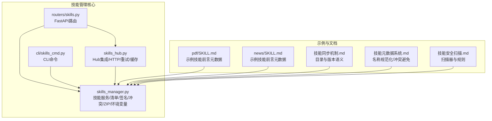
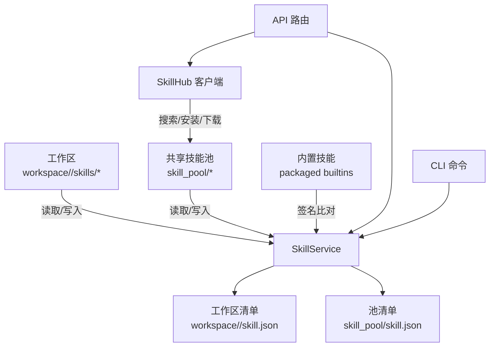
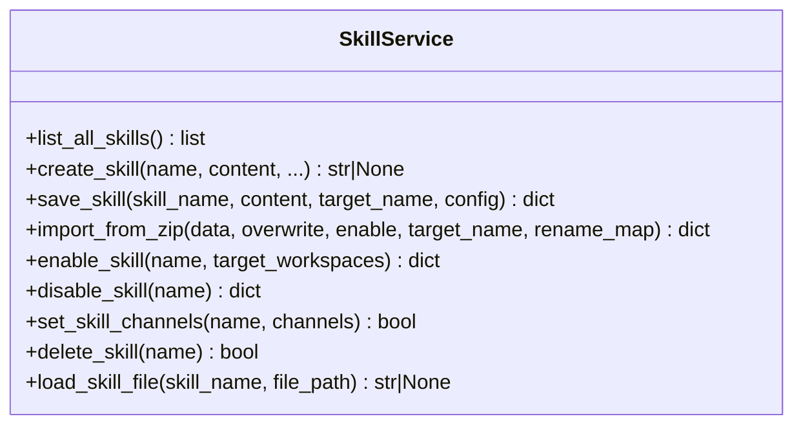
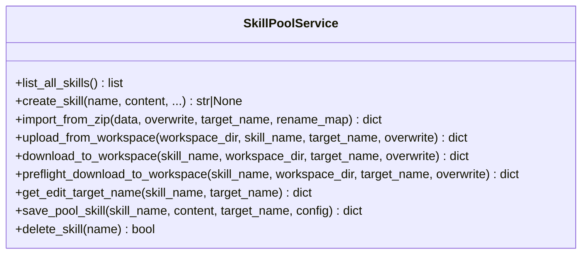
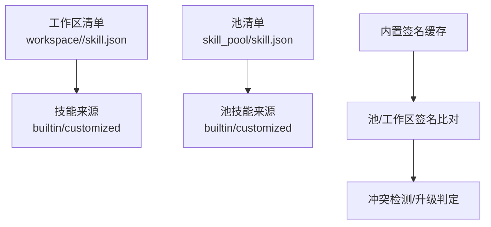
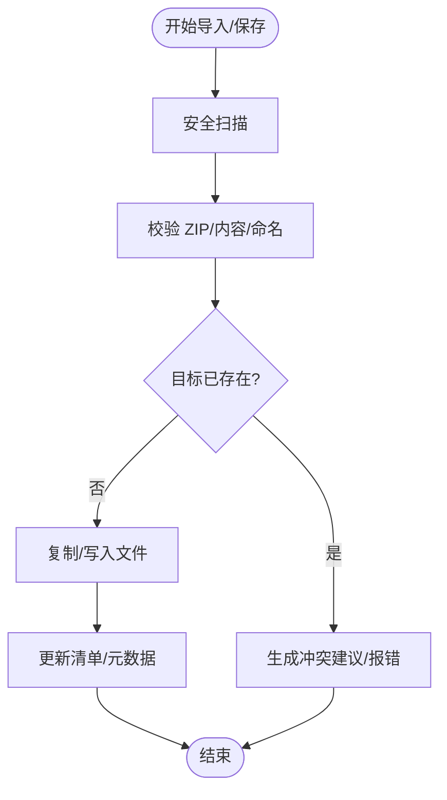
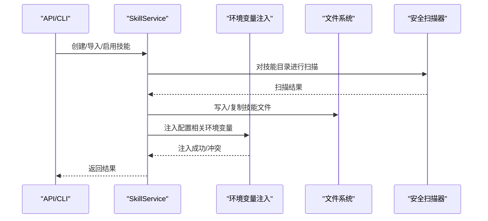
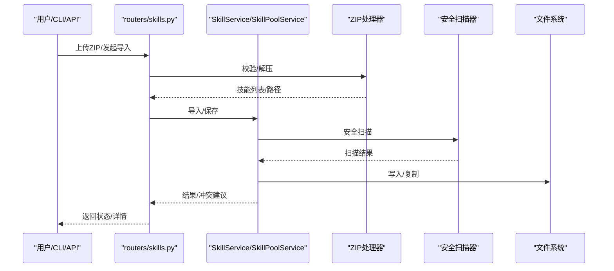
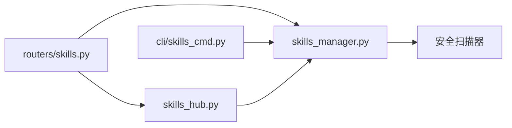

# 技能管理器

<cite>
**本文引用的文件**
- [skills_manager.py](file://copaw/src/copaw/agents/skills_manager.py)
- [skills_hub.py](file://copaw/src/copaw/agents/skills_hub.py)
- [skills.py](file://copaw/src/copaw/app/routers/skills.py)
- [skills_cmd.py](file://copaw/src/copaw/cli/skills_cmd.py)
- [pdf/SKILL.md](file://copaw/src/copaw/agents/skills/pdf/SKILL.md)
- [news/SKILL.md](file://copaw/src/copaw/agents/skills/news/SKILL.md)
- [技能同步机制.md](file://specs/copaw-repowiki/content/系统架构/插件化架构/技能插件系统/技能同步机制.md)
- [技能元数据系统.md](file://specs/copaw-repowiki/content/系统架构/插件化架构/技能插件系统/技能元数据系统.md)
- [技能安全扫描.md](file://specs/copaw-repowiki/content/系统架构/插件化架构/技能插件系统/技能安全扫描.md)
</cite>

## 目录
1. [简介](#简介)
2. [项目结构](#项目结构)
3. [核心组件](#核心组件)
4. [架构总览](#架构总览)
5. [详细组件分析](#详细组件分析)
6. [依赖关系分析](#依赖关系分析)
7. [性能考量](#性能考量)
8. [故障排查指南](#故障排查指南)
9. [结论](#结论)
10. [附录](#附录)

## 简介
本技术文档围绕技能管理器展开，系统性阐述 SkillsManager 的核心能力与实现细节，包括技能的注册、加载、卸载与生命周期管理；技能目录结构（工作区技能目录、共享技能池、内置技能）的组织与管理；技能签名生成与冲突检测算法；技能版本管理与更新策略；技能配置环境变量的注入机制与安全考量；以及技能导入、导出与同步的完整流程（含 ZIP 包处理与文件锁定机制）。文档同时提供最佳实践与常见问题解决方案，帮助开发者与运维人员高效、安全地使用与扩展技能体系。

## 项目结构
技能管理相关代码主要分布在以下模块：
- 核心逻辑：copaw/src/copaw/agents/skills_manager.py（技能服务、清单管理、签名与冲突检测、ZIP 处理、环境变量注入等）
- 技能仓库集成：copaw/src/copaw/agents/skills_hub.py（Hub 搜索、安装、下载、HTTP 请求与重试、缓存等）
- API 接口：copaw/src/copaw/app/routers/skills.py（FastAPI 路由，提供技能查询、导入、导出、刷新等接口）
- CLI 命令：copaw/src/copaw/cli/skills_cmd.py（交互式技能配置、列表、启用/禁用）
- 示例技能：copaw/src/copaw/agents/skills/pdf/SKILL.md、copaw/src/copaw/agents/skills/news/SKILL.md（展示 SKILL.md 前言元数据与版本语义）
- 设计文档：specs/copaw-repowiki/content/系统架构/插件化架构/技能插件系统/（技能同步机制、元数据系统、安全扫描）

**图表来源**
- [skills_manager.py](file://copaw/src/copaw/agents/skills_manager.py)
- [skills_hub.py](file://copaw/src/copaw/agents/skills_hub.py)
- [skills.py](file://copaw/src/copaw/app/routers/skills.py)
- [skills_cmd.py](file://copaw/src/copaw/cli/skills_cmd.py)
- [pdf/SKILL.md](file://copaw/src/copaw/agents/skills/pdf/SKILL.md)
- [news/SKILL.md](file://copaw/src/copaw/agents/skills/news/SKILL.md)
- [技能同步机制.md](file://specs/copaw-repowiki/content/系统架构/插件化架构/技能插件系统/技能同步机制.md)
- [技能元数据系统.md](file://specs/copaw-repowiki/content/系统架构/插件化架构/技能插件系统/技能元数据系统.md)
- [技能安全扫描.md](file://specs/copaw-repowiki/content/系统架构/插件化架构/技能插件系统/技能安全扫描.md)

**章节来源**
- [skills_manager.py](file://copaw/src/copaw/agents/skills_manager.py)
- [skills_hub.py](file://copaw/src/copaw/agents/skills_hub.py)
- [skills.py](file://copaw/src/copaw/app/routers/skills.py)
- [skills_cmd.py](file://copaw/src/copaw/cli/skills_cmd.py)
- [pdf/SKILL.md](file://copaw/src/copaw/agents/skills/pdf/SKILL.md)
- [news/SKILL.md](file://copaw/src/copaw/agents/skills/news/SKILL.md)
- [技能同步机制.md](file://specs/copaw-repowiki/content/系统架构/插件化架构/技能插件系统/技能同步机制.md)
- [技能元数据系统.md](file://specs/copaw-repowiki/content/系统架构/插件化架构/技能插件系统/技能元数据系统.md)
- [技能安全扫描.md](file://specs/copaw-repowiki/content/系统架构/插件化架构/技能插件系统/技能安全扫描.md)

## 核心组件
- SkillService：工作区范围内的技能生命周期管理，负责技能创建、ZIP 导入、启用/禁用、通道路由、配置持久化与文件访问。以工作区 skills 目录为内容来源，以 skill.json 为运行时状态来源。
- SkillPoolService：共享技能池生命周期管理，负责创建池技能、导入 ZIP、同步内置技能、上传/下载技能至工作区、池内编辑与保存。
- 清单与目录：工作区清单（workspace/skill.json）、共享池清单（skill_pool/skill.json），分别记录技能启用状态、通道、来源、版本、签名、需求与更新时间等元数据。
- 签名与冲突：基于技能目录树内容与文件路径的 SHA-256 签名，用于内置/池/工作区一致性校验与冲突检测。
- ZIP 处理：校验 ZIP 结构、大小限制、路径安全、符号链接拒绝、解压与内容提取。
- 环境变量注入：根据技能配置与声明的需求，动态注入环境变量，支持并发与互斥控制。
- Hub 集成：远程技能仓库搜索、版本选择、文件获取、错误处理与重试策略。

**章节来源**
- [skills_manager.py](file://copaw/src/copaw/agents/skills_manager.py)
- [skills_hub.py](file://copaw/src/copaw/agents/skills_hub.py)

## 架构总览
技能管理器采用“工作区技能目录 + 共享技能池 + 内置技能”三层结构，结合清单与签名实现一致性与冲突检测。API 层提供导入/导出/刷新等能力，CLI 提供交互式配置，Hub 提供远程技能生态接入。

**图表来源**
- [skills_manager.py](file://copaw/src/copaw/agents/skills_manager.py)
- [skills_hub.py](file://copaw/src/copaw/agents/skills_hub.py)
- [skills.py](file://copaw/src/copaw/app/routers/skills.py)
- [skills_cmd.py](file://copaw/src/copaw/cli/skills_cmd.py)

## 详细组件分析

### SkillService：工作区技能生命周期
- 创建技能：校验 SKILL.md 前言元数据，写入目录与清单，自动推断来源（内置/定制），记录需求与更新时间。
- 编辑/重命名：支持就地编辑或重命名保存，内置技能被禁止直接修改内容，需重命名到新名称。
- ZIP 导入：校验 ZIP 结构与大小，提取技能，进行安全扫描，冲突检测，可选择覆盖与启用。
- 启用/禁用：仅更新清单状态，不改变文件；启用前进行安全扫描。
- 通道路由：按通道筛选有效技能集合。
- 文件读取：受控访问 references/scripts 子树，防止路径穿越。

**图表来源**
- [skills_manager.py](file://copaw/src/copaw/agents/skills_manager.py)

**章节来源**
- [skills_manager.py](file://copaw/src/copaw/agents/skills_manager.py)

### SkillPoolService：共享技能池生命周期
- 创建池技能：校验并写入池目录，更新池清单。
- ZIP 导入：与工作区类似，但针对池命名空间进行冲突检测。
- 上传/下载：将工作区技能上传到池，或将池技能下载到一个或多个工作区；下载时进行内置/定制冲突判定。
- 池内编辑：支持就地编辑与重命名，内置槽位重命名需改名到新名称。

**图表来源**
- [skills_manager.py](file://copaw/src/copaw/agents/skills_manager.py)

**章节来源**
- [skills_manager.py](file://copaw/src/copaw/agents/skills_manager.py)

### 清单与目录结构
- 工作区技能目录：workspace/<agent>/skills/<skill_name>/SKILL.md 及其子树（references/scripts 等）。
- 共享技能池目录：skill_pool/<skill_name>/SKILL.md。
- 内置技能目录：打包在代码中的内置技能，通过签名与池/工作区进行比对。
- 清单 schema：包含 schema_version、version、skills 映射（每个技能含 source、enabled、channels、config、metadata 等）。

**图表来源**
- [skills_manager.py](file://copaw/src/copaw/agents/skills_manager.py)

**章节来源**
- [skills_manager.py](file://copaw/src/copaw/agents/skills_manager.py)

### 签名生成与冲突检测算法
- 签名生成：对技能目录树中所有文件（排除系统缓存/临时文件）按路径与内容进行哈希，确保跨平台一致性。
- 冲突检测：ZIP 导入与保存时，若目标名称已存在或同名冲突，返回建议的新名称；池下载到工作区时，内置槽位与定制版本冲突需改名或提示升级。
- 冲突建议：基于时间戳后缀生成唯一候选名称，最多尝试若干次避免重复。

**图表来源**
- [skills_manager.py](file://copaw/src/copaw/agents/skills_manager.py)

**章节来源**
- [skills_manager.py](file://copaw/src/copaw/agents/skills_manager.py)

### 版本管理与更新策略
- 版本语义：内置技能通过 SKILL.md 前言元数据中的版本字段声明；池/工作区清单记录 version_text 与最新版本信息。
- 更新策略：
  - 池内内置技能：与打包内置签名比对，不同则更新；相同则标记为已同步。
  - 下载到工作区：若池为内置且版本一致则视为无需更改；否则提示升级或改名。
  - 上传到池：工作区定制技能可上传为池技能，保留配置；内置槽位禁止重命名覆盖。

**章节来源**
- [pdf/SKILL.md](file://copaw/src/copaw/agents/skills/pdf/SKILL.md)
- [news/SKILL.md](file://copaw/src/copaw/agents/skills/news/SKILL.md)
- [技能同步机制.md](file://specs/copaw-repowiki/content/系统架构/插件化架构/技能插件系统/技能同步机制.md)
- [skills_manager.py](file://copaw/src/copaw/agents/skills_manager.py)

### 技能配置环境变量注入机制与安全
- 注入规则：根据技能声明的 require_envs 列表，将配置中匹配的键注入为环境变量；同时注入完整 JSON 的环境变量，便于运行时读取。
- 并发与互斥：通过全局锁与活跃条目表，避免并发冲突；释放时按计数回滚。
- 安全考虑：扫描器对技能进行安全扫描，阻断高危风险；ZIP 解压严格校验路径与类型，拒绝符号链接。

**图表来源**
- [skills_manager.py](file://copaw/src/copaw/agents/skills_manager.py)
- [skills.py](file://copaw/src/copaw/app/routers/skills.py)
- [skills_cmd.py](file://copaw/src/copaw/cli/skills_cmd.py)

**章节来源**
- [skills_manager.py](file://copaw/src/copaw/agents/skills_manager.py)
- [技能安全扫描.md](file://specs/copaw-repowiki/content/系统架构/插件化架构/技能插件系统/技能安全扫描.md)

### 技能导入、导出与同步流程
- 导入（工作区）：ZIP 校验 → 内容提取 → 安全扫描 → 冲突检测 → 写入目录 → 清单更新 → 可选启用。
- 导入（池）：与工作区类似，但针对池命名空间进行冲突检测与来源判定。
- 导出（工作区/池）：读取清单与目录，生成 ZIP 或返回清单信息。
- 同步（池/工作区）：下载时进行内置/定制冲突判定；上传时保留配置并更新池清单。

**图表来源**
- [skills.py](file://copaw/src/copaw/app/routers/skills.py)
- [skills_manager.py](file://copaw/src/copaw/agents/skills_manager.py)

**章节来源**
- [skills.py](file://copaw/src/copaw/app/routers/skills.py)
- [skills_manager.py](file://copaw/src/copaw/agents/skills_manager.py)

## 依赖关系分析
- SkillService 与 SkillPoolService 依赖清单读写、签名计算、ZIP 处理、安全扫描器与文件系统。
- API 路由依赖 SkillService/SkillPoolService 与 Hub 客户端。
- CLI 依赖 SkillService/SkillPoolService 与配置加载。
- Hub 客户端依赖 HTTP 请求、重试与缓存策略。

**图表来源**
- [skills.py](file://copaw/src/copaw/app/routers/skills.py)
- [skills_manager.py](file://copaw/src/copaw/agents/skills_manager.py)
- [skills_hub.py](file://copaw/src/copaw/agents/skills_hub.py)
- [skills_cmd.py](file://copaw/src/copaw/cli/skills_cmd.py)

**章节来源**
- [skills.py](file://copaw/src/copaw/app/routers/skills.py)
- [skills_manager.py](file://copaw/src/copaw/agents/skills_manager.py)
- [skills_hub.py](file://copaw/src/copaw/agents/skills_hub.py)
- [skills_cmd.py](file://copaw/src/copaw/cli/skills_cmd.py)

## 性能考量
- 签名计算：仅对实际内容与路径进行哈希，排除系统缓存文件，保证跨平台一致性；在工作区清单重建时可选择跳过签名计算以提升性能。
- 清单更新：采用原子写入与文件锁，避免并发写入导致的数据损坏。
- ZIP 处理：限制解压大小与条目数量，拒绝不安全路径与符号链接，降低内存与磁盘压力。
- Hub 访问：支持超时、重试与指数退避，GitHub API 速率限制友好处理，减少失败重试成本。

[本节为通用指导，无需特定文件引用]

## 故障排查指南
- ZIP 上传失败：检查文件类型、大小限制、路径安全性与 ZIP 结构；确认未包含符号链接或越界路径。
- 冲突与重名：根据返回的建议名称进行重命名；工作区/池命名冲突需遵循内置槽位规则。
- 启用失败：启用前会进行安全扫描，若扫描不通过将返回扫描错误；修复高危问题后重试。
- Hub 访问异常：检查网络与认证（如 GITHUB_TOKEN），关注速率限制提示；调整超时与重试参数。
- 环境变量注入冲突：多个技能同时注入相同键名时会被拒绝；请使用不同的键或调整配置。

**章节来源**
- [skills.py](file://copaw/src/copaw/app/routers/skills.py)
- [skills_manager.py](file://copaw/src/copaw/agents/skills_manager.py)
- [skills_hub.py](file://copaw/src/copaw/agents/skills_hub.py)

## 结论
技能管理器通过清晰的三层结构（工作区/池/内置）、可靠的签名与冲突检测、严格的 ZIP 安全校验与环境变量注入机制，实现了技能的可注册、可加载、可卸载与可同步。配合 API 与 CLI 的统一入口，以及 Hub 生态的远程能力，为多 Agent 场景下的技能复用与治理提供了坚实基础。建议在生产环境中启用安全扫描、合理设置超时与重试、严格控制命名与权限，以获得更稳定与安全的使用体验。

[本节为总结性内容，无需特定文件引用]

## 附录

### 最佳实践
- 使用 SKILL.md 前言元数据明确 name、description 与版本；内置技能应提供稳定的版本号。
- 导入/保存前先进行安全扫描，避免引入高危风险。
- ZIP 导入时尽量提供清晰的目录布局与合法文件名，减少冲突概率。
- 工作区与池之间保持版本一致性，必要时进行升级或改名。
- 通过 CLI 或 API 进行批量配置与刷新，避免手工修改清单造成不一致。

### 常见问题
- Q：为什么启用技能时报扫描错误？
  A：技能内容触发了安全扫描器的高危规则，请修正或移除可疑内容后重试。
- Q：导入 ZIP 时提示冲突怎么办？
  A：根据建议名称进行重命名，或选择覆盖策略（注意池内置槽位的保护规则）。
- Q：Hub 下载到工作区提示“builtin_upgrade”如何处理？
  A：根据提示升级池内置版本，或改名为新名称以定制化。

**章节来源**
- [skills.py](file://copaw/src/copaw/app/routers/skills.py)
- [skills_manager.py](file://copaw/src/copaw/agents/skills_manager.py)
- [技能安全扫描.md](file://specs/copaw-repowiki/content/系统架构/插件化架构/技能插件系统/技能安全扫描.md)