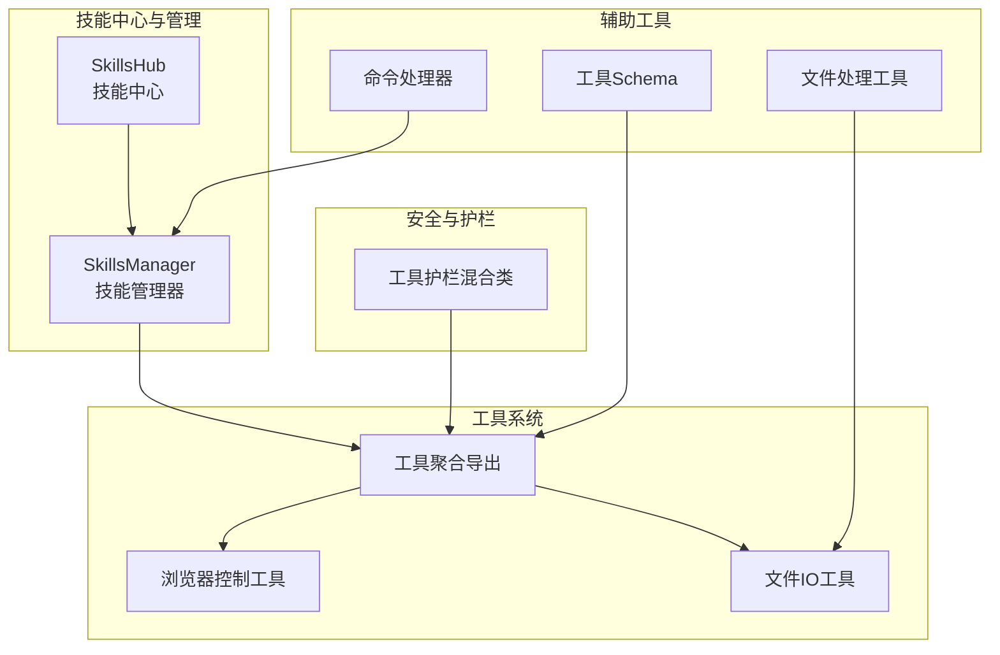
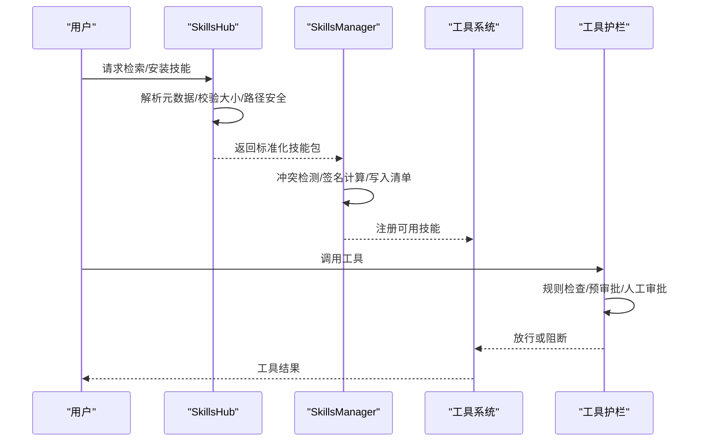
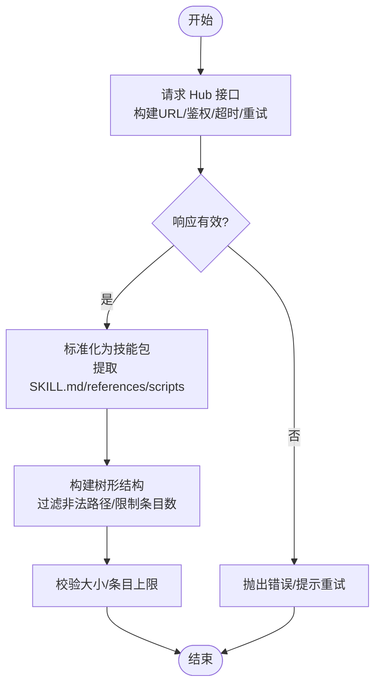
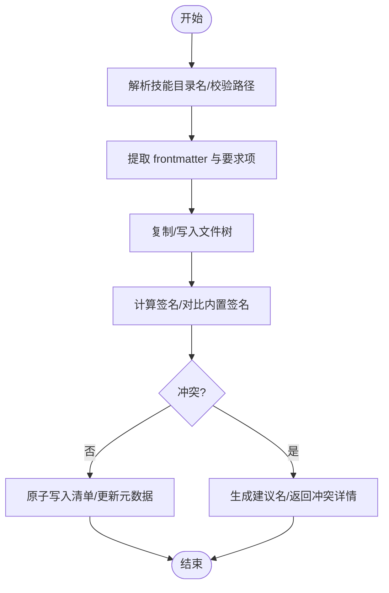
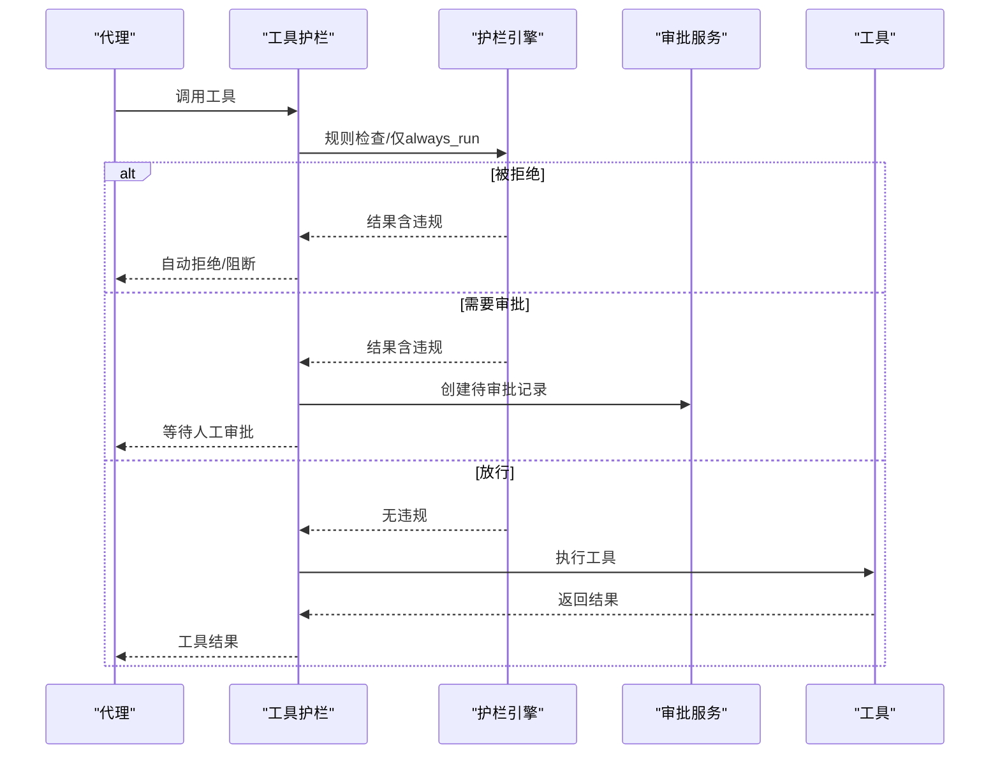
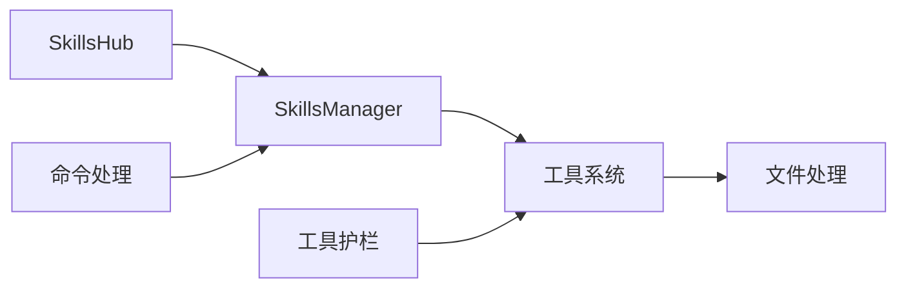

# 智能技能系统

<cite>
**本文引用的文件**
- [skills_hub.py](file://copaw/src/copaw/agents/skills_hub.py)
- [skills_manager.py](file://copaw/src/copaw/agents/skills_manager.py)
- [browser_control.py](file://copaw/src/copaw/agents/tools/browser_control.py)
- [file_io.py](file://copaw/src/copaw/agents/tools/file_io.py)
- [tools/__init__.py](file://copaw/src/copaw/agents/tools/__init__.py)
- [tool_guard_mixin.py](file://copaw/src/copaw/agents/tool_guard_mixin.py)
- [file_handling.py](file://copaw/src/copaw/agents/utils/file_handling.py)
- [command_handler.py](file://copaw/src/copaw/agents/command_handler.py)
- [schema.py](file://copaw/src/copaw/agents/schema.py)
</cite>

## 目录
1. [简介](#简介)
2. [项目结构](#项目结构)
3. [核心组件](#核心组件)
4. [架构总览](#架构总览)
5. [详细组件分析](#详细组件分析)
6. [依赖分析](#依赖分析)
7. [性能考虑](#性能考虑)
8. [故障排查指南](#故障排查指南)
9. [结论](#结论)
10. [附录](#附录)

## 简介
本技术文档面向“智能技能系统”，围绕 SkillsManager 技能管理器与 SkillsHub 技能中心展开，系统性阐述其架构设计、插件化扩展机制、内置技能组织与技能池管理策略；同时覆盖浏览器控制、文档处理、文件操作、系统工具等技能的实现模式与使用方法，并说明工具系统的集成方式与安全机制（工具护栏）。最后提供技能开发的完整指南，包括技能模板、参数校验、错误处理与调试技巧，以及技能注册、加载、卸载的流程与最佳实践。

## 项目结构
智能技能系统主要由以下模块构成：
- 技能中心与管理：SkillsHub（从外部仓库/平台拉取技能）、SkillsManager（本地技能池同步、清单管理、冲突检测与签名校验）
- 工具系统：浏览器控制、文件读写、搜索、截图、媒体查看、时间与时令牌统计等工具
- 安全与护栏：工具护栏混合类，拦截敏感工具调用，支持预审批与人工审批流
- 辅助工具：文件下载、编码兼容读取、命令处理等

图示来源
- [skills_hub.py](file://copaw/src/copaw/agents/skills_hub.py)
- [skills_manager.py](file://copaw/src/copaw/agents/skills_manager.py)
- [tools/__init__.py](file://copaw/src/copaw/agents/tools/__init__.py)
- [browser_control.py](file://copaw/src/copaw/agents/tools/browser_control.py)
- [file_io.py](file://copaw/src/copaw/agents/tools/file_io.py)
- [tool_guard_mixin.py](file://copaw/src/copaw/agents/tool_guard_mixin.py)
- [file_handling.py](file://copaw/src/copaw/agents/utils/file_handling.py)
- [command_handler.py](file://copaw/src/copaw/agents/command_handler.py)
- [schema.py](file://copaw/src/copaw/agents/schema.py)

章节来源
- [skills_hub.py](file://copaw/src/copaw/agents/skills_hub.py)
- [skills_manager.py](file://copaw/src/copaw/agents/skills_manager.py)
- [tools/__init__.py](file://copaw/src/copaw/agents/tools/__init__.py)

## 核心组件
- SkillsHub：负责从外部技能中心（如 ClawHub）检索、下载、解包技能包，解析元数据与内容，支持取消检查、重试退避、大小限制与路径安全校验。
- SkillsManager：负责本地技能池与工作区技能清单的管理，包括内置技能签名缓存、冲突建议命名、导入/保存时的签名计算、环境变量注入、文件锁保护的清单原子写入等。
- 工具系统：通过统一导出入口聚合各类工具，提供浏览器控制、文件读写、搜索、截图、媒体查看、时间与时令牌统计等能力。
- 工具护栏：在代理执行前拦截敏感工具调用，按规则进行自动拒绝、预审批与人工审批，确保工具调用安全可控。
- 辅助工具：文件下载与编码兼容读取、命令处理（/compact、/new、/clear 等）等。

章节来源
- [skills_hub.py](file://copaw/src/copaw/agents/skills_hub.py)
- [skills_manager.py](file://copaw/src/copaw/agents/skills_manager.py)
- [tools/__init__.py](file://copaw/src/copaw/agents/tools/__init__.py)
- [tool_guard_mixin.py](file://copaw/src/copaw/agents/tool_guard_mixin.py)
- [file_handling.py](file://copaw/src/copaw/agents/utils/file_handling.py)
- [command_handler.py](file://copaw/src/copaw/agents/command_handler.py)

## 架构总览
下图展示技能中心与管理器、工具系统与护栏的整体交互关系：

图示来源
- [skills_hub.py](file://copaw/src/copaw/agents/skills_hub.py)
- [skills_manager.py](file://copaw/src/copaw/agents/skills_manager.py)
- [tool_guard_mixin.py](file://copaw/src/copaw/agents/tool_guard_mixin.py)
- [tools/__init__.py](file://copaw/src/copaw/agents/tools/__init__.py)

## 详细组件分析

### SkillsHub 技能中心
- 功能要点
  - 外部 Hub 协议适配：支持 ClawHub 等平台的搜索、版本、详情与文件获取接口，自动拼接 URL 并处理响应。
  - 下载与解包：支持 ZIP 流式读取、最大条目与字节限制、路径穿越防护、符号链接拒绝、分块读取与超时/重试/退避策略。
  - 内容归一化：将不同 Hub 的响应标准化为统一的“技能包”结构，提取 SKILL.md、references/scripts 树与额外文件。
  - 取消与错误处理：支持上下文取消检查、HTTP 错误提示、速率限制与临时错误重试、超大响应体报错。
- 关键流程
  - 搜索/详情/版本/文件请求：构建请求头、鉴权（GitHub Token）、读取响应并校验大小。
  - 归一化与树形结构：将扁平 files 映射为 references/scripts 树，过滤非法路径，保留必要文件。
  - 取消检查：在关键 IO 步骤检查取消回调，避免长时间阻塞。

图示来源
- [skills_hub.py](file://copaw/src/copaw/agents/skills_hub.py)

章节来源
- [skills_hub.py](file://copaw/src/copaw/agents/skills_hub.py)

### SkillsManager 技能管理器
- 功能要点
  - 技能池与工作区管理：维护共享技能池与工作区技能目录，提供清单读写、原子更新与文件锁保护。
  - 冲突检测与签名：基于技能树哈希的签名计算，内置技能签名缓存，冲突时生成带时间戳的建议名。
  - 环境变量注入：根据技能配置与声明的 require_envs 注入环境变量，支持并发安全的获取/释放。
  - 前端素材与版本：从 SKILL.md frontmatter 提取名称、描述、版本信息，支持 metadata.requires 兼容。
- 关键流程
  - 导入/保存：解析目标目录名、校验路径安全性、从树结构写入文件、计算签名、更新清单。
  - 冲突处理：当同名技能存在且签名不一致时，返回冲突详情与建议名。
  - 清单写入：使用临时文件与原子替换，保证并发安全与崩溃恢复。

图示来源
- [skills_manager.py](file://copaw/src/copaw/agents/skills_manager.py)

章节来源
- [skills_manager.py](file://copaw/src/copaw/agents/skills_manager.py)

### 工具系统与工具护栏
- 工具系统
  - 统一导出：集中导出各类工具函数，便于代理直接调用。
  - 浏览器控制：基于 Playwright 的异步/同步模式切换、持久化上下文、标签页管理、网络与控制台监听、空闲回收。
  - 文件 IO：相对路径解析、编码选择（含 BOM 兼容）、行范围读取、截断提示、追加/编辑/写入。
- 工具护栏
  - 拦截与决策：在代理执行前对工具调用进行规则检查，支持自动拒绝、预审批与人工审批队列。
  - 并发安全：使用锁序列化决策过程，实际执行阶段保持并行以提升吞吐。
  - 记忆清理：移除被拒绝的消息与解释，保持对话历史整洁。

图示来源
- [tool_guard_mixin.py](file://copaw/src/copaw/agents/tool_guard_mixin.py)

章节来源
- [tools/__init__.py](file://copaw/src/copaw/agents/tools/__init__.py)
- [browser_control.py](file://copaw/src/copaw/agents/tools/browser_control.py)
- [file_io.py](file://copaw/src/copaw/agents/tools/file_io.py)
- [tool_guard_mixin.py](file://copaw/src/copaw/agents/tool_guard_mixin.py)

### 辅助工具与命令处理
- 文件处理：跨平台编码兼容读取、远程下载（wget/curl/urllib）、后缀猜测（魔数/HEAD）、下载目录管理。
- 命令处理：系统命令解析与执行，支持紧凑历史、新建会话、清空历史、查看历史、等待摘要任务、查看指定消息、导出/加载历史等。

章节来源
- [file_handling.py](file://copaw/src/copaw/agents/utils/file_handling.py)
- [command_handler.py](file://copaw/src/copaw/agents/command_handler.py)

## 依赖分析
- 组件耦合
  - SkillsHub 与 SkillsManager：Hub 负责外部拉取，Manager 负责本地落盘与清单管理，二者通过标准化技能包进行解耦。
  - 工具系统与护栏：护栏作为混合类在代理生命周期中拦截工具调用，与工具系统松耦合，仅依赖工具名称与输入。
  - 辅助工具：文件处理与命令处理分别服务于工具与代理运行时，降低重复实现。
- 外部依赖
  - Playwright：浏览器控制工具依赖异步/同步两种模式，容器内启用沙箱参数。
  - 编码与下载：文件读取采用多编码回退策略，下载优先使用系统工具，失败回退至 urllib。
- 循环依赖
  - 未发现循环依赖；各模块职责清晰，接口边界明确。

图示来源
- [skills_hub.py](file://copaw/src/copaw/agents/skills_hub.py)
- [skills_manager.py](file://copaw/src/copaw/agents/skills_manager.py)
- [tools/__init__.py](file://copaw/src/copaw/agents/tools/__init__.py)
- [tool_guard_mixin.py](file://copaw/src/copaw/agents/tool_guard_mixin.py)
- [file_handling.py](file://copaw/src/copaw/agents/utils/file_handling.py)
- [command_handler.py](file://copaw/src/copaw/agents/command_handler.py)

章节来源
- [skills_hub.py](file://copaw/src/copaw/agents/skills_hub.py)
- [skills_manager.py](file://copaw/src/copaw/agents/skills_manager.py)
- [tools/__init__.py](file://copaw/src/copaw/agents/tools/__init__.py)
- [tool_guard_mixin.py](file://copaw/src/copaw/agents/tool_guard_mixin.py)
- [file_handling.py](file://copaw/src/copaw/agents/utils/file_handling.py)
- [command_handler.py](file://copaw/src/copaw/agents/command_handler.py)

## 性能考虑
- I/O 与并发
  - 浏览器控制：异步 Playwright 在非 Windows/Uvicorn 热重载环境下具备更好性能；在特定组合下回退到同步线程池。
  - 清单写入：使用临时文件与原子替换，减少竞态与部分写入风险。
- 资源回收
  - 浏览器空闲回收：超过阈值时间未活动后自动停止，释放渲染进程资源。
- 网络与下载
  - Hub 请求支持指数退避与可重试状态码，避免瞬时错误放大。
  - 下载优先使用系统工具，失败回退至 urllib，兼顾速度与可靠性。

## 故障排查指南
- 技能导入冲突
  - 现象：同名技能已存在且签名不一致。
  - 处理：使用建议名重试，或确认是否需要自定义覆盖。
  - 参考
    - [skills_manager.py](file://copaw/src/copaw/agents/skills_manager.py)
- 技能导入被取消
  - 现象：用户取消导入导致中断。
  - 处理：检查取消回调逻辑，确保在关键步骤正确检查。
  - 参考
    - [skills_hub.py](file://copaw/src/copaw/agents/skills_hub.py)
- 工具护栏阻断
  - 现象：工具调用被拦截，提示风险并等待审批。
  - 处理：查看护栏日志与审批队列，必要时进行预审批或人工审批。
  - 参考
    - [tool_guard_mixin.py](file://copaw/src/copaw/agents/tool_guard_mixin.py)
- 浏览器启动失败
  - 现象：Playwright 未安装或启动异常。
  - 处理：按提示安装 Playwright 并执行初始化；容器环境启用沙箱参数。
  - 参考
    - [browser_control.py](file://copaw/src/copaw/agents/tools/browser_control.py)
- 文件读取乱码
  - 现象：跨平台文本文件读取出现乱码。
  - 处理：使用编码回退策略读取，或手动指定编码。
  - 参考
    - [file_handling.py](file://copaw/src/copaw/agents/utils/file_handling.py)

章节来源
- [skills_manager.py](file://copaw/src/copaw/agents/skills_manager.py)
- [skills_hub.py](file://copaw/src/copaw/agents/skills_hub.py)
- [tool_guard_mixin.py](file://copaw/src/copaw/agents/tool_guard_mixin.py)
- [browser_control.py](file://copaw/src/copaw/agents/tools/browser_control.py)
- [file_handling.py](file://copaw/src/copaw/agents/utils/file_handling.py)

## 结论
智能技能系统通过 SkillsHub 与 SkillsManager 实现了“外部技能获取—本地技能池管理”的闭环，结合工具护栏确保工具调用安全可控。工具系统以统一导出与模块化设计支撑多种技能场景，辅以文件处理与命令处理工具提升易用性。整体架构在可扩展性、安全性与性能之间取得平衡，适合在多通道、多技能的复杂应用场景中稳定运行。

## 附录

### 技能开发指南
- 技能模板
  - 使用 SKILL.md frontmatter 声明名称、描述、版本与 metadata.requires（bins/env）。
  - 将脚本与引用文件放入 references/scripts 子树，或在 files 中提供扁平映射。
  - 参考
    - [skills_hub.py](file://copaw/src/copaw/agents/skills_hub.py)
- 参数验证
  - 对路径参数进行绝对路径与相对路径解析，拒绝越界访问。
  - 对数值型参数进行类型转换与范围校验。
  - 参考
    - [file_io.py](file://copaw/src/copaw/agents/tools/file_io.py)
- 错误处理
  - 统一返回 ToolResponse 文本块，包含错误信息与上下文提示。
  - 对网络/下载/文件操作异常进行捕获与格式化输出。
  - 参考
    - [file_io.py](file://copaw/src/copaw/agents/tools/file_io.py)
    - [file_handling.py](file://copaw/src/copaw/agents/utils/file_handling.py)
- 调试技巧
  - 使用命令处理器执行 /compact、/new、/clear、/history、/dump_history、/load_history 等命令快速定位问题。
  - 参考
    - [command_handler.py](file://copaw/src/copaw/agents/command_handler.py)
- 注册/加载/卸载流程
  - 注册：通过工具聚合导出暴露工具函数。
  - 加载：SkillsManager 读取清单并应用环境变量注入。
  - 卸载：删除技能目录与清单条目，必要时清理环境变量。
  - 参考
    - [tools/__init__.py](file://copaw/src/copaw/agents/tools/__init__.py)
    - [skills_manager.py](file://copaw/src/copaw/agents/skills_manager.py)

章节来源
- [skills_hub.py](file://copaw/src/copaw/agents/skills_hub.py)
- [file_io.py](file://copaw/src/copaw/agents/tools/file_io.py)
- [file_handling.py](file://copaw/src/copaw/agents/utils/file_handling.py)
- [command_handler.py](file://copaw/src/copaw/agents/command_handler.py)
- [tools/__init__.py](file://copaw/src/copaw/agents/tools/__init__.py)
- [skills_manager.py](file://copaw/src/copaw/agents/skills_manager.py)