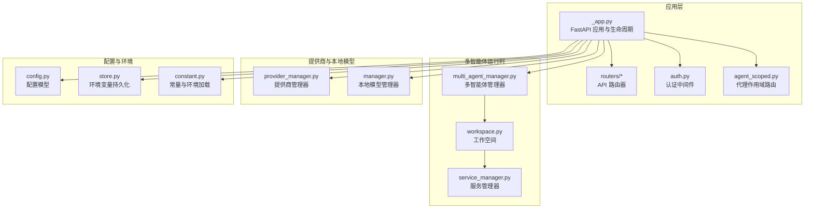
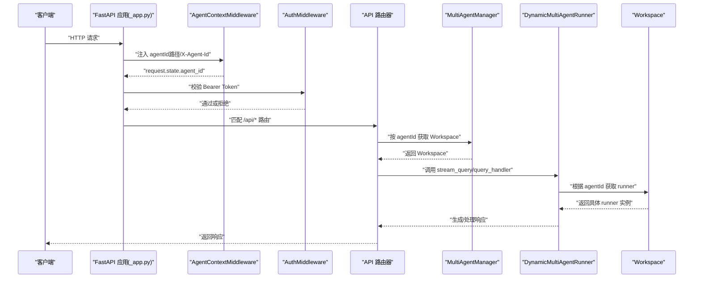
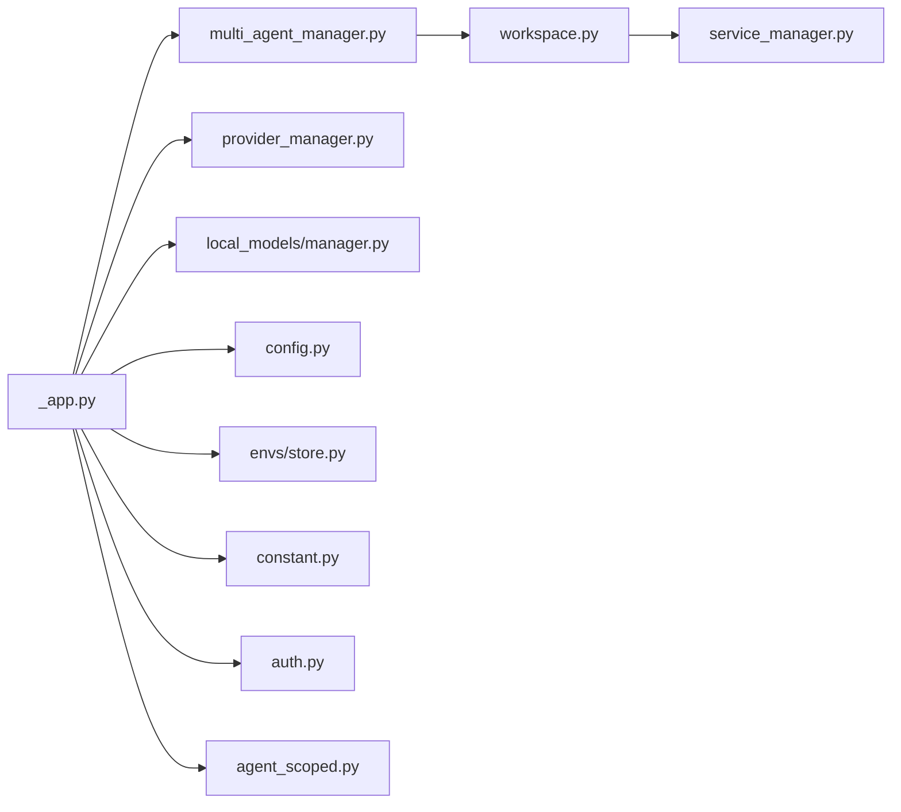

# 核心组件架构

<cite>
**本文引用的文件**
- [_app.py](file://copaw/src/copaw/app/_app.py)
- [auth.py](file://copaw/src/copaw/app/auth.py)
- [agent_scoped.py](file://copaw/src/copaw/app/routers/agent_scoped.py)
- [agent.py](file://copaw/src/copaw/app/routers/agent.py)
- [multi_agent_manager.py](file://copaw/src/copaw/app/multi_agent_manager.py)
- [workspace.py](file://copaw/src/copaw/app/workspace/workspace.py)
- [service_manager.py](file://copaw/src/copaw/app/workspace/service_manager.py)
- [provider_manager.py](file://copaw/src/copaw/providers/provider_manager.py)
- [manager.py](file://copaw/src/copaw/local_models/manager.py)
- [store.py](file://copaw/src/copaw/envs/store.py)
- [constant.py](file://copaw/src/copaw/constant.py)
- [config.py](file://copaw/src/copaw/config/config.py)
- [agent_context.py](file://copaw/src/copaw/app/agent_context.py)
</cite>

## 目录
1. [简介](#简介)
2. [项目结构](#项目结构)
3. [核心组件](#核心组件)
4. [架构总览](#架构总览)
5. [详细组件分析](#详细组件分析)
6. [依赖关系分析](#依赖关系分析)
7. [性能考虑](#性能考虑)
8. [故障排查指南](#故障排查指南)
9. [结论](#结论)

## 简介
本技术文档聚焦于基于 FastAPI 的核心组件架构，系统性阐述以下主题：
- 应用整体架构与生命周期管理（启动、中间件注册、静态资源、路由挂载）
- 认证中间件的实现机制与安全策略配置
- 路由器系统的组织结构与路由分发机制（通用路由与代理作用域路由）
- 配置管理系统的设计模式与环境变量处理流程
- 全局状态管理机制（MultiAgentManager、ProviderManager 等）
- 中间件注册顺序与请求处理流程
- 组件间依赖关系与数据流
- 性能优化建议与故障排查

## 项目结构
本项目采用“按功能域分层 + 按职责聚合”的组织方式：
- 应用入口与生命周期：FastAPI 应用定义、中间件注册、静态资源与 SPA 回退、路由挂载
- 多智能体运行时：MultiAgentManager、Workspace、ServiceManager
- 提供商与本地模型：ProviderManager、LocalModelManager
- 配置与环境：config.py、envs.store、constant.py
- 安全与认证：AuthMiddleware、AgentContextMiddleware
- 路由器：统一聚合与代理作用域路由



图表来源
- [_app.py:270-441](file://copaw/src/copaw/app/_app.py#L270-L441)
- [agent_scoped.py:53-92](file://copaw/src/copaw/app/routers/agent_scoped.py#L53-L92)
- [multi_agent_manager.py:17-462](file://copaw/src/copaw/app/multi_agent_manager.py#L17-L462)
- [workspace.py:47-389](file://copaw/src/copaw/app/workspace/workspace.py#L47-L389)
- [service_manager.py:74-421](file://copaw/src/copaw/app/workspace/service_manager.py#L74-L421)
- [provider_manager.py:567-800](file://copaw/src/copaw/providers/provider_manager.py#L567-L800)
- [manager.py:14-132](file://copaw/src/copaw/local_models/manager.py#L14-L132)
- [config.py:1-800](file://copaw/src/copaw/config/config.py#L1-L800)
- [store.py:1-243](file://copaw/src/copaw/envs/store.py#L1-L243)
- [constant.py:1-271](file://copaw/src/copaw/constant.py#L1-L271)

章节来源
- [_app.py:270-441](file://copaw/src/copaw/app/_app.py#L270-L441)
- [agent_scoped.py:53-92](file://copaw/src/copaw/app/routers/agent_scoped.py#L53-L92)

## 核心组件
- FastAPI 应用与生命周期管理：在 lifespan 中完成迁移、初始化、全局状态注入与优雅停机
- 认证中间件：基于 Bearer Token 的鉴权，支持公有路径豁免与本地回环豁免
- 代理作用域路由：通过 AgentContextMiddleware 注入 agentId，实现多智能体隔离
- 多智能体管理器：按需加载、零停机热重载、并发启动与任务追踪
- 工作空间与服务管理：声明式服务注册、依赖解析、可复用组件与并发生命周期控制
- 提供商与本地模型：统一提供商接口、内置提供商集合、本地模型下载与服务器生命周期控制
- 配置与环境：强类型配置模型、环境变量加载与持久化、常量与默认值

章节来源
- [_app.py:156-275](file://copaw/src/copaw/app/_app.py#L156-L275)
- [auth.py:340-410](file://copaw/src/copaw/app/auth.py#L340-L410)
- [agent_scoped.py:15-51](file://copaw/src/copaw/app/routers/agent_scoped.py#L15-L51)
- [multi_agent_manager.py:17-462](file://copaw/src/copaw/app/multi_agent_manager.py#L17-L462)
- [workspace.py:47-389](file://copaw/src/copaw/app/workspace/workspace.py#L47-L389)
- [service_manager.py:74-421](file://copaw/src/copaw/app/workspace/service_manager.py#L74-L421)
- [provider_manager.py:567-800](file://copaw/src/copaw/providers/provider_manager.py#L567-L800)
- [manager.py:14-132](file://copaw/src/copaw/local_models/manager.py#L14-L132)
- [config.py:1-800](file://copaw/src/copaw/config/config.py#L1-L800)
- [store.py:1-243](file://copaw/src/copaw/envs/store.py#L1-L243)
- [constant.py:1-271](file://copaw/src/copaw/constant.py#L1-L271)

## 架构总览
下图展示从请求进入至响应返回的关键路径，涵盖中间件顺序、多智能体上下文注入、动态运行器选择与全局状态访问。



图表来源
- [_app.py:270-367](file://copaw/src/copaw/app/_app.py#L270-L367)
- [agent_scoped.py:15-51](file://copaw/src/copaw/app/routers/agent_scoped.py#L15-L51)
- [auth.py:340-410](file://copaw/src/copaw/app/auth.py#L340-L410)
- [multi_agent_manager.py:34-82](file://copaw/src/copaw/app/multi_agent_manager.py#L34-L82)
- [_app.py:54-130](file://copaw/src/copaw/app/_app.py#L54-L130)

章节来源
- [_app.py:270-367](file://copaw/src/copaw/app/_app.py#L270-L367)
- [agent_scoped.py:15-51](file://copaw/src/copaw/app/routers/agent_scoped.py#L15-L51)
- [auth.py:340-410](file://copaw/src/copaw/app/auth.py#L340-L410)
- [multi_agent_manager.py:34-82](file://copaw/src/copaw/app/multi_agent_manager.py#L34-L82)

## 详细组件分析

### 应用生命周期与中间件注册顺序
- 生命周期钩子：在 lifespan 中执行迁移、初始化 MultiAgentManager、ProviderManager、LocalModelManager，并注入到 app.state；在关闭阶段优雅停止本地模型服务器与所有智能体
- 中间件注册顺序：
  1) AgentContextMiddleware：提取 agentId 并注入上下文
  2) AuthMiddleware：鉴权与公有路径豁免
  3) CORS（可选）：基于环境变量启用
- 路由挂载：
  - 通用 /api/* 路由器
  - 代理作用域 /api/agents/{agentId}/* 路由器
  - AgentApp 路由（/api/agent）
  - 语音通道路由（根路径）
  - 自定义通道路由优先挂载
  - 控制台静态资源与 SPA 回退

章节来源
- [_app.py:156-275](file://copaw/src/copaw/app/_app.py#L156-L275)
- [_app.py:270-375](file://copaw/src/copaw/app/_app.py#L270-L375)

### 认证中间件实现与安全策略
- 功能要点：
  - 基于 HMAC-SHA256 的 JWT 签名与校验
  - auth.json 存储用户与密钥，严格权限控制
  - 支持自动注册（环境变量）、凭据更新与会话轮换
  - 公有路径与前缀豁免、仅对 /api/ 路由保护、本地回环豁免
- 安全策略：
  - 单用户设计，首次注册后锁定
  - JWT 过期时间、签名完整性校验
  - 禁止明文密码存储，使用加盐哈希
  - 受保护的环境变量不注入进程环境

章节来源
- [auth.py:1-410](file://copaw/src/copaw/app/auth.py#L1-L410)
- [constant.py:146-182](file://copaw/src/copaw/constant.py#L146-L182)

### 代理作用域路由与上下文注入
- AgentContextMiddleware：
  - 优先从路径 /api/agents/{agentId}/... 解析 agentId
  - 其次从 X-Agent-Id 头部读取
  - 将 agentId 写入上下文变量，供下游 runner 使用
- 代理作用域路由器：
  - 在 /agents/{agentId}/ 下挂载多个子路由（agent、chats、config、cron、mcp、skills、tools、workspace、console）
  - 保持各子路由自身前缀，便于清晰的资源划分

章节来源
- [agent_scoped.py:15-51](file://copaw/src/copaw/app/routers/agent_scoped.py#L15-L51)
- [agent_scoped.py:53-92](file://copaw/src/copaw/app/routers/agent_scoped.py#L53-L92)
- [agent_context.py:22-106](file://copaw/src/copaw/app/agent_context.py#L22-L106)

### 多智能体管理器与工作空间
- MultiAgentManager：
  - 按需懒加载、线程安全（异步锁）
  - 零停机热重载：新实例启动成功后原子替换旧实例，后台清理旧实例
  - 启动并发：并发启动已启用的智能体
  - 停机清理：取消待完成任务、优雅停止
- Workspace：
  - 声明式服务注册与生命周期管理（ServiceManager）
  - 可复用组件：内存管理器、聊天管理器等在热重载时可转移
  - 任务追踪：后台任务与重连管理
- ServiceManager：
  - 描述符驱动的服务注册、依赖解析、并发/串行初始化
  - 可复用服务标记与重载回调
  - 停止时区分 final 与非 final，避免重复释放可复用组件

```mermaid
classDiagram
class MultiAgentManager {
+get_agent(agent_id) Workspace
+reload_agent(agent_id) bool
+start_all_configured_agents() dict
+stop_all() void
}
class Workspace {
+runner AgentRunner
+memory_manager BaseMemoryManager
+mcp_manager MCPClientManager
+chat_manager ChatManager
+channel_manager BaseChannel
+cron_manager CronManager
+start() async
+stop(final) async
+set_reusable_components(components) async
}
class ServiceManager {
+register(descriptor) void
+start_all() async
+stop_all(final) async
+set_reusable(name, instance) async
+get_reusable_services() dict
}
MultiAgentManager --> Workspace : "按需创建/替换"
Workspace --> ServiceManager : "委托服务管理"
ServiceManager --> "多个服务" : "注册/启动/停止"
```

图表来源
- [multi_agent_manager.py:17-462](file://copaw/src/copaw/app/multi_agent_manager.py#L17-L462)
- [workspace.py:47-389](file://copaw/src/copaw/app/workspace/workspace.py#L47-L389)
- [service_manager.py:74-421](file://copaw/src/copaw/app/workspace/service_manager.py#L74-L421)

章节来源
- [multi_agent_manager.py:17-462](file://copaw/src/copaw/app/multi_agent_manager.py#L17-L462)
- [workspace.py:47-389](file://copaw/src/copaw/app/workspace/workspace.py#L47-L389)
- [service_manager.py:74-421](file://copaw/src/copaw/app/workspace/service_manager.py#L74-L421)

### 动态运行器与全局状态
- DynamicMultiAgentRunner：
  - 通过上下文变量获取当前 agentId
  - 根据 agentId 从 MultiAgentManager 获取对应 Workspace 的 runner
  - 代理 stream_query 与 query_handler，支持错误透传
- 全局状态注入：
  - app.state.multi_agent_manager、app.state.provider_manager、app.state.local_model_manager
  - app.state.get_agent_by_id 用于按需获取 agent 实例

章节来源
- [_app.py:54-130](file://copaw/src/copaw/app/_app.py#L54-L130)
- [_app.py:205-220](file://copaw/src/copaw/app/_app.py#L205-L220)

### 提供商与本地模型管理
- ProviderManager：
  - 单例模式，内置多家提供商（OpenAI、Azure OpenAI、Anthropic、Gemini、Ollama 等）
  - 支持自定义提供商添加/删除、模型列表拉取、活动模型激活与能力探测
  - 本地模型恢复后台任务
- LocalModelManager：
  - 本地 llama.cpp 二进制与模型下载、服务器生命周期控制
  - 提供检查、进度查询、启动/关闭与强制关闭

章节来源
- [provider_manager.py:567-800](file://copaw/src/copaw/providers/provider_manager.py#L567-L800)
- [manager.py:14-132](file://copaw/src/copaw/local_models/manager.py#L14-L132)

### 配置管理与环境变量处理
- 配置模型：
  - 强类型配置（Channels、Agents、LLM 运行参数、心跳、音频模式等）
  - 默认值与边界校验，支持模型校验器
- 环境变量加载：
  - EnvVarLoader 提供类型安全的布尔/整数/浮点/字符串读取
  - 常量模块加载 .env 文件，设置工作目录、密钥目录、日志级别、CORS、LLM 限流等
- 环境变量持久化：
  - envs.json 持久化，注入 os.environ（受保护键除外）

章节来源
- [config.py:1-800](file://copaw/src/copaw/config/config.py#L1-L800)
- [constant.py:1-271](file://copaw/src/copaw/constant.py#L1-L271)
- [store.py:1-243](file://copaw/src/copaw/envs/store.py#L1-L243)

### 路由器组织与分发机制
- 通用路由（/api/*）：
  - 聚合多个子路由（agents、agent、config、console、cron、local_models、mcp、messages、providers、runner、skills、skills_stream、tools、workspace、envs、token_usage、auth、files、settings）
- 代理作用域路由（/api/agents/{agentId}/*）：
  - 通过 AgentContextMiddleware 注入 agentId，实现按 agent 隔离
  - 子路由保持自身前缀，便于资源定位

章节来源
- [_app.py:356-367](file://copaw/src/copaw/app/_app.py#L356-L367)
- [agent_scoped.py:53-92](file://copaw/src/copaw/app/routers/agent_scoped.py#L53-L92)
- [_app.py:27-60](file://copaw/src/copaw/app/_app.py#L27-L60)

## 依赖关系分析
- 组件耦合与内聚：
  - MultiAgentManager 与 Workspace 高内聚，通过 ServiceManager 解耦具体服务
  - DynamicMultiAgentRunner 与 MultiAgentManager 松耦合，仅依赖抽象接口
  - ProviderManager 与 LocalModelManager 作为全局单例注入 app.state，被各 Workspace 复用
- 外部依赖与集成点：
  - FastAPI 中间件链路、静态文件挂载、CORS
  - 环境变量持久化与进程注入
  - 配置模型与默认值校验



图表来源
- [_app.py:1-441](file://copaw/src/copaw/app/_app.py#L1-L441)
- [multi_agent_manager.py:1-462](file://copaw/src/copaw/app/multi_agent_manager.py#L1-L462)
- [workspace.py:1-389](file://copaw/src/copaw/app/workspace/workspace.py#L1-L389)
- [service_manager.py:1-421](file://copaw/src/copaw/app/workspace/service_manager.py#L1-L421)
- [provider_manager.py:1-800](file://copaw/src/copaw/providers/provider_manager.py#L1-L800)
- [manager.py:1-132](file://copaw/src/copaw/local_models/manager.py#L1-L132)
- [config.py:1-800](file://copaw/src/copaw/config/config.py#L1-L800)
- [store.py:1-243](file://copaw/src/copaw/envs/store.py#L1-L243)
- [constant.py:1-271](file://copaw/src/copaw/constant.py#L1-L271)
- [auth.py:1-410](file://copaw/src/copaw/app/auth.py#L1-L410)
- [agent_scoped.py:1-92](file://copaw/src/copaw/app/routers/agent_scoped.py#L1-L92)

章节来源
- [_app.py:1-441](file://copaw/src/copaw/app/_app.py#L1-L441)
- [multi_agent_manager.py:1-462](file://copaw/src/copaw/app/multi_agent_manager.py#L1-L462)
- [workspace.py:1-389](file://copaw/src/copaw/app/workspace/workspace.py#L1-L389)
- [service_manager.py:1-421](file://copaw/src/copaw/app/workspace/service_manager.py#L1-L421)
- [provider_manager.py:1-800](file://copaw/src/copaw/providers/provider_manager.py#L1-L800)
- [manager.py:1-132](file://copaw/src/copaw/local_models/manager.py#L1-L132)
- [config.py:1-800](file://copaw/src/copaw/config/config.py#L1-L800)
- [store.py:1-243](file://copaw/src/copaw/envs/store.py#L1-L243)
- [constant.py:1-271](file://copaw/src/copaw/constant.py#L1-L271)
- [auth.py:1-410](file://copaw/src/copaw/app/auth.py#L1-L410)
- [agent_scoped.py:1-92](file://copaw/src/copaw/app/routers/agent_scoped.py#L1-L92)

## 性能考虑
- 并发启动与懒加载：MultiAgentManager 对已启用智能体并发启动，减少冷启动时间
- 零停机热重载：新实例就绪后原子替换旧实例，后台清理旧实例，降低维护窗口
- 服务并发初始化：ServiceManager 按优先级分组，同优先级并发初始化，缩短启动时延
- LLM 限流与背压：通过全局并发限制、QPM 窗口与指数退避，避免 429
- 本地模型服务器生命周期：加锁保证服务器状态一致性，避免竞态

## 故障排查指南
- 认证失败
  - 检查 COPAW_AUTH_ENABLED 是否开启且已注册用户
  - 校验 Authorization 头或查询参数 token 是否有效
  - 查看 auth.json 权限与内容是否正确
- 多智能体上下文异常
  - 确认请求路径是否为 /api/agents/{agentId}/... 或携带 X-Agent-Id 头
  - 检查 MultiAgentManager 是否已注入 app.state
  - 核对 agentId 是否存在于配置中且处于启用状态
- 路由 404/403
  - 代理作用域路由需正确传递 agentId
  - 公有路径与前缀豁免规则导致未受保护，确认是否应受保护
- 本地模型服务器问题
  - 检查下载进度与服务器状态，必要时强制关闭
  - 关注服务器生命周期锁与过渡状态

章节来源
- [auth.py:340-410](file://copaw/src/copaw/app/auth.py#L340-L410)
- [agent_context.py:22-106](file://copaw/src/copaw/app/agent_context.py#L22-L106)
- [agent_scoped.py:15-51](file://copaw/src/copaw/app/routers/agent_scoped.py#L15-L51)
- [manager.py:107-123](file://copaw/src/copaw/local_models/manager.py#L107-L123)

## 结论
该架构以 FastAPI 为基础，结合多智能体运行时、声明式服务管理、统一提供商与本地模型管理、强类型配置与环境变量持久化，构建了高可用、可扩展、可维护的核心组件体系。通过严格的中间件顺序、代理作用域路由与全局状态注入，实现了多智能体隔离与高效协作；通过并发启动、零停机热重载与限流背压，保障了生产环境的稳定性与性能。