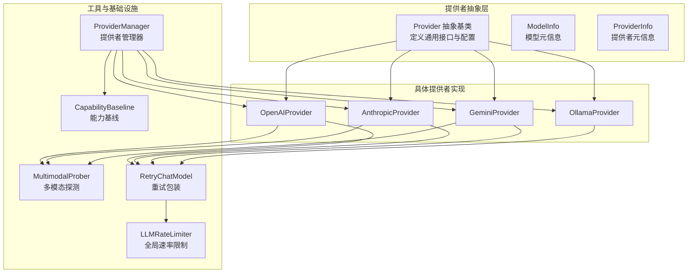
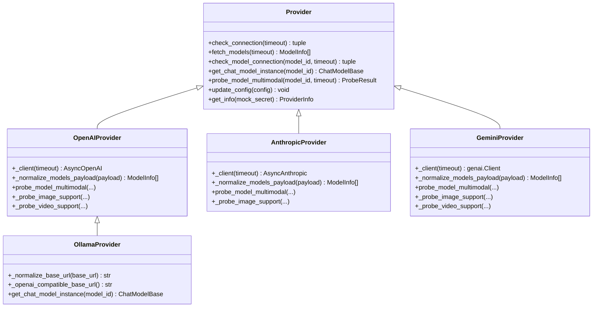
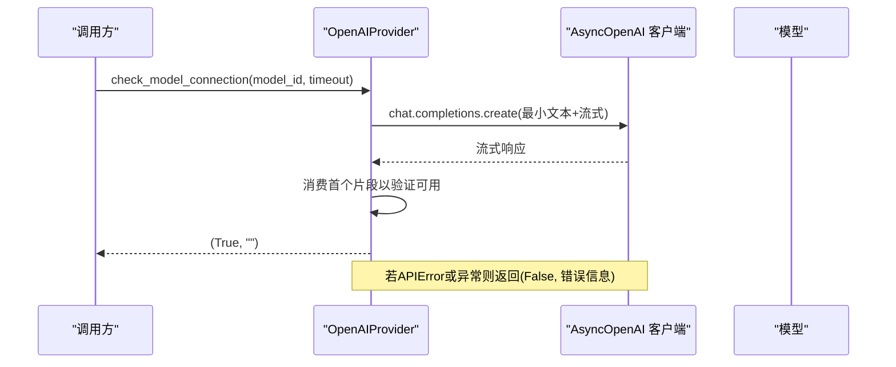
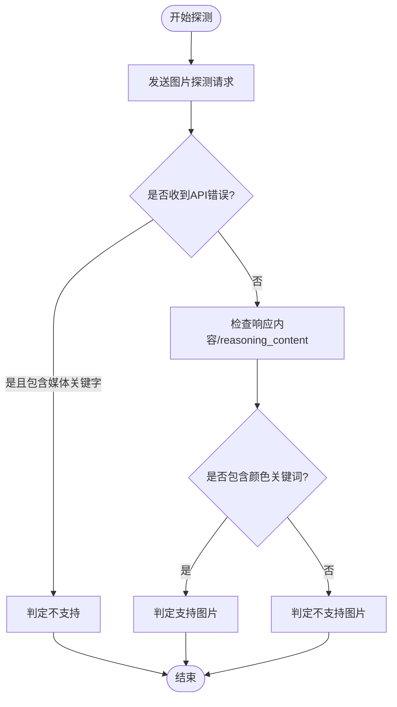
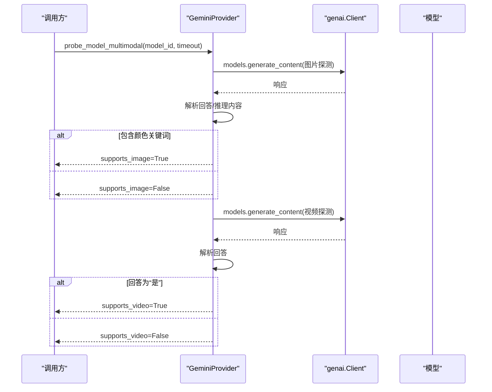
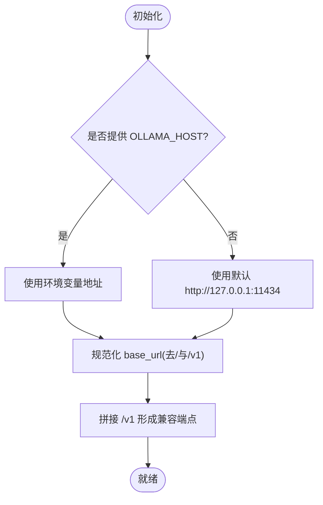
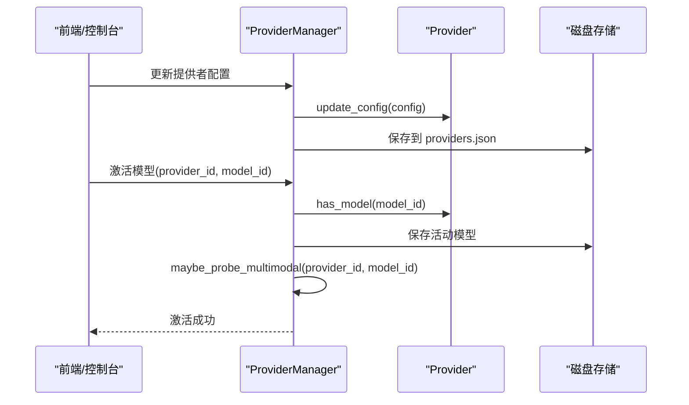
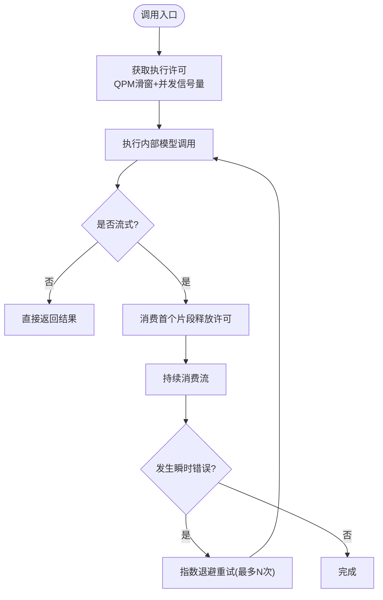
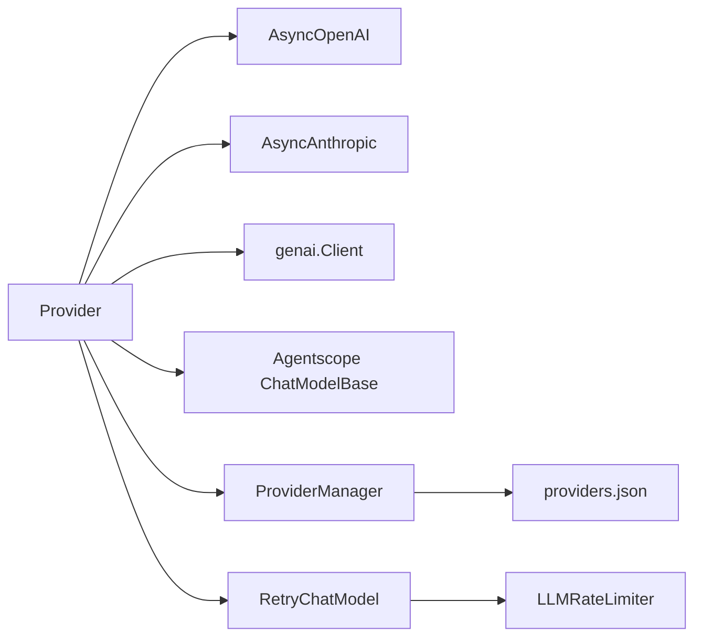

# 提供者实现

<cite>
**本文引用的文件**
- [provider.py](file://copaw/src/copaw/providers/provider.py)
- [openai_provider.py](file://copaw/src/copaw/providers/openai_provider.py)
- [anthropic_provider.py](file://copaw/src/copaw/providers/anthropic_provider.py)
- [gemini_provider.py](file://copaw/src/copaw/providers/gemini_provider.py)
- [ollama_provider.py](file://copaw/src/copaw/providers/ollama_provider.py)
- [multimodal_prober.py](file://copaw/src/copaw/providers/multimodal_prober.py)
- [provider_manager.py](file://copaw/src/copaw/providers/provider_manager.py)
- [models.py](file://copaw/src/copaw/providers/models.py)
- [capability_baseline.py](file://copaw/src/copaw/providers/capability_baseline.py)
- [retry_chat_model.py](file://copaw/src/copaw/providers/retry_chat_model.py)
- [rate_limiter.py](file://copaw/src/copaw/providers/rate_limiter.py)
- [test_openai_provider.py](file://copaw/tests/unit/providers/test_openai_provider.py)
- [test_anthropic_provider.py](file://copaw/tests/unit/providers/test_anthropic_provider.py)
- [test_gemini_provider.py](file://copaw/tests/unit/providers/test_gemini_provider.py)
- [test_ollama_provider.py](file://copaw/tests/unit/providers/test_ollama_provider.py)
</cite>

## 目录
1. [简介](#简介)
2. [项目结构](#项目结构)
3. [核心组件](#核心组件)
4. [架构总览](#架构总览)
5. [详细组件分析](#详细组件分析)
6. [依赖分析](#依赖分析)
7. [性能考虑](#性能考虑)
8. [故障排查指南](#故障排查指南)
9. [结论](#结论)
10. [附录：扩展指南与最佳实践](#附录扩展指南与最佳实践)

## 简介
本文件面向“AI模型提供者”实现，系统性阐述 Provider 抽象基类的设计与通用接口规范，以及 OpenAI、Anthropic、Google Gemini、Ollama 四大提供者的具体实现与特性。文档同时覆盖多模态探测机制、连接性检查、模型发现、流式响应处理、认证与限流策略、错误处理与测试验证方法，并给出扩展新提供者的步骤与最佳实践。

## 项目结构
围绕“提供者”主题，核心代码位于 copaw/src/copaw/providers 目录，主要文件如下：
- 抽象基类与通用模型信息：provider.py
- 具体提供者实现：openai_provider.py、anthropic_provider.py、gemini_provider.py、ollama_provider.py
- 多模态探测工具：multimodal_prober.py
- 提供者管理器：provider_manager.py
- 数据模型：models.py
- 能力基线与差异报告：capability_baseline.py
- 重试与速率限制：retry_chat_model.py、rate_limiter.py
- 单元测试：test_openai_provider.py、test_anthropic_provider.py、test_gemini_provider.py、test_ollama_provider.py

图示来源
- [provider.py:100-250](file://copaw/src/copaw/providers/provider.py#L100-L250)
- [openai_provider.py:25-550](file://copaw/src/copaw/providers/openai_provider.py#L25-L550)
- [anthropic_provider.py:27-256](file://copaw/src/copaw/providers/anthropic_provider.py#L27-L256)
- [gemini_provider.py:27-332](file://copaw/src/copaw/providers/gemini_provider.py#L27-L332)
- [ollama_provider.py:16-86](file://copaw/src/copaw/providers/ollama_provider.py#L16-L86)
- [multimodal_prober.py:75-102](file://copaw/src/copaw/providers/multimodal_prober.py#L75-L102)
- [provider_manager.py:567-800](file://copaw/src/copaw/providers/provider_manager.py#L567-L800)
- [retry_chat_model.py:201-466](file://copaw/src/copaw/providers/retry_chat_model.py#L201-L466)
- [rate_limiter.py:30-279](file://copaw/src/copaw/providers/rate_limiter.py#L30-L279)
- [capability_baseline.py:55-575](file://copaw/src/copaw/providers/capability_baseline.py#L55-L575)

章节来源
- [provider.py:100-250](file://copaw/src/copaw/providers/provider.py#L100-L250)
- [provider_manager.py:567-800](file://copaw/src/copaw/providers/provider_manager.py#L567-L800)

## 核心组件
本节聚焦 Provider 抽象基类及其派生类的职责划分、接口契约与通用行为。

- Provider 抽象基类
  - 定义统一的提供者配置（ProviderInfo）、模型清单（ModelInfo）与通用接口：check_connection、fetch_models、check_model_connection、get_chat_model_instance、probe_model_multimodal、update_config 等。
  - 支持动态更新配置、模型增删、获取只读 ProviderInfo 视图等。
  - 通过 get_chat_model_cls 获取与提供者绑定的聊天模型类名，用于实例化具体模型。

- 派生类职责
  - OpenAIProvider：兼容 OpenAI 及 DashScope/CodingPlan 等兼容端点；支持模型发现、连接检查、流式响应、多模态探测（图片/视频）。
  - AnthropicProvider：兼容 Anthropic API（含 DashScope 代理）；支持模型发现、连接检查、流式响应、图片探测。
  - GeminiProvider：兼容 Google Gemini API；支持模型发现、连接检查、流式响应、多模态探测（图片/视频）。
  - OllamaProvider：继承 OpenAIProvider，适配本地 Ollama 的 OpenAI 兼容端点；支持模型发现、连接检查、流式响应；不支持手动增删模型（需在 Ollama 侧维护）。

章节来源
- [provider.py:100-250](file://copaw/src/copaw/providers/provider.py#L100-L250)
- [openai_provider.py:25-550](file://copaw/src/copaw/providers/openai_provider.py#L25-L550)
- [anthropic_provider.py:27-256](file://copaw/src/copaw/providers/anthropic_provider.py#L27-L256)
- [gemini_provider.py:27-332](file://copaw/src/copaw/providers/gemini_provider.py#L27-L332)
- [ollama_provider.py:16-86](file://copaw/src/copaw/providers/ollama_provider.py#L16-L86)

## 架构总览
下图展示 Provider 抽象层与四大提供者的关系，以及与多模态探测、重试/限流、管理器的交互。

图示来源
- [provider.py:100-250](file://copaw/src/copaw/providers/provider.py#L100-L250)
- [openai_provider.py:25-550](file://copaw/src/copaw/providers/openai_provider.py#L25-L550)
- [anthropic_provider.py:27-256](file://copaw/src/copaw/providers/anthropic_provider.py#L27-L256)
- [gemini_provider.py:27-332](file://copaw/src/copaw/providers/gemini_provider.py#L27-L332)
- [ollama_provider.py:16-86](file://copaw/src/copaw/providers/ollama_provider.py#L16-L86)

## 详细组件分析

### Provider 抽象基类与通用接口
- 关键字段与行为
  - ProviderInfo：提供者标识、名称、基础URL、API密钥、聊天模型类名、内置/自定义模型列表、是否本地、是否冻结URL、是否需要API密钥、是否支持模型发现/连接检查、默认生成参数等。
  - ModelInfo：模型标识、人类可读名称、多模态支持状态（图片/视频/是否已探测）、探测来源（文档标注或实际探测）。
  - 接口契约：check_connection、fetch_models、check_model_connection、get_chat_model_instance、probe_model_multimodal、update_config、get_info 等。
- 配置更新与安全脱敏
  - update_config 支持按需更新名称、基础URL、API密钥、API密钥前缀、生成参数、额外模型列表；对自定义提供者禁用连接检查以避免误判。
  - get_info 返回 ProviderInfo，支持对敏感信息进行脱敏显示。

章节来源
- [provider.py:16-250](file://copaw/src/copaw/providers/provider.py#L16-L250)

### OpenAIProvider 实现
- 连接检查与模型发现
  - check_connection：调用 models.list 并捕获 APIError，返回布尔结果与消息。
  - fetch_models：标准化 payload，去重并返回 ModelInfo 列表。
- 模型可用性检查
  - check_model_connection：构造最小文本请求，启用流式并消费首个片段，确保模型可用。
- 流式响应与多模态探测
  - get_chat_model_instance：返回 OpenAIChatModelCompat，开启流式与禁用工具解析，注入 client_kwargs（含 DashScope 代理头）。
  - probe_model_multimodal：先探测图片，再探测视频；图片探测采用严格语义校验（颜色关键词），视频探测支持 base64 与 HTTP URL 两种格式，失败时按 400/媒体关键字判定为不支持。
- 认证与兼容端点
  - 支持 DashScope 与 CodingPlan 的兼容模式，自动注入特定请求头。

图示来源
- [openai_provider.py:85-125](file://copaw/src/copaw/providers/openai_provider.py#L85-L125)

章节来源
- [openai_provider.py:25-550](file://copaw/src/copaw/providers/openai_provider.py#L25-L550)
- [multimodal_prober.py:75-102](file://copaw/src/copaw/providers/multimodal_prober.py#L75-L102)

### AnthropicProvider 实现
- 连接检查与模型发现
  - check_connection：调用 models.list 并捕获 APIError。
  - fetch_models：标准化 payload，去重并返回 ModelInfo 列表。
- 模型可用性检查
  - check_model_connection：使用 messages.create 发起最小文本请求，启用流式并消费首个片段。
- 多模态探测
  - probe_model_multimodal：仅探测图片，视频固定为不支持；通过 base64 图像源格式发送探测请求。
- 认证与兼容端点
  - 支持 DashScope 代理端点，自动注入特定请求头。

图示来源
- [anthropic_provider.py:166-256](file://copaw/src/copaw/providers/anthropic_provider.py#L166-L256)
- [multimodal_prober.py:75-102](file://copaw/src/copaw/providers/multimodal_prober.py#L75-L102)

章节来源
- [anthropic_provider.py:27-256](file://copaw/src/copaw/providers/anthropic_provider.py#L27-L256)

### Google GeminiProvider 实现
- 连接检查与模型发现
  - check_connection：异步遍历 models.list，确保可访问。
  - fetch_models：异步收集模型列表，标准化名称（去除 models/ 前缀），去重并返回 ModelInfo 列表。
- 模型可用性检查
  - check_model_connection：使用 generate_content_stream 发送“ping”，消费首个片段。
- 多模态探测
  - probe_model_multimodal：分别探测图片与视频。图片探测使用 inline_data，视频探测使用 file_data 指向外部 URL。
- 认证与兼容端点
  - 使用 Google GenAI 客户端，基于 API Key 访问。

图示来源
- [gemini_provider.py:142-332](file://copaw/src/copaw/providers/gemini_provider.py#L142-L332)

章节来源
- [gemini_provider.py:27-332](file://copaw/src/copaw/providers/gemini_provider.py#L27-L332)

### OllamaProvider 实现
- 本地集成与自动发现
  - 继承 OpenAIProvider，通过 OpenAI 兼容端点访问 Ollama。
  - 自动规范化 base_url（去除末尾斜杠与 /v1 后缀），支持从环境变量 OLLAMA_HOST 注入默认地址。
- 模型管理
  - 不支持手动添加/删除模型（需在 Ollama 侧维护），抛出 NotImplementedError。
- 流式响应
  - 使用 OpenAIChatModelCompat，开启流式与禁用工具解析，注入 /v1 兼容端点。

图示来源
- [ollama_provider.py:36-86](file://copaw/src/copaw/providers/ollama_provider.py#L36-L86)

章节来源
- [ollama_provider.py:16-86](file://copaw/src/copaw/providers/ollama_provider.py#L16-L86)

### 多模态探测与能力基线
- 多模态探测工具
  - 提供统一的探测常量（探测图片/视频载荷、HTTP 视频URL）与探测结果数据类 ProbeResult。
  - 提供媒体关键字判断函数，用于识别 API 错误中是否包含“image/video/vision”等关键词。
- 能力基线
  - 为内置提供者与模型建立“官方文档标注”的期望能力表，支持比较探测结果与期望值，生成差异日志与汇总报告。

章节来源
- [multimodal_prober.py:75-102](file://copaw/src/copaw/providers/multimodal_prober.py#L75-L102)
- [capability_baseline.py:55-575](file://copaw/src/copaw/providers/capability_baseline.py#L55-L575)

### 提供者管理器与激活流程
- 内置提供者注册
  - 在 ProviderManager 中集中注册多种内置提供者（OpenAI、Azure OpenAI、DashScope、Aliyun Coding Plan、Anthropic、Gemini、Ollama、LM Studio 等），并设置默认模型列表与特性开关。
- 提供者生命周期
  - 列出提供者信息、获取单个提供者详情、更新配置、持久化存储、激活当前模型槽位、后台自动探测多模态能力。
- 模型发现与缓存
  - 支持拉取最新模型列表并写回 extra_models，便于 UI 展示与选择。

图示来源
- [provider_manager.py:620-800](file://copaw/src/copaw/providers/provider_manager.py#L620-L800)
- [models.py:9-16](file://copaw/src/copaw/providers/models.py#L9-L16)

章节来源
- [provider_manager.py:567-800](file://copaw/src/copaw/providers/provider_manager.py#L567-L800)
- [models.py:9-16](file://copaw/src/copaw/providers/models.py#L9-L16)

### 重试与速率限制
- RetryChatModel
  - 对任意 ChatModelBase 进行透明重试包装，支持指数退避、最大重试次数、并发信号量、流式重试。
  - 识别可重试异常（429/超时/连接错误等），并在 429 时协调全局暂停，避免“惊群效应”。
- LLMRateLimiter
  - 全局滑动窗口 QPM 控制、并发信号量、429 全局暂停与抖动，统计运行时指标。

图示来源
- [retry_chat_model.py:266-466](file://copaw/src/copaw/providers/retry_chat_model.py#L266-L466)
- [rate_limiter.py:70-174](file://copaw/src/copaw/providers/rate_limiter.py#L70-L174)

章节来源
- [retry_chat_model.py:201-466](file://copaw/src/copaw/providers/retry_chat_model.py#L201-L466)
- [rate_limiter.py:30-279](file://copaw/src/copaw/providers/rate_limiter.py#L30-L279)

## 依赖分析
- 组件耦合
  - Provider 抽象层与具体提供者之间为“继承+组合”关系，具体提供者复用统一的配置与接口契约。
  - 多模态探测逻辑集中在各提供者内部，共享 multimodal_prober 的探测常量与结果类型。
  - ProviderManager 聚合所有提供者，负责持久化、激活与后台探测。
  - RetryChatModel 与 LLMRateLimiter 作为横切关注点，被各提供者实例化的聊天模型所复用。
- 外部依赖
  - OpenAI SDK（AsyncOpenAI）
  - Anthropic SDK（AsyncAnthropic）
  - Google GenAI SDK（genai.Client）
  - Agentscope 聊天模型类（OpenAIChatModelCompat、AnthropicChatModel、GeminiChatModel）

图示来源
- [openai_provider.py:12-14](file://copaw/src/copaw/providers/openai_provider.py#L12-L14)
- [anthropic_provider.py:12-19](file://copaw/src/copaw/providers/anthropic_provider.py#L12-L19)
- [gemini_provider.py:12-22](file://copaw/src/copaw/providers/gemini_provider.py#L12-L22)
- [provider_manager.py:16-26](file://copaw/src/copaw/providers/provider_manager.py#L16-L26)
- [retry_chat_model.py:33-46](file://copaw/src/copaw/providers/retry_chat_model.py#L33-L46)
- [rate_limiter.py:211-279](file://copaw/src/copaw/providers/rate_limiter.py#L211-L279)

章节来源
- [provider.py:100-250](file://copaw/src/copaw/providers/provider.py#L100-L250)
- [provider_manager.py:567-800](file://copaw/src/copaw/providers/provider_manager.py#L567-L800)

## 性能考虑
- 连接检查与模型发现
  - 各提供者均采用最小负载的连接检查与模型列举，避免阻塞主流程。
- 流式响应
  - 所有提供者在可用性检查与聊天调用中均启用流式，降低首字节延迟。
- 重试与限流
  - RetryChatModel 与 LLMRateLimiter 协同工作，防止突发流量导致上游 429 与拥塞。
- 多模态探测
  - 采用最小探测载荷（小尺寸图片/短视频），并结合语义校验减少误报与误判。

[本节为通用指导，无需特定文件引用]

## 故障排查指南
- 连接失败
  - OpenAI/Anthropic/Gemini：检查 base_url 与 API Key；确认网络可达；查看 ProviderManager 的 get_info 输出中的支持能力标记。
  - Ollama：确认 OLLAMA_HOST 环境变量或本地服务端口；规范化 base_url（去除 /v1）。
- 模型不可用
  - 使用 check_model_connection 验证模型是否可响应；若返回 False，检查模型名称大小写与兼容端点。
- 多模态探测异常
  - 图片探测：若返回“未支持”，可能是模型不接受媒体输入或存在媒体关键字错误；视频探测：部分格式可能被拒绝，尝试不同格式或 HTTP URL。
- 重试与限流
  - 若频繁出现 429，调整 LLMRateLimiter 的并发与 QPM 参数；观察 RetryChatModel 日志中的重试次数与延迟。

章节来源
- [openai_provider.py:57-125](file://copaw/src/copaw/providers/openai_provider.py#L57-L125)
- [anthropic_provider.py:66-127](file://copaw/src/copaw/providers/anthropic_provider.py#L66-L127)
- [gemini_provider.py:68-131](file://copaw/src/copaw/providers/gemini_provider.py#L68-L131)
- [ollama_provider.py:36-86](file://copaw/src/copaw/providers/ollama_provider.py#L36-L86)
- [retry_chat_model.py:323-340](file://copaw/src/copaw/providers/retry_chat_model.py#L323-L340)
- [rate_limiter.py:85-144](file://copaw/src/copaw/providers/rate_limiter.py#L85-L144)

## 结论
该实现以 Provider 抽象基类为核心，统一了提供者配置、接口契约与生命周期管理；四大提供者在保持一致行为的同时，针对各自平台特性实现了连接检查、模型发现、流式响应与多模态探测。配合重试与速率限制机制，整体具备良好的稳定性与可扩展性。通过 ProviderManager 与能力基线，系统能够自动化地发现与评估模型能力，为上层应用提供可靠的 AI 模型接入方案。

[本节为总结性内容，无需特定文件引用]

## 附录：扩展指南与最佳实践

### 如何新增一个提供者
- 设计与实现步骤
  - 继承 Provider，实现以下方法：
    - check_connection：最小化连接检查，返回 (bool, str)。
    - fetch_models：调用远端 API 获取模型列表，标准化为 ModelInfo 列表。
    - check_model_connection：最小化请求验证模型可用性。
    - get_chat_model_instance：返回对应聊天模型实例（可复用 OpenAIChatModelCompat 或自有实现）。
    - probe_model_multimodal/_probe_*：实现图片/视频探测（如适用）。
  - 在 provider_manager.py 中注册内置提供者，设置默认模型列表与特性开关。
  - 如需本地集成，参考 OllamaProvider 的 base_url 规范化与 /v1 兼容端点处理。
- 错误处理与健壮性
  - 明确区分 APIError 与未知异常；对 400/媒体关键字错误进行显式判定。
  - 在流式场景中尽早消费首个片段以验证可用性。
- 测试验证
  - 编写单元测试，覆盖连接检查、模型发现、可用性检查、配置更新、多模态探测等关键路径。
  - 参考现有测试文件的断言风格与参数化用例。

章节来源
- [provider.py:100-250](file://copaw/src/copaw/providers/provider.py#L100-L250)
- [provider_manager.py:600-616](file://copaw/src/copaw/providers/provider_manager.py#L600-L616)
- [test_openai_provider.py:21-269](file://copaw/tests/unit/providers/test_openai_provider.py#L21-L269)
- [test_anthropic_provider.py:21-189](file://copaw/tests/unit/providers/test_anthropic_provider.py#L21-L189)
- [test_gemini_provider.py:41-341](file://copaw/tests/unit/providers/test_gemini_provider.py#L41-L341)
- [test_ollama_provider.py:19-141](file://copaw/tests/unit/providers/test_ollama_provider.py#L19-L141)

### 配置示例与最佳实践
- 认证方式
  - OpenAI/DashScope/CodingPlan：提供 api_key_prefix 与 base_url；必要时注入代理头。
  - Anthropic：提供 api_key 与 base_url；支持 DashScope 代理。
  - Gemini：提供 api_key 与 base_url；使用 GenAI 客户端。
  - Ollama：无需 API Key；自动规范化 base_url 并拼接 /v1。
- API 限制与性能
  - 合理设置 generate_kwargs（如温度、采样参数）；流式响应优先。
  - 使用 RetryChatModel 与 LLMRateLimiter 控制并发与重试策略。
- 最佳实践
  - 在 ProviderManager 中预置默认模型列表，结合 capability_baseline 进行一致性校验。
  - 对自定义提供者禁用连接检查，避免误判；通过 UI 与后台探测补充能力信息。
  - 将 ProviderInfo 的敏感字段进行脱敏输出，保护用户隐私。

章节来源
- [provider_manager.py:422-561](file://copaw/src/copaw/providers/provider_manager.py#L422-L561)
- [openai_provider.py:25-550](file://copaw/src/copaw/providers/openai_provider.py#L25-L550)
- [anthropic_provider.py:27-256](file://copaw/src/copaw/providers/anthropic_provider.py#L27-L256)
- [gemini_provider.py:27-332](file://copaw/src/copaw/providers/gemini_provider.py#L27-L332)
- [ollama_provider.py:16-86](file://copaw/src/copaw/providers/ollama_provider.py#L16-L86)
- [retry_chat_model.py:201-466](file://copaw/src/copaw/providers/retry_chat_model.py#L201-L466)
- [rate_limiter.py:30-279](file://copaw/src/copaw/providers/rate_limiter.py#L30-L279)