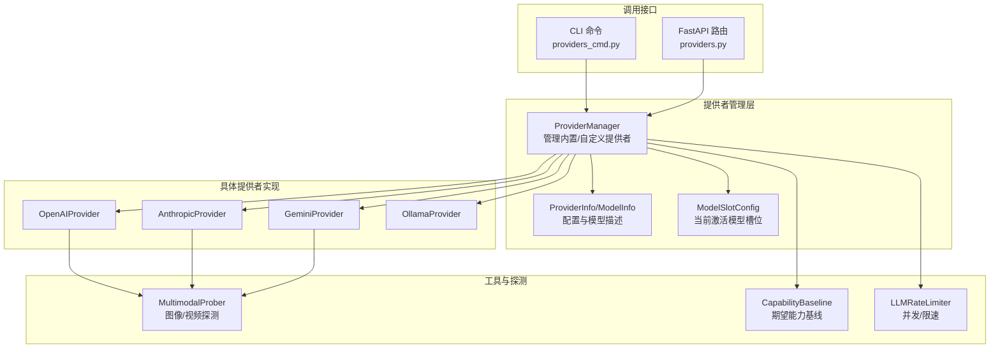
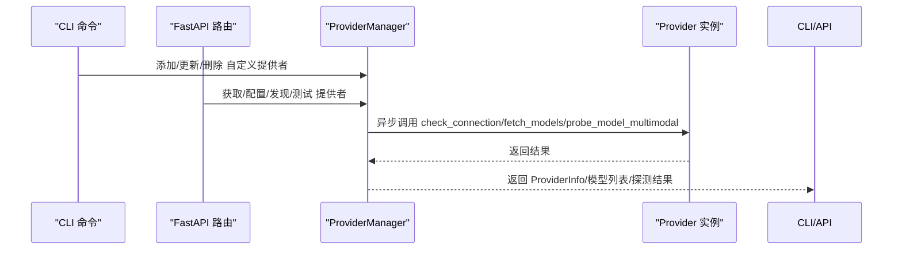
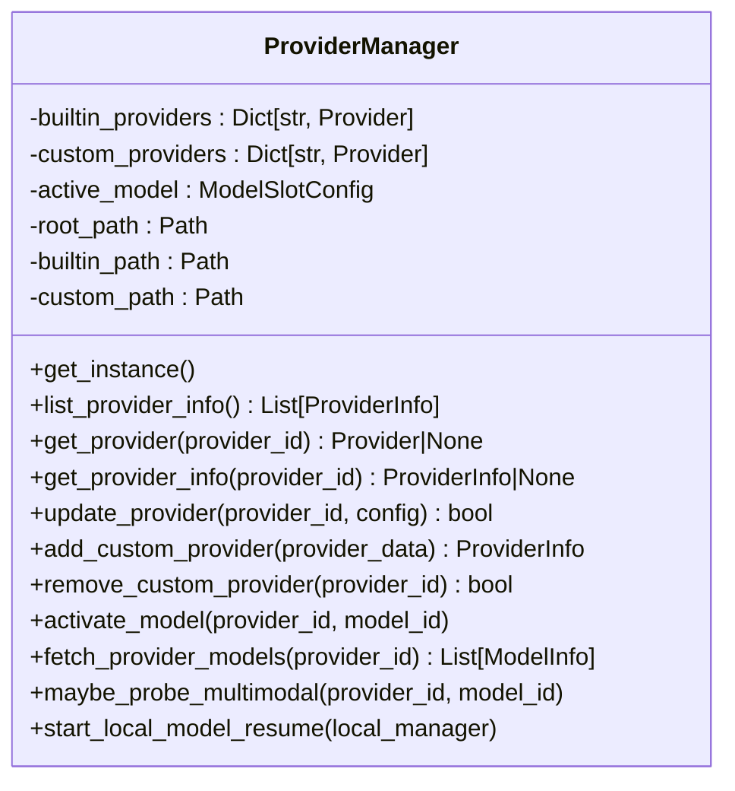
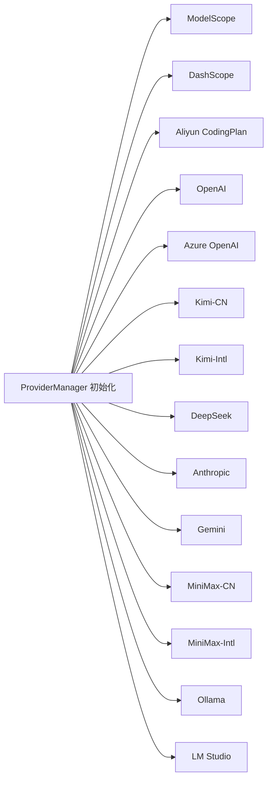
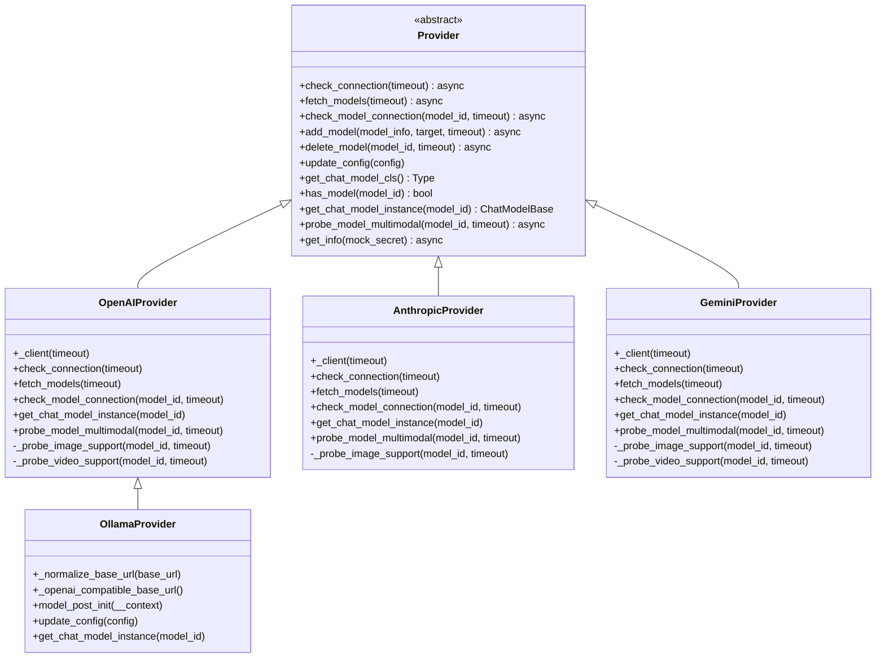
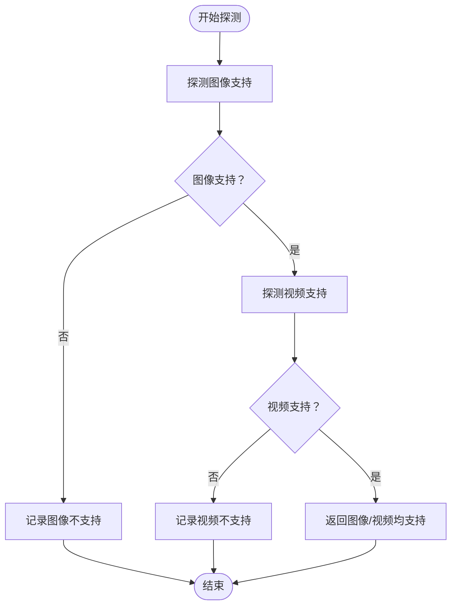
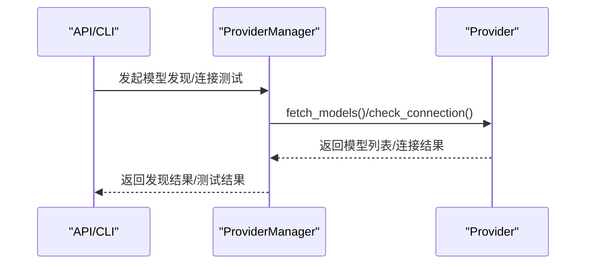
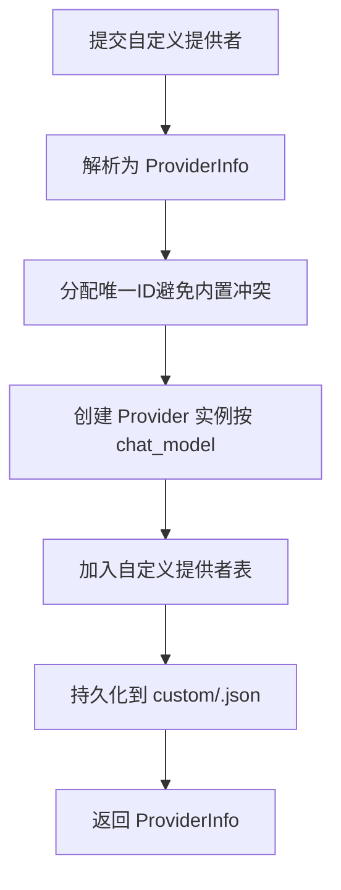
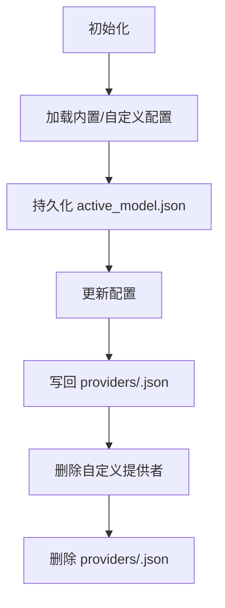
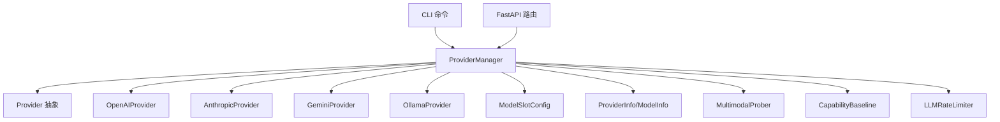

# 提供者管理器

<cite>
**本文引用的文件**
- [provider_manager.py](file://copaw/src/copaw/providers/provider_manager.py)
- [provider.py](file://copaw/src/copaw/providers/provider.py)
- [models.py](file://copaw/src/copaw/providers/models.py)
- [openai_provider.py](file://copaw/src/copaw/providers/openai_provider.py)
- [anthropic_provider.py](file://copaw/src/copaw/providers/anthropic_provider.py)
- [gemini_provider.py](file://copaw/src/copaw/providers/gemini_provider.py)
- [ollama_provider.py](file://copaw/src/copaw/providers/ollama_provider.py)
- [multimodal_prober.py](file://copaw/src/copaw/providers/multimodal_prober.py)
- [capability_baseline.py](file://copaw/src/copaw/providers/capability_baseline.py)
- [rate_limiter.py](file://copaw/src/copaw/providers/rate_limiter.py)
- [providers_cmd.py](file://copaw/src/copaw/cli/providers_cmd.py)
- [providers.py](file://copaw/src/copaw/app/routers/providers.py)
- [test_provider_manager.py](file://copaw/tests/unit/providers/test_provider_manager.py)
</cite>

## 目录
1. [简介](#简介)
2. [项目结构](#项目结构)
3. [核心组件](#核心组件)
4. [架构总览](#架构总览)
5. [详细组件分析](#详细组件分析)
6. [依赖关系分析](#依赖关系分析)
7. [性能考虑](#性能考虑)
8. [故障排查指南](#故障排查指南)
9. [结论](#结论)
10. [附录](#附录)

## 简介
本文件面向“提供者管理器”（ProviderManager）的技术文档，系统性阐述其架构设计、单例模式与全局状态管理、内置与自定义提供者的注册机制、生命周期管理（初始化、更新、删除、持久化）、异步能力（信息获取、模型发现、连接测试）、自定义提供者的添加流程与冲突处理、热重载与迁移兼容性、以及安全权限控制等关键主题。文档同时给出与实际代码映射的图示与章节来源，便于开发者快速定位实现细节。

## 项目结构
围绕提供者管理器的相关代码主要分布在以下模块：
- 管理器与基础模型：provider_manager.py、provider.py、models.py
- 具体提供者实现：openai_provider.py、anthropic_provider.py、gemini_provider.py、ollama_provider.py
- 多模态探测与基线：multimodal_prober.py、capability_baseline.py
- 调用层接口：CLI 命令 providers_cmd.py、FastAPI 路由 providers.py
- 性能与限流：rate_limiter.py
- 单元测试：test_provider_manager.py

**图表来源**
- [provider_manager.py:567-800](file://copaw/src/copaw/providers/provider_manager.py#L567-L800)
- [provider.py:43-250](file://copaw/src/copaw/providers/provider.py#L43-L250)
- [models.py:9-16](file://copaw/src/copaw/providers/models.py#L9-L16)
- [openai_provider.py:25-550](file://copaw/src/copaw/providers/openai_provider.py#L25-L550)
- [anthropic_provider.py:27-256](file://copaw/src/copaw/providers/anthropic_provider.py#L27-L256)
- [gemini_provider.py:27-332](file://copaw/src/copaw/providers/gemini_provider.py#L27-L332)
- [ollama_provider.py:16-86](file://copaw/src/copaw/providers/ollama_provider.py#L16-L86)
- [multimodal_prober.py:75-102](file://copaw/src/copaw/providers/multimodal_prober.py#L75-L102)
- [capability_baseline.py:55-575](file://copaw/src/copaw/providers/capability_baseline.py#L55-L575)
- [rate_limiter.py:30-279](file://copaw/src/copaw/providers/rate_limiter.py#L30-L279)
- [providers_cmd.py:74-808](file://copaw/src/copaw/cli/providers_cmd.py#L74-L808)
- [providers.py:46-575](file://copaw/src/copaw/app/routers/providers.py#L46-L575)

**章节来源**
- [provider_manager.py:567-800](file://copaw/src/copaw/providers/provider_manager.py#L567-L800)
- [provider.py:43-250](file://copaw/src/copaw/providers/provider.py#L43-L250)
- [models.py:9-16](file://copaw/src/copaw/providers/models.py#L9-L16)
- [openai_provider.py:25-550](file://copaw/src/copaw/providers/openai_provider.py#L25-L550)
- [anthropic_provider.py:27-256](file://copaw/src/copaw/providers/anthropic_provider.py#L27-L256)
- [gemini_provider.py:27-332](file://copaw/src/copaw/providers/gemini_provider.py#L27-L332)
- [ollama_provider.py:16-86](file://copaw/src/copaw/providers/ollama_provider.py#L16-L86)
- [multimodal_prober.py:75-102](file://copaw/src/copaw/providers/multimodal_prober.py#L75-L102)
- [capability_baseline.py:55-575](file://copaw/src/copaw/providers/capability_baseline.py#L55-L575)
- [rate_limiter.py:30-279](file://copaw/src/copaw/providers/rate_limiter.py#L30-L279)
- [providers_cmd.py:74-808](file://copaw/src/copaw/cli/providers_cmd.py#L74-L808)
- [providers.py:46-575](file://copaw/src/copaw/app/routers/providers.py#L46-L575)

## 核心组件
- ProviderManager：提供者管理器，负责内置与自定义提供者的注册、查询、更新、删除、持久化、激活模型、异步模型发现与连接测试、多模态探测调度等。
- Provider 抽象：定义统一的提供者接口（连接检查、模型发现、模型连接检查、模型增删、配置更新、聊天模型实例化、多模态探测等）。
- ProviderInfo/ModelInfo：提供者与模型的配置与能力描述数据结构。
- ModelSlotConfig：当前激活的模型槽位（provider_id + model）。
- 具体提供者实现：OpenAIProvider、AnthropicProvider、GeminiProvider、OllamaProvider，分别封装不同平台的 API 行为与探测逻辑。
- MultimodalProber：多模态探测常量与结果类型，支撑图像/视频探测。
- CapabilityBaseline：内置提供者模型的期望能力基线，用于对比探测结果。
- LLMRateLimiter：全局 LLM 请求速率限制器，配合并发信号量与滑动窗口 QPM 控制。
- CLI 与 API：提供命令行与 HTTP 接口对提供者进行配置、模型发现、连接测试、激活模型等操作。

**章节来源**
- [provider_manager.py:567-800](file://copaw/src/copaw/providers/provider_manager.py#L567-L800)
- [provider.py:100-250](file://copaw/src/copaw/providers/provider.py#L100-L250)
- [models.py:9-16](file://copaw/src/copaw/providers/models.py#L9-L16)
- [openai_provider.py:25-550](file://copaw/src/copaw/providers/openai_provider.py#L25-L550)
- [anthropic_provider.py:27-256](file://copaw/src/copaw/providers/anthropic_provider.py#L27-L256)
- [gemini_provider.py:27-332](file://copaw/src/copaw/providers/gemini_provider.py#L27-L332)
- [ollama_provider.py:16-86](file://copaw/src/copaw/providers/ollama_provider.py#L16-L86)
- [multimodal_prober.py:75-102](file://copaw/src/copaw/providers/multimodal_prober.py#L75-L102)
- [capability_baseline.py:55-575](file://copaw/src/copaw/providers/capability_baseline.py#L55-L575)
- [rate_limiter.py:30-279](file://copaw/src/copaw/providers/rate_limiter.py#L30-L279)

## 架构总览
ProviderManager 采用单例模式，通过内部字典维护内置与自定义提供者，并在初始化时准备磁盘目录、加载历史配置、执行迁移、应用默认注解。提供者信息通过异步批量获取，支持连接测试、模型发现与多模态探测。CLI 与 API 层均依赖 ProviderManager 的统一接口，实现用户交互与远程调用。

**图表来源**
- [providers_cmd.py:74-808](file://copaw/src/copaw/cli/providers_cmd.py#L74-L808)
- [providers.py:134-575](file://copaw/src/copaw/app/routers/providers.py#L134-L575)
- [provider_manager.py:620-800](file://copaw/src/copaw/providers/provider_manager.py#L620-L800)

**章节来源**
- [provider_manager.py:567-800](file://copaw/src/copaw/providers/provider_manager.py#L567-L800)
- [providers_cmd.py:74-808](file://copaw/src/copaw/cli/providers_cmd.py#L74-L808)
- [providers.py:134-575](file://copaw/src/copaw/app/routers/providers.py#L134-L575)

## 详细组件分析

### ProviderManager 类与单例模式
- 单例实现：类变量保存唯一实例；构造函数中完成目录准备、内置提供者初始化、迁移、从存储加载、默认注解应用。
- 全局状态：内置提供者表、自定义提供者表、当前激活模型槽位。
- 存储路径：基于 SECRET_DIR 下的 providers/builtin 与 providers/custom 目录，按提供者 ID 写入 JSON 文件。
- 生命周期：
  - 初始化：准备目录、注册内置提供者、迁移旧格式、从磁盘恢复、应用默认注解。
  - 运行期：异步获取提供者信息、更新配置、添加/删除自定义提供者、激活模型、后台恢复本地模型、多模态探测。
  - 持久化：更新/新增/删除提供者后写回磁盘；激活模型变更写入 active_model.json。

**图表来源**
- [provider_manager.py:567-800](file://copaw/src/copaw/providers/provider_manager.py#L567-L800)

**章节来源**
- [provider_manager.py:567-800](file://copaw/src/copaw/providers/provider_manager.py#L567-L800)

### 内置提供者注册与特性
ProviderManager 在初始化阶段集中注册内置提供者，涵盖 ModelScope、DashScope、Aliyun CodingPlan、OpenAI、Azure OpenAI、Kimi（中/国际）、DeepSeek、Anthropic、Gemini、MiniMax（中/国际）、Ollama、LM Studio 等。每个内置提供者通过构造函数指定：
- id/name/base_url/api_key_prefix/chat_model/models/freeze_url/is_local/require_api_key/support_model_discovery/support_connection_check/generate_kwargs 等属性。
- 特定提供者如 DashScope、Aliyun CodingPlan、Kimi、MiniMax、Ollama、LM Studio 等具有不同的默认行为（例如冻结 URL、不支持连接检查、支持动态模型发现等）。

**图表来源**
- [provider_manager.py:422-561](file://copaw/src/copaw/providers/provider_manager.py#L422-L561)

**章节来源**
- [provider_manager.py:422-561](file://copaw/src/copaw/providers/provider_manager.py#L422-L561)

### Provider 抽象与具体实现
- Provider 抽象定义了统一接口：check_connection、fetch_models、check_model_connection、add_model/delete_model、update_config、get_chat_model_cls、has_model、get_chat_model_instance、probe_model_multimodal、get_info。
- OpenAIProvider：封装 OpenAI 兼容 API，支持模型列表发现、连接测试、图像/视频多模态探测（含语义校验与媒体关键字判断），并针对 DashScope/CodingDashScope 设置特定请求头。
- AnthropicProvider：封装 Anthropic API，支持模型列表发现、连接测试、图像探测（视频不支持）。
- GeminiProvider：封装 Google Gemini API，支持模型列表发现、连接测试、图像/视频探测。
- OllamaProvider：继承 OpenAIProvider，适配 Ollama 的 OpenAI 兼容端点，支持动态模型发现与本地模型管理。

**图表来源**
- [provider.py:100-250](file://copaw/src/copaw/providers/provider.py#L100-L250)
- [openai_provider.py:25-550](file://copaw/src/copaw/providers/openai_provider.py#L25-L550)
- [anthropic_provider.py:27-256](file://copaw/src/copaw/providers/anthropic_provider.py#L27-L256)
- [gemini_provider.py:27-332](file://copaw/src/copaw/providers/gemini_provider.py#L27-L332)
- [ollama_provider.py:16-86](file://copaw/src/copaw/providers/ollama_provider.py#L16-L86)

**章节来源**
- [provider.py:100-250](file://copaw/src/copaw/providers/provider.py#L100-L250)
- [openai_provider.py:25-550](file://copaw/src/copaw/providers/openai_provider.py#L25-L550)
- [anthropic_provider.py:27-256](file://copaw/src/copaw/providers/anthropic_provider.py#L27-L256)
- [gemini_provider.py:27-332](file://copaw/src/copaw/providers/gemini_provider.py#L27-L332)
- [ollama_provider.py:16-86](file://copaw/src/copaw/providers/ollama_provider.py#L16-L86)

### 多模态探测与基线对比
- 探测机制：各 Provider 实现 probe_model_multimodal，结合 MultimodalProber 的 ProbeResult 与媒体关键字判断，对图像/视频输入进行探测。
- 基线对比：CapabilityBaseline 提供内置提供者模型的期望能力（图像/视频支持），并与实际探测结果对比生成差异日志与汇总报告。

**图表来源**
- [openai_provider.py:165-550](file://copaw/src/copaw/providers/openai_provider.py#L165-L550)
- [anthropic_provider.py:166-256](file://copaw/src/copaw/providers/anthropic_provider.py#L166-L256)
- [gemini_provider.py:142-332](file://copaw/src/copaw/providers/gemini_provider.py#L142-L332)
- [multimodal_prober.py:75-102](file://copaw/src/copaw/providers/multimodal_prober.py#L75-L102)
- [capability_baseline.py:500-575](file://copaw/src/copaw/providers/capability_baseline.py#L500-L575)

**章节来源**
- [openai_provider.py:165-550](file://copaw/src/copaw/providers/openai_provider.py#L165-L550)
- [anthropic_provider.py:166-256](file://copaw/src/copaw/providers/anthropic_provider.py#L166-L256)
- [gemini_provider.py:142-332](file://copaw/src/copaw/providers/gemini_provider.py#L142-L332)
- [multimodal_prober.py:75-102](file://copaw/src/copaw/providers/multimodal_prober.py#L75-L102)
- [capability_baseline.py:500-575](file://copaw/src/copaw/providers/capability_baseline.py#L500-L575)

### 异步提供者信息获取、模型发现与连接测试
- 异步批量获取：list_provider_info 并行调用所有提供者的 get_info。
- 模型发现：fetch_provider_models 调用具体 Provider 的 fetch_models，并将结果合并到 extra_models 后持久化。
- 连接测试：CLI 与 API 分别提供 test 与 discover 接口，支持临时覆盖 base_url/api_key/chat_model 进行连通性与模型发现测试。

**图表来源**
- [providers.py:261-327](file://copaw/src/copaw/app/routers/providers.py#L261-L327)
- [providers_cmd.py:531-687](file://copaw/src/copaw/cli/providers_cmd.py#L531-L687)
- [provider_manager.py:685-708](file://copaw/src/copaw/providers/provider_manager.py#L685-L708)

**章节来源**
- [providers.py:261-327](file://copaw/src/copaw/app/routers/providers.py#L261-L327)
- [providers_cmd.py:531-687](file://copaw/src/copaw/cli/providers_cmd.py#L531-L687)
- [provider_manager.py:685-708](file://copaw/src/copaw/providers/provider_manager.py#L685-L708)

### 自定义提供者添加流程、ID 冲突解决与配置验证
- 添加流程：CLI 与 API 均支持创建自定义提供者，Manager 将其解析为 Provider 对象（根据 chat_model 判定类型），设置 is_custom 标记，并持久化到 custom 目录。
- ID 冲突解决：_resolve_custom_provider_id 优先避免与内置提供者冲突，若仍冲突则追加 -new 直到唯一。
- 配置验证：update_config 支持增量更新 name/base_url/api_key/chat_model/api_key_prefix/generate_kwargs/extra_models 等字段；ProviderInfo/ModelInfo 使用 Pydantic 校验。

**图表来源**
- [providers_cmd.py:550-591](file://copaw/src/copaw/cli/providers_cmd.py#L550-L591)
- [providers.py:179-204](file://copaw/src/copaw/app/routers/providers.py#L179-L204)
- [provider_manager.py:724-741](file://copaw/src/copaw/providers/provider_manager.py#L724-L741)
- [provider_manager.py:709-723](file://copaw/src/copaw/providers/provider_manager.py#L709-L723)

**章节来源**
- [providers_cmd.py:550-591](file://copaw/src/copaw/cli/providers_cmd.py#L550-L591)
- [providers.py:179-204](file://copaw/src/copaw/app/routers/providers.py#L179-L204)
- [provider_manager.py:709-741](file://copaw/src/copaw/providers/provider_manager.py#L709-L741)

### 生命周期管理：初始化、更新、删除与持久化
- 初始化：准备目录（权限 0o700）、注册内置提供者、迁移旧配置、从磁盘加载、应用默认注解。
- 更新：update_provider 支持增量更新，随后持久化到对应目录（builtin 或 custom）。
- 删除：remove_custom_provider 删除自定义提供者并清理磁盘文件。
- 激活模型：activate_model 更新当前激活模型槽位并持久化 active_model.json；maybe_probe_multimodal 在后台触发多模态探测。

**图表来源**
- [provider_manager.py:571-590](file://copaw/src/copaw/providers/provider_manager.py#L571-L590)
- [provider_manager.py:647-661](file://copaw/src/copaw/providers/provider_manager.py#L647-L661)
- [provider_manager.py:742-752](file://copaw/src/copaw/providers/provider_manager.py#L742-L752)
- [provider_manager.py:753-771](file://copaw/src/copaw/providers/provider_manager.py#L753-L771)

**章节来源**
- [provider_manager.py:571-590](file://copaw/src/copaw/providers/provider_manager.py#L571-L590)
- [provider_manager.py:647-661](file://copaw/src/copaw/providers/provider_manager.py#L647-L661)
- [provider_manager.py:742-752](file://copaw/src/copaw/providers/provider_manager.py#L742-L752)
- [provider_manager.py:753-771](file://copaw/src/copaw/providers/provider_manager.py#L753-L771)

### 热重载、迁移兼容性与安全权限控制
- 热重载：API/CLI 在设置激活模型或修改配置后，可触发相关热重载逻辑（如代理热重载）。
- 迁移兼容性：_migrate_legacy_providers 与从存储加载逻辑确保旧版 providers.json 与单文件配置平滑迁移到新目录结构。
- 安全权限控制：磁盘目录与文件使用 0o700 权限，仅当前用户可访问；ProviderInfo.get_info 支持遮蔽敏感信息（API Key 前缀显示，其余掩码）。

**章节来源**
- [provider_manager.py:584-589](file://copaw/src/copaw/providers/provider_manager.py#L584-L589)
- [provider_manager.py:591-599](file://copaw/src/copaw/providers/provider_manager.py#L591-L599)
- [provider.py:224-250](file://copaw/src/copaw/providers/provider.py#L224-L250)
- [test_provider_manager.py:238-276](file://copaw/tests/unit/providers/test_provider_manager.py#L238-L276)

## 依赖关系分析
ProviderManager 与各组件之间的依赖关系如下：

**图表来源**
- [provider_manager.py:567-800](file://copaw/src/copaw/providers/provider_manager.py#L567-L800)
- [provider.py:100-250](file://copaw/src/copaw/providers/provider.py#L100-L250)
- [openai_provider.py:25-550](file://copaw/src/copaw/providers/openai_provider.py#L25-L550)
- [anthropic_provider.py:27-256](file://copaw/src/copaw/providers/anthropic_provider.py#L27-L256)
- [gemini_provider.py:27-332](file://copaw/src/copaw/providers/gemini_provider.py#L27-L332)
- [ollama_provider.py:16-86](file://copaw/src/copaw/providers/ollama_provider.py#L16-L86)
- [models.py:9-16](file://copaw/src/copaw/providers/models.py#L9-L16)
- [multimodal_prober.py:75-102](file://copaw/src/copaw/providers/multimodal_prober.py#L75-L102)
- [capability_baseline.py:55-575](file://copaw/src/copaw/providers/capability_baseline.py#L55-L575)
- [rate_limiter.py:30-279](file://copaw/src/copaw/providers/rate_limiter.py#L30-L279)
- [providers_cmd.py:74-808](file://copaw/src/copaw/cli/providers_cmd.py#L74-L808)
- [providers.py:46-575](file://copaw/src/copaw/app/routers/providers.py#L46-L575)

**章节来源**
- [provider_manager.py:567-800](file://copaw/src/copaw/providers/provider_manager.py#L567-L800)
- [provider.py:100-250](file://copaw/src/copaw/providers/provider.py#L100-L250)
- [openai_provider.py:25-550](file://copaw/src/copaw/providers/openai_provider.py#L25-L550)
- [anthropic_provider.py:27-256](file://copaw/src/copaw/providers/anthropic_provider.py#L27-L256)
- [gemini_provider.py:27-332](file://copaw/src/copaw/providers/gemini_provider.py#L27-L332)
- [ollama_provider.py:16-86](file://copaw/src/copaw/providers/ollama_provider.py#L16-L86)
- [models.py:9-16](file://copaw/src/copaw/providers/models.py#L9-L16)
- [multimodal_prober.py:75-102](file://copaw/src/copaw/providers/multimodal_prober.py#L75-L102)
- [capability_baseline.py:55-575](file://copaw/src/copaw/providers/capability_baseline.py#L55-L575)
- [rate_limiter.py:30-279](file://copaw/src/copaw/providers/rate_limiter.py#L30-L279)
- [providers_cmd.py:74-808](file://copaw/src/copaw/cli/providers_cmd.py#L74-L808)
- [providers.py:46-575](file://copaw/src/copaw/app/routers/providers.py#L46-L575)

## 性能考虑
- 并发与限流：LLMRateLimiter 提供滑动窗口 QPM 与并发信号量，避免 429 并发风暴；支持全局暂停与抖动，降低惊群效应。
- 异步批处理：ProviderManager 批量异步获取提供者信息，提升 UI/CLI 响应速度。
- 探测策略：多模态探测采用两阶段验证（拒绝码判定 + 语义校验），减少误报与无效探测开销。

**章节来源**
- [rate_limiter.py:30-279](file://copaw/src/copaw/providers/rate_limiter.py#L30-L279)
- [provider_manager.py:620-629](file://copaw/src/copaw/providers/provider_manager.py#L620-L629)
- [openai_provider.py:165-550](file://copaw/src/copaw/providers/openai_provider.py#L165-L550)

## 故障排查指南
- 提供者未找到：activate_model/update_provider/remove_custom_provider 等操作会抛出异常或返回错误，需确认 provider_id 是否存在于内置或自定义表中。
- 模型不存在：activate_model 会校验模型是否在提供者模型列表中，需先通过 add_model 或 discover_models 增加。
- 权限问题：磁盘目录权限应为 0o700，若无法写入请检查 SECRET_DIR 及子目录权限。
- 探测失败：查看探侧日志与消息，确认网络可达性、API Key 正确性与模型名称拼写。
- 迁移失败：检查旧配置文件格式与内容，确保迁移逻辑可正确解析。

**章节来源**
- [test_provider_manager.py:344-361](file://copaw/tests/unit/providers/test_provider_manager.py#L344-L361)
- [provider_manager.py:591-599](file://copaw/src/copaw/providers/provider_manager.py#L591-L599)
- [openai_provider.py:165-550](file://copaw/src/copaw/providers/openai_provider.py#L165-L550)

## 结论
ProviderManager 通过统一抽象与清晰的生命周期管理，实现了对内置与自定义提供者的高效治理。结合异步能力、多模态探测、热重载与迁移兼容性，以及严格的权限控制与限流策略，为上层应用提供了稳定可靠的模型选择与运行时环境。建议在生产环境中：
- 使用 CLI/API 进行提供者配置与模型发现；
- 对自定义提供者启用严格 ID 冲突检测；
- 关注多模态探测结果与基线对比，及时调整模型配置；
- 合理设置 LLMRateLimiter 参数，平衡吞吐与稳定性。

## 附录
- CLI 命令入口：models group 提供 list/config/config-key/set-llm/add-provider/remove-provider/add-model/remove-model/download/local/list-local/remove-local 等子命令。
- API 路由入口：/models 下提供列出、配置、测试、发现、模型增删、多模态探测、激活模型等接口。

**章节来源**
- [providers_cmd.py:465-808](file://copaw/src/copaw/cli/providers_cmd.py#L465-L808)
- [providers.py:134-575](file://copaw/src/copaw/app/routers/providers.py#L134-L575)