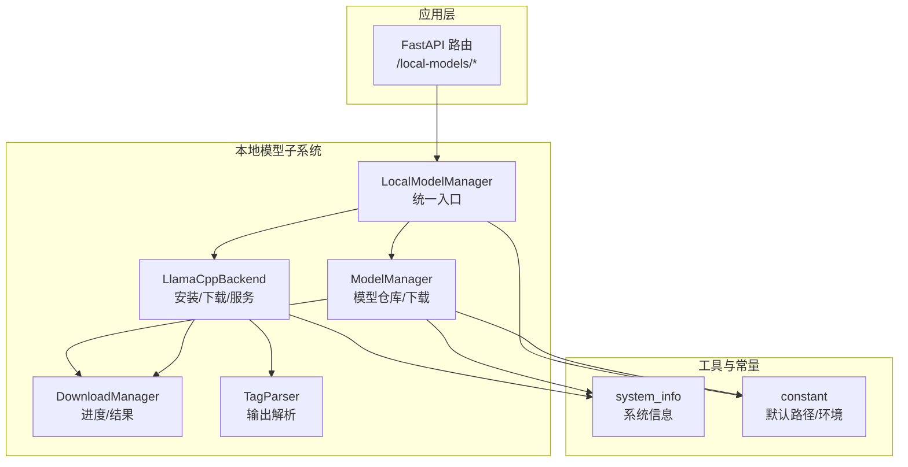
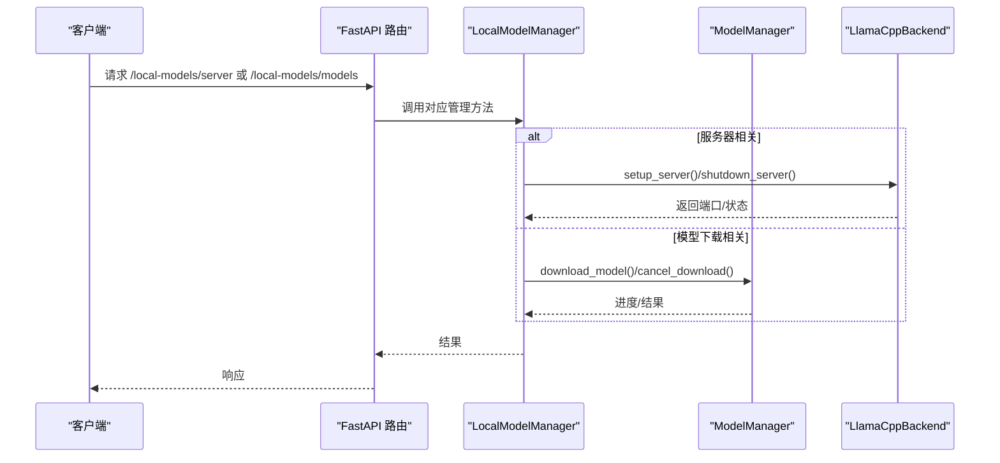
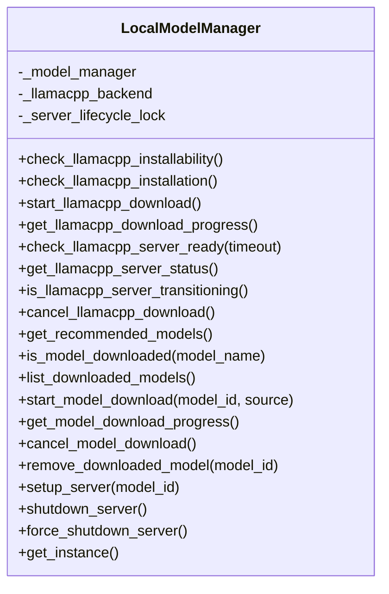
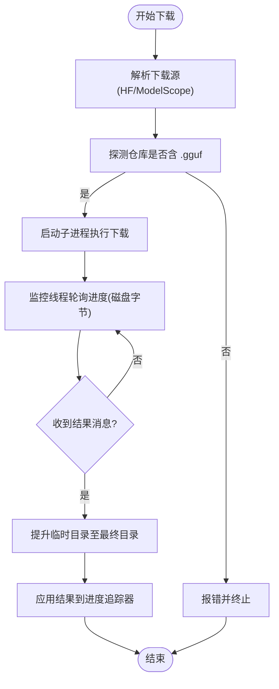
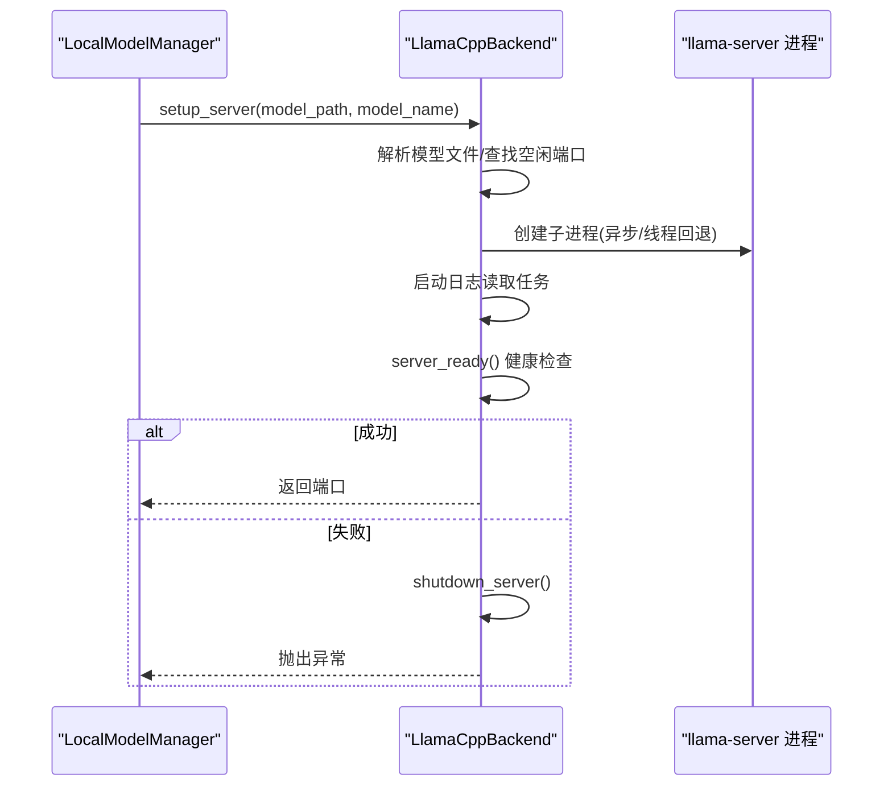
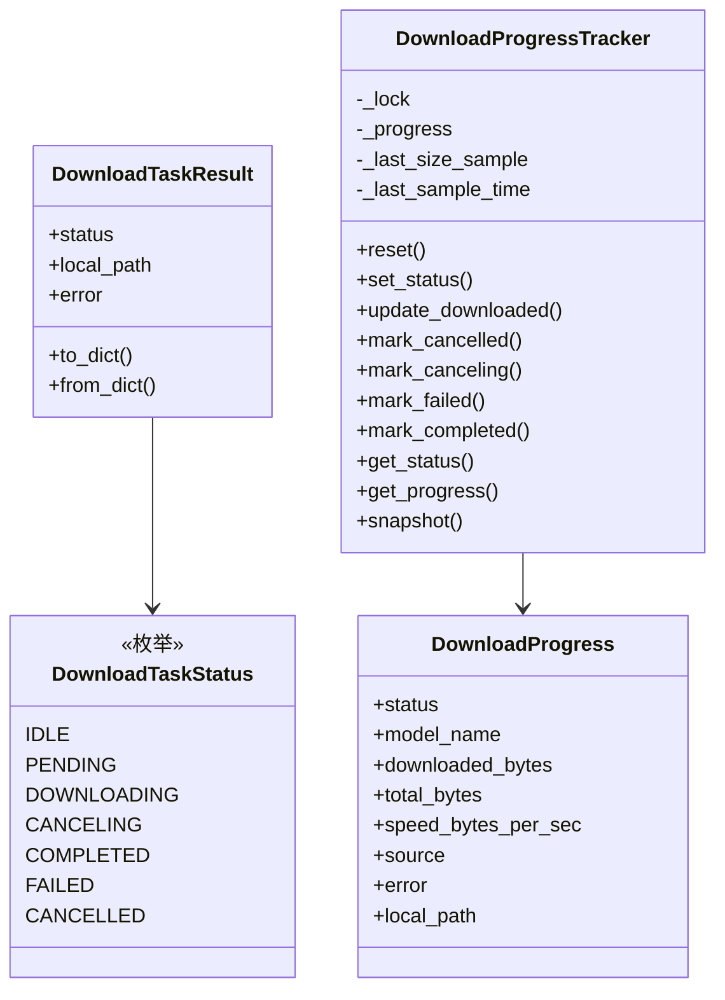
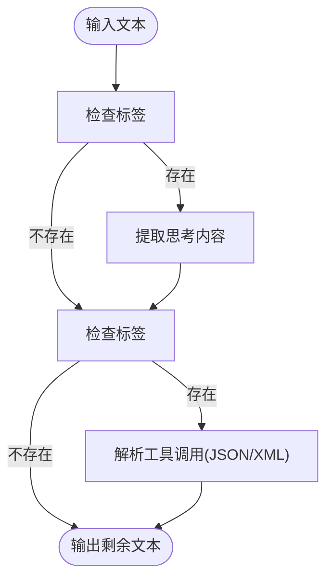
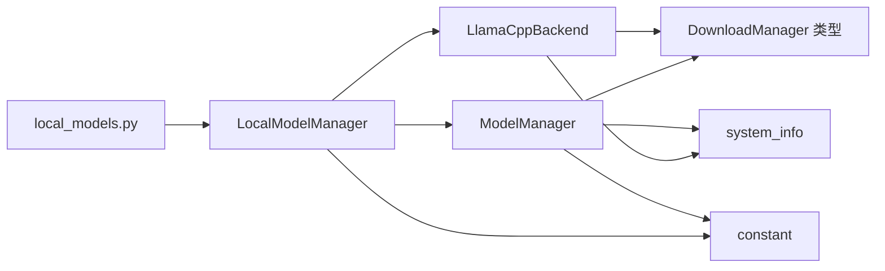

# 本地模型服务

<cite>
**本文引用的文件**
- [manager.py](file://copaw/src/copaw/local_models/manager.py)
- [download_manager.py](file://copaw/src/copaw/local_models/download_manager.py)
- [llamacpp.py](file://copaw/src/copaw/local_models/llamacpp.py)
- [model_manager.py](file://copaw/src/copaw/local_models/model_manager.py)
- [tag_parser.py](file://copaw/src/copaw/local_models/tag_parser.py)
- [system_info.py](file://copaw/src/copaw/utils/system_info.py)
- [constant.py](file://copaw/src/copaw/constant.py)
- [local_models.py](file://copaw/src/copaw/app/routers/local_models.py)
- [test_local_model_manager.py](file://copaw/tests/unit/local_models/test_local_model_manager.py)
- [test_download_manager.py](file://copaw/tests/unit/local_models/test_download_manager.py)
- [test_llamacpp_backend.py](file://copaw/tests/unit/local_models/test_llamacpp_backend.py)
</cite>

## 目录
1. [简介](#简介)
2. [项目结构](#项目结构)
3. [核心组件](#核心组件)
4. [架构总览](#架构总览)
5. [详细组件分析](#详细组件分析)
6. [依赖分析](#依赖分析)
7. [性能考虑](#性能考虑)
8. [故障排查指南](#故障排查指南)
9. [结论](#结论)
10. [附录](#附录)

## 简介
本技术文档围绕本地模型服务系统，聚焦 LocalModelManager 的架构设计与生命周期管理，深入解析模型下载管理器的实现（进度跟踪、断点续传、完整性校验），阐述 llama.cpp 后端的集成方式与 MLX 后端的实现差异，说明本地模型的启动、停止与重启机制（进程管理与资源监控），并给出配置管理、运行时参数调整与性能优化策略，以及健康检查、错误恢复与故障诊断方法。最后提供部署指南、硬件要求与最佳实践。

## 项目结构
本地模型服务位于 copaw 模块的 local_models 子包中，配合应用层路由与工具模块共同构成完整的本地推理服务链路。关键目录与文件如下：
- local_models：本地模型与后端管理
  - manager.py：统一入口 LocalModelManager
  - model_manager.py：本地模型仓库与下载管理
  - download_manager.py：下载状态与进度追踪
  - llamacpp.py：llama.cpp 后端安装、下载与服务器控制
  - tag_parser.py：从模型输出中提取思考与工具调用标签
- app/routers/local_models.py：FastAPI 路由接口
- utils/system_info.py：系统信息采集（CPU/GPU/内存）
- constant.py：默认工作目录与环境变量加载
- tests/unit/local_models：单元测试覆盖

图表来源
- [manager.py:14-132](file://copaw/src/copaw/local_models/manager.py#L14-L132)
- [model_manager.py:61-792](file://copaw/src/copaw/local_models/model_manager.py#L61-L792)
- [download_manager.py:13-279](file://copaw/src/copaw/local_models/download_manager.py#L13-L279)
- [llamacpp.py:78-890](file://copaw/src/copaw/local_models/llamacpp.py#L78-L890)
- [tag_parser.py:1-367](file://copaw/src/copaw/local_models/tag_parser.py#L1-L367)
- [system_info.py:1-229](file://copaw/src/copaw/utils/system_info.py#L1-L229)
- [constant.py:72-93](file://copaw/src/copaw/constant.py#L72-L93)
- [local_models.py:1-355](file://copaw/src/copaw/app/routers/local_models.py#L1-L355)

章节来源
- [manager.py:14-132](file://copaw/src/copaw/local_models/manager.py#L14-L132)
- [model_manager.py:61-792](file://copaw/src/copaw/local_models/model_manager.py#L61-L792)
- [download_manager.py:13-279](file://copaw/src/copaw/local_models/download_manager.py#L13-L279)
- [llamacpp.py:78-890](file://copaw/src/copaw/local_models/llamacpp.py#L78-L890)
- [tag_parser.py:1-367](file://copaw/src/copaw/local_models/tag_parser.py#L1-L367)
- [system_info.py:1-229](file://copaw/src/copaw/utils/system_info.py#L1-L229)
- [constant.py:72-93](file://copaw/src/copaw/constant.py#L72-L93)
- [local_models.py:1-355](file://copaw/src/copaw/app/routers/local_models.py#L1-L355)

## 核心组件
- LocalModelManager：统一入口，聚合 ModelManager 与 LlamaCppBackend，提供下载与服务器生命周期管理的门面接口；内置异步锁保证服务器启停的互斥性。
- ModelManager：负责推荐模型、下载进度与结果、取消下载、删除模型、估算大小与探测可用源等；采用子进程执行下载任务，主线程通过队列与监控线程更新进度。
- LlamaCppBackend：负责 llama.cpp 二进制的安装检测、下载与解压、服务器进程创建与健康检查、日志流处理、优雅关闭与强制清理。
- DownloadManager：定义下载生命周期状态、进度快照、结果序列化与反序列化、线程安全进度追踪器与任务辅助函数。
- TagParser：解析模型输出中的<think>与<tool_call>...</tool_call>标签，支持严格与宽松格式，便于工具调用与思维链展示。
- system_info：采集系统信息（OS、架构、CUDA版本、内存/显存），用于环境可安装性判断与推荐模型选择。
- constant：默认本地模型目录、工作目录与环境变量加载，确保路径一致性。

章节来源
- [manager.py:14-132](file://copaw/src/copaw/local_models/manager.py#L14-L132)
- [model_manager.py:61-792](file://copaw/src/copaw/local_models/model_manager.py#L61-L792)
- [download_manager.py:13-279](file://copaw/src/copaw/local_models/download_manager.py#L13-L279)
- [llamacpp.py:78-890](file://copaw/src/copaw/local_models/llamacpp.py#L78-L890)
- [tag_parser.py:1-367](file://copaw/src/copaw/local_models/tag_parser.py#L1-L367)
- [system_info.py:1-229](file://copaw/src/copaw/utils/system_info.py#L1-L229)
- [constant.py:72-93](file://copaw/src/copaw/constant.py#L72-L93)

## 架构总览
本地模型服务采用“门面 + 多后端”的分层设计：
- 应用层通过 FastAPI 路由暴露本地模型管理能力；
- LocalModelManager 作为门面协调 ModelManager 与 LlamaCppBackend；
- 下载流程由 DownloadManager 统一建模，ModelManager 使用子进程与队列进行后台下载，LlamaCppBackend 使用线程与事件进行后台下载；
- 进程管理与健康检查由 LlamaCppBackend 负责，支持跨平台进程组信号与回退方案；
- TagParser 提供输出解析能力，辅助工具调用与思维链展示。

图表来源
- [local_models.py:101-355](file://copaw/src/copaw/app/routers/local_models.py#L101-L355)
- [manager.py:107-122](file://copaw/src/copaw/local_models/manager.py#L107-L122)
- [model_manager.py:178-277](file://copaw/src/copaw/local_models/model_manager.py#L178-L277)
- [llamacpp.py:209-282](file://copaw/src/copaw/local_models/llamacpp.py#L209-L282)

## 详细组件分析

### LocalModelManager：统一入口与生命周期门面
- 角色定位：对外提供统一接口，内部组合 ModelManager 与 LlamaCppBackend；对服务器启停加互斥锁，避免竞态。
- 关键职责：
  - 检查/安装 llama.cpp 可用性与安装状态
  - 启动/取消/查询 llama.cpp 下载
  - 推荐模型、查询已下载模型、启动/停止/强制停止服务器
  - 查询服务器健康状态与过渡状态
- 设计要点：单例模式（模块级）与异步锁保护服务器生命周期操作。

图表来源
- [manager.py:14-132](file://copaw/src/copaw/local_models/manager.py#L14-L132)

章节来源
- [manager.py:14-132](file://copaw/src/copaw/local_models/manager.py#L14-L132)

### ModelManager：本地模型仓库与下载管理
- 推荐模型：基于系统内存/显存容量返回适配的模型清单，并标注是否已下载。
- 下载流程：
  - 选择下载源（优先 Hugging Face，不可达则回退 ModelScope）
  - 预估总大小、校验是否存在 .gguf 文件
  - 在子进程中执行 SDK 下载，主线程通过 Queue 与监控线程轮询磁盘已下载字节数
  - 将临时目录提升为最终目录，应用下载结果到进度追踪器
- 取消与清理：终止子进程、等待退出、清理临时目录、释放资源。
- 目录布局：DEFAULT_LOCAL_PROVIDER_DIR/models 下按 repo 分层存储，自动清理空父目录。

图表来源
- [model_manager.py:178-373](file://copaw/src/copaw/local_models/model_manager.py#L178-L373)

章节来源
- [model_manager.py:61-792](file://copaw/src/copaw/local_models/model_manager.py#L61-L792)

### LlamaCppBackend：llama.cpp 安装与服务器控制
- 安装与下载：
  - 环境可安装性检查（macOS 版本、架构、CUDA 版本映射）
  - 计算下载 URL（base_url/release_tag/文件名），支持 zip/tar.gz 自动解压与顶层目录扁平化
  - 后台线程下载，进度追踪器记录状态、速度、总大小与来源
  - 支持取消下载（设置 Event 并重置状态）
- 服务器控制：
  - 解析模型文件（支持 .gguf 文件或仓库内首个 .gguf）
  - 创建子进程（Linux/Mac 使用新会话，Windows 回退到线程包装）
  - 异步健康检查（/health），超时失败时自动关闭并抛出异常
  - 日志流异步读取，优雅关闭与强制清理（SIGTERM/SIGKILL、进程组）
- 进程与资源：
  - 状态字段：running/port/model_name/pid
  - 过渡状态标记，防止并发启停
  - atexit 注册强制清理

图表来源
- [llamacpp.py:209-282](file://copaw/src/copaw/local_models/llamacpp.py#L209-L282)
- [llamacpp.py:573-622](file://copaw/src/copaw/local_models/llamacpp.py#L573-L622)

章节来源
- [llamacpp.py:78-890](file://copaw/src/copaw/local_models/llamacpp.py#L78-L890)

### 下载管理器：进度、取消与结果
- 生命周期状态：IDLE/PENDING/DOWNLOADING/CANCELING/CANCELLED/COMPLETED/FAILED
- 进度追踪器：线程安全，记录已下载字节、总大小、速度、来源、错误、本地路径；支持重置、更新、标记完成/失败/取消
- 任务辅助：begin_download_task 初始化任务，apply_download_result 应用终端结果并更新进度

图表来源
- [download_manager.py:13-279](file://copaw/src/copaw/local_models/download_manager.py#L13-L279)

章节来源
- [download_manager.py:13-279](file://copaw/src/copaw/local_models/download_manager.py#L13-L279)

### 输出解析：思考与工具调用标签
- 支持<think>... </think> 与<tool_call>...</tool_call> 标签解析
- 兼容严格与宽松 XML 格式，JSON 与 XML 双通道解析
- 流式场景：保留未闭合标签的状态与部分文本

图表来源
- [tag_parser.py:271-367](file://copaw/src/copaw/local_models/tag_parser.py#L271-L367)

章节来源
- [tag_parser.py:1-367](file://copaw/src/copaw/local_models/tag_parser.py#L1-L367)

## 依赖分析
- LocalModelManager 依赖 ModelManager 与 LlamaCppBackend，二者均依赖 DownloadManager 的进度与结果类型。
- LlamaCppBackend 与 ModelManager 均依赖 system_info 获取系统信息，依赖 constant 的默认本地目录。
- 应用层路由依赖 LocalModelManager 提供的接口。

图表来源
- [local_models.py:1-355](file://copaw/src/copaw/app/routers/local_models.py#L1-L355)
- [manager.py:14-132](file://copaw/src/copaw/local_models/manager.py#L14-L132)
- [model_manager.py:61-792](file://copaw/src/copaw/local_models/model_manager.py#L61-L792)
- [llamacpp.py:78-890](file://copaw/src/copaw/local_models/llamacpp.py#L78-L890)
- [download_manager.py:13-279](file://copaw/src/copaw/local_models/download_manager.py#L13-L279)
- [system_info.py:1-229](file://copaw/src/copaw/utils/system_info.py#L1-L229)
- [constant.py:72-93](file://copaw/src/copaw/constant.py#L72-L93)

章节来源
- [local_models.py:1-355](file://copaw/src/copaw/app/routers/local_models.py#L1-L355)
- [manager.py:14-132](file://copaw/src/copaw/local_models/manager.py#L14-L132)
- [model_manager.py:61-792](file://copaw/src/copaw/local_models/model_manager.py#L61-L792)
- [llamacpp.py:78-890](file://copaw/src/copaw/local_models/llamacpp.py#L78-L890)
- [download_manager.py:13-279](file://copaw/src/copaw/local_models/download_manager.py#L13-L279)
- [system_info.py:1-229](file://copaw/src/copaw/utils/system_info.py#L1-L229)
- [constant.py:72-93](file://copaw/src/copaw/constant.py#L72-L93)

## 性能考虑
- 下载性能
  - ModelManager 使用子进程与队列监控磁盘字节，避免阻塞主线程；建议在高 IO 场景下合理设置 chunk_size 与监控间隔。
  - LlamaCppBackend 使用线程下载与进度追踪器，支持取消与清理临时文件，降低失败重试成本。
- 服务器性能
  - 默认参数包含 --gpu-layers auto，建议根据显存大小与模型规模调整；可通过外部参数扩展（当前实现固定参数）。
  - 健康检查超时默认 120 秒，可根据网络与磁盘状况调整。
- 资源管理
  - 进程组信号（POSIX）与回退终止策略，确保优雅关闭；atexit 注册强制清理，避免僵尸进程。
- I/O 与并发
  - 下载与服务器启停均使用互斥锁，避免竞态；建议在上层路由中串行触发同一模型的启停请求。

[本节为通用指导，无需特定文件引用]

## 故障排查指南
- 服务器无法启动
  - 检查安装状态与可安装性：安装检测失败通常由环境不满足（macOS 版本、架构、CUDA 映射）导致。
  - 健康检查失败：查看日志任务输出，确认端口占用与模型文件路径正确。
  - 进程异常退出：force_shutdown_server 会尝试 SIGTERM/SIGKILL 并清理状态。
- 下载失败
  - ModelManager：检查源可达性（HF/ModelScope）、.gguf 文件存在性、子进程退出码与队列消息。
  - LlamaCppBackend：检查网络与目标目录权限、临时文件清理、取消事件是否生效。
- 进度异常
  - 确认 DownloadProgressTracker 的状态机转换是否正确，错误/取消/完成分支是否被触发。
- 路由错误
  - FastAPI 路由返回 400/409 错误时，检查请求体与模型 ID 是否有效。

章节来源
- [llamacpp.py:347-376](file://copaw/src/copaw/local_models/llamacpp.py#L347-L376)
- [llamacpp.py:573-609](file://copaw/src/copaw/local_models/llamacpp.py#L573-L609)
- [model_manager.py:331-373](file://copaw/src/copaw/local_models/model_manager.py#L331-L373)
- [download_manager.py:252-279](file://copaw/src/copaw/local_models/download_manager.py#L252-L279)
- [local_models.py:101-167](file://copaw/src/copaw/app/routers/local_models.py#L101-L167)

## 结论
本地模型服务通过 LocalModelManager 实现统一入口，结合 ModelManager 的高效下载与 LlamaCppBackend 的稳定服务器控制，形成完整的本地推理闭环。下载管理器提供一致的状态与进度抽象，输出解析模块增强工具调用与思维链展示。系统具备良好的进程管理、健康检查与错误恢复能力，适合在桌面与边缘设备上部署运行。

[本节为总结，无需特定文件引用]

## 附录

### 部署指南与硬件要求
- 硬件要求
  - 内存/显存：根据推荐模型选择（低内存仅推荐小模型，高内存可选更大模型）
  - macOS：需满足最低版本要求（如 M 系芯片与系统版本）
  - CUDA：Windows 上可选映射版本，无 CUDA 时使用 CPU
- 路径与环境
  - 默认本地模型目录：WORKING_DIR/local_models
  - 可通过环境变量覆盖工作目录与密钥目录
- 部署步骤
  - 安装依赖（HF/ModelScope SDK）
  - 通过路由启动 llama.cpp 下载与服务器
  - 通过路由下载推荐模型并启动服务
  - 更新 Provider 配置以接入本地模型

章节来源
- [system_info.py:20-121](file://copaw/src/copaw/utils/system_info.py#L20-L121)
- [constant.py:72-93](file://copaw/src/copaw/constant.py#L72-L93)
- [local_models.py:101-279](file://copaw/src/copaw/app/routers/local_models.py#L101-L279)

### 最佳实践
- 优先使用 Hugging Face 作为下载源，不可达时自动回退 ModelScope
- 下载过程中避免并发触发同一模型的启停请求
- 服务器启动前确保模型文件为 .gguf，且仓库包含至少一个 .gguf
- 定期清理不再使用的模型目录，保持磁盘空间
- 在容器环境中注意进程组与信号处理差异

[本节为通用指导，无需特定文件引用]