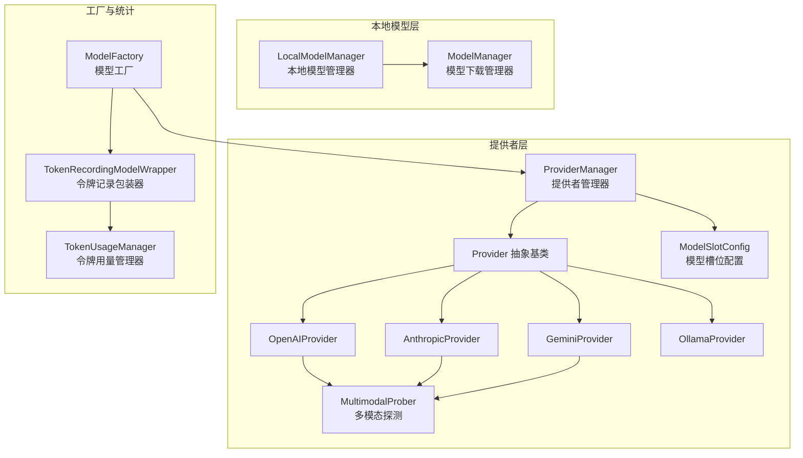
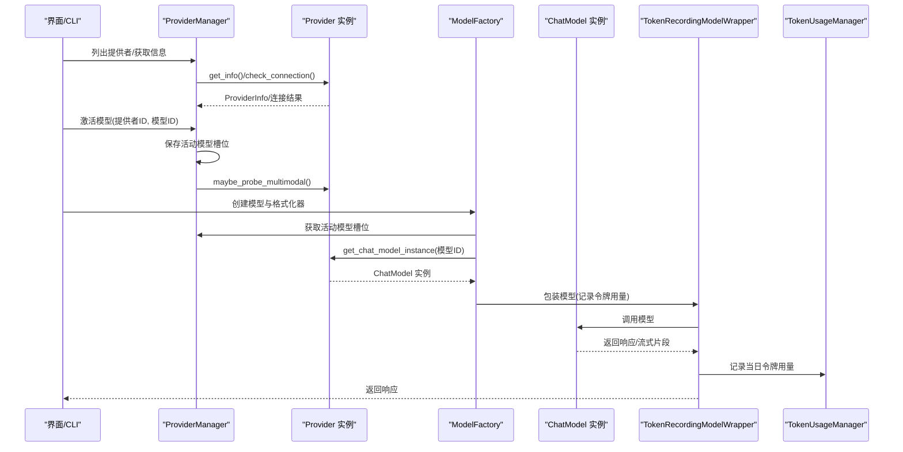
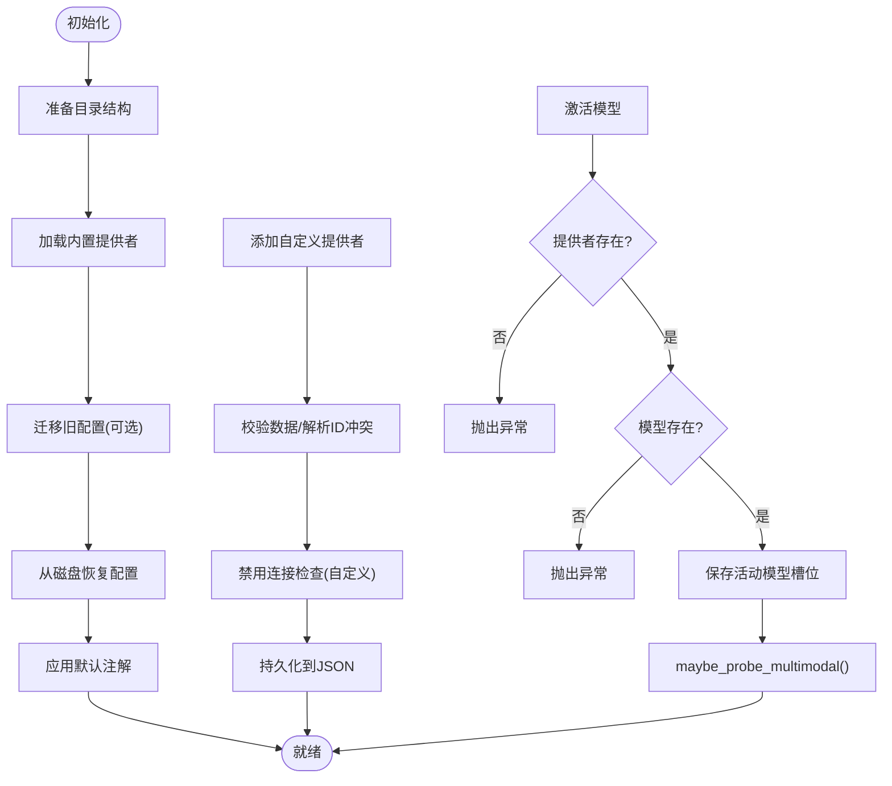
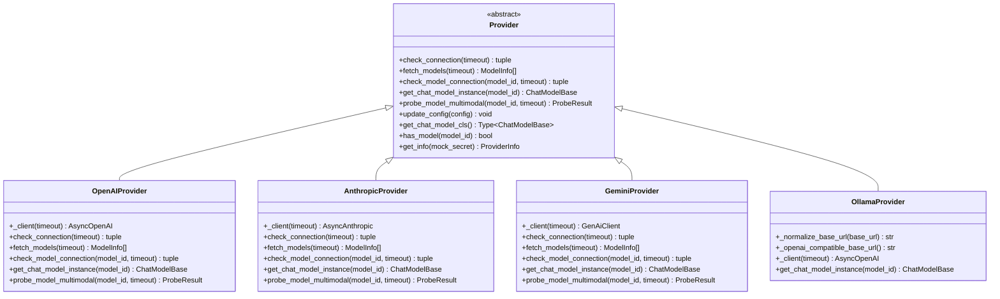
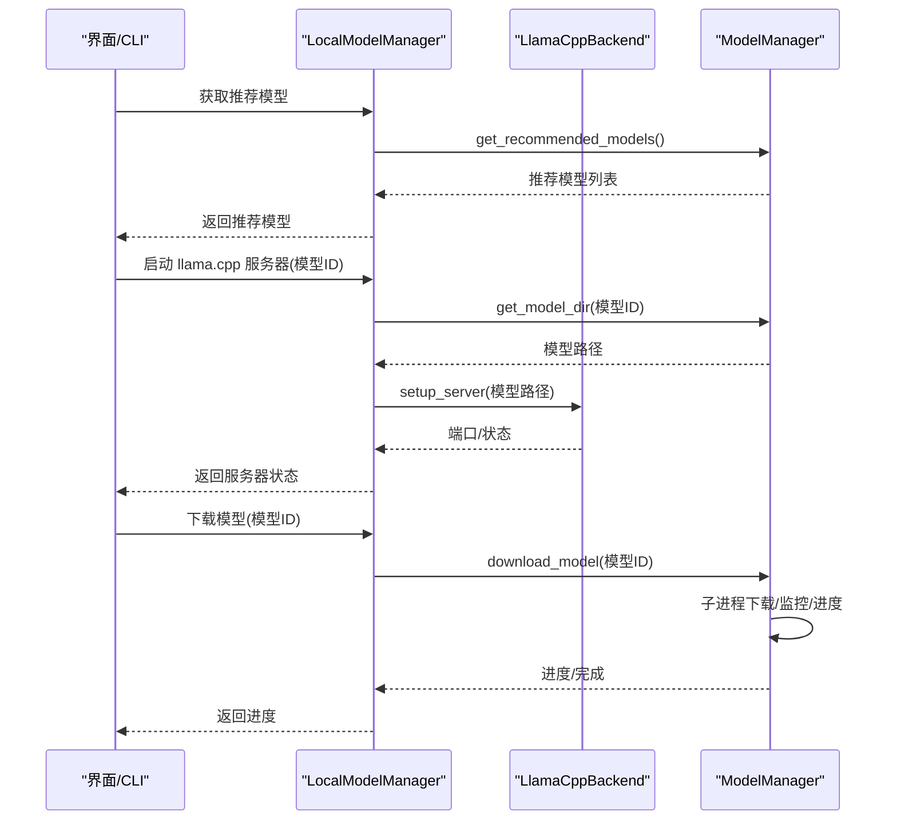
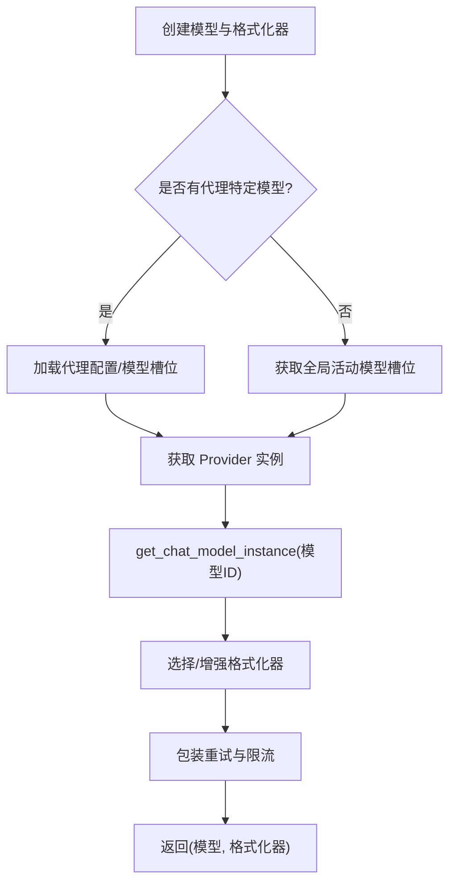
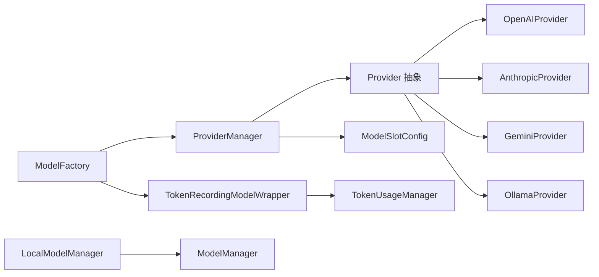

# 模型管理系统

<cite>
**本文档引用的文件**
- [provider_manager.py](file://copaw/src/copaw/providers/provider_manager.py)
- [provider.py](file://copaw/src/copaw/providers/provider.py)
- [openai_provider.py](file://copaw/src/copaw/providers/openai_provider.py)
- [anthropic_provider.py](file://copaw/src/copaw/providers/anthropic_provider.py)
- [gemini_provider.py](file://copaw/src/copaw/providers/gemini_provider.py)
- [ollama_provider.py](file://copaw/src/copaw/providers/ollama_provider.py)
- [models.py](file://copaw/src/copaw/providers/models.py)
- [multimodal_prober.py](file://copaw/src/copaw/providers/multimodal_prober.py)
- [manager.py](file://copaw/src/copaw/local_models/manager.py)
- [model_manager.py](file://copaw/src/copaw/local_models/model_manager.py)
- [model_factory.py](file://copaw/src/copaw/agents/model_factory.py)
- [manager.py](file://copaw/src/copaw/token_usage/manager.py)
- [model_wrapper.py](file://copaw/src/copaw/token_usage/model_wrapper.py)
</cite>

## 目录
1. [简介](#简介)
2. [项目结构](#项目结构)
3. [核心组件](#核心组件)
4. [架构总览](#架构总览)
5. [详细组件分析](#详细组件分析)
6. [依赖关系分析](#依赖关系分析)
7. [性能考虑](#性能考虑)
8. [故障排查指南](#故障排查指南)
9. [结论](#结论)
10. [附录](#附录)

## 简介
本技术文档面向模型管理系统，重点阐述 ProviderManager 提供者管理器的架构设计与多提供者支持机制；深入解析 Provider 抽象基类的设计模式及 OpenAI、Anthropic、Google Gemini、Ollama 等提供者的差异化实现；详解 LocalModelManager 本地模型管理器的下载、安装、运行与管理流程；说明模型工厂模式在模型实例创建中的应用；介绍模型配置管理、连接测试与错误处理机制；并提供模型提供者开发指南（新增提供者流程、认证配置与性能优化建议），以及模型使用计费统计与配额管理的实现细节。

## 项目结构
模型管理相关代码主要分布在以下模块：
- providers：提供者抽象与具体实现、模型槽位配置、多模态探测工具
- local_models：本地模型下载与运行控制
- agents：模型工厂与消息格式化
- token_usage：令牌用量记录与统计

**图表来源**
- [provider_manager.py:567-800](file://copaw/src/copaw/providers/provider_manager.py#L567-L800)
- [provider.py:100-250](file://copaw/src/copaw/providers/provider.py#L100-L250)
- [openai_provider.py:25-550](file://copaw/src/copaw/providers/openai_provider.py#L25-L550)
- [anthropic_provider.py:27-256](file://copaw/src/copaw/providers/anthropic_provider.py#L27-L256)
- [gemini_provider.py:27-332](file://copaw/src/copaw/providers/gemini_provider.py#L27-L332)
- [ollama_provider.py:16-86](file://copaw/src/copaw/providers/ollama_provider.py#L16-L86)
- [models.py:9-16](file://copaw/src/copaw/providers/models.py#L9-L16)
- [multimodal_prober.py:75-102](file://copaw/src/copaw/providers/multimodal_prober.py#L75-L102)
- [manager.py:14-132](file://copaw/src/copaw/local_models/manager.py#L14-L132)
- [model_manager.py:61-792](file://copaw/src/copaw/local_models/model_manager.py#L61-L792)
- [model_factory.py:691-778](file://copaw/src/copaw/agents/model_factory.py#L691-L778)
- [manager.py:62-309](file://copaw/src/copaw/token_usage/manager.py#L62-L309)
- [model_wrapper.py:15-71](file://copaw/src/copaw/token_usage/model_wrapper.py#L15-L71)

**章节来源**
- [provider_manager.py:1-1157](file://copaw/src/copaw/providers/provider_manager.py#L1-L1157)
- [provider.py:1-250](file://copaw/src/copaw/providers/provider.py#L1-L250)
- [manager.py:1-132](file://copaw/src/copaw/local_models/manager.py#L1-L132)
- [model_manager.py:1-792](file://copaw/src/copaw/local_models/model_manager.py#L1-L792)
- [model_factory.py:1-811](file://copaw/src/copaw/agents/model_factory.py#L1-L811)
- [manager.py:1-309](file://copaw/src/copaw/token_usage/manager.py#L1-L309)
- [model_wrapper.py:1-71](file://copaw/src/copaw/token_usage/model_wrapper.py#L1-L71)

## 核心组件
- ProviderManager：统一管理内置与自定义提供者，负责提供者列表、信息查询、配置更新、模型拉取、活动模型激活与多模态能力自动探测。
- Provider 抽象基类：定义提供者通用接口（连接检查、模型发现、模型连接检查、模型增删、配置更新、聊天模型实例化、多模态探测）与 ProviderInfo 数据结构。
- 具体提供者实现：OpenAIProvider、AnthropicProvider、GeminiProvider、OllamaProvider，分别适配不同平台的 API 与特性。
- LocalModelManager：封装 llama.cpp 二进制下载、服务状态监控、服务器生命周期控制与推荐本地模型选择。
- ModelManager：基于进程的模型下载管理器，支持 HuggingFace 与 ModelScope 双源回退、进度跟踪、取消与清理。
- ModelFactory：根据配置创建聊天模型与对应格式化器，支持重试与速率限制，并通过包装器记录令牌用量。
- TokenUsageManager 与 TokenRecordingModelWrapper：记录每日按提供商/模型聚合的提示词与补全令牌用量，支持汇总查询。

**章节来源**
- [provider_manager.py:567-800](file://copaw/src/copaw/providers/provider_manager.py#L567-L800)
- [provider.py:100-250](file://copaw/src/copaw/providers/provider.py#L100-L250)
- [openai_provider.py:25-550](file://copaw/src/copaw/providers/openai_provider.py#L25-L550)
- [anthropic_provider.py:27-256](file://copaw/src/copaw/providers/anthropic_provider.py#L27-L256)
- [gemini_provider.py:27-332](file://copaw/src/copaw/providers/gemini_provider.py#L27-L332)
- [ollama_provider.py:16-86](file://copaw/src/copaw/providers/ollama_provider.py#L16-L86)
- [manager.py:14-132](file://copaw/src/copaw/local_models/manager.py#L14-L132)
- [model_manager.py:61-792](file://copaw/src/copaw/local_models/model_manager.py#L61-L792)
- [model_factory.py:691-778](file://copaw/src/copaw/agents/model_factory.py#L691-L778)
- [manager.py:62-309](file://copaw/src/copaw/token_usage/manager.py#L62-L309)
- [model_wrapper.py:15-71](file://copaw/src/copaw/token_usage/model_wrapper.py#L15-L71)

## 架构总览
系统采用“抽象基类 + 多实现 + 工厂 + 包装器”的分层架构：
- Provider 抽象层定义统一契约，具体提供者实现差异化 API 调用与能力探测。
- ProviderManager 统一注册与管理提供者，维护活动模型槽位，触发后台能力探测。
- ModelFactory 基于当前活动模型槽位或代理特定配置创建 ChatModel 实例，并注入格式化器与重试/限流包装器。
- TokenRecordingModelWrapper 在调用后提取 ChatUsage 并写入 TokenUsageManager，后者以日期聚合存储与查询。

**图表来源**
- [provider_manager.py:620-800](file://copaw/src/copaw/providers/provider_manager.py#L620-L800)
- [provider.py:100-250](file://copaw/src/copaw/providers/provider.py#L100-L250)
- [model_factory.py:691-778](file://copaw/src/copaw/agents/model_factory.py#L691-L778)
- [model_wrapper.py:15-71](file://copaw/src/copaw/token_usage/model_wrapper.py#L15-L71)
- [manager.py:110-156](file://copaw/src/copaw/token_usage/manager.py#L110-L156)

## 详细组件分析

### ProviderManager：提供者管理器
- 角色与职责
  - 注册内置提供者（如 OpenAI、Anthropic、Gemini、Ollama 等），支持自定义提供者动态添加与持久化。
  - 提供统一接口：列出提供者信息、按 ID 获取提供者、更新提供者配置、拉取远端可用模型、激活全局活动模型、后台自动探测多模态能力。
  - 使用磁盘目录结构存储自定义提供者配置，确保安全权限设置。
- 关键流程
  - 初始化：准备目录、加载内置提供者、迁移旧配置、从磁盘恢复、应用默认注解。
  - 添加自定义提供者：校验数据、解析冲突 ID、禁用连接检查以避免误判、持久化到 JSON。
  - 激活模型：校验提供者与模型存在性，写入活动模型槽位，触发可能的多模态探测任务。
  - 后台恢复本地模型：在应用启动后异步尝试恢复本地模型服务器状态，记录异常但不阻塞主线程。
- 错误处理
  - 模型拉取失败、探测失败均记录警告日志，返回空结果或默认值，保证系统稳定性。
  - 自定义提供者连接检查默认关闭，避免 UI 显示误报。

**图表来源**
- [provider_manager.py:591-750](file://copaw/src/copaw/providers/provider_manager.py#L591-L750)

**章节来源**
- [provider_manager.py:567-800](file://copaw/src/copaw/providers/provider_manager.py#L567-L800)

### Provider 抽象基类与数据模型
- 抽象方法
  - check_connection：检查提供者可达性（可带超时）。
  - fetch_models：从远端拉取可用模型列表。
  - check_model_connection：检查指定模型是否可用（可带超时）。
  - get_chat_model_instance：返回对应聊天模型实例。
  - probe_model_multimodal：默认返回无多模态能力，子类可覆盖实现。
- 数据模型
  - ModelInfo：模型标识、名称、多模态支持状态（图像/视频）、探测来源。
  - ProviderInfo：提供者标识、名称、基础 URL、API Key、聊天模型类名、预置模型、额外模型、前缀、本地标记、冻结 URL、是否需要 API Key、是否自定义、是否支持模型发现、是否支持无需模型的连接检查、生成参数等。
- 工具方法
  - update_config：按传入字典更新配置字段（含 generate_kwargs 与 extra_models）。
  - get_chat_model_cls：动态反射获取聊天模型类。
  - has_model：判断提供者是否包含某模型。
  - get_info：返回 ProviderInfo 的安全视图（可隐藏真实密钥）。

**图表来源**
- [provider.py:100-250](file://copaw/src/copaw/providers/provider.py#L100-L250)
- [openai_provider.py:25-550](file://copaw/src/copaw/providers/openai_provider.py#L25-L550)
- [anthropic_provider.py:27-256](file://copaw/src/copaw/providers/anthropic_provider.py#L27-L256)
- [gemini_provider.py:27-332](file://copaw/src/copaw/providers/gemini_provider.py#L27-L332)
- [ollama_provider.py:16-86](file://copaw/src/copaw/providers/ollama_provider.py#L16-L86)

**章节来源**
- [provider.py:1-250](file://copaw/src/copaw/providers/provider.py#L1-L250)

### OpenAIProvider：兼容 OpenAI 协议的提供者
- 连接检查：调用 models.list，捕获 APIError 或未知异常，返回布尔与消息。
- 模型拉取：标准化远端返回 payload，去重后返回 ModelInfo 列表。
- 模型连接检查：发送极短文本请求并消费流以验证可用性。
- 多模态探测：
  - 图像探测：发送 32x32 红色 PNG，要求模型识别主色调；对推理模型同时检查 reasoning_content；对 400 或媒体关键词错误直接判定不支持；对 HTTP 超时等不确定错误返回“探测不确定”。
  - 视频探测：优先尝试内联 base64，再回退到外部 HTTP URL；对 400 错误判定格式不被接受，继续尝试其他格式；对非 400 的错误进行分类处理。
- 聊天模型实例化：根据 DashScope 与 Coding 场景设置默认请求头，返回 OpenAI 兼容聊天模型。

**章节来源**
- [openai_provider.py:57-550](file://copaw/src/copaw/providers/openai_provider.py#L57-L550)

### AnthropicProvider：Anthropic API 提供者
- 连接检查：调用 models.list，返回布尔与消息。
- 模型拉取：标准化 payload，去重后返回 ModelInfo 列表。
- 模型连接检查：构造最小消息请求并消费流，验证可用性。
- 多模态探测：仅支持图像输入（视频不支持），发送 1x1 PNG，若出现媒体关键词错误或 400 判定不支持，否则视为支持。
- 聊天模型实例化：根据 DashScope/Coding 设置默认请求头，返回 AnthropicChatModel。

**章节来源**
- [anthropic_provider.py:66-256](file://copaw/src/copaw/providers/anthropic_provider.py#L66-L256)

### GeminiProvider：Google Gemini API 提供者
- 连接检查：使用异步 models.list 验证连通性。
- 模型拉取：遍历异步迭代器收集模型，去除 “models/” 前缀，标准化显示名。
- 模型连接检查：使用 generate_content_stream 发送简单内容并消费流。
- 多模态探测：图像与视频均支持，图像发送内联 PNG 并要求识别主色调；视频发送外部文件数据并询问是否包含运动内容，依据回答判定支持与否。
- 聊天模型实例化：返回原生 GeminiChatModel。

**章节来源**
- [gemini_provider.py:68-332](file://copaw/src/copaw/providers/gemini_provider.py#L68-L332)

### OllamaProvider：本地 Ollama 提供者
- 特性：继承 OpenAIProvider，通过 OpenAI 兼容端点访问 Ollama；自动规范化 base_url（去除末尾 /v1）；若未设置则读取环境变量或使用默认地址。
- 不支持：无法通过 API 动态增删模型，需在 Ollama 侧执行命令管理模型。
- 聊天模型实例化：返回 OpenAI 兼容聊天模型，客户端 base_url 指向 /v1。

**章节来源**
- [ollama_provider.py:16-86](file://copaw/src/copaw/providers/ollama_provider.py#L16-L86)

### LocalModelManager 与 ModelManager：本地模型管理
- LocalModelManager
  - 单一入口：封装 llama.cpp 二进制下载、服务状态查询、服务器生命周期控制（启动/停止/强制停止）、推荐模型选择、模型下载进度与取消、本地模型删除。
  - 服务器生命周期加锁：防止并发启动/停止导致状态混乱。
- ModelManager
  - 下载策略：优先 Hugging Face，不可达时回退至 ModelScope；估算总大小、检查是否存在 .gguf 文件；在子进程中执行下载，主线程监控磁盘已下载字节与队列消息。
  - 进度与取消：基于 DownloadProgressTracker 记录快照；支持取消下载并清理临时目录。
  - 推荐模型：根据系统内存/GPU 显存容量推荐合适规模的本地模型。
  - 清理与去重：扫描已下载目录，去重父级包含关系，清理空目录。

**图表来源**
- [manager.py:14-132](file://copaw/src/copaw/local_models/manager.py#L14-L132)
- [model_manager.py:61-792](file://copaw/src/copaw/local_models/model_manager.py#L61-L792)

**章节来源**
- [manager.py:1-132](file://copaw/src/copaw/local_models/manager.py#L1-L132)
- [model_manager.py:1-792](file://copaw/src/copaw/local_models/model_manager.py#L1-L792)

### 模型工厂模式与模型实例创建
- 模型工厂
  - 优先从代理上下文加载代理特定模型槽位；若不存在，则使用全局活动模型槽位。
  - 通过 ProviderManager 获取 Provider 实例并创建 ChatModel 实例。
  - 根据实际聊天模型类动态选择格式化器（OpenAI/Anthropic/Gemini），并增强以支持文件块与媒体块。
  - 包装重试逻辑（RetryChatModel）与速率限制配置，提升鲁棒性。
- 令牌用量记录
  - TokenRecordingModelWrapper 在同步与流式响应中提取 ChatUsage，调用 TokenUsageManager 记录当日用量。

**图表来源**
- [model_factory.py:691-778](file://copaw/src/copaw/agents/model_factory.py#L691-L778)
- [model_wrapper.py:15-71](file://copaw/src/copaw/token_usage/model_wrapper.py#L15-L71)

**章节来源**
- [model_factory.py:1-811](file://copaw/src/copaw/agents/model_factory.py#L1-L811)
- [model_wrapper.py:1-71](file://copaw/src/copaw/token_usage/model_wrapper.py#L1-L71)

### 多模态能力探测机制
- 探测目标：图像与视频支持能力。
- 探测策略：
  - 使用固定大小的最小探针（PNG/MP4），避免过小导致被拒绝。
  - 对图像：要求识别主色调；对推理模型同时检查 reasoning_content。
  - 对视频：优先内联 base64，再回退外部 HTTP URL；对 400 错误判定格式不被接受，继续尝试其他格式。
  - 对媒体关键词错误（如不支持图像/视频）直接判定不支持；对超时等不确定错误返回“探测不确定”。
- 结果封装：ProbeResult 包含 supports_image/supports_video/image_message/video_message。

**章节来源**
- [multimodal_prober.py:75-102](file://copaw/src/copaw/providers/multimodal_prober.py#L75-L102)
- [openai_provider.py:165-550](file://copaw/src/copaw/providers/openai_provider.py#L165-L550)
- [anthropic_provider.py:166-256](file://copaw/src/copaw/providers/anthropic_provider.py#L166-L256)
- [gemini_provider.py:142-332](file://copaw/src/copaw/providers/gemini_provider.py#L142-L332)

### 模型配置管理、连接测试与错误处理
- 配置管理
  - Provider.update_config 支持批量更新名称、URL、API Key、聊天模型类名、前缀、生成参数与额外模型列表。
  - Provider.get_info 返回安全视图，可隐藏真实密钥。
  - ProviderManager 将配置持久化到磁盘 JSON，支持迁移与恢复。
- 连接测试
  - Provider.check_connection：针对不同平台调用各自 API 的最小请求，快速验证连通性。
  - Provider.check_model_connection：对指定模型发送极短请求并消费流，确保模型可用。
- 错误处理
  - 捕获 APIError 与未知异常，返回明确错误消息。
  - 多模态探测失败时记录警告日志，不影响整体流程。
  - ProviderManager 对模型拉取与探测异常进行降级处理，返回空结果。

**章节来源**
- [provider.py:149-250](file://copaw/src/copaw/providers/provider.py#L149-L250)
- [provider_manager.py:685-708](file://copaw/src/copaw/providers/provider_manager.py#L685-L708)

### 计费统计与配额管理
- 令牌用量记录
  - TokenRecordingModelWrapper 在每次调用后提取 ChatUsage，记录当日 prompt_tokens 与 completion_tokens。
  - 支持同步与流式两种场景，流式场景记录最后一个片段的 usage。
- 统计与查询
  - TokenUsageManager 以日期为粒度聚合 provider_id + model 组合的用量，支持按日期范围、模型名、提供商过滤。
  - 提供 total_prompt_tokens、total_completion_tokens、total_calls、按模型/提供商/日期的分组统计。
- 配额管理
  - 当前实现为用量统计与查询，未见显式的配额上限控制逻辑。可在上层业务中结合统计结果进行配额告警与限制。

**章节来源**
- [model_wrapper.py:15-71](file://copaw/src/copaw/token_usage/model_wrapper.py#L15-L71)
- [manager.py:62-309](file://copaw/src/copaw/token_usage/manager.py#L62-L309)

## 依赖关系分析
- ProviderManager 依赖 Provider 抽象与具体实现类，以及模型槽位配置与多模态探测工具。
- ModelFactory 依赖 ProviderManager 与 TokenRecordingModelWrapper，间接依赖 TokenUsageManager。
- LocalModelManager 依赖 ModelManager 与 LlamaCppBackend（内部实现）。
- 各 Provider 依赖对应第三方 SDK（OpenAI、Anthropic、Google GenAI）与 MultimodalProber。

**图表来源**
- [provider_manager.py:567-800](file://copaw/src/copaw/providers/provider_manager.py#L567-L800)
- [provider.py:100-250](file://copaw/src/copaw/providers/provider.py#L100-L250)
- [model_factory.py:691-778](file://copaw/src/copaw/agents/model_factory.py#L691-L778)
- [model_wrapper.py:15-71](file://copaw/src/copaw/token_usage/model_wrapper.py#L15-L71)
- [manager.py:62-309](file://copaw/src/copaw/token_usage/manager.py#L62-L309)
- [manager.py:14-132](file://copaw/src/copaw/local_models/manager.py#L14-L132)
- [model_manager.py:61-792](file://copaw/src/copaw/local_models/model_manager.py#L61-L792)

**章节来源**
- [provider_manager.py:1-1157](file://copaw/src/copaw/providers/provider_manager.py#L1-L1157)
- [model_factory.py:1-811](file://copaw/src/copaw/agents/model_factory.py#L1-L811)

## 性能考虑
- 异步与并发
  - ProviderManager 使用 asyncio.gather 并行获取提供者信息，提升 UI 列表加载速度。
  - LocalModelManager 对服务器生命周期加锁，避免竞态条件。
- 超时与重试
  - 所有网络请求均设置合理超时；ModelFactory 通过 RetryChatModel 与 RateLimitConfig 提升稳定性。
- I/O 与资源
  - ModelManager 在子进程中执行下载，避免阻塞主线程；监控线程基于磁盘已下载字节估算进度。
- 多模态探测
  - 探针尺寸与内容经过精心设计，减少误报与无效请求；对 400 错误与媒体关键词错误进行快速判定，降低探测成本。

[本节为通用指导，无需特定文件引用]

## 故障排查指南
- 提供者连接失败
  - 检查 base_url 与 API Key 是否正确；确认网络可达；查看 Provider.check_connection 的错误消息。
- 模型不可用
  - 使用 Provider.check_model_connection 对目标模型进行最小请求验证；关注流式消费是否成功。
- 多模态探测异常
  - 查看探针日志与 ProbeResult 信息；对 400 错误通常表示格式不被接受，尝试其他格式；对媒体关键词错误可判定为不支持。
- 本地模型下载失败
  - 检查网络连通性与镜像源可用性；确认 .gguf 文件存在；查看 ModelManager 的错误消息与队列日志。
- 令牌用量未记录
  - 确认 TokenRecordingModelWrapper 已包裹模型；检查 ChatUsage 是否存在；查看 TokenUsageManager 的文件写入权限与路径。

**章节来源**
- [openai_provider.py:57-125](file://copaw/src/copaw/providers/openai_provider.py#L57-L125)
- [anthropic_provider.py:66-127](file://copaw/src/copaw/providers/anthropic_provider.py#L66-L127)
- [gemini_provider.py:68-131](file://copaw/src/copaw/providers/gemini_provider.py#L68-L131)
- [model_manager.py:409-442](file://copaw/src/copaw/local_models/model_manager.py#L409-L442)
- [model_wrapper.py:26-71](file://copaw/src/copaw/token_usage/model_wrapper.py#L26-L71)

## 结论
该模型管理系统通过 Provider 抽象与多实现，实现了对多家 AI 提供商的统一接入；借助 ProviderManager 的集中管理与后台能力探测，提升了易用性与可靠性；LocalModelManager 与 ModelManager 提供了完善的本地模型下载与运行控制；模型工厂模式与包装器链路确保了模型实例创建的一致性与可观测性；令牌用量统计为后续配额管理提供了数据基础。整体架构清晰、扩展性强，便于新增提供者与优化性能。

[本节为总结，无需特定文件引用]

## 附录

### 新增提供者开发指南
- 继承 Provider 抽象类，实现以下方法：
  - check_connection：最小化请求验证连通性。
  - fetch_models：标准化远端返回，去重后返回 ModelInfo 列表。
  - check_model_connection：发送最小请求并消费流，验证可用性。
  - get_chat_model_instance：返回对应聊天模型实例。
  - probe_model_multimodal（可选）：实现多模态探测逻辑。
- 在 ProviderManager 中注册内置提供者或允许用户通过 UI/CLI 添加自定义提供者。
- 配置项建议：
  - base_url、api_key、api_key_prefix、chat_model、generate_kwargs、是否本地、是否冻结 URL、是否需要 API Key、是否支持模型发现、是否支持无需模型的连接检查。
- 认证配置
  - 若提供者需要 API Key，设置 require_api_key=True 与 api_key_prefix；若为本地提供者，设置 is_local=True 且 require_api_key=False。
- 性能优化建议
  - 合理设置超时；对列表/枚举类操作进行去重；在 UI 层延迟加载与缓存提供者信息；对多模态探测采用快速失败策略。

**章节来源**
- [provider.py:100-250](file://copaw/src/copaw/providers/provider.py#L100-L250)
- [provider_manager.py:600-750](file://copaw/src/copaw/providers/provider_manager.py#L600-L750)