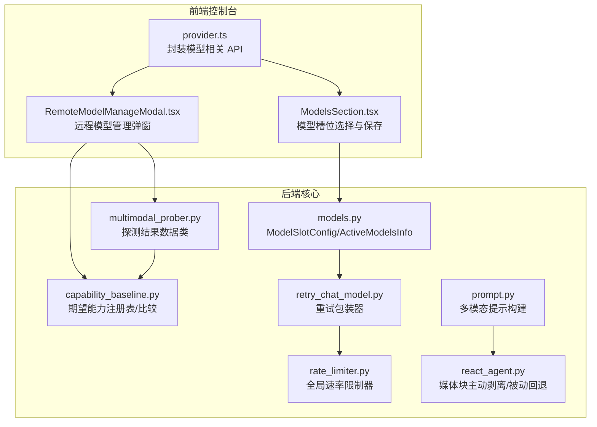
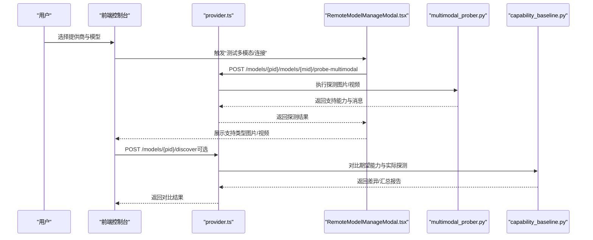
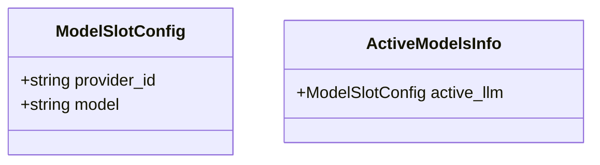
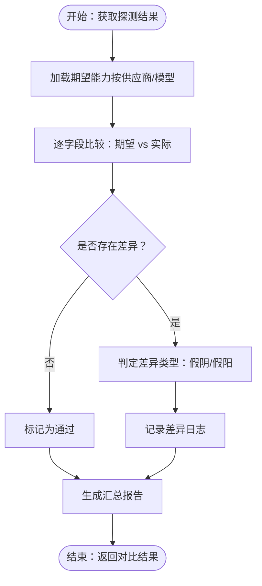
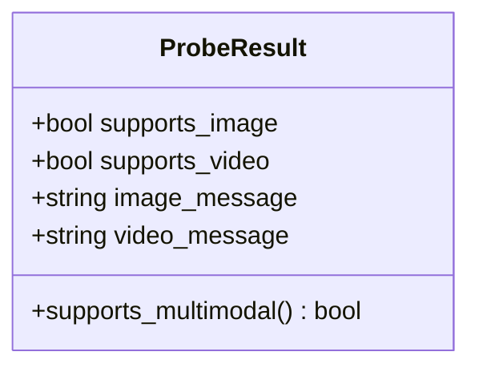
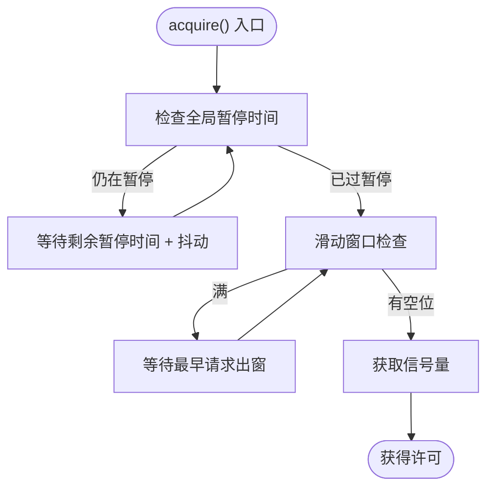
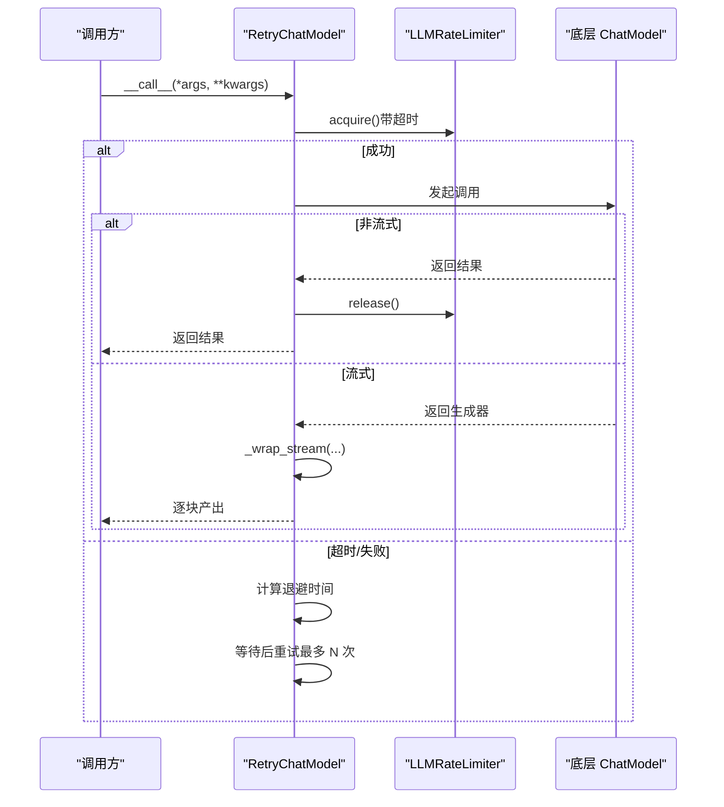
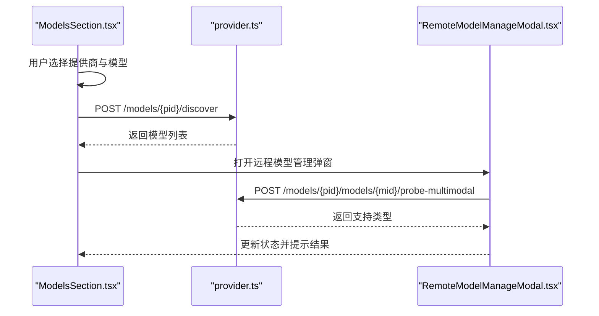
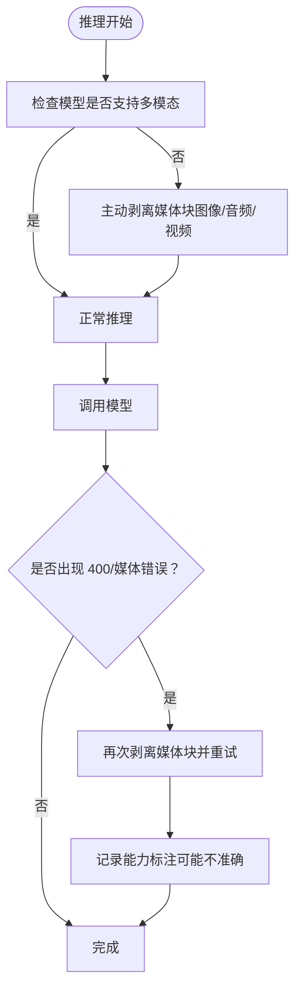
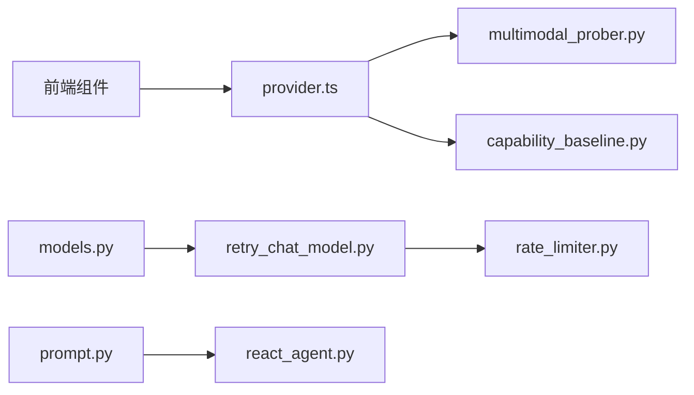

# 模型配置管理

<cite>
**本文引用的文件**
- [models.py](file://copaw/src/copaw/providers/models.py)
- [capability_baseline.py](file://copaw/src/copaw/providers/capability_baseline.py)
- [multimodal_prober.py](file://copaw/src/copaw/providers/multimodal_prober.py)
- [rate_limiter.py](file://copaw/src/copaw/providers/rate_limiter.py)
- [retry_chat_model.py](file://copaw/src/copaw/providers/retry_chat_model.py)
- [prompt.py](file://copaw/src/copaw/agents/prompt.py)
- [react_agent.py](file://copaw/src/copaw/agents/react_agent.py)
- [provider.ts](file://copaw/console/src/api/modules/provider.ts)
- [RemoteModelManageModal.tsx](file://copaw/console/src/pages/Settings/Models/components/modals/RemoteModelManageModal.tsx)
- [ModelsSection.tsx](file://copaw/console/src/pages/Settings/Models/components/sections/ModelsSection.tsx)
</cite>

## 目录
1. [简介](#简介)
2. [项目结构](#项目结构)
3. [核心组件](#核心组件)
4. [架构总览](#架构总览)
5. [详细组件分析](#详细组件分析)
6. [依赖关系分析](#依赖关系分析)
7. [性能考量](#性能考量)
8. [故障排查指南](#故障排查指南)
9. [结论](#结论)
10. [附录](#附录)

## 简介
本技术文档围绕模型配置管理系统展开，重点涵盖以下方面：
- ModelSlotConfig 数据结构与配置管理机制
- 模型能力基线（capability baseline）的评估算法
- 多模态探测器的实现原理与自动化流程
- 速率限制器的架构设计（令牌桶思想、并发控制、请求排队）
- 重试聊天模型的容错机制（指数退避、超时处理、错误分类）
- 模型配置的序列化与反序列化、配置验证与默认值设置
- 最佳实践（性能优化、成本控制、可靠性保障）

## 项目结构
本系统由后端 Python 包 copaw 提供核心能力，前端 React 控制台提供可视化配置界面。核心模块分布如下：
- 配置与数据模型：copaw/providers/models.py
- 能力基线与比较：copaw/providers/capability_baseline.py
- 多模态探测：copaw/providers/multimodal_prober.py
- 速率限制：copaw/src/copaw/providers/rate_limiter.py
- 重试包装器：copaw/src/copaw/providers/retry_chat_model.py
- 前端 API 封装与页面组件：copaw/console/src/api/modules/provider.ts、RemoteModelManageModal.tsx、ModelsSection.tsx
- 代理层提示词与媒体处理：copaw/src/copaw/agents/prompt.py、copaw/src/copaw/agents/react_agent.py

**图表来源**
- [provider.ts:101-117](file://copaw/console/src/api/modules/provider.ts#L101-L117)
- [RemoteModelManageModal.tsx:105-154](file://copaw/console/src/pages/Settings/Models/components/modals/RemoteModelManageModal.tsx#L105-L154)
- [ModelsSection.tsx:47-134](file://copaw/console/src/pages/Settings/Models/components/sections/ModelsSection.tsx#L47-L134)
- [models.py:9-16](file://copaw/src/copaw/providers/models.py#L9-L16)
- [capability_baseline.py:55-90](file://copaw/src/copaw/providers/capability_baseline.py#L55-L90)
- [multimodal_prober.py:75-87](file://copaw/src/copaw/providers/multimodal_prober.py#L75-L87)
- [rate_limiter.py:30-70](file://copaw/src/copaw/providers/rate_limiter.py#L30-L70)
- [retry_chat_model.py:201-231](file://copaw/src/copaw/providers/retry_chat_model.py#L201-L231)
- [prompt.py:359-387](file://copaw/src/copaw/agents/prompt.py#L359-L387)
- [react_agent.py:650-717](file://copaw/src/copaw/agents/react_agent.py#L650-L717)

**章节来源**
- [models.py:9-16](file://copaw/src/copaw/providers/models.py#L9-L16)
- [provider.ts:101-117](file://copaw/console/src/api/modules/provider.ts#L101-L117)
- [RemoteModelManageModal.tsx:105-154](file://copaw/console/src/pages/Settings/Models/components/modals/RemoteModelManageModal.tsx#L105-L154)
- [ModelsSection.tsx:47-134](file://copaw/console/src/pages/Settings/Models/components/sections/ModelsSection.tsx#L47-L134)

## 核心组件
- ModelSlotConfig：用于表示当前激活的模型槽位，包含 provider_id 与 model 字段。
- ActiveModelsInfo：封装当前工作空间/全局的活跃 LLM 配置。
- ExpectedCapabilityRegistry：内置多供应商、多模型的期望多模态能力清单，用于探测对比。
- ProbeResult：多模态探测结果，包含是否支持图片/视频及附加消息。
- LLMRateLimiter：全局速率限制器，基于滑动窗口与信号量实现并发与 QPM 控制。
- RetryChatModel：对 ChatModelBase 的透明重试包装，支持指数退避与流式重试。

**章节来源**
- [models.py:9-16](file://copaw/src/copaw/providers/models.py#L9-L16)
- [capability_baseline.py:55-90](file://copaw/src/copaw/providers/capability_baseline.py#L55-L90)
- [multimodal_prober.py:75-87](file://copaw/src/copaw/providers/multimodal_prober.py#L75-L87)
- [rate_limiter.py:30-70](file://copaw/src/copaw/providers/rate_limiter.py#L30-L70)
- [retry_chat_model.py:201-231](file://copaw/src/copaw/providers/retry_chat_model.py#L201-L231)

## 架构总览
下图展示从前端到后端的关键交互路径：用户在控制台选择模型并触发探测/连接测试，后端通过 Provider 与探测器进行能力评估，并将结果反馈给前端；同时，所有 LLM 调用通过 RetryChatModel 与 LLMRateLimiter 进行统一的重试与限流控制。

**图表来源**
- [provider.ts:101-117](file://copaw/console/src/api/modules/provider.ts#L101-L117)
- [RemoteModelManageModal.tsx:105-154](file://copaw/console/src/pages/Settings/Models/components/modals/RemoteModelManageModal.tsx#L105-L154)
- [multimodal_prober.py:75-87](file://copaw/src/copaw/providers/multimodal_prober.py#L75-L87)
- [capability_baseline.py:500-575](file://copaw/src/copaw/providers/capability_baseline.py#L500-L575)

## 详细组件分析

### ModelSlotConfig 数据结构与配置管理
- 数据结构
  - ModelSlotConfig：包含 provider_id 与 model 两个字段，默认值为空字符串。
  - ActiveModelsInfo：包含 active_llm 字段，类型为 ModelSlotConfig 或 None，用于表示当前激活的模型槽位。
- 配置管理机制
  - 前端 ModelsSection.tsx 中根据 provider 的可用模型动态渲染下拉选项，并在保存时构造请求体（包含 provider_id、model、scope）提交至后端。
  - RemoteModelManageModal.tsx 提供“测试多模态/连接”的快捷入口，测试成功后刷新状态。
- 序列化与反序列化
  - 使用 Pydantic BaseModel，具备自动校验与默认值设置能力；前端通过 API 请求体传递 JSON，后端按模型定义解析。
- 配置验证与默认值
  - 默认值确保字段非空；前端在保存前进行必填校验（provider_id 与 model 均存在）。

**图表来源**
- [models.py:9-16](file://copaw/src/copaw/providers/models.py#L9-L16)
- [ModelsSection.tsx:89-111](file://copaw/console/src/pages/Settings/Models/components/sections/ModelsSection.tsx#L89-L111)
- [RemoteModelManageModal.tsx:105-125](file://copaw/console/src/pages/Settings/Models/components/modals/RemoteModelManageModal.tsx#L105-L125)

**章节来源**
- [models.py:9-16](file://copaw/src/copaw/providers/models.py#L9-L16)
- [ModelsSection.tsx:89-111](file://copaw/console/src/pages/Settings/Models/components/sections/ModelsSection.tsx#L89-L111)
- [RemoteModelManageModal.tsx:105-125](file://copaw/console/src/pages/Settings/Models/components/modals/RemoteModelManageModal.tsx#L105-L125)

### 模型能力基线与比较算法
- 期望能力注册表
  - ExpectedCapabilityRegistry 内置 16 类供应商的多模态期望能力（图片/视频支持），并记录来源文档与备注。
  - 支持按供应商查询全部期望能力，便于批量探测与对比。
- 探测结果比较
  - compare_probe_result：逐字段（image/video）比较期望与实际，生成差异日志（false_negative/false_positive）。
  - generate_summary：汇总 passed/discrepancies/failures，并仅在“discrepancy”项收集差异详情。
- 自动化流程
  - 前端 RemoteModelManageModal.tsx 调用 /probe-multimodal 获取支持类型，后端结合 ExpectedCapabilityRegistry 生成对比报告，最终返回给前端展示。

**图表来源**
- [capability_baseline.py:500-575](file://copaw/src/copaw/providers/capability_baseline.py#L500-L575)
- [capability_baseline.py:55-90](file://copaw/src/copaw/providers/capability_baseline.py#L55-L90)
- [RemoteModelManageModal.tsx:127-154](file://copaw/console/src/pages/Settings/Models/components/modals/RemoteModelManageModal.tsx#L127-L154)

**章节来源**
- [capability_baseline.py:55-90](file://copaw/src/copaw/providers/capability_baseline.py#L55-L90)
- [capability_baseline.py:500-575](file://copaw/src/copaw/providers/capability_baseline.py#L500-L575)
- [RemoteModelManageModal.tsx:127-154](file://copaw/console/src/pages/Settings/Models/components/modals/RemoteModelManageModal.tsx#L127-L154)

### 多模态探测器实现原理
- 探测常量
  - 使用最小化探针图片（32x32 PNG）与短视频（H.264 MP4）以避免部分供应商对小尺寸媒体的拒绝。
  - 支持外部视频 URL 探测（如 Gemini file_data）。
- 探测结果数据类
  - ProbeResult：包含 supports_image/supports_video 及附加消息；提供 supports_multimodal 属性。
- 错误关键词识别
  - _is_media_keyword_error：通过异常消息中的关键词判断是否为媒体相关错误，辅助回退策略。

**图表来源**
- [multimodal_prober.py:75-87](file://copaw/src/copaw/providers/multimodal_prober.py#L75-L87)

**章节来源**
- [multimodal_prober.py:13-72](file://copaw/src/copaw/providers/multimodal_prober.py#L13-L72)
- [multimodal_prober.py:75-102](file://copaw/src/copaw/providers/multimodal_prober.py#L75-L102)

### 速率限制器架构设计
- 设计要点
  - 滑动窗口 QPM：维护最近 60 秒的请求时间戳，超出容量则等待最早时间点之后的时间。
  - 并发控制：使用 asyncio.Semaphore 控制最大并发数。
  - 全局暂停：收到 429 时设置 pause_until，所有 acquire() 在暂停期结束后再随机抖动唤醒，避免“惊群效应”。
  - 统计与可观测：提供 stats() 输出当前并发、QPM、暂停剩余等指标。
- 执行顺序
  - 429 冷却 → QPM 窗口空位 → 信号量空位
- 单例初始化
  - get_rate_limiter：首次调用时根据配置或环境变量初始化全局实例，后续共享同一实例。

**图表来源**
- [rate_limiter.py:70-151](file://copaw/src/copaw/providers/rate_limiter.py#L70-L151)

**章节来源**
- [rate_limiter.py:30-70](file://copaw/src/copaw/providers/rate_limiter.py#L30-L70)
- [rate_limiter.py:211-279](file://copaw/src/copaw/providers/rate_limiter.py#L211-L279)

### 重试聊天模型容错机制
- 指数退避策略
  - _compute_backoff：基于 base 与 cap 计算第 n 次尝试的等待时间，上限受 cap 限制。
- 超时处理
  - acquire() 使用 asyncio.wait_for，在超过 acquire_timeout 后抛出超时错误，避免无限阻塞。
- 错误分类
  - _is_retryable：识别 OpenAI/Anthropic 的速率限制/超时/连接错误，以及常见 HTTP 5xx/429。
  - _is_rate_limit：专门识别 429。
  - _extract_retry_after：从异常头中提取 Retry-After 时间。
- 流式响应处理
  - _consume_stream_with_slot：一旦开始产生首个分片即释放信号量，避免长时间占用导致饥饿；若流中途失败则整体重试。
- 并发与信号量所有权
  - 非流式：始终在 finally 中释放；流式：将所有权转移给消费协程，避免重复释放。

**图表来源**
- [retry_chat_model.py:266-347](file://copaw/src/copaw/providers/retry_chat_model.py#L266-L347)
- [retry_chat_model.py:350-466](file://copaw/src/copaw/providers/retry_chat_model.py#L350-L466)
- [rate_limiter.py:70-111](file://copaw/src/copaw/providers/rate_limiter.py#L70-L111)

**章节来源**
- [retry_chat_model.py:193-231](file://copaw/src/copaw/providers/retry_chat_model.py#L193-L231)
- [retry_chat_model.py:266-347](file://copaw/src/copaw/providers/retry_chat_model.py#L266-L347)
- [retry_chat_model.py:350-466](file://copaw/src/copaw/providers/retry_chat_model.py#L350-L466)

### 前端模型配置与探测交互
- 选择与保存
  - ModelsSection.tsx：根据 provider 的 models/extra_models 渲染下拉框，保存时构造请求体并调用后端接口。
- 探测与测试
  - RemoteModelManageModal.tsx：点击“测试多模态”调用 /probe-multimodal，根据返回支持类型提示；点击“测试连接”调用 /discover。
- API 封装
  - provider.ts：封装 /models/:providerId/discover 与 /probe-multimodal 接口，供前端组件调用。

**图表来源**
- [ModelsSection.tsx:89-111](file://copaw/console/src/pages/Settings/Models/components/sections/ModelsSection.tsx#L89-L111)
- [provider.ts:101-117](file://copaw/console/src/api/modules/provider.ts#L101-L117)
- [RemoteModelManageModal.tsx:105-154](file://copaw/console/src/pages/Settings/Models/components/modals/RemoteModelManageModal.tsx#L105-L154)

**章节来源**
- [ModelsSection.tsx:47-134](file://copaw/console/src/pages/Settings/Models/components/sections/ModelsSection.tsx#L47-L134)
- [provider.ts:101-117](file://copaw/console/src/api/modules/provider.ts#L101-L117)
- [RemoteModelManageModal.tsx:105-154](file://copaw/console/src/pages/Settings/Models/components/modals/RemoteModelManageModal.tsx#L105-L154)

### 代理层媒体处理与提示词集成
- 多模态提示构建
  - get_active_model_supports_multimodal：查询当前活跃模型是否支持多模态。
  - build_multimodal_hint/format_multimodal_hint：根据模型能力生成系统提示片段，避免误导用户。
- 主动剥离媒体块
  - 当模型不支持多模态时，ReactAgent 在推理前主动从记忆中剥离媒体块，减少无效调用与错误。
- 被动回退
  - 若模型仍因媒体报错，则剥离剩余媒体块并重试，同时记录可能的能力标注不准确警告。

**图表来源**
- [prompt.py:359-387](file://copaw/src/copaw/agents/prompt.py#L359-L387)
- [react_agent.py:650-717](file://copaw/src/copaw/agents/react_agent.py#L650-L717)

**章节来源**
- [prompt.py:359-387](file://copaw/src/copaw/agents/prompt.py#L359-L387)
- [react_agent.py:650-717](file://copaw/src/copaw/agents/react_agent.py#L650-L717)

## 依赖关系分析
- 前端依赖后端 API，后端依赖探测器与能力基线模块。
- RetryChatModel 依赖 LLMRateLimiter，二者共同保障调用稳定性与资源控制。
- 代理层通过提示词与媒体剥离逻辑，与探测结果形成闭环：探测决定提示策略，媒体剥离减少错误。

**图表来源**
- [provider.ts:101-117](file://copaw/console/src/api/modules/provider.ts#L101-L117)
- [multimodal_prober.py:75-87](file://copaw/src/copaw/providers/multimodal_prober.py#L75-L87)
- [capability_baseline.py:500-575](file://copaw/src/copaw/providers/capability_baseline.py#L500-L575)
- [retry_chat_model.py:201-231](file://copaw/src/copaw/providers/retry_chat_model.py#L201-L231)
- [rate_limiter.py:30-70](file://copaw/src/copaw/providers/rate_limiter.py#L30-L70)
- [prompt.py:359-387](file://copaw/src/copaw/agents/prompt.py#L359-L387)
- [react_agent.py:650-717](file://copaw/src/copaw/agents/react_agent.py#L650-L717)
- [models.py:9-16](file://copaw/src/copaw/providers/models.py#L9-L16)

**章节来源**
- [provider.ts:101-117](file://copaw/console/src/api/modules/provider.ts#L101-L117)
- [retry_chat_model.py:201-231](file://copaw/src/copaw/providers/retry_chat_model.py#L201-L231)
- [rate_limiter.py:30-70](file://copaw/src/copaw/providers/rate_limiter.py#L30-L70)

## 性能考量
- 并发与吞吐
  - 合理设置 max_concurrent，避免上游限流触发“惊群效应”。结合 LLMRateLimiter 的全局暂停与抖动，降低集中重试概率。
- QPM 与滑动窗口
  - max_qpm 建议与上游配额保持一致或略低，预留 50ms 边界裕量，减少尾部延迟。
- 流式输出优化
  - 流式响应在首个分片到达后释放信号量，缩短队列占用时间，提升整体并发效率。
- 探测成本控制
  - 使用最小探针尺寸与短时长视频，兼顾覆盖率与成本；对本地模型采用动态发现，减少无效探测。
- 重试策略
  - backoff_base 与 backoff_cap 需平衡恢复速度与上游压力；max_retries 限制总重试次数，避免雪崩。

## 故障排查指南
- 429 与全局暂停
  - 现象：大量请求被延迟或失败。
  - 排查：查看 LLMRateLimiter.stats() 中 is_paused 与 pause_remaining_s；确认上游 Retry-After 是否正确透传。
- 超时等待
  - 现象：acquire() 抛出超时错误。
  - 排查：检查 acquire_timeout 设置、max_concurrent 是否过小、QPM 窗口是否长期饱和。
- 媒体相关错误
  - 现象：模型拒绝图片/视频输入。
  - 排查：确认探测结果与期望能力是否一致；若模型标注为多模态但仍报错，需修正能力标注或调整提示词。
- 重试无效
  - 现象：多次重试后仍失败。
  - 排查：确认 _is_retryable 判定是否包含该异常类型；检查 backoff 参数与 max_retries 设置。

**章节来源**
- [rate_limiter.py:152-196](file://copaw/src/copaw/providers/rate_limiter.py#L152-L196)
- [retry_chat_model.py:121-158](file://copaw/src/copaw/providers/retry_chat_model.py#L121-L158)
- [react_agent.py:691-717](file://copaw/src/copaw/agents/react_agent.py#L691-L717)

## 结论
本系统通过清晰的数据模型、完善的探测与基线对比、稳健的速率限制与重试机制，以及前后端协同的可视化配置界面，实现了对多供应商、多模型的统一管理与可靠运行。建议在生产环境中结合上游配额与 SLA，合理配置并发与 QPM，并持续监控探测与重试统计，以实现性能、成本与可靠性的最佳平衡。

## 附录
- 关键配置项（节选）
  - LLM_MAX_CONCURRENT：最大并发数
  - LLM_MAX_QPM：每分钟查询上限
  - LLM_RATE_LIMIT_PAUSE：429 默认暂停秒数
  - LLM_RATE_LIMIT_JITTER：暂停抖动范围
  - LLM_ACQUIRE_TIMEOUT：获取执行槽位超时
  - LLM_BACKOFF_BASE/LLM_BACKOFF_CAP：指数退避基础与上限
  - LLM_MAX_RETRIES：最大重试次数