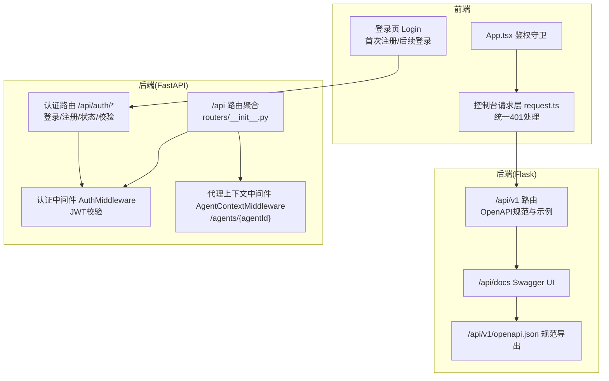
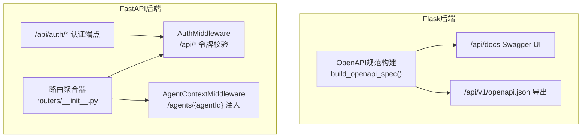
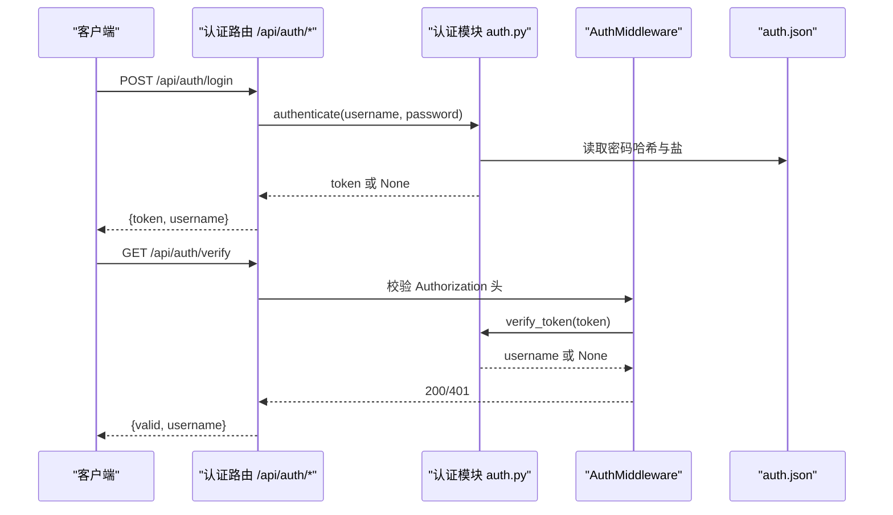
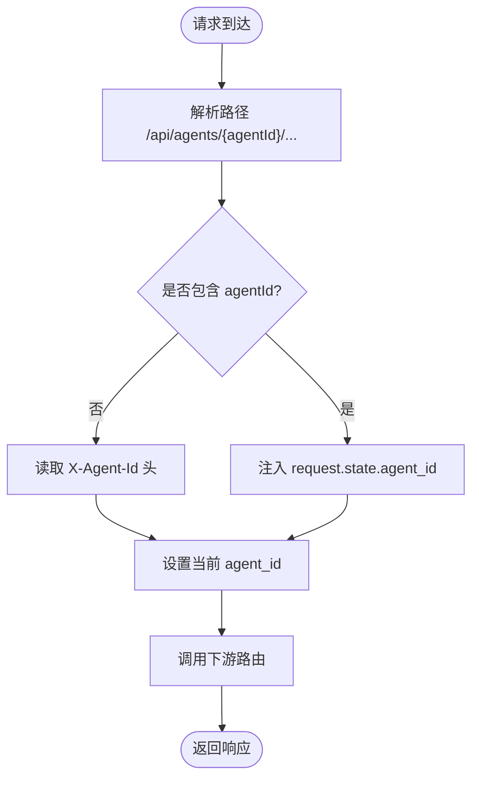
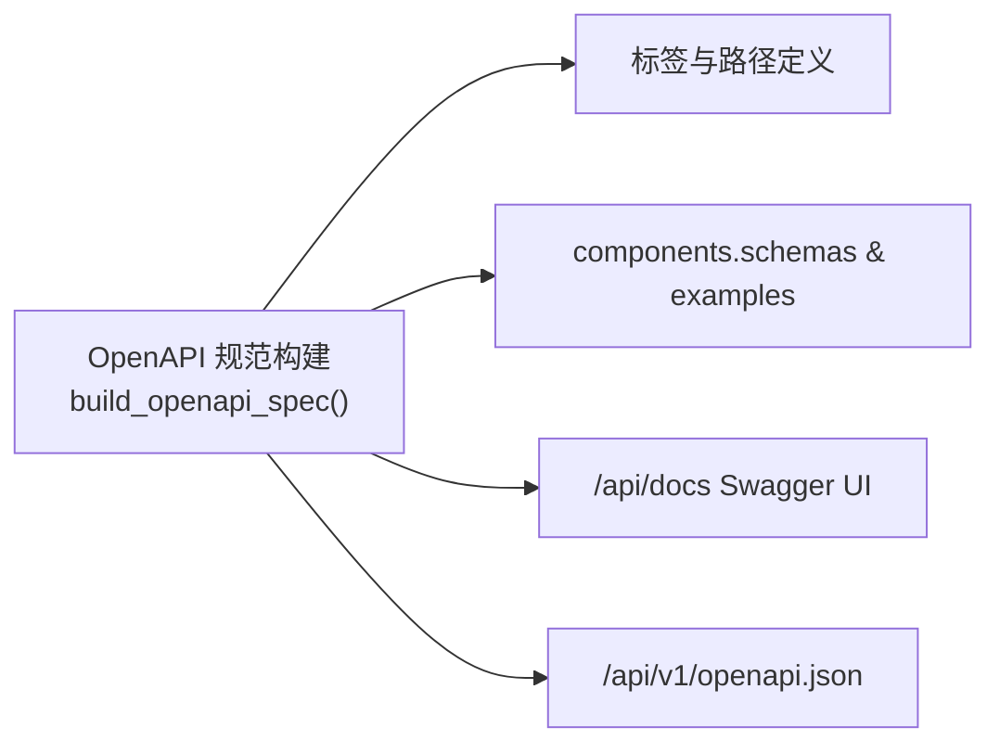
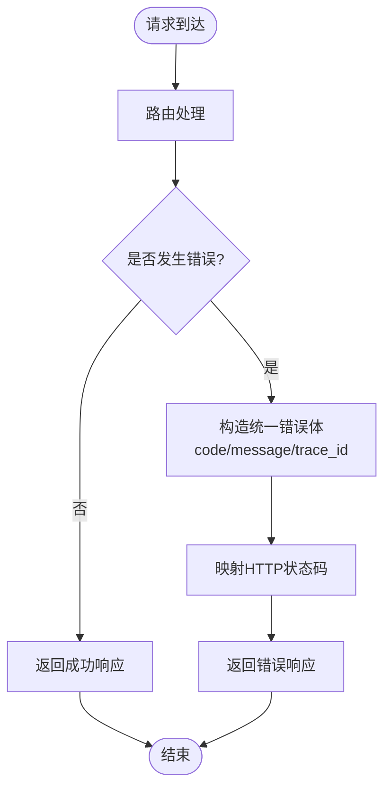
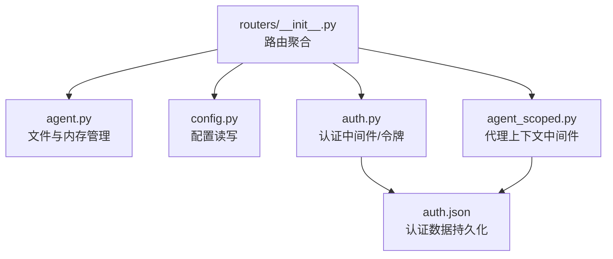

# API设计

<cite>
**本文引用的文件列表**
- [openapi_spec.py](file://main-project/backend/app/openapi_spec.py)
- [docs_bp.py](file://main-project/backend/app/blueprints/docs_bp.py)
- [errors.py](file://main-project/backend/app/errors.py)
- [api-design.md](file://specs/workshop/module-03-knowledge-copaw/docs/standards/api-design.md)
- [kb-qa-contract.yaml](file://specs/workshop/module-03-knowledge-copaw/openapi/kb-qa-contract.yaml)
- [auth.py](file://copaw/src/copaw/app/auth.py)
- [auth.py](file://copaw/src/copaw/app/routers/auth.py)
- [__init__.py](file://copaw/src/copaw/app/routers/__init__.py)
- [_app.py](file://copaw/src/copaw/app/_app.py)
- [agent_scoped.py](file://copaw/src/copaw/app/routers/agent_scoped.py)
- [agent.py](file://copaw/src/copaw/app/routers/agent.py)
- [REST API.md](file://specs/copaw-repowiki/content/API参考/REST API/REST API.md)
- [认证API.md](file://specs/copaw-repowiki/content/API参考/REST API/认证API.md)
</cite>

## 目录
1. [简介](#简介)
2. [项目结构](#项目结构)
3. [核心组件](#核心组件)
4. [架构总览](#架构总览)
5. [详细组件分析](#详细组件分析)
6. [依赖关系分析](#依赖关系分析)
7. [性能与安全特性](#性能与安全特性)
8. [故障排查指南](#故障排查指南)
9. [结论](#结论)
10. [附录：API参考与示例](#附录api参考与示例)

## 简介
本文件为IRA与CoPaw项目的API设计权威规范，覆盖RESTful API设计原则、命名规范、数据格式、认证授权、错误处理、OpenAPI规范、版本控制与向后兼容性、以及最佳实践与使用示例。内容来源于后端Flask与FastAPI实现、OpenAPI规范文档与项目内API参考文档，确保前后端一致性与可维护性。

## 项目结构
- 后端API分为两套实现：
  - Flask后端（IRA Workshop演示）：提供OpenAPI规范与Swagger UI，路径与响应示例完备。
  - FastAPI后端（CoPaw）：提供认证、代理、多代理路由、OpenAPI集成与中间件。
- 前端控制台通过统一请求层与后端交互，认证中间件与前端401处理形成闭环。
- OpenAPI规范以Python构建（Flask）与YAML契约（CoPaw知识库问答）两种形式存在，分别服务于不同模块。

图表来源
- [openapi_spec.py:6-47](file://main-project/backend/app/openapi_spec.py#L6-L47)
- [docs_bp.py:38-45](file://main-project/backend/app/blueprints/docs_bp.py#L38-L45)
- [__init__.py:25-59](file://copaw/src/copaw/app/routers/__init__.py#L25-L59)
- [_app.py:20-22](file://copaw/src/copaw/app/_app.py#L20-L22)
- [agent_scoped.py:15-51](file://copaw/src/copaw/app/routers/agent_scoped.py#L15-L51)
- [auth.py:136-159](file://copaw/src/copaw/app/auth.py#L136-L159)

章节来源
- [openapi_spec.py:6-47](file://main-project/backend/app/openapi_spec.py#L6-L47)
- [docs_bp.py:38-45](file://main-project/backend/app/blueprints/docs_bp.py#L38-L45)
- [__init__.py:25-59](file://copaw/src/copaw/app/routers/__init__.py#L25-L59)
- [_app.py:20-22](file://copaw/src/copaw/app/_app.py#L20-L22)
- [agent_scoped.py:15-51](file://copaw/src/copaw/app/routers/agent_scoped.py#L15-L51)
- [auth.py:136-159](file://copaw/src/copaw/app/auth.py#L136-L159)

## 核心组件
- RESTful设计原则
  - 资源导向：URL使用名词与复数形式，层级清晰。
  - HTTP方法语义：GET/POST/PUT/PATCH/DELETE幂等性与用途明确。
  - 版本控制：通过URL路径版本化，禁止使用Header或Query Parameter。
- 数据格式规范
  - 字段命名：snake_case；枚举值：UPPER_CASE；布尔值：true/false。
  - 时间格式：ISO 8601（含时区）。
  - 空值处理：缺失字段不包含；null显式；空数组显示为[]。
  - 分页：items + pagination对象。
- 错误处理
  - 统一错误体：包含人类可读描述、机器可读code与trace_id。
  - HTTP状态码映射：400/401/403/404/409/413/415/422/500/502/503。
  - 业务拒答：无证据等业务场景仍返回200，evidence_refs为空数组。
- OpenAPI规范
  - 每个接口提供summary/description与示例。
  - 标注必填字段与所有可能响应码。
  - 支持Swagger UI在线浏览与openapi.json导出。
- 认证与授权
  - 单用户设计，默认关闭，通过环境变量启用。
  - JWT令牌（HMAC-SHA256），7天有效期，支持校验与刷新。
  - 受保护路由仅限/api/*，中间件统一拦截。
- 版本控制与向后兼容
  - URL路径版本化；破坏性变更升级主版本或新增/v2。
  - 新增可选字段不视为破坏性变更；记录变更到Changelog。

章节来源
- [api-design.md:9-28](file://specs/workshop/module-03-knowledge-copaw/docs/standards/api-design.md#L9-L28)
- [api-design.md:31-63](file://specs/workshop/module-03-knowledge-copaw/docs/standards/api-design.md#L31-L63)
- [api-design.md:66-141](file://specs/workshop/module-03-knowledge-copaw/docs/standards/api-design.md#L66-L141)
- [api-design.md:144-171](file://specs/workshop/module-03-knowledge-copaw/docs/standards/api-design.md#L144-L171)
- [api-design.md:175-192](file://specs/workshop/module-03-knowledge-copaw/docs/standards/api-design.md#L175-L192)
- [api-design.md:195-207](file://specs/workshop/module-03-knowledge-copaw/docs/standards/api-design.md#L195-L207)

## 架构总览
- Flask后端
  - 通过蓝图提供OpenAPI规范与Swagger UI，路径与示例覆盖主要业务域。
  - 规范中包含bearerAuth安全方案占位，演示服务不校验令牌，实际部署建议在网关或中间件统一校验。
- FastAPI后端
  - 路由聚合器include各子路由，支持代理上下文注入与多代理隔离。
  - 认证中间件拦截/api/*路径，校验Authorization头中的Bearer令牌。
  - 提供代理上下文中间件，支持从路径或X-Agent-Id头部提取agentId，实现多代理隔离。

图表来源
- [openapi_spec.py:6-47](file://main-project/backend/app/openapi_spec.py#L6-L47)
- [docs_bp.py:38-45](file://main-project/backend/app/blueprints/docs_bp.py#L38-L45)
- [__init__.py:25-59](file://copaw/src/copaw/app/routers/__init__.py#L25-L59)
- [_app.py:20-22](file://copaw/src/copaw/app/_app.py#L20-L22)
- [agent_scoped.py:15-51](file://copaw/src/copaw/app/routers/agent_scoped.py#L15-L51)
- [auth.py:136-159](file://copaw/src/copaw/app/auth.py#L136-L159)

章节来源
- [openapi_spec.py:6-47](file://main-project/backend/app/openapi_spec.py#L6-L47)
- [docs_bp.py:38-45](file://main-project/backend/app/blueprints/docs_bp.py#L38-L45)
- [__init__.py:25-59](file://copaw/src/copaw/app/routers/__init__.py#L25-L59)
- [_app.py:20-22](file://copaw/src/copaw/app/_app.py#L20-L22)
- [agent_scoped.py:15-51](file://copaw/src/copaw/app/routers/agent_scoped.py#L15-L51)
- [auth.py:136-159](file://copaw/src/copaw/app/auth.py#L136-L159)

## 详细组件分析

### 认证API
- 端点与行为
  - POST /api/auth/login：用户名+密码登录，返回token与username；未启用时返回空token。
  - POST /api/auth/register：单次注册，仅允许一次；成功后返回token。
  - GET /api/auth/status：查询认证启用状态与是否存在用户。
  - GET /api/auth/verify：校验Bearer令牌有效性，返回valid与username。
  - POST /api/auth/update-profile：更新用户名或密码，需提供当前密码。
- 令牌与安全
  - 令牌结构：base64url(payload).signature，载荷包含sub/exp/iat。
  - 签名算法：HMAC-SHA256，密钥来自auth.json中的jwt_secret。
  - 过期策略：默认7天；校验流程包含签名对比与exp时间检查。
  - 文件安全：auth.json权限0o600，仅所有者可读写。
- 前端集成
  - 统一请求层对401进行处理（清理localStorage中的token并跳转登录）。
  - 登录页负责首次注册与后续登录；App.tsx作为鉴权守卫。

图表来源
- [auth.py:42-52](file://copaw/src/copaw/app/routers/auth.py#L42-L52)
- [auth.py:55-84](file://copaw/src/copaw/app/routers/auth.py#L55-L84)
- [auth.py:87-93](file://copaw/src/copaw/app/routers/auth.py#L87-L93)
- [auth.py:96-114](file://copaw/src/copaw/app/routers/auth.py#L96-L114)
- [auth.py:136-159](file://copaw/src/copaw/app/auth.py#L136-L159)
- [_app.py:20-22](file://copaw/src/copaw/app/_app.py#L20-L22)

章节来源
- [auth.py:42-114](file://copaw/src/copaw/app/routers/auth.py#L42-L114)
- [auth.py:114-159](file://copaw/src/copaw/app/auth.py#L114-L159)
- [_app.py:20-22](file://copaw/src/copaw/app/_app.py#L20-L22)

### 多代理上下文路由
- 功能
  - 通过AgentContextMiddleware从路径或X-Agent-Id头部提取agentId，注入request.state。
  - 将多个子路由挂载到/agents/{agentId}/下，实现代理隔离与动态路由。
- 使用场景
  - 多代理协作：每个代理拥有独立工作空间与配置。
  - 流式任务与查询：动态选择对应workspace runner。

图表来源
- [agent_scoped.py:15-51](file://copaw/src/copaw/app/routers/agent_scoped.py#L15-L51)

章节来源
- [agent_scoped.py:15-51](file://copaw/src/copaw/app/routers/agent_scoped.py#L15-L51)

### OpenAPI规范与Swagger UI
- Flask后端
  - build_openapi_spec()构建OpenAPI 3.0规范，包含info、servers、tags、paths与components。
  - security字段包含空对象（允许匿名）与bearerAuth（可选JWT）。
  - 路径覆盖system、dashboard、compliance、lineage、research、sentiment、notify、kb、reports等业务域。
  - components包含schemas与examples，路径中引用示例与Schema。
- Swagger UI
  - /api/docs提供在线文档浏览，/api/v1/openapi.json导出规范。
- CoPaw知识库契约
  - kb-qa-contract.yaml定义知识库与问答API契约，强调业务拒答仍返回200且使用统一错误体处理非业务错误。

图表来源
- [openapi_spec.py:6-47](file://main-project/backend/app/openapi_spec.py#L6-L47)
- [openapi_spec.py:258-729](file://main-project/backend/app/openapi_spec.py#L258-L729)
- [docs_bp.py:38-45](file://main-project/backend/app/blueprints/docs_bp.py#L38-L45)

章节来源
- [openapi_spec.py:6-47](file://main-project/backend/app/openapi_spec.py#L6-L47)
- [openapi_spec.py:258-729](file://main-project/backend/app/openapi_spec.py#L258-L729)
- [docs_bp.py:38-45](file://main-project/backend/app/blueprints/docs_bp.py#L38-L45)
- [kb-qa-contract.yaml:1-444](file://specs/workshop/module-03-knowledge-copaw/openapi/kb-qa-contract.yaml#L1-L444)

### 错误处理与异常管理
- Flask后端
  - error_response统一构造错误体，自动附加trace_id（若存在）。
- FastAPI后端
  - 路由层通过HTTPException抛出标准HTTP状态码与错误细节。
  - 认证中间件对401/403/404等场景进行拦截与处理。
- 统一错误体
  - 字段：error（人类可读）、code（机器可读）、trace_id（可选）。
  - 业务拒答：evidence_refs为空数组，HTTP 200，不使用错误体。

图表来源
- [errors.py:4-9](file://main-project/backend/app/errors.py#L4-L9)
- [auth.py:48-52](file://copaw/src/copaw/app/routers/auth.py#L48-L52)
- [auth.py:77-84](file://copaw/src/copaw/app/routers/auth.py#L77-L84)

章节来源
- [errors.py:4-9](file://main-project/backend/app/errors.py#L4-L9)
- [auth.py:48-84](file://copaw/src/copaw/app/routers/auth.py#L48-L84)

## 依赖关系分析
- 路由聚合
  - routers/__init__.py将agent、agents、config、local_models、providers、skills、skills_stream、workspace、envs、mcp、tools、crons、runner、console、token_usage、auth、messages、files、settings等路由聚合到统一APIRouter。
- 中间件依赖
  - AuthMiddleware依赖认证模块进行令牌校验。
  - AgentContextMiddleware依赖agent_context设置当前agent_id。
- 认证文件
  - auth.json位于SECRET_DIR，权限0o600，包含username、password_hash、password_salt、jwt_secret。

图表来源
- [__init__.py:25-59](file://copaw/src/copaw/app/routers/__init__.py#L25-L59)
- [agent.py:38-106](file://copaw/src/copaw/app/routers/agent.py#L38-L106)
- [auth.py:136-159](file://copaw/src/copaw/app/auth.py#L136-L159)
- [agent_scoped.py:15-51](file://copaw/src/copaw/app/routers/agent_scoped.py#L15-L51)

章节来源
- [__init__.py:25-59](file://copaw/src/copaw/app/routers/__init__.py#L25-L59)
- [agent.py:38-106](file://copaw/src/copaw/app/routers/agent.py#L38-L106)
- [auth.py:136-159](file://copaw/src/copaw/app/auth.py#L136-L159)
- [agent_scoped.py:15-51](file://copaw/src/copaw/app/routers/agent_scoped.py#L15-L51)

## 性能与安全特性
- 性能
  - 令牌校验为O(1)，仅涉及HMAC比较与JSON解析。
  - 密码哈希为标准SHA-256，避免额外依赖。
- 安全
  - 单用户设计，降低攻击面。
  - 密码存储为加盐SHA-256哈希，不存储明文。
  - 令牌7天过期，支持定期续期。
  - auth.json权限严格（0o600）。
  - 本地回环免认证，便于CLI使用。
  - CORS预检与WebSocket令牌传递有明确限制。
- 速率限制建议
  - 建议实现：100 requests/minute/IP，超限返回429 Too Many Requests。

章节来源
- [auth.py:81-96](file://copaw/src/copaw/app/auth.py#L81-L96)
- [auth.py:114-159](file://copaw/src/copaw/app/auth.py#L114-L159)
- [api-design.md:189-192](file://specs/workshop/module-03-knowledge-copaw/docs/standards/api-design.md#L189-L192)

## 故障排查指南
- 401 未认证
  - 前端：request.ts检测到401会自动清理localStorage中的token，并跳转至登录页。
  - 后端：中间件未提供有效Bearer令牌或令牌无效/过期。
- 403 禁止访问
  - 注册端点：认证未启用或已存在用户。
  - 登录端点：认证未启用。
- 400 参数错误
  - 注册：用户名或密码为空。
- 409 冲突
  - 注册失败（例如用户已存在）。
- 常见问题定位
  - 确认COPAW_AUTH_ENABLED已正确设置。
  - 检查auth.json权限与内容。
  - 确认Authorization头格式为Bearer <token>。
  - 检查本地回环地址是否被误拦截。

章节来源
- [auth.py:55-84](file://copaw/src/copaw/app/routers/auth.py#L55-L84)
- [auth.py:302-367](file://copaw/src/copaw/app/auth.py#L302-L367)

## 结论
本API设计规范整合了Flask与FastAPI两端实现，明确了RESTful设计原则、数据格式、认证授权、错误处理与OpenAPI规范。通过统一的令牌校验、代理上下文与路由聚合，实现了多代理隔离与可扩展的API体系。建议在生产环境中启用认证、完善速率限制与监控告警，并持续维护OpenAPI文档与版本演进策略。

## 附录：API参考与示例
- 端点清单与规范
  - POST /api/auth/login：请求体{username, password}，成功响应{token, username}，失败响应401（无效凭据）。
  - POST /api/auth/register：请求体{username, password}，成功响应{token, username}，失败响应400/403/409。
  - GET /api/auth/status：响应{enabled, has_users}。
  - GET /api/auth/verify：请求头Authorization: Bearer <token>，成功响应{valid:true, username}，失败响应401。
  - POST /api/auth/update-profile：请求体{current_password, new_username?, new_password?}，成功响应{token, username}，失败响应400/401/403。
- 令牌格式与过期策略
  - 格式：base64url(payload).signature。
  - 载荷字段：sub、exp、iat。
  - 签名算法：HMAC-SHA256。
  - 过期时间：默认7天。
  - 密钥来源：auth.json中的jwt_secret。
- 前端调用示例（概念性）
  - 登录：方法POST /api/auth/login，请求头Content-Type: application/json，请求体{username, password}，成功后将返回的token保存到localStorage。
  - 注册：方法POST /api/auth/register，请求头Content-Type: application/json，请求体{username, password}，成功后将返回的token保存到localStorage。
  - 校验：方法GET /api/auth/verify，请求头Authorization: Bearer <token>。

章节来源
- [auth.py:42-114](file://copaw/src/copaw/app/routers/auth.py#L42-L114)
- [auth.py:114-159](file://copaw/src/copaw/app/auth.py#L114-L159)
- [认证API.md:366-414](file://specs/copaw-repowiki/content/API参考/REST API/认证API.md#L366-L414)