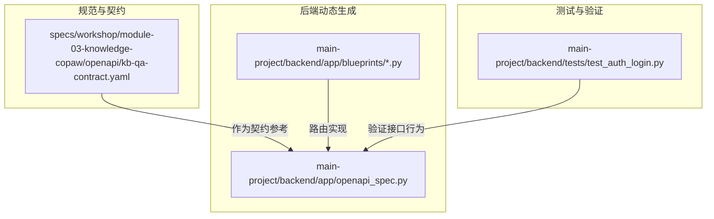
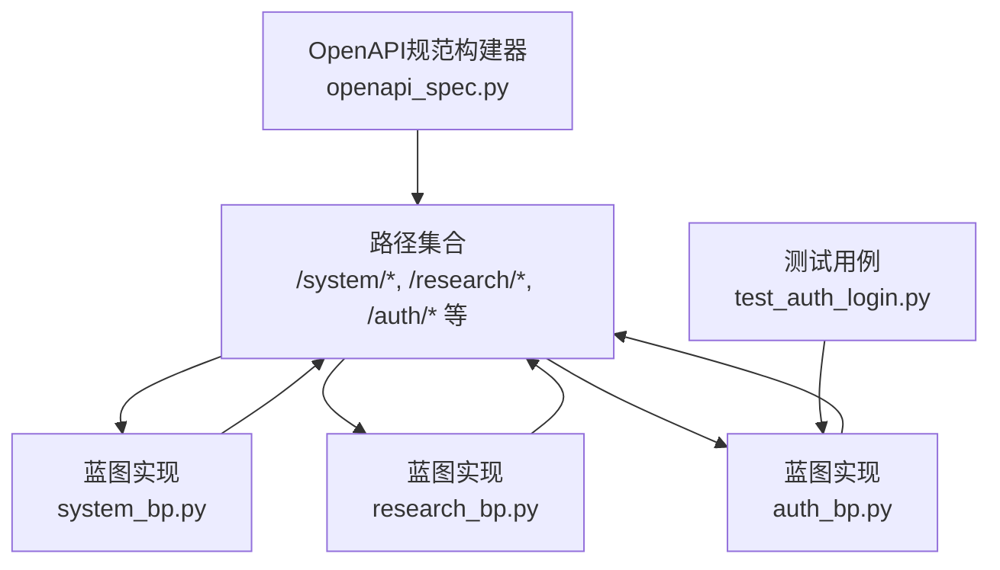
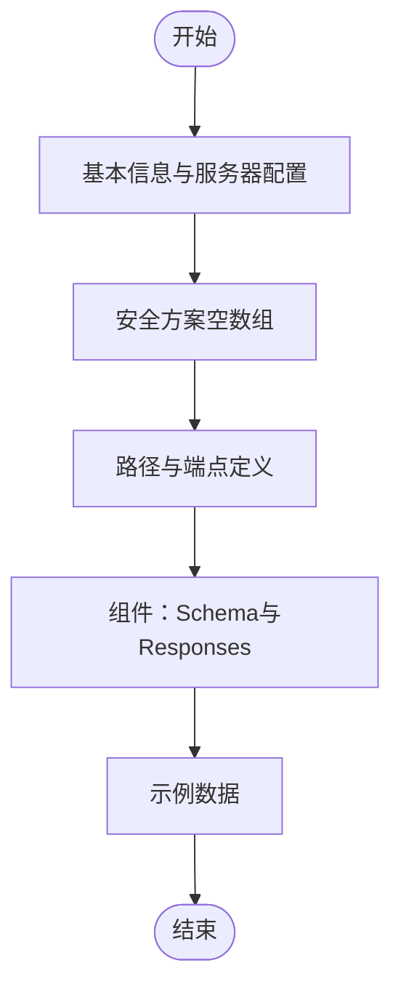
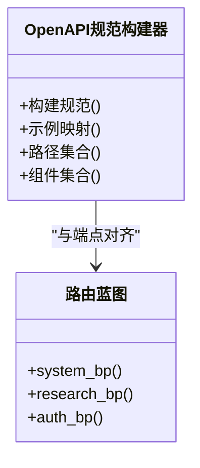
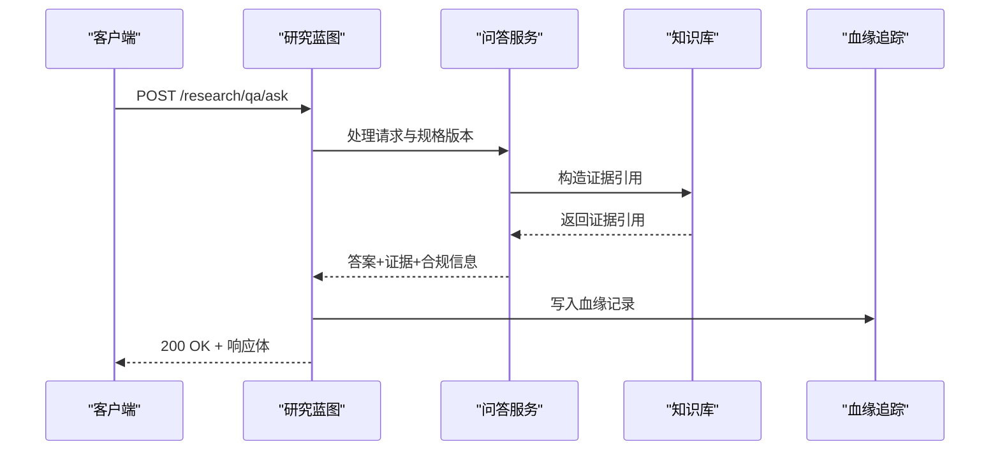
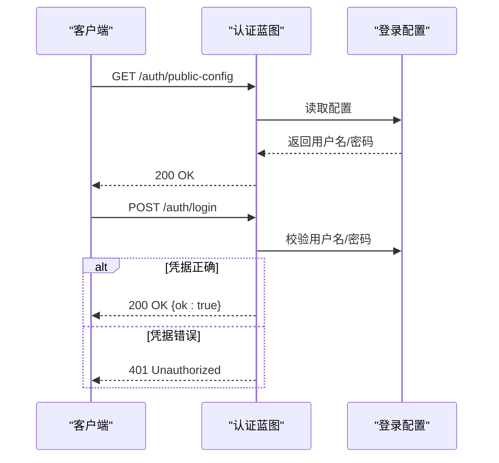
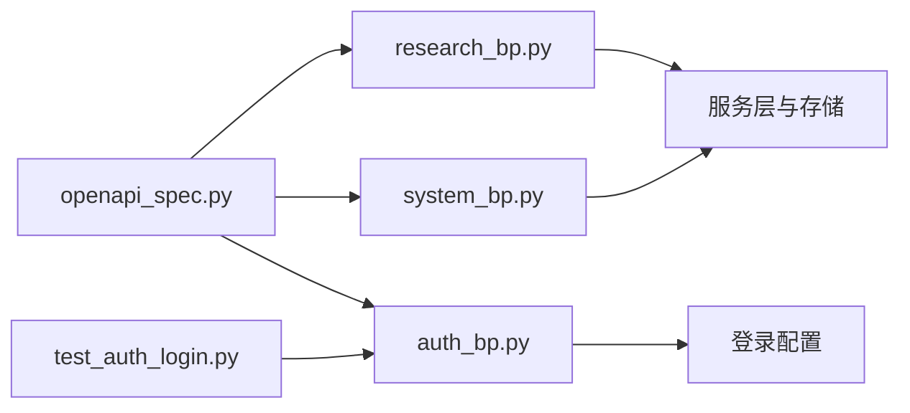

# OpenAPI规范

<cite>
**本文引用的文件**
- [kb-qa-contract.yaml](file://specs/workshop/module-03-knowledge-copaw/openapi/kb-qa-contract.yaml)
- [openapi_spec.py](file://main-project/backend/app/openapi_spec.py)
- [system_bp.py](file://main-project/backend/app/blueprints/system_bp.py)
- [research_bp.py](file://main-project/backend/app/blueprints/research_bp.py)
- [auth_bp.py](file://main-project/backend/app/blueprints/auth_bp.py)
- [test_auth_login.py](file://main-project/backend/tests/test_auth_login.py)
- [API参考.md](file://specs/copaw-repowiki/content/API参考/API参考.md)
</cite>

## 目录
1. [简介](#简介)
2. [项目结构](#项目结构)
3. [核心组件](#核心组件)
4. [架构总览](#架构总览)
5. [详细组件分析](#详细组件分析)
6. [依赖分析](#依赖分析)
7. [性能考虑](#性能考虑)
8. [故障排查指南](#故障排查指南)
9. [结论](#结论)
10. [附录](#附录)

## 简介
本文件为仓库中的OpenAPI规范文档，面向API设计与实现团队，提供统一的OpenAPI 3.0规范格式、端点描述规范、数据模型与JSON Schema使用标准、版本管理与变更跟踪机制、自动生成与维护流程，以及API测试与验证最佳实践。文档同时给出面向开发者的完整API文档编写指南与示例模板，确保前后端协作的一致性与可维护性。

## 项目结构
本仓库包含两套主要的OpenAPI相关资产：
- 规范化的OpenAPI片段与契约样例：位于模块03知识库与问答的OpenAPI目录，采用YAML格式，定义了清晰的路径、组件与示例。
- 动态生成的OpenAPI规范：位于主工程后端，通过Python函数构建完整的OpenAPI 3.0规范字典，包含路径、安全方案、组件与示例映射。

**图表来源**
- [kb-qa-contract.yaml:1-444](file://specs/workshop/module-03-knowledge-copaw/openapi/kb-qa-contract.yaml#L1-L444)
- [openapi_spec.py:1-729](file://main-project/backend/app/openapi_spec.py#L1-L729)
- [system_bp.py:1-94](file://main-project/backend/app/blueprints/system_bp.py#L1-L94)
- [research_bp.py:1-403](file://main-project/backend/app/blueprints/research_bp.py#L1-L403)
- [auth_bp.py:1-43](file://main-project/backend/app/blueprints/auth_bp.py#L1-L43)
- [test_auth_login.py:1-17](file://main-project/backend/tests/test_auth_login.py#L1-L17)

**章节来源**
- [kb-qa-contract.yaml:1-444](file://specs/workshop/module-03-knowledge-copaw/openapi/kb-qa-contract.yaml#L1-L444)
- [openapi_spec.py:1-729](file://main-project/backend/app/openapi_spec.py#L1-L729)

## 核心组件
- OpenAPI规范构建器：负责生成完整OpenAPI 3.0规范字典，包含基础信息、服务器、安全方案、标签、路径与组件。
- 路由蓝图：后端各功能域的蓝图（如system、research、auth等）提供具体端点实现，与OpenAPI规范保持一一对应。
- 测试用例：通过pytest测试验证端点行为，确保规范与实现一致。

关键要点：
- 规范构建器集中定义了安全方案（bearerAuth占位）、示例映射与路径集合，便于统一维护。
- 蓝图层实现具体业务逻辑，保证端点的请求参数、响应格式与错误处理符合规范。

**章节来源**
- [openapi_spec.py:6-47](file://main-project/backend/app/openapi_spec.py#L6-L47)
- [system_bp.py:21-94](file://main-project/backend/app/blueprints/system_bp.py#L21-L94)
- [research_bp.py:73-173](file://main-project/backend/app/blueprints/research_bp.py#L73-L173)
- [auth_bp.py:27-43](file://main-project/backend/app/blueprints/auth_bp.py#L27-L43)

## 架构总览
下图展示了OpenAPI规范与后端实现之间的关系：规范构建器提供统一的OpenAPI字典，蓝图路由实现具体端点，测试用例验证行为一致性。

**图表来源**
- [openapi_spec.py:258-729](file://main-project/backend/app/openapi_spec.py#L258-L729)
- [system_bp.py:21-94](file://main-project/backend/app/blueprints/system_bp.py#L21-L94)
- [research_bp.py:73-173](file://main-project/backend/app/blueprints/research_bp.py#L73-L173)
- [auth_bp.py:27-43](file://main-project/backend/app/blueprints/auth_bp.py#L27-L43)
- [test_auth_login.py:1-17](file://main-project/backend/tests/test_auth_login.py#L1-L17)

## 详细组件分析

### 组件A：知识库与问答API契约（kb-qa-contract.yaml）
该文件为OpenAPI 3.0片段，定义了知识库与问答系统的API契约，包含：
- 基本信息与服务器配置
- 安全方案（空数组，实现时按需追加）
- 路径与端点：文档列表、索引状态、上传材料、问答
- 组件：请求/响应Schema与统一错误体
- 示例：针对每个端点的示例数据

**图表来源**
- [kb-qa-contract.yaml:7-444](file://specs/workshop/module-03-knowledge-copaw/openapi/kb-qa-contract.yaml#L7-L444)

**章节来源**
- [kb-qa-contract.yaml:1-444](file://specs/workshop/module-03-knowledge-copaw/openapi/kb-qa-contract.yaml#L1-L444)

### 组件B：后端OpenAPI规范构建器（openapi_spec.py）
该模块通过函数式方式构建完整的OpenAPI 3.0规范，包含：
- 基本信息：标题、版本、描述
- 服务器：当前服务描述
- 安全方案：空对象与bearerAuth占位
- 标签：按功能域分组
- 路径：覆盖system、dashboard、compliance、lineage、research、sentiment、notify、kb、reports等
- 组件：securitySchemes、schemas、examples

**图表来源**
- [openapi_spec.py:6-47](file://main-project/backend/app/openapi_spec.py#L6-L47)
- [openapi_spec.py:258-729](file://main-project/backend/app/openapi_spec.py#L258-L729)

**章节来源**
- [openapi_spec.py:1-729](file://main-project/backend/app/openapi_spec.py#L1-L729)

### 组件C：系统与研究API端点（system_bp.py, research_bp.py）
- 系统端点：健康检查、设置与偏好、偏好更新
- 研究端点：问答、上传、个股分析、行情查询、多Agent运行与历史

**图表来源**
- [research_bp.py:73-173](file://main-project/backend/app/blueprints/research_bp.py#L73-L173)
- [system_bp.py:21-94](file://main-project/backend/app/blueprints/system_bp.py#L21-L94)

**章节来源**
- [system_bp.py:21-94](file://main-project/backend/app/blueprints/system_bp.py#L21-L94)
- [research_bp.py:73-173](file://main-project/backend/app/blueprints/research_bp.py#L73-L173)

### 组件D：认证API端点（auth_bp.py）
- 公开配置：返回默认用户名与密码
- 登录：校验凭据，返回结果

**图表来源**
- [auth_bp.py:27-43](file://main-project/backend/app/blueprints/auth_bp.py#L27-L43)

**章节来源**
- [auth_bp.py:1-43](file://main-project/backend/app/blueprints/auth_bp.py#L1-L43)

### 组件E：API参考与路由组织（API参考.md）
- 应用入口与统一路由挂载
- 路由组织：主路由聚合器、代理作用域路由工厂
- CLI HTTP客户端：自动添加/api前缀与默认超时

**章节来源**
- [API参考.md:55-95](file://specs/copaw-repowiki/content/API参考/API参考.md#L55-L95)

## 依赖分析
- OpenAPI规范构建器依赖蓝图路由实现，确保路径与组件与实际端点一致。
- 测试用例依赖认证端点，验证登录流程与公共配置。
- 蓝图路由依赖服务层与存储，实现业务逻辑与数据持久化。

**图表来源**
- [openapi_spec.py:258-729](file://main-project/backend/app/openapi_spec.py#L258-L729)
- [system_bp.py:21-94](file://main-project/backend/app/blueprints/system_bp.py#L21-L94)
- [research_bp.py:73-173](file://main-project/backend/app/blueprints/research_bp.py#L73-L173)
- [auth_bp.py:27-43](file://main-project/backend/app/blueprints/auth_bp.py#L27-L43)
- [test_auth_login.py:1-17](file://main-project/backend/tests/test_auth_login.py#L1-L17)

**章节来源**
- [openapi_spec.py:1-729](file://main-project/backend/app/openapi_spec.py#L1-L729)
- [system_bp.py:1-94](file://main-project/backend/app/blueprints/system_bp.py#L1-L94)
- [research_bp.py:1-403](file://main-project/backend/app/blueprints/research_bp.py#L1-L403)
- [auth_bp.py:1-43](file://main-project/backend/app/blueprints/auth_bp.py#L1-L43)
- [test_auth_login.py:1-17](file://main-project/backend/tests/test_auth_login.py#L1-L17)

## 性能考虑
- 规范构建器采用集中式组件与示例映射，减少重复定义，提升维护效率。
- 蓝图路由实现中避免不必要的外部调用，必要时使用本地Mock回退，保障可用性。
- 建议在高并发场景下启用缓存与连接池，优化上游服务调用性能。

## 故障排查指南
- 认证失败：检查登录凭据是否与公共配置一致，确认环境变量未覆盖导致的差异。
- 端点返回404：核对URL前缀与路由注册，确保蓝图已正确挂载。
- 规范与实现不一致：使用规范构建器生成的openapi.json进行对比，修正路径或组件定义。

**章节来源**
- [test_auth_login.py:1-17](file://main-project/backend/tests/test_auth_login.py#L1-L17)
- [auth_bp.py:27-43](file://main-project/backend/app/blueprints/auth_bp.py#L27-L43)

## 结论
本OpenAPI规范文档提供了从契约到实现的完整闭环：以kb-qa-contract.yaml为契约参考，以openapi_spec.py为动态生成规范，以蓝图路由实现端点，以测试用例验证行为。通过标准化的数据模型、统一的安全方案与示例映射，确保API文档的准确性与可维护性。

## 附录

### A. OpenAPI规范标准格式与结构
- 基本信息：标题、版本、描述、许可证
- 服务器配置：URL与描述，支持变量占位
- 安全定义：空对象表示匿名访问，bearerAuth为JWT占位
- 标签：按功能域分组，便于分类与导航
- 路径：operationId、summary、description、tags、parameters、requestBody、responses
- 组件：schemas、responses、securitySchemes、examples

**章节来源**
- [kb-qa-contract.yaml:7-444](file://specs/workshop/module-03-knowledge-copaw/openapi/kb-qa-contract.yaml#L7-L444)
- [openapi_spec.py:6-47](file://main-project/backend/app/openapi_spec.py#L6-L47)

### B. 端点描述规范
- 请求参数：明确参数位置（path/query/header/body）、类型、是否必填、示例
- 响应格式：统一的2xx/4xx/5xx响应结构，必要时引用统一错误体
- 示例数据：为每个端点提供典型示例，便于集成与调试

**章节来源**
- [kb-qa-contract.yaml:28-200](file://specs/workshop/module-03-knowledge-copaw/openapi/kb-qa-contract.yaml#L28-L200)
- [openapi_spec.py:258-729](file://main-project/backend/app/openapi_spec.py#L258-L729)

### C. 数据模型定义与JSON Schema使用标准
- 使用type、format、enum、nullable等关键字定义字段约束
- 通过$ref引用组件，避免重复定义
- 为复杂对象定义required字段，确保关键字段完整性

**章节来源**
- [kb-qa-contract.yaml:207-444](file://specs/workshop/module-03-knowledge-copaw/openapi/kb-qa-contract.yaml#L207-L444)

### D. API版本管理与变更跟踪机制
- 在请求头中传递规格版本（如X-Spec-Version），实现向后兼容与需求变更
- 在响应中返回有效版本，便于客户端适配
- 通过测试用例覆盖不同版本的行为差异

**章节来源**
- [research_bp.py:76-87](file://main-project/backend/app/blueprints/research_bp.py#L76-L87)
- [openapi_spec.py:406-430](file://main-project/backend/app/openapi_spec.py#L406-L430)

### E. OpenAPI文档的自动生成与维护流程
- 通过规范构建器集中维护OpenAPI字典，确保与实现同步
- 将生成的openapi.json暴露为只读端点，便于集成与预览
- 建议在CI中执行规范校验与示例一致性检查

**章节来源**
- [openapi_spec.py:6-47](file://main-project/backend/app/openapi_spec.py#L6-L47)
- [system_bp.py:68-81](file://main-project/backend/app/blueprints/system_bp.py#L68-L81)

### F. API测试与验证最佳实践
- 使用pytest编写端到端测试，覆盖成功与失败场景
- 验证认证端点的公共配置与登录流程
- 通过断言状态码与响应体字段，确保规范与实现一致

**章节来源**
- [test_auth_login.py:1-17](file://main-project/backend/tests/test_auth_login.py#L1-L17)

### G. 开发者API文档编写指南与示例模板
- 模板字段：基本信息、服务器、安全、标签、路径、组件、示例
- 示例模板：为每个端点提供请求与响应示例，标注典型与边界场景
- 变更模板：记录版本变更、影响分析与回滚策略

**章节来源**
- [kb-qa-contract.yaml:1-444](file://specs/workshop/module-03-knowledge-copaw/openapi/kb-qa-contract.yaml#L1-L444)
- [openapi_spec.py:50-179](file://main-project/backend/app/openapi_spec.py#L50-L179)