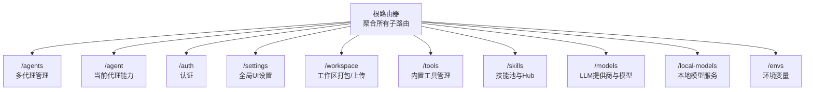
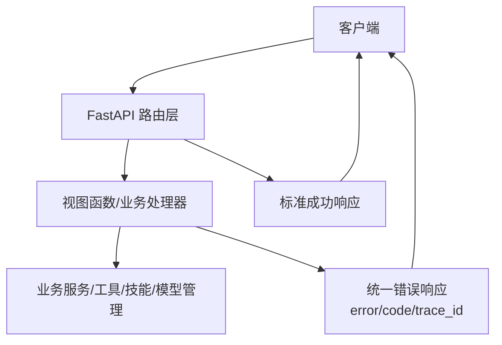
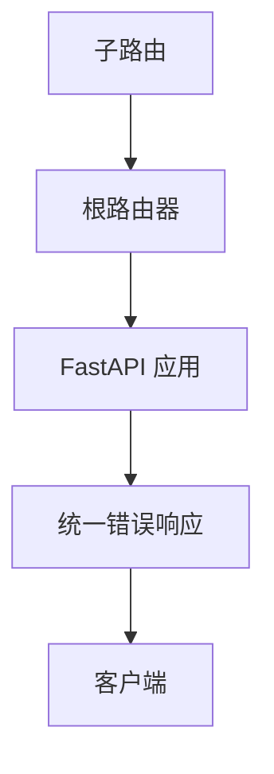

# RESTful API规范

<cite>
**本文引用的文件**
- [REST API.md](file://specs/copaw-repowiki/content/API参考/REST API/REST API.md)
- [api-design.md](file://specs/workshop/module-03-knowledge-copaw/docs/standards/api-design.md)
- [kb-qa-contract.yaml](file://specs/workshop/module-03-knowledge-copaw/openapi/kb-qa-contract.yaml)
- [errors.py](file://main-project/backend/app/errors.py)
- [__init__.py](file://copaw/src/copaw/app/routers/__init__.py)
- [agent.py](file://copaw/src/copaw/app/routers/agent.py)
- [agents.py](file://copaw/src/copaw/app/routers/agents.py)
- [auth.py](file://copaw/src/copaw/app/routers/auth.py)
- [settings.py](file://copaw/src/copaw/app/routers/settings.py)
- [workspace.py](file://copaw/src/copaw/app/routers/workspace.py)
- [tools.py](file://copaw/src/copaw/app/routers/tools.py)
- [skills.py](file://copaw/src/copaw/app/routers/skills.py)
- [providers.py](file://copaw/src/copaw/app/routers/providers.py)
- [local_models.py](file://copaw/src/copaw/app/routers/local_models.py)
- [envs.py](file://copaw/src/copaw/app/routers/envs.py)
</cite>

## 目录
1. [简介](#简介)
2. [项目结构](#项目结构)
3. [核心组件](#核心组件)
4. [架构总览](#架构总览)
5. [详细组件分析](#详细组件分析)
6. [依赖分析](#依赖分析)
7. [性能考量](#性能考量)
8. [故障排查指南](#故障排查指南)
9. [结论](#结论)
10. [附录](#附录)

## 简介
本文件为本仓库中RESTful API设计与使用的权威规范，覆盖HTTP方法使用、URL命名与资源层次、状态码与错误响应、请求参数传递方式、响应数据格式、版本控制策略与向后兼容保障，并提供端点清单与示例指引。内容以实际代码实现为依据，确保开发者能够准确理解并正确使用所有API接口。

## 项目结构
本项目采用FastAPI框架构建REST API，路由按功能域划分，统一挂载于根路由器下，形成清晰的资源层次与命名空间：

- 根路由聚合器负责include各子路由，形成统一的API前缀与标签体系
- 子路由按领域拆分：代理管理、认证、设置、工作区、工具、技能、模型与本地模型、环境变量等
- 多代理场景支持“按代理作用域”的路由包装，便于扩展

图表来源
- [__init__.py:25-45](file://copaw/src/copaw/app/routers/__init__.py#L25-L45)

章节来源
- [__init__.py:25-45](file://copaw/src/copaw/app/routers/__init__.py#L25-L45)

## 核心组件
- HTTP方法语义与幂等性
  - GET：获取资源（幂等）
  - POST：创建资源（非幂等）
  - PUT：全量更新（幂等）
  - PATCH：部分更新（非幂等）
  - DELETE：删除资源（幂等）

- URL命名与资源层次
  - 使用名词表示资源，避免动词
  - 复数形式表达集合
  - 清晰层级：/领域/资源/{id}/子资源
  - 示例：/agents、/agents/{agentId}/files、/skills/hub/search

- 请求参数传递方式
  - 查询参数：过滤、分页、排序、字段选择
  - 路径参数：定位具体资源
  - 请求体：JSON格式，遵循snake_case命名

- 响应数据格式
  - 成功响应：单资源对象、资源列表、操作结果对象
  - 列表响应：items + pagination（page、limit、total、total_pages）
  - 统一错误体：error、code、trace_id（trace_id可选）

- 状态码使用规范
  - 2xx：成功
    - 200：常规成功
    - 201：创建成功
  - 4xx：客户端错误
    - 400：请求参数错误
    - 401：未认证
    - 403：无权限
    - 404：资源不存在
    - 409：冲突（如重复上传）
    - 413：请求体过大
    - 415：不支持的媒体类型
    - 422：语义错误（参数合法但业务不允许）
    - 429：超出速率限制
  - 5xx：服务器错误
    - 500：内部服务器错误
    - 502：上游服务错误
    - 503：服务不可用

- 版本控制策略
  - 建议通过URL路径进行版本控制（/api/v1/...）
  - 禁止通过Header或Query Parameter进行版本控制
  - 破坏性变更升级主版本或新增/v2

- 安全与合规
  - 传输加密、最小权限、敏感信息脱敏
  - 输入校验与路径穿越防护
  - 统一错误体与trace_id追踪

章节来源
- [api-design.md:16-28](file://specs/workshop/module-03-knowledge-copaw/docs/standards/api-design.md#L16-L28)
- [api-design.md:31-63](file://specs/workshop/module-03-knowledge-copaw/docs/standards/api-design.md#L31-L63)
- [api-design.md:66-141](file://specs/workshop/module-03-knowledge-copaw/docs/standards/api-design.md#L66-L141)
- [api-design.md:175-207](file://specs/workshop/module-03-knowledge-copaw/docs/standards/api-design.md#L175-L207)
- [REST API.md:540-545](file://specs/copaw-repowiki/content/API参考/REST API/REST API.md#L540-L545)

## 架构总览
以下图展示API层与业务层的交互关系，以及统一错误响应与追踪ID的注入流程。

图表来源
- [errors.py:4-9](file://main-project/backend/app/errors.py#L4-L9)

章节来源
- [errors.py:4-9](file://main-project/backend/app/errors.py#L4-L9)

## 详细组件分析

### 认证与授权（/auth）
- 功能要点
  - 登录：用户名+密码，返回token与用户名
  - 注册：单次注册，仅允许一次
  - 状态查询：是否启用认证、是否存在用户
  - Token校验：Bearer token有效性验证
  - 更新资料：修改用户名或密码

- 关键状态码
  - 200：登录成功
  - 201：注册成功
  - 400：参数错误
  - 401：未认证/凭据无效
  - 403：未启用认证/已注册
  - 409：注册失败

- 请求与响应
  - 登录/注册：JSON请求体（username/password）
  - 状态：布尔型字段
  - 校验：从Authorization头提取Bearer token

- 示例
  - 登录请求体：{"username":"...","password":"..."}
  - 登录响应：{"token":"...","username":"..."}
  - 校验响应：{"valid":true,"username":"..."}

章节来源
- [auth.py:42-114](file://copaw/src/copaw/app/routers/auth.py#L42-L114)
- [auth.py:123-175](file://copaw/src/copaw/app/routers/auth.py#L123-L175)

### 多代理管理（/agents）
- 功能要点
  - 列表：返回所有配置的代理概要
  - 重排：持久化代理顺序
  - 详情：按agentId获取完整配置
  - 创建：自动生成agentId并初始化工作区
  - 更新：按需热重载
  - 删除：删除代理及工作区（默认代理不可删除）
  - 启用切换：可禁用除默认外的代理
  - 工作区文件：列出/读取/写入代理工作区中的markdown文件
  - 内存文件：列出/读取/写入代理内存文件

- 关键状态码
  - 200/201：成功/创建成功
  - 400：参数非法/不可删除默认代理
  - 404：代理或文件不存在
  - 500：内部错误/启动失败

- 请求与响应
  - 创建请求体：name/description/workspace_dir/language/skill_names
  - 更新请求体：完整AgentProfileConfig（可部分更新）
  - 文件读取：返回文件内容字符串
  - 文件写入：返回{"written":true}

- 示例
  - 创建响应：{"id":"...","name":"...","description":"...","workspace_dir":"...","enabled":true}
  - 写入响应：{"written":true}

章节来源
- [agents.py:148-193](file://copaw/src/copaw/app/routers/agents.py#L148-L193)
- [agents.py:226-241](file://copaw/src/copaw/app/routers/agents.py#L226-L241)
- [agents.py:243-314](file://copaw/src/copaw/app/routers/agents.py#L243-L314)
- [agents.py:317-348](file://copaw/src/copaw/app/routers/agents.py#L317-L348)
- [agents.py:351-382](file://copaw/src/copaw/app/routers/agents.py#L351-L382)
- [agents.py:385-434](file://copaw/src/copaw/app/routers/agents.py#L385-L434)
- [agents.py:437-497](file://copaw/src/copaw/app/routers/agents.py#L437-L497)
- [agents.py:500-526](file://copaw/src/copaw/app/routers/agents.py#L500-L526)
- [agents.py:529-556](file://copaw/src/copaw/app/routers/agents.py#L529-L556)

### 当前代理能力（/agent）
- 功能要点
  - 工作区文件：列出/读取/写入
  - 内存文件：列出/读取/写入
  - 语言设置：获取/更新（支持zh/en/ru）
  - 音频模式：获取/更新（auto/native）
  - 音频转写：提供者类型/列表/设置
  - 运行配置：获取/更新（AgentsRunningConfig）
  - 系统提示文件：获取/更新

- 关键状态码
  - 200：成功
  - 400：语言/音频模式非法
  - 404：文件不存在
  - 500：内部错误

- 示例
  - 语言更新响应：{"language":"zh","copied_files":[],"agent_id":"..."}
  - 音频模式更新响应：{"audio_mode":"auto"}

章节来源
- [agent.py:38-106](file://copaw/src/copaw/app/routers/agent.py#L38-L106)
- [agent.py:109-177](file://copaw/src/copaw/app/routers/agent.py#L109-L177)
- [agent.py:180-259](file://copaw/src/copaw/app/routers/agent.py#L180-L259)
- [agent.py:262-306](file://copaw/src/copaw/app/routers/agent.py#L262-L306)
- [agent.py:309-361](file://copaw/src/copaw/app/routers/agent.py#L309-L361)
- [agent.py:364-424](file://copaw/src/copaw/app/routers/agent.py#L364-L424)
- [agent.py:427-464](file://copaw/src/copaw/app/routers/agent.py#L427-L464)

### 工作区（/workspace）
- 功能要点
  - 下载：将agent工作区打包为zip并流式返回
  - 上传：校验zip合法性与路径穿越，合并到工作区

- 关键状态码
  - 200：下载成功/上传成功
  - 400：非zip文件/zip不合法/路径穿越
  - 404：工作区不存在
  - 500：合并失败

- 请求与响应
  - 下载：无请求体，返回application/zip
  - 上传：multipart/form-data，file字段

- 示例
  - 上传响应：{"success":true}

章节来源
- [workspace.py:112-150](file://copaw/src/copaw/app/routers/workspace.py#L112-L150)
- [workspace.py:153-202](file://copaw/src/copaw/app/routers/workspace.py#L153-L202)

### 内置工具（/tools）
- 功能要点
  - 列表：返回工具名称、启用状态、描述、异步执行标志
  - 切换：按工具名切换启用状态
  - 异步执行：更新工具异步执行开关

- 关键状态码
  - 200：成功
  - 404：工具不存在

- 示例
  - 切换响应：{"name":"...","enabled":true,"description":"","async_execution":false}

章节来源
- [tools.py:35-72](file://copaw/src/copaw/app/routers/tools.py#L35-L72)
- [tools.py:75-123](file://copaw/src/copaw/app/routers/tools.py#L75-L123)
- [tools.py:126-176](file://copaw/src/copaw/app/routers/tools.py#L126-L176)

### 技能与技能池（/skills）
- 功能要点
  - 列表：返回工作区技能清单
  - 刷新：强制对齐并返回最新清单
  - Hub搜索：按关键词与限制返回可安装技能
  - Hub安装：启动安装任务，支持取消
  - 技能池：列出/刷新内置技能池
  - 上传导入：从zip导入技能，支持重命名映射
  - 创建/保存：创建自定义技能或保存池内技能

- 关键状态码
  - 200：成功
  - 201：创建成功
  - 400：参数非法/文件过大/类型不支持/重命名映射非法
  - 404：任务/技能不存在
  - 409：冲突（重名/导入冲突）
  - 422：安全扫描失败（历史422响应形状）

- 请求与响应
  - Hub安装：bundle_url/version/enable/target_name/overwrite
  - 上传：multipart/form-data，file字段
  - 创建：name/content/overwrite/references/scripts/config/enable

- 示例
  - Hub安装任务：{"task_id":"...","status":"pending|importing|completed|failed|cancelled","result":{}}
  - 上传响应：{"count":1,"conflicts":[]}

章节来源
- [skills.py:521-524](file://copaw/src/copaw/app/routers/skills.py#L521-L524)
- [skills.py:527-532](file://copaw/src/copaw/app/routers/skills.py#L527-L532)
- [skills.py:535-550](file://copaw/src/copaw/app/routers/skills.py#L535-L550)
- [skills.py:570-597](file://copaw/src/copaw/app/routers/skills.py#L570-L597)
- [skills.py:600-605](file://copaw/src/copaw/app/routers/skills.py#L600-L605)
- [skills.py:608-628](file://copaw/src/copaw/app/routers/skills.py#L608-L628)
- [skills.py:631-640](file://copaw/src/copaw/app/routers/skills.py#L631-L640)
- [skills.py:650-683](file://copaw/src/copaw/app/routers/skills.py#L650-L683)
- [skills.py:686-731](file://copaw/src/copaw/app/routers/skills.py#L686-L731)
- [skills.py:734-756](file://copaw/src/copaw/app/routers/skills.py#L734-L756)
- [skills.py:759-785](file://copaw/src/copaw/app/routers/skills.py#L759-L785)
- [skills.py:788-800](file://copaw/src/copaw/app/routers/skills.py#L788-L800)

### 模型与提供商（/models）
- 功能要点
  - 列表：返回所有提供商
  - 配置：更新提供商API Key/Base URL/聊天模型/生成参数
  - 自定义提供商：创建/删除
  - 连接测试：测试提供商连接
  - 模型发现：从提供商拉取可用模型
  - 模型测试：测试指定模型连通性
  - 多模态探测：探测图像/视频支持
  - 模型增删：为提供商添加/移除模型
  - 激活模型：按scope（全局/代理）设置有效模型

- 关键状态码
  - 200：成功
  - 201：创建成功
  - 400：模型不存在/参数非法
  - 404：提供商不存在

- 请求与响应
  - 配置请求体：api_key/base_url/chat_model/generate_kwargs
  - 自定义提供商：id/name/default_base_url/api_key_prefix/chat_model/models
  - 测试请求体：api_key/base_url/chat_model
  - 发现请求体：api_key/base_url/chat_model
  - 模型测试：model_id
  - 激活请求体：provider_id/model/scope/agent_id

- 示例
  - 激活响应：{"active_llm":{"provider_id":"...","model":"..."}}

章节来源
- [providers.py:134-142](file://copaw/src/copaw/app/routers/providers.py#L134-L142)
- [providers.py:145-176](file://copaw/src/copaw/app/routers/providers.py#L145-L176)
- [providers.py:179-203](file://copaw/src/copaw/app/routers/providers.py#L179-L203)
- [providers.py:261-290](file://copaw/src/copaw/app/routers/providers.py#L261-L290)
- [providers.py:293-326](file://copaw/src/copaw/app/routers/providers.py#L293-L326)
- [providers.py:329-354](file://copaw/src/copaw/app/routers/providers.py#L329-L354)
- [providers.py:357-372](file://copaw/src/copaw/app/routers/providers.py#L357-L372)
- [providers.py:375-393](file://copaw/src/copaw/app/routers/providers.py#L375-L393)
- [providers.py:419-433](file://copaw/src/copaw/app/routers/providers.py#L419-L433)
- [providers.py:436-453](file://copaw/src/copaw/app/routers/providers.py#L436-L453)
- [providers.py:456-509](file://copaw/src/copaw/app/routers/providers.py#L456-L509)
- [providers.py:512-574](file://copaw/src/copaw/app/routers/providers.py#L512-L574)

### 本地模型（/local-models）
- 功能要点
  - 服务器状态：检查llama.cpp安装、运行、就绪状态
  - 下载：启动/查询/取消下载llama.cpp二进制包
  - 启动/停止：启动/停止本地模型服务并激活对应模型
  - 模型列表：推荐模型与已下载模型合并展示
  - 模型下载：启动/查询/取消下载推荐本地模型

- 关键状态码
  - 200：成功
  - 201：下载已受理
  - 400：参数非法/服务器未就绪
  - 409：下载冲突

- 请求与响应
  - 服务器状态：ServerStatus（available/installable/installed/port/model_name/message）
  - 下载请求体：model_name/source
  - 启动请求体：model_id
  - 启动响应：StartServerResponse（port/model_name）

- 示例
  - 服务器状态：{"available":true,"installable":true,"installed":true,"port":1234,"model_name":"..."}
  - 启动响应：{"port":1234,"model_name":"..."}

章节来源
- [local_models.py:101-166](file://copaw/src/copaw/app/routers/local_models.py#L101-L166)
- [local_models.py:169-213](file://copaw/src/copaw/app/routers/local_models.py#L169-L213)
- [local_models.py:216-278](file://copaw/src/copaw/app/routers/local_models.py#L216-L278)
- [local_models.py:286-300](file://copaw/src/copaw/app/routers/local_models.py#L286-L300)
- [local_models.py:303-326](file://copaw/src/copaw/app/routers/local_models.py#L303-L326)
- [local_models.py:329-338](file://copaw/src/copaw/app/routers/local_models.py#L329-L338)
- [local_models.py:341-354](file://copaw/src/copaw/app/routers/local_models.py#L341-L354)

### 全局设置（/settings）
- 功能要点
  - 获取UI语言
  - 更新UI语言（支持en/zh/ja/ru）

- 关键状态码
  - 200：成功
  - 400：语言非法

- 示例
  - 获取响应：{"language":"zh"}
  - 更新响应：{"language":"zh"}

章节来源
- [settings.py:39-58](file://copaw/src/copaw/app/routers/settings.py#L39-L58)

### 环境变量（/envs）
- 功能要点
  - 列表：返回所有环境变量
  - 批量保存：全量替换（未提供的键将被移除）
  - 删除：删除指定键

- 关键状态码
  - 200：成功
  - 400：键为空
  - 404：键不存在

- 示例
  - 批量保存响应：[{"key":"...","value":"..."}]

章节来源
- [envs.py:32-63](file://copaw/src/copaw/app/routers/envs.py#L32-L63)
- [envs.py:66-80](file://copaw/src/copaw/app/routers/envs.py#L66-L80)

## 依赖分析
- 路由聚合
  - 根路由器统一include各子路由，形成清晰的命名空间
  - 支持按代理作用域的路由包装，便于扩展

- 统一错误响应
  - 错误响应体包含code、message与trace_id（可选）
  - trace_id来自g上下文，便于跨服务追踪

图表来源
- [__init__.py:25-45](file://copaw/src/copaw/app/routers/__init__.py#L25-L45)
- [errors.py:4-9](file://main-project/backend/app/errors.py#L4-L9)

章节来源
- [__init__.py:25-45](file://copaw/src/copaw/app/routers/__init__.py#L25-L45)
- [errors.py:4-9](file://main-project/backend/app/errors.py#L4-L9)

## 性能考量
- 响应时间目标
  - 简单查询：<500ms（P95）
  - 复杂查询/上传：<2s（P95）

- 缓存策略
  - GET请求可缓存
  - 使用ETag/Last-Modified
  - 明确Cache-Control头

- 压缩
  - 启用Gzip压缩
  - 响应体>1KB时压缩

- 上传/下载
  - 上传zip文件支持流式读取与阻塞解压
  - 下载工作区采用流式响应

章节来源
- [api-design.md:212-224](file://specs/workshop/module-03-knowledge-copaw/docs/standards/api-design.md#L212-L224)

## 故障排查指南
- 常见错误与处理
  - 400：请求参数错误/文件类型不支持/路径穿越
  - 401：未认证/Token无效
  - 403：认证未启用/已注册
  - 404：资源不存在（代理/文件/任务）
  - 409：冲突（重复上传/导入冲突）
  - 413/415：文件过大/不支持的媒体类型
  - 422：安全扫描失败（技能导入）
  - 429：超出速率限制
  - 500/502/503：服务器/上游/服务不可用

- 追踪与日志
  - 统一错误体包含trace_id，便于问题定位
  - 日志记录关键错误与异常

- 上传/下载
  - 校验zip合法性与路径穿越
  - 解压失败或合并异常时返回500

章节来源
- [api-design.md:109-123](file://specs/workshop/module-03-knowledge-copaw/docs/standards/api-design.md#L109-L123)
- [workspace.py:56-104](file://copaw/src/copaw/app/routers/workspace.py#L56-L104)
- [skills.py:62-102](file://copaw/src/copaw/app/routers/skills.py#L62-L102)

## 结论
本规范以实际代码实现为基础，明确了RESTful API的设计原则、资源命名、HTTP方法语义、状态码使用、错误响应格式、参数传递方式与版本控制策略。通过统一的错误体与trace_id追踪，配合明确的性能与安全要求，确保API的稳定性、可维护性与可扩展性。建议在后续迭代中持续完善OpenAPI文档与变更管理流程。

## 附录

### 端点清单与示例指引
- 认证（/auth）
  - POST /auth/login：登录
  - POST /auth/register：注册
  - GET /auth/status：认证状态
  - GET /auth/verify：校验Token
  - POST /auth/update-profile：更新资料

- 多代理（/agents）
  - GET /agents：列表
  - PUT /agents/order：重排
  - GET /agents/{agentId}：详情
  - POST /agents：创建
  - PUT /agents/{agentId}：更新
  - DELETE /agents/{agentId}：删除
  - PATCH /agents/{agentId}/toggle：启用切换
  - GET /agents/{agentId}/files：列出工作区文件
  - GET /agents/{agentId}/files/{filename}：读取工作区文件
  - PUT /agents/{agentId}/files/{filename}：写入工作区文件
  - GET /agents/{agentId}/memory：列出内存文件

- 当前代理（/agent）
  - GET /agent/files：列出工作区文件
  - GET /agent/files/{md_name}：读取工作区文件
  - PUT /agent/files/{md_name}：写入工作区文件
  - GET /agent/memory：列出内存文件
  - GET /agent/memory/{md_name}：读取内存文件
  - PUT /agent/memory/{md_name}：写入内存文件
  - GET /agent/language：获取语言
  - PUT /agent/language：更新语言
  - GET /agent/audio-mode：获取音频模式
  - PUT /agent/audio-mode：更新音频模式
  - GET /agent/transcription-provider-type：获取转写提供商类型
  - PUT /agent/transcription-provider-type：设置转写提供商类型
  - GET /agent/local-whisper-status：检查本地Whisper可用性
  - GET /agent/transcription-providers：列出转写提供商
  - PUT /agent/transcription-provider：设置转写提供商
  - GET /agent/running-config：获取运行配置
  - PUT /agent/running-config：更新运行配置
  - GET /agent/system-prompt-files：获取系统提示文件
  - PUT /agent/system-prompt-files：更新系统提示文件

- 工作区（/workspace）
  - GET /workspace/download：下载工作区zip
  - POST /workspace/upload：上传zip并合并

- 内置工具（/tools）
  - GET /tools：列出工具
  - PATCH /tools/{tool_name}/toggle：切换启用
  - PATCH /tools/{tool_name}/async-execution：更新异步执行

- 技能（/skills）
  - GET /skills：列出工作区技能
  - POST /skills/refresh：刷新
  - GET /skills/hub/search：Hub搜索
  - POST /skills/hub/install/start：启动Hub安装
  - GET /skills/hub/install/status/{task_id}：查询安装状态
  - POST /skills/hub/install/cancel/{task_id}：取消安装
  - GET /skills/pool：列出技能池
  - POST /skills/pool/refresh：刷新技能池
  - GET /skills/pool/builtin-sources：内置来源
  - POST /skills：创建技能
  - POST /skills/upload：上传zip导入
  - POST /skills/pool/create：创建池内技能
  - PUT /skills/pool/save：保存池内技能
  - POST /skills/pool/upload-zip：上传池内zip

- 模型（/models）
  - GET /models：列出提供商
  - PUT /models/{provider_id}/config：配置提供商
  - POST /models/custom-providers：创建自定义提供商
  - POST /models/{provider_id}/test：测试提供商连接
  - POST /models/{provider_id}/discover：发现模型
  - POST /models/{provider_id}/models/test：测试模型
  - DELETE /models/custom-providers/{provider_id}：删除自定义提供商
  - POST /models/{provider_id}/models：添加模型
  - POST /models/{provider_id}/models/{model_id:path}/probe-multimodal：探测多模态
  - DELETE /models/{provider_id}/models/{model_id:path}：删除模型
  - GET /models/active：获取有效模型
  - PUT /models/active：设置有效模型

- 本地模型（/local-models）
  - GET /local-models/server：服务器状态
  - POST /local-models/server/download：下载llama.cpp
  - GET /local-models/server/download：查询下载进度
  - DELETE /local-models/server/download：取消下载
  - POST /local-models/server：启动服务器
  - DELETE /local-models/server：停止服务器
  - GET /local-models/models：模型列表
  - POST /local-models/models/download：下载本地模型
  - GET /local-models/models/download：查询下载进度
  - DELETE /local-models/models/download：取消下载

- 设置（/settings）
  - GET /settings/language：获取语言
  - PUT /settings/language：更新语言

- 环境变量（/envs）
  - GET /envs：列表
  - PUT /envs：批量保存
  - DELETE /envs/{key}：删除

### OpenAPI契约参考
- 知识库与问答API契约（OpenAPI 3.0片段）
  - 服务器：/api/v1
  - 路径：/kb/documents、/kb/index/status、/research/qa/upload、/research/qa/ask
  - 统一错误体：ErrorResponse
  - 业务拒答：HTTP 200 + evidence_refs: []

章节来源
- [kb-qa-contract.yaml:21-27](file://specs/workshop/module-03-knowledge-copaw/openapi/kb-qa-contract.yaml#L21-L27)
- [kb-qa-contract.yaml:32-200](file://specs/workshop/module-03-knowledge-copaw/openapi/kb-qa-contract.yaml#L32-L200)