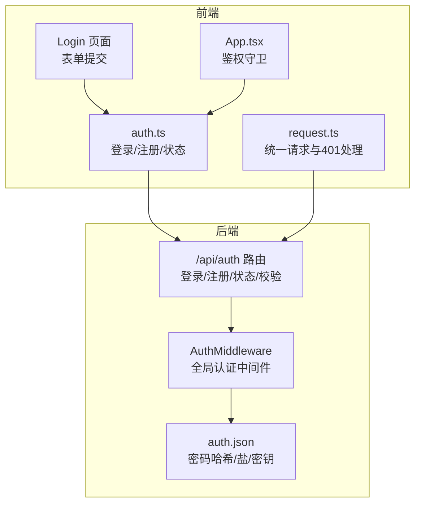
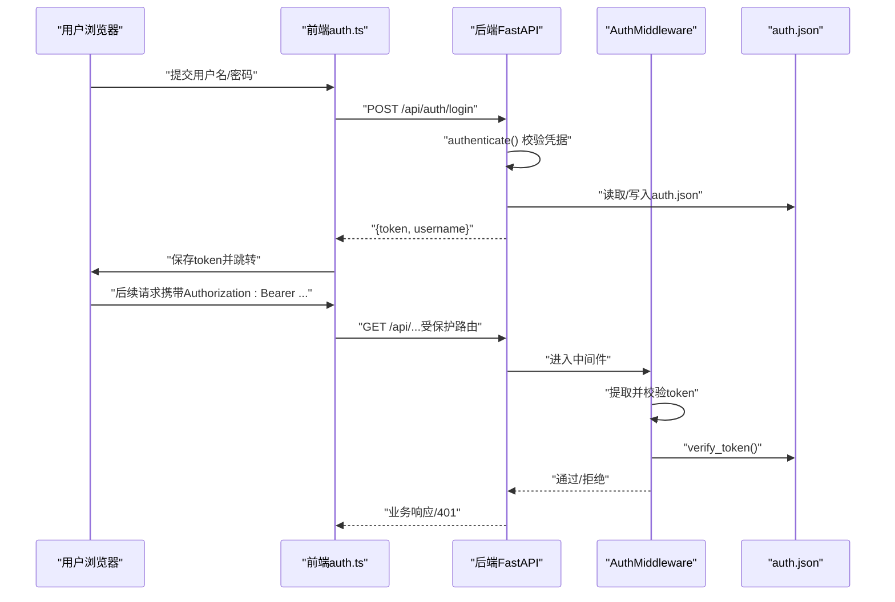
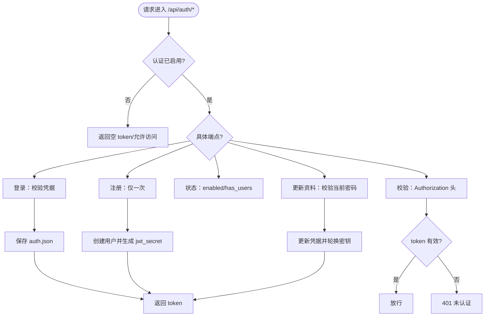
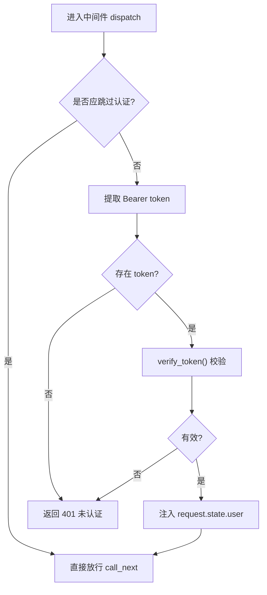
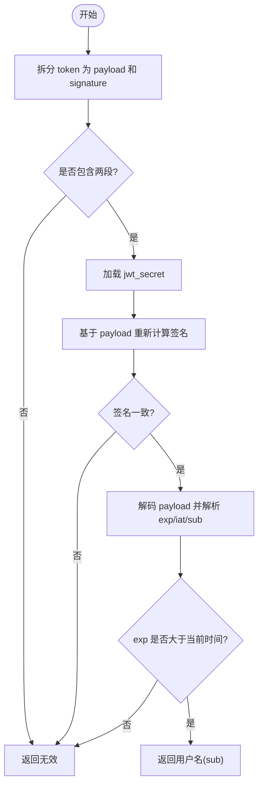
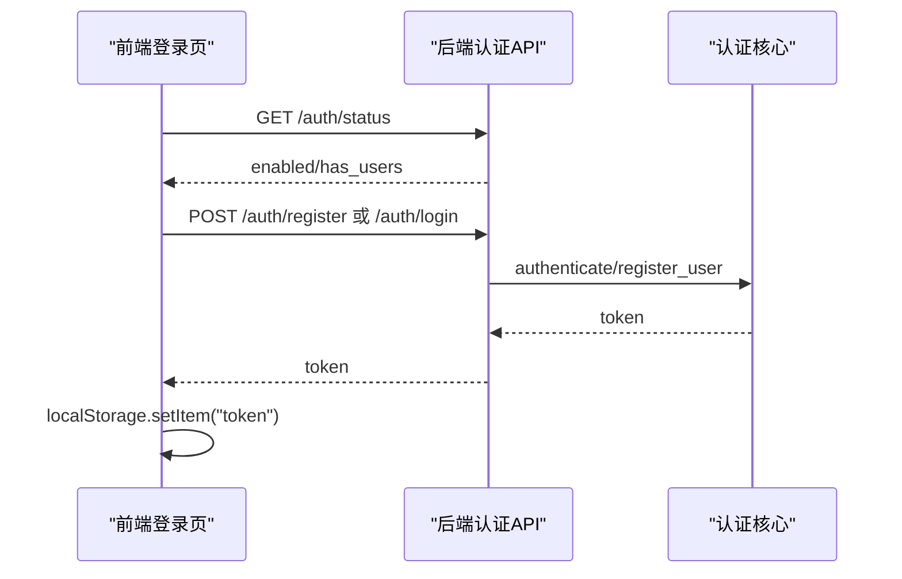
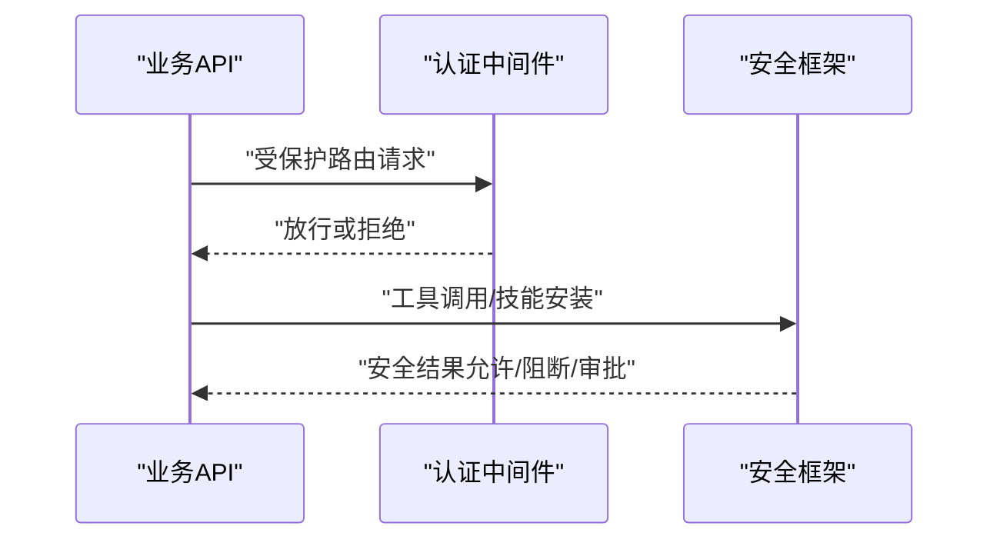
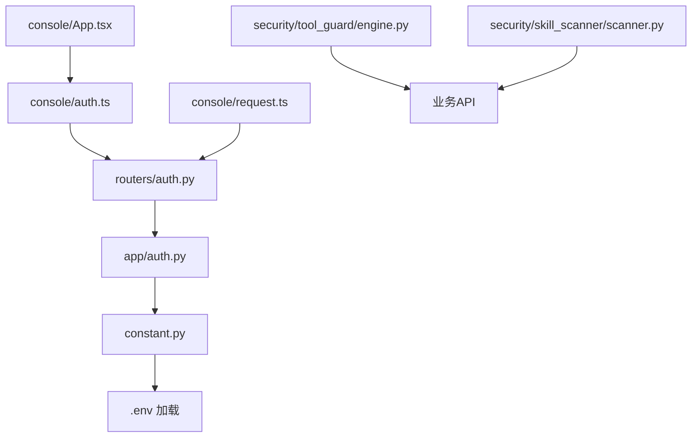

# 认证与授权

<cite>
**本文引用的文件列表**
- [src/copaw/app/routers/auth.py](file://src/copaw/app/routers/auth.py)
- [src/copaw/app/auth.py](file://src/copaw/app/auth.py)
- [src/copaw/constant.py](file://src/copaw/constant.py)
- [console/src/api/modules/auth.ts](file://console/src/api/modules/auth.ts)
- [console/src/api/request.ts](file://console/src/api/request.ts)
- [console/src/pages/Login/index.tsx](file://console/src/pages/Login/index.tsx)
- [console/src/App.tsx](file://console/src/App.tsx)
- [src/copaw/security/tool_guard/engine.py](file://src/copaw/security/tool_guard/engine.py)
- [src/copaw/security/skill_scanner/scanner.py](file://src/copaw/security/skill_scanner/scanner.py)
- [specs/copaw-repowiki/content/API参考/REST API/认证API.md](file://specs/copaw-repowiki/content/API参考/REST API/认证API.md)
- [specs/copaw-repowiki/content/安全系统/认证与授权.md](file://specs/copaw-repowiki/content/安全系统/认证与授权.md)
- [specs/copaw-repowiki/content/配置管理/环境变量管理.md](file://specs/copaw-repowiki/content/配置管理/环境变量管理.md)
</cite>

## 目录
1. [简介](#简介)
2. [项目结构](#项目结构)
3. [核心组件](#核心组件)
4. [架构总览](#架构总览)
5. [详细组件分析](#详细组件分析)
6. [依赖关系分析](#依赖关系分析)
7. [性能与安全特性](#性能与安全特性)
8. [故障排查指南](#故障排查指南)
9. [结论](#结论)
10. [附录：API参考与示例](#附录api参考与示例)

## 简介
本文件为 CoPaw 认证与授权系统的权威文档，覆盖用户认证、令牌管理与会话管理的完整流程。内容包括：
- 登录、注册、状态查询、令牌校验等端点的URL模式、请求方法、请求/响应格式与安全要求
- 认证流程说明、令牌格式、过期策略与错误处理机制
- 前端调用示例与后端实现要点
- 权限控制策略、角色权限分配与访问控制列表
- JWT 令牌处理最佳实践（生成、验证与刷新）
- 安全配置选项与环境变量设置指南
- 开发者集成示例与常见问题解决方案

认证系统采用“单用户”设计，默认关闭，需通过环境变量显式启用；令牌为自签名 JWT 风格（HMAC-SHA256），7 天有效期；受保护路由仅限 /api/*。

## 项目结构
认证相关代码分布在后端 FastAPI 应用与前端控制台两部分：
- 后端
  - 认证路由：/api/auth/*
  - 认证中间件：全局拦截受保护路径，校验 Authorization 头中的 Bearer 令牌
  - 认证数据持久化：auth.json（位于 SECRET_DIR），含密码哈希、盐值与 JWT 密钥
- 前端
  - 控制台通过 auth.ts 封装登录/注册/状态查询
  - 统一请求层 request.ts 对 401 进行统一处理（清空令牌并跳转登录）
  - 登录页 Login 页面负责首次注册与后续登录

**图表来源**
- [src/copaw/app/routers/auth.py:18-114](file://src/copaw/app/routers/auth.py#L18-L114)
- [src/copaw/app/auth.py:302-367](file://src/copaw/app/auth.py#L302-L367)
- [console/src/api/modules/auth.ts:14-49](file://console/src/api/modules/auth.ts#L14-L49)
- [console/src/api/request.ts:39-80](file://console/src/api/request.ts#L39-L80)
- [console/src/pages/Login/index.tsx:33-68](file://console/src/pages/Login/index.tsx#L33-L68)
- [console/src/App.tsx:45-94](file://console/src/App.tsx#L45-L94)

**章节来源**
- [src/copaw/app/routers/auth.py:18-114](file://src/copaw/app/routers/auth.py#L18-L114)
- [src/copaw/app/auth.py:302-367](file://src/copaw/app/auth.py#L302-L367)
- [console/src/api/modules/auth.ts:14-49](file://console/src/api/modules/auth.ts#L14-L49)
- [console/src/api/request.ts:39-80](file://console/src/api/request.ts#L39-L80)
- [console/src/pages/Login/index.tsx:33-68](file://console/src/pages/Login/index.tsx#L33-L68)
- [console/src/App.tsx:45-94](file://console/src/App.tsx#L45-L94)

## 核心组件
- 认证路由层：定义 /api/auth/* 端点，提供登录、注册、状态查询与令牌校验
- 认证中间件：统一校验 Bearer 令牌，支持公共路径豁免与本地回环免认证
- 认证核心：密码哈希（salted SHA-256）、JWT 令牌生成与验证、用户注册与凭据更新
- 前端客户端：封装认证 API 调用，统一处理 401，登录页驱动注册/登录流程
- 安全框架：工具调用与技能安装时的安全检查，配合认证形成纵深防御

**章节来源**
- [src/copaw/app/routers/auth.py:41-114](file://src/copaw/app/routers/auth.py#L41-L114)
- [src/copaw/app/auth.py:340-410](file://src/copaw/app/auth.py#L340-L410)
- [console/src/api/modules/auth.ts:14-49](file://console/src/api/modules/auth.ts#L14-L49)
- [console/src/pages/Login/index.tsx:17-68](file://console/src/pages/Login/index.tsx#L17-L68)
- [src/copaw/security/tool_guard/engine.py:161-207](file://src/copaw/security/tool_guard/engine.py#L161-L207)
- [src/copaw/security/skill_scanner/scanner.py:148-242](file://src/copaw/security/skill_scanner/scanner.py#L148-L242)

## 架构总览
认证系统遵循“后端路由 + 中间件 + 前端客户端”的分层设计：
- 后端
  - 路由层：定义认证相关端点
  - 中间件层：统一校验令牌
  - 数据层：auth.json 持久化
- 前端
  - 客户端：封装认证 API 调用
  - 请求层：统一处理 401
  - 登录页：触发登录/注册流程

**图表来源**
- [src/copaw/app/routers/auth.py:41-114](file://src/copaw/app/routers/auth.py#L41-L114)
- [src/copaw/app/auth.py:302-367](file://src/copaw/app/auth.py#L302-L367)
- [console/src/api/modules/auth.ts:14-49](file://console/src/api/modules/auth.ts#L14-L49)
- [console/src/api/request.ts:39-80](file://console/src/api/request.ts#L39-L80)

## 详细组件分析

### 认证路由与端点
- POST /api/auth/login：校验用户名/密码，成功返回 token
- POST /api/auth/register：仅在认证启用且无用户时允许注册
- GET /api/auth/status：返回认证启用状态与是否存在用户
- GET /api/auth/verify：校验传入的 Bearer token
- POST /api/auth/update-profile：更新用户名与/或密码，支持当前密码校验与密钥轮换

**图表来源**
- [src/copaw/app/routers/auth.py:41-114](file://src/copaw/app/routers/auth.py#L41-L114)
- [src/copaw/app/routers/auth.py:123-175](file://src/copaw/app/routers/auth.py#L123-L175)

**章节来源**
- [src/copaw/app/routers/auth.py:41-114](file://src/copaw/app/routers/auth.py#L41-L114)
- [src/copaw/app/routers/auth.py:123-175](file://src/copaw/app/routers/auth.py#L123-L175)

### 认证中间件与会话管理
- 中间件策略
  - 受保护路径：仅对 /api/* 生效
  - 公共路径豁免：/api/auth/login、/api/auth/register、/api/auth/status、/api/version、静态资源前缀
  - 本地回环免认证：来自 127.0.0.1/::1 的请求
  - WebSocket 认证：通过查询参数 token 传递，且仅限升级请求
  - OPTIONS 预检请求免认证
- 令牌提取：优先 Authorization: Bearer，其次 WebSocket 查询参数，最后普通查询参数
- 用户状态注入：通过 request.state.user 传递认证用户

**图表来源**
- [src/copaw/app/auth.py:340-410](file://src/copaw/app/auth.py#L340-L410)

**章节来源**
- [src/copaw/app/auth.py:340-410](file://src/copaw/app/auth.py#L340-L410)

### 密码存储与注册
- 存储方式
  - auth.json 中保存：username、password_hash、password_salt、jwt_secret
  - 文件权限：0o600（仅所有者可读写）
- 注册流程
  - 仅允许一次注册
  - 自动生成 jwt_secret（若不存在）
  - 成功后返回 token
- 凭据更新
  - 当前密码校验通过后，可更新用户名与/或密码
  - 更新密码时轮换 jwt_secret，使现有会话失效

**章节来源**
- [src/copaw/app/auth.py:214-238](file://src/copaw/app/auth.py#L214-L238)
- [src/copaw/app/auth.py:166-189](file://src/copaw/app/auth.py#L166-L189)
- [src/copaw/app/auth.py:274-309](file://src/copaw/app/auth.py#L274-L309)

### 令牌生成与校验
- 令牌结构
  - 形式：base64url 编码的 payload.signature
  - 载荷字段：sub（用户名）、exp（过期时间）、iat（签发时间）
  - 签名算法：HMAC-SHA256，密钥来自 auth.json 中的 jwt_secret
- 过期策略
  - 默认 7 天（TOKEN_EXPIRY_SECONDS=7天）
- 校验流程
  - 拆分 payload 与 signature
  - 使用 jwt_secret 重新计算签名并与传入签名比对
  - 解码 payload，检查 exp 是否小于当前时间戳
  - 任一步骤失败则判定为无效

**图表来源**
- [src/copaw/app/auth.py:114-158](file://src/copaw/app/auth.py#L114-L158)

**章节来源**
- [src/copaw/app/auth.py:114-158](file://src/copaw/app/auth.py#L114-L158)

### 前端认证集成
- 登录页 Login/index.tsx
  - 根据 /api/auth/status 决定显示注册或登录
  - 登录/注册成功后将 token 存入 localStorage，并在后续请求中携带
- 统一请求层 request.ts
  - 对 401 响应统一处理：清空本地 token 并跳转至登录页
- 鉴权守卫 App.tsx
  - 应用启动时检查认证状态与本地 token，必要时重定向至登录页

**图表来源**
- [console/src/pages/Login/index.tsx:17-68](file://console/src/pages/Login/index.tsx#L17-L68)
- [console/src/api/modules/auth.ts:14-49](file://console/src/api/modules/auth.ts#L14-L49)
- [src/copaw/app/routers/auth.py:41-114](file://src/copaw/app/routers/auth.py#L41-L114)
- [src/copaw/app/auth.py:214-238](file://src/copaw/app/auth.py#L214-L238)

**章节来源**
- [console/src/pages/Login/index.tsx:17-68](file://console/src/pages/Login/index.tsx#L17-L68)
- [console/src/api/modules/auth.ts:14-49](file://console/src/api/modules/auth.ts#L14-L49)
- [console/src/api/request.ts:39-80](file://console/src/api/request.ts#L39-L80)
- [console/src/App.tsx:49-104](file://console/src/App.tsx#L49-L104)

### 安全框架与权限控制
- 工具调用安全
  - ToolGuardEngine：在工具调用前执行规则与路径检查，支持动态启用/禁用与规则热更新
  - 规则引擎：基于 YAML 签名规则进行快速正则匹配，支持威胁分类与严重级别
- 技能安装安全
  - SkillScanner：扫描技能包中的潜在风险，支持策略化文件过滤与大小限制
- 认证与安全联动
  - 认证中间件确保受保护路由的访问控制
  - 安全框架在业务执行层面提供额外防护

**图表来源**
- [src/copaw/security/tool_guard/engine.py:161-207](file://src/copaw/security/tool_guard/engine.py#L161-L207)
- [src/copaw/security/skill_scanner/scanner.py:148-242](file://src/copaw/security/skill_scanner/scanner.py#L148-L242)

**章节来源**
- [src/copaw/security/tool_guard/engine.py:161-207](file://src/copaw/security/tool_guard/engine.py#L161-L207)
- [src/copaw/security/skill_scanner/scanner.py:148-242](file://src/copaw/security/skill_scanner/scanner.py#L148-L242)

## 依赖关系分析
- 认证路由依赖认证核心模块提供的 authenticate/register_user/verify_token 等能力
- 认证中间件依赖认证核心的 verify_token 与 is_auth_enabled/has_registered_users 状态判断
- 前端 auth.ts 依赖后端认证路由，request.ts 统一处理 401
- 安全框架与认证系统解耦，通过业务调用触发安全检查

**图表来源**
- [src/copaw/app/routers/auth.py:10-17](file://src/copaw/app/routers/auth.py#L10-L17)
- [src/copaw/app/auth.py:32-36](file://src/copaw/app/auth.py#L32-L36)
- [src/copaw/constant.py:6-9](file://src/copaw/constant.py#L6-L9)
- [console/src/api/modules/auth.ts:14-49](file://console/src/api/modules/auth.ts#L14-L49)
- [console/src/api/request.ts:39-80](file://console/src/api/request.ts#L39-L80)
- [console/src/App.tsx:49-104](file://console/src/App.tsx#L49-L104)
- [src/copaw/security/tool_guard/engine.py:161-207](file://src/copaw/security/tool_guard/engine.py#L161-L207)
- [src/copaw/security/skill_scanner/scanner.py:148-242](file://src/copaw/security/skill_scanner/scanner.py#L148-L242)

**章节来源**
- [src/copaw/app/routers/auth.py:10-17](file://src/copaw/app/routers/auth.py#L10-L17)
- [src/copaw/app/auth.py:32-36](file://src/copaw/app/auth.py#L32-L36)
- [src/copaw/constant.py:6-9](file://src/copaw/constant.py#L6-L9)
- [console/src/api/modules/auth.ts:14-49](file://console/src/api/modules/auth.ts#L14-L49)
- [console/src/api/request.ts:39-80](file://console/src/api/request.ts#L39-L80)
- [console/src/App.tsx:49-104](file://console/src/App.tsx#L49-L104)
- [src/copaw/security/tool_guard/engine.py:161-207](file://src/copaw/security/tool_guard/engine.py#L161-L207)
- [src/copaw/security/skill_scanner/scanner.py:148-242](file://src/copaw/security/skill_scanner/scanner.py#L148-L242)

## 性能与安全特性
- 性能特性
  - 令牌验证为内存计算，复杂度低，毫秒级响应
  - 中间件仅在受保护路径执行，公共路径与本地回环免认证减少开销
  - 文件 I/O 仅在注册/更新凭据与状态检查时发生
- 安全特性
  - 单用户设计降低攻击面
  - 密码使用加盐 SHA-256 哈希，文件权限严格限制
  - 令牌采用 HMAC-SHA256 签名，7 天有效期
  - 自动注册支持从环境变量注入管理员账号，便于容器化部署
  - 工具调用与技能安装具备安全检查与审批流程

**章节来源**
- [src/copaw/app/auth.py:192-202](file://src/copaw/app/auth.py#L192-L202)
- [src/copaw/app/auth.py:242-272](file://src/copaw/app/auth.py#L242-L272)
- [src/copaw/security/tool_guard/engine.py:161-207](file://src/copaw/security/tool_guard/engine.py#L161-L207)
- [src/copaw/security/skill_scanner/scanner.py:148-242](file://src/copaw/security/skill_scanner/scanner.py#L148-L242)

## 故障排查指南
- 登录失败（401 无效凭据）
  - 检查用户名/密码是否正确
  - 确认认证已启用（/api/auth/status）
  - 查看后端日志中的认证失败记录
- 令牌无效或过期（401 无效或过期）
  - 检查 Authorization 头格式是否为 Bearer token
  - 确认 token 未过期（默认 7 天）
  - 若更新密码，jwt_secret 已轮换，需重新登录获取新 token
- 注册失败（403/409）
  - 仅在认证启用且无用户时允许注册
  - 确保用户名/密码非空
- 401 统一处理
  - 前端 request.ts 会在收到 401 时清空本地 token 并跳转登录页
  - 检查 localStorage 中的 copaw_auth_token 是否被清理

**章节来源**
- [src/copaw/app/routers/auth.py:41-114](file://src/copaw/app/routers/auth.py#L41-L114)
- [console/src/api/request.ts:74-83](file://console/src/api/request.ts#L74-L83)
- [src/copaw/app/auth.py:340-410](file://src/copaw/app/auth.py#L340-L410)

## 结论
本认证与授权系统以“单用户 + JWT 令牌 + 中间件拦截”为核心，结合前端统一请求处理与安全框架的工具/技能安全检查，形成了从网络层到业务层的多层防护。系统设计强调安全性与易用性平衡：默认关闭、手动启用；令牌短周期、易于轮换；前端统一处理 401；后端严格文件权限与状态检查。对于需要更细粒度权限控制的场景，可在现有基础上扩展角色/权限模型与访问控制列表。

## 附录：API参考与示例

### 端点清单与规范
- POST /api/auth/login
  - 请求体：{username, password}
  - 成功响应：{token, username}
  - 失败响应：401（无效凭据）
- POST /api/auth/register
  - 请求体：{username, password}
  - 成功响应：{token, username}
  - 失败响应：400（缺少参数）、403（未启用/已注册）、409（注册失败）
- GET /api/auth/status
  - 响应：{enabled, has_users}
- GET /api/auth/verify
  - 请求头：Authorization: Bearer <token>
  - 成功响应：{valid:true, username}
  - 失败响应：401（未提供令牌/无效或过期）

**章节来源**
- [src/copaw/app/routers/auth.py:41-114](file://src/copaw/app/routers/auth.py#L41-L114)

### 令牌格式与过期策略
- 格式：base64url(payload).signature
- 载荷字段：sub、exp、iat
- 签名算法：HMAC-SHA256
- 过期时间：默认 7 天
- 密钥来源：auth.json 中的 jwt_secret

**章节来源**
- [src/copaw/app/auth.py:114-158](file://src/copaw/app/auth.py#L114-L158)

### 前端调用示例（概念性）
- 登录
  - 方法：POST /api/auth/login
  - 请求头：Content-Type: application/json
  - 请求体：{username, password}
  - 成功后：将返回的 token 保存到 localStorage
- 注册
  - 方法：POST /api/auth/register
  - 请求头：Content-Type: application/json
  - 请求体：{username, password}
  - 成功后：将返回的 token 保存到 localStorage
- 校验
  - 方法：GET /api/auth/verify
  - 请求头：Authorization: Bearer <token>

**章节来源**
- [console/src/api/modules/auth.ts:14-49](file://console/src/api/modules/auth.ts#L14-L49)
- [console/src/api/config.ts:23-41](file://console/src/api/config.ts#L23-L41)

### 环境变量与安全配置
- 认证开关
  - COPAW_AUTH_ENABLED：启用认证（true/1/yes）
- 自动注册
  - COPAW_AUTH_USERNAME/COPAW_AUTH_PASSWORD：启动时自动创建管理员账号
- 安全目录
  - COPAW_SECRET_DIR：认证与敏感配置的存放目录（默认 ~/.copaw/.secret）
- CORS 配置
  - COPAW_CORS_ORIGINS：开发模式允许的跨域来源列表
- 日志级别
  - COPAW_LOG_LEVEL：应用日志级别
- 工具守护
  - COPAW_TOOL_GUARD_ENABLED：启用工具调用安全检查
  - COPAW_TOOL_GUARD_APPROVAL_TIMEOUT_SECONDS：审批超时（秒）

**章节来源**
- [specs/copaw-repowiki/content/配置管理/环境变量管理.md:99-356](file://specs/copaw-repowiki/content/配置管理/环境变量管理.md#L99-L356)
- [src/copaw/constant.py:72-86](file://src/copaw/constant.py#L72-L86)
- [src/copaw/app/auth.py:192-202](file://src/copaw/app/auth.py#L192-L202)
- [src/copaw/security/tool_guard/engine.py:35-51](file://src/copaw/security/tool_guard/engine.py#L35-L51)