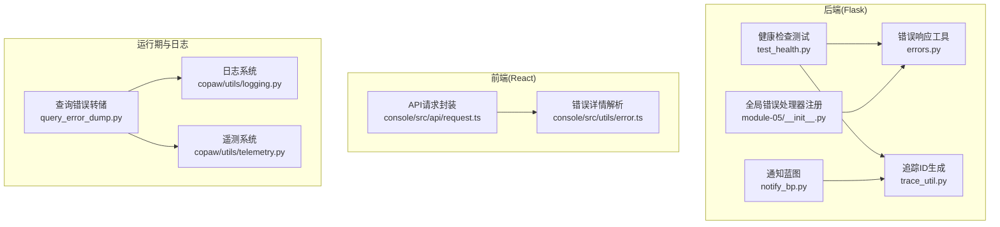
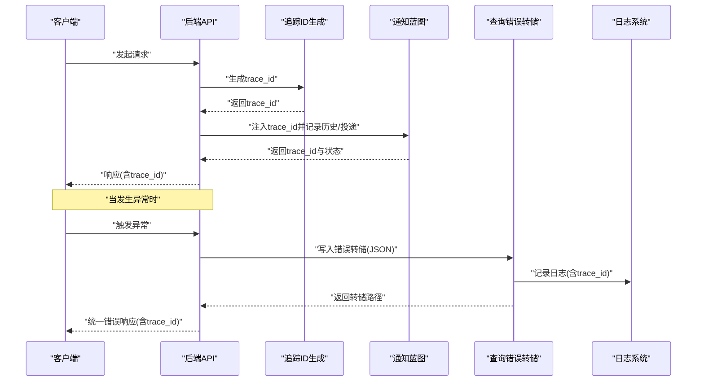
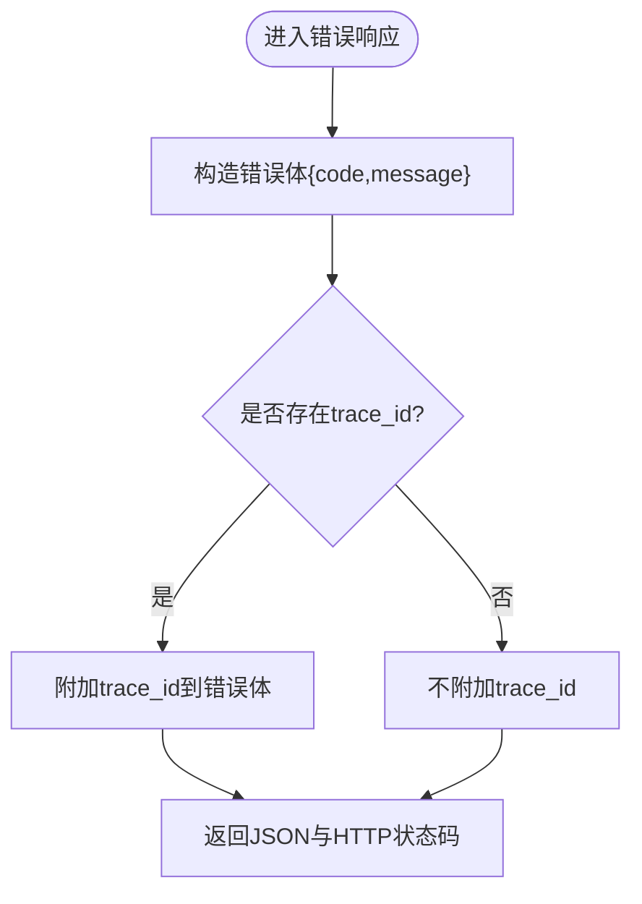
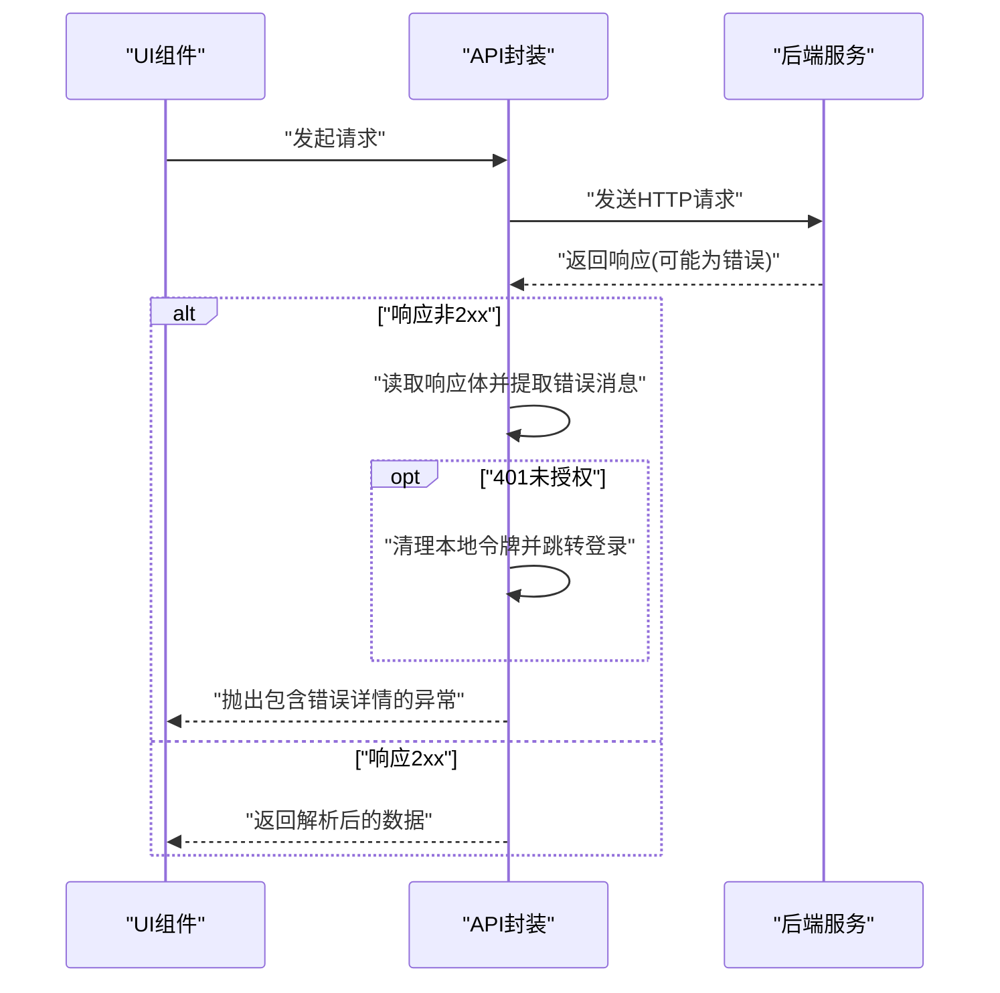
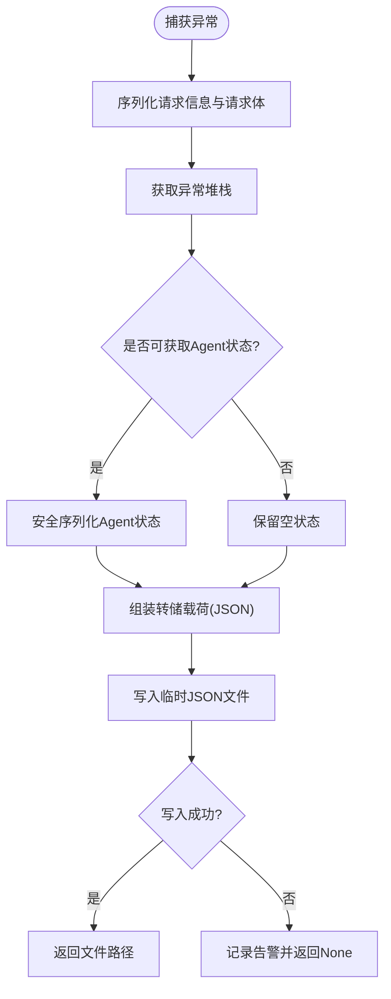
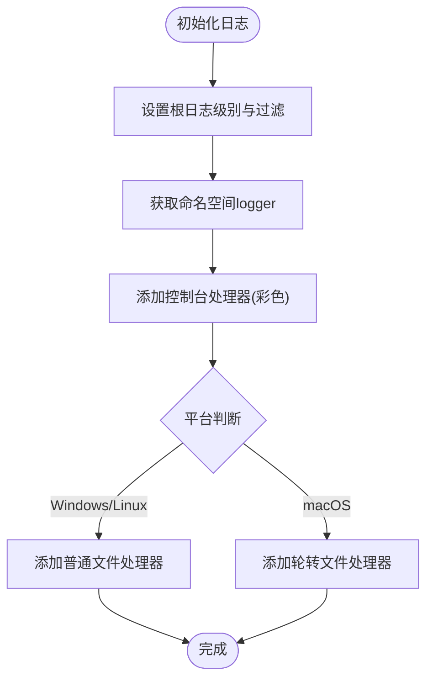
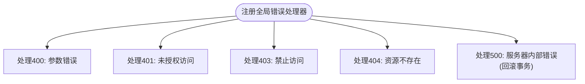
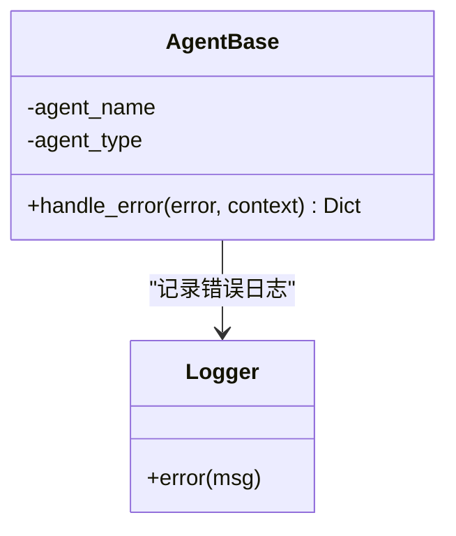
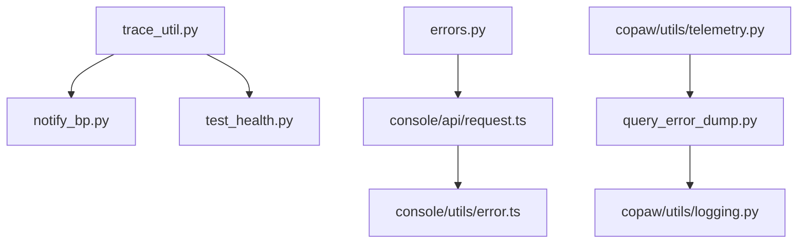

# 错误处理机制

<cite>
**本文引用的文件**
- [main-project/backend/app/errors.py](file://main-project/backend/app/errors.py)
- [main-project/backend/app/trace_util.py](file://main-project/backend/app/trace_util.py)
- [main-project/backend/app/blueprints/notify_bp.py](file://main-project/backend/app/blueprints/notify_bp.py)
- [main-project/backend/tests/test_health.py](file://main-project/backend/tests/test_health.py)
- [modules-practice/module-05/backend/app/__init__.py](file://modules-practice/module-05/backend/app/__init__.py)
- [modules-practice/module-05/backend/app/agents/base.py](file://modules-practice/module-05/backend/app/agents/base.py)
- [copaw/console/src/api/request.ts](file://copaw/console/src/api/request.ts)
- [copaw/console/src/utils/error.ts](file://copaw/console/src/utils/error.ts)
- [copaw/src/copaw/app/runner/query_error_dump.py](file://copaw/src/copaw/app/runner/query_error_dump.py)
- [copaw/src/copaw/utils/logging.py](file://copaw/src/copaw/utils/logging.py)
- [copaw/src/copaw/utils/telemetry.py](file://copaw/src/copaw/utils/telemetry.py)
</cite>

## 目录
1. [引言](#引言)
2. [项目结构](#项目结构)
3. [核心组件](#核心组件)
4. [架构总览](#架构总览)
5. [详细组件分析](#详细组件分析)
6. [依赖分析](#依赖分析)
7. [性能考量](#性能考量)
8. [故障排除指南](#故障排除指南)
9. [结论](#结论)
10. [附录](#附录)

## 引言
本规范文档面向开发者与运维人员，系统化定义统一的错误响应格式、错误分类与对应HTTP状态码、错误日志记录与调试信息收集机制，并提供最佳实践、常见场景解决方案、错误恢复与降级策略，以及完整的示例与排障指南。文档覆盖后端Flask服务、前端API客户端、CoPaw运行期错误转储与日志体系，确保跨语言与跨模块的一致性与可观测性。

## 项目结构
围绕错误处理的关键位置如下：
- 后端通用错误响应与追踪ID生成
- 通知蓝本中的追踪ID注入与交付状态
- 健康检查测试对追踪头的断言
- 全局错误处理器（示例）
- 前端API请求封装与错误解析
- 运行期查询错误转储与Agent状态快照
- 日志系统与平台差异化文件处理器
- 遥测与标记文件避免重复上报

**图示来源**
- [main-project/backend/app/errors.py:1-10](file://main-project/backend/app/errors.py#L1-L10)
- [main-project/backend/app/trace_util.py:1-5](file://main-project/backend/app/trace_util.py#L1-L5)
- [main-project/backend/app/blueprints/notify_bp.py:432-464](file://main-project/backend/app/blueprints/notify_bp.py#L432-L464)
- [main-project/backend/tests/test_health.py:1-13](file://main-project/backend/tests/test_health.py#L1-L13)
- [modules-practice/module-05/backend/app/__init__.py:74-139](file://modules-practice/module-05/backend/app/__init__.py#L74-L139)
- [copaw/console/src/api/request.ts:1-116](file://copaw/console/src/api/request.ts#L1-L116)
- [copaw/console/src/utils/error.ts:1-11](file://copaw/console/src/utils/error.ts#L1-L11)
- [copaw/src/copaw/app/runner/query_error_dump.py:1-105](file://copaw/src/copaw/app/runner/query_error_dump.py#L1-L105)
- [copaw/src/copaw/utils/logging.py:1-185](file://copaw/src/copaw/utils/logging.py#L1-L185)
- [copaw/src/copaw/utils/telemetry.py:1-311](file://copaw/src/copaw/utils/telemetry.py#L1-L311)

**章节来源**
- [main-project/backend/app/errors.py:1-10](file://main-project/backend/app/errors.py#L1-L10)
- [main-project/backend/app/trace_util.py:1-5](file://main-project/backend/app/trace_util.py#L1-L5)
- [main-project/backend/app/blueprints/notify_bp.py:432-464](file://main-project/backend/app/blueprints/notify_bp.py#L432-L464)
- [main-project/backend/tests/test_health.py:1-13](file://main-project/backend/tests/test_health.py#L1-L13)
- [modules-practice/module-05/backend/app/__init__.py:74-139](file://modules-practice/module-05/backend/app/__init__.py#L74-L139)
- [copaw/console/src/api/request.ts:1-116](file://copaw/console/src/api/request.ts#L1-L116)
- [copaw/console/src/utils/error.ts:1-11](file://copaw/console/src/utils/error.ts#L1-L11)
- [copaw/src/copaw/app/runner/query_error_dump.py:1-105](file://copaw/src/copaw/app/runner/query_error_dump.py#L1-L105)
- [copaw/src/copaw/utils/logging.py:1-185](file://copaw/src/copaw/utils/logging.py#L1-L185)
- [copaw/src/copaw/utils/telemetry.py:1-311](file://copaw/src/copaw/utils/telemetry.py#L1-L311)

## 核心组件
- 统一错误响应格式与追踪ID注入
  - 后端提供通用错误响应函数，支持在响应体中嵌入trace_id，便于端到端追踪。
  - 健康检查测试断言响应头包含追踪ID，确保链路可观测性。
- 前端错误解析与用户提示
  - API请求封装统一处理非2xx响应，提取错误消息并抛出带结构化详情的错误。
  - 错误详情解析工具支持从错误消息中提取结构化detail字段，提升诊断效率。
- 查询错误转储与Agent状态快照
  - 运行期异常时写入临时JSON文件，包含异常堆栈、请求信息、Agent状态与UTC时间戳，辅助离线排查。
- 日志系统与平台差异化
  - 控制台彩色输出、可选文件处理器、按平台选择轮转策略，避免第三方噪声污染。
- 全局错误处理器（示例）
  - 示例展示了如何注册Flask全局错误处理器，返回统一格式的错误响应。

**章节来源**
- [main-project/backend/app/errors.py:4-9](file://main-project/backend/app/errors.py#L4-L9)
- [main-project/backend/tests/test_health.py:5-5](file://main-project/backend/tests/test_health.py#L5-L5)
- [copaw/console/src/api/request.ts:60-116](file://copaw/console/src/api/request.ts#L60-L116)
- [copaw/console/src/utils/error.ts:1-11](file://copaw/console/src/utils/error.ts#L1-L11)
- [copaw/src/copaw/app/runner/query_error_dump.py:48-105](file://copaw/src/copaw/app/runner/query_error_dump.py#L48-L105)
- [copaw/src/copaw/utils/logging.py:104-185](file://copaw/src/copaw/utils/logging.py#L104-L185)
- [modules-practice/module-05/backend/app/__init__.py:74-129](file://modules-practice/module-05/backend/app/__init__.py#L74-L129)

## 架构总览
下图展示从API请求到错误响应、追踪ID传播、错误转储与日志记录的整体流程。

**图示来源**
- [main-project/backend/app/trace_util.py:4-5](file://main-project/backend/app/trace_util.py#L4-L5)
- [main-project/backend/app/blueprints/notify_bp.py:432-464](file://main-project/backend/app/blueprints/notify_bp.py#L432-L464)
- [copaw/src/copaw/app/runner/query_error_dump.py:48-105](file://copaw/src/copaw/app/runner/query_error_dump.py#L48-L105)
- [copaw/src/copaw/utils/logging.py:104-185](file://copaw/src/copaw/utils/logging.py#L104-L185)

## 详细组件分析

### 统一错误响应与追踪ID
- 后端错误响应函数接收错误码、消息与HTTP状态码，构造统一错误体，并在存在g.trace_id时附加trace_id，便于跨服务定位问题。
- 健康检查测试断言响应头包含追踪ID，确保链路追踪贯穿始终。

**图示来源**
- [main-project/backend/app/errors.py:4-9](file://main-project/backend/app/errors.py#L4-L9)
- [main-project/backend/tests/test_health.py:5-5](file://main-project/backend/tests/test_health.py#L5-L5)

**章节来源**
- [main-project/backend/app/errors.py:4-9](file://main-project/backend/app/errors.py#L4-L9)
- [main-project/backend/tests/test_health.py:1-13](file://main-project/backend/tests/test_health.py#L1-L13)

### 前端API请求与错误解析
- 请求封装统一处理非2xx响应，优先从响应体提取错误消息，401时清理本地令牌并跳转登录页，其余错误抛出包含原始响应体的错误，便于后续解析。
- 错误详情解析工具尝试从错误消息中提取结构化detail字段，提升前端展示与诊断能力。

**图示来源**
- [copaw/console/src/api/request.ts:60-116](file://copaw/console/src/api/request.ts#L60-L116)
- [copaw/console/src/utils/error.ts:1-11](file://copaw/console/src/utils/error.ts#L1-L11)

**章节来源**
- [copaw/console/src/api/request.ts:1-116](file://copaw/console/src/api/request.ts#L1-L116)
- [copaw/console/src/utils/error.ts:1-11](file://copaw/console/src/utils/error.ts#L1-L11)

### 查询错误转储与Agent状态快照
- 运行期异常时，将异常堆栈、请求信息（会话ID、用户ID、渠道）、完整请求体、Agent状态与UTC时间戳写入临时JSON文件，便于离线分析与回溯。
- 写入失败时记录告警日志，保证不影响主流程。

**图示来源**
- [copaw/src/copaw/app/runner/query_error_dump.py:48-105](file://copaw/src/copaw/app/runner/query_error_dump.py#L48-L105)

**章节来源**
- [copaw/src/copaw/app/runner/query_error_dump.py:1-105](file://copaw/src/copaw/app/runner/query_error_dump.py#L1-L105)

### 日志系统与平台差异化
- 控制台彩色输出与路径简化，仅输出来自指定命名空间的日志，避免第三方噪声。
- 文件处理器按平台选择：Windows/Linux使用普通文件处理器，macOS使用轮转文件处理器，避免文件锁与重复行问题。

**图示来源**
- [copaw/src/copaw/utils/logging.py:104-185](file://copaw/src/copaw/utils/logging.py#L104-L185)

**章节来源**
- [copaw/src/copaw/utils/logging.py:1-185](file://copaw/src/copaw/utils/logging.py#L1-L185)

### 全局错误处理器（示例）
- 示例展示了如何注册Flask全局错误处理器，针对400/401/403/404/500返回统一格式的错误响应，其中500错误包含回滚数据库事务的逻辑。

**图示来源**
- [modules-practice/module-05/backend/app/__init__.py:74-129](file://modules-practice/module-05/backend/app/__init__.py#L74-L129)

**章节来源**
- [modules-practice/module-05/backend/app/__init__.py:74-139](file://modules-practice/module-05/backend/app/__init__.py#L74-L139)

### Agent错误处理（示例）
- 示例Agent类提供统一错误处理方法，记录错误日志并返回包含Agent类型、名称、状态、错误信息与时间戳的结构化错误字典，便于上层聚合与展示。

**图示来源**
- [modules-practice/module-05/backend/app/agents/base.py:101-121](file://modules-practice/module-05/backend/app/agents/base.py#L101-L121)

**章节来源**
- [modules-practice/module-05/backend/app/agents/base.py:101-121](file://modules-practice/module-05/backend/app/agents/base.py#L101-L121)

## 依赖分析
- 后端追踪ID生成与通知蓝图协作，确保每个请求具备唯一trace_id并在历史与投递记录中体现。
- 健康检查测试依赖追踪ID的存在，保障端到端可观测性。
- 前端请求封装依赖后端统一错误响应格式，错误详情解析依赖错误消息中的结构化字段。
- 查询错误转储依赖日志系统进行辅助记录，遥测系统通过标记文件避免重复上报。

**图示来源**
- [main-project/backend/app/trace_util.py:4-5](file://main-project/backend/app/trace_util.py#L4-L5)
- [main-project/backend/app/blueprints/notify_bp.py:432-464](file://main-project/backend/app/blueprints/notify_bp.py#L432-L464)
- [main-project/backend/tests/test_health.py:5-5](file://main-project/backend/tests/test_health.py#L5-L5)
- [main-project/backend/app/errors.py:4-9](file://main-project/backend/app/errors.py#L4-L9)
- [copaw/console/src/api/request.ts:60-116](file://copaw/console/src/api/request.ts#L60-L116)
- [copaw/console/src/utils/error.ts:1-11](file://copaw/console/src/utils/error.ts#L1-L11)
- [copaw/src/copaw/app/runner/query_error_dump.py:48-105](file://copaw/src/copaw/app/runner/query_error_dump.py#L48-L105)
- [copaw/src/copaw/utils/logging.py:104-185](file://copaw/src/copaw/utils/logging.py#L104-L185)
- [copaw/src/copaw/utils/telemetry.py:194-241](file://copaw/src/copaw/utils/telemetry.py#L194-L241)

**章节来源**
- [main-project/backend/app/trace_util.py:1-5](file://main-project/backend/app/trace_util.py#L1-L5)
- [main-project/backend/app/blueprints/notify_bp.py:432-464](file://main-project/backend/app/blueprints/notify_bp.py#L432-L464)
- [main-project/backend/tests/test_health.py:1-13](file://main-project/backend/tests/test_health.py#L1-L13)
- [main-project/backend/app/errors.py:1-10](file://main-project/backend/app/errors.py#L1-L10)
- [copaw/console/src/api/request.ts:1-116](file://copaw/console/src/api/request.ts#L1-L116)
- [copaw/console/src/utils/error.ts:1-11](file://copaw/console/src/utils/error.ts#L1-L11)
- [copaw/src/copaw/app/runner/query_error_dump.py:1-105](file://copaw/src/copaw/app/runner/query_error_dump.py#L1-L105)
- [copaw/src/copaw/utils/logging.py:1-185](file://copaw/src/copaw/utils/logging.py#L1-L185)
- [copaw/src/copaw/utils/telemetry.py:194-241](file://copaw/src/copaw/utils/telemetry.py#L194-L241)

## 性能考量
- 统一错误响应与追踪ID注入为O(1)开销，不会显著影响正常路径性能。
- 日志系统按平台选择文件处理器，避免轮转带来的额外IO开销；同时通过命名空间过滤减少日志噪声。
- 查询错误转储仅在异常路径触发，且采用临时文件与安全序列化，尽量降低对主流程的影响。
- 前端错误解析与用户提示为轻量操作，建议在UI层做节流与去抖，避免频繁弹窗。

## 故障排除指南
- 前端401未授权
  - 现象：请求返回401，页面跳转登录。
  - 排查：确认本地令牌是否过期或被清理；检查后端鉴权中间件是否正确注入用户信息。
  - 处置：重新登录获取新令牌，或在登录页刷新后重试。
- 前端错误消息无法解析
  - 现象：错误提示显示原始响应体而非友好消息。
  - 排查：确认后端返回内容类型为JSON且包含message/detail字段；检查前端错误解析逻辑。
  - 处置：修复后端错误响应格式，或增强前端解析容错。
- 后端500内部错误
  - 现象：服务端异常，返回统一错误响应。
  - 排查：查看服务端日志与追踪ID；检查数据库事务是否需要回滚。
  - 处置：修复业务逻辑或依赖服务异常，必要时降级到只读模式。
- 查询错误转储缺失
  - 现象：异常后未生成转储文件。
  - 排查：确认临时目录可写；检查序列化过程是否抛出异常；查看告警日志。
  - 处置：修复Agent状态序列化或请求对象序列化逻辑，确保转储路径可达。
- 遥测重复上报
  - 现象：升级版本后重复提示或上报。
  - 排查：检查标记文件内容与当前版本；确认opted_out标志。
  - 处置：根据用户选择更新标记文件，避免重复提示。

**章节来源**
- [copaw/console/src/api/request.ts:74-95](file://copaw/console/src/api/request.ts#L74-L95)
- [copaw/console/src/utils/error.ts:1-11](file://copaw/console/src/utils/error.ts#L1-L11)
- [modules-practice/module-05/backend/app/__init__.py:119-128](file://modules-practice/module-05/backend/app/__init__.py#L119-L128)
- [copaw/src/copaw/app/runner/query_error_dump.py:102-105](file://copaw/src/copaw/app/runner/query_error_dump.py#L102-L105)
- [copaw/src/copaw/utils/telemetry.py:194-241](file://copaw/src/copaw/utils/telemetry.py#L194-L241)

## 结论
通过统一的错误响应格式、追踪ID传播、前后端一致的错误解析与用户提示、运行期错误转储与日志系统，以及示例化的全局错误处理与Agent错误处理，本项目实现了高一致性与强可观测性的错误处理机制。建议在生产环境中持续完善错误分类与状态码映射、增强错误恢复与降级策略，并定期审查遥测与日志策略以平衡隐私与可观测性。

## 附录

### 统一错误响应格式规范
- 响应体结构
  - error.code: 错误码（字符串或数字），用于程序化识别。
  - error.message: 用户可读的错误描述。
  - error.trace_id: 可选，当存在追踪ID时附加。
- HTTP状态码映射（建议）
  - 400: 请求参数错误
  - 401: 未授权访问
  - 403: 禁止访问
  - 404: 资源不存在
  - 500: 服务器内部错误
  - 429: 请求过于频繁（速率限制）
- 前端错误解析
  - 从错误消息中提取结构化detail字段，若不存在则回退到message或原始响应体。
  - 对于401，清理本地令牌并跳转登录页。

**章节来源**
- [main-project/backend/app/errors.py:4-9](file://main-project/backend/app/errors.py#L4-L9)
- [copaw/console/src/api/request.ts:60-116](file://copaw/console/src/api/request.ts#L60-L116)
- [copaw/console/src/utils/error.ts:1-11](file://copaw/console/src/utils/error.ts#L1-L11)
- [modules-practice/module-05/backend/app/__init__.py:74-129](file://modules-practice/module-05/backend/app/__init__.py#L74-L129)

### 错误日志记录与调试信息收集
- 日志级别与输出
  - 控制台彩色输出，仅输出来自指定命名空间的日志。
  - 可选添加文件处理器，按平台选择普通文件或轮转文件处理器。
- 调试信息
  - 查询错误转储包含异常堆栈、请求信息、Agent状态与UTC时间戳。
  - 健康检查测试断言响应头包含追踪ID，确保端到端追踪。

**章节来源**
- [copaw/src/copaw/utils/logging.py:104-185](file://copaw/src/copaw/utils/logging.py#L104-L185)
- [copaw/src/copaw/app/runner/query_error_dump.py:48-105](file://copaw/src/copaw/app/runner/query_error_dump.py#L48-L105)
- [main-project/backend/tests/test_health.py:5-5](file://main-project/backend/tests/test_health.py#L5-L5)

### 错误恢复与降级策略
- 速率限制
  - 建议实现基于IP/用户/令牌的配额控制，超限时返回429。
- 降级处理
  - 对外只读接口在依赖服务不可用时返回缓存或默认值。
  - 对内接口在下游失败时快速失败并记录追踪ID，便于回溯。
- 遥测与上报
  - 遥测上传失败不应阻塞主流程，通过标记文件避免重复上报。

**章节来源**
- [specs/workshop/module-03-knowledge-copaw/docs/standards/api-design.md:189-191](file://specs/workshop/module-03-knowledge-copaw/docs/standards/api-design.md#L189-L191)
- [copaw/src/copaw/utils/telemetry.py:163-182](file://copaw/src/copaw/utils/telemetry.py#L163-L182)