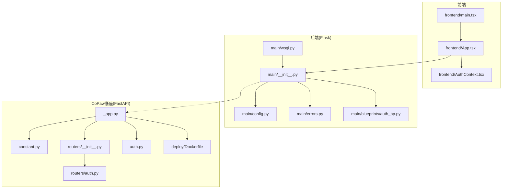
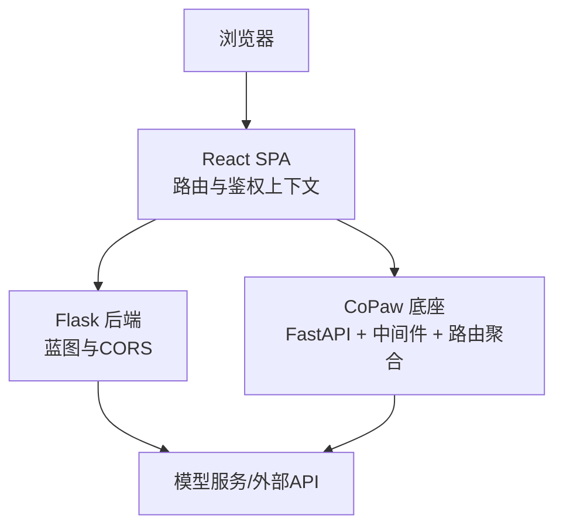
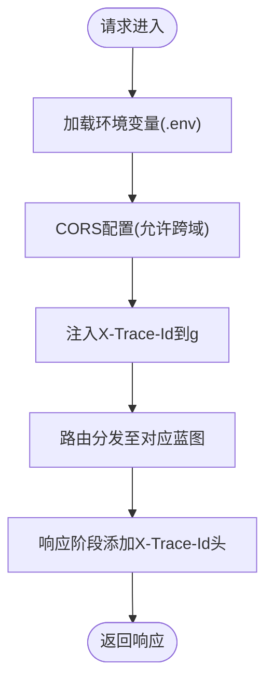
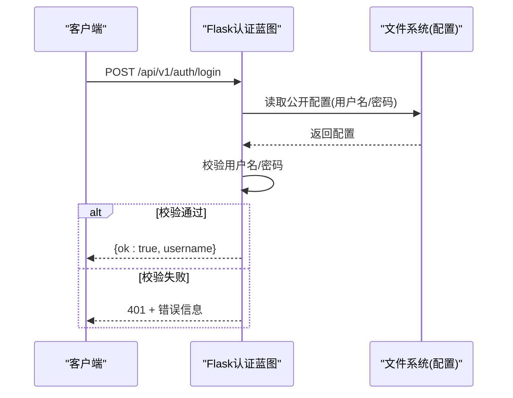
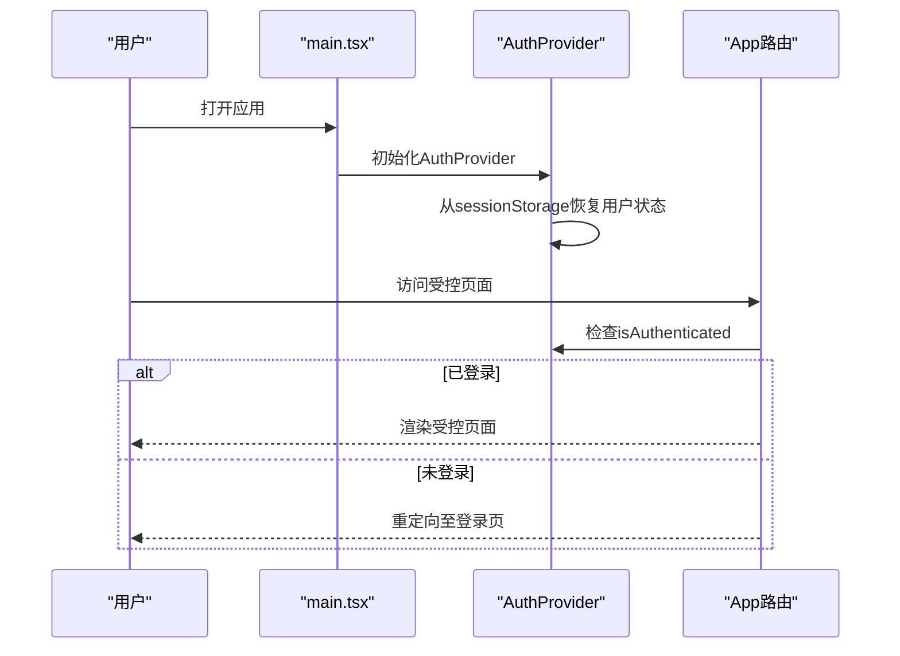
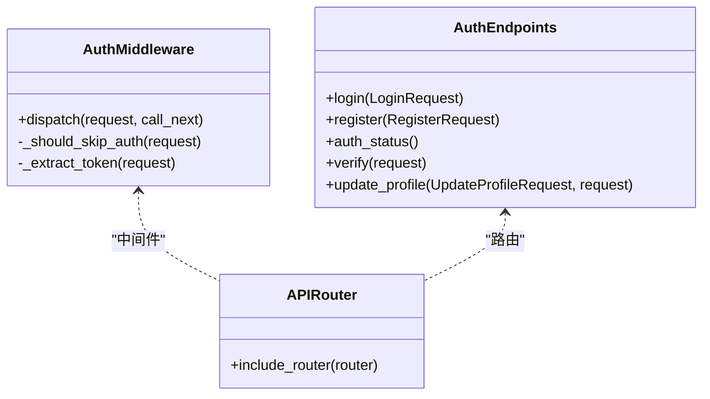
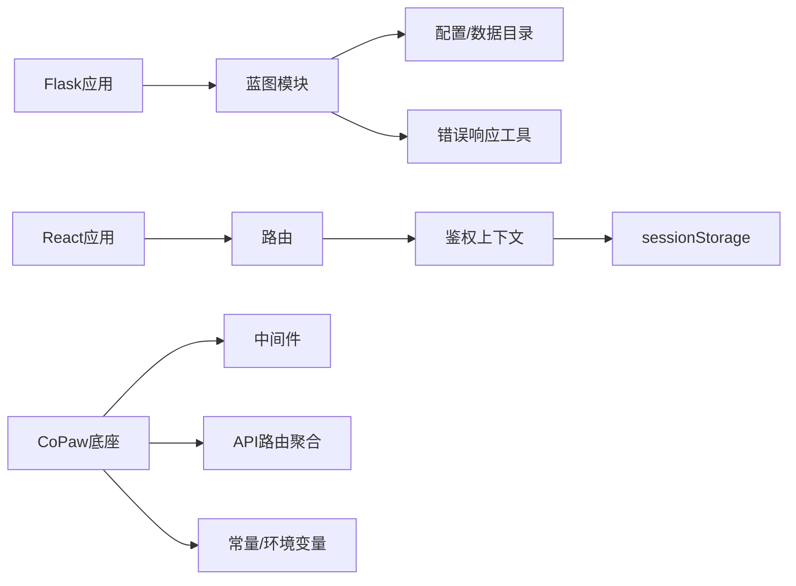

# 主应用系统

<cite>
**本文引用的文件**
- [main/__init__.py](file://main-project/backend/app/__init__.py)
- [main/config.py](file://main-project/backend/app/config.py)
- [main/errors.py](file://main-project/backend/app/errors.py)
- [main/auth_bp.py](file://main-project/backend/app/blueprints/auth_bp.py)
- [main/wsgi.py](file://main-project/backend/wsgi.py)
- [frontend/main.tsx](file://main-project/frontend/src/main.tsx)
- [frontend/App.tsx](file://main-project/frontend/src/App.tsx)
- [frontend/AuthContext.tsx](file://main-project/frontend/src/context/AuthContext.tsx)
- [copaw/_app.py](file://copaw/src/copaw/app/_app.py)
- [copaw/auth.py](file://copaw/src/copaw/app/auth.py)
- [copaw/routers/__init__.py](file://copaw/src/copaw/app/routers/__init__.py)
- [copaw/routers/auth.py](file://copaw/src/copaw/app/routers/auth.py)
- [copaw/constant.py](file://copaw/src/copaw/constant.py)
- [copaw/Dockerfile](file://copaw/deploy/Dockerfile)
</cite>

## 目录
1. [引言](#引言)
2. [项目结构](#项目结构)
3. [核心组件](#核心组件)
4. [架构总览](#架构总览)
5. [详细组件分析](#详细组件分析)
6. [依赖分析](#依赖分析)
7. [性能考虑](#性能考虑)
8. [故障排查指南](#故障排查指南)
9. [结论](#结论)
10. [附录](#附录)

## 引言
本技术文档面向主应用系统，围绕Flask后端架构与React前端应用展开，系统性阐述：
- Flask后端蓝图化架构与中间件、CORS、追踪ID注入等设计
- React前端路由、布局与上下文驱动的状态管理
- 前后端数据交互模式与API设计规范
- 用户认证、权限管理与会话处理方案
- 系统集成、中间件配置与错误处理最佳实践
- 主应用与CoPaw底座的集成方式与数据流转
- 面向系统管理员的部署、监控与维护指导

## 项目结构
主应用系统由三部分组成：
- Flask后端：以蓝图组织业务域，统一注册到应用实例，提供REST接口与CORS支持
- React前端：基于路由与上下文进行鉴权控制与页面导航
- CoPaw底座：提供多智能体运行时、认证中间件、API路由聚合与静态资源服务

图表来源
- [main/__init__.py:1-80](file://main-project/backend/app/__init__.py#L1-L80)
- [main/config.py:1-10](file://main-project/backend/app/config.py#L1-L10)
- [main/errors.py:1-10](file://main-project/backend/app/errors.py#L1-L10)
- [main/auth_bp.py:1-43](file://main-project/backend/app/blueprints/auth_bp.py#L1-L43)
- [main/wsgi.py:1-7](file://main-project/backend/wsgi.py#L1-L7)
- [frontend/main.tsx:1-17](file://main-project/frontend/src/main.tsx#L1-L17)
- [frontend/App.tsx:1-64](file://main-project/frontend/src/App.tsx#L1-L64)
- [frontend/AuthContext.tsx:1-60](file://main-project/frontend/src/context/AuthContext.tsx#L1-L60)
- [copaw/_app.py:1-441](file://copaw/src/copaw/app/_app.py#L1-L441)
- [copaw/constant.py:1-271](file://copaw/src/copaw/constant.py#L1-L271)
- [copaw/routers/__init__.py:1-60](file://copaw/src/copaw/app/routers/__init__.py#L1-L60)
- [copaw/auth.py:1-410](file://copaw/src/copaw/app/auth.py#L1-L410)
- [copaw/routers/auth.py:1-175](file://copaw/src/copaw/app/routers/auth.py#L1-L175)
- [copaw/Dockerfile:1-103](file://copaw/deploy/Dockerfile#L1-L103)

章节来源
- [main/__init__.py:1-80](file://main-project/backend/app/__init__.py#L1-L80)
- [copaw/_app.py:1-441](file://copaw/src/copaw/app/_app.py#L1-L441)

## 核心组件
- Flask应用工厂与蓝图注册：集中初始化CORS、追踪ID、蓝图注册与URL前缀
- 错误响应工具：统一返回结构，自动携带追踪ID
- 认证蓝图：提供公开配置查询与登录接口
- React应用入口与路由：BrowserRouter包裹，AuthProvider提供鉴权上下文
- CoPaw底座：FastAPI应用、认证中间件、API路由聚合、静态资源与SPA回退

章节来源
- [main/__init__.py:21-79](file://main-project/backend/app/__init__.py#L21-L79)
- [main/errors.py:4-9](file://main-project/backend/app/errors.py#L4-L9)
- [main/auth_bp.py:27-42](file://main-project/backend/app/blueprints/auth_bp.py#L27-L42)
- [frontend/main.tsx:8-16](file://main-project/frontend/src/main.tsx#L8-L16)
- [copaw/_app.py:270-375](file://copaw/src/copaw/app/_app.py#L270-L375)

## 架构总览
主应用系统采用“前端单页应用 + 后端REST API + 底座多智能体运行时”的分层架构。前端通过浏览器路由与鉴权上下文控制访问，后端以蓝图划分领域，统一CORS与追踪ID；CoPaw底座提供认证中间件、API聚合与静态资源服务，二者通过API网关与代理协同工作。

图表来源
- [main/__init__.py:25-35](file://main-project/backend/app/__init__.py#L25-L35)
- [copaw/_app.py:270-292](file://copaw/src/copaw/app/_app.py#L270-L292)

## 详细组件分析

### Flask后端架构与中间件
- 应用工厂：加载.env、设置CORS、注入追踪ID、注册蓝图
- 蓝图注册：按领域注册多个蓝图，统一前缀
- 追踪ID：请求进入前生成或读取X-Trace-Id，响应中回传
- 错误响应：统一错误结构，自动附加trace_id

图表来源
- [main/__init__.py:9-18](file://main-project/backend/app/__init__.py#L9-L18)
- [main/__init__.py:25-49](file://main-project/backend/app/__init__.py#L25-L49)
- [main/errors.py:4-9](file://main-project/backend/app/errors.py#L4-L9)

章节来源
- [main/__init__.py:21-79](file://main-project/backend/app/__init__.py#L21-L79)
- [main/errors.py:1-10](file://main-project/backend/app/errors.py#L1-L10)

### 认证与会话处理（主应用）
- 认证蓝图：提供公开配置查询与登录接口，使用本地配置文件中的凭据
- 登录流程：校验用户名/密码，成功返回标识（演示用途）

图表来源
- [main/auth_bp.py:27-42](file://main-project/backend/app/blueprints/auth_bp.py#L27-L42)

章节来源
- [main/auth_bp.py:15-24](file://main-project/backend/app/blueprints/auth_bp.py#L15-L24)
- [main/auth_bp.py:34-42](file://main-project/backend/app/blueprints/auth_bp.py#L34-L42)

### 前端鉴权上下文与路由
- 入口：BrowserRouter包裹，AuthProvider提供鉴权上下文
- 上下文：sessionStorage存储用户信息，暴露登录/登出方法
- 路由：RequireAuth守卫保护受控页面，公共页与登录页无需鉴权

图表来源
- [frontend/main.tsx:8-16](file://main-project/frontend/src/main.tsx#L8-L16)
- [frontend/AuthContext.tsx:28-53](file://main-project/frontend/src/context/AuthContext.tsx#L28-L53)
- [frontend/App.tsx:39-60](file://main-project/frontend/src/App.tsx#L39-L60)

章节来源
- [frontend/main.tsx:1-17](file://main-project/frontend/src/main.tsx#L1-L17)
- [frontend/AuthContext.tsx:1-60](file://main-project/frontend/src/context/AuthContext.tsx#L1-L60)
- [frontend/App.tsx:1-64](file://main-project/frontend/src/App.tsx#L1-L64)

### CoPaw底座认证与API路由
- 认证中间件：基于Bearer Token的鉴权，支持注册、登录、状态检查、令牌验证与更新
- API路由聚合：统一挂载各类子路由，包括认证、技能、工作区、消息等
- 静态资源与SPA回退：提供Web控制台静态资源与SPA回退

图表来源
- [copaw/auth.py:340-410](file://copaw/src/copaw/app/auth.py#L340-L410)
- [copaw/routers/auth.py:42-175](file://copaw/src/copaw/app/routers/auth.py#L42-L175)
- [copaw/routers/__init__.py:25-45](file://copaw/src/copaw/app/routers/__init__.py#L25-L45)

章节来源
- [copaw/auth.py:192-201](file://copaw/src/copaw/app/auth.py#L192-L201)
- [copaw/auth.py:340-410](file://copaw/src/copaw/app/auth.py#L340-L410)
- [copaw/routers/auth.py:1-175](file://copaw/src/copaw/app/routers/auth.py#L1-L175)
- [copaw/routers/__init__.py:1-60](file://copaw/src/copaw/app/routers/__init__.py#L1-L60)

### 数据流与API设计规范
- 统一错误格式：后端在g.trace_id存在时，将trace_id写入error对象
- CORS策略：后端对/api/*开放跨域，允许常见方法与授权头
- API前缀：主应用蓝图统一使用/api/v1前缀，CoPaw使用/api前缀
- 静态资源：CoPaw提供控制台静态资源与SPA回退，避免与API冲突

章节来源
- [main/errors.py:4-9](file://main-project/backend/app/errors.py#L4-L9)
- [main/__init__.py:25-35](file://main-project/backend/app/__init__.py#L25-L35)
- [copaw/_app.py:356-375](file://copaw/src/copaw/app/_app.py#L356-L375)

## 依赖分析
- Flask应用依赖于蓝图模块，蓝图内部进一步依赖JSON存储与配置
- React应用依赖路由与上下文，上下文依赖sessionStorage持久化
- CoPaw底座依赖FastAPI中间件、路由器聚合与常量配置

图表来源
- [main/__init__.py:51-77](file://main-project/backend/app/__init__.py#L51-L77)
- [main/config.py:5-9](file://main-project/backend/app/config.py#L5-L9)
- [frontend/main.tsx:3-5](file://main-project/frontend/src/main.tsx#L3-L5)
- [copaw/_app.py:270-292](file://copaw/src/copaw/app/_app.py#L270-L292)
- [copaw/constant.py:72-86](file://copaw/src/copaw/constant.py#L72-L86)

章节来源
- [main/__init__.py:1-80](file://main-project/backend/app/__init__.py#L1-L80)
- [copaw/_app.py:1-441](file://copaw/src/copaw/app/_app.py#L1-L441)

## 性能考虑
- CORS与追踪ID：在开发环境保持宽松策略，生产环境建议限制允许的源与方法
- 静态资源：CoPaw控制台静态资源需构建产物，容器镜像中已内置构建阶段
- 并发与限流：CoPaw侧提供并发与速率限制相关配置项，可按外部API配额调优

章节来源
- [main/__init__.py:25-35](file://main-project/backend/app/__init__.py#L25-L35)
- [copaw/Dockerfile:7-8](file://copaw/deploy/Dockerfile#L7-L8)
- [copaw/constant.py:184-246](file://copaw/src/copaw/constant.py#L184-L246)

## 故障排查指南
- 认证问题
  - 主应用：确认公开配置是否正确，登录失败返回401与错误码
  - CoPaw：检查认证中间件是否启用、令牌是否过期或无效
- 跨域问题
  - 确认后端CORS配置与前端请求头是否匹配
- 追踪与日志
  - 检查响应头X-Trace-Id，结合后端日志定位问题
- 部署问题
  - 容器镜像需包含控制台构建产物，确保静态资源可用

章节来源
- [main/auth_bp.py:34-42](file://main-project/backend/app/blueprints/auth_bp.py#L34-L42)
- [copaw/auth.py:340-410](file://copaw/src/copaw/app/auth.py#L340-L410)
- [copaw/_app.py:282-292](file://copaw/src/copaw/app/_app.py#L282-L292)

## 结论
主应用系统通过Flask蓝图化架构与React上下文驱动的前端，实现了清晰的职责分离与良好的扩展性。CoPaw底座提供了认证中间件、API聚合与静态资源服务，二者协同支撑多智能体场景下的复杂业务。建议在生产环境中收紧CORS策略、完善令牌轮换与审计日志，并结合容器化与进程管理工具提升稳定性与可观测性。

## 附录

### 部署与运维要点
- 容器镜像构建：包含前端控制台构建与Python运行时，预装Chromium与Supervisor
- 运行参数：通过环境变量配置工作目录、密钥目录、通道过滤等
- 启动脚本：入口脚本负责初始化与启动服务

章节来源
- [copaw/Dockerfile:14-102](file://copaw/deploy/Dockerfile#L14-L102)
- [copaw/_app.py:335-441](file://copaw/src/copaw/app/_app.py#L335-L441)