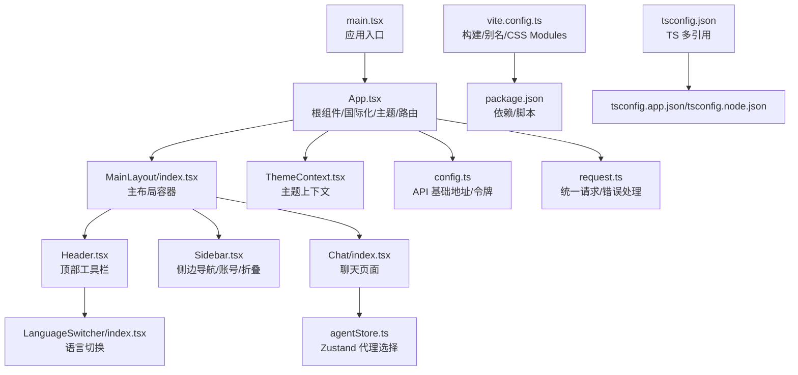
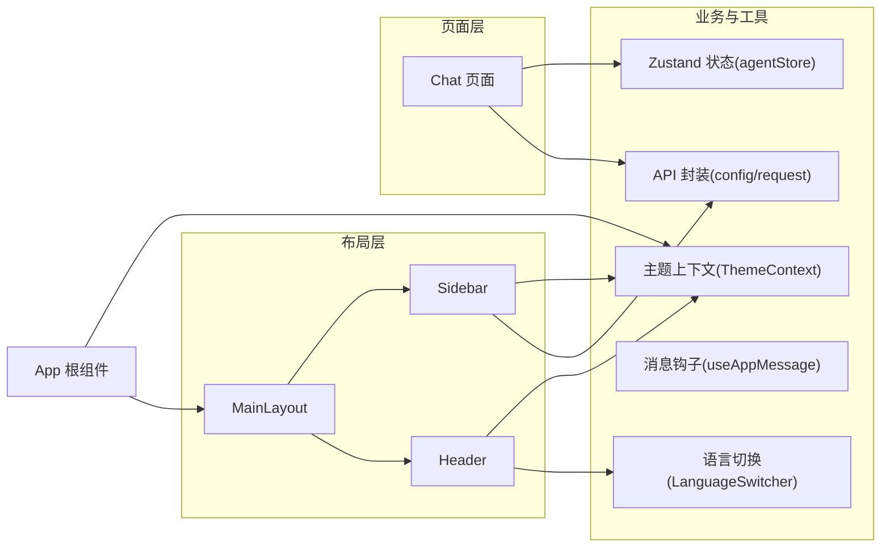
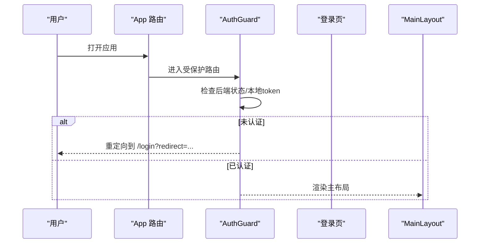
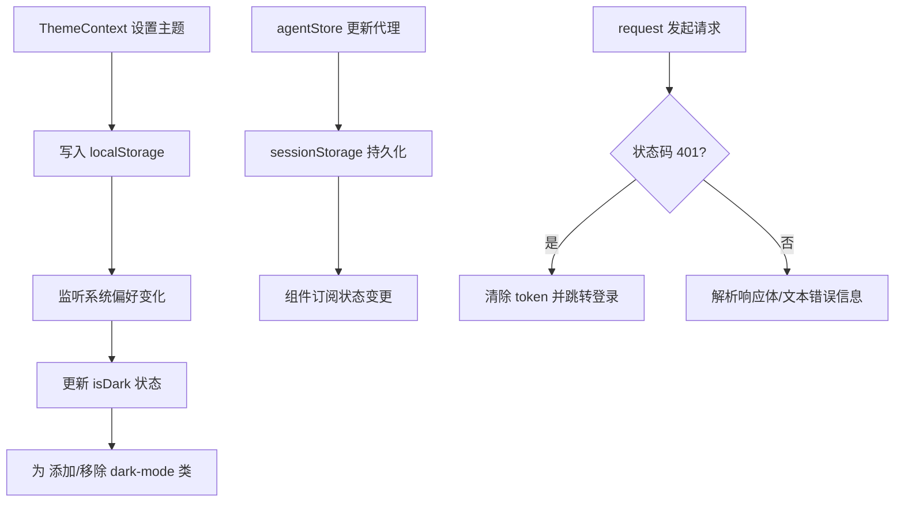
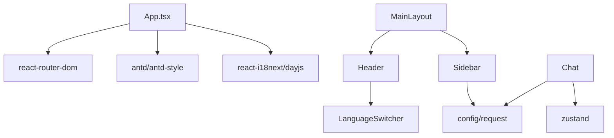

# 前端架构

<cite>
**本文引用的文件**
- [main.tsx](file://copaw/console/src/main.tsx)
- [App.tsx](file://copaw/console/src/App.tsx)
- [vite.config.ts](file://copaw/console/vite.config.ts)
- [package.json](file://copaw/console/package.json)
- [tsconfig.json](file://copaw/console/tsconfig.json)
- [MainLayout/index.tsx](file://copaw/console/src/layouts/MainLayout/index.tsx)
- [Header.tsx](file://copaw/console/src/layouts/Header.tsx)
- [Sidebar.tsx](file://copaw/console/src/layouts/Sidebar.tsx)
- [ThemeContext.tsx](file://copaw/console/src/contexts/ThemeContext.tsx)
- [agentStore.ts](file://copaw/console/src/stores/agentStore.ts)
- [Chat/index.tsx](file://copaw/console/src/pages/Chat/index.tsx)
- [config.ts](file://copaw/console/src/api/config.ts)
- [request.ts](file://copaw/console/src/api/request.ts)
- [useAppMessage.ts](file://copaw/console/src/hooks/useAppMessage.ts)
- [LanguageSwitcher/index.tsx](file://copaw/console/src/components/LanguageSwitcher/index.tsx)
</cite>

## 目录
1. [引言](#引言)
2. [项目结构](#项目结构)
3. [核心组件](#核心组件)
4. [架构总览](#架构总览)
5. [详细组件分析](#详细组件分析)
6. [依赖分析](#依赖分析)
7. [性能考虑](#性能考虑)
8. [故障排查指南](#故障排查指南)
9. [结论](#结论)
10. [附录](#附录)

## 引言
本文件面向前端架构与工程化实践，围绕 React 应用的组件分层（布局组件、页面组件、业务组件）、状态管理与数据流、路由与导航、UI 组件库设计与复用、构建配置与开发工具链、以及组件开发规范与样式管理最佳实践进行系统性梳理，并辅以图示与来源标注，帮助读者快速理解并高效迭代该控制台前端。

## 项目结构
- 入口与根组件：入口在 main.tsx 中挂载根组件 App.tsx；App 负责国际化、主题、路由与鉴权守卫。
- 布局层：MainLayout 将 Header、Sidebar 与内容区组合；Sidebar 提供导航菜单与账号操作；Header 提供顶部工具栏与版本更新提示。
- 页面层：各页面组件（如 Chat）负责具体业务交互与 UI 展示。
- 业务与工具层：API 模块封装请求与鉴权头；Zustand 状态存储；自定义 Hooks 提供横切能力；国际化与主题上下文贯穿全局。
- 构建与工具：Vite 配置、TypeScript 多项目引用、ESLint/Prettier 规范。

图表来源
- [main.tsx:1-31](file://copaw/console/src/main.tsx#L1-L31)
- [App.tsx:1-196](file://copaw/console/src/App.tsx#L1-L196)
- [MainLayout/index.tsx:1-89](file://copaw/console/src/layouts/MainLayout/index.tsx#L1-L89)
- [Header.tsx:1-291](file://copaw/console/src/layouts/Header.tsx#L1-L291)
- [Sidebar.tsx:1-516](file://copaw/console/src/layouts/Sidebar.tsx#L1-L516)
- [Chat/index.tsx:1-740](file://copaw/console/src/pages/Chat/index.tsx#L1-L740)
- [ThemeContext.tsx:1-105](file://copaw/console/src/contexts/ThemeContext.tsx#L1-L105)
- [agentStore.ts:1-73](file://copaw/console/src/stores/agentStore.ts#L1-L73)
- [config.ts:1-42](file://copaw/console/src/api/config.ts#L1-L42)
- [request.ts:1-117](file://copaw/console/src/api/request.ts#L1-L117)
- [LanguageSwitcher/index.tsx:1-69](file://copaw/console/src/components/LanguageSwitcher/index.tsx#L1-L69)
- [vite.config.ts:1-49](file://copaw/console/vite.config.ts#L1-L49)
- [package.json:1-60](file://copaw/console/package.json#L1-L60)
- [tsconfig.json:1-8](file://copaw/console/tsconfig.json#L1-L8)

章节来源
- [main.tsx:1-31](file://copaw/console/src/main.tsx#L1-L31)
- [App.tsx:1-196](file://copaw/console/src/App.tsx#L1-L196)
- [vite.config.ts:1-49](file://copaw/console/vite.config.ts#L1-L49)
- [package.json:1-60](file://copaw/console/package.json#L1-L60)
- [tsconfig.json:1-8](file://copaw/console/tsconfig.json#L1-L8)

## 核心组件
- 根组件与路由：App.tsx 使用 BrowserRouter、ConfigProvider、AntdApp 包裹，内置 AuthGuard 实现登录态校验与重定向；通过 basename 支持子路径部署。
- 主布局：MainLayout 聚合 Header、Sidebar 与内容区域，集中声明路由映射与默认跳转。
- 侧边导航：Sidebar 提供分组菜单、图标、折叠、账号弹窗与登出；KEY_TO_PATH/DEFAULT_OPEN_KEYS 控制菜单行为。
- 顶部 Header：Logo、版本徽章、文档/FAQ/GitHub 导航、语言切换、主题切换；支持更新公告弹窗与 Markdown 渲染。
- 聊天页面：Chat/index.tsx 内嵌第三方 WebUI 组件，集成会话管理、模型选择、附件上传、命令建议、取消/重连等。
- 主题上下文：ThemeContext 提供 light/dark/system 三态切换与持久化，自动监听系统偏好。
- 状态存储：agentStore 使用 Zustand + persist，基于 sessionStorage 存储代理列表与选中项。
- API 与请求：config.ts 提供 getApiUrl/getApiToken/set/clear；request.ts 统一封装 fetch、401 自动登出、错误消息提取。
- 国际化与消息：useAppMessage 获取 Antd App 上下文中的 message/modal/notification；LanguageSwitcher 切换语言并保存到本地。

章节来源
- [App.tsx:1-196](file://copaw/console/src/App.tsx#L1-L196)
- [MainLayout/index.tsx:1-89](file://copaw/console/src/layouts/MainLayout/index.tsx#L1-L89)
- [Sidebar.tsx:1-516](file://copaw/console/src/layouts/Sidebar.tsx#L1-L516)
- [Header.tsx:1-291](file://copaw/console/src/layouts/Header.tsx#L1-L291)
- [Chat/index.tsx:1-740](file://copaw/console/src/pages/Chat/index.tsx#L1-L740)
- [ThemeContext.tsx:1-105](file://copaw/console/src/contexts/ThemeContext.tsx#L1-L105)
- [agentStore.ts:1-73](file://copaw/console/src/stores/agentStore.ts#L1-L73)
- [config.ts:1-42](file://copaw/console/src/api/config.ts#L1-L42)
- [request.ts:1-117](file://copaw/console/src/api/request.ts#L1-L117)
- [useAppMessage.ts:1-16](file://copaw/console/src/hooks/useAppMessage.ts#L1-L16)
- [LanguageSwitcher/index.tsx:1-69](file://copaw/console/src/components/LanguageSwitcher/index.tsx#L1-L69)

## 架构总览
应用采用“布局-页面-业务”三层分层：
- 布局组件：MainLayout、Header、Sidebar，负责导航、主题、国际化与全局行为。
- 页面组件：Chat 等，承载具体业务逻辑与第三方 UI 集成。
- 业务组件：AgentSelector、ConsoleCronBubble、LanguageSwitcher、ThemeToggleButton 等，按功能拆分复用。
- 数据与状态：API 请求封装、Zustand 状态、主题上下文、国际化上下文贯穿全局。

图表来源
- [App.tsx:1-196](file://copaw/console/src/App.tsx#L1-L196)
- [MainLayout/index.tsx:1-89](file://copaw/console/src/layouts/MainLayout/index.tsx#L1-L89)
- [Header.tsx:1-291](file://copaw/console/src/layouts/Header.tsx#L1-L291)
- [Sidebar.tsx:1-516](file://copaw/console/src/layouts/Sidebar.tsx#L1-L516)
- [Chat/index.tsx:1-740](file://copaw/console/src/pages/Chat/index.tsx#L1-L740)
- [config.ts:1-42](file://copaw/console/src/api/config.ts#L1-L42)
- [request.ts:1-117](file://copaw/console/src/api/request.ts#L1-L117)
- [agentStore.ts:1-73](file://copaw/console/src/stores/agentStore.ts#L1-L73)
- [ThemeContext.tsx:1-105](file://copaw/console/src/contexts/ThemeContext.tsx#L1-L105)
- [useAppMessage.ts:1-16](file://copaw/console/src/hooks/useAppMessage.ts#L1-L16)
- [LanguageSwitcher/index.tsx:1-69](file://copaw/console/src/components/LanguageSwitcher/index.tsx#L1-L69)

## 详细组件分析

### 路由与导航
- 根路由与守卫：App.tsx 使用 BrowserRouter 并设置 basename；AuthGuard 在加载时检查后端状态与本地 token，未认证则重定向至登录页并携带 redirect 参数。
- 主布局路由：MainLayout 集中声明所有页面路由与默认跳转，使用 useLocation 计算当前选中菜单键值。
- 侧边导航：Sidebar 通过 KEY_TO_PATH 映射点击事件到具体路径，支持分组菜单与折叠模式。

图表来源
- [App.tsx:49-104](file://copaw/console/src/App.tsx#L49-L104)
- [App.tsx:170-180](file://copaw/console/src/App.tsx#L170-L180)
- [MainLayout/index.tsx:47-88](file://copaw/console/src/layouts/MainLayout/index.tsx#L47-L88)
- [Sidebar.tsx:391-394](file://copaw/console/src/layouts/Sidebar.tsx#L391-L394)

章节来源
- [App.tsx:106-108](file://copaw/console/src/App.tsx#L106-L108)
- [App.tsx:170-180](file://copaw/console/src/App.tsx#L170-L180)
- [MainLayout/index.tsx:27-45](file://copaw/console/src/layouts/MainLayout/index.tsx#L27-L45)
- [Sidebar.tsx:391-394](file://copaw/console/src/layouts/Sidebar.tsx#L391-L394)

### 状态管理与数据流
- 全局主题：ThemeContext 提供 themeMode/isDark/toggle/setThemeMode，持久化到 localStorage，并对 <html> 添加 dark-mode 类以驱动全局样式变量。
- 代理选择：agentStore 使用 persist + sessionStorage 存储 agents 列表与 selectedAgent，提供增删改查方法，便于跨组件共享。
- API 请求：request.ts 统一处理 401 自动清空 token 并跳转登录；错误消息从响应体 JSON 字段或纯文本中提取，提升可读性。
- 消息通知：useAppMessage 从 Antd App 上下文中获取 message/modal/notification，确保与 ConfigProvider 的前缀一致。

图表来源
- [ThemeContext.tsx:51-100](file://copaw/console/src/contexts/ThemeContext.tsx#L51-L100)
- [agentStore.ts:15-72](file://copaw/console/src/stores/agentStore.ts#L15-L72)
- [request.ts:74-104](file://copaw/console/src/api/request.ts#L74-L104)

章节来源
- [ThemeContext.tsx:13-49](file://copaw/console/src/contexts/ThemeContext.tsx#L13-L49)
- [agentStore.ts:15-72](file://copaw/console/src/stores/agentStore.ts#L15-L72)
- [request.ts:60-117](file://copaw/console/src/api/request.ts#L60-L117)
- [useAppMessage.ts:12-15](file://copaw/console/src/hooks/useAppMessage.ts#L12-L15)

### UI 组件库与复用模式
- 设计系统：App.tsx 使用 ConfigProvider 注入自定义主题与前缀，Antd 主题算法随主题模式切换；全局样式通过 createGlobalStyle 统一初始化。
- 图标与按钮：使用 @agentscope-ai/icons 与 @ant-design/icons，保持视觉一致性。
- 复用模式：Header、Sidebar、LanguageSwitcher、ThemeToggleButton 等作为独立组件在多处复用；Chat 页面通过 OptionsPanel 与第三方 WebUI 组件桥接，实现能力扩展与解耦。

章节来源
- [App.tsx:42-47](file://copaw/console/src/App.tsx#L42-L47)
- [App.tsx:154-168](file://copaw/console/src/App.tsx#L154-L168)
- [Header.tsx:18-23](file://copaw/console/src/layouts/Header.tsx#L18-L23)
- [Sidebar.tsx:38-42](file://copaw/console/src/layouts/Sidebar.tsx#L38-L42)
- [LanguageSwitcher/index.tsx:1-69](file://copaw/console/src/components/LanguageSwitcher/index.tsx#L1-L69)

### 构建配置与开发工具链
- Vite：启用 React 插件、CSS Modules（驼峰命名、哈希生成）、Less 启用 JS 支持、路径别名 @ 指向 src；define 注入环境常量；optimizeDeps include 依赖。
- TypeScript：多引用配置（tsconfig.app.json/tsconfig.node.json），分别约束应用与 Node 工具链编译目标。
- 依赖与脚本：React、Ant Design、Antd-style、Day.js、i18n、Zustand、@agentscope-ai/* 等；提供 dev/build/lint/format 等常用脚本。

章节来源
- [vite.config.ts:1-49](file://copaw/console/vite.config.ts#L1-L49)
- [package.json:1-60](file://copaw/console/package.json#L1-L60)
- [tsconfig.json:1-8](file://copaw/console/tsconfig.json#L1-L8)

### 组件开发规范与样式管理
- 组件职责单一：Header/Sidebar/MainLayout 分离导航、头部与布局容器；Chat 专注聊天交互。
- 样式隔离：CSS Modules 与 Less 结合，命名采用 camelCase 与哈希，避免冲突；全局样式通过 createGlobalStyle 初始化。
- 国际化与主题：统一通过 i18n 与 ThemeContext 管理语言与主题，避免硬编码字符串与颜色值。
- 错误与可访问性：request.ts 对非 JSON 响应与 401 场景进行健壮处理；Header 的更新弹窗支持 Markdown 渲染与复制代码块。

章节来源
- [vite.config.ts:18-27](file://copaw/console/vite.config.ts#L18-L27)
- [App.tsx:42-47](file://copaw/console/src/App.tsx#L42-L47)
- [request.ts:74-104](file://copaw/console/src/api/request.ts#L74-L104)
- [Header.tsx:260-287](file://copaw/console/src/layouts/Header.tsx#L260-L287)

## 依赖分析
- 组件耦合：App.tsx 作为根，依赖 ThemeContext、路由与 API；MainLayout 依赖 Header/Sidebar；Chat 依赖 API、Zustand 与第三方 UI。
- 外部依赖：Ant Design、Antd-style、Day.js、i18next、Zustand、@agentscope-ai/*；构建链路由 Vite/React/ESLint/Prettier/TSC 组成。
- 循环依赖：当前结构未见明显循环依赖；若新增组件需避免相互 import。

图表来源
- [App.tsx:1-196](file://copaw/console/src/App.tsx#L1-L196)
- [MainLayout/index.tsx:1-89](file://copaw/console/src/layouts/MainLayout/index.tsx#L1-L89)
- [Header.tsx:1-291](file://copaw/console/src/layouts/Header.tsx#L1-L291)
- [Sidebar.tsx:1-516](file://copaw/console/src/layouts/Sidebar.tsx#L1-L516)
- [Chat/index.tsx:1-740](file://copaw/console/src/pages/Chat/index.tsx#L1-L740)
- [config.ts:1-42](file://copaw/console/src/api/config.ts#L1-L42)
- [request.ts:1-117](file://copaw/console/src/api/request.ts#L1-L117)
- [agentStore.ts:1-73](file://copaw/console/src/stores/agentStore.ts#L1-L73)
- [LanguageSwitcher/index.tsx:1-69](file://copaw/console/src/components/LanguageSwitcher/index.tsx#L1-L69)

章节来源
- [package.json:18-57](file://copaw/console/package.json#L18-L57)

## 性能考虑
- 依赖预优化：vite.config.ts 中 optimizeDeps.include 预构建 diff，减少冷启动时间。
- 状态持久化：agentStore 使用 sessionStorage，避免刷新丢失；ThemeContext 使用 localStorage，减少重复计算。
- 请求健壮性：request.ts 对 401 自动登出，避免无效重试；错误消息提取减少二次解析成本。
- 样式隔离：CSS Modules 与 Less 编译期处理，降低运行时样式冲突与回流。

章节来源
- [vite.config.ts:38-40](file://copaw/console/vite.config.ts#L38-L40)
- [agentStore.ts:47-69](file://copaw/console/src/stores/agentStore.ts#L47-L69)
- [request.ts:74-104](file://copaw/console/src/api/request.ts#L74-L104)

## 故障排查指南
- 登录态异常
  - 现象：进入受保护路由被重定向到登录页。
  - 排查：检查本地是否存在 token；确认后端 /auth/verify 返回是否 200；查看 AuthGuard 加载状态与 clearAuthToken 行为。
  - 参考
    - [App.tsx:49-104](file://copaw/console/src/App.tsx#L49-L104)
    - [config.ts:23-41](file://copaw/console/src/api/config.ts#L23-L41)
- 请求失败
  - 现象：接口报错或 401。
  - 排查：确认 getApiUrl 与 VITE_API_BASE_URL；检查 request.ts 的错误消息提取逻辑；关注 401 自动登出分支。
  - 参考
    - [config.ts:11-16](file://copaw/console/src/api/config.ts#L11-L16)
    - [request.ts:60-117](file://copaw/console/src/api/request.ts#L60-L117)
- 主题不生效
  - 现象：切换主题后样式未更新。
  - 排查：确认 ThemeContext 是否正确写入 localStorage 与 <html> 类名；检查系统偏好监听与 isDark 解析。
  - 参考
    - [ThemeContext.tsx:51-100](file://copaw/console/src/contexts/ThemeContext.tsx#L51-L100)
- 语言切换无效
  - 现象：切换语言后未持久化或未同步到后端。
  - 排查：检查 LanguageSwitcher 的 changeLanguage 流程与 languageApi.updateLanguage 调用。
  - 参考
    - [LanguageSwitcher/index.tsx:19-27](file://copaw/console/src/components/LanguageSwitcher/index.tsx#L19-L27)

章节来源
- [App.tsx:49-104](file://copaw/console/src/App.tsx#L49-L104)
- [config.ts:11-16](file://copaw/console/src/api/config.ts#L11-L16)
- [request.ts:60-117](file://copaw/console/src/api/request.ts#L60-L117)
- [ThemeContext.tsx:51-100](file://copaw/console/src/contexts/ThemeContext.tsx#L51-L100)
- [LanguageSwitcher/index.tsx:19-27](file://copaw/console/src/components/LanguageSwitcher/index.tsx#L19-L27)

## 结论
该前端架构以清晰的分层与模块化设计为核心，结合主题与国际化上下文、Zustand 状态与统一 API 请求封装，形成高内聚、低耦合的组件体系。路由守卫与布局容器保证了导航与安全；第三方 UI 组件桥接提升了扩展性。配合 Vite/TS/ESLint/Prettier 工具链，具备良好的开发体验与可维护性。

## 附录
- 开发与构建
  - 启动：npm run dev
  - 构建：npm run build / build:prod / build:test
  - 预览：npm run preview / preview:prod / preview:test
  - 代码格式：npm run format / format:check
  - 代码检查：npm run lint
- 关键路径参考
  - [main.tsx:1-31](file://copaw/console/src/main.tsx#L1-L31)
  - [App.tsx:1-196](file://copaw/console/src/App.tsx#L1-L196)
  - [vite.config.ts:1-49](file://copaw/console/vite.config.ts#L1-L49)
  - [package.json:6-16](file://copaw/console/package.json#L6-L16)