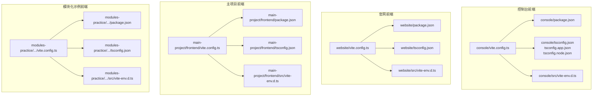
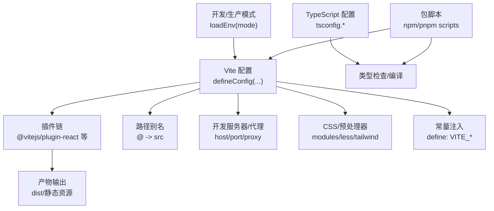
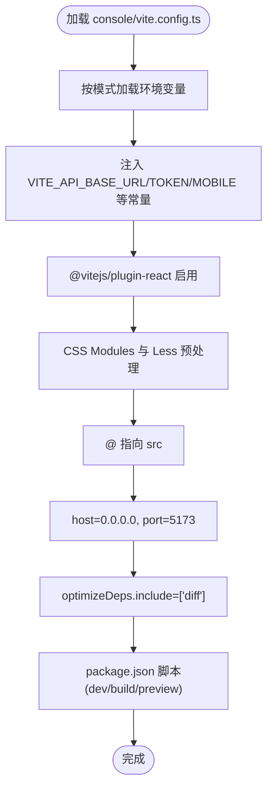
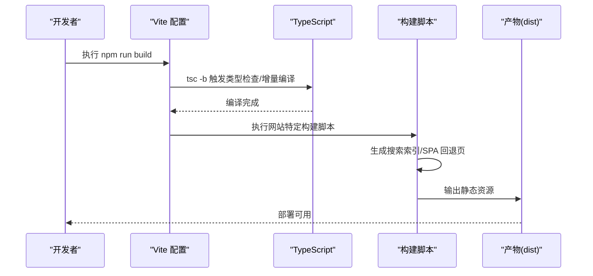
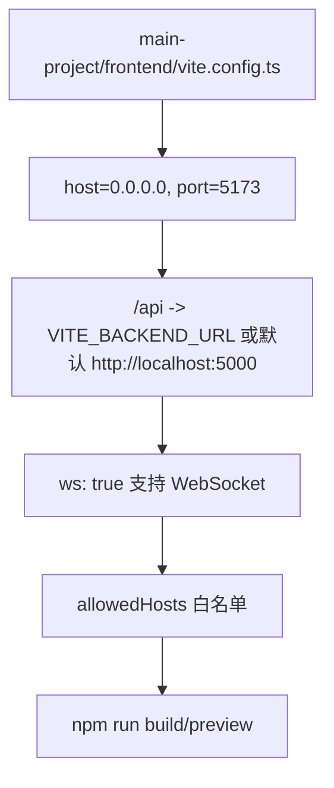
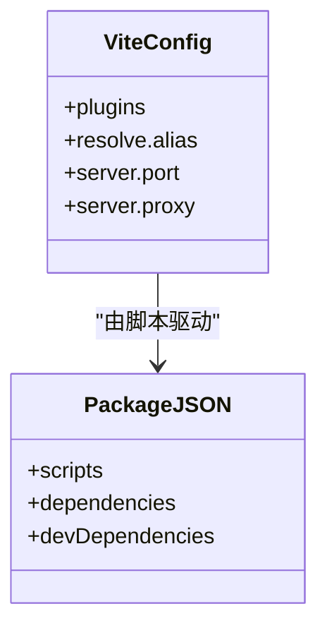
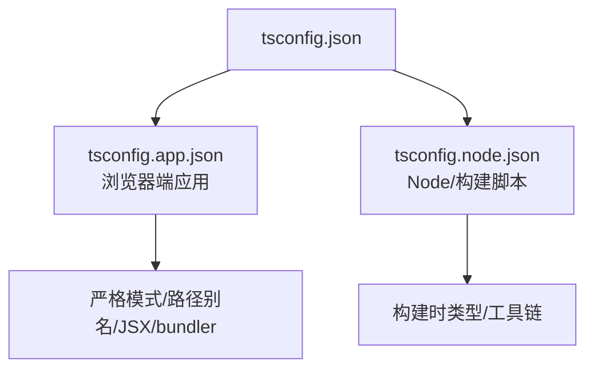
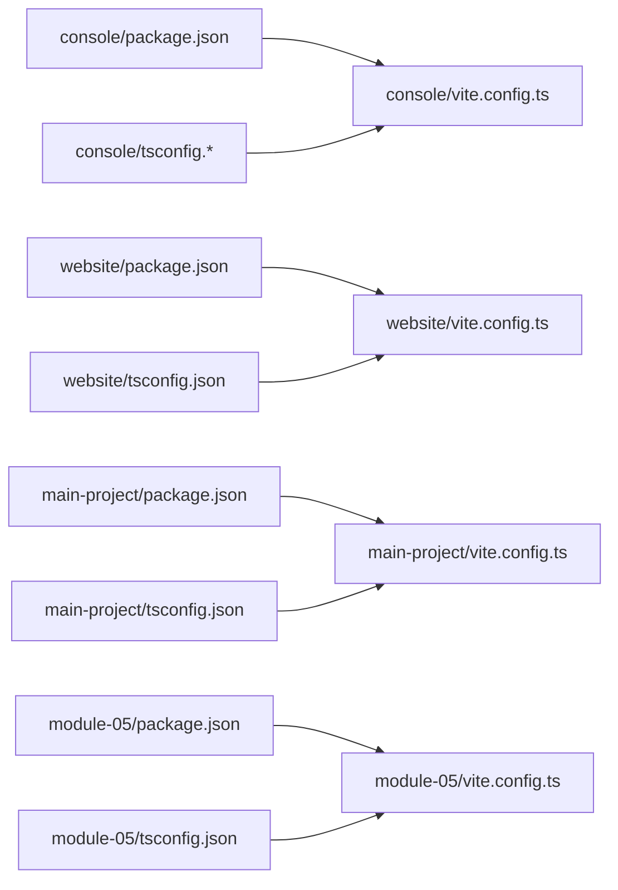

# 构建配置

<cite>
**本文引用的文件**
- [copaw/console/vite.config.ts](file://copaw/console/vite.config.ts)
- [copaw/website/vite.config.ts](file://copaw/website/vite.config.ts)
- [main-project/frontend/vite.config.ts](file://main-project/frontend/vite.config.ts)
- [modules-practice/module-05/frontend/vite.config.ts](file://modules-practice/module-05/frontend/vite.config.ts)
- [copaw/console/package.json](file://copaw/console/package.json)
- [copaw/website/package.json](file://copaw/website/package.json)
- [main-project/frontend/package.json](file://main-project/frontend/package.json)
- [modules-practice/module-05/frontend/package.json](file://modules-practice/module-05/frontend/package.json)
- [copaw/console/tsconfig.json](file://copaw/console/tsconfig.json)
- [copaw/console/tsconfig.app.json](file://copaw/console/tsconfig.app.json)
- [copaw/console/tsconfig.node.json](file://copaw/console/tsconfig.node.json)
- [copaw/website/tsconfig.json](file://copaw/website/tsconfig.json)
- [main-project/frontend/tsconfig.json](file://main-project/frontend/tsconfig.json)
- [modules-practice/module-05/frontend/tsconfig.json](file://modules-practice/module-05/frontend/tsconfig.json)
- [copaw/console/src/vite-env.d.ts](file://copaw/console/src/vite-env.d.ts)
- [copaw/website/src/vite-env.d.ts](file://copaw/website/src/vite-env.d.ts)
- [main-project/frontend/src/vite-env.d.ts](file://main-project/frontend/src/vite-env.d.ts)
- [modules-practice/module-05/frontend/src/vite-env.d.ts](file://modules-practice/module-05/frontend/src/vite-env.d.ts)
</cite>

## 目录
1. [简介](#简介)
2. [项目结构](#项目结构)
3. [核心组件](#核心组件)
4. [架构总览](#架构总览)
5. [详细组件分析](#详细组件分析)
6. [依赖关系分析](#依赖关系分析)
7. [性能考虑](#性能考虑)
8. [故障排查指南](#故障排查指南)
9. [结论](#结论)
10. [附录](#附录)

## 简介
本文件面向构建配置系统，围绕 Vite 构建工具在不同前端子项目的配置与优化策略进行系统化梳理，涵盖开发服务器配置、构建输出与性能优化、TypeScript 类型检查策略、包管理与依赖管理最佳实践、环境变量与构建脚本管理，以及开发与生产环境的差异化配置方案，并提供可落地的优化技巧与部署建议。

## 项目结构
本仓库包含多个前端子项目，每个子项目均采用 Vite 作为构建工具，并辅以 TypeScript 进行类型检查与编译。各子项目在构建配置上体现出统一的工程化思路：通过插件体系扩展能力、通过路径别名提升可维护性、通过环境变量注入实现差异化配置、通过脚本命令实现标准化的开发与发布流程。

图表来源
- [copaw/console/vite.config.ts:1-49](file://copaw/console/vite.config.ts#L1-L49)
- [copaw/website/vite.config.ts:1-20](file://copaw/website/vite.config.ts#L1-L20)
- [main-project/frontend/vite.config.ts:1-26](file://main-project/frontend/vite.config.ts#L1-L26)
- [modules-practice/module-05/frontend/vite.config.ts:1-23](file://modules-practice/module-05/frontend/vite.config.ts#L1-L23)

章节来源
- [copaw/console/vite.config.ts:1-49](file://copaw/console/vite.config.ts#L1-L49)
- [copaw/website/vite.config.ts:1-20](file://copaw/website/vite.config.ts#L1-L20)
- [main-project/frontend/vite.config.ts:1-26](file://main-project/frontend/vite.config.ts#L1-L26)
- [modules-practice/module-05/frontend/vite.config.ts:1-23](file://modules-practice/module-05/frontend/vite.config.ts#L1-L23)

## 核心组件
- Vite 配置层：统一使用 defineConfig 暴露函数式配置，按模式加载环境变量，注入常量，配置插件、CSS、路径别名、开发服务器与代理等。
- TypeScript 配置层：采用分层 tsconfig（应用与 Node）或单文件 tsconfig，启用严格模式与 bundler 模式解析，配合路径别名与类型声明。
- 包管理与脚本层：通过 npm/pnpm 脚本统一入口，支持 dev/build/preview/lint/format 等常用任务。
- 环境变量与类型声明：在 vite-env.d.ts 中声明 ImportMetaEnv 接口，确保类型安全地消费 Vite 注入的环境变量。

章节来源
- [copaw/console/tsconfig.json:1-8](file://copaw/console/tsconfig.json#L1-L8)
- [copaw/console/tsconfig.app.json:1-31](file://copaw/console/tsconfig.app.json#L1-L31)
- [copaw/console/tsconfig.node.json:1-23](file://copaw/console/tsconfig.node.json#L1-L23)
- [copaw/website/tsconfig.json:1-26](file://copaw/website/tsconfig.json#L1-L26)
- [main-project/frontend/tsconfig.json:1-17](file://main-project/frontend/tsconfig.json#L1-L17)
- [modules-practice/module-05/frontend/tsconfig.json:1-32](file://modules-practice/module-05/frontend/tsconfig.json#L1-L32)
- [copaw/console/src/vite-env.d.ts:1-21](file://copaw/console/src/vite-env.d.ts#L1-L21)
- [copaw/website/src/vite-env.d.ts:1-2](file://copaw/website/src/vite-env.d.ts#L1-L2)
- [main-project/frontend/src/vite-env.d.ts:1-2](file://main-project/frontend/src/vite-env.d.ts#L1-L2)
- [modules-practice/module-05/frontend/src/vite-env.d.ts:1-12](file://modules-practice/module-05/frontend/src/vite-env.d.ts#L1-L12)

## 架构总览
下图展示了各子项目在构建阶段的关键交互：Vite 读取配置并加载环境变量，调用插件链处理资源，最终产出静态资源；TypeScript 在构建前进行类型检查与编译；包脚本统一调度上述流程。

图表来源
- [copaw/console/vite.config.ts:5-48](file://copaw/console/vite.config.ts#L5-L48)
- [copaw/website/vite.config.ts:6-19](file://copaw/website/vite.config.ts#L6-L19)
- [main-project/frontend/vite.config.ts:4-25](file://main-project/frontend/vite.config.ts#L4-L25)
- [modules-practice/module-05/frontend/vite.config.ts:1-23](file://modules-practice/module-05/frontend/vite.config.ts#L1-L23)
- [copaw/console/tsconfig.app.json:1-31](file://copaw/console/tsconfig.app.json#L1-L31)
- [copaw/website/tsconfig.json:1-26](file://copaw/website/tsconfig.json#L1-L26)
- [main-project/frontend/tsconfig.json:1-17](file://main-project/frontend/tsconfig.json#L1-L17)
- [modules-practice/module-05/frontend/tsconfig.json:1-32](file://modules-practice/module-05/frontend/tsconfig.json#L1-L32)

## 详细组件分析

### 控制台前端（console）
- 开发服务器与代理
  - 统一监听 0.0.0.0，端口 5173，便于容器或跨设备访问。
  - 通过 VITE_API_BASE_URL 注入 API 基础地址，支持空字符串表示同源直连。
- 插件与样式
  - 使用 @vitejs/plugin-react，启用 CSS Modules 并自定义作用域命名规则，开启 Less 支持。
- 路径别名与依赖优化
  - 别名 @ 指向 src，提升导入可读性。
  - optimizeDeps.include 显式声明需要预打包的依赖，减少冷启动时间。
- 构建脚本
  - 提供 dev/build/preview 及格式化、Lint 等脚本，支持 production/test 模式参数。

图表来源
- [copaw/console/vite.config.ts:5-48](file://copaw/console/vite.config.ts#L5-L48)
- [copaw/console/package.json:6-16](file://copaw/console/package.json#L6-L16)

章节来源
- [copaw/console/vite.config.ts:1-49](file://copaw/console/vite.config.ts#L1-L49)
- [copaw/console/package.json:1-60](file://copaw/console/package.json#L1-L60)

### 官网前端（website）
- 环境变量与基础路径
  - 通过 VITE_BASE_PATH 控制构建基础路径，默认 “/”，便于部署到子路径场景。
- 插件生态
  - React 插件与 TailwindCSS 插件组合，满足站点风格与主题需求。
- 路径别名
  - 别名 @ 指向 src，简化导入路径。
- 构建流程
  - 在标准构建前执行搜索索引生成与 SPA 回退页面生成脚本，增强 SEO 与路由兼容性。

图表来源
- [copaw/website/vite.config.ts:6-19](file://copaw/website/vite.config.ts#L6-L19)
- [copaw/website/package.json:5-11](file://copaw/website/package.json#L5-L11)

章节来源
- [copaw/website/vite.config.ts:1-20](file://copaw/website/vite.config.ts#L1-L20)
- [copaw/website/package.json:1-51](file://copaw/website/package.json#L1-L51)

### 主项目前端（main-project/frontend）
- 代理与后端集成
  - 通过 /api 代理到后端服务，支持 WebSocket，允许指定 allowedHosts，提升联调安全性。
- 开发体验
  - host=0.0.0.0，port=5173，便于多端访问与容器化运行。
- 构建脚本
  - 最简脚本集合，聚焦 build/preview，适合轻量级前端。

图表来源
- [main-project/frontend/vite.config.ts:4-25](file://main-project/frontend/vite.config.ts#L4-L25)
- [main-project/frontend/package.json:6-10](file://main-project/frontend/package.json#L6-L10)

章节来源
- [main-project/frontend/vite.config.ts:1-26](file://main-project/frontend/vite.config.ts#L1-L26)
- [main-project/frontend/package.json:1-25](file://main-project/frontend/package.json#L1-L25)

### 模块化示例前端（modules-practice/module-05/frontend）
- 基础配置
  - 使用 @vitejs/plugin-react，设置 @ 指向 src，端口 3000。
  - 配置 /api 代理至本地后端，便于模块化联调。
- 类型与路径别名
  - 采用 bundler 模式解析，启用 strict 与 unused 相关规则，路径别名与 console/模块一致。

图表来源
- [modules-practice/module-05/frontend/vite.config.ts:1-23](file://modules-practice/module-05/frontend/vite.config.ts#L1-L23)
- [modules-practice/module-05/frontend/package.json:1-36](file://modules-practice/module-05/frontend/package.json#L1-L36)

章节来源
- [modules-practice/module-05/frontend/vite.config.ts:1-23](file://modules-practice/module-05/frontend/vite.config.ts#L1-L23)
- [modules-practice/module-05/frontend/package.json:1-36](file://modules-practice/module-05/frontend/package.json#L1-L36)

### TypeScript 配置与类型检查策略
- 分层 tsconfig（console）
  - 顶层 tsconfig.json 通过 references 引用应用与 Node 两套配置，分别覆盖浏览器端与构建时配置。
  - 应用配置启用严格模式、路径别名、bundler 解析与 JSX，Node 配置聚焦构建脚本与工具链类型。
- 单文件 tsconfig（website/main-project/modules-practice）
  - 采用单一 tsconfig.json，启用 bundler 模式、严格规则与路径别名，确保类型安全与模块解析一致性。

图表来源
- [copaw/console/tsconfig.json:1-8](file://copaw/console/tsconfig.json#L1-L8)
- [copaw/console/tsconfig.app.json:1-31](file://copaw/console/tsconfig.app.json#L1-L31)
- [copaw/console/tsconfig.node.json:1-23](file://copaw/console/tsconfig.node.json#L1-L23)

章节来源
- [copaw/console/tsconfig.json:1-8](file://copaw/console/tsconfig.json#L1-L8)
- [copaw/console/tsconfig.app.json:1-31](file://copaw/console/tsconfig.app.json#L1-L31)
- [copaw/console/tsconfig.node.json:1-23](file://copaw/console/tsconfig.node.json#L1-L23)
- [copaw/website/tsconfig.json:1-26](file://copaw/website/tsconfig.json#L1-L26)
- [main-project/frontend/tsconfig.json:1-17](file://main-project/frontend/tsconfig.json#L1-L17)
- [modules-practice/module-05/frontend/tsconfig.json:1-32](file://modules-practice/module-05/frontend/tsconfig.json#L1-L32)

### 包管理与依赖管理最佳实践
- 依赖分层
  - 生产依赖集中在 package.json 的 dependencies 字段，开发依赖集中在 devDependencies。
  - 保持对 Vite、React 插件、TypeScript、TailwindCSS 等核心工具的版本对齐，避免解析冲突。
- 脚本标准化
  - 统一使用 npm/pnpm 脚本入口，明确 dev/build/preview/lint/format 等职责边界。
  - 控制台与官网在构建前增加类型检查与专用构建步骤，确保质量门禁。

章节来源
- [copaw/console/package.json:1-60](file://copaw/console/package.json#L1-L60)
- [copaw/website/package.json:1-51](file://copaw/website/package.json#L1-L51)
- [main-project/frontend/package.json:1-25](file://main-project/frontend/package.json#L1-L25)
- [modules-practice/module-05/frontend/package.json:1-36](file://modules-practice/module-05/frontend/package.json#L1-L36)

### 环境变量与构建脚本管理
- 环境变量注入
  - 通过 define 字段将 VITE_* 注入客户端代码，避免硬编码，支持运行时切换。
  - 控制台显式注入 TOKEN、MOBILE 等常量，官网通过 VITE_BASE_PATH 控制基础路径。
- 类型安全声明
  - 在 vite-env.d.ts 中声明 ImportMetaEnv 接口，确保 IDE 提示与编译期校验。
- 构建脚本
  - 控制台提供 dev/build/preview 及格式化/Lint 脚本，支持 production/test 模式。
  - 官网在构建前执行搜索索引与回退页生成脚本，增强站点可用性。

章节来源
- [copaw/console/vite.config.ts:11-16](file://copaw/console/vite.config.ts#L11-L16)
- [copaw/website/vite.config.ts:17-18](file://copaw/website/vite.config.ts#L17-L18)
- [copaw/console/src/vite-env.d.ts:3-11](file://copaw/console/src/vite-env.d.ts#L3-L11)
- [modules-practice/module-05/frontend/src/vite-env.d.ts:3-11](file://modules-practice/module-05/frontend/src/vite-env.d.ts#L3-L11)
- [copaw/console/package.json:6-16](file://copaw/console/package.json#L6-L16)
- [copaw/website/package.json:5-11](file://copaw/website/package.json#L5-L11)

### 开发与生产环境差异化配置
- 开发环境
  - host=0.0.0.0，便于容器/局域网访问；端口统一；代理到后端；严格日志与热更新。
- 生产环境
  - 通过 --mode production 传参，结合 define 注入的 VITE_* 实现运行时差异化行为。
  - 控制台与官网在构建脚本中显式传入 --mode，确保产物与行为一致。

章节来源
- [copaw/console/vite.config.ts:34-37](file://copaw/console/vite.config.ts#L34-L37)
- [main-project/frontend/vite.config.ts:12-22](file://main-project/frontend/vite.config.ts#L12-L22)
- [copaw/console/package.json:9-10](file://copaw/console/package.json#L9-L10)
- [copaw/website/package.json:7-7](file://copaw/website/package.json#L7-L7)

## 依赖关系分析
- 配置耦合
  - 各子项目均依赖 @vitejs/plugin-react，部分项目引入 TailwindCSS 插件。
  - 路径别名 @ 与 tsconfig 的 paths 保持一致，避免导入歧义。
- 外部依赖
  - 控制台引入 antd、react-i18next、zustand 等 UI 与状态管理库；官网引入 mermaid、tailwind 等站点特性库。
- 构建链路
  - 控制台与官网在构建前执行 tsc -b，确保类型安全；官网额外执行站点构建脚本。

图表来源
- [copaw/console/package.json:1-60](file://copaw/console/package.json#L1-L60)
- [copaw/website/package.json:1-51](file://copaw/website/package.json#L1-L51)
- [main-project/frontend/package.json:1-25](file://main-project/frontend/package.json#L1-L25)
- [modules-practice/module-05/frontend/package.json:1-36](file://modules-practice/module-05/frontend/package.json#L1-L36)
- [copaw/console/tsconfig.app.json:25-27](file://copaw/console/tsconfig.app.json#L25-L27)
- [copaw/website/tsconfig.json:15-17](file://copaw/website/tsconfig.json#L15-L17)
- [main-project/frontend/tsconfig.json:1-17](file://main-project/frontend/tsconfig.json#L1-L17)
- [modules-practice/module-05/frontend/tsconfig.json:24-27](file://modules-practice/module-05/frontend/tsconfig.json#L24-L27)

章节来源
- [copaw/console/package.json:1-60](file://copaw/console/package.json#L1-L60)
- [copaw/website/package.json:1-51](file://copaw/website/package.json#L1-L51)
- [main-project/frontend/package.json:1-25](file://main-project/frontend/package.json#L1-L25)
- [modules-practice/module-05/frontend/package.json:1-36](file://modules-practice/module-05/frontend/package.json#L1-L36)
- [copaw/console/tsconfig.app.json:25-27](file://copaw/console/tsconfig.app.json#L25-L27)
- [copaw/website/tsconfig.json:15-17](file://copaw/website/tsconfig.json#L15-L17)
- [main-project/frontend/tsconfig.json:1-17](file://main-project/frontend/tsconfig.json#L1-L17)
- [modules-practice/module-05/frontend/tsconfig.json:24-27](file://modules-practice/module-05/frontend/tsconfig.json#L24-L27)

## 性能考虑
- 依赖预打包与预优化
  - 控制台通过 optimizeDeps.include 显式声明 diff，降低冷启动与首屏等待。
- 构建前类型检查
  - 控制台与官网在构建前执行 tsc -b，提前发现类型问题，减少运行时错误。
- CSS 与样式模块
  - 控制台启用 CSS Modules 与 Less，有助于作用域隔离与按需加载。
- 代理与网络
  - 主项目前端通过代理与 allowedHosts 限制，减少跨域与无效请求，提升开发稳定性。

章节来源
- [copaw/console/vite.config.ts:38-40](file://copaw/console/vite.config.ts#L38-L40)
- [copaw/console/package.json:8-8](file://copaw/console/package.json#L8-L8)
- [copaw/website/package.json:7-7](file://copaw/website/package.json#L7-L7)
- [main-project/frontend/vite.config.ts:16-22](file://main-project/frontend/vite.config.ts#L16-L22)

## 故障排查指南
- 环境变量未生效
  - 确认是否使用 VITE_ 前缀，是否在 define 中注入，是否在 vite-env.d.ts 中声明接口。
- 路径别名导入失败
  - 检查 tsconfig.json 与 vite.config.ts 的 @ 别名是否一致，确保 include 覆盖到 src。
- 代理不生效或跨域
  - 核对 /api 代理目标、changeOrigin、ws 设置，确认 allowedHosts 是否包含当前域名。
- 类型检查报错
  - 先执行 tsc -b 独立验证，再进行构建；关注 strict、unused、switch 相关规则。
- 构建后页面空白或路由异常
  - 官网需确认构建脚本是否执行了搜索索引与回退页生成步骤。

章节来源
- [copaw/console/vite.config.ts:11-16](file://copaw/console/vite.config.ts#L11-L16)
- [copaw/website/vite.config.ts:17-18](file://copaw/website/vite.config.ts#L17-L18)
- [copaw/console/src/vite-env.d.ts:3-11](file://copaw/console/src/vite-env.d.ts#L3-L11)
- [modules-practice/module-05/frontend/src/vite-env.d.ts:3-11](file://modules-practice/module-05/frontend/src/vite-env.d.ts#L3-L11)
- [copaw/website/package.json:7-7](file://copaw/website/package.json#L7-L7)

## 结论
本仓库在构建配置层面体现了“统一入口、分层配置、类型优先、脚本标准化”的工程化理念。通过 Vite 的灵活配置与 TypeScript 的严格约束，结合包脚本与环境变量管理，实现了从开发到生产的高效闭环。建议在后续迭代中持续完善模式化配置（如 production/test），并在 CI 中固化类型检查与格式化步骤，进一步提升交付质量与可维护性。

## 附录
- 建议的构建优化清单
  - 显式列出 optimizeDeps.include，减少冷启动。
  - 在 CI 中增加 tsc -b 与 Lint 步骤，前置质量门禁。
  - 对于多入口/多站点场景，拆分 tsconfig 与 vite.config，避免相互干扰。
  - 使用 VITE_* 注入运行时配置，避免硬编码与重复构建。