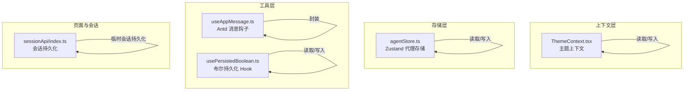
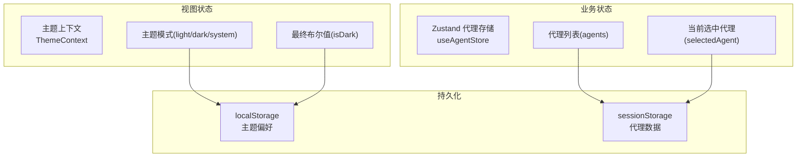
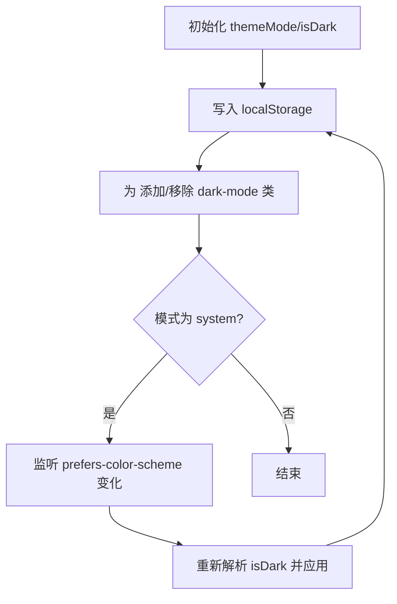
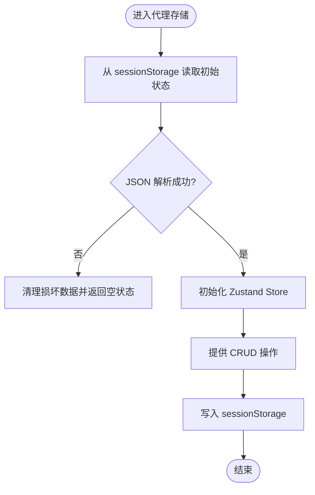
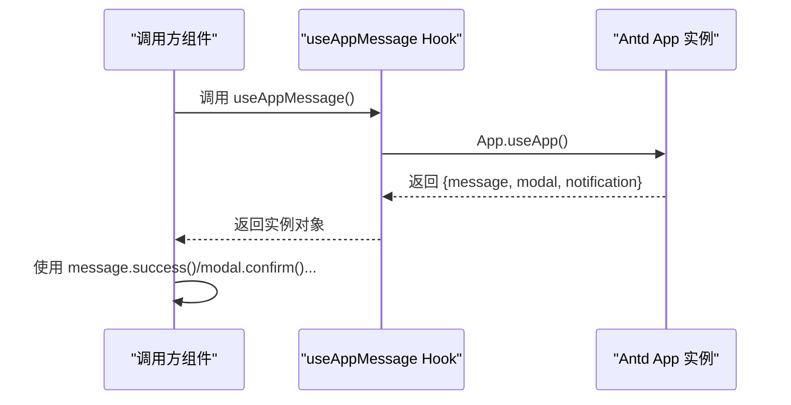
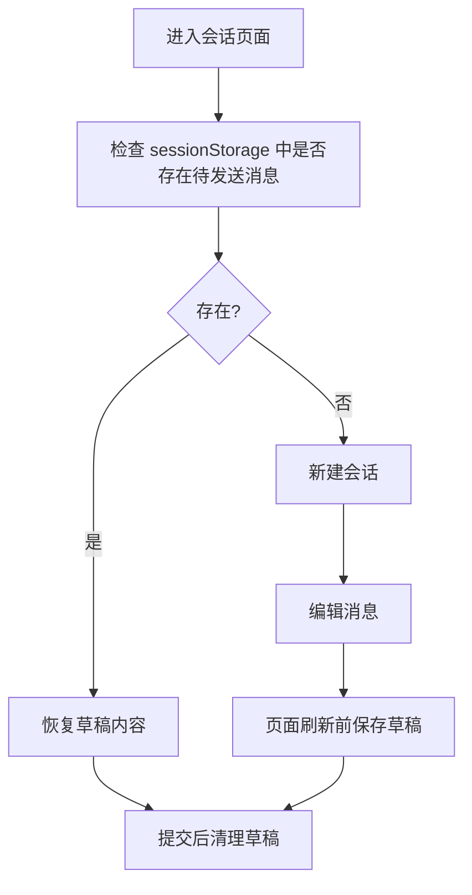
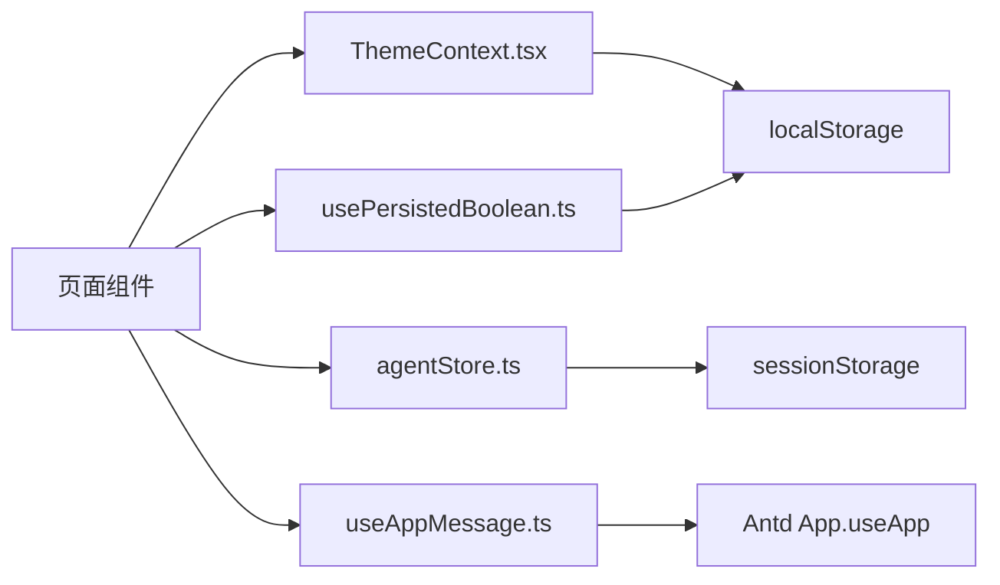

# 状态管理

<cite>
**本文引用的文件**
- [ThemeContext.tsx](file://copaw/console/src/contexts/ThemeContext.tsx)
- [agentStore.ts](file://copaw/console/src/stores/agentStore.ts)
- [useAppMessage.ts](file://copaw/console/src/hooks/useAppMessage.ts)
- [usePersistedBoolean.ts](file://main-project/frontend/src/hooks/usePersistedBoolean.ts)
- [状态管理.md](file://specs/copaw-repowiki/content/系统架构/前端架构设计/状态管理.md)
- [frontend-coding.md](file://specs/workshop/module-03-knowledge-copaw/docs/standards/frontend-coding.md)
- [index.ts](file://copaw/console/src/pages/Chat/sessionApi/index.ts)
</cite>

## 目录
1. [简介](#简介)
2. [项目结构](#项目结构)
3. [核心组件](#核心组件)
4. [架构总览](#架构总览)
5. [详细组件分析](#详细组件分析)
6. [依赖关系分析](#依赖关系分析)
7. [性能考量](#性能考量)
8. [故障排查指南](#故障排查指南)
9. [结论](#结论)
10. [附录](#附录)

## 简介
本文件系统化梳理 CoPaw 前端的状态管理方案，覆盖以下关键点：
- 设计模式：局部状态使用 useState；跨组件共享使用 Context API；复杂全局状态使用 Zustand；持久化采用浏览器存储（localStorage/sessionStorage）。
- 全局状态与局部状态划分原则：仅在多组件共享且需要稳定订阅时使用 Context/Zustand；否则优先局部状态。
- 持久化与数据同步：主题偏好与代理列表分别持久化至 localStorage 与 sessionStorage，并在初始化时读取；变更时同步写入。
- 性能优化与内存管理：Zustand 默认浅比较，避免不必要的重渲染；派生 set 函数；批量更新代理列表；对存储异常进行容错与清理。
- 最佳实践与常见陷阱：统一 Hook 抽象（如 useAppMessage）、防抖与节流、避免在渲染期间执行副作用、合理拆分状态。

## 项目结构
前端状态管理主要分布在三处：
- 上下文层：主题上下文 ThemeContext 提供主题模式与切换能力，并持久化到 localStorage。
- 存储层：Zustand 代理存储 useAgentStore 提供代理列表与选中项的全局状态，并持久化到 sessionStorage。
- 工具层：通用 Hook 如 useAppMessage、usePersistedBoolean 提供跨页面复用的状态抽象与持久化布尔值。

图表来源
- [ThemeContext.tsx:1-105](file://copaw/console/src/contexts/ThemeContext.tsx#L1-L105)
- [agentStore.ts:1-73](file://copaw/console/src/stores/agentStore.ts#L1-L73)
- [useAppMessage.ts:1-16](file://copaw/console/src/hooks/useAppMessage.ts#L1-L16)
- [usePersistedBoolean.ts:1-34](file://main-project/frontend/src/hooks/usePersistedBoolean.ts#L1-L34)
- [index.ts:278-314](file://copaw/console/src/pages/Chat/sessionApi/index.ts#L278-L314)

章节来源
- [状态管理.md:32-75](file://specs/copaw-repowiki/content/系统架构/前端架构设计/状态管理.md#L32-L75)

## 核心组件
- 主题上下文（ThemeContext）
  - 职责：维护用户主题模式（亮/暗/跟随系统）、最终解析布尔值、切换主题、持久化到 localStorage。
  - 关键点：初始化从 localStorage 读取；当模式为“系统”时监听系统配色变化；将 dark/light 应用到 <html> 类名以驱动全局样式。
- 代理存储（useAgentStore）
  - 职责：维护已加载代理列表与当前选中代理 ID；提供增删改查操作；持久化到 sessionStorage。
  - 关键点：使用 persist 中间件自定义 storage；读取失败时清理损坏数据；删除代理时自动修正选中项。
- 通用 Hook
  - useAppMessage：从 Ant Design 的 App 组件获取 message/modal/notification 实例，确保与 ConfigProvider 前缀一致。
  - usePersistedBoolean：与 localStorage 同步的布尔状态 Hook，支持默认值与异常容错。

章节来源
- [ThemeContext.tsx:15-105](file://copaw/console/src/contexts/ThemeContext.tsx#L15-L105)
- [agentStore.ts:5-73](file://copaw/console/src/stores/agentStore.ts#L5-L73)
- [useAppMessage.ts:3-16](file://copaw/console/src/hooks/useAppMessage.ts#L3-L16)
- [usePersistedBoolean.ts:3-34](file://main-project/frontend/src/hooks/usePersistedBoolean.ts#L3-L34)

## 架构总览
前端状态管理采用“上下文 + 存储 + 工具”的分层设计：
- 上下文层负责跨组件共享的“视图状态”（如主题），并持久化到 localStorage。
- 存储层负责“业务状态”（如代理列表），并持久化到 sessionStorage。
- 工具层提供可复用的状态抽象与持久化能力，降低页面耦合度。

图表来源
- [ThemeContext.tsx:32-87](file://copaw/console/src/contexts/ThemeContext.tsx#L32-L87)
- [agentStore.ts:15-72](file://copaw/console/src/stores/agentStore.ts#L15-L72)

## 详细组件分析

### 主题上下文（React Context）分析
- 数据模型
  - 主题模式：light/dark/system
  - 最终布尔值：isDark（根据模式解析）
  - 方法：setThemeMode、toggleTheme
- 持久化策略
  - localStorage 键名：copaw-theme
- 更新机制
  - 写入 localStorage；应用到 <html> 元素类名以驱动全局样式
- 副作用
  - 当模式为 system 时监听系统配色变化，动态切换 isDark
- 错误恢复
  - 读取失败回退到 system 模式

图表来源
- [ThemeContext.tsx:51-100](file://copaw/console/src/contexts/ThemeContext.tsx#L51-L100)

章节来源
- [ThemeContext.tsx:15-105](file://copaw/console/src/contexts/ThemeContext.tsx#L15-L105)

### 代理存储（Zustand）分析
- 数据模型
  - selectedAgent：当前选中代理 ID
  - agents：代理列表
  - 方法：setSelectedAgent、setAgents、addAgent、removeAgent、updateAgent
- 持久化策略
  - sessionStorage 键名：copaw-agent-storage
  - 自定义 storage：getItem/setItem/removeItem 包裹 try/catch 并在解析失败时清理损坏数据
- 更新机制
  - 使用函数式 set，避免闭包陷阱
  - 删除代理时若等于当前选中项则重置为默认值
- 错误恢复
  - 解析失败时记录错误并移除损坏条目，防止重复报错

图表来源
- [agentStore.ts:15-72](file://copaw/console/src/stores/agentStore.ts#L15-L72)

章节来源
- [agentStore.ts:5-73](file://copaw/console/src/stores/agentStore.ts#L5-L73)

### 通用 Hook 分析
- useAppMessage
  - 用途：从 Ant Design 的 App.useApp 获取 message/modal/notification 实例，确保与 ConfigProvider 前缀一致
  - 适用场景：全局通知、确认对话框、模态提示
- usePersistedBoolean
  - 用途：与 localStorage 同步的布尔状态 Hook
  - 行为：初始化读取、变更写入、异常容错（私有模式/配额不足）

图表来源
- [useAppMessage.ts:12-15](file://copaw/console/src/hooks/useAppMessage.ts#L12-L15)

章节来源
- [useAppMessage.ts:3-16](file://copaw/console/src/hooks/useAppMessage.ts#L3-L16)
- [usePersistedBoolean.ts:3-34](file://main-project/frontend/src/hooks/usePersistedBoolean.ts#L3-L34)

### 会话持久化（页面级状态）
- 场景：临时会话（本地时间戳）与真实 UUID 的映射与持久化
- 机制：将用户输入的待发送消息保存到 sessionStorage，刷新后仍可恢复
- 关键点：使用前缀区分不同会话；容量不足时忽略写入

图表来源
- [index.ts:278-314](file://copaw/console/src/pages/Chat/sessionApi/index.ts#L278-L314)

章节来源
- [index.ts:278-314](file://copaw/console/src/pages/Chat/sessionApi/index.ts#L278-L314)

## 依赖关系分析
- 组件内聚与耦合
  - ThemeContext 与页面样式强耦合，但只暴露必要接口，内聚良好
  - useAgentStore 与页面交互通过 Hook 暴露方法，避免直接依赖具体 UI
  - useAppMessage 仅封装 Antd 实例获取，低耦合高复用
- 外部依赖
  - localStorage/sessionStorage 用于持久化
  - Zustand persist 中间件提供存储桥接
- 潜在循环依赖
  - 当前文件结构未见循环导入；建议保持 Hook 与 Context 不互相依赖 UI 组件

图表来源
- [ThemeContext.tsx:13-87](file://copaw/console/src/contexts/ThemeContext.tsx#L13-L87)
- [agentStore.ts:45-72](file://copaw/console/src/stores/agentStore.ts#L45-L72)
- [useAppMessage.ts:12-15](file://copaw/console/src/hooks/useAppMessage.ts#L12-L15)
- [usePersistedBoolean.ts:3-30](file://main-project/frontend/src/hooks/usePersistedBoolean.ts#L3-L30)

## 性能考量
- Zustand 默认浅比较，避免不必要的重渲染；派生 set 函数（如批量更新）减少订阅者触发次数
- 代理列表更新为 O(n) 操作，建议批量更新以减少多次渲染
- 对存储异常进行容错与清理，避免因异常导致持续重试
- 页面级草稿持久化采用 sessionStorage，容量有限时忽略写入，保障主流程稳定

章节来源
- [状态管理.md:447-459](file://specs/copaw-repowiki/content/系统架构/前端架构设计/状态管理.md#L447-L459)

## 故障排查指南
- 主题切换无效
  - 检查 localStorage 是否写入成功；确认 <html> 类名是否正确添加/移除
- 代理选择无效
  - 检查 sessionStorage 中代理存储是否正确；确认删除代理后选中项是否重置
- 代理存储损坏
  - 解析失败时会清理损坏数据；如仍异常，检查键名与序列化格式
- 页面刷新后草稿丢失
  - 检查 sessionStorage 容量与写入异常；确认会话前缀是否匹配
- 通知/弹窗不显示
  - 确保在 Antd App 上下文中使用 useAppMessage；检查 ConfigProvider 前缀配置

章节来源
- [ThemeContext.tsx:32-87](file://copaw/console/src/contexts/ThemeContext.tsx#L32-L87)
- [agentStore.ts:45-72](file://copaw/console/src/stores/agentStore.ts#L45-L72)
- [index.ts:278-314](file://copaw/console/src/pages/Chat/sessionApi/index.ts#L278-L314)

## 结论
本项目采用“上下文 + 存储 + 工具”的分层状态管理模式：
- 局部状态用 useState，跨组件共享用 Context，复杂全局状态用 Zustand
- 持久化策略清晰：主题偏好 localStorage，代理数据 sessionStorage
- 性能与可靠性兼顾：浅比较、批量更新、异常容错、草稿持久化
- 建议继续遵循 Hook 抽象与单一职责，避免状态分散与重复逻辑

## 附录
- 设计模式与最佳实践
  - 简单状态：useState
  - 跨组件状态：Context API
  - 复杂状态：Zustand 或 Redux Toolkit
  - 自定义 Hook 封装 API 与 UI 实例获取，提升复用性与一致性

章节来源
- [frontend-coding.md:564-593](file://specs/workshop/module-03-knowledge-copaw/docs/standards/frontend-coding.md#L564-L593)