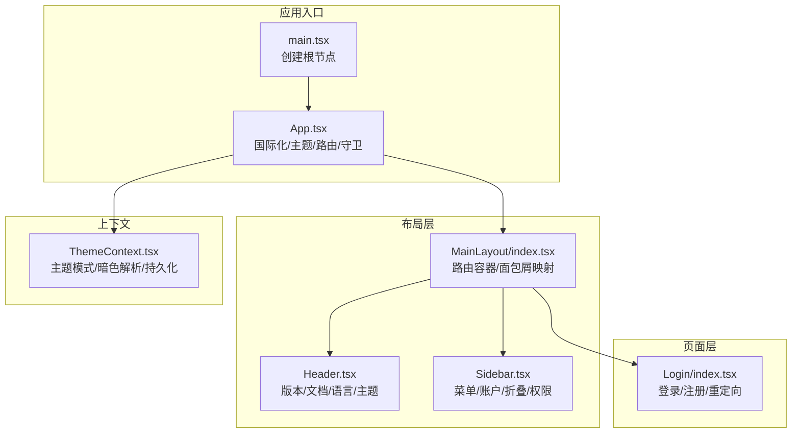
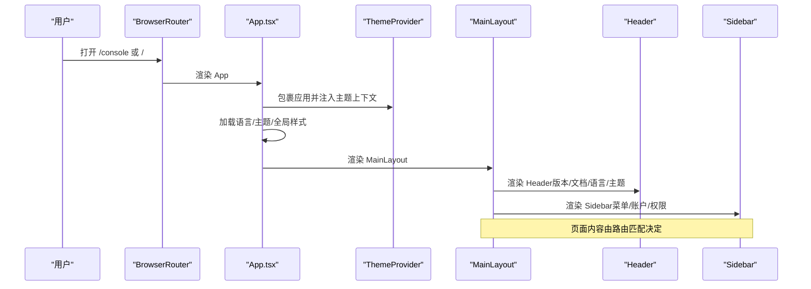
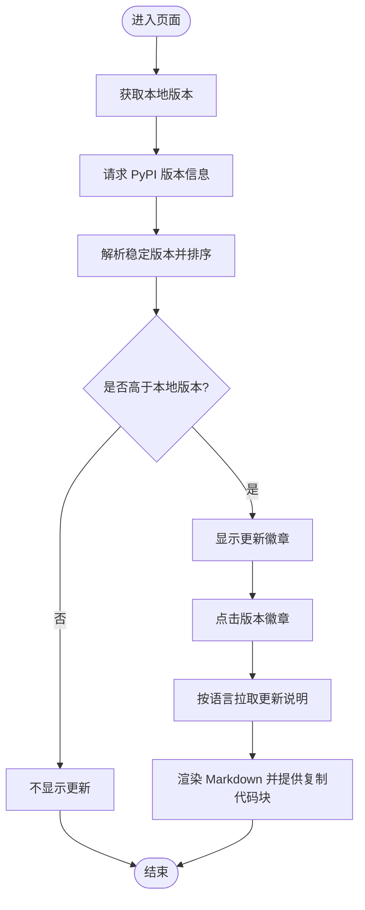
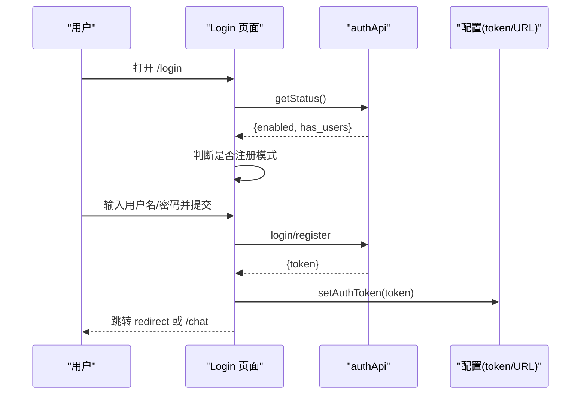
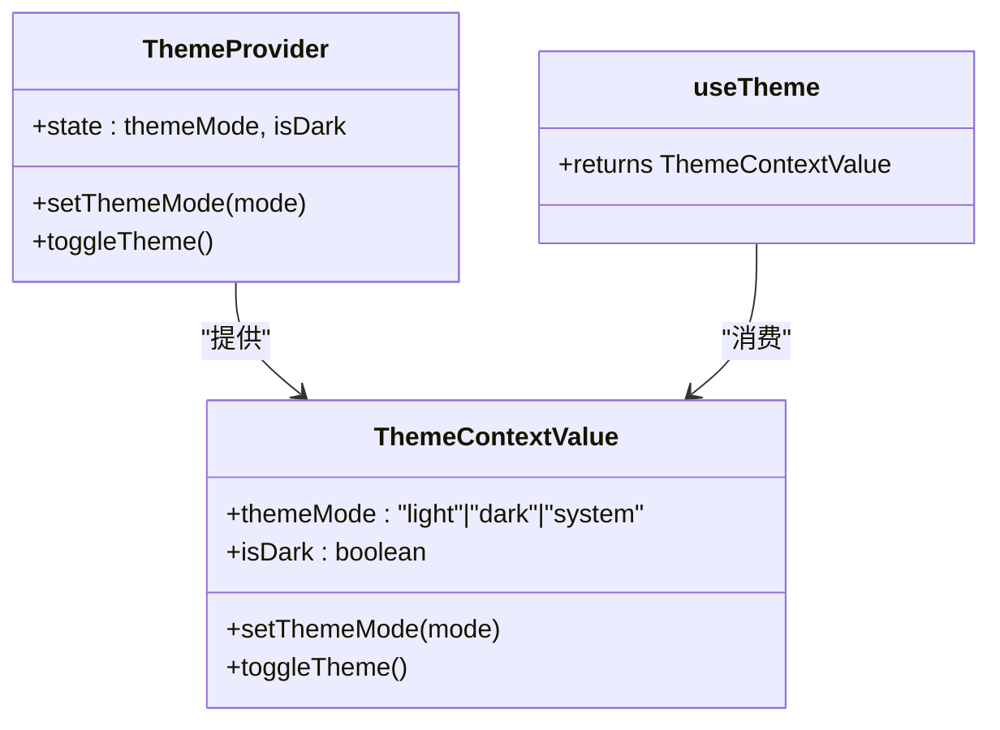
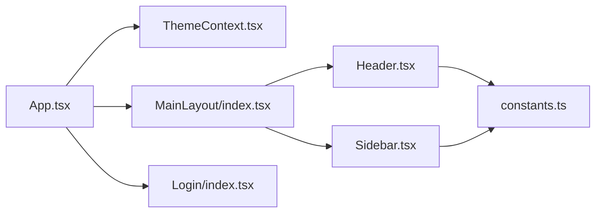

# 组件系统

<cite>
**本文引用的文件**
- [App.tsx](file://copaw/console/src/App.tsx)
- [main.tsx](file://copaw/console/src/main.tsx)
- [Header.tsx](file://copaw/console/src/layouts/Header.tsx)
- [Sidebar.tsx](file://copaw/console/src/layouts/Sidebar.tsx)
- [MainLayout/index.tsx](file://copaw/console/src/layouts/MainLayout/index.tsx)
- [constants.ts](file://copaw/console/src/layouts/constants.ts)
- [ThemeContext.tsx](file://copaw/console/src/contexts/ThemeContext.tsx)
- [Login/index.tsx](file://copaw/console/src/pages/Login/index.tsx)
- [en.json](file://copaw/console/src/locales/en.json)
</cite>

## 目录
1. [引言](#引言)
2. [项目结构](#项目结构)
3. [核心组件](#核心组件)
4. [架构总览](#架构总览)
5. [详细组件分析](#详细组件分析)
6. [依赖分析](#依赖分析)
7. [性能考虑](#性能考虑)
8. [故障排查指南](#故障排查指南)
9. [结论](#结论)
10. [附录](#附录)

## 引言
本文件面向组件系统，聚焦于React组件的设计模式与分层结构，系统性阐述布局组件（Header、Sidebar、MainLayout）的职责与复用机制；梳理页面组件的组织方式与组件间通信模式；解释上下文系统（主题上下文）与认证流程；总结生命周期管理与性能优化策略；并给出开发规范、最佳实践与常见问题排查建议。文档以“自顶向下”的方式呈现，既适合初学者快速上手，也便于资深开发者进行架构审视与演进。

## 项目结构
该控制台前端采用“布局-页面-组件-上下文”分层组织：
- 布局层：MainLayout负责路由与页面容器，Header负责顶部导航与版本提示，Sidebar负责侧边菜单与账户操作。
- 页面层：各业务页面作为路由子视图挂载在MainLayout下，如聊天、通道、会话、技能、工具、MCP、设置等。
- 组件层：通用UI组件（语言切换、主题切换、复制按钮等）在components目录，供布局与页面复用。
- 上下文层：ThemeContext提供主题模式与暗色解析，贯穿全局样式与组件渲染。

图表来源
- [main.tsx:1-31](file://copaw/console/src/main.tsx#L1-L31)
- [App.tsx:187-196](file://copaw/console/src/App.tsx#L187-L196)
- [MainLayout/index.tsx:47-89](file://copaw/console/src/layouts/MainLayout/index.tsx#L47-L89)
- [Header.tsx:52-291](file://copaw/console/src/layouts/Header.tsx#L52-L291)
- [Sidebar.tsx:57-516](file://copaw/console/src/layouts/Sidebar.tsx#L57-L516)
- [ThemeContext.tsx:51-105](file://copaw/console/src/contexts/ThemeContext.tsx#L51-L105)

章节来源
- [App.tsx:1-196](file://copaw/console/src/App.tsx#L1-L196)
- [main.tsx:1-31](file://copaw/console/src/main.tsx#L1-L31)

## 核心组件
- 应用入口与初始化
  - main.tsx：创建根节点，屏蔽部分控制台警告/错误噪声，渲染App。
  - App.tsx：配置i18n、主题、路由、全局样式、认证守卫与页面容器。
- 布局组件
  - MainLayout：集中管理路由与页面容器，根据当前路径映射选中菜单项。
  - Header：版本查询、更新弹窗、文档/FAQ/GitHub导航、语言切换、主题切换。
  - Sidebar：菜单树/折叠、账户信息修改、登出、动态权限控制。
- 上下文系统
  - ThemeContext：主题模式（浅色/深色/跟随系统）、暗色解析、本地持久化、系统偏好监听。
- 页面组件
  - Login：登录/注册、首次用户引导、重定向处理、消息提示。

章节来源
- [main.tsx:1-31](file://copaw/console/src/main.tsx#L1-L31)
- [App.tsx:1-196](file://copaw/console/src/App.tsx#L1-L196)
- [MainLayout/index.tsx:1-89](file://copaw/console/src/layouts/MainLayout/index.tsx#L1-L89)
- [Header.tsx:1-291](file://copaw/console/src/layouts/Header.tsx#L1-L291)
- [Sidebar.tsx:1-516](file://copaw/console/src/layouts/Sidebar.tsx#L1-L516)
- [ThemeContext.tsx:1-105](file://copaw/console/src/contexts/ThemeContext.tsx#L1-L105)
- [Login/index.tsx:1-176](file://copaw/console/src/pages/Login/index.tsx#L1-L176)

## 架构总览
应用采用“路由驱动 + 布局容器 + 上下文共享”的架构：
- 路由层：BrowserRouter + Routes，Login与MainLayout受认证守卫保护。
- 布局层：MainLayout承载Header与Sidebar，形成统一的页面骨架。
- 上下文层：ThemeProvider包裹应用，ThemeContext提供isDark与setThemeMode。
- 国际化层：i18n初始化与语言切换联动Ant Design与dayjs本地化。
- 认证层：AuthGuard在加载态与“需要认证”之间做跳转，避免未授权访问。

图表来源
- [App.tsx:187-196](file://copaw/console/src/App.tsx#L187-L196)
- [MainLayout/index.tsx:47-89](file://copaw/console/src/layouts/MainLayout/index.tsx#L47-L89)
- [Header.tsx:52-291](file://copaw/console/src/layouts/Header.tsx#L52-L291)
- [Sidebar.tsx:57-516](file://copaw/console/src/layouts/Sidebar.tsx#L57-L516)

## 详细组件分析

### 布局组件：MainLayout、Header、Sidebar
- MainLayout
  - 职责：统一页面容器、路由分发、菜单选中态映射。
  - 复用机制：通过pathToKey将当前路径映射到菜单key，确保Header/Sidebar联动一致。
- Header
  - 职责：版本号展示与更新提示、文档/FAQ/GitHub导航、语言切换、主题切换。
  - 更新流程：异步拉取PyPI版本列表，筛选稳定版本，比较本地版本，触发更新弹窗并渲染Markdown。
- Sidebar
  - 职责：菜单树/折叠、账户信息修改表单、登出、权限开关（基于认证状态）。
  - 交互：折叠态使用Tooltip与图标按钮，展开态使用Ant Design Menu；支持动态打开账户模态框。

图表来源
- [Header.tsx:60-139](file://copaw/console/src/layouts/Header.tsx#L60-L139)
- [constants.ts:75-120](file://copaw/console/src/layouts/constants.ts#L75-L120)

章节来源
- [MainLayout/index.tsx:27-50](file://copaw/console/src/layouts/MainLayout/index.tsx#L27-L50)
- [Header.tsx:52-291](file://copaw/console/src/layouts/Header.tsx#L52-L291)
- [Sidebar.tsx:57-516](file://copaw/console/src/layouts/Sidebar.tsx#L57-L516)
- [constants.ts:1-212](file://copaw/console/src/layouts/constants.ts#L1-L212)

### 页面组件：Login 登录页
- 功能要点
  - 首次用户：无用户时自动切换为注册模式。
  - 认证状态：根据后端返回的认证开关决定登录/注册或直接跳转。
  - 重定向：支持redirect参数，防止硬编码路径。
  - 消息提示：使用useAppMessage统一提示。
- 生命周期
  - 初始化：读取认证状态，决定是否显示注册入口。
  - 提交：调用authApi.login/register，成功后写入token并跳转。

图表来源
- [Login/index.tsx:21-72](file://copaw/console/src/pages/Login/index.tsx#L21-L72)
- [App.tsx:49-104](file://copaw/console/src/App.tsx#L49-L104)

章节来源
- [Login/index.tsx:1-176](file://copaw/console/src/pages/Login/index.tsx#L1-L176)
- [App.tsx:49-104](file://copaw/console/src/App.tsx#L49-L104)

### 上下文系统：ThemeContext 主题上下文
- 设计目标：跨组件共享主题模式与最终暗色状态，支持系统偏好监听与本地持久化。
- 关键点
  - 主题模式：light/dark/system；最终解析为isDark布尔值。
  - 持久化：localStorage存储用户选择；页面加载时读取初始值。
  - 系统偏好：当模式为system时，监听prefers-color-scheme变化并实时更新。
  - 全局样式：向<html>添加/移除dark-mode类，配合CSS变量覆盖。

图表来源
- [ThemeContext.tsx:15-30](file://copaw/console/src/contexts/ThemeContext.tsx#L15-L30)
- [ThemeContext.tsx:51-105](file://copaw/console/src/contexts/ThemeContext.tsx#L51-L105)

章节来源
- [ThemeContext.tsx:1-105](file://copaw/console/src/contexts/ThemeContext.tsx#L1-L105)

### 组件间通信模式
- 路由级通信：MainLayout通过useLocation与pathToKey映射菜单选中态，Header/Sidebar共享同一状态来源。
- 上下文级通信：ThemeContext在App.tsx顶层提供，Header/Sidebar/页面均可通过useTheme消费。
- 表单级通信：Sidebar中的账户表单通过Form组件与事件回调完成输入校验与提交。
- 国际化级通信：App.tsx监听i18n.language变化，动态设置Ant Design与dayjs本地化。

章节来源
- [MainLayout/index.tsx:47-50](file://copaw/console/src/layouts/MainLayout/index.tsx#L47-L50)
- [Header.tsx:135-149](file://copaw/console/src/layouts/Header.tsx#L135-L149)
- [Sidebar.tsx:449-512](file://copaw/console/src/layouts/Sidebar.tsx#L449-L512)
- [ThemeContext.tsx:51-105](file://copaw/console/src/contexts/ThemeContext.tsx#L51-L105)

## 依赖分析
- 组件耦合
  - MainLayout对Header/Sidebar强依赖，但通过路由参数解耦菜单选中态。
  - Header与Sidebar均依赖ThemeContext提供的isDark，实现主题一致性。
  - Login依赖authApi与配置模块，受App.tsx中的AuthGuard保护。
- 外部依赖
  - Ant Design与@agentscope-ai/design用于UI与主题；dayjs用于相对时间与本地化。
  - i18n用于多语言资源加载与切换；本地存储用于主题与语言偏好。

图表来源
- [App.tsx:187-196](file://copaw/console/src/App.tsx#L187-L196)
- [MainLayout/index.tsx:47-89](file://copaw/console/src/layouts/MainLayout/index.tsx#L47-L89)
- [Header.tsx:52-291](file://copaw/console/src/layouts/Header.tsx#L52-L291)
- [Sidebar.tsx:57-516](file://copaw/console/src/layouts/Sidebar.tsx#L57-L516)
- [constants.ts:1-212](file://copaw/console/src/layouts/constants.ts#L1-L212)

章节来源
- [App.tsx:1-196](file://copaw/console/src/App.tsx#L1-L196)
- [constants.ts:1-212](file://copaw/console/src/layouts/constants.ts#L1-L212)

## 性能考虑
- 路由懒加载与代码分割
  - 建议将大型页面组件按路由拆分，结合React.lazy与Suspense实现按需加载，减少首屏体积。
- 主题切换与全局样式
  - ThemeContext仅在顶层提供，避免重复渲染；通过<html>类名切换实现CSS变量覆盖，避免深层组件重绘。
- 图标与第三方库
  - 使用轻量图标库与按需引入，避免一次性引入过多资源。
- 国际化与本地化
  - 将语言资源按需加载，避免一次性加载全部语言包；dayjs本地化按需设置。
- 表单与网络请求
  - 表单校验使用受控组件与防抖；网络请求使用取消标志或AbortController避免竞态。

## 故障排查指南
- 登录失败
  - 检查后端认证开关与token写入逻辑；确认redirect参数合法性。
  - 参考路径：[Login/index.tsx:21-72](file://copaw/console/src/pages/Login/index.tsx#L21-L72)
- 认证守卫跳转异常
  - 检查AuthGuard的状态流转与token清理逻辑；确认basename与路由前缀。
  - 参考路径：[App.tsx:49-104](file://copaw/console/src/App.tsx#L49-L104)
- 主题切换无效
  - 检查ThemeContext的setThemeMode与<html>类名切换；确认系统偏好监听是否生效。
  - 参考路径：[ThemeContext.tsx:51-105](file://copaw/console/src/contexts/ThemeContext.tsx#L51-L105)
- 语言切换不生效
  - 检查i18n事件监听与Ant Design/Day.js本地化设置；确认本地存储的语言键值。
  - 参考路径：[App.tsx:110-149](file://copaw/console/src/App.tsx#L110-L149)
- 版本更新弹窗空白
  - 检查PyPI接口可用性与Markdown拉取逻辑；确认语言映射与缓存策略。
  - 参考路径：[Header.tsx:60-139](file://copaw/console/src/layouts/Header.tsx#L60-L139)

章节来源
- [Login/index.tsx:1-176](file://copaw/console/src/pages/Login/index.tsx#L1-L176)
- [App.tsx:49-149](file://copaw/console/src/App.tsx#L49-L149)
- [ThemeContext.tsx:51-105](file://copaw/console/src/contexts/ThemeContext.tsx#L51-L105)
- [Header.tsx:60-139](file://copaw/console/src/layouts/Header.tsx#L60-L139)

## 结论
该组件系统以清晰的分层与上下文共享为核心，结合路由与布局容器实现了高内聚、低耦合的页面骨架。通过主题上下文与国际化配置，保证了跨组件的一致性体验。建议后续在大型页面上引入代码分割与懒加载，进一步优化首屏性能；同时完善错误边界与日志埋点，提升可观测性与可维护性。

## 附录

### 开发规范与最佳实践
- Props与类型
  - 为所有组件定义明确的Props接口，避免any；对可选属性提供默认值。
- 错误边界
  - 在页面容器（如MainLayout）外层引入错误边界组件，捕获子树异常并降级展示。
- 代码分割
  - 对大型页面组件使用动态导入与Suspense占位，减少首屏阻塞。
- 国际化
  - 所有文案统一从i18n资源读取；避免硬编码字符串；提供英文回退。
- 主题与样式
  - 通过上下文统一管理主题；避免在组件内部直接操作DOM类名。
- 表单与校验
  - 使用受控组件与受控表单；对敏感字段（密码）使用遮罩与二次确认。
- 路由与权限
  - 将认证守卫置于路由层；对未授权访问统一跳转至登录页并携带redirect参数。

### 组件示例与开发指导
- 示例：Header 更新弹窗
  - 场景：版本对比与更新说明展示。
  - 关键点：异步获取PyPI版本、筛选稳定版本、Markdown渲染、复制代码块。
  - 参考路径：[Header.tsx:60-139](file://copaw/console/src/layouts/Header.tsx#L60-L139)
- 示例：Sidebar 账户表单
  - 场景：修改用户名/密码并重置token后跳转登录。
  - 关键点：表单校验规则、提交状态、错误消息提示、退出登录逻辑。
  - 参考路径：[Sidebar.tsx:79-130](file://copaw/console/src/layouts/Sidebar.tsx#L79-L130)
- 示例：ThemeContext 主题切换
  - 场景：用户选择主题模式并持久化；系统偏好变化时自动更新。
  - 关键点：本地存储、系统媒体查询监听、<html>类名切换。
  - 参考路径：[ThemeContext.tsx:51-105](file://copaw/console/src/contexts/ThemeContext.tsx#L51-L105)

章节来源
- [Header.tsx:60-139](file://copaw/console/src/layouts/Header.tsx#L60-L139)
- [Sidebar.tsx:79-130](file://copaw/console/src/layouts/Sidebar.tsx#L79-L130)
- [ThemeContext.tsx:51-105](file://copaw/console/src/contexts/ThemeContext.tsx#L51-L105)