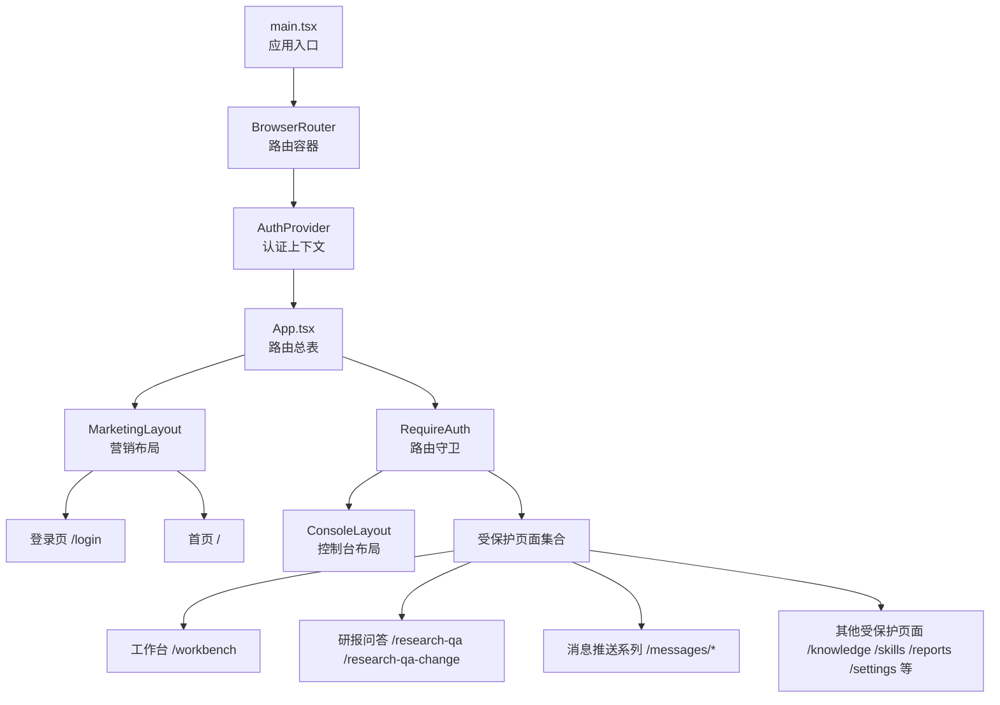
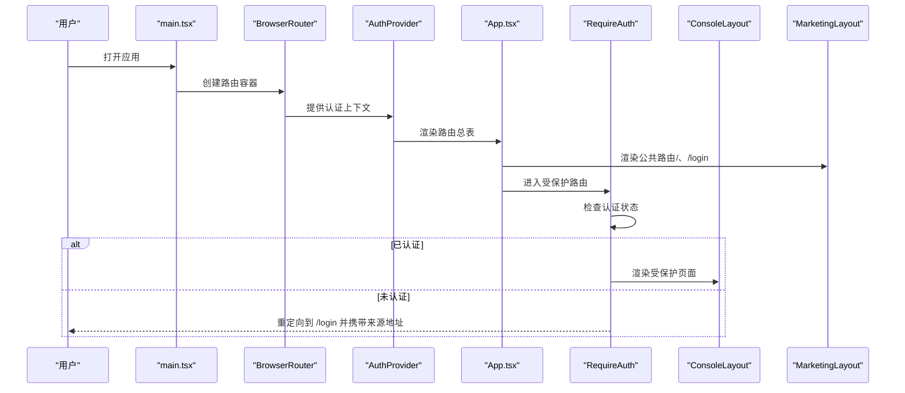
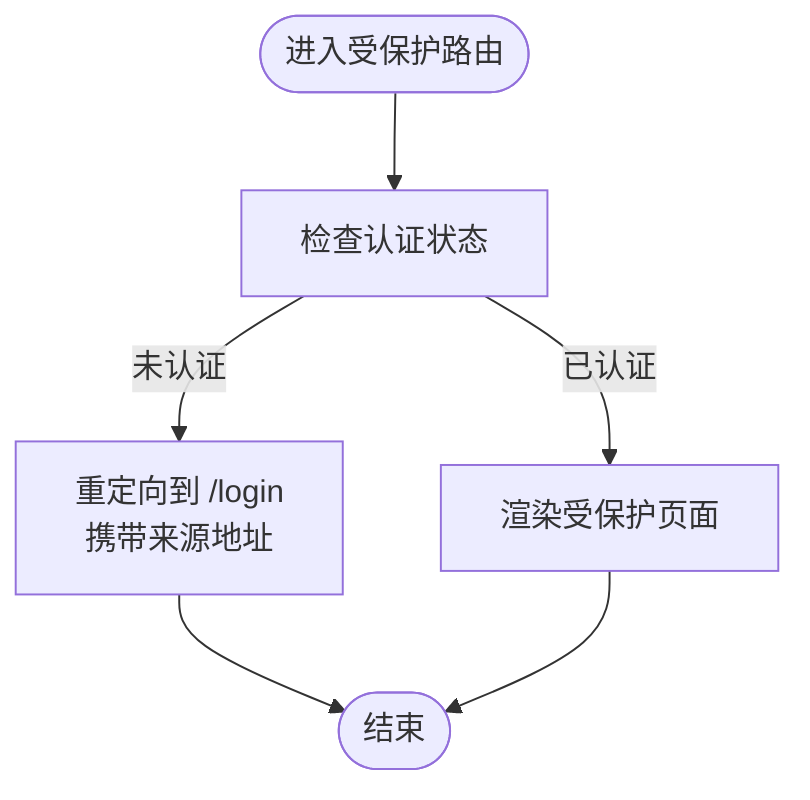
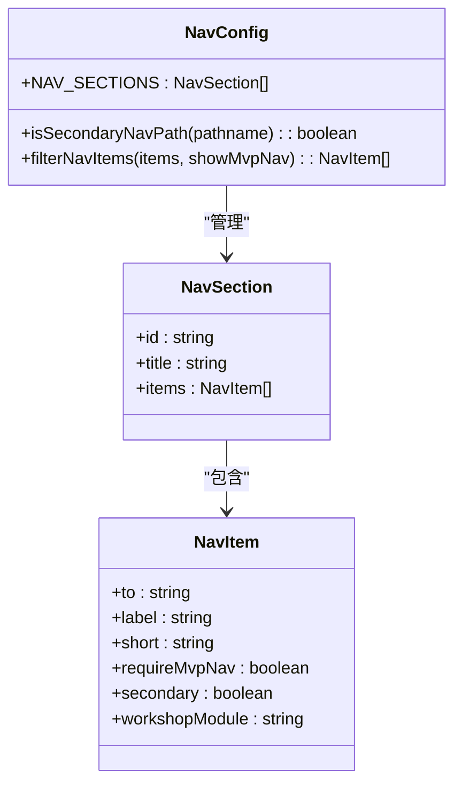
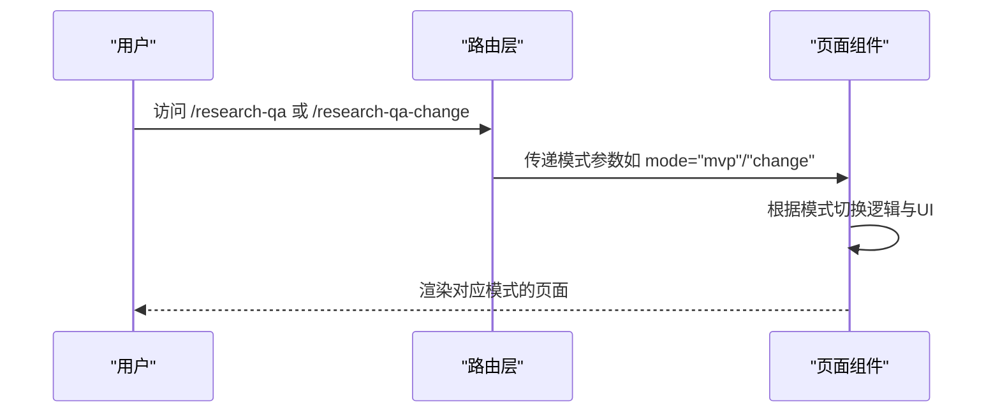
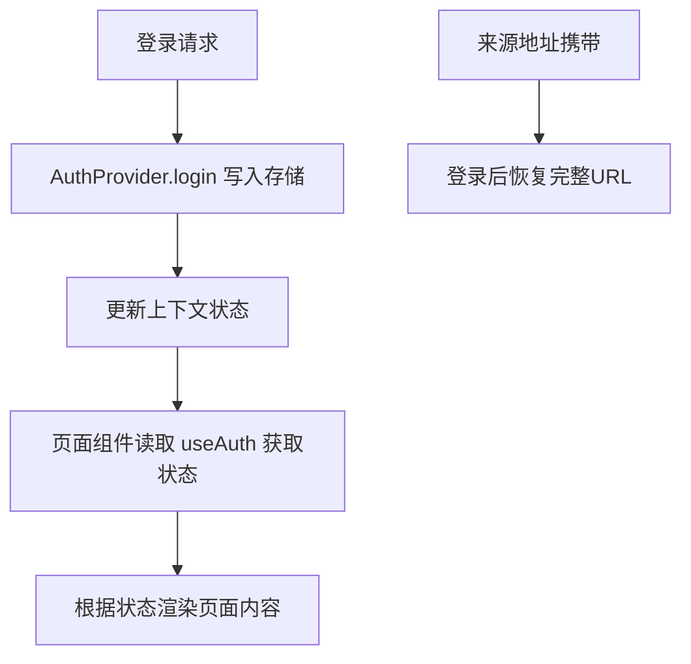
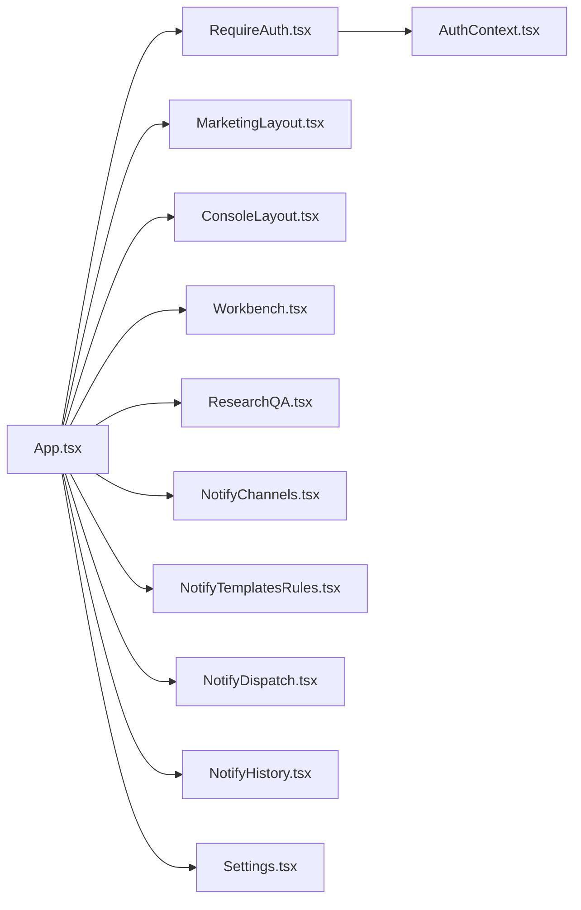

# 路由与导航

<cite>
**本文引用的文件**
- [main.tsx](file://main-project/frontend/src/main.tsx)
- [App.tsx](file://main-project/frontend/src/App.tsx)
- [RequireAuth.tsx](file://main-project/frontend/src/components/RequireAuth.tsx)
- [AuthContext.tsx](file://main-project/frontend/src/context/AuthContext.tsx)
- [nav.ts](file://main-project/frontend/src/config/nav.ts)
- [ConsoleLayout.tsx](file://main-project/frontend/src/components/ConsoleLayout.tsx)
- [MarketingLayout.tsx](file://main-project/frontend/src/components/MarketingLayout.tsx)
- [Login.tsx](file://main-project/frontend/src/pages/Login.tsx)
- [Workbench.tsx](file://main-project/frontend/src/pages/Workbench.tsx)
- [ResearchQA.tsx](file://main-project/frontend/src/pages/ResearchQA.tsx)
- [NotifyChannels.tsx](file://main-project/frontend/src/pages/NotifyChannels.tsx)
- [NotifyTemplatesRules.tsx](file://main-project/frontend/src/pages/NotifyTemplatesRules.tsx)
- [NotifyDispatch.tsx](file://main-project/frontend/src/pages/NotifyDispatch.tsx)
- [NotifyHistory.tsx](file://main-project/frontend/src/pages/NotifyHistory.tsx)
- [Settings.tsx](file://main-project/frontend/src/pages/Settings.tsx)
</cite>

## 目录
1. [简介](#简介)
2. [项目结构](#项目结构)
3. [核心组件](#核心组件)
4. [架构总览](#架构总览)
5. [详细组件分析](#详细组件分析)
6. [依赖关系分析](#依赖关系分析)
7. [性能考量](#性能考量)
8. [故障排查指南](#故障排查指南)
9. [结论](#结论)
10. [附录](#附录)

## 简介
本文件围绕前端路由与导航系统进行系统化技术说明，重点涵盖：
- React Router 的配置方式与嵌套路由组织
- 路由守卫机制：公共路由与受保护路由的区分与实现
- 导航菜单的动态生成与权限控制策略
- 页面模式（pageModes）设计理念与使用场景
- 路由参数传递与状态管理策略
- 导航优化与用户体验提升最佳实践
- 路由配置示例与权限控制的实际代码实现路径

## 项目结构
前端采用单页应用（SPA）架构，基于 React Router v6 进行路由编排。根组件通过 BrowserRouter 包裹，全局提供认证上下文，App 组件集中定义所有路由规则，并通过布局组件实现公共头部、侧边栏与内容区的复用。

图表来源
- [main.tsx:1-17](file://main-project/frontend/src/main.tsx#L1-L17)
- [App.tsx:31-63](file://main-project/frontend/src/App.tsx#L31-L63)
- [RequireAuth.tsx:1-14](file://main-project/frontend/src/components/RequireAuth.tsx#L1-L14)

章节来源
- [main.tsx:1-17](file://main-project/frontend/src/main.tsx#L1-L17)
- [App.tsx:31-63](file://main-project/frontend/src/App.tsx#L31-L63)

## 核心组件
- 应用入口与路由容器
  - 入口文件负责挂载 BrowserRouter 与全局认证 Provider，确保路由与认证能力贯穿整个应用。
- 路由总表与布局
  - App 组件集中声明公共与受保护两类路由，分别包裹在不同布局组件中，实现清晰的页面结构与导航体验。
- 路由守卫
  - RequireAuth 组件在渲染受保护子路由前检查认证状态，未认证则重定向至登录页并携带来源地址。
- 认证上下文
  - AuthContext 提供登录、登出与认证状态读取能力，使用 sessionStorage 存储用户信息，保证刷新后状态一致。
- 导航配置
  - nav.ts 定义主导航分组、条目与过滤逻辑，支持按偏好显示“扩展与演示”类导航项。

章节来源
- [main.tsx:1-17](file://main-project/frontend/src/main.tsx#L1-L17)
- [App.tsx:31-63](file://main-project/frontend/src/App.tsx#L31-L63)
- [RequireAuth.tsx:1-14](file://main-project/frontend/src/components/RequireAuth.tsx#L1-L14)
- [AuthContext.tsx:1-60](file://main-project/frontend/src/context/AuthContext.tsx#L1-L60)
- [nav.ts:1-72](file://main-project/frontend/src/config/nav.ts#L1-L72)

## 架构总览
下图展示了从应用启动到页面渲染的关键流程，以及路由守卫与布局组件的协作关系：

图表来源
- [main.tsx:1-17](file://main-project/frontend/src/main.tsx#L1-L17)
- [App.tsx:31-63](file://main-project/frontend/src/App.tsx#L31-L63)
- [RequireAuth.tsx:1-14](file://main-project/frontend/src/components/RequireAuth.tsx#L1-L14)

## 详细组件分析

### 路由守卫与公共/受保护路由
- 公共路由
  - 位于顶层路由表中，不包裹 RequireAuth，允许未登录访问，典型包括首页与登录页。
- 受保护路由
  - 通过 RequireAuth 包裹，若未认证则重定向至登录页，并将来源地址作为状态传入，便于登录后返回原页面。
- 登录后跳转
  - 登录成功后，可依据上一访问地址决定跳转目标；若无来源地址或已登录，则默认跳转至工作台。

图表来源
- [RequireAuth.tsx:1-14](file://main-project/frontend/src/components/RequireAuth.tsx#L1-L14)
- [App.tsx:39-60](file://main-project/frontend/src/App.tsx#L39-L60)

章节来源
- [App.tsx:31-63](file://main-project/frontend/src/App.tsx#L31-L63)
- [RequireAuth.tsx:1-14](file://main-project/frontend/src/components/RequireAuth.tsx#L1-L14)

### 导航菜单的动态生成与权限控制
- 导航模型
  - 使用 NavSection 与 NavItem 描述导航分组与条目，支持短标签、模块标识与“仅MVP可见”等属性。
- 动态过滤
  - 通过 filterNavItems 按偏好开关过滤“扩展与演示”类导航项；isSecondaryNavPath 判断当前路由是否属于扩展类，用于页头打标。
- 与布局联动
  - 控制台布局组件根据导航配置渲染侧边菜单，结合 RequireAuth 保障菜单项的可访问性。

图表来源
- [nav.ts:1-72](file://main-project/frontend/src/config/nav.ts#L1-L72)

章节来源
- [nav.ts:1-72](file://main-project/frontend/src/config/nav.ts#L1-L72)

### 页面模式（pageModes）的设计理念与使用场景
- 设计理念
  - 将同一业务页面的不同形态抽象为“模式”，通过路由参数或查询参数注入模式值，驱动页面内部逻辑分支与UI呈现差异。
- 使用场景
  - 研报问答页面提供两种模式：MVP 版本与变更版本，分别对应不同的交互流程与数据来源。
- 实现要点
  - 在路由层为不同模式绑定独立路径或参数，页面组件内读取模式并切换行为；保持页面组件职责单一，避免模式判断分散在多处。

图表来源
- [App.tsx:42-43](file://main-project/frontend/src/App.tsx#L42-L43)
- [ResearchQA.tsx](file://main-project/frontend/src/pages/ResearchQA.tsx)

章节来源
- [App.tsx:42-43](file://main-project/frontend/src/App.tsx#L42-L43)

### 路由参数传递与状态管理策略
- 路由参数传递
  - 使用动态段（如 fundCode）在路径中传递实体标识；在页面组件中读取参数以加载对应数据。
- 查询参数与来源地址
  - 登录守卫将来源地址（含查询串）写入状态，登录后可据此恢复完整URL。
- 认证状态存储
  - 使用 sessionStorage 存储用户信息，避免刷新丢失；Provider 在初始化时尝试从存储中恢复状态。
- 页面状态隔离
  - 各页面组件维护自身状态，避免跨页面污染；必要时通过查询参数或本地存储进行轻量同步。

图表来源
- [AuthContext.tsx:28-50](file://main-project/frontend/src/context/AuthContext.tsx#L28-L50)
- [RequireAuth.tsx:8-10](file://main-project/frontend/src/components/RequireAuth.tsx#L8-L10)

章节来源
- [AuthContext.tsx:1-60](file://main-project/frontend/src/context/AuthContext.tsx#L1-L60)
- [RequireAuth.tsx:1-14](file://main-project/frontend/src/components/RequireAuth.tsx#L1-L14)

### 导航优化与用户体验改进
- 优先级与可见性
  - 主线模块（M1~M5）优先展示，扩展与演示类导航项按偏好开关控制，减少信息过载。
- 路由兜底
  - 通配符路由统一重定向至工作台，避免无效路径导致空白页。
- 登录态保持
  - 刷新后自动恢复登录状态，提升连续性体验。
- 页头打标
  - 对扩展与演示类路由在页头添加标识，帮助用户识别实验性功能。

章节来源
- [App.tsx:58-58](file://main-project/frontend/src/App.tsx#L58-L58)
- [nav.ts:64-71](file://main-project/frontend/src/config/nav.ts#L64-L71)

## 依赖关系分析
- 组件耦合
  - App 作为路由中枢，依赖 RequireAuth、布局组件与各页面组件；RequireAuth 依赖 AuthContext。
- 外部依赖
  - React Router v6 提供路由与导航能力；Ant Design 提供布局与UI组件。
- 数据流
  - 认证状态自下而上传播至 Provider，再由上下文向上提供给守卫与页面组件。

图表来源
- [App.tsx:31-63](file://main-project/frontend/src/App.tsx#L31-L63)
- [RequireAuth.tsx:1-14](file://main-project/frontend/src/components/RequireAuth.tsx#L1-L14)
- [AuthContext.tsx:1-60](file://main-project/frontend/src/context/AuthContext.tsx#L1-L60)

章节来源
- [App.tsx:31-63](file://main-project/frontend/src/App.tsx#L31-L63)

## 性能考量
- 路由懒加载
  - 对大型页面组件建议采用动态导入实现懒加载，减少首屏体积。
- 布局复用
  - 通过布局组件复用头部与侧边栏，避免重复渲染。
- 状态最小化
  - 将跨页面共享的状态集中在上下文中，避免在页面间传递深层props链。
- 缓存与去抖
  - 对频繁触发的导航事件（如搜索、筛选）加入防抖，降低渲染压力。

## 故障排查指南
- 登录后未回到原页面
  - 检查登录流程是否正确读取并跳转到来源地址；确认 RequireAuth 传入的 state 结构。
- 刷新后未保持登录
  - 确认 sessionStorage 中存在认证信息；检查 AuthProvider 初始化逻辑。
- 导航项未显示或显示异常
  - 检查偏好开关与过滤函数；确认 NavItem 的 requireMvpNav 与 secondary 字段设置。
- 通配符未生效
  - 确认兜底路由位置与优先级；确保未被更具体的路由覆盖。

章节来源
- [RequireAuth.tsx:8-10](file://main-project/frontend/src/components/RequireAuth.tsx#L8-L10)
- [AuthContext.tsx:16-26](file://main-project/frontend/src/context/AuthContext.tsx#L16-L26)
- [nav.ts:69-71](file://main-project/frontend/src/config/nav.ts#L69-L71)
- [App.tsx:58-58](file://main-project/frontend/src/App.tsx#L58-L58)

## 结论
该路由与导航系统通过清晰的路由分层、可靠的路由守卫与灵活的导航配置，实现了公共与受保护页面的有序分离，同时以页面模式与动态过滤提升了功能可塑性与用户体验。配合合理的状态管理与性能优化策略，可在复杂业务场景下保持良好的可维护性与扩展性。

## 附录
- 路由配置示例（路径）
  - 公共路由：[App.tsx:34-37](file://main-project/frontend/src/App.tsx#L34-L37)
  - 受保护路由：[App.tsx:39-60](file://main-project/frontend/src/App.tsx#L39-L60)
  - 页面模式路由：[App.tsx:42-43](file://main-project/frontend/src/App.tsx#L42-L43)
- 权限控制实现（路径）
  - 路由守卫：[RequireAuth.tsx:1-14](file://main-project/frontend/src/components/RequireAuth.tsx#L1-L14)
  - 认证上下文：[AuthContext.tsx:1-60](file://main-project/frontend/src/context/AuthContext.tsx#L1-L60)
- 导航配置（路径）
  - 导航模型与过滤：[nav.ts:1-72](file://main-project/frontend/src/config/nav.ts#L1-L72)
- 页面组件（路径）
  - 登录页：[Login.tsx](file://main-project/frontend/src/pages/Login.tsx)
  - 工作台：[Workbench.tsx](file://main-project/frontend/src/pages/Workbench.tsx)
  - 研报问答：[ResearchQA.tsx](file://main-project/frontend/src/pages/ResearchQA.tsx)
  - 消息推送系列：[NotifyChannels.tsx](file://main-project/frontend/src/pages/NotifyChannels.tsx)、[NotifyTemplatesRules.tsx](file://main-project/frontend/src/pages/NotifyTemplatesRules.tsx)、[NotifyDispatch.tsx](file://main-project/frontend/src/pages/NotifyDispatch.tsx)、[NotifyHistory.tsx](file://main-project/frontend/src/pages/NotifyHistory.tsx)
  - 设置：[Settings.tsx](file://main-project/frontend/src/pages/Settings.tsx)