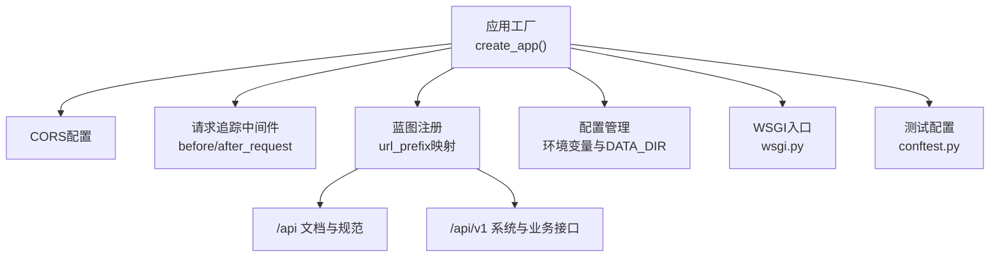
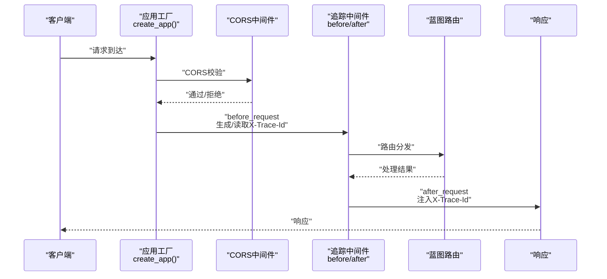
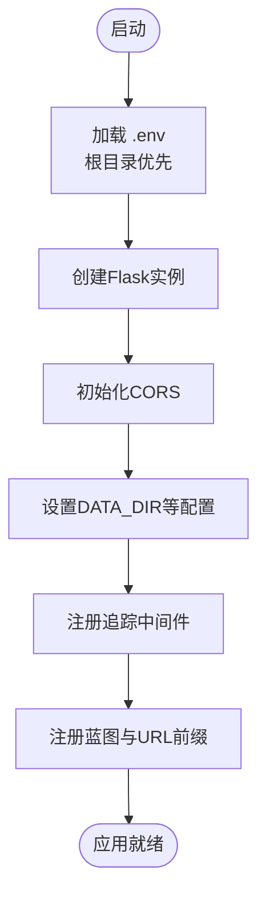
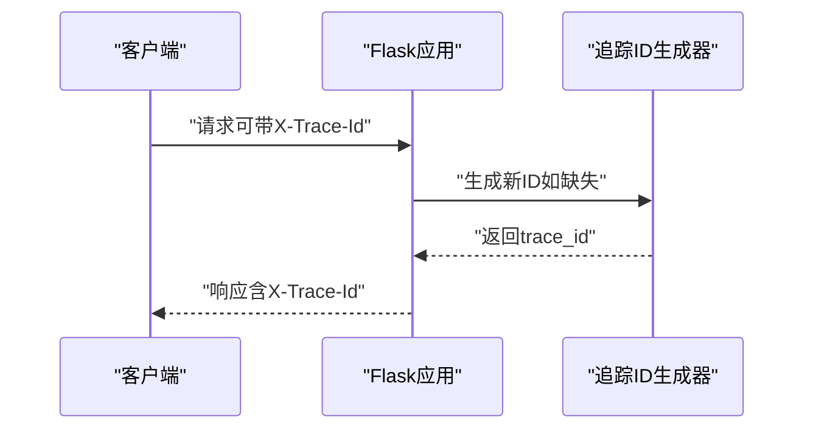
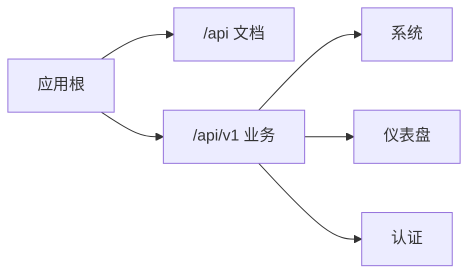
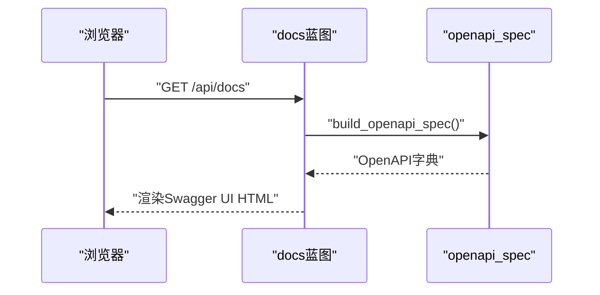
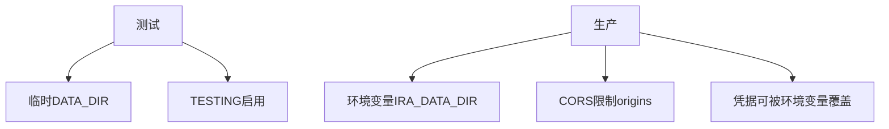
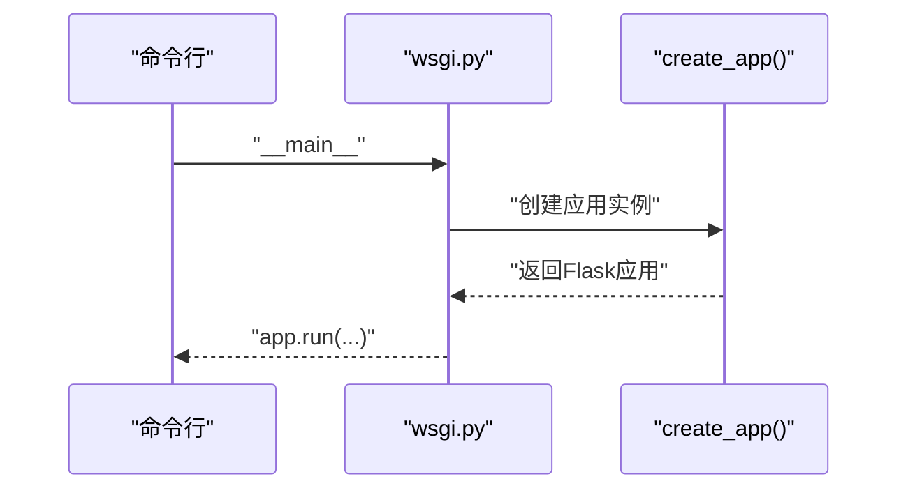
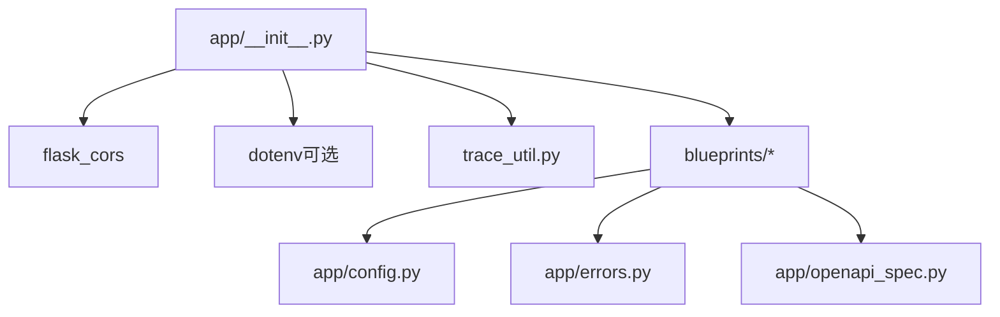

# Flask应用结构

<cite>
**本文档引用的文件**
- [main-project/backend/app/__init__.py](file://main-project/backend/app/__init__.py)
- [main-project/backend/app/config.py](file://main-project/backend/app/config.py)
- [main-project/backend/app/trace_util.py](file://main-project/backend/app/trace_util.py)
- [main-project/backend/app/errors.py](file://main-project/backend/app/errors.py)
- [main-project/backend/app/openapi_spec.py](file://main-project/backend/app/openapi_spec.py)
- [main-project/backend/app/blueprints/docs_bp.py](file://main-project/backend/app/blueprints/docs_bp.py)
- [main-project/backend/app/blueprints/auth_bp.py](file://main-project/backend/app/blueprints/auth_bp.py)
- [main-project/backend/app/blueprints/system_bp.py](file://main-project/backend/app/blueprints/system_bp.py)
- [main-project/backend/app/blueprints/dashboard_bp.py](file://main-project/backend/app/blueprints/dashboard_bp.py)
- [main-project/backend/wsgi.py](file://main-project/backend/wsgi.py)
- [main-project/backend/tests/conftest.py](file://main-project/backend/tests/conftest.py)
- [main-project/backend/pytest.ini](file://main-project/backend/pytest.ini)
</cite>

## 目录
1. [简介](#简介)
2. [项目结构](#项目结构)
3. [核心组件](#核心组件)
4. [架构总览](#架构总览)
5. [详细组件分析](#详细组件分析)
6. [依赖分析](#依赖分析)
7. [性能考虑](#性能考虑)
8. [故障排查指南](#故障排查指南)
9. [结论](#结论)
10. [附录](#附录)

## 简介
本文件面向Flask应用的结构与实现，围绕以下主题展开：应用工厂模式、环境变量加载与配置管理、CORS与请求追踪ID、蓝图注册与URL前缀映射、测试与生产配置差异、WSGI部署与性能优化建议。文档以代码级事实为基础，辅以图示帮助读者快速建立对系统架构与关键流程的理解。

## 项目结构
本Flask应用位于 main-project/backend 目录，采用“应用工厂 + 蓝图”的分层组织方式：
- 应用工厂与入口：通过工厂函数创建Flask实例，集中初始化配置、CORS、中间件与蓝图注册。
- 配置与工具：环境变量加载、数据目录解析、追踪ID生成、错误响应封装、OpenAPI规范构建。
- 蓝图模块：按功能域划分蓝图，统一挂载到不同URL前缀下，形成清晰的REST API命名空间。
- 测试：pytest集成，提供临时数据目录与最小化测试配置。
- WSGI：提供直接运行与WSGI入口两种方式。

图表来源
- [main-project/backend/app/__init__.py:21-79](file://main-project/backend/app/__init__.py#L21-L79)
- [main-project/backend/app/blueprints/docs_bp.py:38-45](file://main-project/backend/app/blueprints/docs_bp.py#L38-L45)
- [main-project/backend/wsgi.py:1-7](file://main-project/backend/wsgi.py#L1-L7)
- [main-project/backend/tests/conftest.py:8-52](file://main-project/backend/tests/conftest.py#L8-L52)

章节来源
- [main-project/backend/app/__init__.py:1-80](file://main-project/backend/app/__init__.py#L1-L80)
- [main-project/backend/app/config.py:1-10](file://main-project/backend/app/config.py#L1-L10)
- [main-project/backend/wsgi.py:1-7](file://main-project/backend/wsgi.py#L1-L7)
- [main-project/backend/tests/conftest.py:1-58](file://main-project/backend/tests/conftest.py#L1-L58)

## 核心组件
- 应用工厂与初始化
  - 工厂函数负责加载环境变量、创建Flask实例、配置CORS、注入追踪中间件、注册蓝图并返回应用实例。
  - 关键点：CORS资源匹配路径、允许方法与头部；追踪ID生成与注入；蓝图按前缀注册。
- 环境变量与配置
  - 环境变量加载顺序：仓库根目录优先，后端目录次之，后者可覆盖前者。
  - 数据目录解析：优先使用环境变量，否则回退到相对路径。
- 请求追踪与中间件
  - 请求前中间件：从请求头提取或生成追踪ID，存入g对象。
  - 响应后中间件：向响应头注入追踪ID，便于端到端链路追踪。
- 错误响应
  - 统一错误体结构，自动携带追踪ID，便于定位问题。
- OpenAPI规范
  - 构建OpenAPI 3.0规范，配合Swagger UI提供交互式文档与示例。

章节来源
- [main-project/backend/app/__init__.py:9-19](file://main-project/backend/app/__init__.py#L9-L19)
- [main-project/backend/app/__init__.py:21-79](file://main-project/backend/app/__init__.py#L21-L79)
- [main-project/backend/app/config.py:5-9](file://main-project/backend/app/config.py#L5-L9)
- [main-project/backend/app/trace_util.py:4-5](file://main-project/backend/app/trace_util.py#L4-L5)
- [main-project/backend/app/errors.py:4-9](file://main-project/backend/app/errors.py#L4-L9)
- [main-project/backend/app/openapi_spec.py:6-47](file://main-project/backend/app/openapi_spec.py#L6-L47)

## 架构总览
应用采用“工厂函数 + 中间件 + 蓝图”的分层设计，核心流程如下：
- 启动阶段：加载.env → 创建Flask → 初始化CORS → 注册追踪中间件 → 注册蓝图 → 返回应用。
- 运行阶段：请求进入，before_request生成/读取追踪ID；路由命中对应蓝图；after_request统一注入响应头；错误统一包装返回。

图表来源
- [main-project/backend/app/__init__.py:21-79](file://main-project/backend/app/__init__.py#L21-L79)
- [main-project/backend/app/blueprints/docs_bp.py:38-45](file://main-project/backend/app/blueprints/docs_bp.py#L38-L45)

## 详细组件分析

### 应用工厂与初始化流程
- 环境变量加载
  - 顺序：仓库根目录.env → 后端目录.env（后者可覆盖前者）。
  - 未安装dotenv时不抛错，跳过加载。
- CORS配置
  - 对/api/*开放跨域，允许常用方法与特定头部（含X-Trace-Id）。
  - 生产环境建议限制origins为具体域名。
- 追踪中间件
  - 请求前：若请求头存在X-Trace-Id则复用，否则生成新ID。
  - 响应后：将追踪ID写入响应头，便于日志关联。
- 蓝图注册与URL前缀
  - 文档类：/api 文档与规范。
  - 业务类：/api/v1 系统与各功能域接口。
- 测试配置
  - 通过test_config参数覆盖配置，例如开启TESTING与指定DATA_DIR。

图表来源
- [main-project/backend/app/__init__.py:9-19](file://main-project/backend/app/__init__.py#L9-L19)
- [main-project/backend/app/__init__.py:21-79](file://main-project/backend/app/__init__.py#L21-L79)

章节来源
- [main-project/backend/app/__init__.py:9-19](file://main-project/backend/app/__init__.py#L9-L19)
- [main-project/backend/app/__init__.py:21-79](file://main-project/backend/app/__init__.py#L21-L79)

### CORS配置与请求追踪ID
- CORS
  - 资源匹配：/api/*
  - 方法：GET、POST、PUT、DELETE、OPTIONS
  - 允许头部：Content-Type、Authorization、X-Trace-Id
  - 建议：生产环境将origins限定为受信域名。
- 追踪ID
  - 生成：new_trace_id(prefix="tr")。
  - 使用：请求头优先，不存在则自动生成；响应头统一注入。

图表来源
- [main-project/backend/app/__init__.py:41-49](file://main-project/backend/app/__init__.py#L41-L49)
- [main-project/backend/app/trace_util.py:4-5](file://main-project/backend/app/trace_util.py#L4-L5)

章节来源
- [main-project/backend/app/__init__.py:25-35](file://main-project/backend/app/__init__.py#L25-L35)
- [main-project/backend/app/__init__.py:41-49](file://main-project/backend/app/__init__.py#L41-L49)
- [main-project/backend/app/trace_util.py:4-5](file://main-project/backend/app/trace_util.py#L4-L5)

### 蓝图注册与URL前缀映射
- 文档蓝图（/api）
  - 提供Swagger UI与OpenAPI规范JSON。
- 业务蓝图（/api/v1）
  - 系统：健康检查、设置与偏好。
  - 仪表盘：待办、KPI、会话。
  - 认证：公开配置与登录。
- 注册顺序即路由优先级，建议保持稳定。

图表来源
- [main-project/backend/app/__init__.py:65-77](file://main-project/backend/app/__init__.py#L65-L77)
- [main-project/backend/app/blueprints/docs_bp.py:38-45](file://main-project/backend/app/blueprints/docs_bp.py#L38-L45)
- [main-project/backend/app/blueprints/system_bp.py:21-94](file://main-project/backend/app/blueprints/system_bp.py#L21-L94)
- [main-project/backend/app/blueprints/dashboard_bp.py:13-29](file://main-project/backend/app/blueprints/dashboard_bp.py#L13-L29)
- [main-project/backend/app/blueprints/auth_bp.py:27-43](file://main-project/backend/app/blueprints/auth_bp.py#L27-L43)

章节来源
- [main-project/backend/app/__init__.py:65-77](file://main-project/backend/app/__init__.py#L65-L77)
- [main-project/backend/app/blueprints/docs_bp.py:38-45](file://main-project/backend/app/blueprints/docs_bp.py#L38-L45)

### OpenAPI规范与Swagger UI
- 规范构建
  - 包含信息、安全方案（bearerAuth占位）、标签与路径定义。
  - 路径覆盖系统、仪表盘、合规、血缘、研报、舆情、推送、知识库、报告等。
- Swagger UI
  - 通过蓝图提供HTML页面，指向/api/v1/openapi.json。
  - 支持Try it Out、过滤与示例。

图表来源
- [main-project/backend/app/blueprints/docs_bp.py:38-45](file://main-project/backend/app/blueprints/docs_bp.py#L38-L45)
- [main-project/backend/app/openapi_spec.py:6-47](file://main-project/backend/app/openapi_spec.py#L6-L47)

章节来源
- [main-project/backend/app/blueprints/docs_bp.py:1-46](file://main-project/backend/app/blueprints/docs_bp.py#L1-L46)
- [main-project/backend/app/openapi_spec.py:258-729](file://main-project/backend/app/openapi_spec.py#L258-L729)

### 测试配置与生产配置差异
- 测试配置
  - 通过pytest fixture创建临时数据目录，预置多类JSON数据。
  - 以test_config覆盖配置，启用TESTING并指定DATA_DIR。
- 生产配置
  - 通过环境变量IRA_DATA_DIR指定数据目录。
  - CORS的origins在生产中应限制为具体域名，避免通配符。
  - 登录凭据可通过环境变量覆盖，避免硬编码。

图表来源
- [main-project/backend/tests/conftest.py:8-52](file://main-project/backend/tests/conftest.py#L8-L52)
- [main-project/backend/app/config.py:5-9](file://main-project/backend/app/config.py#L5-L9)
- [main-project/backend/app/__init__.py:25-35](file://main-project/backend/app/__init__.py#L25-L35)
- [main-project/backend/app/blueprints/auth_bp.py:15-24](file://main-project/backend/app/blueprints/auth_bp.py#L15-L24)

章节来源
- [main-project/backend/tests/conftest.py:8-52](file://main-project/backend/tests/conftest.py#L8-L52)
- [main-project/backend/pytest.ini:1-4](file://main-project/backend/pytest.ini#L1-L4)
- [main-project/backend/app/config.py:5-9](file://main-project/backend/app/config.py#L5-L9)
- [main-project/backend/app/blueprints/auth_bp.py:15-24](file://main-project/backend/app/blueprints/auth_bp.py#L15-L24)

### WSGI部署与启动流程
- 直接运行
  - wsgi.py中直接调用create_app()并在本地主机5000端口启动，debug=True。
- WSGI入口
  - 导出app对象供WSGI服务器（如gunicorn、waitress）加载。
- 建议
  - 生产环境关闭debug，使用进程/线程池与健康检查。
  - 结合反向代理（Nginx）统一入口与静态资源。

图表来源
- [main-project/backend/wsgi.py:1-7](file://main-project/backend/wsgi.py#L1-L7)

章节来源
- [main-project/backend/wsgi.py:1-7](file://main-project/backend/wsgi.py#L1-L7)

## 依赖分析
- 组件耦合
  - 应用工厂集中初始化，降低各模块间的直接耦合。
  - 蓝图内部通过current_app.config访问共享配置，减少跨模块依赖。
- 外部依赖
  - flask_cors：跨域支持。
  - python-dotenv（可选）：.env加载。
  - flask：Web框架。
- 循环依赖
  - 当前结构通过蓝图延迟导入避免循环依赖。

图表来源
- [main-project/backend/app/__init__.py:1-6](file://main-project/backend/app/__init__.py#L1-L6)
- [main-project/backend/app/__init__.py:21-79](file://main-project/backend/app/__init__.py#L21-L79)
- [main-project/backend/app/blueprints/docs_bp.py:3-4](file://main-project/backend/app/blueprints/docs_bp.py#L3-L4)

章节来源
- [main-project/backend/app/__init__.py:1-6](file://main-project/backend/app/__init__.py#L1-L6)
- [main-project/backend/app/blueprints/docs_bp.py:3-4](file://main-project/backend/app/blueprints/docs_bp.py#L3-L4)

## 性能考虑
- 中间件开销
  - 追踪ID生成为轻量操作，对性能影响极小。
  - CORS在生产中建议缩小origins与methods范围，减少预检请求。
- 蓝图与路由
  - 将高频接口置于更短前缀下，减少路径解析成本。
  - 合理拆分蓝图，避免单蓝图过大导致注册与查找效率下降。
- 静态资源与文档
  - Swagger UI与OpenAPI JSON由蓝图提供，生产中建议缓存与CDN加速。
- 数据存储
  - DATA_DIR指向的JSON文件适合演示，生产建议迁移到数据库或对象存储，配合索引与缓存。

## 故障排查指南
- CORS相关
  - 症状：跨域失败或预检失败。
  - 排查：确认请求头是否包含允许的方法与头部；生产环境origins是否正确配置。
- 追踪ID缺失
  - 症状：响应头缺少X-Trace-Id。
  - 排查：确认before/after中间件是否生效；请求头是否传递X-Trace-Id。
- 登录失败
  - 症状：认证接口返回401。
  - 排查：核对凭据来源（配置文件或环境变量）；确认用户名与密码一致。
- OpenAPI文档不可用
  - 症状：/api/docs或/openapi.json返回异常。
  - 排查：确认蓝图路由注册；检查构建规范函数是否正常执行。
- 测试失败
  - 症状：测试用例无法读取数据或路径错误。
  - 排查：确认临时目录与预置数据是否正确创建；检查DATA_DIR配置。

章节来源
- [main-project/backend/app/__init__.py:25-35](file://main-project/backend/app/__init__.py#L25-L35)
- [main-project/backend/app/__init__.py:41-49](file://main-project/backend/app/__init__.py#L41-L49)
- [main-project/backend/app/blueprints/auth_bp.py:34-43](file://main-project/backend/app/blueprints/auth_bp.py#L34-L43)
- [main-project/backend/app/blueprints/docs_bp.py:38-45](file://main-project/backend/app/blueprints/docs_bp.py#L38-L45)
- [main-project/backend/tests/conftest.py:8-52](file://main-project/backend/tests/conftest.py#L8-L52)

## 结论
该Flask应用通过应用工厂模式实现了清晰的初始化流程，结合CORS与追踪中间件提供了良好的跨域与可观测性基础。蓝图按URL前缀进行模块化组织，OpenAPI与Swagger UI完善了接口文档体验。测试配置与生产配置的差异明确，便于在不同环境中快速切换。建议在生产中进一步收紧CORS、启用非调试模式、迁移数据存储并引入缓存与CDN以提升性能与稳定性。

## 附录
- 最佳实践清单
  - 生产环境限制CORS的origins与methods。
  - 使用环境变量管理敏感配置（如登录凭据）。
  - 在WSGI服务器中关闭debug，合理配置进程/线程数。
  - 将JSON数据迁移到数据库或对象存储，配合索引与缓存。
  - 对高频接口进行限流与熔断，保障系统稳定性。
  - 定期审查OpenAPI规范，确保与实现一致。