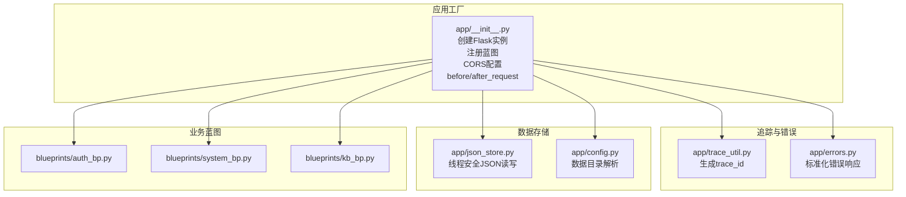
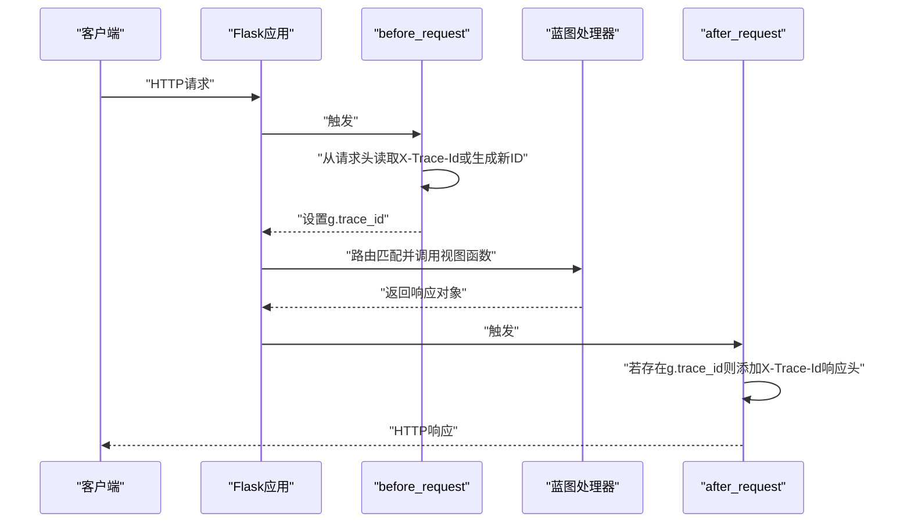
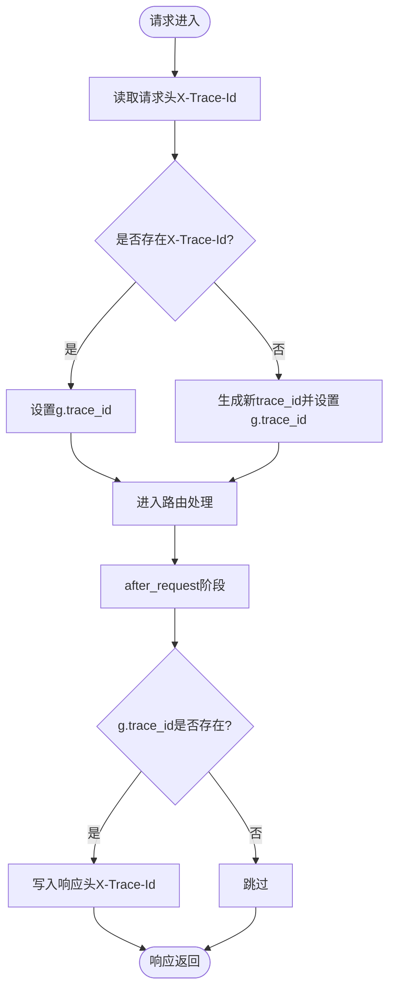
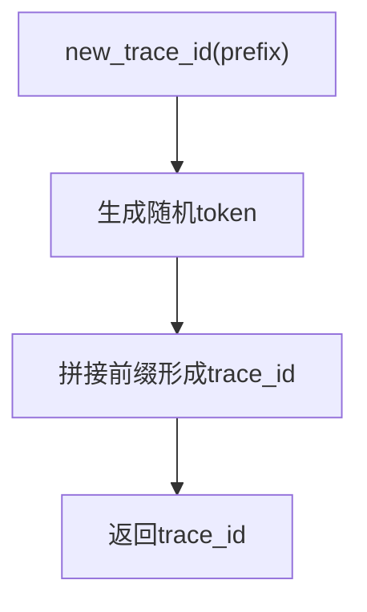
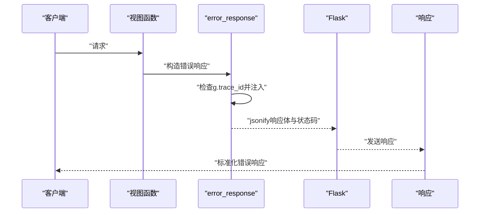
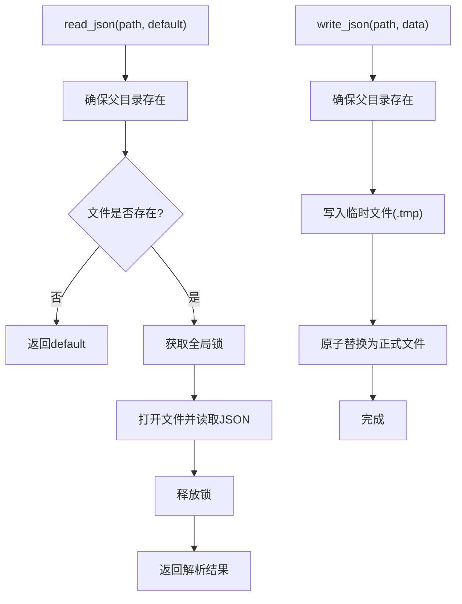
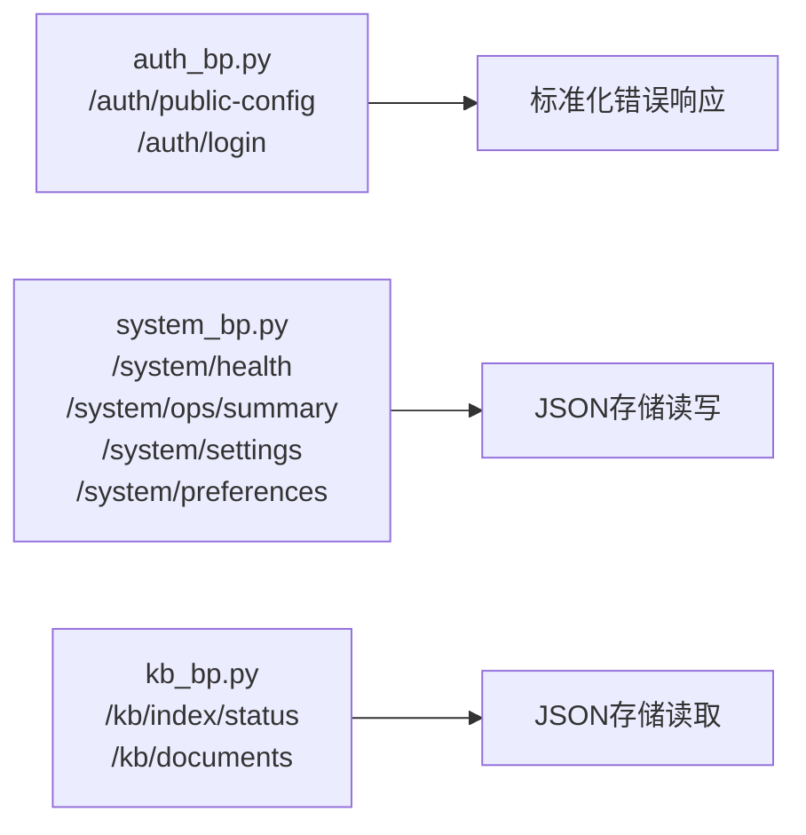
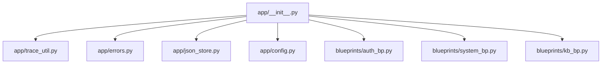

# 中间件与错误处理

<cite>
**本文引用的文件**
- [app/__init__.py](file://main-project/backend/app/__init__.py)
- [app/trace_util.py](file://main-project/backend/app/trace_util.py)
- [app/errors.py](file://main-project/backend/app/errors.py)
- [app/json_store.py](file://main-project/backend/app/json_store.py)
- [app/config.py](file://main-project/backend/app/config.py)
- [app/blueprints/auth_bp.py](file://main-project/backend/app/blueprints/auth_bp.py)
- [app/blueprints/system_bp.py](file://main-project/backend/app/blueprints/system_bp.py)
- [app/blueprints/kb_bp.py](file://main-project/backend/app/blueprints/kb_bp.py)
</cite>

## 目录
1. [简介](#简介)
2. [项目结构](#项目结构)
3. [核心组件](#核心组件)
4. [架构总览](#架构总览)
5. [详细组件分析](#详细组件分析)
6. [依赖分析](#依赖分析)
7. [性能考虑](#性能考虑)
8. [故障排查指南](#故障排查指南)
9. [结论](#结论)
10. [附录](#附录)

## 简介
本文件聚焦于后端Flask应用中的中间件与错误处理机制，涵盖以下主题：
- 请求追踪ID生成与传播
- 跨域资源共享（CORS）配置与处理
- 请求预处理与响应后处理逻辑
- 全局错误响应格式标准化
- JSON存储服务的数据持久化策略
- 错误日志记录、监控指标与告警建议
- 自定义中间件开发指南与错误处理最佳实践
- 实际代码示例路径与调试技巧

## 项目结构
本项目的Flask应用位于 main-project/backend/app，核心中间件与错误处理集中在应用工厂、追踪工具与错误响应函数中；业务蓝图通过统一前缀注册到 /api 与 /api/v1。

**图表来源**
- [app/__init__.py:21-80](file://main-project/backend/app/__init__.py#L21-L80)
- [app/trace_util.py:1-6](file://main-project/backend/app/trace_util.py#L1-L6)
- [app/errors.py:1-10](file://main-project/backend/app/errors.py#L1-L10)
- [app/json_store.py:1-29](file://main-project/backend/app/json_store.py#L1-L29)
- [app/config.py:1-10](file://main-project/backend/app/config.py#L1-L10)
- [app/blueprints/auth_bp.py:1-43](file://main-project/backend/app/blueprints/auth_bp.py#L1-L43)
- [app/blueprints/system_bp.py:1-94](file://main-project/backend/app/blueprints/system_bp.py#L1-L94)
- [app/blueprints/kb_bp.py:1-22](file://main-project/backend/app/blueprints/kb_bp.py#L1-L22)

**章节来源**
- [app/__init__.py:21-80](file://main-project/backend/app/__init__.py#L21-L80)

## 核心组件
- 应用工厂与中间件
  - 创建Flask实例、加载环境变量、配置CORS、注册蓝图
  - before_request设置g.trace_id，after_request回传X-Trace-Id响应头
- 追踪ID生成
  - 使用随机token生成唯一trace_id，支持自定义前缀
- 错误响应标准化
  - 统一错误体结构，自动注入trace_id
- JSON存储服务
  - 原子写入（临时文件+替换）、带锁保护、默认值读取
- 数据目录解析
  - 支持环境变量覆盖数据根目录

**章节来源**
- [app/__init__.py:21-80](file://main-project/backend/app/__init__.py#L21-L80)
- [app/trace_util.py:1-6](file://main-project/backend/app/trace_util.py#L1-L6)
- [app/errors.py:1-10](file://main-project/backend/app/errors.py#L1-L10)
- [app/json_store.py:1-29](file://main-project/backend/app/json_store.py#L1-L29)
- [app/config.py:1-10](file://main-project/backend/app/config.py#L1-L10)

## 架构总览
下图展示请求从进入应用到返回响应的关键路径，以及追踪ID在请求生命周期内的传递。

**图表来源**
- [app/__init__.py:41-49](file://main-project/backend/app/__init__.py#L41-L49)

## 详细组件分析

### 中间件与CORS处理
- CORS配置
  - 对 /api/* 路由启用跨域，允许常见方法与特定头部（含X-Trace-Id）
  - 生产环境建议限制origins为具体域名
- 请求预处理
  - before_request从请求头提取X-Trace-Id，缺失时生成新ID并存入g
- 响应后处理
  - after_request将g.trace_id写入响应头X-Trace-Id，便于客户端与下游链路追踪

**图表来源**
- [app/__init__.py:25-35](file://main-project/backend/app/__init__.py#L25-L35)
- [app/__init__.py:41-49](file://main-project/backend/app/__init__.py#L41-L49)

**章节来源**
- [app/__init__.py:25-35](file://main-project/backend/app/__init__.py#L25-L35)
- [app/__init__.py:41-49](file://main-project/backend/app/__init__.py#L41-L49)

### 请求追踪ID生成
- 生成策略
  - 使用安全随机数生成器，拼接前缀形成唯一ID
- 使用场景
  - 作为请求上下文标识，贯穿日志、错误响应与可观测性

**图表来源**
- [app/trace_util.py:4-5](file://main-project/backend/app/trace_util.py#L4-L5)

**章节来源**
- [app/trace_util.py:1-6](file://main-project/backend/app/trace_util.py#L1-L6)

### 全局异常处理与错误响应格式
- 错误响应函数
  - 统一错误体结构，包含code与message
  - 若g中存在trace_id，自动附加trace_id字段
- 使用示例
  - 认证失败返回401并携带标准化错误体
- 最佳实践
  - 所有业务错误均通过该函数返回，确保一致性
  - 在before_request阶段已生成trace_id，便于问题定位

**图表来源**
- [app/errors.py:4-9](file://main-project/backend/app/errors.py#L4-L9)
- [app/__init__.py:41-49](file://main-project/backend/app/__init__.py#L41-L49)

**章节来源**
- [app/errors.py:1-10](file://main-project/backend/app/errors.py#L1-L10)
- [app/blueprints/auth_bp.py:34-42](file://main-project/backend/app/blueprints/auth_bp.py#L34-L42)

### JSON存储服务与数据持久化
- 设计原则
  - 读取：不存在即返回默认值；加锁保证并发安全
  - 写入：先写临时文件，再原子替换原文件，避免部分写入
- 数据目录
  - 通过环境变量IRA_DATA_DIR或默认data目录确定存储根路径
- 典型使用
  - 系统偏好设置、知识库文档等以JSON形式持久化

**图表来源**
- [app/json_store.py:13-29](file://main-project/backend/app/json_store.py#L13-L29)
- [app/config.py:5-9](file://main-project/backend/app/config.py#L5-L9)

**章节来源**
- [app/json_store.py:1-29](file://main-project/backend/app/json_store.py#L1-L29)
- [app/config.py:1-10](file://main-project/backend/app/config.py#L1-L10)
- [app/blueprints/system_bp.py:84-93](file://main-project/backend/app/blueprints/system_bp.py#L84-L93)
- [app/blueprints/kb_bp.py:18-21](file://main-project/backend/app/blueprints/kb_bp.py#L18-L21)

### 蓝图与请求预处理示例
- 认证蓝图
  - 提供公开配置接口与登录接口；登录失败使用标准化错误响应
- 系统蓝图
  - 健康检查、运行摘要、设置查询与偏好更新；偏好更新使用JSON存储写入
- 知识库蓝图
  - 文档列表读取使用JSON存储

**图表来源**
- [app/blueprints/auth_bp.py:27-42](file://main-project/backend/app/blueprints/auth_bp.py#L27-L42)
- [app/blueprints/system_bp.py:21-39](file://main-project/backend/app/blueprints/system_bp.py#L21-L39)
- [app/blueprints/system_bp.py:42-65](file://main-project/backend/app/blueprints/system_bp.py#L42-L65)
- [app/blueprints/system_bp.py:68-81](file://main-project/backend/app/blueprints/system_bp.py#L68-L81)
- [app/blueprints/system_bp.py:84-93](file://main-project/backend/app/blueprints/system_bp.py#L84-L93)
- [app/blueprints/kb_bp.py:13-21](file://main-project/backend/app/blueprints/kb_bp.py#L13-L21)

**章节来源**
- [app/blueprints/auth_bp.py:1-43](file://main-project/backend/app/blueprints/auth_bp.py#L1-L43)
- [app/blueprints/system_bp.py:1-94](file://main-project/backend/app/blueprints/system_bp.py#L1-L94)
- [app/blueprints/kb_bp.py:1-22](file://main-project/backend/app/blueprints/kb_bp.py#L1-L22)

## 依赖分析
- 组件耦合
  - 应用工厂集中管理中间件与蓝图注册，低耦合高内聚
  - 追踪与错误响应被广泛复用，形成统一的可观测与错误处理基线
- 外部依赖
  - Flask、flask_cors、python-dotenv（按需）
- 关键依赖链
  - before_request → g.trace_id → after_request响应头 → 错误响应函数 → 统一trace_id注入

**图表来源**
- [app/__init__.py:21-80](file://main-project/backend/app/__init__.py#L21-L80)
- [app/trace_util.py:1-6](file://main-project/backend/app/trace_util.py#L1-L6)
- [app/errors.py:1-10](file://main-project/backend/app/errors.py#L1-L10)
- [app/json_store.py:1-29](file://main-project/backend/app/json_store.py#L1-L29)
- [app/config.py:1-10](file://main-project/backend/app/config.py#L1-L10)
- [app/blueprints/auth_bp.py:1-43](file://main-project/backend/app/blueprints/auth_bp.py#L1-L43)
- [app/blueprints/system_bp.py:1-94](file://main-project/backend/app/blueprints/system_bp.py#L1-L94)
- [app/blueprints/kb_bp.py:1-22](file://main-project/backend/app/blueprints/kb_bp.py#L1-L22)

**章节来源**
- [app/__init__.py:21-80](file://main-project/backend/app/__init__.py#L21-L80)

## 性能考虑
- 并发安全
  - JSON写入采用临时文件+替换与全局锁，避免竞态条件；建议在高并发场景评估锁粒度与I/O瓶颈
- CORS开销
  - 允许通配符origins与headers在开发友好，生产需收敛以减少预检请求成本
- 追踪ID生成
  - 使用安全随机数生成，开销极低；建议保持默认前缀与长度以兼顾唯一性与可读性

## 故障排查指南
- 无法获取X-Trace-Id
  - 检查before_request是否执行、请求头是否正确传递、响应头是否被下游代理丢弃
  - 参考路径：[app/__init__.py:41-49](file://main-project/backend/app/__init__.py#L41-L49)
- 登录失败但未返回trace_id
  - 确认错误响应函数被调用且g.trace_id存在
  - 参考路径：[app/errors.py:4-9](file://main-project/backend/app/errors.py#L4-L9)，[app/blueprints/auth_bp.py:34-42](file://main-project/backend/app/blueprints/auth_bp.py#L34-L42)
- JSON写入失败或数据损坏
  - 检查数据目录权限、磁盘空间、锁竞争；确认临时文件替换流程
  - 参考路径：[app/json_store.py:13-29](file://main-project/backend/app/json_store.py#L13-L29)，[app/config.py:5-9](file://main-project/backend/app/config.py#L5-L9)
- CORS跨域失败
  - 核对允许的origins、methods与headers，生产环境避免通配符
  - 参考路径：[app/__init__.py:25-35](file://main-project/backend/app/__init__.py#L25-L35)

**章节来源**
- [app/__init__.py:25-35](file://main-project/backend/app/__init__.py#L25-L35)
- [app/__init__.py:41-49](file://main-project/backend/app/__init__.py#L41-L49)
- [app/errors.py:4-9](file://main-project/backend/app/errors.py#L4-L9)
- [app/blueprints/auth_bp.py:34-42](file://main-project/backend/app/blueprints/auth_bp.py#L34-L42)
- [app/json_store.py:13-29](file://main-project/backend/app/json_store.py#L13-L29)
- [app/config.py:5-9](file://main-project/backend/app/config.py#L5-L9)

## 结论
本项目通过集中式的中间件与错误处理机制，实现了统一的请求追踪、跨域支持与错误响应格式。JSON存储服务提供了简单可靠的本地数据持久化能力。建议在生产环境中收紧CORS配置、完善日志与监控埋点，并结合trace_id进行端到端问题定位。

## 附录
- 自定义中间件开发指南
  - 建议在应用工厂中新增before_request/after_request钩子，遵循现有g.trace_id约定
  - 参考路径：[app/__init__.py:41-49](file://main-project/backend/app/__init__.py#L41-L49)
- 错误处理最佳实践
  - 统一使用标准化错误响应函数，确保trace_id一致注入
  - 参考路径：[app/errors.py:4-9](file://main-project/backend/app/errors.py#L4-L9)
- 调试技巧
  - 在before_request中打印g.trace_id，核对请求头与响应头传递
  - 使用浏览器开发者工具查看CORS预检与响应头
  - 参考路径：[app/__init__.py:25-35](file://main-project/backend/app/__init__.py#L25-L35)，[app/__init__.py:41-49](file://main-project/backend/app/__init__.py#L41-L49)