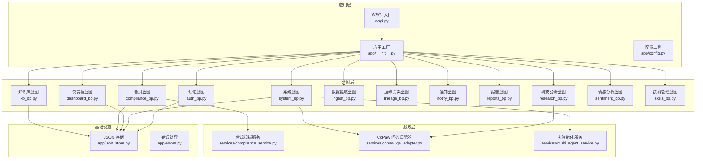
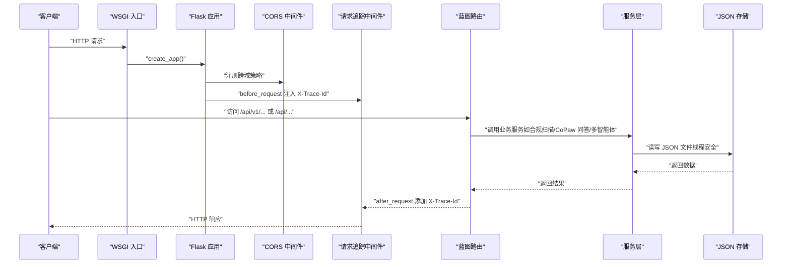
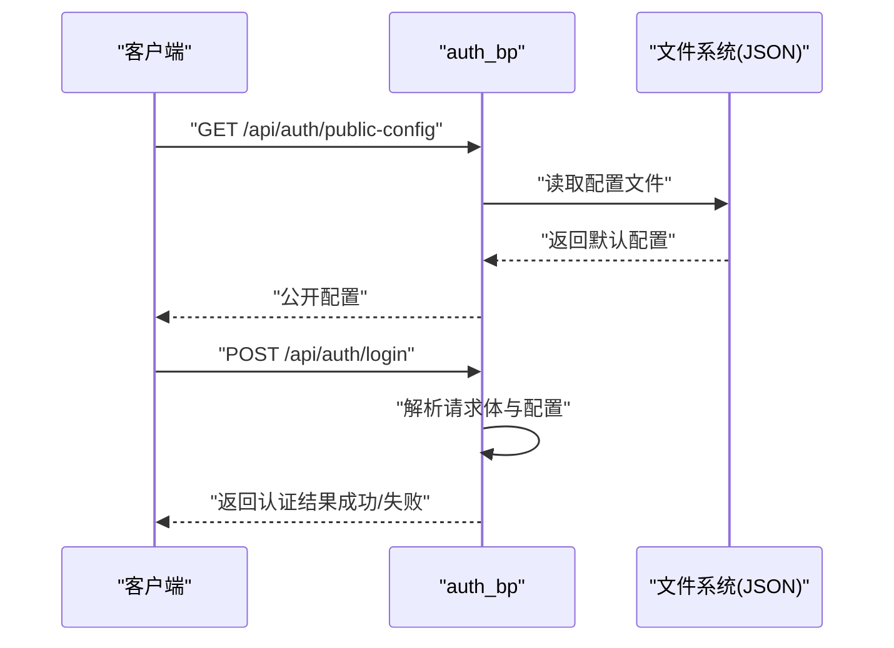
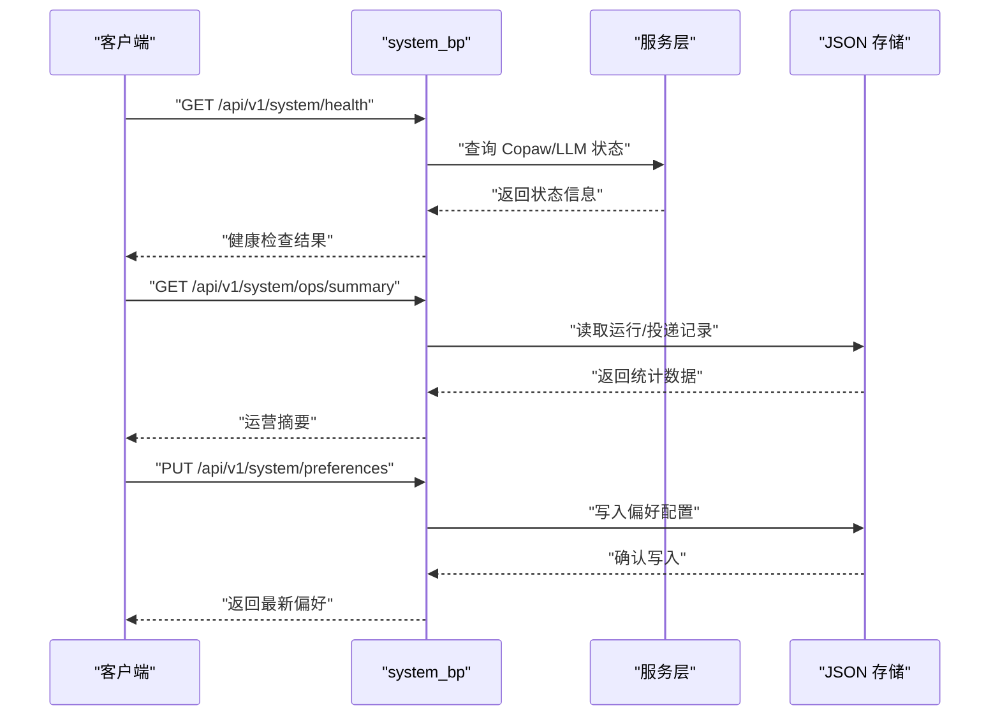
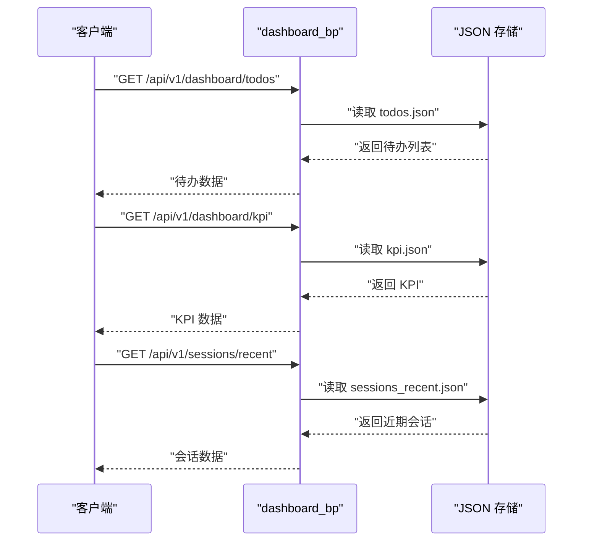
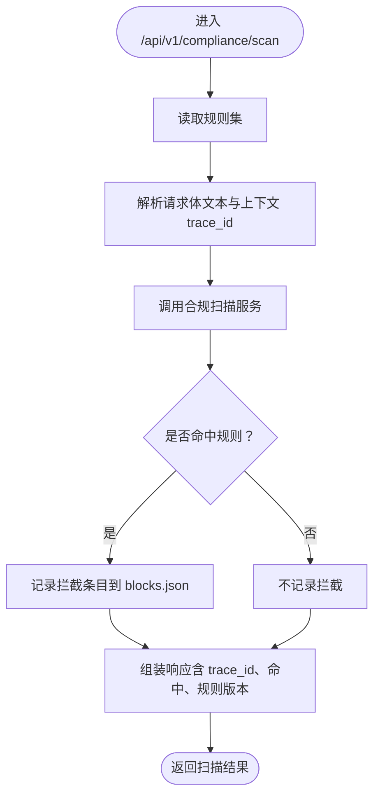
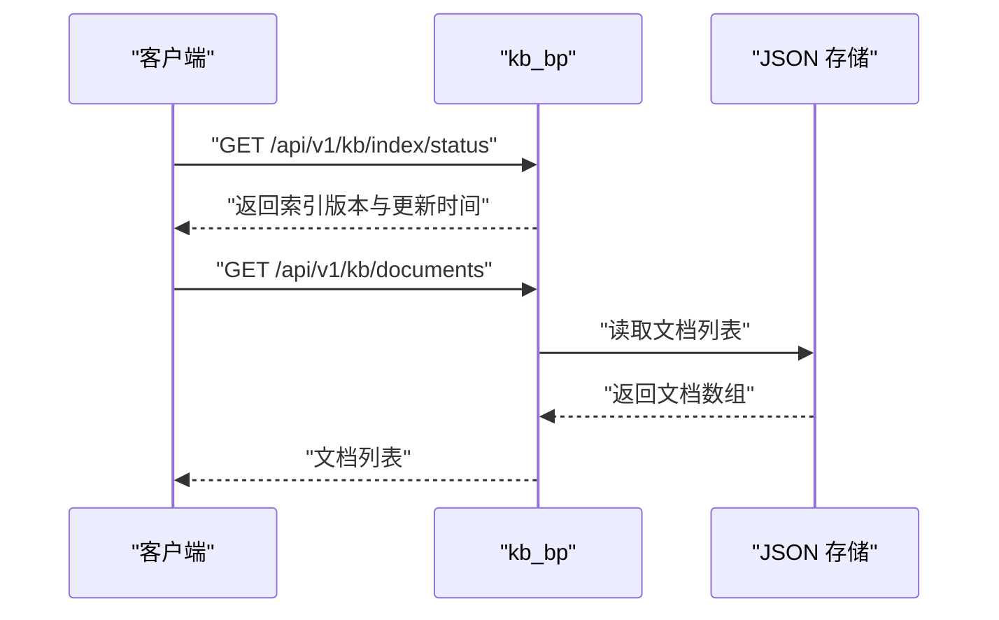
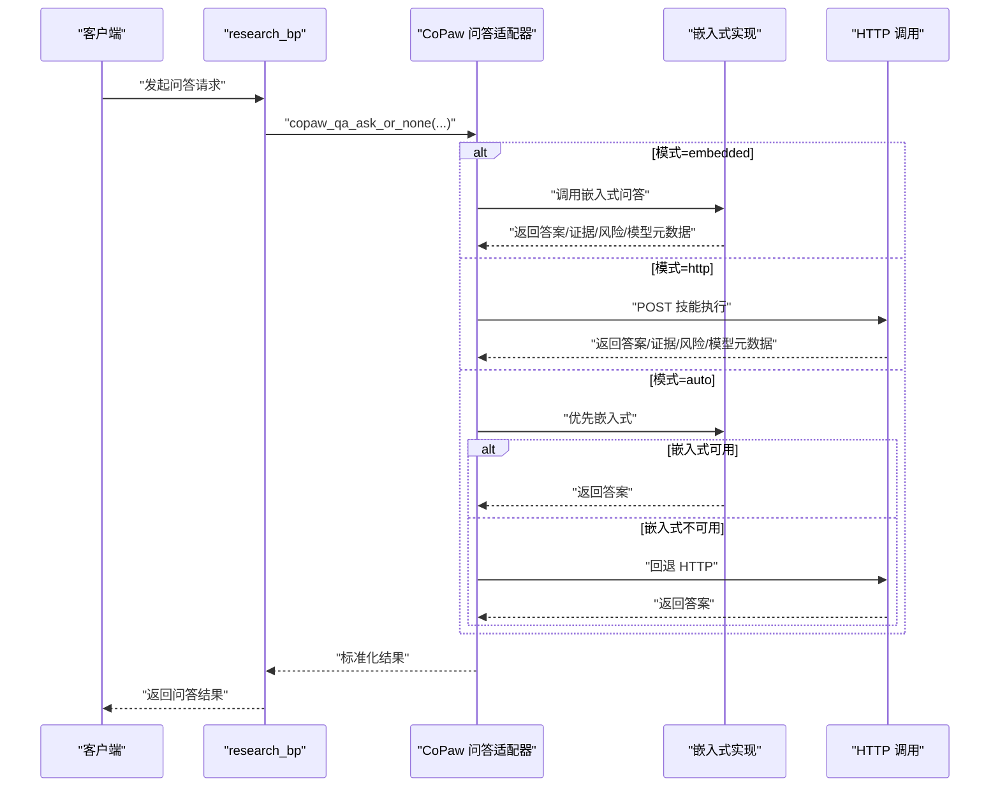
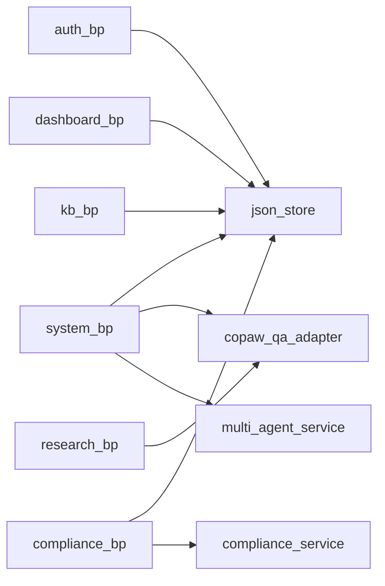

# 后端架构

<cite>
**本文引用的文件**
- [main-project/backend/app/__init__.py](file://main-project/backend/app/__init__.py)
- [main-project/backend/app/config.py](file://main-project/backend/app/config.py)
- [main-project/backend/wsgi.py](file://main-project/backend/wsgi.py)
- [main-project/backend/app/blueprints/auth_bp.py](file://main-project/backend/app/blueprints/auth_bp.py)
- [main-project/backend/app/blueprints/system_bp.py](file://main-project/backend/app/blueprints/system_bp.py)
- [main-project/backend/app/blueprints/dashboard_bp.py](file://main-project/backend/app/blueprints/dashboard_bp.py)
- [main-project/backend/app/blueprints/compliance_bp.py](file://main-project/backend/app/blueprints/compliance_bp.py)
- [main-project/backend/app/blueprints/kb_bp.py](file://main-project/backend/app/blueprints/kb_bp.py)
- [main-project/backend/app/blueprints/ingest_bp.py](file://main-project/backend/app/blueprints/ingest_bp.py)
- [main-project/backend/app/blueprints/lineage_bp.py](file://main-project/backend/app/blueprints/lineage_bp.py)
- [main-project/backend/app/blueprints/notify_bp.py](file://main-project/backend/app/blueprints/notify_bp.py)
- [main-project/backend/app/blueprints/reports_bp.py](file://main-project/backend/app/blueprints/reports_bp.py)
- [main-project/backend/app/blueprints/research_bp.py](file://main-project/backend/app/blueprints/research_bp.py)
- [main-project/backend/app/blueprints/sentiment_bp.py](file://main-project/backend/app/blueprints/sentiment_bp.py)
- [main-project/backend/app/blueprints/skills_bp.py](file://main-project/backend/app/blueprints/skills_bp.py)
- [main-project/backend/app/services/compliance_service.py](file://main-project/backend/app/services/compliance_service.py)
- [main-project/backend/app/services/copaw_qa_adapter.py](file://main-project/backend/app/services/copaw_qa_adapter.py)
- [main-project/backend/app/services/multi_agent_service.py](file://main-project/backend/app/services/multi_agent_service.py)
- [main-project/backend/app/json_store.py](file://main-project/backend/app/json_store.py)
- [main-project/backend/app/errors.py](file://main-project/backend/app/errors.py)
</cite>

## 目录
1. 引言
2. 项目结构
3. 核心组件
4. 架构总览
5. 详细组件分析
6. 依赖分析
7. 性能考虑
8. 故障排查指南
9. 结论
10. 附录

## 引言
本技术文档面向后端架构，聚焦于基于 Flask 的微服务式应用设计，系统化阐述蓝图（Blueprint）组织方式、路由分层、服务层适配器模式与外部系统集成、配置与中间件、错误处理机制、WSGI 部署与性能优化建议，并给出可落地的最佳实践与图示指引。

## 项目结构
后端采用“应用工厂 + 蓝图 + 服务层”的分层组织方式：
- 应用工厂负责初始化 Flask 实例、加载环境变量、注册蓝图、设置 CORS 和请求/响应中间件。
- 蓝图按功能域划分，每个蓝图独立定义路由与视图函数，职责清晰。
- 服务层封装业务逻辑与外部系统适配，支持可插拔的实现（如 CoPaw、Bailian 等）。
- JSON 存储提供线程安全的本地文件读写能力，支撑演示数据与偏好配置。
- 错误处理统一返回结构，自动携带追踪 ID，便于问题定位。

图表来源
- [main-project/backend/wsgi.py:1-7](file://main-project/backend/wsgi.py#L1-L7)
- [main-project/backend/app/__init__.py:21-79](file://main-project/backend/app/__init__.py#L21-L79)
- [main-project/backend/app/blueprints/auth_bp.py:1-43](file://main-project/backend/app/blueprints/auth_bp.py#L1-L43)
- [main-project/backend/app/blueprints/system_bp.py:1-94](file://main-project/backend/app/blueprints/system_bp.py#L1-L94)
- [main-project/backend/app/blueprints/dashboard_bp.py:1-29](file://main-project/backend/app/blueprints/dashboard_bp.py#L1-L29)
- [main-project/backend/app/blueprints/compliance_bp.py:1-54](file://main-project/backend/app/blueprints/compliance_bp.py#L1-L54)
- [main-project/backend/app/blueprints/kb_bp.py:1-22](file://main-project/backend/app/blueprints/kb_bp.py#L1-L22)
- [main-project/backend/app/services/compliance_service.py:1-19](file://main-project/backend/app/services/compliance_service.py#L1-L19)
- [main-project/backend/app/services/copaw_qa_adapter.py:1-232](file://main-project/backend/app/services/copaw_qa_adapter.py#L1-L232)
- [main-project/backend/app/services/multi_agent_service.py:1-150](file://main-project/backend/app/services/multi_agent_service.py#L1-L150)
- [main-project/backend/app/json_store.py:1-29](file://main-project/backend/app/json_store.py#L1-L29)
- [main-project/backend/app/errors.py:1-10](file://main-project/backend/app/errors.py#L1-L10)

章节来源
- [main-project/backend/app/__init__.py:21-79](file://main-project/backend/app/__init__.py#L21-L79)
- [main-project/backend/app/config.py:1-10](file://main-project/backend/app/config.py#L1-L10)
- [main-project/backend/wsgi.py:1-7](file://main-project/backend/wsgi.py#L1-L7)

## 核心组件
- 应用工厂与中间件
  - 加载 .env（仓库根与 backend 两处），注册 CORS（允许跨域、指定方法与头），注入 X-Trace-Id 请求追踪。
  - 注册全部蓝图，按版本前缀分层：/api、/api/v1。
- 配置管理
  - 数据目录通过环境变量或默认路径确定，供各蓝图持久化使用。
- 错误处理
  - 统一错误响应结构，自动附加 trace_id，便于端到端追踪。
- JSON 存储
  - 提供线程安全的读写接口，写入采用临时文件 + 原子替换，避免并发写冲突。
- 服务层适配器
  - 合规扫描：最小规则集匹配，便于扩展。
  - CoPaw 问答适配器：支持 off/http/embedded/auto 四种模式，优先嵌入式，失败回退 HTTP。
  - 多智能体服务：模拟多 Agent 讨论与合并输出，便于演示与联调。

章节来源
- [main-project/backend/app/__init__.py:9-49](file://main-project/backend/app/__init__.py#L9-L49)
- [main-project/backend/app/config.py:5-10](file://main-project/backend/app/config.py#L5-L10)
- [main-project/backend/app/errors.py:4-9](file://main-project/backend/app/errors.py#L4-L9)
- [main-project/backend/app/json_store.py:13-29](file://main-project/backend/app/json_store.py#L13-L29)
- [main-project/backend/app/services/compliance_service.py:9-19](file://main-project/backend/app/services/compliance_service.py#L9-L19)
- [main-project/backend/app/services/copaw_qa_adapter.py:22-232](file://main-project/backend/app/services/copaw_qa_adapter.py#L22-L232)
- [main-project/backend/app/services/multi_agent_service.py:8-150](file://main-project/backend/app/services/multi_agent_service.py#L8-L150)

## 架构总览
下图展示从 WSGI 到蓝图与服务层的调用链路，以及关键中间件与配置点：

图表来源
- [main-project/backend/wsgi.py:1-7](file://main-project/backend/wsgi.py#L1-L7)
- [main-project/backend/app/__init__.py:21-49](file://main-project/backend/app/__init__.py#L21-L49)
- [main-project/backend/app/blueprints/compliance_bp.py:22-47](file://main-project/backend/app/blueprints/compliance_bp.py#L22-L47)
- [main-project/backend/app/services/compliance_service.py:9-19](file://main-project/backend/app/services/compliance_service.py#L9-L19)
- [main-project/backend/app/services/copaw_qa_adapter.py:175-232](file://main-project/backend/app/services/copaw_qa_adapter.py#L175-L232)
- [main-project/backend/app/services/multi_agent_service.py:8-150](file://main-project/backend/app/services/multi_agent_service.py#L8-L150)
- [main-project/backend/app/json_store.py:13-29](file://main-project/backend/app/json_store.py#L13-L29)

## 详细组件分析

### 蓝图系统与路由组织
- 路由前缀与版本控制
  - /api 文档类蓝图
  - /api/v1 业务类蓝图（认证、系统、仪表板、合规、血缘、研究、情感、通知、知识库、数据摄取、报告、技能管理）
- 设计要点
  - 每个蓝图自包含路由与视图，降低耦合。
  - 通过 url_prefix 将不同领域路由隔离，便于演进与权限控制。

章节来源
- [main-project/backend/app/__init__.py:65-77](file://main-project/backend/app/__init__.py#L65-L77)

### 认证蓝图（auth_bp）
- 功能职责
  - 提供公开配置接口，返回默认用户名与密码（可被环境变量覆盖）。
  - 提供登录接口，校验用户名与密码，返回认证结果。
- 关键流程

图表来源
- [main-project/backend/app/blueprints/auth_bp.py:27-42](file://main-project/backend/app/blueprints/auth_bp.py#L27-L42)

章节来源
- [main-project/backend/app/blueprints/auth_bp.py:15-42](file://main-project/backend/app/blueprints/auth_bp.py#L15-L42)

### 系统蓝图（system_bp）
- 功能职责
  - 健康检查：返回 LLM 与桥接状态、Copaw 多智能体配置状态。
  - 运营摘要：统计多智能体运行与通知投递状态。
  - 设置查询与偏好更新：读取/写入工作区偏好 JSON。
- 关键流程

图表来源
- [main-project/backend/app/blueprints/system_bp.py:21-93](file://main-project/backend/app/blueprints/system_bp.py#L21-L93)
- [main-project/backend/app/services/copaw_qa_adapter.py:41-66](file://main-project/backend/app/services/copaw_qa_adapter.py#L41-L66)
- [main-project/backend/app/services/multi_agent_service.py:8-150](file://main-project/backend/app/services/multi_agent_service.py#L8-L150)
- [main-project/backend/app/json_store.py:13-29](file://main-project/backend/app/json_store.py#L13-L29)

章节来源
- [main-project/backend/app/blueprints/system_bp.py:21-93](file://main-project/backend/app/blueprints/system_bp.py#L21-L93)

### 仪表板蓝图（dashboard_bp）
- 功能职责
  - 待办事项、KPI 指标、近期会话等数据读取。
- 关键流程

图表来源
- [main-project/backend/app/blueprints/dashboard_bp.py:13-28](file://main-project/backend/app/blueprints/dashboard_bp.py#L13-L28)
- [main-project/backend/app/json_store.py:13-29](file://main-project/backend/app/json_store.py#L13-L29)

章节来源
- [main-project/backend/app/blueprints/dashboard_bp.py:13-28](file://main-project/backend/app/blueprints/dashboard_bp.py#L13-L28)

### 合规蓝图（compliance_bp）
- 功能职责
  - 获取规则集、提交文本进行扫描、查看最近拦截记录。
- 关键流程

图表来源
- [main-project/backend/app/blueprints/compliance_bp.py:22-47](file://main-project/backend/app/blueprints/compliance_bp.py#L22-L47)
- [main-project/backend/app/services/compliance_service.py:9-19](file://main-project/backend/app/services/compliance_service.py#L9-L19)
- [main-project/backend/app/json_store.py:13-29](file://main-project/backend/app/json_store.py#L13-L29)

章节来源
- [main-project/backend/app/blueprints/compliance_bp.py:16-53](file://main-project/backend/app/blueprints/compliance_bp.py#L16-L53)
- [main-project/backend/app/services/compliance_service.py:9-19](file://main-project/backend/app/services/compliance_service.py#L9-L19)

### 知识库蓝图（kb_bp）
- 功能职责
  - 查询索引状态与文档列表。
- 关键流程

图表来源
- [main-project/backend/app/blueprints/kb_bp.py:13-21](file://main-project/backend/app/blueprints/kb_bp.py#L13-L21)
- [main-project/backend/app/json_store.py:13-29](file://main-project/backend/app/json_store.py#L13-L29)

章节来源
- [main-project/backend/app/blueprints/kb_bp.py:13-21](file://main-project/backend/app/blueprints/kb_bp.py#L13-L21)

### 研究分析蓝图（research_bp）
- 功能职责
  - 与 CoPaw 问答适配器协作，按配置模式选择嵌入式或 HTTP 调用，兼容多种返回字段。
- 关键流程

图表来源
- [main-project/backend/app/services/copaw_qa_adapter.py:175-232](file://main-project/backend/app/services/copaw_qa_adapter.py#L175-L232)
- [main-project/backend/app/services/copaw_qa_adapter.py:105-173](file://main-project/backend/app/services/copaw_qa_adapter.py#L105-L173)

章节来源
- [main-project/backend/app/services/copaw_qa_adapter.py:22-232](file://main-project/backend/app/services/copaw_qa_adapter.py#L22-L232)

### 其他蓝图（概览）
- 数据摄取（ingest_bp）、血缘关系（lineage_bp）、通知（notify_bp）、报告（reports_bp）、情感分析（sentiment_bp）、技能管理（skills_bp）
  - 各自提供与领域相关的路由与视图，遵循相同蓝图组织方式，便于扩展与维护。
- 文档蓝图（docs_bp）
  - 提供 OpenAPI/Swagger 文档访问，位于 /api 路径前缀下。

章节来源
- [main-project/backend/app/blueprints/ingest_bp.py](file://main-project/backend/app/blueprints/ingest_bp.py)
- [main-project/backend/app/blueprints/lineage_bp.py](file://main-project/backend/app/blueprints/lineage_bp.py)
- [main-project/backend/app/blueprints/notify_bp.py](file://main-project/backend/app/blueprints/notify_bp.py)
- [main-project/backend/app/blueprints/reports_bp.py](file://main-project/backend/app/blueprints/reports_bp.py)
- [main-project/backend/app/blueprints/sentiment_bp.py](file://main-project/backend/app/blueprints/sentiment_bp.py)
- [main-project/backend/app/blueprints/skills_bp.py](file://main-project/backend/app/blueprints/skills_bp.py)
- [main-project/backend/app/blueprints/docs_bp.py](file://main-project/backend/app/blueprints/docs_bp.py)

## 依赖分析
- 组件内聚与耦合
  - 蓝图与服务层通过函数调用解耦，服务层内部可进一步拆分。
  - JSON 存储为共享依赖，所有需要持久化的蓝图均依赖其读写能力。
- 外部依赖与集成
  - CoPaw 问答适配器支持三种模式，具备可插拔特性，便于在不同环境切换。
  - 合规扫描服务采用正则规则，易于扩展规则集。
- 潜在循环依赖
  - 当前结构以蓝图调用服务为主，未见明显循环依赖迹象。

图表来源
- [main-project/backend/app/blueprints/auth_bp.py:1-43](file://main-project/backend/app/blueprints/auth_bp.py#L1-L43)
- [main-project/backend/app/blueprints/system_bp.py:1-94](file://main-project/backend/app/blueprints/system_bp.py#L1-L94)
- [main-project/backend/app/blueprints/dashboard_bp.py:1-29](file://main-project/backend/app/blueprints/dashboard_bp.py#L1-L29)
- [main-project/backend/app/blueprints/compliance_bp.py:1-54](file://main-project/backend/app/blueprints/compliance_bp.py#L1-L54)
- [main-project/backend/app/blueprints/kb_bp.py:1-22](file://main-project/backend/app/blueprints/kb_bp.py#L1-L22)
- [main-project/backend/app/services/compliance_service.py:1-19](file://main-project/backend/app/services/compliance_service.py#L1-L19)
- [main-project/backend/app/services/copaw_qa_adapter.py:1-232](file://main-project/backend/app/services/copaw_qa_adapter.py#L1-L232)
- [main-project/backend/app/services/multi_agent_service.py:1-150](file://main-project/backend/app/services/multi_agent_service.py#L1-L150)
- [main-project/backend/app/json_store.py:1-29](file://main-project/backend/app/json_store.py#L1-L29)

## 性能考虑
- 并发与锁
  - JSON 存储使用全局锁保护读写，原型阶段有效，生产环境建议迁移到数据库或带事务的存储。
- 跨域与头部
  - CORS 默认允许所有来源，生产环境应限定具体域名并审慎放行必要头。
- 适配器回退
  - CoPaw 适配器在嵌入式不可用时回退 HTTP，建议在生产环境固定模式以减少分支开销。
- 日志与追踪
  - 建议在生产环境接入结构化日志与分布式追踪（如 Jaeger/Zipkin），结合 X-Trace-Id 进行关联。
- 部署建议
  - 使用 Gunicorn/uWSGI 运行多个 worker，结合进程级并发与异步 I/O（如 aiohttp）提升吞吐。
  - 对静态资源与文档接口启用缓存与 CDN。

## 故障排查指南
- 统一错误响应
  - 所有错误均返回包含错误码与消息的结构，并在 g 上下文中携带 trace_id，便于前端与后端联动定位。
- 常见问题定位
  - 认证失败：检查 /api/auth/public-config 与 /api/auth/login 的用户名/密码配置，确认环境变量覆盖生效。
  - 合规扫描未命中：确认规则集文件存在且格式正确，检查扫描服务规则匹配逻辑。
  - CoPaw 问答异常：根据 /api/v1/system/health 返回的桥接状态判断模式配置是否正确，检查网络连通性与超时设置。
  - 健康检查异常：确认数据目录可写，JSON 文件读写正常。
- 最佳实践
  - 在 before_request 中注入 trace_id，在 after_request 中透传，确保端到端可观测。
  - 对外暴露的接口尽量幂等，对写操作增加重试与去重策略。

章节来源
- [main-project/backend/app/errors.py:4-9](file://main-project/backend/app/errors.py#L4-L9)
- [main-project/backend/app/__init__.py:41-49](file://main-project/backend/app/__init__.py#L41-L49)
- [main-project/backend/app/blueprints/auth_bp.py:27-42](file://main-project/backend/app/blueprints/auth_bp.py#L27-L42)
- [main-project/backend/app/blueprints/compliance_bp.py:22-47](file://main-project/backend/app/blueprints/compliance_bp.py#L22-L47)
- [main-project/backend/app/services/copaw_qa_adapter.py:41-66](file://main-project/backend/app/services/copaw_qa_adapter.py#L41-L66)

## 结论
该后端架构以 Flask 为基础，采用蓝图分层与服务适配器模式，实现了认证、合规、仪表板、文档、数据摄取、知识库、血缘关系、通知、报告、研究分析、情感分析、技能管理与系统管理等模块的清晰分离。通过统一的中间件与错误处理机制，配合可插拔的外部系统适配，既满足了快速迭代需求，也为后续扩展与生产化部署打下良好基础。

## 附录
- WSGI 部署
  - 使用 wsgi.py 作为入口，结合 Gunicorn/uWSGI 启动多进程/多线程实例，建议在容器中以非 root 用户运行并限制资源。
- 配置清单
  - 数据目录：通过环境变量 IRA_DATA_DIR 指定，默认指向仓库 data 目录。
  - 登录配置：通过 config/auth_login.json 提供默认凭据，可通过环境变量覆盖密码。
  - CoPaw 模式：通过环境变量控制（off/http/embedded/auto），并设置超时与鉴权参数。
- 最佳实践
  - 将 JSON 存储替换为数据库或对象存储，提升并发与可靠性。
  - 为所有外部调用增加超时与熔断策略，避免级联故障。
  - 对敏感接口增加鉴权与限流，生产环境关闭 CORS 的通配来源。